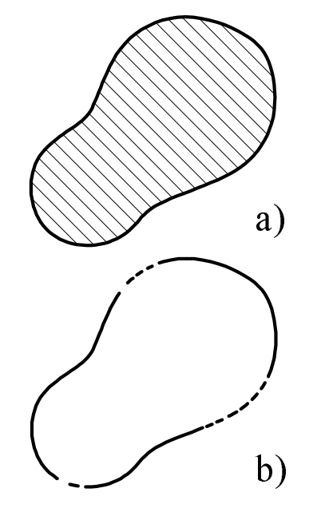
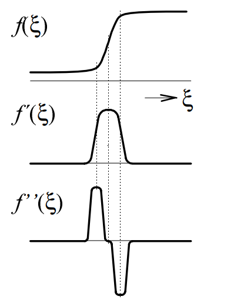
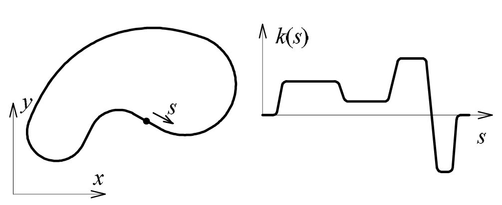
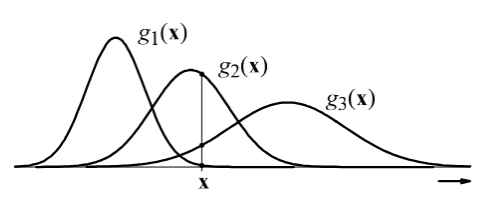
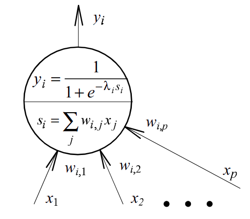

# ANO

- [1. Segmentace obrazu](#1-segmentace-obrazu)
  - [1.1. Detekce hran](#11-detekce-hran)
  - [1.2. Metody průchodu nulou](#12-metody-průchodu-nulou)
  - [1.3. Cannyho detektor hran](#13-cannyho-detektor-hran)
- [2. OpenCV](#2-opencv)
- [3. Hough transformace](#3-hough-transformace)
- [4. Detekce význačných bodů (keypoints)](#4-detekce-význačných-bodů-keypoints)
- [5. Obrazové příznaky](#5-obrazové-příznaky)
  - [5.1. Kruhovost](#51-kruhovost)
  - [5.2. Popis tvaru objektu pomocí průběhu křivosti jeho hranice](#52-popis-tvaru-objektu-pomocí-průběhu-křivosti-jeho-hranice)
  - [5.3. Příznaky odvozené z histogramu jasu](#53-příznaky-odvozené-z-histogramu-jasu)
- [6. Příznakové metody analýzy obrazu](#6-příznakové-metody-analýzy-obrazu)
- [7. Neuronové sítě](#7-neuronové-sítě)
- [8. Geometrické transformace obrazu](#8-geometrické-transformace-obrazu)

Univerzální obrazové deskriptory - HoG

## 1. Segmentace obrazu

### 1.1. Detekce hran

Detekce oblastí stanovením hranice:



### 1.2. Metody průchodu nulou

Průběh jasu a jeho první a druhé derivace v místě hrany.



Velikost vektoru gradientů:

$$ \left\lVert \dfrac{\partial f(x,y)}{\partial x}, \dfrac{\partial f(x,y)}{\partial y} \right\rVert_2 $$

Laplacián (pro druhou derivaci):

$$ \dfrac{\partial^2 f(x,y)}{\partial x^2}, \dfrac{\partial^2 f(x,y)}{\partial y^2} $$

### 1.3. Cannyho detektor hran

Výsledná funkce vznikla minimalizací funkcionálu, který měří lokalizační chybu, signal2noise ratio (?)

## 2. OpenCV

Load image:

```cpp
cv::Mat src_8uc3_img = cv::imread( "images/lena.png", cv::IMREAD_COLOR );
cv::Mat src_8uc1_img = cv::imread( "images/lena.png", cv::IMREAD_GRAYSCALE );
```

- One pixel is represented by unsigned char (8 bits).

Conversion to gryscale:

```cpp
cv::cvtColor( src_8uc3_img, gray_8uc1_img, cv::COLOR_BGR2GRAY );
```

Conversion to float $([0,255] \rightarrow [0,1])$:

```cpp
gray_8uc1_img.convertTo( gray_32fc1_img, CV_32FC1, 1.0 / 255.0 );
```

Draw a rectangle:

```cpp
cv::rectangle(gray_8uc1_img,
              cv::Point(65, 84),
              cv::Point(75, 94),
              cv::Scalar(50),
              cv::FILLED);
```

<details><summary> Example: Access pixel values </summary>

- template method `cv::Mat.at<image_type>(int y, int x)`

```cpp
#include <opencv2/opencv.hpp>
#include <iostream>

int main() {
    int x = 0;
    int y = 0;

    // read grayscale value of a pixel, image represented using 8 bits
    uchar p1 = gray_8uc1_img.at<uchar>(y, x);

    // read grayscale value of a pixel, image represented using 32 bits
    float p2 = gray_32fc1_img.at<float>(y, x);

    // read color value of a pixel, image represented using 8 bits per color channel
    cv::Vec3b p3 = src_8uc3_img.at<cv::Vec3b>(y, x);

    // print values of pixels
    printf("p1 = %d\n", p1);
    printf("p2 = %f\n", p2);
    printf("p3[0] = %d, p3[1] = %d, p3[2] = %d\n", p3[0], p3[1], p3[2]);

    // set pixel value to 0 (black)
    gray_8uc1_img.at<uchar>( y, x ) = 0;

    return 0;
}
```

</details>

<details><summary> Example: Creating gradient </summary>

```cpp
// Declare a variable to hold the gradient image with dimensions:
// width = 256 pixels, height = 50 pixels.
// Gray levels wil be represented using 8 bits (uchar).
cv::Mat gradient_8uc1_img( 50, 256, CV_8UC1 );

// For every pixel in image, 
// assign a brightness value
// according to the `x` coordinate.
// This wil create a horizontal gradient.
for ( int y = 0; y < gradient_8uc1_img.rows; y++ ) {
    for ( int x = 0; x < gradient_8uc1_img.cols; x++ ) {
        gradient_8uc1_img.at<uchar>( y, x ) = x;
    }
}

cv::imshow("Gradient", gradient_8uc1_img);
```

</details>

## 3. Hough transformace

- [:háfova:]
- detekce bodů na přímce, kružnici (po detekci hran)

## 4. Detekce význačných bodů (keypoints)

- TODO

## 5. Obrazové příznaky

Dvourozměrný moment řádu $(p,q)$ pro plochu $\Omega$ je:

$$m_{p,q}=\iint\limits_{\Omega}x^py^qf(x,y)\mathrm{d}x\mathrm{d}y$$

V analýze obrazu máme diskrétní obraz a funkce průběhu jasu je obvykle $f(x,y)=1$:

$$m_{p,q}=\sum\limits_{\Omega}x^py^q$$

Plocha: $m_{0,0}$

Těžiště:

$$
\begin{align*}
    x_t&=\dfrac{m_{1,0}}{m_{0,0}}\\
    y_t&=\dfrac{m_{0,1}}{m_{0,0}}
\end{align*}
$$

Pokud uvažujeme souřadnou soustavu s *osami v těžišti*, tak:

$$\mu_{p,q}=\sum\limits_{\Omega}(x-x_t)^p(y-y_t)^qf(x,y)$$

Momenty $\mu_{p,q}$ k těžištním osám *nezávisí na poloze objektu*, ale *závisí na velikosti a rotaci* objektu.

- &#9645; $\Rightarrow\dfrac{\mu_{2,0}}{\mu_{0,2}}$ větší než 1
- &#9647; $\Rightarrow\dfrac{\mu_{2,0}}{\mu_{0,2}}$ menší než 1

Co kdybychom chtěli, aby tento příznak nebyl závislý na rotaci/orientaci? **Hlavní momenty setrvačnosti**: Představ si natočený obdélník, cílem je najít natočený souřadnicový systém takový, že najdeme minimum a maximum:

$$
\begin{array}{c}
    \mu_{\mathrm{max}} \\
    \mu_{\mathrm{min}}
\end{array}
= \frac{1}{2} \left( \mu_{2,0} + \mu_{0,2} \right) \pm \frac{1}{2} \sqrt{ 4 \mu_{1,1}^{2} + \left( \mu_{2,0} - \mu_{0,2} \right)^2 }.
$$

### 5.1. Kruhovost

Buď $P$ délka hranice objektu a $S$ jeho plocha. Kruhovost definujeme $\boxed{C=\dfrac{P^2}{S}.}$

### 5.2. Popis tvaru objektu pomocí průběhu křivosti jeho hranice

Průběh křivosti:



Buď $P$ délka hranice objektu a $k$ funkce křivosti hranice objektu. Informace o křivosti můžeme komprimovat do jedné hodnoty:

$$\dfrac{1}{P}\int\limits_{s}\big(k(s)\big)^2\mathrm{d}s.$$

Pokud je jedno číslo málo, můžeme vzít $n$ prvních členů **Fourierovy řady** (nejčastěji $\approx 5$).

### 5.3. Příznaky odvozené z histogramu jasu

Vhodné pro objekty, které jsou charakteristické svojí texturou nebo jistým rozložením jasu. Buď $b$ jas pixelu, vypočteme histogram pixelů objektu $N(b)$ a provedem normalizaci $p(b)=N(b)/N$.

- střední hodnota,
- rozptyl,
- šikmost,
- křivost
- entropie,
- energie (kontrast).

## 6. Příznakové metody analýzy obrazu

Klasifikátorem rozumíme zobrazení $f\colon\mathcal{X}\rightarrow\omega$, kde $\mathcal{X}$ je matice příznaků a $\omega$ je vektor tříd, i.e., $\omega=f(\mathbf{x})$.

Klasifikace diskriminačními funkcemi:



Jednotlivé hustoty odpovídají podmíněné pravděpodobnosti $g_r(\mathbb{x})=\mathcal{P}(\mathbb{x}|\omega_{r})$, kde $r$ je index třídy.

Dále jsme schopni definovat funkce pro každou třídu a minimalizovat plochu pod křivkou (integrál). Dá se ukázat, že tato diskriminační funkce má tvar asi $\mathcal{P}(x|\omega_r)\mathcal{P}(\omega_r)$.

## 7. Neuronové sítě



## 8. Geometrické transformace obrazu

- Skripta strana 56.

Afiní transformace, zachovává rovnoběžnost (ortografický pohled):

$$y=Ax+t$$

Perspektivní transformace:

$$y=Px,$$

kde $P\in\mathbb{R^{4,4}}$. Např.

$$y=Px=\begin{bmatrix}
    1 & 0 & 0 & 0\\
    0 & 1 & 0 & 0\\
    0 & 0 & 1 & 0\\
    0 & 0 & 0 & 1\\
\end{bmatrix}\begin{bmatrix}
    x\\
    y\\
    z\\
    1
\end{bmatrix},$$

do matice $P$ je možné "dát" translaci $t$.
