# Analýza obrazu

- [1. Segmentace obrazu](#1-segmentace-obrazu)
  - [1.1. Detekce hran s využitím gradientu](#11-detekce-hran-s-využitím-gradientu)
    - [1.1.1. Sobelův filtr](#111-sobelův-filtr)
  - [1.2. Detekce hran hledáním průchodu nulou (též varianta s předchozím rozostřením)](#12-detekce-hran-hledáním-průchodu-nulou-též-varianta-s-předchozím-rozostřením)
  - [1.3. Základní myšlenky Cannyho detekce hran](#13-základní-myšlenky-cannyho-detekce-hran)
    - [1.3.1. Prahování](#131-prahování)
  - [1.4. Segmentace pomocí prahování](#14-segmentace-pomocí-prahování)
  - [1.5. Matematická morfologie](#15-matematická-morfologie)
    - [1.5.1. Dilatace (Dilation)](#151-dilatace-dilation)
    - [1.5.2. Eroze (Errosion)](#152-eroze-errosion)
    - [1.5.3. Otevření (Opening)](#153-otevření-opening)
    - [1.5.4. Uzavření (Closing)](#154-uzavření-closing)
    - [1.5.5. Morfologický gradient](#155-morfologický-gradient)
  - [1.6. Detekce rohů](#16-detekce-rohů)
  - [1.7. Indexování objektů v binárním obraze](#17-indexování-objektů-v-binárním-obraze)
- [2. Příznakové metody analýzy obrazu](#2-příznakové-metody-analýzy-obrazu)
  - [2.1. Příznaky používané v příznakové analýze obrazů](#21-příznaky-používané-v-příznakové-analýze-obrazů)
    - [2.1.1. Momenty](#211-momenty)
    - [2.1.2. Pravoúhlost a podlouhlost](#212-pravoúhlost-a-podlouhlost)
    - [2.1.3. Kruhovost](#213-kruhovost)
    - [2.1.4. Popis tvaru objektu pomocí průběhu křivosti jeho hranice](#214-popis-tvaru-objektu-pomocí-průběhu-křivosti-jeho-hranice)
    - [2.1.5. Průměrná vzdálenost pixelu od hranice](#215-průměrná-vzdálenost-pixelu-od-hranice)
    - [2.1.6. Příznaky odvozené z histogramu jasu](#216-příznaky-odvozené-z-histogramu-jasu)
  - [2.2. Univerzální příznaky](#22-univerzální-příznaky)
    - [2.2.1. HoG](#221-hog)
    - [2.2.2. Local Binary Patterns (LBP)](#222-local-binary-patterns-lbp)
  - [2.3. Klasifikátor a klasifikace pomocí diskriminačních funkcí](#23-klasifikátor-a-klasifikace-pomocí-diskriminačních-funkcí)
  - [2.4. Klasifikace pomocí etalonů](#24-klasifikace-pomocí-etalonů)
  - [2.5. Stanovení diskriminační funkce metodou minimalizace ztráty](#25-stanovení-diskriminační-funkce-metodou-minimalizace-ztráty)
  - [2.6. Klasifikace pomocí SVM](#26-klasifikace-pomocí-svm)
  - [2.7. Vyhodnocení účinnosti zvolené množiny příznaků a Karhunen-Loéveho transformace (PCA)](#27-vyhodnocení-účinnosti-zvolené-množiny-příznaků-a-karhunen-loéveho-transformace-pca)
- [3. Neuronové sítě](#3-neuronové-sítě)
  - [3.1. Aktivační funkce](#31-aktivační-funkce)
  - [3.2. Dopředný průchod](#32-dopředný-průchod)
  - [3.3. Back propagation](#33-back-propagation)
  - [3.4. Konvoluční neuronové sítě (CNN)](#34-konvoluční-neuronové-sítě-cnn)
  - [3.5. Detekce objektů pomocí sliding window](#35-detekce-objektů-pomocí-sliding-window)
  - [3.6. Komponenty hlubokých CNN](#36-komponenty-hlubokých-cnn)
  - [3.7. Detekce objektů](#37-detekce-objektů)
    - [3.7.1. Sítě pro detekci bez sliding window](#371-sítě-pro-detekci-bez-sliding-window)
    - [3.7.2. Region proposal](#372-region-proposal)
    - [3.7.3. R-CNN](#373-r-cnn)
    - [3.7.4. Fast R-CNN](#374-fast-r-cnn)
    - [3.7.5. Faster R-CNN](#375-faster-r-cnn)
    - [3.7.6. YOLO](#376-yolo)
    - [3.7.7. SSD (Single Shot MultiBox Detector)](#377-ssd-single-shot-multibox-detector)
    - [3.7.8. RetinaNet](#378-retinanet)
  - [3.8. Sítě pro použití s časem](#38-sítě-pro-použití-s-časem)
    - [3.8.1. Rekurentní sítě (RNN)](#381-rekurentní-sítě-rnn)
    - [3.8.2. LSTM](#382-lstm)
    - [3.8.3. Attention](#383-attention)
- [4. Architektury CNN](#4-architektury-cnn)
  - [4.1. LeNet 1995](#41-lenet-1995)
  - [4.2. AlexNet 2012](#42-alexnet-2012)
  - [4.3. ZFNet (2013)](#43-zfnet-2013)
  - [4.4. VGG (2014)](#44-vgg-2014)
  - [4.5. GoogLeNet (2014)](#45-googlenet-2014)
  - [4.6. ResNet (2015)](#46-resnet-2015)
  - [4.7. DenseNet (2017)](#47-densenet-2017)
  - [4.8. MobileNet](#48-mobilenet)
  - [4.9. SqueezeNet](#49-squeezenet)
  - [4.10. EfficientNet](#410-efficientnet)
  - [4.11. Vision Transformer (ViT) (2020)](#411-vision-transformer-vit-2020)
- [5. Zpětná stereoprojekce](#5-zpětná-stereoprojekce)
  - [5.1. Lineární model kamery](#51-lineární-model-kamery)
    - [5.1.1. Perspektivní transformace](#511-perspektivní-transformace)
    - [5.1.2. Souřadnicová transformace](#512-souřadnicová-transformace)
    - [5.1.3. Projekční matice](#513-projekční-matice)
    - [5.1.4. Kalibrace](#514-kalibrace)
  - [5.2. Zpětná stereoprojekce a základní vztahy pro kamery s rovnoběžnými optickými osami](#52-zpětná-stereoprojekce-a-základní-vztahy-pro-kamery-s-rovnoběžnými-optickými-osami)
  - [5.3. Absolutní kalibrace kamery a rekonstrukce](#53-absolutní-kalibrace-kamery-a-rekonstrukce)
  - [5.4. Relativní kalibrace a rekonstrukce](#54-relativní-kalibrace-a-rekonstrukce)
  - [5.5. Hledání korespondence](#55-hledání-korespondence)
- [6. Analýza obrazů proměnných v čase](#6-analýza-obrazů-proměnných-v-čase)
  - [6.1. Princip sledování objektů v obrazech](#61-princip-sledování-objektů-v-obrazech)
- [7. Geometrické transformace obrazu](#7-geometrické-transformace-obrazu)
- [8. Hough transformace](#8-hough-transformace)
- [9. Úlohy při zpracování obrazu](#9-úlohy-při-zpracování-obrazu)
- [10. Template matching](#10-template-matching)
- [11. Typy kernelů](#11-typy-kernelů)
- [12. Rozpoznávání obličejů](#12-rozpoznávání-obličejů)
  - [12.1. Sliding window](#121-sliding-window)
  - [12.2. Proces rozpoznávání](#122-proces-rozpoznávání)
  - [12.3. Detekce obličejů](#123-detekce-obličejů)
  - [12.4. Haarovy příznaky](#124-haarovy-příznaky)
    - [12.4.1. Kaskádový klasifikátor](#1241-kaskádový-klasifikátor)
    - [12.4.2. Knihovny pro detekci zájmový bodů obličeje](#1242-knihovny-pro-detekci-zájmový-bodů-obličeje)
- [13. Autonomí vozidla](#13-autonomí-vozidla)
  - [13.1. Senzory](#131-senzory)
  - [13.2. Úrovně autonomních vozidel](#132-úrovně-autonomních-vozidel)
- [14. OpenCV](#14-opencv)
- [15. Random Forest](#15-random-forest)
- [16. AdaBoost](#16-adaboost)
- [17. Generative Adversarial Network (GAN)](#17-generative-adversarial-network-gan)
  - [17.1. Deep Convolutional Generative Adversarial Network (DCGAN)](#171-deep-convolutional-generative-adversarial-network-dcgan)
- [18. Style Transfer](#18-style-transfer)

## 1. Segmentace obrazu

Metody založené na:

- detekci hranic oblasti,
- detekce oblasti na základě homogenity (**barva**, **jas**, **textura** atd.)
  - prahování
  - nárůstání/spojování oblastí
  - dělení oblastí

### 1.1. Detekce hran s využitím gradientu

Hrany mohou být popsány změnami intenzit pixelů. Oblasti s velkými změnami v intenzitách pixelů značí hranu. Můžeme zkoumat změny v intenzitách sousedních pixelů. Pro detekci "něčeho" lze počítat počet *nenulových prvků* ve výsledném obraze detekce hran.

Detekce oblastí stanovením hranice:


Gradientní metody využívají skutečnosti, že v místě hrany má absolutní hodnota první derivace průběhu jasu vysokou hodnotu.

Hranové operátory $\dfrac{\partial f}{\partial x}$ a $\dfrac{\partial f}{\partial y}$.

Pro hrany v libovolném směru lze použít derivaci ve směru:

$$
\dfrac{\mathrm{d}f}{\mathrm{d}\mathbf{u}}(x,y)=\left\langle\nabla f(x,y),\dfrac{\mathbf{u}}{\lVert\mathbf{u}\rVert}\right\rangle.
$$

Velikost hrany vypočteme jako:

$$e(x,y)=\sqrt{\langle\nabla f(x,y),\nabla f(x,y)\rangle}=\sqrt{f_x^2(x,y) + f_y^2(x,y)}$$


Směr gradientu hrany jako:

$$\varphi(x,y)=\arctan\left(\dfrac{f_y(x,y)}{f_x(x,y)}\right)$$

Směr hrany jako:

$$\psi(x,y) = \varphi(x,y) + \frac{\pi}{2}$$

> Při praktické implementaci pracujeme nejčastěji s diskrétními funkcemi $\Rightarrow$ nahradíme derivace konečnými diferencemi:
>
> $$\begin{align*}f_x(x,y)&=f(x + 1,y)-f(x,y)\\f_y(x,y)&=f(x,y+1)-f(x,y)\end{align*}$$

#### 1.1.1. Sobelův filtr

- *horizontální změny*, např. s kernelem $3\times3$ ($\ast$ značí konvoluci):
  - $G_x=\begin{bmatrix}
    +1 & 0 & -1\\
    +2 & 0 & -2\\
    +1 & 0 & -1\\
\end{bmatrix}\ast I$

- *horizontální změny*, např. s kernelem $3\times3$ ($\ast$ značí konvoluci):
  - $G_y=\begin{bmatrix}
    +1 & +2 & +1\\
    0 & 0 & 0\\
    -1 & -2 & -1\\
\end{bmatrix}\ast I$

- v každém bodě obrazu lze vypočítat aproximaci gradientu:
  - $G =\sqrt{G_x^2-G_y^2}$  
  - nebo jednodušeji $G =|G_x|+|G_y|$  

Jak funguje konvoluce?

1. Střed kernelu/filtru je umístěn na určitý pixel vstupního obrazu.
2. Každý prvek jádra je vynásoben s odpovídajícím pixelem ve vstupním obraze (Hadamardův produkt $\odot$).
3. Sečteme výsledek násobení.
4. Tento výsledek můžeme uložit do nového obrazu (mapy hran).
5. Podle délky kroku *(stride)* se tento postup opakuje pro celý obrázek.

### 1.2. Detekce hran hledáním průchodu nulou (též varianta s předchozím rozostřením)

Průběh obrazové funkce (jasu) a její první a druhé derivace v místě hrany:


Laplacián (pro druhou derivaci):

$$ \Delta f(x,y)=\nabla^2f(x,y)=\dfrac{\partial^2 f(x,y)}{\partial x^2} + \dfrac{\partial^2 f(x,y)}{\partial y^2}=f_{xx}(x,y)+f_{yy}(x,y) $$

Pro diskrétní obraz:

$$
\begin{align*}
f_{xx}(x,y)&=f(x - 1,y)-2f(x,y)+f(x+1,y)\\
f_{yy}(x,y)&=f(x,y-1)-2f(x,y)+f(x,y+1)\end{align*}
$$

Dosazením do laplaciánu získáme vzorec, který lze zapsat ve formě konvoluční masky:

$$
\begin{bmatrix}
    0 & 1 & 0\\
    1 & -4 & 1\\
    0 & 1 & 0\\
\end{bmatrix}
$$

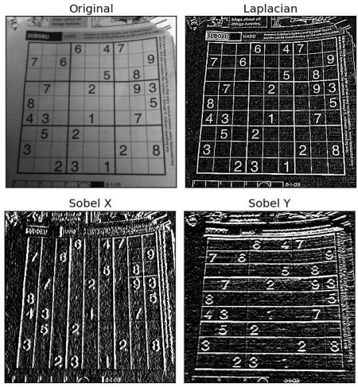

### 1.3. Základní myšlenky Cannyho detekce hran

Výsledná funkce vznikla minimalizací funkcionálu, který měří lokalizační chybu a signal2noise ratio.

1. Redukce šumu
2. Sobelovy filtry
3. Ztenčování hran - všechny hrany mají tloušťku jednoho pixelu
4. Prahování (thresholding)
  
#### 1.3.1. Prahování

- dva prahy $T_{upper}$ a $T_{lower}$


- hrana $A$ je "jistá" hrana, protože $A > T_{upper}$
- hrana $B$ je taky hrana, přestože $B < T_{upper}$, protože je spojená s hranou $A$
- $C$ není hrana, protože $C < T_{upper}$ a zároveň $C$ není spojena se "silnou" hranou
- hrana $D$ je automaticky zahozena, protože $D < T_{lower}$

### 1.4. Segmentace pomocí prahování

- binární prahování
  - $(I_{dst})_{x,y} = \left\{\begin{array}{ll}
        \texttt{maxVal} &\texttt{if}\,\,(I_{src})_{x,y}\,\,\in\,\,\langle\texttt{lb},\texttt{ub}\rangle\\
        0 &\texttt{otherwise}
    \end{array}\right.$

- invertované binární prahování
  - $(I_{dst})_{x,y} = \left\{\begin{array}{ll}
        0 &\texttt{if}\,\,(I_{src})_{x,y}\,\,\in\,\,\langle\texttt{lb},\texttt{ub}\rangle\\
        \texttt{maxVal} &\texttt{otherwise}
    \end{array}\right.$

Uveďte některé metody stanovení prahu (např. minimalizace chyby):

Obr. bimodálního histogramu jasu. Práh lze zvolit jako minimum mezi vrcholy.


Obr. určení prahu $t$ minimalizací chyby, za předpokladu dvou typů oblastí s normálním rozdělením hodnot jasů $q,p$ a středními hodnotami $\nu, \mu$.


### 1.5. Matematická morfologie

- často používané na **binárním obraze**
- potřebujeme zdrojový obrázek a **kernel**
- kernel se postupně *přikládá* na zdrojový obrázek a překrývající se pixely se vyhodnocují
- kernel může být třeba `np.ones((5,5),np.uint8)`, nebo taky elipsa, kříž atd.
- lze zobecnit na grayscale popř. barevné obrazy


#### 1.5.1. Dilatace (Dilation)

- pixel bude mít hodnotu **1** právě tehdy, když **alespoň jeden** pixel "pod" kernelem má hodnotu **1**, jinak je erodován (přepsán na nulu)
- zesvětluje barevný obraz

#### 1.5.2. Eroze (Errosion)

- pixel bude mít hodnotu **1** právě tehdy, když **všechny** pixely "pod" kernelem mají hodnotu **1**
- ztmavuje barevný obraz

#### 1.5.3. Otevření (Opening)

- eroze následování dilatací
- *odstranění šumu*

#### 1.5.4. Uzavření (Closing)

- dilatace následování erozí
- *vyplnění děr*

#### 1.5.5. Morfologický gradient

- rozdíl mezi dilatací a erozí

### 1.6. Detekce rohů

Detekce rohů je často založena na pozorování, že **v místě rohu není křivost v žádném směru nulová**.

### 1.7. Indexování objektů v binárním obraze


## 2. Příznakové metody analýzy obrazu

Každý konkrétní vektor příznaků $\mathbf{x}\in\mathbb{R}^n$ reprezentuje bod v $n$-rozměrném prostoru $X^n$, který nazýváme **příznakovým prostorem**. Příznakový prostor s omezeným oborem hodnot označme $\mathcal{X}$.

Příznakové metody jsou založené na myšlence, že podobnost nebo shoda objektů se projeví malou vzdáleností mezi příslušnými příznakovými vektory.

Je typické, že objekty jedné třídy tvoří v příznakovém prostoru shluky.

### 2.1. Příznaky používané v příznakové analýze obrazů

Několik příkladů příznaků a způsob jejich výpočtu. Příznaky odvozené ze tvaru, tvaru hranice a jasu.

#### 2.1.1. Momenty

Dvourozměrný moment řádu $(p,q)$ pro plochu $\Omega$ je:

$$m_{p,q}=\iint\limits_{\Omega}x^py^qf(x,y)\mathrm{d}x\mathrm{d}y$$

V analýze obrazu máme diskrétní obraz a funkce průběhu jasu je obvykle $f(x,y)=1$:

$$m_{p,q}=\sum\limits_{\Omega}x^py^q$$

Plocha:

- $m_{0,0}$

Těžiště:

- $x_t=\dfrac{m_{1,0}}{m_{0,0}}, \,\,y_t=\dfrac{m_{0,1}}{m_{0,0}}$

Pokud uvažujeme souřadnou soustavu s *osami v těžišti*, tak:

$$\mu_{p,q}=\sum\limits_{\Omega}(x-x_t)^p(y-y_t)^qf(x,y)$$

Momenty $\mu_{p,q}$ k těžištním osám *nezávisí na poloze objektu*, ale *závisí na velikosti a rotaci* objektu.

- &#9645; $\Rightarrow\dfrac{\mu_{2,0}}{\mu_{0,2}}$ větší než 1
- &#9647; $\Rightarrow\dfrac{\mu_{2,0}}{\mu_{0,2}}$ menší než 1

Co kdybychom chtěli, aby tento příznak nebyl závislý na rotaci/orientaci? **Hlavní momenty setrvačnosti**: Představ si natočený obdélník, cílem je najít natočený souřadnicový systém takový, že najdeme minimum a maximum:

$$
\begin{array}{c}
    \mu_{\mathrm{max}} \\
    \mu_{\mathrm{min}}
\end{array}
= \frac{1}{2} \left( \mu_{2,0} + \mu_{0,2} \right) \pm \frac{1}{2} \sqrt{ 4 \mu_{1,1}^{2} + \left( \mu_{2,0} - \mu_{0,2} \right)^2 }.
$$

Pokud chceme příznak invariantní vůči velikosti, můžeme příznaky normalizovat:

$$
\nu_{p,q}=\dfrac{\mu_{p,q}}{(m_{0,0})^{\gamma}}, \text{ kde } \gamma=\dfrac{p+q}{2}+1
$$

#### 2.1.2. Pravoúhlost a podlouhlost

Založeno na postupné rotaci objektu.

#### 2.1.3. Kruhovost

Buď $P$ délka hranice objektu a $S$ jeho plocha. Kruhovost definujeme $\boxed{C=\dfrac{P^2}{S}.}$

#### 2.1.4. Popis tvaru objektu pomocí průběhu křivosti jeho hranice

Průběh křivosti:


Buď $P$ délka hranice objektu a $k$ funkce křivosti hranice objektu. Informace o křivosti můžeme komprimovat do jedné hodnoty, **energie hranice**:

$$\dfrac{1}{P}\int\limits_{s}\big(k(s)\big)^2\mathrm{d}s.$$

Pokud je jedno číslo málo, můžeme vzít $n$ prvních členů **Fourierovy řady** (nejčastěji $\approx 5$).

#### 2.1.5. Průměrná vzdálenost pixelu od hranice


Příznak může být např. plocha děleno suma.

#### 2.1.6. Příznaky odvozené z histogramu jasu

Vhodné pro objekty, které jsou charakteristické svojí texturou nebo jistým rozložením jasu. Buď $b$ jas pixelu, vypočteme histogram pixelů objektu $N(b)$ a provedem normalizaci $p(b)=N(b)/N$. Hodnota $p(b)$ pak odpovídá pravděpodobnosti, že pixel objektu má jas právě $b$. Potom jsme schopni použít metody popisné statistiky.

- střední hodnota,
- rozptyl,
- šikmost (skewness),
- křivost (kurtosis),
- entropie,
- energie (kontrast).

### 2.2. Univerzální příznaky

#### 2.2.1. HoG

Pro každý pixel vypočteme směr gradientu jako:

$$\varphi(x,y)=\arctan\left(\dfrac{f_y(x,y)}{f_x(x,y)}\right)$$

a velikost gradientu jako:

$$e(x,y)=\sqrt{f_y^2(x,y) + f_x^2(x,y)},$$

kde $f_x, f_y$ jsou rozdíly jasů:

$$
\begin{align*}
f_x(x,y)&=f(x + 1,y)-f(x,y),\\
f_y(x,y)&=f(x,y+1)-f(x,y).
\end{align*}$$

Potom obraz rozdělíme do bloků $B_x\times B_y$ a bloky rozdělíme do buněk $C_x\times C_y$.


Vytvoříme histogram orientovaných gradientů pro každou buňku. Orientace rozdělíme do $N$ boxů (např. 9 pro orientace 0° až 180° s krokem 20°). Pro každý pixel dáme hodnotu gradientu do boxu podle orientace gradientu. Histogramy normalizujeme napříč bloky.

Délka výsledného vektoru příznaků závisí na počtu boxů, bloků a buněk.

#### 2.2.2. Local Binary Patterns (LBP)

- Ojala et al.
- [Tutorial](https://docs.opencv.org/2.4/modules/contrib/doc/facerec/facerec_tutorial.html#local-binary-patterns-histograms)
- Hlavní myšlenkou LBP je, že lokální struktury obrazu (mikrovzory, jako jsou čáry, hrany, skvrny a ploché oblasti) lze efektivně zakódovat porovnáním každého pixelu s pixely sousedními.


- z LBP obrazu následně můžeme sestavit histogram atd.
- LBP jsou invariantní vůči jasu, úpravou lze dosáhnout i invariance vůči rotaci


### 2.3. Klasifikátor a klasifikace pomocí diskriminačních funkcí

Klasifikátorem rozumíme zobrazení $f\colon\mathcal{X}\rightarrow\Omega$, kde $\mathcal{X}$ je matice příznaků a $\Omega$ je prostor tříd, tzn., $\omega=f(\mathbf{x})\in\Omega$.


Klasifikace diskriminačními funkcemi:


Při klasifikaci pomocí diskriminačních funkcí uvažujeme $M$ reálných diskriminačních funkcí $g_1,\ldots,g_M$ definovaných nad prostorem příznaků $\mathcal{X}$, kde $M$ je počet tříd. Hledaná třída je zvolena jako $\argmax\limits_{m=1,\ldots,M} g_m(\mathbf{x})$.

Jednotlivé hustoty odpovídají podmíněné pravděpodobnosti $g_m(\mathbf{x})=\mathcal{P}(\mathbf{x}|\omega_{m})$, kde $m$ je index třídy. Dále jsme schopni definovat funkce pro každou třídu a minimalizovat plochu pod křivkou (integrál). Dá se ukázat, že tato diskriminační funkce má tvar asi $\boxed{\mathcal{P}(\mathbf{x}|\omega_m)\mathcal{P}(\omega_m)}$.

Nejjednodušší tvar diskriminační funkce je funkce lineární:

$$\boxed{g_m(\mathbf{x})= b_m + \sum\limits_{i=1}^{N}a_{m,i}x_i,}$$

kde $b_m, a_{m,1},\ldots, a_{m,n}\in\mathbb{R}$ a $N\in\mathbb{N}$ je dimenze prostoru příznaků.

### 2.4. Klasifikace pomocí etalonů

Třídy objektů jsou reprezentovány etalony. Nejjednodušší způsob určení etalonu pro třídu $m$ je výpočet střední hodnoty:

$$\mathbf{e}_m=\dfrac{1}{N_m}\sum\limits_{i=1}^{N_m}\mathbf{x}_{m,i},$$

kde $N_m$ je počet trénovacích datových bodů pro třídu $m$. Klasifici lze provést hledáním minima $\min\limits_{m=1,\ldots,M}\text{dist}(\mathbf{e}_{m},\mathbf{x})$.

Vysvětlete vztah k diskriminačním funkcím. Převedením na úlohu hledání maxima získáme diskriminační funkci:

$$
\begin{align*}
  \min\limits_{m=1,\ldots,M}\text{dist}(\mathbf{e}_{m},\mathbf{x})&=-\max\limits_{m=1,\ldots,M}-\text{dist}(\mathbf{e}_{m},\mathbf{x})\\
  g_m(\mathbf{x})&=-\text{dist}(\mathbf{e}_{m},\mathbf{x})
\end{align*}
$$

### 2.5. Stanovení diskriminační funkce metodou minimalizace ztráty

Založeno na znalosti funkce $\boxed{\lambda(\omega_p\mid\omega_m)}$, která popisuje ztrátu, kterou utrpíme při predikci $\omega_p$, pokud skutečná třída je $\omega_m$. Hodnoty, které může funkce $\lambda(\omega_p\mid\omega_m)$ nabývat lze zapsat maticově jako:

$$
\Lambda=\begin{bmatrix}
  \lambda(\omega_1\mid\omega_1) & \cdots & \lambda(\omega_1\mid\omega_M)\\
  \vdots & \ddots & \vdots \\
  \lambda(\omega_M\mid\omega_1) & \cdots & \lambda(\omega_M\mid\omega_M)
\end{bmatrix}
$$

Dá se ukázat, že tento postup vede k diskriminační funkci $g_m(\mathbf{x}) = \mathcal{P}(\mathbf{x}|\omega_m)\mathcal{P}(\omega_m)$, přičemž pravděpodobnoti jsme schopni získat z trénovací sady.

Nebo např. SPA: $\Pi=\Lambda\Gamma$
$$
\begin{equation*}
    \left[\mathsf{C}^*,\mathsf{\Gamma}^*,\mathsf{\Lambda}^*\right] = \arg\limits_{\mathsf{C}, \mathsf{\Gamma}, \mathsf{\Lambda}}\min\limits_{
    \substack{
        \mathsf{\Gamma}\in\Omega_{\mathsf{\Gamma}}\\
        \mathsf{\Lambda}\in\Omega_{\mathsf{\Lambda}}}
    } \alpha\sum_{t=1}^T \sum_{k=1}^{K}
    \mathsf{\Gamma}_{k,t} \cdot \lVert\mathsf{X}_{:,t}-\mathsf{\mathsf{C}}_{:,k}\rVert_2^2-(1-\alpha)\sum\limits_{t=1}^{T}\sum\limits_{m=1}^{M}\sum\limits_{k=1}^{K}
    \mathsf{\Pi}_{m,t} \cdot \mathsf{\Gamma}_{k,t} \cdot \ln\left(\mathsf{\Lambda}_{m,k}\right)
\end{equation*}
$$

### 2.6. Klasifikace pomocí SVM

- [applet libsvm](https://www.csie.ntu.edu.tw/~cjlin/libsvm/)
- maximalizace marginu mezi daty ze dvou tříd $\rightarrow$ hledání dělící nadroviny
- lineární SVM není nic přelomového - existují efektivnější metody pro hledání dělící přímky/nadroviny - např. logistická regrese
- výhoda SVM je v možnosti používat různé kernel funkce - lineární, polynomiální, Gaussian RBF (Radial Basis Function) $K(x,y)=e^{-\dfrac{\lVert x-y \rVert_{2}^{2}}{2\sigma^2}}$, sigmoid, exponenciální, laplacian $\longrightarrow$ **kernel trick**
  - v praxi se používá lineární, polynomiální a Gaussian RBF kernel
- obecně složitost $\mathcal{O}(n^2)$ $\longrightarrow$ pomalé pro velké množství dat (ale např. random forest není o moc rychlejší)
- $C$...jak moc vadí, že se body překrývají
- $\gamma$...do jaké vzdálenosti se dívám
- ve vyšších dimenzích to **není interpretovatelný** model


- $C=1000, \gamma=1/3$ (už náznak overfittingu)

### 2.7. Vyhodnocení účinnosti zvolené množiny příznaků a Karhunen-Loéveho transformace (PCA)

Uvažujme dva vektory příznaků $x,y$, index $m$ označující třídu objektu a $N_m$ počet datových bodů v jednotlivých třídách. Pak můžeme spočítat odhad střední hodnoty a rozptylu:

$$\hat{\mu}_{x,m}=\dfrac{1}{N_m}\sum\limits_{i=1}^{N_m}x_{i,m},$$

$$\hat{\sigma}^2_{x,m}=\dfrac{1}{N_m}\sum\limits_{i=1}^{N_m}(x_{i,m}-\hat{\mu}_{x,m})^2,$$

a obdobně pro $y$. Hodnoty příznaků v rámci stejné třídy by měly být podobné, a tedy hodnoty rozptylu co nejmenší.

Závislost či nezávislost příznaků lze popsat pomocí kovariance. **Normalizovaná kovariance** je dána vztahem

$$\hat{\sigma}^2_{xy,m}=\dfrac{1}{N_m\hat{\sigma}^2_{x,m}\hat{\sigma}^2_{y,m}}\sum\limits_{i=1}^{N_m}(x_{i,m}-\hat{\mu}_{x,m})(y_{i,m}-\hat{\mu}_{y,m}).$$

Hodnota $0$ znamená nezávislé příznaky, hodnota $1$ nebo $-1$ zcela závislé (můžeme jeden z nich vypustit).

PCA se snaží vysvětlit variabilitu (rozptyl) mezi příznaky.

- metoda redukce dimenze
- vlastní čísla vyjadřují důležitost dané dimenze
- speciální případ SVD
- výsledné hlavní komponenty jsou lineárně nekorelované

## 3. Neuronové sítě

Vstupních uzlů je tolik, kolik je příznaků. Počet výstupních uzlu je roven počtu tříd objektů.

> Model neuronu s aktivační funkcí sigmoid, kde $\lambda$ je obvykle $1$, $p$ je dimenze vstupu, $i$ je index neuronu ve vrstvě.
>
>

### 3.1. Aktivační funkce


1. **Sigmoid**:
   $$
   \sigma(x) = \dfrac{1}{1 + e^{-x}}
   $$
2. **ReLU (Rectified Linear Unit)**:
   $$
   \text{ReLU}(x) = \max(0, x)
   $$

3. **Tanh (Hyperbolic Tangent)**:
   $$
   \tanh(x) = \frac{e^x - e^{-x}}{e^x + e^{-x}}
   $$

4. **Softmax**:
   $$
   \text{softmax}(x_i) = \frac{e^{x_i}}{\sum_{j=1}^K e^{x_j}},
   $$
   where $K$ is the number of classes.

5. **Leaky ReLU**:
   $$
   \text{Leaky ReLU}(x) =
   \begin{cases} 
   x & \text{if } x \geq 0 \\
   \alpha x & \text{if } x < 0
   \end{cases}
   $$
   where $\alpha$ is a small constant (e.g., $0.01$).

6. **ELU (Exponential Linear Unit)**:
   $$
   \text{ELU}(x) =
   \begin{cases} 
   x & \text{if } x \geq 0 \\
   \alpha (e^x - 1) & \text{if } x < 0
   \end{cases}
   $$
   where $\alpha$ is a positive constant.

### 3.2. Dopředný průchod


- Input layer: 2 neurons
- Hidden layer: 3 neurons
- Output layer: 2 neurons
- Weights from input to hidden layer
  - $W_1\in\mathbb{R}^{3\times2}$
- Biases for hidden layer
  - $b_1\in\mathbb{R}^{3}$
- Weights from hidden to output layer
  - $W_2\in\mathbb{R}^{2\times3}$
- Biases for output layer
  - $b_2\in\mathbb{R}^{2}$

Pro inicializaci vah se obvykle používá Glorot(ovo) uniformní rozdělení, které vybírá vzorky z intervalu $[-\text{limit}, \text{limit}]$, kde $\text{limit} = \sqrt{\dfrac{6}{n_{in} + n_{out}}}$, kde $n_{in}$ je počet vstupních neuronů a $n_{out}$ je počet výstupních neuronů.

Buď náhodná inicializace:

$$
\begin{align*}
  W_1 &= \begin{bmatrix} 0.2 & 0.4 \\ 0.5 & 0.9 \\ 0.8 & 0.1 \end{bmatrix}, & \mathbf{b}_1 &= \begin{bmatrix} 0.1 \\ 0.2 \\ 0.3 \end{bmatrix}, \\
  W_2 &= \begin{bmatrix} 0.3 & 0.7 & 0.2 \\ 0.6 & 0.5 & 0.8 \end{bmatrix}, & \mathbf{b}_2 &= \begin{bmatrix} 0.1 \\ 0.4 \end{bmatrix},
\end{align*}
$$

a buď vstupní vektor $\mathbf{x} = \begin{bmatrix} 0.5 \\ 0.6 \end{bmatrix}$. Dále uvažujme aktivační funkci sigmoid $\sigma(x) = \dfrac{1}{1 + e^{-x}}$.

Výstupem *skryté vrstvy* bude:

$$
\mathbf{a}_1 = \sigma(\mathbf{z}_1) = \sigma(W_1\mathbf{x} + \mathbf{b}_1) = \dfrac{1}{1 + e^{-(W_1\mathbf{x} + \mathbf{b}_1)}}.
$$

Obdobně pro *výstupní vrstvu*:

$$
\mathbf{a}_2 = \sigma(\mathbf{z}_2) = \sigma(W_2\mathbf{x} + \mathbf{b}_2) = \dfrac{1}{1 + e^{-(W_2\mathbf{x} + \mathbf{b}_2)}}.
$$

Nakonec můžeme vypočítat chybu, např. MSE:

$$
\text{MSE} = \frac{1}{n} \sum_{i=1}^{n} (y_i - \hat{y}_i)^2 = \frac{1}{2} \sum_{i=1}^{2} (y_i - a_{2,i})^2,
$$

kde $\mathbf{y}$ jsou skutečné hodnoty z trénovací sady a $\hat{\mathbf{y}}=\mathbf{a}_2$ je predikce.

### 3.3. Back propagation

Nechť jsou všechny parametry ANN označeny $\theta$ (váhy a bias). Pak v každém kroku $t$ gradientního sestupu jsou parametry aktualizovány pomocí:

$$\theta^{(t)}=\theta^{(t-1)}-\eta\dfrac{\partial C(X,\theta^{(t)})}{\partial\theta},$$

kde $\eta\in\R^+$ je míra učení a $C$ je ztrátová funkce, která závisí na parametrech sítě $\theta^{(t)}$ a souboru dat $X$, tzn. dvojic vstup-výstup $(\mathbf{x}_i,\mathbf{y}_i)$.

### 3.4. Konvoluční neuronové sítě (CNN)

- 1998 LeNet
- 2005 Sliding window + HoG + SVM pro detekci lidí
- 2012 AlexNet
- 2013 ZFNet
- 2015 VGG
- 2015 GoogleNet - **inception module**
- 2015 ResNet

Podrobněji v kapitole 4.

### 3.5. Detekce objektů pomocí sliding window

- Non-maxima suppression pro filtrování ohraničujících obdélníků.
- CNN síť natrénovaná na výřezech/oknech.
- Někdy je vhodné použít proměnnou velikost okna.


### 3.6. Komponenty hlubokých CNN

- Konvoluce

```py
x = np.random.rand(4, 10, 10, 128) # batch, width, height, channels
y = keras.layers.Conv2D(32, 3, activation='relu')(x) # filters, kernel size
print(y.shape) # (4, 8, 8, 32) ..."borders" are dropped - no padding is applied
```

- Pooling
- Dropout
- Softmax
- Normalizace
- Transponovaná konvoluce (up-sampling)

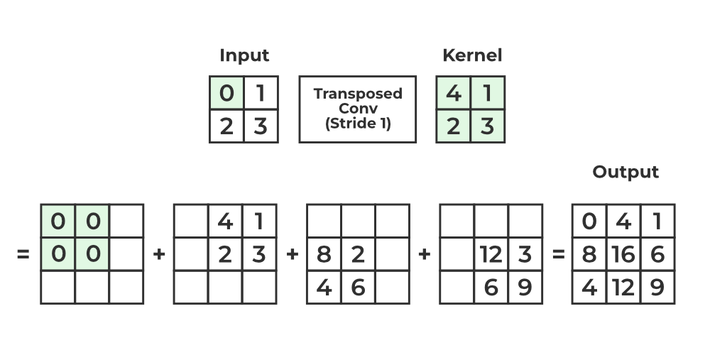


### 3.7. Detekce objektů

Možné přístupy:

1. **Sliding window** - pro každé okno se provede predikce - HoG, Viola-Jones
2. **Two shot** - region proposal - Fast R-CNN, Faster R-CNN
3. **Single shot** - YOLO (You only look once), SSD (Single Shot MultiBox Detector)

#### 3.7.1. Sítě pro detekci bez sliding window

- R-CNN, Fast R-CNN, Faster R-CNN, YOLO

#### 3.7.2. Region proposal

- **Selective Search** - metoda narůstání oblasti


- **Edge Boxes** (detekce hran) - pokud je mnoho uzavřených hran uvnitř ohraničujícího obdélníku, je velká šance, že tam je i nějaký objekt


#### 3.7.3. R-CNN

1. **Selective search** region proposal
2. Resize selected regions to $227\times227$ (obdélníky na čtverec)
3. CNN extrakce příznaků
4. SVM pro klasifikaci

#### 3.7.4. Fast R-CNN

Používá vícekriteriální cenovou funkci - klasifikace a lokalizace.


- **RoI pooling** - z *feature mapy* adaptivně vybíráme oblasti.


#### 3.7.5. Faster R-CNN

Detektor Faster R-CNN přidává **Region Proposal Network (RPN)**, která generuje návrhy oblastí přímo v síti namísto použití externího algoritmu, jako jsou Edge Boxes nebo Selective Search. Síť RPN přijímá vstupní obrázek (libovolné velikosti) a vypisuje sadu návrhů ohraničujících obdélníků, z nichž každý má skóre objektovosti. Generování návrhů oblastí v síti je rychlejší než v případě selektivního vyhledávání nebo edge boxů.


#### 3.7.6. YOLO

- [You Only Look Once](https://youtu.be/NM6lrxy0bxs?si=ev8P8-CTuAhVUVCI)
- YOLO přistupuje k detekci objektů spíše jako k regresnímu problému (než ke klasifikaci).

Naopak metody jako R-CNN přistupují k problému detekce v několika krocích:

1. Region proposal
2. Klasifikace boxů
3. Post-processing boxů (úprava bboxů, odstranění duplikátů)

YOLO predikuje všechny bboxy najednou, globálně. Každý bbox má 5 hodnot: $x, y, w, h,$ a confidence.

YOLOv1:

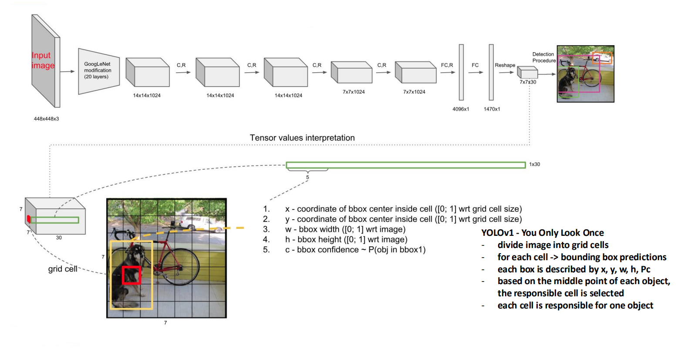

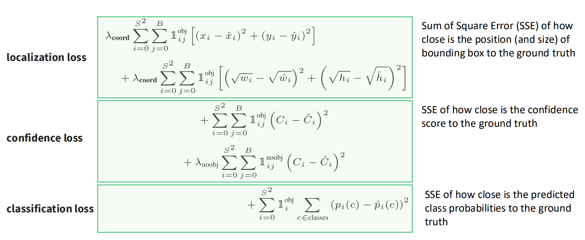

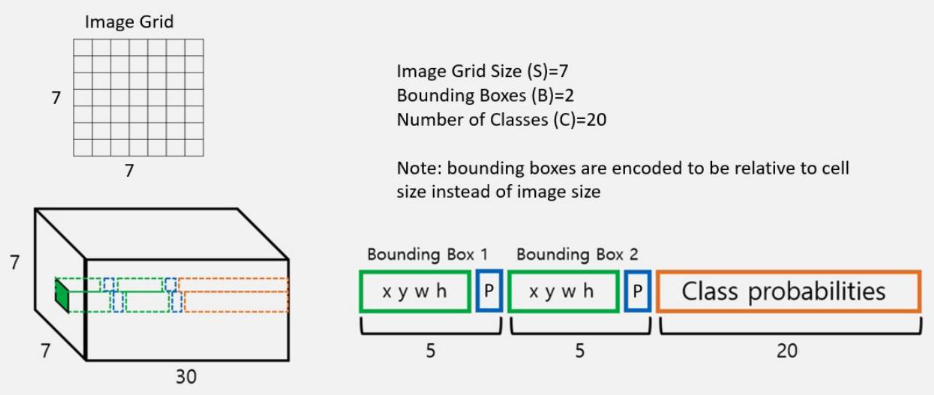

- Celkový počet bboxů je $S\times B$:
  - $S$...počet buněk (YOLOv1 $7\times7$)
  - $B$...počet bboxů na buňku (YOLOv1 $B=2$)
- $x,y$...souřadnice bboxů
- $w,h$...šířka, výška bboxů

YOLOv2 a výše používá anchor boxes (viz SSD).

#### 3.7.7. SSD (Single Shot MultiBox Detector)

- **Anchor boxes** - předdefinované velikosti a poměry stran bboxů, síť se učí, jak upravit tyto anchor boxy (jak nastavit offset).

#### 3.7.8. RetinaNet

- Feature pyramid network (FPN) + Focal loss

### 3.8. Sítě pro použití s časem

#### 3.8.1. Rekurentní sítě (RNN)

- Proč potřebujeme RNN? Berou v potaz **kontext** (mají "paměť"), což je nezbytné např. pro zpracování textu nebo pro časově závislé sekvence. Např. **sentiment analysis**.
- RNN jsou náchylné na *vanishing gradient problem*.
- RNN jsou schopné zpracovávat sekvence libovolné konečné délky. Používá se **backpropagation through time**.
- RNN nelze paralelizovat a trénovat pomocí grafických akcelerátorů $\Rightarrow$ výpočetně náročné.


- $h_i$ ...hidden state

#### 3.8.2. LSTM

- [Christopher Olah: Understanding LSTMs](https://colah.github.io/posts/2015-08-Understanding-LSTMs/)
- **forget gate** - sigmoid, $0\Rightarrow$ forget/ignore, $1\Rightarrow$ keep this information
- **input gate** - sigmoid rozhodne, které hodnoty aktualizovat, $\tanh$ aktualizuje


#### 3.8.3. Attention

- Myšlenka je taková, že to, co není důležité, můžeme zahodit. Naopak *důležité* věci si zapamatujeme.
- Attention vrstva potlačuje *forget gate*. V principu nastavuje váhy tokenů po *bidirectional LSTM* vrstvě.
- *Self-attention* - v rámci řetězce se vypočte *attention* vůči všem tokenům - nad maticemi $Q, K, V$ (query, key, value).
- Vision Transformer (ViT).

## 4. Architektury CNN

### 4.1. LeNet 1995

### 4.2. AlexNet 2012

- Různě velké konvoluční vrstvy `(11x11, stride=4)`, `(5x5, stride=2)`, `(3x3, stride=1)`.
- Max pooling `(3x3, stride=2)`.
- Na konci 3 plně propojené vrstvy.
- ReLU.
- *Horizonal flip* & *random crop*.

### 4.3. ZFNet (2013)

- Více kanálů.
- Vizualizace příznakových map.

### 4.4. VGG (2014)

- Pouze kernely $3\times3$ a pooling $2\times2$.
- Myšlenka, že dvě vrstvy $3\times3$ jsou ekvivalentní jedné vrstvě $5\times5$ a obdobně tři vrstvy $3\times3$ jsou ekvivalentní jedné vrstvě $7\times7$ (uvažujeme padding 1 a stride 1) $\rightarrow$ **reception net**.
- 2 vrstvy $3\times3$ mají méně parametrů než 1 vrstva $5\times5$.

### 4.5. GoogLeNet (2014)

- "wider rather than deeper"

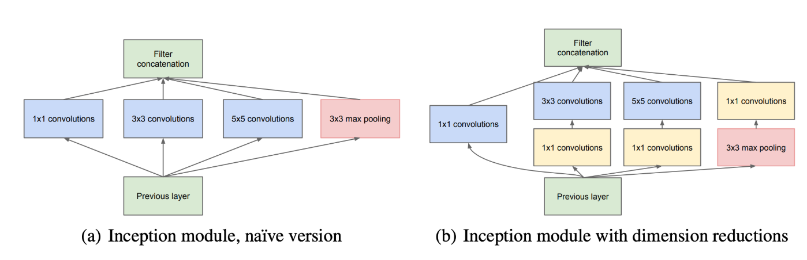

> Jak v CNN redukovat počet kanálů? **1x1 konvoluce** nebo 3D konvoluce.
>
> 1D konvoluce:
>
> 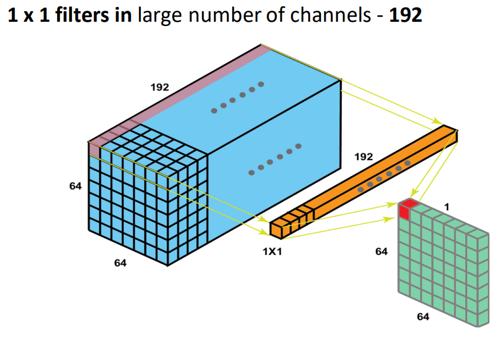
>
> 1D konvoluce byla milník pro vytváření hlubokých CNN.
>
> 3D konvoluce s kernel $3\times3\times3$:
>
> 

### 4.6. ResNet (2015)

- Hluboké sítě mají problém s učením, kvůli *vanishing gradient problem*.
- Řešení: **residual blocks** *(skip connections)*.

"shortcut:"


"bottleneck:"

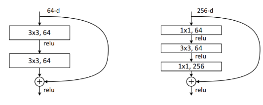

Pokud se zvyšuje počet kanálů, tak se použije 1x1 konvoluce.

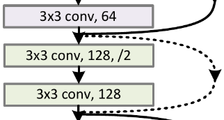

### 4.7. DenseNet (2017)

Dense block:

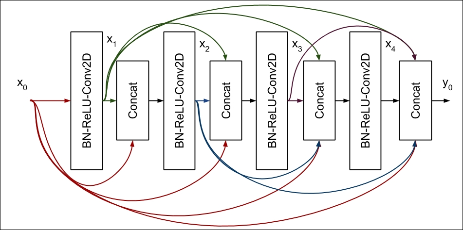

### 4.8. MobileNet

### 4.9. SqueezeNet

### 4.10. EfficientNet

- compound scaling (depth, width, resolution)

### 4.11. Vision Transformer (ViT) (2020)

- [An Image is Worth 16x16 Words: Transformers for Image Recognition at Scale](https://research.google/blog/transformers-for-image-recognition-at-scale/)


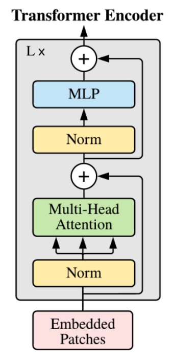

1. Rozdělení obrazu na bloky *(patches)* (např. $16\times16$, tzn. $P=16$).
2. Lineární projekce na vektory *(flatten)*, výsledné vektory mají dimenzi $P^2\cdot C$, kde $C$ je počet kanálů. Každý *patch* odpovídá jednomu *tokenu*.
3. Poziční embedding.
4. Přidání *class token*.
5. **Transformer encoder** $(L\times)$.
   1. *Layer normalization*

      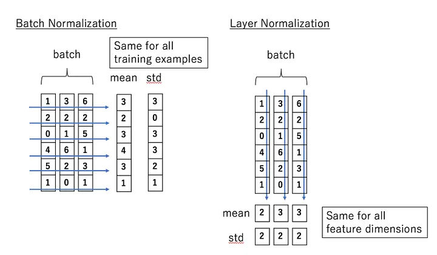

   2. *Multi-head self attention*, násobení matic $Q, K, V$.
      $$\text{SelfAttention}(Q,K,V)=\text{Softmax}\left(\dfrac{QK^T}{\sqrt{d_k}}\right)V$$
   3. *Layer normalization*
   4. MLP *(classification head)*

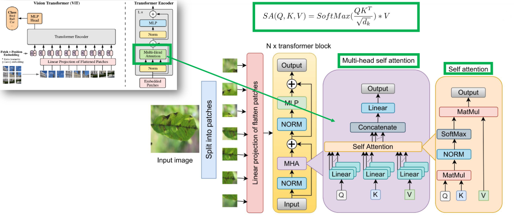

Jak vytvořit *patches*? Stačí použít konvoluci s velikostí jádra $P\times P$ a stride $P$.

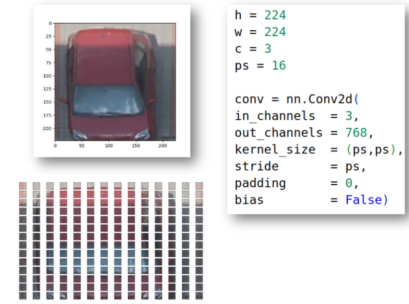

<details><summary> Náznak implementace ViT </summary>

```py
import torch
import torch.nn as nn
import torch.nn.functional as F

# Custom Permute Layer
class MyPermute(nn.Module):
    def __init__(self, dims):
        super(MyPermute, self).__init__()
        self.dims = dims

    def forward(self, x):
        return x.permute(*self.dims)

# Block Permute Implementation
block_permute = nn.Sequential(
    nn.Conv2d(
        in_channels=3,
        out_channels=768,
        kernel_size=(ps, ps),  # `ps` needs to be defined
        stride=ps,
        padding=0,
        bias=False,
    ),
    nn.Flatten(start_dim=2, end_dim=-1),
    MyPermute((0, 2, 1))
)

# Class Token
batch_size = 32  # Define batch size
class_token = nn.Parameter(torch.ones(batch_size, 1, 768))

# Concatenation of class token and block output
block_out_permute = torch.randn(batch_size, 196, 768)  # Placeholder for block_permute output
z_0_with_class = torch.cat((class_token, block_out_permute), dim=1)

# Positional Embeddings
position_embeddings = nn.Parameter(torch.ones(1, 197, 768))  # 197 = 1 (class token) + 196 (patches)
z_0_with_class_with_poss = z_0_with_class + position_embeddings

# LayerNorm and Multi-Head Attention
layer_norm = nn.LayerNorm(768)
layer_norm_out = layer_norm(z_0_with_class_with_poss)

multihead_attn = nn.MultiheadAttention(embed_dim=768, num_heads=12, batch_first=True)
attn_output, attn_output_weights = multihead_attn(
    query=layer_norm_out, key=layer_norm_out, value=layer_norm_out
)

# Placeholder for testing output
print("Attention Output Shape:", attn_output.shape)
print("Attention Weights Shape:", attn_output_weights.shape)
```

</details>

## 5. Zpětná stereoprojekce

Máme-li k dispozici několik obrazů téže scény z různých míst, pak jsme za jistých okolností schopni provést rekonstrukci scény.

### 5.1. Lineární model kamery

Model kamery je dírková komora:


| Obrazové<br>souřadnice | Perspektivní<br>projekce | Souřadnice<br>kamery | Transformace<br>souřadnic | Globální<br>souřadnice |
|:--:|:--:|:--:|:--:|:--:|
|$\mathbf{x}_i = \begin{bmatrix}x_i \\y_i\end{bmatrix}$ | $\Leftarrow$ | $\mathbf{x}_c = \begin{bmatrix}x_c \\y_c \\z_c\end{bmatrix}$ | $\Leftarrow$ | $\mathbf{x}_w = \begin{bmatrix}x_w \\y_w \\z_w\end{bmatrix}$ |

#### 5.1.1. Perspektivní transformace


Z podobnosti trojúhelníků:

$$
\dfrac{u}{x_c}=\dfrac{f}{z_c}\quad\Longrightarrow\quad u = f\dfrac{x_c}{z_c}
$$

Pixely mohou být obdélníkové. Jestliže $m_x$ a $m_y$ jsou hustoty pixelů (pixely/mm) ve směru $x$ a $y$, pak souřadnice pixelů jsou:

$$
u = m_x x_i + o_x = m_x f \frac{x_c}{z_c} + o_x, \quad\quad\quad v = m_y y_i +o_y = m_y f \frac{y_c}{z_c}+o_y,
$$

kde $f$ je ohnisková vzdálenost a $(o_x,o_y)$ je souřadnice, kde optická osa protíná senzor. Označme $f_x=m_xf$ a $f_y=m_yf$. Pak můžeme pro homogenní souřadnice $(u,v)=\left(\dfrac{\tilde{u}}{\tilde{w}},\dfrac{\tilde{u}}{\tilde{w}}\right)$ vyjádřit vnitřní *(intrinsic)* matici jako:

$$
\begin{equation*}
\begin{bmatrix} u \\ v \\ 1 \end{bmatrix} = \underbrace{\begin{bmatrix} f_x & 0 & o_x & 0 \\ 0 & f_y & o_y & 0 \\ 0 & 0 & 1 & 0 \end{bmatrix}}_{M_{int}} \begin{bmatrix} x_c \\ y_c \\ z_c \\ 1 \end{bmatrix}
\end{equation*}.
$$

Kalibrační matice $\mathbf{K}=\begin{bmatrix} f_x & 0 & o_x \\ 0 & f_y & o_y  \\ 0 & 0 & 1  \end{bmatrix}$.

#### 5.1.2. Souřadnicová transformace

$$\mathbf{x}_c=R\left(\mathbf{x}_w-\mathbf{c}_w\right)=R \mathbf{x}_w-R \mathbf{c}_w=R \mathbf{x}_w+\mathbf{t}, \quad\text{kde}\quad \boxed{\mathbf{t}=-R \mathbf{c}_w}$$

$$\mathbf{x}_c=\left[\begin{array}{l}x_c \\ y_c \\ z_c\end{array}\right]=\left[\begin{array}{lll}r_{11} & r_{12} & r_{13} \\ r_{21} & r_{22} & r_{23} \\ r_{31} & r_{32} & r_{33}\end{array}\right]\left[\begin{array}{l}x_w \\ y_w \\ z_w\end{array}\right]+\left[\begin{array}{l}t_x \\ t_y \\ t_z\end{array}\right]$$

Přepis pomocí homogenních souřadnic:

$$
\tilde{\mathbf{x}}_c=\left[\begin{array}{c}
x_c \\
y_c \\
z_c \\
1
\end{array}\right]=\underbrace{\left[\begin{array}{cccc}
r_{11} & r_{12} & r_{13} & t_x \\
r_{21} & r_{22} & r_{23} & t_y \\
r_{31} & r_{32} & r_{33} & t_z \\
0 & 0 & 0 & 1
\end{array}\right]}_{M_{ext}}\left[\begin{array}{c}
x_w \\
y_w \\
z_w \\
1
\end{array}\right]
$$

#### 5.1.3. Projekční matice

$$\tilde{\mathbf{u}}=M_{\text {int }} M_{\text {ext }} \tilde{\mathbf{x}}_w=P \tilde{\mathbf{x}}_w$$

#### 5.1.4. Kalibrace

> Kalibrace kamery znamená odhad **projekční matice** (tzn. vnitřních "intrisických" a vnějších "extrasických" parametrů) pomocí objektu se známou geometrií.


Pro každý zájmový bod ve scéně a obrázku:

$$
\begin{bmatrix}
    u^{(i)} \\
    v^{(i)} \\
    1
\end{bmatrix}=\begin{bmatrix}
    p_{11} & p_{12} & p_{13} & p_{14} \\
    p_{21} & p_{22} & p_{23} & p_{24} \\
    p_{31} & p_{32} & p_{33} & p_{34}
\end{bmatrix}
\begin{bmatrix}
    x_w^{(i)} \\
    y_w^{(i)} \\
    z_w^{(i)} \\
    1
\end{bmatrix}
$$

Známe obrazové souřadnice $u,v$ (v pixelech) a souřadnice ve scéně $x,y,z$ (v metrech).

Škálování projekční matice (homogenní souřadnice) znamená současné škálovaní "světa" (globálních souřadnic) a kamery, přičemž výsledný obraz se nezmění.

### 5.2. Zpětná stereoprojekce a základní vztahy pro kamery s rovnoběžnými optickými osami


Dvě identické kamery s rovnoběžnými optickými osami (počítačové stereovidění):


$$
x=\frac{b\left(u_l-o_x\right)}{\left(u_l-u_r\right)} \quad\quad y=\frac{b f_x\left(v_l-o_y\right)}{f_y\left(u_l-u_r\right)} \quad\quad z=\frac{b f_x}{\left(u_l-u_r\right)}
$$

### 5.3. Absolutní kalibrace kamery a rekonstrukce

Předpokládáme znalost kalibračních bodů v obraze $(u,v)$ i ve scéně $(x,y,z)$.

### 5.4. Relativní kalibrace a rekonstrukce

Máme k dispozici pouze souřadnice bodů v obraze získaném kamerami. Souřadnice ve scéně nejsou k dispozici. Např. pro pohyb robota v neznámé scéně.

V procesu relativní kalibrace jsme schopni určit matici rotace $R$ a vektor posunu $\mathbf{b}=O_2-O_1$, díky čemuž získáme informace o transformaci ze souřadného systému druhé kamery do souřadného systému první kamery:

$$\mathbf{x}_1=R\mathbf{x}_2+\mathbf{b}$$

### 5.5. Hledání korespondence


## 6. Analýza obrazů proměnných v čase

### 6.1. Princip sledování objektů v obrazech

Uvažujme dynamický systém, který se mění v čase. Stav systému v čase $t+1$ vypočteme z předchozího stavu $\mathbf{x}_t$ jako součet deterministického signálu (výstup fyzikálního modelu) a šumu $\mathbf{w}_t$. Podle skutečných měření Kalmanův filtr více důvěřuje buď fyzikálnímu modelu (odebírá šum), nebo vnitřně tvořenému modelu (přidává šum). (Je to Markovský proces.)

Základní myšlenky Kalmanova filtru:

- Je postavený na fyzikálním modelu, do kterého započítává nejistoty měření.
- Zjednodušený Kalmanův filtr s konstantním zrychlení pro 1D:

$$
\begin{equation*}
    \mathbf{x}_{t+1} = \varPhi_{t\mid t+1} \mathbf{x}_t + \mathbf{w}_t
\end{equation*}
$$

$$
\begin{bmatrix}
    s_{t+1}\\
    v_{t+1}\\
    a_{t+1}
\end{bmatrix} =
\begin{bmatrix}
  1 & \Delta t  & \frac{1}{2}\Delta t^2\\
  0 & 1 & \Delta t\\
  0 & 0 & 1
\end{bmatrix}
\begin{bmatrix}
    s_{t}\\
    v_{t}\\
    a_{t}
\end{bmatrix} + \mathbf{w}_t
$$

- kde $\mathbf{w}$ je bílý šum (nezávislé NV).

## 7. Geometrické transformace obrazu

- Skripta strana 56.

Afiní transformace, zachovává rovnoběžnost (ortografický pohled):

$$y=Ax+t$$

Perspektivní transformace:

$$y=Px,$$

kde $P\in\mathbb{R^{4,4}}$. Např.

$$y=Px=\begin{bmatrix}
    1 & 0 & 0 & 0\\
    0 & 1 & 0 & 0\\
    0 & 0 & 1 & 0\\
    0 & 0 & 0 & 1\\
\end{bmatrix}\begin{bmatrix}
    x\\
    y\\
    z\\
    1
\end{bmatrix},$$

do matice $P$ je možné "dát" translaci $t$.

Co je epipolára???

## 8. Hough transformace

- [:háfova:]
- detekce bodů na přímce, kružnici (po detekci hran)

## 9. Úlohy při zpracování obrazu

- vylepšení / filtrace
- detekce hran
- detekce objektů
  - nalezení ROI (souřadnice a měřítko objektu)
- rozpoznání objektů
  - identifikace do kategorií
  - rozpoznávání obličejů
- sledování objektů *(object tracking)*
  - odhad trajektorie
- segmentace
  - rozdělení obrazu na více oblastí
- detekce lidské pózy *(human pose detection)*

## 10. Template matching

- jednoduchá metoda pro lokalizaci objektů
- potřebuju *template* a *zdrojový obraz* (source)
- porovnává se template a část zdrojového obraz

Jak porovnat *template* a *source*?

- suma absolutních rozdílů
  - $SAD=\sum\limits_{x,y}\lvert (I_1)_{x,y} - (I_2)_{x,y}\rvert$
- suma čtvercových rozdílů
  - $SSD=\sum\limits_{x,y}\left[ (I_1)_{x,y} - (I_2)_{x,y}\right]^2$
- vzájemná korelace (cross correlation)
  - $CC=\sum\limits_{x,y}\left[ (I_1)_{x,y} \cdot (I_2)_{x,y}\right]$
- odpovídající normované varianty a další

## 11. Typy kernelů

- Sobel $3\times3$
  - $K_x=\begin{bmatrix}
    -1 & 0 & 1\\
    -2 & 0 & 2\\
    -1 & 0 & 1\\
\end{bmatrix}$
  - $K_y = K_x^T$
- Identita $3\times3$
  - $Id=\begin{bmatrix}
    0 & 0 & 0\\
    0 & 1 & 0\\
    0 & 0 & 0\\\end{bmatrix}$
- Normalizovaný box blur $3\times3$
  - $K=\frac{1}{9}\begin{bmatrix}
    1 & 1 & 1\\
    1 & 1 & 1\\
    1 & 1 & 1\\\end{bmatrix}$
- Gaussian blur (aproximace) $3\times3$
  - $K=\frac{1}{16}\begin{bmatrix}
    1 & 2 & 1\\
    2 & 4 & 2\\
    1 & 2 & 1\\\end{bmatrix}$
- Doostření (sharpen) $3\times3$
  - $K=\begin{bmatrix}
    0 & -1 & 0\\
    -1 & 5 & -1\\
    0 & -1 & 0\\\end{bmatrix}$

## 12. Rozpoznávání obličejů

- **Haar** (sliding window)
- **HOG** (sliding window)
- **LBP** (sliding window)
- **SIFT, SURF, BRIEF, ORB, BRISK, FREAK** (zájmové body)
- **CNNs** (hluboké učení)

### 12.1. Sliding window

1. Vstupní obraz je snímán *obdélníkovým oknem* v několika měřítcích.
2. Výsledkem procesu skenování je velké množství různých dílčích oken.
3. Z každého dílčího okna je extrahován *vektor příznaků*.
4. Tento vektor se použije jako vstup pro klasifikátor. Tento klasifikátor musí být předem natrénovaný.
5. Cílem je vytvořit *bounding box* okolo hledaného objektu.

### 12.2. Proces rozpoznávání

1. Detekce obličeje
2. Extrakce ROI
3. Extrakce příznaků
4. Fáze rozpoznávání (klasifikace)

### 12.3. Detekce obličejů

- *facial landmark detection, keypoint detection*
- obrazové zájmové body mohou být použity k lepšímu výřezu obličeje a zlepšit tak rozpoznávání
- Facial landmarks can be used to align facial images to improve face recognition.
- můžeme odhadovat pózu hlavy - kam se člověk dívá
- nahrazení obličeje
- detekce zavřených očí
- pro segmentaci očí lze použít thresholding na bílou barvu

S jakými problémy musíme počítat?

- póza - obličej zepředu, z profilu, shora, zespodu atd.
- brýle, vlasy
- výrazy obličeje, mimika
- osvětlení, stíny, jas

### 12.4. Haarovy příznaky

- Viola & Jones 2001
- hlavní myšlenka - obličeje mají podobné vlastnosti
  - oblast očí je tmavší něž líce, podobně čelo je obvykle světlejší než oči
  - ústa mají taky jiný jas
  - "nosní most" je světlejší než oči
- je nutná trénovací množina


Suma přes obdélník, černou oblast odečítám, bílou přičítám. Existují různé typy:

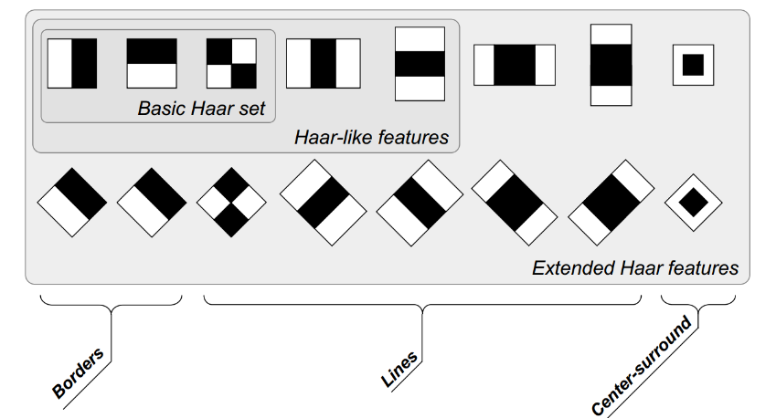

> **Integrální obraz** obsahuje součet všech prvků nad ním a vlevo od něj, tj.:
>
> $$I[m, n] = \sum_{i \leq m} \sum_{j \leq n} X[i, j],$$
>
> kde $X$ je původní obraz a $I$ je integrální obraz.

Integrální obraz lze využít k výpočtu Haarových příznaků v **konstantním čase** (obecně k sumě prvků submatice).


Proč přičítáme $ii_1$? Protože jsme ho v rámci $ii_2$ a $ii_3$ odečetli.

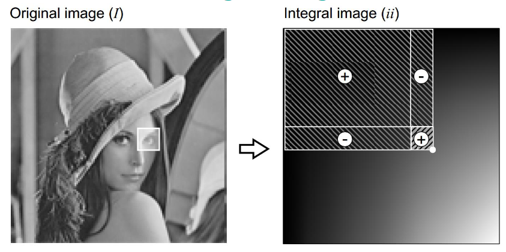

<details><summary> Příklad </summary>

```py
import numpy as np
from skimage.transform import integral_image

X = np.array(
    [
        [ 1, 2, 1, 2],
        [ 1, 0, 1, 1],
        [ 1, 3, 1, 0],
        [ 0, 3, 2, 0]
     ]
  )

I = integral_image(X)
>>> array([[ 1,  3,  4,  6],
           [ 2,  4,  6,  9],
           [ 3,  8, 11, 14],
           [ 3, 11, 16, 19]])

# Construction:
assert I[3,3] == I[3,2] + I[2,3] - I[2,2] + X[3,3]

# Usage:
assert X[2:4, 2:4].sum() == I[3,3] + I[1,1] - I[1,3] - I[3,1]
```

</details>

#### 12.4.1. Kaskádový klasifikátor

- většina obrazu obvykle hledaný objekt (obličej) neobsahuje, proto chceme tyto oblast co nejdříve zahodit
- kaskádový klasifikátor má několik fází, pokud je pravděpodobnost hledaného objektu v okně velká, tak se pokračuje do další fáze, jinak se okno zamítne

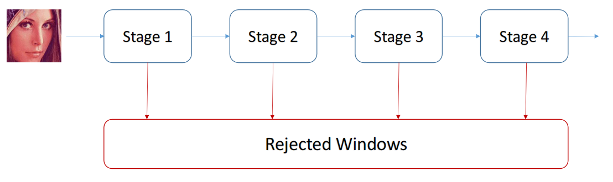

Existují i pokročilejší metody, např. **Cascaded Regression**. Tato metoda začíná z průměrného tvaru obličeje a iterativně posouvá zájmové body podle obrazových příznaků:


#### 12.4.2. Knihovny pro detekci zájmový bodů obličeje

- **OpenCV**
- **DLIB**
- **MediaPipe** (Google)

## 13. Autonomí vozidla

Autonomní vozidlo *(AV - Autonomous Vehicle)* je vozidlo, které je schopné vnímat své okolí a bezpečně se pohybovat s malým nebo žádným lidským zásahem.

- pozemní vozidla
- drony (UAV)
- NOMARS - No Manning Required Ship

### 13.1. Senzory

- Lidar ("light detection and ranging"; např. firma Velodyne)
- Radar
- Kamery
- Mapy, GPS

Jak funguje LIDAR?

- Lidar používá laserové paprsky bezpečné pro oči, které "vidí" svět ve 3D (vytvářejí mračna 3D bodů) a poskytují počítačům prostorový obraz.
- Typický lidar emituje pulzy světla (vlnění) do svého okolí a toto vlnění se odráží od okolních objektů. Lidar tyto odražené vlny zaznamenává a počítá rozdíl v čase od vypuštění do zachycení.
- Tento proces se opakuje třeba milionkrát za sekundu.


Jaké má LIDAR výhody a nevýhody oproti kamerám?

- Nemůže detekovat barvy a interpretovat text, značky, semafory atd.
- Funguje velmi dobře i ve tmě.
- Přesnost.
- Vyšší cena a větší velikost (třeba nějaká "boule" na střeše)
- Poskytuje 3D obraz okolí.

Jaké výhody a nevýhody mají kamery?

- Rozpoznání barev, čtení dopravních značek.
- Moderní AI metody dokážou také vytvořit 3D obraz okolí (z dostatečného množství kamer).
- Vyžadují mnohem více výpočetního výkonu.
- Kamerové systémy jsou téměř neviditelné.
- Problémy za špatného světla.

### 13.2. Úrovně autonomních vozidel

- Level 0 - žádná automatizace
  - Veškeré řízení provádí řidič,ale vozidlo může pomáhat s detekcí mrtvého úhlu, varováním před čelní srážkou a varováním před opuštěním jízdního pruhu.

- Level 1 - asistenční systémy
  - Vozidlo může být vybaveno některými aktivními asistenčními funkcemi, ale řidič je stále zodpovědný za řízení. Mezi takové asistenční funkce, které jsou v dnešních vozidlech k dispozici, patří adaptivní tempomat, automatické nouzové brzdění a udržování v jízdním pruhu.

- Level 2 - částečná automatizace
  - Řidič musí být stále ve střehu a neustále sledovat okolí, ale funkce jízdních asistentů, které ovládají zrychlování, brzdění a řízení, mohou pracovat společně, takže řidič nemusí v určitých situacích nic zadávat. Mezi takové automatizované funkce, které jsou dnes k dispozici, patří například samočinné parkování a asistent pro jízdu v dopravní zácpě (jízda v režimu "stop and go traffic").

- Level 3 - podmíněná automatizace
  - Vozidlo může za určitých okolností samo vykonávat některé úkony řízení, ale řidič musí být vždy připraven převzít kontrolu nad řízením v rámci stanovené doby. Ve všech ostatních případech vykonává řízení člověk.

- Level 4 - vysoká automatizace
  - Jedná se o samořiditelné vozidlo. Stále však má sedadlo řidiče a běžné ovládací prvky. Přestože vozidlo může řídit a "vidět" samo, okolnosti, jako je geografická oblast, podmínky na silnici nebo místní zákony, mohou vyžadovat, aby osoba na místě řidiče převzala řízení.
  - Pár taxíků v Americe.

- Level 5 - úplná automatizace
  - Vozidlo je schopno plnit všechny jízdní funkce za všech podmínek prostředí a může být provozováno s lidmi na palubě.Lidé na palubě jsou cestující a nemusí se nikdy podílet na řízení. Volant je v tomto vozidle volitelný.


## 14. OpenCV

Load image:

```cpp
cv::Mat src_8uc3_img = cv::imread( "images/lena.png", cv::IMREAD_COLOR );
cv::Mat src_8uc1_img = cv::imread( "images/lena.png", cv::IMREAD_GRAYSCALE );
```

- One pixel is represented by unsigned char (8 bits).

Conversion to gryscale:

```cpp
cv::cvtColor( src_8uc3_img, gray_8uc1_img, cv::COLOR_BGR2GRAY );
```

Conversion to float $([0,255] \rightarrow [0,1])$:

```cpp
gray_8uc1_img.convertTo( gray_32fc1_img, CV_32FC1, 1.0 / 255.0 );
```

Draw a rectangle:

```cpp
cv::rectangle(gray_8uc1_img,
              cv::Point(65, 84),
              cv::Point(75, 94),
              cv::Scalar(50),
              cv::FILLED);
```

<details><summary> Example: Access pixel values </summary>

- template method `cv::Mat.at<image_type>(int y, int x)`

```cpp
#include <opencv2/opencv.hpp>
#include <iostream>

int main() {
    int x = 0;
    int y = 0;

    // read grayscale value of a pixel, image represented using 8 bits
    uchar p1 = gray_8uc1_img.at<uchar>(y, x);

    // read grayscale value of a pixel, image represented using 32 bits
    float p2 = gray_32fc1_img.at<float>(y, x);

    // read color value of a pixel, image represented using 8 bits per color channel
    cv::Vec3b p3 = src_8uc3_img.at<cv::Vec3b>(y, x);

    // print values of pixels
    printf("p1 = %d\n", p1);
    printf("p2 = %f\n", p2);
    printf("p3[0] = %d, p3[1] = %d, p3[2] = %d\n", p3[0], p3[1], p3[2]);

    // set pixel value to 0 (black)
    gray_8uc1_img.at<uchar>( y, x ) = 0;

    return 0;
}
```

</details>

<details><summary> Example: Creating gradient </summary>

```cpp
// Declare a variable to hold the gradient image with dimensions:
// width = 256 pixels, height = 50 pixels.
// Gray levels wil be represented using 8 bits (uchar).
cv::Mat gradient_8uc1_img( 50, 256, CV_8UC1 );

// For every pixel in image, 
// assign a brightness value
// according to the `x` coordinate.
// This wil create a horizontal gradient.
for ( int y = 0; y < gradient_8uc1_img.rows; y++ ) {
    for ( int x = 0; x < gradient_8uc1_img.cols; x++ ) {
        gradient_8uc1_img.at<uchar>( y, x ) = x;
    }
}

cv::imshow("Gradient", gradient_8uc1_img);
```

</details>

## 15. Random Forest


1. Náhodně rozdělíme trénovací množinu.
2. Natrénujeme rozhodovací strom na každé podmnožině.
3. Majoritní hlasování pro klasifikaci nebo průměr pro regresi.

## 16. AdaBoost


1. Dataset se dvěmi třídami (pro jednoduchost).
2. Inicializace vah, každému pozorování přiřadíme váhu $\dfrac{1}{\#\text{pozorování}}$
3. For #iterations:
   1. Train a weak classifier.
   2. Assign a weight to the classifier.
   3. Update weights: lower the weight for correct prediction, increase for incorrect, then normalize the weights.
4. Produce strong classifier as a linear combinations of the weak classifiers.

## 17. Generative Adversarial Network (GAN)

- [https://developers.google.com/machine-learning/gan/gan_structure](https://developers.google.com/machine-learning/gan/gan_structure)

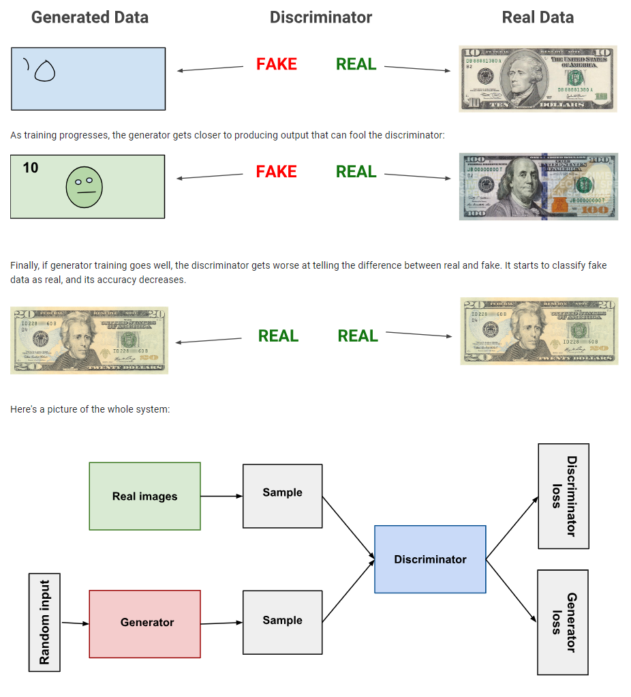

Buď $x$ *vstupní obraz*. $D(x)$ je *diskriminátor*, jehož výstupem je pravděpodobnost, že vstupní obraz je z *trénovací množiny*. Buď $z$ *latentní vektor* vzorkovaný z normalizovaného normálního rozdělení. $G(z)$ je *generátor*, který transformuje latentní vektor do prostoru dat. $D(G(z))$ je pravděpodobnost, že vygenerovaný obraz je skutečný (z trénovací množiny).

$D$ a $G$ hrají *minimax* hru, kde $D$ se snaží maximalizovat pravděpodobnost, že správně klasifikuje reálné a falešné data, zatímco $G$ se snaží minimalizovat pravděpodobnost, že $D$ správně klasifikuje falešné *(fake)* data.

- **Mode collapse** - generátor produkuje pouze jeden druh obrázků.
- Lze použít **Wasserstein loss**.

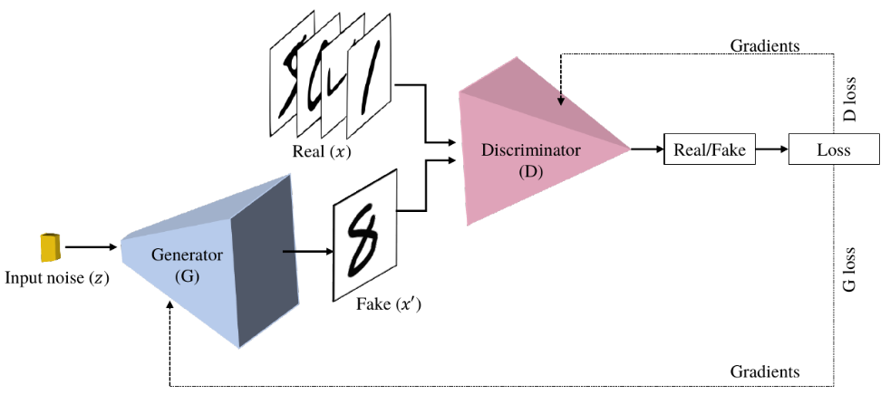

Trénování diskriminátoru:

1. Reálná data s `label=1`.
2. `error_real.backward()`
3. Falešná data s `label=0`.
4. `error_fake.backward()`
5. `optimizer_D.step()`

Trénování generátoru:

1. Generování falešných dat.
2. Falešná data dáme na vstup diskriminátoru s `label=1` (přestože jsou to falešná data).
3. `error.backward()`
4. `optimizer_G.step()`

### 17.1. Deep Convolutional Generative Adversarial Network (DCGAN)

- [https://pytorch.org/tutorials/beginner/dcgan_faces_tutorial](https://pytorch.org/tutorials/beginner/dcgan_faces_tutorial.html)

DCGAN je rozšíření architektury GAN o konvoluční vrstvy.

## 18. Style Transfer

- [https://pytorch.org/tutorials/advanced/neural_style_tutorial.html](https://pytorch.org/tutorials/advanced/neural_style_tutorial.html)

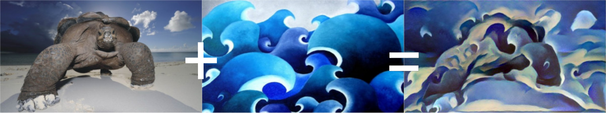

Hlavní myšlenka algoritmu *[Neural-Style](https://arxiv.org/abs/1508.06576)* (*Neural-Transfer*, *Style-Transfer*) spočívá v definici dvou vzdáleností $D_C$ *(content distance)*, tj. vzdálenost od obsahu obrázku, a $D_S$ *(style distance)*, tj. vzdálenost od stylu obrázku.

Algoritmus pracuje se třemi obrazy:

- $X$ *(input image)*,
- $C$ *(content image)*,
- $S$ *(style image)*.

Obraz $X$ může být buď bílý šum, nebo kopie $C$. Algoritmus optimalizuje $X$ tak, aby minimalizoval $D_C$ a $D_S$.
