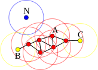
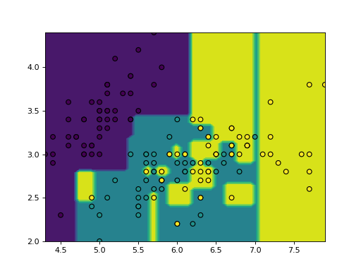
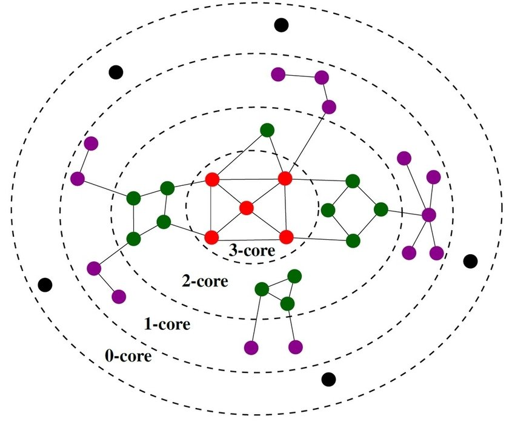
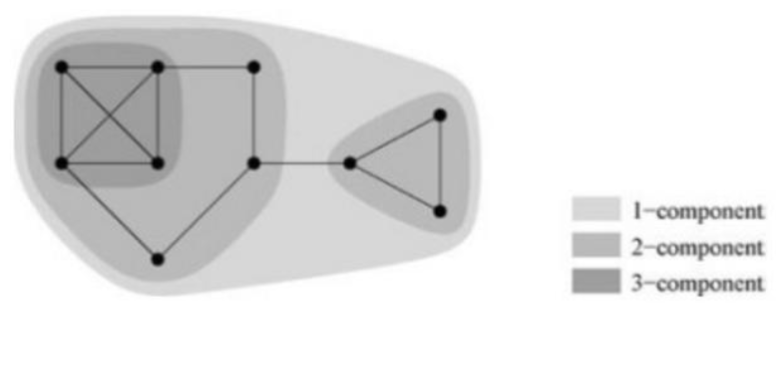

# AZD

- [1. Druhy dat, předzpracování dat, vlastnosti dat. Výběr atributů (zdůvodnění, princip, entropie, Gini index, …)](#1-druhy-dat-předzpracování-dat-vlastnosti-dat-výběr-atributů-zdůvodnění-princip-entropie-gini-index-)
  - [1.1. Typy dat](#11-typy-dat)
  - [1.2. Normalizace](#12-normalizace)
  - [1.3. Feature Engineering](#13-feature-engineering)
  - [1.4. Výběr atributů](#14-výběr-atributů)
    - [1.4.1. Filter methods](#141-filter-methods)
      - [1.4.1.1. Gini index](#1411-gini-index)
      - [1.4.1.2. Entropie](#1412-entropie)
    - [1.4.2. Wrapper methods](#142-wrapper-methods)
    - [1.4.3. Embedded methods](#143-embedded-methods)
- [2. Hledání častých vzorů v datech (základní principy, metody, varianty, implementace)](#2-hledání-častých-vzorů-v-datech-základní-principy-metody-varianty-implementace)
- [3. Shlukovací metody (shlukování pomocí reprezentantů, hierarchické shlukování). Shlukování na základě hustoty, validace shluků, pokročilé metody shlukování (CLARANS, BIRCH, CURE)](#3-shlukovací-metody-shlukování-pomocí-reprezentantů-hierarchické-shlukování-shlukování-na-základě-hustoty-validace-shluků-pokročilé-metody-shlukování-clarans-birch-cure)
  - [3.1. Shlukování pomocí reprezentantů](#31-shlukování-pomocí-reprezentantů)
    - [3.1.1. K-means](#311-k-means)
    - [3.1.2. K-medians](#312-k-medians)
    - [3.1.3. K-medoids](#313-k-medoids)
    - [3.1.4. Affinity propagation](#314-affinity-propagation)
  - [3.2. Hierarchické shlukování](#32-hierarchické-shlukování)
  - [3.3. Shlukování na základě hustoty](#33-shlukování-na-základě-hustoty)
    - [3.3.1. DBSCAN](#331-dbscan)
  - [3.4. Validace shluků](#34-validace-shluků)
- [4. Rozhodovací stromy (princip, algoritmus, metriky pro vhodnou volbu hodnot dělících atributů, prořezávání)](#4-rozhodovací-stromy-princip-algoritmus-metriky-pro-vhodnou-volbu-hodnot-dělících-atributů-prořezávání)
  - [4.1. Entropie](#41-entropie)
  - [4.2. Rozhodovací rovina](#42-rozhodovací-rovina)
  - [4.3. Přetrénování](#43-přetrénování)
- [5. Pravděpodobnostní klasifikace (Bayesovský teorém, naivní Bayesovský teorém)](#5-pravděpodobnostní-klasifikace-bayesovský-teorém-naivní-bayesovský-teorém)
- [6. Support Vector Machines (princip, algoritmus, kernel trick)](#6-support-vector-machines-princip-algoritmus-kernel-trick)
- [7. Neuronové sítě (základní princip, metody učení, aktivační funkce)](#7-neuronové-sítě-základní-princip-metody-učení-aktivační-funkce)
  - [7.1. Aktivační funkce](#71-aktivační-funkce)
  - [7.2. MLP](#72-mlp)
- [8. Vyhodnocení klasifikačních algoritmů (chybovost, přesnost, pokrytí, f-metrika)](#8-vyhodnocení-klasifikačních-algoritmů-chybovost-přesnost-pokrytí-f-metrika)
- [9. Regrese (lineární a nelineární regrese, regresní stromy, metody vyhodnocení kvality modelu)](#9-regrese-lineární-a-nelineární-regrese-regresní-stromy-metody-vyhodnocení-kvality-modelu)
  - [9.1. Simple linear regression](#91-simple-linear-regression)
  - [9.2. Regresní stromy](#92-regresní-stromy)
  - [9.3. Vyhodnocení](#93-vyhodnocení)
- [10. Typy sítí. Graf a matice sousednosti jako reprezentace sítě. Datové struktury pro reprezentaci různých typů sítí, výhody a nevýhody (matice sousednosti, seznamy sousedů, stromy sousedů), složitost operací, hybridní reprezentace](#10-typy-sítí-graf-a-matice-sousednosti-jako-reprezentace-sítě-datové-struktury-pro-reprezentaci-různých-typů-sítí-výhody-a-nevýhody-matice-sousednosti-seznamy-sousedů-stromy-sousedů-složitost-operací-hybridní-reprezentace)
  - [10.1. Datové struktury pro reprezentaci sítí](#101-datové-struktury-pro-reprezentaci-sítí)
- [11. Topologické vlastnosti sítí, charakteristické hodnoty a jejich distribuce (stupeň, délka cesty, průměr, shlukovací koeficient), typy centralit](#11-topologické-vlastnosti-sítí-charakteristické-hodnoty-a-jejich-distribuce-stupeň-délka-cesty-průměr-shlukovací-koeficient-typy-centralit)
  - [11.1. Centrality](#111-centrality)
- [12. Globální vlastnosti sítí (malý svět, bezškálovost, růst a preferenční připojování). Mocninný zákon a jeho interpretace v prostředí reálných sítí. Asortativita](#12-globální-vlastnosti-sítí-malý-svět-bezškálovost-růst-a-preferenční-připojování-mocninný-zákon-a-jeho-interpretace-v-prostředí-reálných-sítí-asortativita)
- [13. Modely sítí a jejich vlastnosti (Erdös–Rényi, Watts–Strogatz, Barabási–Albert)](#13-modely-sítí-a-jejich-vlastnosti-erdösrényi-wattsstrogatz-barabásialbert)
  - [13.1. Erdős-Rényi (ER)](#131-erdős-rényi-er)
  - [13.2. Watts-Strogatz (WS)](#132-watts-strogatz-ws)
  - [13.3. Barabási–Albert (BA)](#133-barabásialbert-ba)
- [14. Komunity. Globální a lokální přístupy. Modularita](#14-komunity-globální-a-lokální-přístupy-modularita)
  - [14.1. Modularita](#141-modularita)
  - [14.2. Hledání komunit](#142-hledání-komunit)
- [15. Jiné (pokročilé) modely sítí - modely orientované na komunitní strukturu, temporální sítě](#15-jiné-pokročilé-modely-sítí---modely-orientované-na-komunitní-strukturu-temporální-sítě)
  - [15.1. Stochastic Block Model (SBM)](#151-stochastic-block-model-sbm)
  - [15.2. Hierarchické síťové modely](#152-hierarchické-síťové-modely)
  - [15.3. Link Selection](#153-link-selection)
  - [15.4. Copying Model](#154-copying-model)
  - [15.5. Temporální sítě](#155-temporální-sítě)
- [16. Odolnost sítí, šíření jevů v sítích. Šíření a maximalizace vlivu v sítích. Predikce linků. Sampling](#16-odolnost-sítí-šíření-jevů-v-sítích-šíření-a-maximalizace-vlivu-v-sítích-predikce-linků-sampling)
  - [16.1. Odolnost sítí](#161-odolnost-sítí)
  - [16.2. Šíření a maximalizace vlivu v sítích](#162-šíření-a-maximalizace-vlivu-v-sítích)
    - [16.2.1. Susceptible-Infected (SI) model](#1621-susceptible-infected-si-model)
    - [16.2.2. Nezávislý kaskádový model šíření (IC, Independent Cascade)](#1622-nezávislý-kaskádový-model-šíření-ic-independent-cascade)
  - [16.3. Predikce linků](#163-predikce-linků)
    - [16.3.1. Predikce linků na základě podobnosti](#1631-predikce-linků-na-základě-podobnosti)
  - [16.4. Sampling](#164-sampling)
    - [16.4.1. Pravděpodobnostní vzorkování](#1641-pravděpodobnostní-vzorkování)
    - [16.4.2. Vzorkování prohledáváním grafu](#1642-vzorkování-prohledáváním-grafu)
- [17. Vícevrstvé sítě, jejich typy a reprezentace. Metody analýzy a vizualizace vícevrstvých sítí, projekce, zploštění](#17-vícevrstvé-sítě-jejich-typy-a-reprezentace-metody-analýzy-a-vizualizace-vícevrstvých-sítí-projekce-zploštění)
  - [17.1. Zploštění](#171-zploštění)
  - [17.2. Projekce](#172-projekce)
- [18. Lokální a globální vlastnosti vícevrstvých sítí, typy centralit a náhodné procházky. Metody detekce komunit ve vícevrstvých sítích](#18-lokální-a-globální-vlastnosti-vícevrstvých-sítí-typy-centralit-a-náhodné-procházky-metody-detekce-komunit-ve-vícevrstvých-sítích)
  - [18.1. Náhodná procházka ve vícevrstvé síti](#181-náhodná-procházka-ve-vícevrstvé-síti)
  - [18.2. Vzdálenosti ve vícevrstvých sítích](#182-vzdálenosti-ve-vícevrstvých-sítích)
  - [18.3. Detekce komunit ve vícevrstvých sítích](#183-detekce-komunit-ve-vícevrstvých-sítích)
- [19. Algoritmy pro pattern matching (Vyhledávání jednoho vzorku, více vzorků; Vyhledávání regulárních výrazů; Přibližné vyhledávání)](#19-algoritmy-pro-pattern-matching-vyhledávání-jednoho-vzorku-více-vzorků-vyhledávání-regulárních-výrazů-přibližné-vyhledávání)
  - [19.1. Vyhledávání jednoho a více vzorků](#191-vyhledávání-jednoho-a-více-vzorků)
    - [19.1.1. Hrubou silou](#1911-hrubou-silou)
    - [19.1.2. Aho-Corasick - pomocí konečného automatu](#1912-aho-corasick---pomocí-konečného-automatu)
    - [19.1.3. Morris-Pratt (MP)](#1913-morris-pratt-mp)
    - [19.1.4. Horspool](#1914-horspool)
  - [19.2. Vyhledávání regulárních výrazů](#192-vyhledávání-regulárních-výrazů)
  - [19.3. Přibližné vyhledávání](#193-přibližné-vyhledávání)
- [20. Dokumentografické informační systémy (DIS) (modely DIS - booleovský, vektorový, lexikální analýza, stemming a lematizace, stop slova, konstrukce indexů, vyhodnocení dotazu, relevance, přesnost, úplnost, F-míra)](#20-dokumentografické-informační-systémy-dis-modely-dis---booleovský-vektorový-lexikální-analýza-stemming-a-lematizace-stop-slova-konstrukce-indexů-vyhodnocení-dotazu-relevance-přesnost-úplnost-f-míra)
  - [20.1. Lexikální analýza](#201-lexikální-analýza)
  - [20.2. Booleovský model](#202-booleovský-model)
  - [20.3. Vektorový model](#203-vektorový-model)
  - [20.4. Vyhodnocení dotazu](#204-vyhodnocení-dotazu)
- [21. Lineární algebra v DIS (metody redukce dimenze, rozklady matic, latentní sémantika, analýza hypertextových dokumentů, PageRank)](#21-lineární-algebra-v-dis-metody-redukce-dimenze-rozklady-matic-latentní-sémantika-analýza-hypertextových-dokumentů-pagerank)
  - [21.1. Latentní sémantická analýza (LSA)](#211-latentní-sémantická-analýza-lsa)
  - [21.2. PageRank](#212-pagerank)
- [22. Neuronové sítě a zpracování textu (word embedding, klasifikace textu, generování textu, …)](#22-neuronové-sítě-a-zpracování-textu-word-embedding-klasifikace-textu-generování-textu-)
  - [22.1. Word Embedding](#221-word-embedding)
  - [22.2. Klasifikace textu](#222-klasifikace-textu)
    - [22.2.1. BERT](#2221-bert)
  - [22.3. Generování textu](#223-generování-textu)
- [23. Popište architekturu konvolučních neuronových sítí, použité vrstvy, princip fungování, základní typy architektur](#23-popište-architekturu-konvolučních-neuronových-sítí-použité-vrstvy-princip-fungování-základní-typy-architektur)
  - [23.1. Vrstvy](#231-vrstvy)
  - [23.2. Typy architektur](#232-typy-architektur)
- [24. Popište architekturu rekurentních neuronových sítí, typy neuronů, princip fungování](#24-popište-architekturu-rekurentních-neuronových-sítí-typy-neuronů-princip-fungování)
  - [24.1. Vanilla RNN](#241-vanilla-rnn)
  - [24.2. Long Short-Term Memory](#242-long-short-term-memory)
  - [24.3. Gated Recurrent Unit (GRU)](#243-gated-recurrent-unit-gru)
  - [24.4. Jaký je rozdíl mezi RNN a architekturou Transformer?](#244-jaký-je-rozdíl-mezi-rnn-a-architekturou-transformer)

## 1. Druhy dat, předzpracování dat, vlastnosti dat. Výběr atributů (zdůvodnění, princip, entropie, Gini index, …)


Explorativní datová analýza (EDA) - prvotní průzkum dat, hledání vzorů, anomálií, ...

- grafy distribucí (histogram)
- krabicové grafy (boxploty)

  
- souhrné číselné statistiky (průměr, medián, rozptyl, směrodatná odchylka, ...)
- vztahy mezi daty, korelace (scatter plot, heatmapa)

### 1.1. Typy dat

1. **Kvantitativní data**
   - Tabulková data
   - Časové řady - signálová data, zvuk
   - Obrazová data
2. **Kategorická data**
   - příznak náleží do nějaké (konečné) množiny hodnot/tříd
   - předzpracování:
     - *ordinal encoding* (dataset Titanic - paluba)
     - *one-hot encoding* *(dummy encoding, binarization)*
       - Někdy je vhodné kódovat třeba $0.1$ místo jedničky, protože to může silně ovlivnit výpočty vzdáleností.
     - *algorithmic encoding* - cyklické příznaky - třeba dny v týdnu *(feature engineering)*
3. **Textová data**
   - **tokenizace** - rozdělení textu na jednotlivé tokeny (slova, znaky, ...)
   - odstranění **stop-slov** (slova, která nemají význam - např. "a", "the", "is", ...)
   - **stemming** - zkracování slov na jejich základní tvar (např. "running" -> "run")
     - Porterův stemmer
   - **embedding** - převod slov na vektory
     - Word2Vec - modely Skip-gram a CBOW
     - GloVe - Global Vectors for Word Representation
4. **Grafová data**

### 1.2. Normalizace

1. **Min-max** $[0,1]$
    $$\tilde{x}=\dfrac{x-\min(x)}{\max(x)-\min(x)} \Rightarrow \tilde{x}\in[0,1]$$
2. **Škálování průměrem**
    $$\tilde{x}=\dfrac{x-\mu}{\max(x)-\min(x)} \Rightarrow \tilde{x}\in[-1,1]$$
3. **Standardizace** (z-skóre)
    $$z=\frac{x - \mu}{\sigma} \Rightarrow \mu(z)=0,\,\,\sigma(z)=1$$
4. **Nelineární** transformace (mocninná / logaritmická)
   - Transformace dat, aby byly více normální (gaussovské).
   - **Box-Cox** - pouze pro (striktně) kladné hodnoty
   - **Yeo-Johnson**
5. **Interkvartilové rozpětí** (IQR) - robustní vůči odlehlým pozorování (outliers)
   $$\tilde{x}=\dfrac{x-\mathrm{med}(x)}{x_{0.75}-x_{0.25}}$$

### 1.3. Feature Engineering

- Vytváření nových atributů z existujících dat.
  - cyklické příznaky (např. dny v týdnu, hodiny v denním cyklu)
  - obrazové příznaky

### 1.4. Výběr atributů


Proč vybírat atributy?

- prokletí dimenzionality
- snížit výpočetní náročnost
- zlepšit interpretovatelnost/vysvětlitelnost modelu

#### 1.4.1. Filter methods

- Nezávisí na konkrétním klasifikačním algoritmu.
- Využívají znalost tříd (supervised).

##### 1.4.1.1. Gini index

Buď třídy $1,2,\dots,C$ a buď $v_1,v_2, \dots, v_n$ všechny (diskrétní nebo diskretizované) hodnoty atributu $A$, kde $n=|\set{A}|$. Gini index pro konkrétní hodnotu $v_i, i=1,\dots,n,$ je definován jako:

$$
\begin{align*}
\mathrm{Gini}(v_i) &= \sum_{c=1}^C p_c(v_i)(1 - p_c(v_i)),\\
&= \underbrace{\sum_{c=1}^C p_c(v_i)}_{=1} - \sum_{c=1}^C p_c(v_i)^2,\\
&= \boxed{1 - \sum_{c=1}^C p_c(v_i)^2,}
\end{align*}
$$

kde $p_c(v_i)$ je pravděpodobnost, že náhodně vybraný prvek z multi-množiny $\mathcal{V}_i=\set{a | a\in A \land a = v_i}$ patří do třídy $c$.

Gini index pro atribut (příznak) $A$ je definován jako vážený průměr Gini indexů pro jednotlivé hodnoty $v_i$:

$$
\mathrm{Gini}(A) = \sum_{i=1}^n \dfrac{n_i}{n} \cdot \mathrm{Gini}(v_i),
$$

kde $n_i$ je počet objektů (záznamů), které mají hodnotu $v_i$ a $n$ je celkový počet objektů.

##### 1.4.1.2. Entropie

Entropie pro konkrétní hodnotu $v_i$ je definována jako:

$$
E(v_i) = -\sum_{c=1}^C p_c(v_i) \cdot \log(p_c(v_i))
$$

Entropie pro atribut $A$ je definována jako vážený průměr entropií pro jednotlivé hodnoty $v_i$:

$$
E(A) = \sum_{i=1}^n \dfrac{n_i}{n} \cdot E(v_i)
$$

#### 1.4.2. Wrapper methods

- Závisí na konkrétním klasifikačním algoritmu.
- Zvyšují riziko overfittingu.
- Např. postupné přidávání atributů a vyhodnocení (opakuji, dokud se zlepšuje přesnost).

#### 1.4.3. Embedded methods

- Rozhodovací strom
- Lineární regrese
- Wrapper + Embedded: *Recursive Feature Elimination (RFE)* - seřadí atributy podle důležitosti (feature importance) a postupně je odstraňuje.

## 2. Hledání častých vzorů v datech (základní principy, metody, varianty, implementace)

**Formální kontext** je uspořádaná trojice $(X, Y, I)$, kde:

- $X$ je množina objektů,  
- $Y$ je množina atributů,  
- $I \subseteq X \times Y$ je binární relace.

Skutečnost, že objekt $x \in X$ má atribut $y \in Y$, značíme $(x, y) \in I$.

Níže je příklad formálního kontextu (binární matice transakcí), kde $X=\{t_1,t_2,\ldots,t_6\}$ a $Y=\{i_1,i_2,i_3,i_4\}$ a $I=\mathsf{T}$. Tzn. objekty jsou transakce a atributy jsou položky v transakcích. Binární relace $I$ značí, že transakce $t_i$ (objekt) obsahuje položku $i_j$ (atribut).


<details><summary> Výpočet spolehlivosti pravidel </summary>

|Pravidlo|Spolehlivost|
|--|--|
|$i_1 \Rightarrow i_2$| $\dfrac{\mathrm{supp}(i_1, i_2)}{\mathrm{supp}(i_1)}=\dfrac{\frac{1}{3}}{\frac{1}{2}}=\frac{2}{3}$|

</details>

Vytvoříme *Rymon Tree* - strom všech kombinací atributů (položek), pro které je podpora větší něž nula (obecně větší než minimální podpora). Proč je ve třetí úrovni stromu jen $i_{1,2,3}$? Bo, existuje jen jeden řádek kde bitový and pro tři atributy vyjde `true`.

**Podporu (support)** $i$-tého atributu $y$ v matici $\mathsf{T}$ s $N$ objekty (řádky) definujeme:

$$\mathrm{supp}(y_i) = \frac{1}{N}\sum\limits_{r=1}^N \mathsf{T}_{r,y_i}\quad\text{(relativní četnost)}$$

Pro více atributů podporu spočteme jako relativní četnost bitového ANDu mezi příslušenými sloupci:

$$\mathrm{supp}(y_i,y_j) = \frac{1}{N}\sum\limits_{r=1}^N \mathsf{T}_{r,i} \wedge \mathsf{T}_{r,j}$$

a podobně pro více atributů.

**Spolehlivost (confidence)** asociačního pravidla $A \Rightarrow B$ je definována jako:

$$
\text{conf}(A \Rightarrow B) = \frac{\text{supp}(A, B)}{\text{supp}(A)}
$$

Spolehlivost odpovídá **podmíněné pravděpodobnosti**, že se $B$ vyskytne za předpokladu, že se vyskytlo $A$:

$$
\text{conf}(A \Rightarrow B) = P(B \mid A) = \frac{P(A \cap B)}{P(A)}
$$

Implementace např. pomocí algoritmu **Apriori**.

Algoritmus **FP Growth** je efektivnější než Apriori, protože neprovádí generování kandidátů. Místo toho vytváří stromovou strukturu **FP Tree**. Je vhodný i pro velké datové sady. Existuje paralelní distribuovaná implementace pro *Apache Spark*.

Generování kombinací:

```py
N = 5
for a in range(1, N + 1):
    for b in range(a + 1, N + 1):
        for c in range(b + 1, N + 1):
            # This will print all combinations
            # of (a, b, c), s.t., a < b < c, s.t.,
            # a, b, c are all in [1, N]
            print(a, b, c)
```

## 3. Shlukovací metody (shlukování pomocí reprezentantů, hierarchické shlukování). Shlukování na základě hustoty, validace shluků, pokročilé metody shlukování (CLARANS, BIRCH, CURE)

Co je shlukovaní? Rozdělení dat do skupin (shluků) takových, že jejiž členové jsou si v nějakým smyslu podobní. Učení bez učitele *(unsupervised learning)*.


### 3.1. Shlukování pomocí reprezentantů

#### 3.1.1. K-means

- Vstup: $k$ - počet shluků, $X$ - množina bodů (dat)
- Výstup: $k$ shluků (shluky jsou reprezentovány svými centroidy - průměry bodů ve shluku)

1. Inicializace centroidů (náhodně nebo pomocí K-means++).
2. Přiřazení bodů k nejbližšímu centroidu (shluku).
3. Aktualizace centroidů (průměry bodů ve shluku).
4. Opakuj 2-3, dokud se centroidy nezmění.

#### 3.1.2. K-medians

- Stejné jako K-means, ale místo průměru se používá medián.
- K-medians je robustnější vůči odlehlým pozorováním (outliers).
- Často se používá Manhattanovská vzdálenost (L1 norm).

#### 3.1.3. K-medoids

- Reprezentantem shluku *(medoid)* je záznam z datové sady (nikoliv průměr nebo medián).
- Přesné řešení je NP-těžký problém, obvykle se používají heuristiky.

**PAM** *(Partitioning Around Medoids)*:

1. Náhodně vybereme $k$ medoidů.
2. Přiřadíme každý bod k nejbližšímu medoidu.
3. (SWAP) Dokud se snižuje cenová funkce (třeba SSE):
    - Pro každý medoid $m$ a bod $x$ (který není medoid):
        - Vypočítáme změnu cenové funkce při výměně $m$ za $x$.
        - Pokud je aktuální změna lepší, uložíme dvojici $(m_{best},x_{best})=(m,x)$.
    - Pokud $(m_{best},x_{best})$ sníží cenovou funkci, vyměníme $m_{best}$ za $x_{best}$. Jinak algoritmus končí.

**CLARA** a **CLARANS** urychlují PAM za cenu menší kvality shlukování.

#### 3.1.4. Affinity propagation

- Reprezentantem shluku *(exemplar)* je záznam z datové sady.

### 3.2. Hierarchické shlukování

- Časová složitost alespoň $\mathcal{O}(n^2)$, kde $n$ je počet bodů.
- Vhodné pro menší množiny dat.
- Na začátku máme $n$ shluků (každý bod je shluk).
- Postupně slučujeme shluky do větších shluků.
- V každém kroce vybereme dva shluky, které sloučíme. Výběr zavísí na zvolené metodě (níže), např.:
  
    $$(i^*,j^*)=\argmin\limits_{\substack{i \ne j \\ i,j = 1,\ldots,k}} d_{CL}(C_i, C_j)$$

|||
|--|--|
|||


- **Single Linkage**

  $$d_{SL}(C_i,C_j) = \min\set{d(x,y)\mid x\in C_i, y\in C_j}$$

- **Complete Linkage**

  $$d_{CL}(C_i,C_j) = \max\set{d(x,y)\mid x\in C_i, y\in C_j}$$

- **Average Linkage**

  $$d_{AL}(C_i,C_j)=\dfrac{\sum\limits_{x\in C_i}\sum\limits_{y\in C_j}d(x,y)}{\lvert C_i \rvert\cdot\lvert C_j\rvert}$$

- **Centroid method** (vzdálenost mezi centroidy)

  $$d_C(C_i,C_j) = d(\mu_i,\mu_j),\text{ kde } \mu_i=\dfrac{1}{\lvert C_i\rvert}\sum\limits_{x\in C_i}x$$

- **Ward's method**

  $$d_W(C_i,C_j)=\dfrac{\lvert C_i\rvert\cdot\lvert C_j\rvert}{\lvert C_i\rvert+\lvert C_j\rvert}d^2(C_i,C_j)$$
- **Bisecting k-means** - top-down
  - Na začátku máme jeden shluk (všechny body).
  - Rozdělujeme shluk na dva pomocí 2-means.
- **CURE** (Clustering Using REpresentatives)
  - k-d strom
  - funguje i pro různě velké shluky
- **BIRCH** (Balanced Iterative Reducing and Clustering using Hierarchies)
  - používá stromovou strukturu *Clustering Feature Tree (CFT)* - díky tomu lze efektivně aplikovat hierarchické shlukování (nad listy CFT)
  - lze použít i nad velkými databázemi, není nutné mít všechny body v paměti

### 3.3. Shlukování na základě hustoty

#### 3.3.1. DBSCAN

- Vstup: $X$ - množina bodů, $\varepsilon$ - velikost okolí, `min_sample` - minimální počet bodů v okolí
- Výstup: shluky a šum (outliers, shluk `-1`)
- Není nutné specifikovat počet shluků. Shluky mohou mít různou velikost a tvar a nemusí být lineárně separabilní.


Algoritmus:

1. Identifikace jádrových bodů *(core points)* - body, které mají alespoň `min_sample` bodů v okolí o velikosti $\varepsilon$.
2. Identifikace bodů dostupných z jádrových bodů *(border points)* - body, které mají méně než `min_sample` bodů v okolí o velikosti $\varepsilon$, ale jsou v okolí jádrového bodu.
3. Identifikace šumu *(noise/outliers)* - body, které nejsou jádrové ani okrajové.



<details><summary> Popis příkladu </summary>

- `min_sample=4`

Bod `A` a ostatní červené body jsou **jádrové body** (mají alespoň `min_sample` bodů v okolí o velikosti $\varepsilon$). Body `B` a `C` jsou dostupné z jádrových bodů, takže patří do červeného shluku. Bod `N` je šum (není jádrový ani okrajový).

</details>

Jak zvolit hyperparametry?

- pro `min_sample = 1` je každý bod *core point* (tzn. jeden shluk), `min_sample = 2` odpovídá *single linkage*, tzn. dává smysl pouze `min_sample >= 3`
- heuristika: `min_sample = 2 * dim(X)`
- následně lze zvolit $\varepsilon$ pomocí *k-nearest neighbor distance* (k-NN) - pro každý bod spočítáme vzdálenost k `min_sample - 1`-tému nejbližšímu bodu a seřadíme podle vzdálenosti. Pak hledáme "loket" (elbow) v grafu. Alternativně pro malé datové sady lze zkoumat distribuci vzdáleností v matici vzdáleností.

**OPTICS** *(Ordering Points To Identify the Clustering Structure)* - zobecňuje DBSCAN.

### 3.4. Validace shluků

- **Elbow method** - graf SSE (sum of squared errors) v závislosti na počtu shluků. Hledáme "loket" (elbow), kde se SSE přestává snižovat. (Pouze pro sférické shluky.)
- **Silhouette score** - měří, jak dobře je bod přiřazen do shluku. Čím vyšší hodnota, tím lepší shlukování $[-1,1]$.
- **Intra/Inter cluster distance** - měří vzdálenosti mezi shluky a uvnitř shluku. Minimalizujeme vzdálenosti uvnitř shluku a maximalizujeme vzdálenosti mezi shluky.
  - $\mathrm{intra}(C_i) = \dfrac{1}{\lvert C_i\rvert}\sum\limits_{x,y\in C_i}d(x,y)$
  - $\mathrm{inter}(C_i,C_j) = d(\mu_i,\mu_j)$
- Pokud je počet shluků roven počtu tříd, můžeme spočítat **matici záměn** *(confusion matrix)* a spočítat přesnost klasifikace.

> *Curse of dimensionality* - ve vysokých dimenzích je obtížné najít shluky, protože vzdálenosti mezi body se stávají podobné.
>
> 

## 4. Rozhodovací stromy (princip, algoritmus, metriky pro vhodnou volbu hodnot dělících atributů, prořezávání)

Rozhodovací strom je klasifikační algoritmus. Je to příklad učení s učitelem *(supervised learning)*.


### 4.1. Entropie

- Podobným způsobem lze místo Gini indexu počítat [**entropii**](https://www.cs.toronto.edu/~axgao/cs486686_f21/lecture_notes/Lecture_07_on_Decision_Trees.pdf) jednotlivých pravidel.
- Následně musíme spočítat **information gain** pro každý atribut, který zvažujeme pro rozdělení uzlu:
    $$
    \text{information gain} = \text{entropie před rozdělením} - \text{vážená entropie po rozdělení}
    $$
- Entropii před výběrem kořene spočteme jako $-\sum\limits_{c\in\mathcal{C}}p_c\log(p_c)$, kde $p_c$ je relativní četnost třídy $c$ v trénovacích datech. Následně vždy používáme poměry tříd v přechůdci *(parent node)*.
- Vybíráme atribut, který **maximalizuje information gain**.

Pro pomícháná data (např. 50 % třída A, 50 % třída B) je entropie i Gini index maximální. Obojí se snažíme minimalizovat.


### 4.2. Rozhodovací rovina

Pro dva atributy můžeme rozhodovací strom vizualizovat jako rozhodovací rovinu, která odděluje jednotlivé třídy. Rozhodovací rovinu lze vytvořit sjednocením "obdélníků" (částí roviny) odpovídajících větvím stromu.


Případně pro složitější strom:


Nemusí to být jedna křivka, může to být sloučení [více "obdélníků"](https://scikit-learn.org/stable/modules/generated/sklearn.inspection.DecisionBoundaryDisplay.html).



### 4.3. Přetrénování

Bez omezení vždy dojde k overfittingu (přetrénování). Preferujeme jednoduché stromy (s menším hloubkou a menším počtem uzlů).

Přetrénování můžeme bránit:

1. **Předčasným zastavením** *(early stopping)* - nastavením:
   - maximální hloubky
   - maximálního počtu příznaků
   - minimálního počtu vzorků v listu
   - minimálního počtu vzorků pro rozdělení uzlu
2. **Prořezáváním**
   - *Cost Complexity Pruning (CCP)* - prořezávání na základě přesnosti a složitosti (tzn. počtu listů)

## 5. Pravděpodobnostní klasifikace (Bayesovský teorém, naivní Bayesovský teorém)

Buď $(\Omega,\mathcal{A},P)$ P.P. a buď $A,B\in\mathcal{A}$, $P(B)>0$. Podmíněnou pravděpodobnost náhodného jevu $A$ za podmínky, že nastal jev $B$ definujeme:
$$\boxed{\,\,P(A \mid B)=\dfrac{P(A \cap B)}{P(B)}\,\,}$$

**Věta o úplné pravděpodobnosti:**

- $\bigcup\limits_{i=1}^n B_i=\Omega$
- $\forall i,j \in\set{1,...,n},i\neq j: \,B_i \cap B_j = \emptyset$
- $\forall i \in\set{1,...,n}: \,B_i > 0$
$$\boxed{\,\,P(A)=\sum_{i=1}^{n} P(A \mid B_i)\cdot P(B_i)\,\,}$$

**Bayesova věta:**

$$
\boxed{
\begin{align*}
    P(B_i | A)&=\dfrac{P(A \cap B_i)}{P(A)}\\&=\dfrac{P(A \mid B_i)\cdot P(B_i)}{\sum\limits_{j=1}^n P(A \mid B_j)\cdot P(B_j)}
\end{align*}
}
$$

V případě Naive Bayes klasifikátoru je jmenovatel $P(A)$ konstantní, takže se dá vynechat:

$$
\boxed{
P(B_i | A)\propto P(A | B_i) \cdot P(B_i)
}
$$

Pro náš příklad s e-maily:

$$
P(S | zpráva)\propto P(zpráva | S) \cdot P(S)
$$

- [StatQuest Naive Bayes](https://youtu.be/O2L2Uv9pdDA?si=4IGcmsMOA5Jjyfvi)
- Předpokládáme, že **atributy jsou nezávislé** (což nemusí být pravda). V našem příkladu uvažujeme, že slova zpráv jsou nezávislé, což určitě není pravda. Např. slova peníze teď se můžou častěji vyskytovat společně.
- Před "AI" byl NB hlavní nástroj pro detekci spamu.


## 6. Support Vector Machines (princip, algoritmus, kernel trick)

Buď $\mathcal{X}=(\mathbf{x}_1,y_1),\ldots,(\mathbf{x}_n,y_n)$ trénovací dataset, kde $\mathbf{x}_i\in\mathbb{R}^d$ a $y_i\in\{-1,1\}$.

Lineární SVM je klasifikační algoritmus, který se snaží najít hyperrovinu, která odděluje jednotlivé třídy ve smyslu maximální mezery *(maximum-margin hyperplane / widest-street principle)*.


Vektor $\mathbf{w}$ je normálový vektor k dělící hyperrovině a $b$ je posun.

>Rozhodovací pravidlo:
>
>$$\begin{equation}\mathrm{sgn}\left(\left\langle\mathbf{w},\mathbf{u} \right\rangle + b\right)=\begin{cases}+1 & \text{ (positive class)}\\-1 & \text{ (negative class)}\end{cases}\tag{1}\end{equation}$$

Z (1) vyplývá (hodnoty 1 a -1 jsou libovolné, ale pevné):

$$
\begin{align}
  \left\langle\mathbf{w},\mathbf{x}^+ \right\rangle + b &\geq 1,\tag{2}\\
  \left\langle\mathbf{w},\mathbf{x}^- \right\rangle + b &\leq -1,\tag{3}
\end{align}
$$

$$
y_i = \begin{cases}
  +1 & \text{positive}\\
  -1 & \text{negative}
\end{cases}
$$

Levé strany rovnic (2,3) přenásobím $y_i$, čímž dostanu:

$$
\begin{align*}
  y_i(\left\langle\mathbf{w},\mathbf{x}_i \right\rangle + b) &\geq 1\\
  y_i(\left\langle\mathbf{w},\mathbf{x}_i \right\rangle + b) - 1&\geq 0
\end{align*}
$$

>Navíc pro $\mathbf{x}_i$ ležící "na krajnici (hranice mezery)":
>
>$$\begin{equation}   y_i(\left\langle\mathbf{w},\mathbf{x}_i \right\rangle + b) - 1= 0 \tag{4}\end{equation}$$
>
> Tuto podmínku nazýváme *hard margin*. Lze také definovat *soft margin*, kdy povolíme chyby, které modulujeme hyperparametrem $C\in\mathbb{R}$.

Rovnice (4) reprezentuje tzv. podpůrné nadroviny:

$$\begin{align*}
&\left\langle\mathbf{w},\mathbf{x}^+ \right\rangle + b = +1\tag{4a}\\
&\left\langle\mathbf{w},\mathbf{x}^- \right\rangle + b = -1\tag{4b}
\end{align*}$$


$$
\begin{align*}
  \text{width} &= \dfrac{\left\langle \mathbf{x}^+-\mathbf{x}^-, \mathbf{w}\right\rangle}{||\mathbf{w}||}\\
  &= \dfrac{\left\langle\mathbf{w},\mathbf{x}^+ \right\rangle - \left\langle\mathbf{w},\mathbf{x}^- \right\rangle}{||\mathbf{w}||}\\
  &= \dfrac{1-b - (-1-b)}{||\mathbf{w}||}\quad\text{(from (4a,4b))}\\
  &= \dfrac{2}{||\mathbf{w}||}\\
\end{align*}
$$

Vynucením podmínky (4) jsme dostali vzorec pro šířku silnice, kterou chceme maximalizovat:

$$
\begin{align*}
  &\max \dfrac{2}{||\mathbf{w}||} \iff \min||\mathbf{w}|| \iff \boxed{\min\frac{1}{2}||\mathbf{w}||^2}\\
  &\text{s.t.} \quad y_i(\left\langle\mathbf{w},\mathbf{x}_i \right\rangle + b) - 1 = 0\\
\end{align*}
$$

Lagrangeova funkce:

$$
\begin{align}
  L&=\frac{1}{2}||\mathbf{w}||^2-\sum_{i=1}^n \alpha_i\left[y_i(\left\langle\mathbf{w},\mathbf{x}_i \right\rangle + b) - 1\right]\notag\\
  \dfrac{\partial L}{\partial \mathbf{w}} &= \mathbf{w} - \sum_{i=1}^n \alpha_i y_i \mathbf{x}_i \Rightarrow \mathbf{w} =\boxed{\sum_{i=1}^n \alpha_i y_i \mathbf{x}_i}\tag{5} \\
  \dfrac{\partial L}{\partial b} &= -\sum_{i=1}^n \alpha_i y_i \Rightarrow \boxed{\sum_{i=1}^n \alpha_i y_i = 0}\tag{6}\\
\end{align}
$$

Dosazením do $L$ získáme duální problém:

$$
\begin{align}
  \max L&=\max\frac{1}{2}\sum_{i=1}^n \alpha_i y_i \sum_{j=1}^n \alpha_j y_j \left\langle\mathbf{x}_j,\mathbf{x}_i\right\rangle-\notag\\
  &-\sum_{i=1}^n \alpha_i\left[y_i\left(\sum_{j=1}^n \alpha_j y_j \left\langle\mathbf{x}_j,\mathbf{x}_i\right\rangle + b\right) - 1\right]=\notag\\
  &=\max\frac{1}{2}\sum_{i=1}^n\sum_{j=1}^n \alpha_i\alpha_j y_i y_j \left\langle\mathbf{x}_i,\mathbf{x}_j\right\rangle-\notag\\
  &-\sum_{i=1}^n\sum_{j=1}^n \alpha_i\alpha_j y_i y_j \left\langle\mathbf{x}_i,\mathbf{x}_j\right\rangle -\notag\\
  &-\sum_{i=1}^n \underbrace{\alpha_i y_i}_{=0\text{ (6)}} b + \sum_{i=1}^n \alpha_i=\notag\\
  &=\boxed{\max\sum_{i=1}^n \alpha_i -  \sum_{i=1}^n \sum_{j=1}^n \alpha_i\alpha_j y_iy_j\left\langle\mathbf{x}_i,\mathbf{x}_j\right\rangle}\tag{7}\\
\end{align}
$$

Z (1) a (5) dostáváme upravené rozhodovací pravidlo pro nové vektory (data) $\mathbf{u}$:

$$
\begin{align}
  \mathrm{sgn}\left( \sum_{i=1}^n \alpha_i y_i\left\langle \mathbf{x}_i, \mathbf{u}\right\rangle+b\right)
\end{align}
$$

Lze si všimnout, že (7) záleží pouze na skalárním součinu vektorů $\mathbf{x}_i$ a $\mathbf{x}_j$.

Tento algoritmus není schopný vyřešit lineárně **ne**separabilní problém (XOR):


V jiném prostoru (např. ve 3D) tento problém je separabilní. Použijeme *kernel trick*, t.j., transformaci dat do jiného prostoru (to lze, protože SVM závisí pouze na skalárním součinu vektorů).:

$$
\begin{align}
  \varphi(\mathbf{x}) &\Rightarrow \max\left\langle \varphi(\mathbf{x})_i,\varphi(\mathbf{x})_j\right\rangle\notag\\
  &\Rightarrow K(\mathbf{x}_i,\mathbf{x}_j) = \left\langle \varphi(\mathbf{x})_i,\varphi(\mathbf{x})_j\right\rangle\notag\\
\end{align}
$$

Polynomiální kernel $\boxed{(\left\langle\mathbf{x}_i,\mathbf{x}_j\right\rangle + 1)^D,}$ kde $D$ je dimenze prostoru (pro $D=2$ je to kvadratický kernel).

Gaussian kernel (RBF kernel):
$$\boxed{e^{-\dfrac{||\mathbf{x}_i-\mathbf{x}_j||}{\sigma}}}$$

Rozhodovací rovina ve 2D: (a) lineární kernel a lineárně separabilní data, (b) **ne**lineární kernel a lineárně **ne**separabilní data.


## 7. Neuronové sítě (základní princip, metody učení, aktivační funkce)

### 7.1. Aktivační funkce


| Activation | Formula |
|------------|---------|
| **Sigmoid** | $\sigma(x) = \dfrac{1}{1 + e^{-x}},\quad\quad\dfrac{d}{dx}\sigma(x) = \sigma(x)(1 - \sigma(x))$ |
| **ReLU (Rectified Linear Unit)** | $\text{ReLU}(x) = \max(0, x)$ |
| **Tanh (Hyperbolic Tangent)** | $\tanh(x) = \frac{e^x - e^{-x}}{e^x + e^{-x}}$ |
| **Softmax** | $\text{softmax}(x_i) = \frac{e^{x_i}}{\sum_{j=1}^K e^{x_j}}$, where $K$ is the number of classes |
| **Leaky ReLU** | $\text{Leaky ReLU}(x) = \begin{cases} x & \text{if } x \geq 0 \\ \alpha x & \text{if } x < 0 \end{cases}$, where $\alpha$ is a small constant (e.g., $0.01$) |

### 7.2. MLP

Vícevrstvý perceptron.


Random initialization:
$$
\begin{align*}
    \mathsf{W}^{(1)} &= \begin{bmatrix} 0.2 & 0.4 \\ 0.5 & 0.9 \\ 0.8 & 0.1 \end{bmatrix} & \mathbf{b}^{(1)} &= \begin{bmatrix} 0.1 \\ 0.2 \\ 0.3 \end{bmatrix}\\
    \mathsf{W}^{(2)} &= \begin{bmatrix} 0.3 & 0.7 & 0.2 \\ 0.6 & 0.5 & 0.8 \end{bmatrix} & \mathbf{b}^{(2)} &= \begin{bmatrix} 0.1 \\ 0.4 \end{bmatrix}
\end{align*}
$$

Assume input $\mathbf{x} = \begin{bmatrix} 0.5 \\ 0.6 \end{bmatrix}$ and expected output $\mathbf{y} = \begin{bmatrix} 1 \\ 0 \end{bmatrix}$ (i.e., one data point - for simplicity).

$$
\begin{align*}
    \mathbf{z}^{(1)}&=\mathsf{W}^{(1)}\mathbf{x}+\mathbf{b}^{(1)}\\
    \mathbf{a}^{(1)}&=\sigma\left(\mathbf{z}^{(1)}\right)\\
    \mathbf{z}^{(2)}&=\mathsf{W}^{(2)}\mathbf{a}^{(1)}+\mathbf{b}^{(2)}\\
    \mathbf{a}^{(2)}&=\sigma\left(\mathbf{z}^{(2)}\right)
\end{align*}
$$

Compute loss function (MSE):
$$
c(\mathbf{y},\mathbf{a}) = \dfrac{1}{2} \sum\limits_{i=1}^{2} \left(\mathsf{y}_i - a^{(2)}_{i}\right)^2.
$$
Gradient w.r.t. the output layer:
$$\frac{\partial c}{\partial \mathbf{a}^{(2)}}=-\mathbf{y}+\mathbf{a}^{(2)},$$
$$\frac{\partial c}{\partial \mathbf{z}^{(2)}} = \frac{\partial c}{\partial \mathbf{a}^{(2)}} \odot \sigma'(\mathbf{z}^{(2)}).$$
Gradient w.r.t. $\mathsf{W}^{(2)}$ and $\mathbf{b}^{(2)}$:
$$
\boxed{\frac{\partial c}{\partial \mathsf{W}^{(2)}}} = \underbrace{\frac{\partial c}{\partial \mathbf{z}^{(2)}}}_{2\times1} \cdot \underbrace{\left(\mathbf{a}^{(1)}\right)^\top}_{1\times3},
$$
$$
\boxed{\frac{\partial c}{\partial \mathbf{b}^{(2)}}} = \frac{\partial c}{\partial \mathbf{z}^{(2)}}.
$$
Gradient w.r.t. the first layer ($\mathbf{z}^{(1)}$):
$$
\frac{\partial c}{\partial \mathbf{a}^{(1)}} = \underbrace{(\mathsf{W}^{(2)})^\top}_{3\times2} \cdot \underbrace{\frac{\partial c}{\partial \mathbf{z}^{(2)}}}_{2\times1},
$$
$$
\frac{\partial c}{\partial \mathbf{z}^{(1)}} = \frac{\partial c}{\partial \mathbf{a}^{(1)}} \odot \sigma'(\mathbf{z}^{(1)}).
$$
Gradient w.r.t. $\mathsf{W}^{(1)}$ and $\mathbf{b}^{(1)}$:
$$
\boxed{\frac{\partial c}{\partial \mathsf{W}^{(1)}}} = \underbrace{\frac{\partial c}{\partial \mathbf{z}^{(1)}}}_{3\times1} \cdot \underbrace{\mathbf{x}^\top}_{1\times2},
$$
$$
\boxed{\frac{\partial c}{\partial \mathbf{b}^{(1)}}} = \frac{\partial c}{\partial \mathbf{z}^{(1)}}.
$$

## 8. Vyhodnocení klasifikačních algoritmů (chybovost, přesnost, pokrytí, f-metrika)


Co je to klasifikace? Např. uvažujme měření délky okvětních lístků, výšku a barvu rostliny a na základě těchto dat bychom chtěli určit o jaký druh rostliny se jedná. (Nebo třeba obsah e-mailové zprávy a klasifikaci, jestli se jedná o spam.) K tomu použijeme trénovací sadu dat.

Hold-out set / train-test split - rozdělení dat na trénovací a testovací množinu. Obvykle 60-75 % dat na trénování.

Robustnější varianta je $k$-fold cross-validation:


Matice záměn (confusion matrix) pro binární klasifikaci:


| Performance Metric | Formula                                                |
|---------------------|--------------------------------------------------------|
| Precision           | $\frac{\text{TP}}{\text{TP} + \text{FP}}$ |
| Recall / Sensitivity / TPR        | $\frac{\text{TP}}{\text{TP} + \text{FN}} = \frac{\text{TP}}{\text{P}}$  |
| Fallout / FPR | $\frac{\text{FP}}{\text{FP} + \text{TN}}=\frac{\text{FP}}{\text{N}}$ |
| Specificity / TNR   | $\frac{\text{TN}}{\text{TN} + \text{FP}} = \frac{\text{TN}}{\text{N}}$ |
| $F_1$-Score            | $\frac{2}{\frac{1}{\text{Precision}} + \frac{1}{\text{Recall}}} = \frac{2\cdot \text{Precision} \cdot \text{Recall}}{\text{Precision} + \text{Recall}} = \frac{2 \text{TP}}{2 \text{TP} + \text{FP} + \text{FN}}$ |
|$F_{\beta }$-Score|$\frac{\beta ^{2}+1}{\frac{1}{\text{Precision}} + \frac{\beta ^{2}}{\text{Recall}}} = \frac{(\beta ^{2}+1)\cdot \text{Precision} \cdot \text{Recall}}{(\beta ^{2}\cdot\text{Precision}) + \text{Recall}}$ |
| Accuracy            | $\frac{\text{TP} + \text{TN}}{\text{TP} + \text{FP} + \text{FN} + \text{TN}}$ = $\frac{\text{TP} + \text{TN}}{\text{P} + \text{N}}$ |

Vyhodnocení pravděpodobnostních klasifikátorů:

- *ROC křivka* je TPR na ose $y$ *("bo TPR je v matici záměn nahoře")* a FPR na ose $x$ (pro definovaný threshold).
- *Precision-Recall křivka* je $\text{Precision}$ na ose $y$ a $\text{Recall}$ na ose $x$ (pro definovaný threshold).

**Precision/Recall Tradeoff**: Pokud chceme vyšší `recall` na úkor `precision`, tak obvykle zvolíme jiný threshold:

```py
threshold = 0.5
y_pred = [1 if x >= threshold else 0 for x in y_pred]
```

## 9. Regrese (lineární a nelineární regrese, regresní stromy, metody vyhodnocení kvality modelu)

Lineární regrese je model pro odhad závislosti mezi závislou proměnnou $y$ a jednou nebo více nezávislými proměnnými $x$. Je to příklad učení s učitelem *(supervised learning)*.


- $x$ může být dávka léku
- $y$ může být jeho efektivita

### 9.1. Simple linear regression

- Linerání regrese ve 2D je dána jako: $(x_0, y_0), \ldots, (x_n, y_n) \in \mathbb{R}^2$
- Hledám: $f(x) = \alpha_0 + \alpha_1 x$, s.t.  
    $$
    \sum_{i=0}^n (f(x_i) - y_i)^2 \leq \sum_{i=0}^n (p_1(x_i) - y_i)^2
    $$
  - kde $p_1(x) = \alpha_0 + \alpha_1 x$ je libovolný polynom 1. stupně.
- Optimalizační úloha (metoda nejmenších čtverců):
    $$
    \boxed{
    (\alpha_0, \alpha_1) = \arg\min_{\alpha_0, \alpha_1 \in \mathbb{R}} \underbrace{\sum_{i=0}^n (\alpha_0 + \alpha_1 x_i - y_i)^2}_{Q(\alpha_0, \alpha_1)}
    }
    $$

$$
\begin{align*}
  \dfrac{\partial Q}{\partial \alpha_0} &= 2\sum_{i=0}^n (\alpha_0 + \alpha_1 x_i - y_i) = 0\\
  &\quad\boxed{\alpha_0\sum_{i=0}^n1+\alpha_1\sum_{i=0}^n x_i=\sum_{i=0}^n y_i}\\
  \dfrac{\partial Q}{\partial \alpha_1} &= 2\sum_{i=0}^n (\alpha_0 + \alpha_1 x_i - y_i)x_i = 0\\
  &\quad\boxed{\alpha_0\sum_{i=0}^n x_i+\alpha_1\sum_{i=0}^n x_i^2=\sum_{i=0}^n y_ix_i}\\
\end{align*}
$$

Z nulových bodů dostanu soustavu dvou rovnic o dvou neznámých $\alpha_0$ a $\alpha_1$:

$$
A \vec{\alpha} = \vec{b}
$$

$$
\begin{bmatrix}
\sum 1 & \sum x_i & \\
\sum x_i & \sum x_i^2 \\
\end{bmatrix}
\begin{bmatrix}
\alpha_0 \\
\alpha_1
\end{bmatrix}
=
\begin{bmatrix}
\sum y_i \\
\sum y_i x_i
\end{bmatrix}
$$

Podobně lze odvodit **kvadratickou regresi** (polynom 2. stupně):

$$
\begin{bmatrix}
\sum 1 & \sum x_i & \sum x_i^2 \\
\sum x_i & \sum x_i^2 & \sum x_i^3 \\
\sum x_i^2 & \sum x_i^3 & \sum x_i^4
\end{bmatrix}
\begin{bmatrix}
\alpha_0 \\
\alpha_1 \\
\alpha_2
\end{bmatrix}
=
\begin{bmatrix}
\sum y_i \\
\sum y_i x_i \\
\sum y_i x_i^2
\end{bmatrix}
$$

Obdobně pro **vyšší dimenze** - hledám $f(x) = \alpha_0 + \alpha_1 x_1 + \ldots + \alpha_d x_d$, maticově:

$$
\begin{align*}
  \mathsf{X}\vec{\alpha} &= \vec{y},\\
  \begin{bmatrix}
    1 & x_{11} & \ldots & x_{1d} \\
    1 & x_{21} & \ldots & x_{2d} \\
    \vdots & \vdots & \ddots & \vdots \\
    1 & x_{n1} & \ldots & x_{nd}
  \end{bmatrix}
  \begin{bmatrix}
    \alpha_0 \\
    \alpha_1 \\
    \vdots \\
    \alpha_d
  \end{bmatrix}
  &=
  \begin{bmatrix}
    y_1 \\
    y_2 \\
    \vdots \\
    y_n
  \end{bmatrix},
\end{align*}
$$

kde $\mathsf{X}\in\mathbb{R}^{n,d+1}$, $\vec{\alpha}\in\mathbb{R}^{d+1}$ a $\vec{y}\in\mathbb{R}^n$. Řešení je opět pomocí metody nejmenších čtverců:

$$
\boxed{
\vec{\alpha}=\mathrm{arg}\min_{\vec{\alpha}\in\mathbb{R}^{d+1}} \underbrace{||\mathsf{X}\vec{\alpha}-\vec{y}||^2}_{Q(\vec{\alpha})}
}
$$

$$
\begin{align*}Q(\vec{\alpha})&=\|\mathsf{X}{\vec {\alpha }}-\vec{y}\|^{2}\\&=\left(\mathsf{X}{\vec {\alpha }}-\vec{y}\right)^{\textsf {T}}\left(\mathsf{X}{\vec {\alpha }}-\vec{y}\right)\\&=\vec{y}^{\textsf {T}}\vec{y}-\vec{y}^{\textsf {T}}\mathsf{X}{\vec {\alpha }}-{\vec {\alpha }}^{\textsf {T}}\mathsf{X}^{\textsf {T}}\vec{y}+{\vec {\alpha }}^{\textsf {T}}\mathsf{X}^{\textsf {T}}\mathsf{X}{\vec {\alpha }}\end{align*}
$$

$$
\begin{align*}
  \dfrac{\partial Q}{\partial \vec{\alpha}} &= -\vec{y}\mathsf{X}-\mathsf{X}^T\vec{y}+2X^T\mathsf{X}\vec{\alpha} = 0\\
  &= -2X^T\vec{y}+2X^T\mathsf{X}\vec{\alpha} = 0\\
  &= \mathsf{X}^T\mathsf{X}\vec{\alpha} = \mathsf{X}^T\vec{y}\\
  &\Rightarrow \vec{\hat{\alpha}} = (\mathsf{X}^T\mathsf{X})^{-1}\mathsf{X}^T\vec{y}\\
\end{align*}
$$

Získané $\vec{\hat{\alpha}}$ může být minimum. Lze to ověřit tím, že ukážeme, že Hessova matice je pozitivně definitní.

Varianty lineární regrese:

- **Lasso** (L1 regularizace) - penalizuje součet absolutních hodnot koeficientů $\sum\limits_{i=1}^d |\alpha_i|$.
- **Ridge** (L2 regularizace) - penalizuje součet čtverců koeficientů $\sum\limits_{i=1}^d \alpha_i^2$.
- **Elastic Net** - kombinuje L1 a L2 regularizaci.

### 9.2. Regresní stromy

- [StatQuest: Regression Trees](https://youtu.be/g9c66TUylZ4?si=Z_PZZtBhxK0Bj5pW)


- Procházím pozorování $x_i$ a pro každý práh $T$ *(threshold)* spočítám průměr závislé proměnné nalevo od prahu $\frac{1}{|\{x_j < T\}|}\sum\limits_{j:x_j < T} y_j$ a napravo od prahu $\frac{1}{|\{x_j > T\}|}\sum\limits_{j:x_j > T} y_j$.
- Následně spočítám $\mathrm{SS_{residuals}}$ pro levý a pravý podstrom.
- Opakuji pro všechny možné prahy $T$ a vyberu práh, který minimalizuje $\mathrm{SS_{residuals}}$.


- Stanovím minimální počet pozorování v podstromu (tady např. 7) a opakuji pro všechny podstromy.


- Pro více dimenzí procházím prahy všech prediktorů a vybírám pravidlo, které minimalizuje $\mathrm{SS_{residuals}}$.

### 9.3. Vyhodnocení

- $\mathrm{MAE}=\frac{1}{n}\sum\limits_{i=1}^n |y_i - \hat{y}_i|$ (střední absolutní chyba)
- $\mathrm{MSE}=\frac{1}{n}\sum\limits_{i=1}^n (y_i - \hat{y}_i)^2$ (střední kvadratická chyba)
- $\mathrm{RMSE}=\sqrt{\mathrm{MSE}}$
- $R^2 = "\dfrac{\mathrm{var}(y)-\mathrm{var}(\hat{y})}{\mathrm{var}(y)}"=\dfrac{\frac{1}{n}\mathrm{SS_{target}} - \frac{1}{n}\mathrm{SS_{residuals}}}{\frac{1}{n}\mathrm{SS_{target}}}=1-\dfrac{\sum\limits_{i=1}^n (y_i-\hat{y}_i)^2}{\sum\limits_{i=1}^n (y_i-\overline{y})^2}$
  
  

  

  - Coefficient of determination
  - $(-\infty,1]$ (vyšší, lepší; model predikující průměr $\overline{y}$ má $R^2=0$)
  - Poměr mezi rozptylem reziduí a rozptylem cílové proměnné, tzn. kolik rozptylu cílové proměnné je vysvětleno modelem.
  - Ve více dimenzích se ukazuje, že i šum uměle navyšuje $R^2$. Proto se používá upravené $R^2_{adj}$ = $1-\dfrac{\frac{\mathrm{SS_{residuals}}}{\mathrm{df_{residuals}}}}{\frac{\mathrm{SS_{target}}}{\mathrm{df_{target}}}}$, kde:
    - $\mathrm{df_{residuals}}=n-d-1$ (počet stupňů volnosti reziduí, kde $d$ je počet parametrů modelu)
    - $\mathrm{df_{target}}=n-1$
- $\mathrm{MAPE} = \dfrac{1}{n}\sum\limits_{i=1}^n \dfrac{|y_i - \hat{y}_i|}{|y_i|}$ (střední absolutní procentuální chyba)
  - není definováno, pokud $\exists i:y_i=0$
- $\mathrm{SMAPE}=\dfrac{1}{n}\sum\limits_{i=1}^{n}\dfrac{2\cdot\lvert y_i-\hat{y}_i \rvert}{\lvert y_i \rvert + \lvert \hat{y}_i \rvert}$ (symetrická střední absolutní procentuální chyba)
  - $[0,2]$ (nižší, lepší)

## 10. Typy sítí. Graf a matice sousednosti jako reprezentace sítě. Datové struktury pro reprezentaci různých typů sítí, výhody a nevýhody (matice sousednosti, seznamy sousedů, stromy sousedů), složitost operací, hybridní reprezentace


> Graf je znázorněním sítě. Graf je dvojice $G=(V,E)$, kde $V\neq\emptyset$ je množina vrcholů a $E$ množina hran (množina dvouprvkových podmnožin množiny $V$).


### 10.1. Datové struktury pro reprezentaci sítí


Buď $\Delta$ největší stupeň v $G=(V,E)$. Záleží na hustotě grafu $\rho=\frac{2m}{\binom{n}{2}}$.

| Operace   | Matice sousednosti          | Seznamy sousedů            | Stromy sousedů (BST)        | Vyvážený strom sousedů (AVL / Red-black) |
|-------------|-----------------------|------------------------|-----------------------|--|
| Vložení / odebrání uzlu | $\mathcal{O}(n^2)$    | ?       | $\mathcal{O}(\Delta)$ |$\mathcal{O}(\log_2(\Delta))$ |
| Existence hrany   | $\mathcal{O}(1)$      | $\mathcal{O}(\Delta)$  | $\mathcal{O}(\Delta)$ | $\mathcal{O}(\log_2(\Delta))$ |
| Paměť      | $\mathcal{O}(n^2)$    | $\mathcal{O}(n+m)$ | $\mathcal{O}(n+m)$ | $\mathcal{O}(n+m)$ |

- Matice incidence:

    $$
      \mathbb{B}_{i,j}=
        \begin{cases}
          w & \text{$v_i$ inciduje s výstupní hranou $e_j$}\\
          -w & \text{$v_i$ inciduje se vstupní hranou $e_j$}\\
          0 &\text{jinak}
        \end{cases}
    $$

- Dictionary of Keys (DoK) - `HashMap<node_id, neighbors>; neighbors = HashMap<node_id, weight>` (nebo `HashSet`)
- Stromy sousedů - `type AdjTree = HashMap<node_id, BSTree<(node_id, weight)>>`

## 11. Topologické vlastnosti sítí, charakteristické hodnoty a jejich distribuce (stupeň, délka cesty, průměr, shlukovací koeficient), typy centralit

- **Stupeň** $\mathrm{deg}(v)$ vrcholu $v$ je počet hran, které z něj vycházejí (nebo do něj vstupují). V neorientovaném grafu je stupeň symetrický. V orientovaném grafu je stupeň rozdělen na `in-degree` a `out-degree`.
  - **Průměrný stupeň** neorientovaného grafu $\overline{d}=\frac{m}{n}$.
  - **Distribuce stupňů** (často log-log, pro orientované grafy ve 3D)
- **Cesta** je posloupnost $P=(v_{0},e_{1},v_{1},\ldots ,e_{n},v_{n})$, pro kterou platí $e_i=(v_{i-1},v_i)$ (hrany na sebe navazují) a $(\forall i,j\in\set{0,\ldots,n}, i\neq j)\colon v_i\neq v_j$ (vrcholy se neopakují, tzn. ani hrany se neopakují).
- **Délka cesty** je suma vah hran na cestě. Žádné dva vrcholy (a tedy ani hrany) se přitom neopakují. Pro neorientovaný graf je to počet hran.
  - Nejkratší cestu mezi dvěma vrcholy lze najít pomocí *Dijkstrova algoritmu* /ˈdaɪkstrə/.
- **Průměr** sítě je délka *nejdelší nejkratší cesty* mezi dvěma vrcholy v síti (často odlehlé pozorování).
- **Distribuce vzdáleností** (Floydův–Warshallův algoritmus)
- **Souvislost** sítě (existence cesty mezi libovolnými vrcholy).
  - Histogram velikostí komponent.
  - BFS nebo DFS - na konci zjistíme, jestli jsme prošli všechny vrcholy.
- **Hustota neorientovaného grafu** $\rho=\frac{m}{\binom{n}{2}}$
  - Řídký graf $n\approx m$
  - Hustý graf $m > n^2$
- **Lokální shlukovací koeficient** v neorientovaném grafu měří lokální hustotu trojúhelníků:
  
    $$
    CC(v)=\dfrac{T(v)}{\binom{\mathrm{deg}(v)}{2}}=\dfrac{2\cdot T(v)}{\mathrm{deg}(v)(\mathrm{deg}(v)-1)}
    $$

     (počet trojúhelníků, kde jedním z vrcholů je $v$, děleno maximálním počtem hran mezi sousedy $v$).
     <!--https://networkx.org/documentation/stable/reference/algorithms/generated/networkx.algorithms.cluster.clustering.html -->

- Globální shlukovací koeficient měří hustotu trojúhelníků:

    $$
    CC(G) = \dfrac{3 \times \text{\# trojúhelníků v $G$}}{\text{\# trojic v $G$}}
    $$

- **Shlukovací efekt** je graf *stupňů* na ose $x$ a *průměrného CC* vrcholů s daným stupněm.


### 11.1. Centrality


Centrality vyjadřují **míru důležitosti vrcholu** z hlediska struktury sítě.

- **Degree centrality**:
  - lokální - stupeň vrcholu
  - globální - průměrný stupeň vrcholů
- **Průměrná vzdálenost** k ostatním vrcholům:
  
    $$
    \text{mean distance}(v)=\frac{1}{n}\sum\limits_{u \in V} d(v,u)
    $$

- **Closeness centrality** - inverze průměrné vzdálenosti k ostatním vrcholům:

    $$
    \mathrm{closeness}(v) = \frac{n}{\sum\limits_{u \in V} d(v,u)}
    $$

- **Betweenness centrality** měří **jak dobře vrchol propojuje síť** pomocí **počtu nejkratších cest** procházejících daným vrcholem $v$ mezi všemi dvojicemi vrcholů $s$ a $t$:

    $$
    \mathrm{BC}(v) = \sum\limits_{s\neq v\neq t} \frac{\text{\# nejkratších cest $s\leftrightarrow t$ procházejících $v$}}{\text{\# nejkratších cest $s\leftrightarrow t$}}
    $$
- **PageRank**
- **Eccentricity centrality** - inverze vzdálenosti k nejvzdálenějšímu vrcholu v síti:

    $$
    \text{eccentricity centrality}(v) = \frac{1}{\max\limits_{u \in V} d(v,u)}
    $$

## 12. Globální vlastnosti sítí (malý svět, bezškálovost, růst a preferenční připojování). Mocninný zákon a jeho interpretace v prostředí reálných sítí. Asortativita

Vlastnost **malého světa** je, že *průměrná (nejkratší) vzdálenost* v síti je přibližně $\log(n)$. Shlukovací koeficient je větší než u náhodného grafu.

**Asortativita** znamená, že vrcholy s *podobnými vlastnostmi* jsou *spojeny častěji* než vrcholy s různými vlastnostmi (např. bohatí s bohatými, vrcholy s podobným stupněm atd.) (kladná korelace)

Bezškálové sítě mají **distribuci stupňů** podle **mocninného zákona** (pravidlo 80-20):

| Mocninný zákon | Log-log distribuce stupňů |
|---|---|
|  |  |

Mocninný zákon:

$$\boxed{f(x)=bx^{\alpha} + g(x^{\alpha}),}$$

kde $g(x^{\alpha})$ je asymptoticky menší než $bx^{\alpha}$, a proto se zanedbává.

V logaritmickém měřítku:

$$\boxed{\log \big(f(x)\big)=\log (b) + \alpha\log (x)\approx \alpha\log (x), }$$

tzn. mocninný zákon je **invariantní vůči změně měřítka** - nezávislost na násobící konstantě $b$ - bezškálový, scale-free. "Heavy tail" - kladná šikmost, right skew ("zprava stlačená" distribuce). Buď $d=0,1,\ldots$ stupně a buď $p(d)$ pravděpodobnost, že uzel má stupeň $d$ $\Rightarrow$ $p(d)\approx Cd^{-\alpha}$, kde $C\sum\limits_{d=0}^{+\infty} d^{-\alpha}=1$.

## 13. Modely sítí a jejich vlastnosti (Erdös–Rényi, Watts–Strogatz, Barabási–Albert)


### 13.1. Erdős-Rényi (ER)

- /ˈɛrdøːʃ  ˈrɛɲi/
- **náhodný graf**
- nesplňuje vlastnost malého světa, ani mocninný zákon, ani existenci komunit

Model náhodného grafu $\boxed{G(n,m):}$
  
- Průměrný stupeň pro dost velká $n$ je $\overline{d}=\frac{2m}{n}$.

Model náhodného grafu $\boxed{G(n,p):}$

- Průměrný stupeň pro dost velká $n$ je $\overline{d}=np$ (střední hodnota binomické náhodné veličiny).
- Distribuce stupňů má Poissonovo rozdělení okolo průměrného stupně (pro dost velké $n$). Realné sítě mají distribuci stupňů podle mocninného zákona.
- Pro dost velká $n$ je $CC \approx p$ (nízký shlukovací koeficient oproti reálným sítím).
- $|E|\approx p\binom{n}{2}$
- Algoritmus:
  1. Zvolím parametry $n\in\mathbb{N}$ a $p\in[0,1]$.
  2. Pro každý pár vrcholů $(v_i,v_j)$ s pravděpodobností $p$ vytvořím hranu. (Tzn. pro $\binom{n}{2}$ hran vygeneruju náhodné číslo $\sim U(0,1)$ a porovnám s $p$).

### 13.2. Watts-Strogatz (WS)

Vychází z pravidelné kruhové mřížky o $N\in\mathbb{N}$ vrcholech a $k\in\{2n \mid n\in\mathbb{N}\}$ sousedech:


Algoritmus:

0. Zvolím parametry $N\in\mathbb{N}$, $k\in\{2n \mid n\in\mathbb{N}\}$, $p\in[0,1]$.
1. Vytvořím pravidelnou kruhovou mřížku (každý vrchol je spojen s $k$ sousedy).
2. Pro každý vrchol:
   1. Každou hranu s pravděpodobností $p$ přepojím na náhodný vrchol (ne na sebe, aby nevznikla smyčka).

- Pro $p=0$ dostanu pravidelnou kruhovou mřížku.
- Pro $p=1$ dostanu náhodný graf (Erdös–Rényi).
- Jinak má vlastnosti malého světa, ale není bezškálová. Distribuce stupňů je přibližně Poissonovo.

### 13.3. Barabási–Albert (BA)

- Model **preferenčního připojování**.
- Bezškálový graf (distribuce stupňů podle mocninného zákonu).

Algoritmus:

0. Zvolím parametry $m_0\in\mathbb{N}$ (počáteční počet vrcholů), $m\in\mathbb{N}$ (ke kolika vrcholům se nový vrchol připojí v každé iteraci).
1. Vygeneruji nějaký počáteční graf $G$ s $m_0 \geq m$ vrcholy (třeba cyklus $C_{m_0}$).
2. Iterativně přidávám vrcholy. Pravděpodobnost, že se nový vrchol připojí k vrcholu $v_i$ je dána vzorcem:

    $$\boxed{(\forall i=1,\ldots,n)\colon p(v_i) = \dfrac{\mathrm{deg}(v_i)}{\sum\limits_{j=1}^n \mathrm{deg}(v_j)} = \dfrac{\mathrm{deg}(v_i)}{2|E(G)|} = \dfrac{\mathrm{deg}(v_i)}{2mt+m_0}}$$

    (tzn. nový vrchol bude pravděpodobněji přiřazen k vrcholu s větším stupněm; rovnost plyne z principu sudosti "$\sum\mathrm{deg}=2m$".)
    1. nový vrchol se připojí k $m$ stávajícím vrcholům.

## 14. Komunity. Globální a lokální přístupy. Modularita

- **Komunita je lokálně hustý podgraf.**
- Snažíme se najít podsítě s vysokou hustotou a nízkou mírou propojení s ostatními podsítěmi.
- Vrcholy v komunitě by měly mít podobné vlastnosti.
- Obdoba hledání shluků v datech.

### 14.1. Modularita

- Funkce **modularity** měří *kvalitu komunitní struktury*.
- Čím vyšší modularita, tím "lepší" komunitní struktura.
- Je definovaná pro **ne**překrývající se komunity.

Modularita komunity $C_c$ se definuje jako *počet hran v komunitě* minus *očekávaný počet hran v komunitě*, pokud by se jednalo o *náhodný graf se stejnou distribucí stupňů*:

$$
\boxed{
M(C_c) = \frac{1}{2m}\sum\limits_{(i,j)\in C_c} ( \mathbb{A}_{i,j} - \underbrace{p_{i,j}}_{\dfrac{k_i k_j}{2m}} ),
}
$$

kde $k_v$ je *stupeň vrcholu* $v$, $\mathbb{A}$ je *matice sousednosti*, $m$ je *počet hran* v síti a $p_{i,j}$ je pravděpodobnost, že mezi vrcholy $i$ a $j$ existuje hrana, kdyby se jednalo o náhodný graf se stejnou distribucí stupňů.

Pro celou síť $G$ je modularita definována jako:

$$
\boxed{
M(G) = \frac{1}{2m}\sum\limits_{i=1}^n\sum\limits_{j=1}^n \delta_{c_i,c_j}\left( \mathbb{A}_{i,j} - \dfrac{k_i k_j}{2m} \right),
}
$$

kde $\delta_{c_i,c_j}$ je *Kroneckerovo delta* (jsou vrcholy ve stejné komunitě?):

$$
\delta_{c_i,c_j}=\begin{cases}
  1, & \text{pokud $c_i=c_j$}, \\
  0, & \text{jinak}.
\end{cases}
$$

### 14.2. Hledání komunit

- **Globální přístup** - hledá komunity v celé síti (např. Girvan-Newman, Louvain, Infomap).
- **Lokální přístup** - hledá komunity v okolí vrcholu (např. Label Propagation, Walktrap, Fast Greedy).


- **$k$-core** - maximální podgraf, ve kterém mají všechny vrcholy stupeň alespoň $k$ (tj. $k$ sousedů).

    

- **Girvan-Newman - Betweenness Clustering**:

    $$
    \mathrm{BC}(e) = \sum\limits_{s\neq t} \frac{\text{\# nejkratších cest $s\leftrightarrow t$ procházejících $e$}}{\text{\# nejkratších cest $s\leftrightarrow t$}}
    $$

    1. Spočítám $\mathrm{BC}$ pro všechny hrany.
    2. Odstraním hranu s nejvyšší $\mathrm{BC}$.
    3. Opakuji, dokud nedostanu požadovaný počet komponent.

- **Walktrap** - náhodné procházky v grafech mají tendenci zůstávat v lokálně hustých podgrafech.
- **Label Propagation**:
    1. Přiřadíme každému vrcholu unikátní label (číslo).
    2. Iterativně: vrchol změní label podle toho, jaký label mají nejčastěji sousedé.
    3. Konec, když se žádný label nezmění.
- **Clique Percolation Method (CPM)** - vytváří komunity ze sousedních $k$-klik.
    1. Pro $k=3$ překlápíme *trojúhelník* $(K_3)$ sítí (obr. a,b), dokud trojúhelníky sdílí dva vrcholy (jednu hranu) - zelená komunita (obr. c).
       1. Obecně $k$-kliky musí sdílet $k-1$ vrcholů.
    2. Potom pokračujeme v hledání další komunity - modrá (obr. c).

        

## 15. Jiné (pokročilé) modely sítí - modely orientované na komunitní strukturu, temporální sítě


### 15.1. Stochastic Block Model (SBM)

- Model pro generování sítí s komunitní strukturou.
- Zobecňuje ER model (Erdös-Rényi).

Vstupní parametry jsou:

1. Disjunktní rozdělení $n$ vrcholů $\{1,\ldots,n\}$ do $k$ komunit $C_1,\ldots,C_k$.
2. Symetrická matice pravděpodobností hran $\mathsf{P}\in[0,1]^{k\times k}$

Speciální případy:

- Pokud $(\forall i,j=1,\ldots,k):\mathsf{P}_{i,j}=p$, tak dostaneme ER model $G_{n,p}$.
- Pokud $(\forall i,j=1,\ldots,k):\mathsf{P}_{i,i}=p\,\,\wedge\,\,\mathsf{P}_{i,j}=q$, tak hrany v rámci komunity existují s pravděpodobností $p$ a hrany mezi komunitami s pravděpodobností $q$.

### 15.2. Hierarchické síťové modely

Obvykle se vytváří iterativně opakováním počáteční konfigurace. Např. 5 propojených vrcholů:


(Samozřejmě existují i jiné varianty.)

### 15.3. Link Selection

- Nový vrchol se připojí k jednomu z vrcholů náhodně vybrané hrany.
- Vede k **preferenčnímu připojení** *(preferential attachment)*.


### 15.4. Copying Model

- S pravděpodobností $p$ se nový vrchol připojí k náhodnému vrcholu $u$.
- S pravděpodobností $1-p$ se připojí k vrcholu, do kterého z $u$ vede hrana.
- Vede k preferenčnímu připojení *(preferential attachment)*.


### 15.5. Temporální sítě

- Hrany mohou existovat jen v určitou chvíli (přerušovaně, např. sítě elektronické komunikace, e-maily).
- Hrany mohou mít měnící se váhu.
- Obvykle musíme zvolit nějaké časové období (třeba měsíc/rok) a analyzujeme síť vytvořenou z hran, které vznikly v tomto období.
- Může nás také zajímat vývoj v čase, případně vývoj strukturálních vlastností sítě v čase.
- Můžeme analyzovat pomocí metod analýzy časových řad (strojové učení).

## 16. Odolnost sítí, šíření jevů v sítích. Šíření a maximalizace vlivu v sítích. Predikce linků. Sampling


### 16.1. Odolnost sítí

- Hledání "slabých míst", které vedou k rozdělení sítě na souvislé komponenty.
- Např. $k$-souvislé komponenty - pokud odstraníme $k$ vrcholů, tak komponenta přestane být souvislá.

    

- *"Cílený útok"* na - např. centra (hubs) - vrcholy s největším stupněm - vede k rychlejšímu rozdělení sítě na komponenty než *"náhodný útok"*. (Nebo třeba mosty.)
- *Betweenness centralita / Girvan-Newman Betweenness Clustering* - postupné odstraňování vrcholu/hrany s nejvyšší BC (nejvíc procházejících cest).

### 16.2. Šíření a maximalizace vlivu v sítích

- Využití např. pro *marketing* a *epidemiologii*.
- Cílem je zjistit, jak se šíří informace v síti hledáním vrcholů s velkým vlivem.
- Šíření vlivu/informace lze simulovat např. pomocí modelů:
  - *susceptible-infected (SI)*
  - *independent-cascade (IC)*
- Při *maximalizaci vlivu* se snažíme zvolit *minimální počet aktérů* a pokrýt *maximální* (relevantní) *část sítě*. V sociálních sítích obvykle stačí 3-4 vlivní aktéři k dostatečnému pokrytí (cena/výkon).
- Maximalizace vlivu (nalezení optimální skupiny) je NP-úplný problém.

#### 16.2.1. Susceptible-Infected (SI) model

- Aktéři jsou ve dvou stavech: zdravý *(susceptible)* a nemocný/infekční *(infected)*.
- *Míra infekce* $\beta\in\langle0,1\rangle$ je pravděpodobnost nakažení v čase $t$.

#### 16.2.2. Nezávislý kaskádový model šíření (IC, Independent Cascade)

1. Začneme s počáteční neprázdnou množinou aktivních vrcholů a pravděpodobností $p$.
2. Když se uzel poprvé stane aktivním, tak má pravděpodobnost $p$ aktivovat každého ze svých neaktivních sousedů.
3. Aktivovaní sousedé se stávají aktivními v čase $t+1$. Vrchol, který byl aktivní už nemůže být znova aktivován a nemůže znova aktivovat svoje sousedy.
4. Opakujeme, dokud není možná žádná další aktivace (neexistují žádné aktivní vrcholy).
5. Nakonec spočítáme, kolik vrcholů bylo aktivováno.
6. Simulaci opakuje (třeba 100x) a statisticky vyhodnotíme ($\mu$, $\sigma$).

### 16.3. Predikce linků

Predikce, že vznikne nová hrana nebo hrana zanikne.


Zajímá nás, které vrcholy by měly být v čase $t+1$ nově spojené a které hrany by měly zaniknout.

- Systémy doporučování.
- Interakce v proteinových sítích.
- Metody např.:
  - Na základě podobnosti.
  - Na základě strojového učení.

#### 16.3.1. Predikce linků na základě podobnosti

Buď $G=(V,E)$ a buď $\Gamma(v)$ množina sousedů vrcholu $v\in V$.

| Metoda | Zkratka | Vzorec |
|--|--------|----------------|
|Preferential Attachment |PA | $S(x,y)=\lvert\Gamma(x)\rvert \cdot \lvert\Gamma(y)\rvert$ |
|Common Neighbors | CN | $S(x,y)=\lvert\Gamma(x)\cap\Gamma(y)\rvert$ |
|Jaccard Coefficient | JC | $S(x,y)=\dfrac{\lvert\Gamma(x)\cap\Gamma(y)\rvert}{\lvert\Gamma(x)\cup\Gamma(y)\rvert}$ |
|Sorensen Index | SI | $S(x,y)=\dfrac{2\lvert\Gamma(x)\cap\Gamma(y)\rvert}{\lvert\Gamma(x)\rvert+\lvert\Gamma(y)\rvert}$ |
|Cosine Similary| CS | $S(x,y)=\dfrac{\lvert\Gamma(x)\cap\Gamma(y)\rvert}{\sqrt{\lvert\Gamma(x)\rvert\cdot\lvert\Gamma(y)\rvert}}$ |
|Adamic Adar | AA | $S(x,y)=\sum\limits_{z\in\Gamma(x)\cap\Gamma(y)}\dfrac{1}{\log\lvert\Gamma(z)\rvert}$ |
| Resource Allocation Index | RA | AA bez $\log$ |

- AA - větší váha je přiřazena společným sousedům, kteří mají nižší stupeň.
- Vyhodnocení pomocí klasifikačních metrik (Precision, Recall, F1-score, Accuracy, ...).

### 16.4. Sampling

- Získání reprezentativního vzorku z velké sítě. (Mnoho síťových algoritmů má příliš vysokou časovou složitost.)
- Např. marketing, průzkumy.

#### 16.4.1. Pravděpodobnostní vzorkování

- Pokud máme *přístup k celé síti*.

**Random Node Sampling** - výběr vrcholu s uniformní pravděpodobností $p=\frac{1}{n}$ (do vzorku přidáme hrany vedoucí do již vybraných vrcholů).

**Random Degree Node Sampling** - výběr vrcholu s $p=\frac{\mathrm{degree}(v)}{2m}$. Vzorek bude mít vyšší průměrný stupeň než původní síť.

**Random Edge Sampling** - výběr hrany s $p=\frac{1}{m}$ (upřednostňuje vrcholy s vyšším stupněm).

**Random Node-Edge Sampling** - výběr *vrcholu* s $p=\frac{1}{n}$ a následně jedné *incidentní hrany*.

#### 16.4.2. Vzorkování prohledáváním grafu

- **Ne**musíme mít přístup k celé síti.

1. *Procházení grafem* - **BFS**, **DFS**, **Snowball** (DFS vybírající maximálně $k$ sousedů).
2. *Náhodný průzkum* - náhodné procházky (RW)
   - **RW** - v každém kroku vyberu další vrchol s $p(v)=\frac{1}{\mathrm{degree}(v)}$, může uvíznout v izolované komponentě
   - **RW with Restart** - pravděpodobností $p$ se vrátím na startovní vrchol (restart).
   - **RW with Random Jump** - pravděpodobností $p$ skočím na náhodný vrchol (skok).

## 17. Vícevrstvé sítě, jejich typy a reprezentace. Metody analýzy a vizualizace vícevrstvých sítí, projekce, zploštění

> Vícevrstvá síť je čtveřice (A, $\mathcal{L}$, V, E), kde $G=(V,E)$ je graf, $A\subseteq V\times \mathcal{L}$ je množina aktérů a $\mathcal{L}$ je množina vrstev.
>
> - Aktér je entita z reálného světa reprezentovaná vrcholem, která má vztahy s jinými aktéry.
> - Vrchol je konkrétní aktér v dané vrstvě.

Například můžeme mít třívrstvou *homogenní* sociální síť, kde někteří uživatelé (tj. aktéři) spolu pracují (1. vrstva), chodí na oběd (2. vrstva) a jsou přátelé na LinkedIn (3. vrstva).

Typy vícevrstvých sítí:

- **homogenní** - stejné vrcholy ve všech vrstvách (např. uživatelé)
- **heterogenní** - různé vrcholy ve vrstvách (např. uživatelé a produkty)

Metody analýzy a vizualizace vícevrstvých sítí:

- Každou vrstvu zvlášť (nejjednodušší).
- Zploštění *(flattening)* - projekce na jednu vrstvu.
- Napříč vrstvami. (Vizualizace ve 3D.)

### 17.1. Zploštění

Díky zploštění můžeme používat standardní metody analýzy sítí, jako např. detekci komunit. Sloučíme vrcholy z různých vrstev do jedné vrstvy.

> 1. **Nevážený flattening** vrstev $L\subseteq \mathcal{L}$ vícevrstvé sítě $(A,\mathcal{L},V,E)$ je graf $(V_f,E_f)$, kde $(\forall l\in L)\colon$
>
>     $$\begin{align*} V_f&=\{a\mid(a,l)\in A\},\\ E_f&=\{(a,a')\mid\{(a,l),(a',l)\}\in E\}. \end{align*} $$
>
> 2. **Vážený flattening** vícevrstvé sítě $(A,\mathcal{L},V,E)$, je vážený graf $(V_f,E_f,w)$, kde
>
>     $$w(a_i,a_j)=\sum\limits_{\{(a_i,L_k),(a_j,L_l)\}\in E}\Theta_{k,l},$$
>
>     kde $\Theta\in\mathbb{R}^{|\mathcal{L}|\times |\mathcal{L}|}$ je matice vah přechodů mezi vrstvami, tzn. $\Theta_{k,l}$ representuje váhu přechodu z $k$-té vrstvy do $l$-té vrstvy.
>
>     
>
>     Jednodušší alternativa spočívá v tom, že váhu hrany mezi vrcholy $a_i$ a $a_j$ v grafu $G_f$ definujeme jako součet vah hran mezi vrcholy $a_i$ a $a_j$ ve všech vrstvách. Tzn. $\Theta=\mathbf{1}$

### 17.2. Projekce

Z heterogenní sítě na homogenní.


- Mezi $\,\square\,$  a  $\,\circ\,$ existují dvě cesty, proto je v projekci váha 2.

## 18. Lokální a globální vlastnosti vícevrstvých sítí, typy centralit a náhodné procházky. Metody detekce komunit ve vícevrstvých sítích


| Vlastnost | Definice | Vzorec |
|--|--|--|
|**Stupeň aktéra**|Suma stupňů vrcholů příslušných $a$ ve vrstvách $L\subseteq{\mathcal{L}}$.|$(\forall(a,l), (a',l')\in A)(\forall l,l' \in L)\colon\boxed{\mathrm{deg}(a, L) = \lvert\left\{ ((a,l),(a',l'))\in E \right\}\rvert}$|
|**Sousedé aktéra**|Unikátní sousedé vrcholů příslušných $a$ ve vrstvách $L\subseteq{\mathcal{L}}$.|$(\forall(a,l), (a',l')\in A)(\forall l,l' \in L)\colon\boxed{\mathrm{neighbors}(a, L) = \left\{ a' \mid ((a,l),(a',l'))\in E \right\}}$|
|**Sousedství aktéra**|Počet sousedů aktéra.|$\boxed{\mathrm{neighborhood}(a, L) = \lvert\mathrm{neighbors}(a, L)\rvert}$|
|**Exkluzivní sousedství aktéra**|Počet sousedů bez sousedů z vrstev $\mathcal{L}\setminus L$.|$\boxed{\mathrm{x\_neighborhood}(a, L) = \lvert\mathrm{neighbors}(a, L)\setminus\mathrm{neighbors}(a, \mathcal{L}\setminus L)\rvert}$|
|**Relevance vrcholu**|Centralita sousedství děleno počtem sousedů ve všech vrstvách (tzn. sousedství pro $\mathcal{L}$).|$\boxed{\mathrm{relevance}(a, L) = \frac{\mathrm{neighborhood}(a, L)}{\mathrm{neighborhood}(a, \mathcal{L})}}$|
|**Exkluzivní relevance vrcholu**|Centralita exkluzivního sousedství děleno počtem všech sousedů.|$\boxed{\mathrm{x\_relevance}(a, L) = \frac{\mathrm{x\_neighborhood}(a, L)}{\mathrm{neighborhood}(a, \mathcal{L})}}$|
|**Connective Redundancy**|Počet sousedů děleno suma stupňů příslušných $a$ ve vrstvách $L\subseteq{\mathcal{L}}$.|$\boxed{\mathrm{con\_red}=1-\dfrac{\mathrm{neighborhood}(a, L)}{\mathrm{deg}(a, L)}}$|

<!-- 
- Stupeň aktéra *(degree centrality)* $a$ je suma stupňů vrcholů příslušných $a$ ve vrstvách $L\subseteq{\mathcal{L}}$.
- Sousedé *(neigbors)* aktéra $a$ jsou unikátní sousedé vrcholů příslušných $a$ ve vrstvách $L\subseteq{\mathcal{L}}$.
- Sousedství *(neighborhood)* je počet sousedů aktéra.
- Exluzivní sousedství *(exclusive neighborhood)* je počet sousedů bez sousedů z vrstev $\mathcal{L}\setminus L$.
- Relevance vrcholu je centralita sousedství děleno počtem sousedů ve všech vrstvách (tzn. sousedství pro $\mathcal{L}$).
- Exkluzivní relevance vrcholu je centralita exkluzivního sousedství děleno počtem všech sousedů. 
-->

### 18.1. Náhodná procházka ve vícevrstvé síti

- V každém kroku se náhodný chodec s *uniformní pravděpodobností* buď přemístí do jednoho ze *sousedních vrcholů* v rámci vrstvy, ve které se nachází, nebo přejde do svého *protějšku* v jiné vrstvě (pokud takový protějšek existuje).
- **Centralita obsazenosti** *(occupation centrality)* aktéra $a$ je pravděpodobnost, že se náhodný chodec na vícevrstvé síti nachází na jakémkoliv vrcholu příslušném $a$.

### 18.2. Vzdálenosti ve vícevrstvých sítích

- Vzdálenosti reprezentujeme pomocí matice. Na diagonále jsou počty přechodů v rámci $i$-té vrstvy sítě. Mimo diagonálu jsou počty přechodů mezi vrstvami (prvek na indexu $(i,j)$ znamená přechod z $i$-té vrstvy do $j$-té vrstvy).

    $$
    \begin{pmatrix}
    \# 1 & \# 1 \rightarrow 2 \\
    \# 2 \rightarrow 1 & \#2
    \end{pmatrix}
    $$

- Můžeme získat různé množství informací:

  - $A$ ...všechny přechody,
  - $\mathrm{trace}(A)$ ...zanedbává přechody mezi vrstvami,
  - $\sum\limits_{i}\sum\limits_{j}A_{i,j}$ ...zanedbává vrstvy.

### 18.3. Detekce komunit ve vícevrstvých sítích

- Lze rozšířit standardní funkci *modularity*.
- Lze použít *zploštění*, *projekci* nebo analyzovat *každou vrstvu zvlášť*.
- Existují i specializované algoritmy, např. rozšíření metody *Louvain* pro vícevrstvé sítě.

## 19. Algoritmy pro pattern matching (Vyhledávání jednoho vzorku, více vzorků; Vyhledávání regulárních výrazů; Přibližné vyhledávání)


### 19.1. Vyhledávání jednoho a více vzorků

#### 19.1.1. Hrubou silou

Prohledáváme text znak po znaku a porovnáváme s hledaným vzorem. Časová složitost $\mathcal{O}(nm)$, kde $n$ je délka textu a $m$ je délka vzoru.

<details><summary> Brute force </summary>

```py
p0 = pattern[0]
for idx, char in enumerate(text):
    if char == p0:
        for i in range(1, len(pattern)):
            if (text[idx + i] != pattern[i]):
                break
        else:
            # Found pattern
            yield idx
```

</details>

#### 19.1.2. Aho-Corasick - pomocí konečného automatu

>Deterministický konečný automat (DKA/DFA) je pětice $(Q, \Sigma, \delta, q_0, F)$, kde
>
>- $Q$ je neprázdná konečná množina stavů,
>- $\Sigma$ je abeceda (neprázdná konečná množina symbolů),
>- $\delta : Q \times \Sigma \rightarrow Q$ je přechodová funkce,
>- $q_0 \in Q$ je počáteční stav,
>- $F \subseteq Q$ je množina přijímajících stavů.

Pro vzor $p$ vytvoříme DKA, s.t.

- $Q$ je *množina* všech *prefixů* vzoru $p$, tzn.
  
    $$Q = \{\varepsilon, p[1], p[0..1], \ldots, p[0..m-2], p\}$$
- $q_0=\varepsilon$,
- $\Sigma$ je abeceda textu,
- $F=\{p\}$,
- Buď $a\in\Sigma$ a $q\in Q$. Přechodová funkce $\delta$ je definována jako:
   $$\delta(q,a)=\begin{cases}
    qa & \text{pokud } qa \text{ je }\textbf{prefix}\text{ vzoru } p,\\
    x & \text{jinak, kde } x \text{ je }\textbf{nejdelší suffix } qa \text{, který je prefixem } p.
   \end{cases}$$
   Podobně lze sestrojit DKA pro více vzorů.

Složitost:

- Prostorová $\mathcal{O}(m|\Sigma|)$.
- Časová:
  - Předzpracování $\mathcal{O}(m|\Sigma|)$.
  - Vyhledávání $\mathcal{O}(n)$.

- Předzpracování, tzn. vytvoření DKA, trvá $\mathcal{O}(m|\Sigma|)$, kde $|\Sigma|$ je velikost abecedy.
- Prohledávání textu trvá $\mathcal{O}(n)$, takže celková složitost je $\mathcal{O}(m|\Sigma| + n)$.
- Ideální pro aplikace, kde lze DKA předem vytvořit a poté pouze využívat $\mathcal{O}(n)$.

#### 19.1.3. Morris-Pratt (MP)

- Rozšíření brute-force algoritmu.
- Využívá tabulku prefixů, aby se omezil počet porovnání.
- Přeskakování `i-Krok[i]` znaků, pokud dojde k neshodě.

|       |    |   |   |   |   |          |
|-------|----|---|---|---|---|----------|
| Index | 0  | 1 | 2 | 3 | 4 | 5        |
| Vzor  | a  | b | a | b | c | $\times$ |
| Krok  | -1 | 0 | 0 | 1 | 2 | 0        |

Např. `abcababc`:

- `abc` - shoda `ab`, `c` je špatně, tzn. `i=2`, proto přeskočíme `i-Krok[i]=2-0` znaků.
- `c` je špatně, tzn. `i=0`, přeskočíme `i-Krok[i]=0-(-1)=1` znak.
- `ababc` našli jsme vzor, `i=5`, přeskočíme `i-Krok[i]=5-0=5` znaků.

#### 19.1.4. Horspool

- Hledá vzor **zprava doleva**.
- Vytvoří tabulku posunů pro každý znak abecedy $T = [m] * |\Sigma|$.

```py
m = len(p)
T = [m] * 256  # ASCII
for i in range(m - 1):
    T[ord(p[i])] = m - 1 - i  
```

- Při **neshodě** posune vzor o $T[\mathrm{ord}(\mathrm{text}[i + m - 1])]$ znaků **(podle prvního porovnávaného znaku zprava)**.


### 19.2. Vyhledávání regulárních výrazů

Pomocí derivace regulárních výrazů a konečných automatů.

> **Regulární výrazy** popisující *jazyky* nad abecedou $\Sigma$, kde
>
> - $a \in \Sigma$ (znak),
> - $\emptyset$ (prázdný jazyk),
> - $\varepsilon$ (jazyk $\{ \varepsilon \}$),
>
> jsou regulární výrazy. Navíc pokud $\alpha, \beta$ jsou regulární výrazy, pak i 
>
> - $(\alpha + \beta)$ (sjednocení),
> - $(\alpha \cdot \beta)$ (zřetězení),
> - $(\alpha^*)$ (iterace),
>
> jsou regulární výrazy. Neexistují žádné další regulární výrazy.

### 19.3. Přibližné vyhledávání

> 1. **Hamming**ova vzdálenost - počet pozic, kde se řetězce liší (nejmenší počet substitucí).
> 2. **Longest Common Subsequence (LCS)** - nejmenší počet operací *vkládání a mazání*.
> 3. **Levenshtein**ova (editační) vzdálenost - nejmenší počet operací *vkládání, mazání a substituce*.
> 4. **Damerau–Levenshtein**ova vzdálenost */demró/* - nejmenší počet operací *vkládání, mazání, substituce a transpozice*. `DV(abcc, acbc) = 1` (transpozice `c` a `b`).
>
> |Metrika|Význam|
> |--|--|
> |Hamming| substituce|
> |Longest Common Subsequence| vkládání a mazání|
> |Levenshtein| vkládání, mazání a substituce|
> |Damerau-Levenshtein| vkládání, mazání, substituce a transpozice|

Lze implementovat zobecněným nedeterministickým automatem (ZNKA). Může mít více počátečních stavů a má jinou přechodovou funkci: $\delta : Q \times (\Sigma \cup \set{\varepsilon}) \rightarrow 2^Q$.


## 20. Dokumentografické informační systémy (DIS) (modely DIS - booleovský, vektorový, lexikální analýza, stemming a lematizace, stop slova, konstrukce indexů, vyhodnocení dotazu, relevance, přesnost, úplnost, F-míra)

- Cílem DIS je efektivní vyhledávání dokumentů nebo informací v dokumentech na základě dotazu uživatele.
  - Není možné sekvenčně procházet všechny dokumenty na internetu pro každý dotaz.
- Využití v knihovnách, databázích, vyhledávačích, atd.

### 20.1. Lexikální analýza

Lexikální analýza slouží k přípravě textu před zpracováním v DIS.

- **Tokenizace** – rozdělení textu na slova (tokeny),
- **Stemming** – převod slov na základní tvar, který ale nemusí být existující slovo, obvykle odstraňováním konců slov (heuristika).
  - **Porter**ův algoritmus *(stemmer)* pro angličtinu - `fishing, fished, fisher` $\rightarrow$ `fish`
- **Lematizace** – seskupování slov na základní tvar (lemma) podle jejich významu ve větě.
  - `better` $\rightarrow$ `good`
  - `talking` $\rightarrow$ `talk`
  - `saw` $\rightarrow$ `see` NEBO `saw` (sloveso nebo podstatné jméno)
  - `meeting` $\rightarrow$ `meet` NEBO `meeting` (sloveso nebo podstatné jméno)
- **Odstranění stop-slov** – odstranění častých slov, které běžně neovlivňují význam `"the", "a", ...`
  - Typicky seřadímě term frequency (TF) a vybere nejčastější slova k vyřazení z indexu - `stop list` (nebo použijeme existující `stop list`).

### 20.2. Booleovský model

- Vyhledávání pomocí logických operátorů (`AND`, `OR`, `NOT`).
- Např. `analyza AND obraz` (lze optimalizovat pořadí operátorů pro zvýšení efektivity).
- Booleovský model je jednoduchý, rychlý, ale **nerespektuje relevanci** výsledků – dokument buď odpovídá dotazu, nebo ne.

| TD | Doc 1 | Doc 2 | ... | Doc N |
|--|--|--|--|--|
| term 1 | 1 | 0 | ... |  1 |
| term 2 | 1 | 0 | ... |  0 |
| ... | ... | ... | ... |  ... |
| term M | 0 | 1 | ... |  1 |

- Prvek $(t,d)=1$ právě tehdy, když slovo $t$ je v dokumentu $d$. Jinak $0$.
- Vyhodnocení dotazu probíhá pomocí logických operátorů nad řádky.
- Term-Document (TD) matice je řídká. (Možnost uložení pomocí COO, CSR nebo CSC formátu.)

### 20.3. Vektorový model

- Umožňuje vyjádřit míru relevance dokumentu k dotazu.
- Složitější výpočet než Booleovský model.

| TF | Doc 1 | Doc 2 | ... | Doc N |
|--|--|--|--|--|
| term 1 | 10 | 0 | ... |  3 |
| term 2 | 15 | 0 | ... |  0 |
| ... | ... | ... | ... |  ... |
| term M | 0 | 8 | ... |  7 |

Buď $N$ počet dokumentů v kolekci a buď *document frequency* $\mathrm{DF}({\mathrm{term}})$ počet dokumentů obsahujících $\mathrm{term}$. Pak definujeme *inverse document frequency (IDF)* pro slovo $\mathrm{term}$ jako:

$$\boxed{\mathrm{IDF}(\mathrm{term}) = \log\dfrac{N}{\mathrm{DF}(\mathrm{term})}.}$$

Tzn. vzácnější slova mají větší váhu *(IDF)* než častější.

Dále se používá $\text{TF-IDF}$ vážení, které je nejvyšší, pokud se slovo často vyskytuje v malém počtu dokumentů (a nejnižší, pokud se slovo vyskytuje ve všech dokumentech):

$$\boxed{\text{TF-IDF}(t,d) = \mathrm{TF}(t,d)\cdot \mathrm{IDF}(t)}$$

Vyhodnocení pro dotaz $q$:

$$\boxed{
    \begin{align*}
        (\forall d)\colon\text{Score}(q,d) &= \sum\limits_{t\in q} \text{TF-IDF}(t,d)
    \end{align*}
}$$

Vyšší skóre znamená větší relevanci.

<details><summary> Implementace vektorového modelu </summary>

V databázovém systému bychom mohli mít tabulku `VectorModel` s indexem nad `(word, doc)` uloženou jako:

| doc   | word | tfidf |
|-------|------|-------|
| 42    | 0    | 21.0   |
| 123   | 0    | 12.0   |
| 15    | 2    | 14.0   |

Výsledek spočteme pomocí:

```sql
SELECT doc AS Document, SUM(tfidf) AS Score
FROM VectorModel
WHERE word IN (q)
GROUP BY doc
ORDER BY score DESC
LIMIT 10;
```

Plus nějaký `JOIN` na mapování slov a informací o dokumentech...

</details>

Navíc můžeme určit podobnost dvou dokumentů pomocí *kosinové podobnosti*. Buď $\vec{v}(d)=\text{TF-IDF}(:,d)$, pak:

$$\boxed{\cos(\theta)=\mathrm{sim}(d_1,d_2)=\dfrac{\langle \vec{v}(d1),\vec{v}(d_2) \rangle}{\lVert\vec{v}(d_1)\rVert\lVert\vec{v}(d_2)\rVert}}$$

### 20.4. Vyhodnocení dotazu

Pro dotaz $q$ musíme prvně použít stejné předzpracování (lexikální analýzu) jako pro dokumenty.

- **Relevance** - míra shody mezi dotazem a dokumentem.
- **Přesnost** *(precision)* - podíl relevantních dokumentů ve výsledku dotazu vůči všem *nalezeným dokumentům* $\dfrac{\text{TP}}{\text{TP}+\text{FP}}$
- **Úplnost** *(recall)* - podíl relevantních dokumentů ve výsledku dotazu vůči všem *relevantním dokumentům v kolekci* $\dfrac{\text{TP}}{\text{TP}+\text{FN}}$
- **F-míra** - harmonický průměr přesnosti a úplnosti $\dfrac{2 \cdot \text{precision} \cdot \text{recall}}{\text{precision} + \text{recall}}$

## 21. Lineární algebra v DIS (metody redukce dimenze, rozklady matic, latentní sémantika, analýza hypertextových dokumentů, PageRank)

### 21.1. Latentní sémantická analýza (LSA)

Využívá **singulární rozklad matice** *(SVD - Singular Value Decomposition)* k odhalení skrytých (latentních) významů v textech.

>Buď $\mathsf{A}\in\R^{m\times n}$ libovolná matice. Pak existují *ortogonální* matice  $\mathsf{U}\in\R^{m\times m}$, $\mathsf{V}\in\R^{n\times n}$ a *diagonální* matice $\mathsf{\Sigma}\in\R^{m\times n}$ takové, že
>
>$$\boxed{\,\,\mathsf{A}=\mathsf{U}\mathsf{\Sigma}\mathsf{V}^\top.\,\,}$$

Buď $\mathsf{A}$ TF matice. Alternativně můžeme místo dokumentů uvažovat věty.

| TF | $D_1$ | $D_2$ | ... | $D_N$ |
|--|--|--|--|--|
| $t_1$ | 10 | 0 | ... |  3 |
| $t_2$ | 15 | 0 | ... |  0 |
| ... | ... | ... | ... |  ... |
| $t_M$ | 0 | 8 | ... |  7 |

| $\mathsf{U}$ | $b_1$ | $b_2$ | ... | $b_M$ |
|--|--|--|--|--|
| $w_1$ |  |  | ... |  |
| $w_2$ |  |  | ... |  |
| ... | ... | ... | ... |  ... |
| $w_M$ |  |  | ... |  |

| $\Sigma$ | 1 | $\cdots$ | N |
|--|--|--|--|
| 1 | $\sigma_1$ |  |  |
| $\vdots$ |  | $\ddots$ |  |
| N |  |  | $\sigma_N$  |

$\sigma_1 > \sigma_2 > \cdots > \sigma_N$

| $\mathsf{V}^\top$ | $b_1$ | $b_2$ | ... | $b_N$ |
|--|--|--|--|--|
| $D_1$ |  |  | ... |  |
| $D_2$ |  |  | ... |  |
| ... | ... | ... | ... |  ... |
| $D_N$ |  |  | ... |  |

Singulární čísla matice $\Sigma$ udávají, jak důležitý je daný bázový vektor $b$ - **koncept** (latentní dimenze).

- `argmax(U[:,0])` je index nejvýznamějšího slova
- `argmax(V_T[:,0])` je index nejvýznamějšího dokumentu

SVD lze využít k redukci dimenze. Zachováme pouze $k$ největších singulárních čísel, zbytek vynulujeme a vypočteme aproximaci matice $\mathsf{A}$:

$$\mathsf{A}_k=\mathsf{U}\mathsf{\Sigma}_k\mathsf{V}^\top$$

Tuto metodu označujeme jako **LSI (Latent Semantic Indexing)**. Dotaz $\vec{q}$ mapujeme do latentního prostoru:

$$\vec{q}_k=\mathsf{\Sigma}_k^{-1}\mathsf{U}_k^\top\vec{q}$$

<!--
Buď $V$ VP a buď $\mathsf{A}\in\R^{n,n}$. Pokud existuje *nenulový* vektor $v\in V$ a číslo $\lambda\in\mathbb{C}$ takové, že
$$
\boxed{\mathsf{A}\cdot v = \lambda\cdot v,}
$$
tak $\lambda$ nazýváme *vlastním číslem* a $v$ *vlastním vektorem* matice $\mathsf{A}$.
-->

### 21.2. PageRank

- PageRank je algoritmus pro analýzu hypertextových odkazů, který každému hypertextovému dokumentu přiřazuje číselnou váhu.
- Web je modelován jako orientovaný graf, kde stránky jsou uzly a odkazy jsou hrany.
- PageRank je centralita grafu (určuje míru důležitosti vrcholu z hlediska struktury sítě).

    $$\boxed{\mathrm{PR}(v)=\dfrac{1-\tau}{|V|}+\tau\sum\limits_{u\in L(v)}\dfrac{\mathrm{PR}(u)}{\mathrm{out}(u)}},$$

  - kde $V$ je množina vrcholů grafu $G$,
  - $L(v)$ je množina vrcholů takových, že z nich existuje **link** do $v$, tzn. $L(v)=\set{(x,v)\mid x\in V}$.
  - $\mathrm{out}(u)$ je výstupní stupeň $u$
  - $\tau\in[0,1]$ je teleportační faktor - konstanta - obvykle nastavená na 0.85
  - Na začátku se $\mathrm{PR}$ inicializuje na $\dfrac{1}{|V|}$.
  - Výstupem je pravděpodobnostní rozdělení $\Rightarrow\sum\limits_{v\in V}\mathrm{PR}(v)=1$.
  - Iterativní výpočet dokud $\left|\overrightarrow{\mathrm{PR}}_{t-1} - \overrightarrow{\mathrm{PR}}_{t}\right| > \varepsilon$

<details><summary> Příklad </summary>

- [PageRank | Medium](https://medium.com/analytics-vidhya/parallel-pagerank-an-overview-of-algorithms-and-their-performance-ce3b2a2bfdb6)


- $\tau=0.85$
- $\mathrm{PR}(A)=\dfrac{1-0.85}{4}+0.85\cdot \dfrac{\mathrm{PR}(C)}{|\set{A}|}$
- $\mathrm{PR}(B)=\dfrac{1-0.85}{4}+0.85\cdot \left(\dfrac{\mathrm{PR}(A)}{|\set{B,C,D}|} + \dfrac{\mathrm{PR}(D)}{|\set{B}|}\right)$
- $\mathrm{PR}(C)=\dfrac{1-0.85}{4}+0.85\cdot \left(\dfrac{\mathrm{PR}(A)}{|\set{B,C,D}|} + \dfrac{\mathrm{PR}(B)}{|\set{C}|}\right)$
- $\mathrm{PR}(D)=\dfrac{1-0.85}{4}+0.85\cdot \dfrac{\mathrm{PR}(A)}{|\set{B,C,D}|}$

</details>

<details><summary> Alternativní výpočet </summary>

Alternativně lze PageRank počítat maticově. Buď $N$ počet hypertextových stránek $p_1,\ldots,p_N$.

$$
\mathbf {R} ={\begin{bmatrix}{(1-\tau)/N}\\{(1-\tau)/N}\\\vdots \\{(1-\tau)/N}\end{bmatrix}}+d\underbrace{{\begin{bmatrix}\ell (p_{1},p_{1})&\ell (p_{1},p_{2})&\cdots &\ell (p_{1},p_{N})\\\ell (p_{2},p_{1})&\ddots &&\vdots \\\vdots &&\ell (p_{i},p_{j})&\\\ell (p_{N},p_{1})&\cdots &&\ell (p_{N},p_{N})\end{bmatrix}}}_{\mathcal{M}}\mathbf {R}
$$

$$
\mathbf {R} ={\begin{bmatrix}\mathrm{PR}(p_{1})\\\mathrm{PR}(p_{2})\\\vdots \\\mathrm{PR}(p_{N})\end{bmatrix}}
$$

kde $\ell(p_i,p_j)=\dfrac{1}{\mathrm{out}(p_j)}$ pokud vede odkaz z $p_j$ do $p_i$ jinak 0. Navíc platí:

$$
\sum\limits_{i=1}^{N}\ell (p_{i},p_{j})=1,
$$

tzn. jedná se o řádkovou stochastickou matici.

Navíc platí:

$$\mathbf{R} = \underbrace{(\dfrac{1-\tau}{|V|}\mathbf{1}^{N\times N}+d\mathcal{M}^\top)}_{\widehat{\mathcal{M}}}\mathbf{R}$$

Kde $\mathcal{M}^\top$ je sloupcová stochastická matice (tzn. matice přechodových pravděpodobností). Potom lze použít mocninnou metodu:

$$\mathbf{x}_{t+1} = \widehat{\mathcal{M}}\mathbf{x}_t,$$

kde $\mathbf{x}_0$ je libovolný odhad vektor PageRanku. Iterujeme dokud $\left|\overrightarrow{\mathbf{x}}_{t-1} - \overrightarrow{\mathbf{x}}_{t}\right| > \varepsilon$.

</details>

## 22. Neuronové sítě a zpracování textu (word embedding, klasifikace textu, generování textu, …)


### 22.1. Word Embedding

Cílem je převést slova na numerické vektory takové, aby podobnost vektorů co nejlépe odpovídala podobnosti slov. Jedná se o *unsupervised learning* (učení bez učitele).

- 2013 - **Word2Vec** - Tomáš Mikolov
  - [StatQuest - Word Embedding](https://youtu.be/viZrOnJclY0?si=ZGnIm_xppDMso8iy)
  - [Word2Vec Visualization](https://projector.tensorflow.org/)
- 2014 - **GloVe** (Global Vectors for Word Representation)

Pojmem **Word2Vec** rozumíme dvě architektury neuronových sítí pro učení word embeddingů:

- **Continuous Bag of Words (CBOW)** - na základě okolních slov (kontextu) se síť snaží predikovat chybějící prostřední slovo (nezáleží na pořadí slov).
  
    
  
- **Skip-gram** - na základě jednoho slova se síť snaží predikovat okolní slova (kontext). Kontext slova lze nahradit dvojicemi `(target_word, context_word)`.

    

- Okolí je hyperparameter (např. `window=2`, dvě slova nalevo a dvě napravo).
- Níže je příklad pro `window=1`, kde trénovací sada obsahuje jedinou větu se čtyřmi slovy `word embedding with word2vec`.
- Výsledkem tohoto příkladu je matice $4\times 2$ (4 slova, dimenze vektorů/embeddingů 2), odpovídá tomu matice vah "mezi modrou a zelenou vrstvou".
- V praxi se používá větší dimenze výsledných vektorů (např. 100, 300, 768).
- Pro slovník *(vocabulary)* se používá **one-hot encoding** (např. níže je slovo `with` reprezentováno jako `[0, 0, 1, 0]`).


Obdobně by šlo např. predikovat pouze *následující slovo*, ale to by nevedlo ke kvalitnímu embeddingu.

Praktická implementace je trochu složitější, protože v SoftMax se počítá s každým slovem v korpusu, což je výpočetně náročné, proto vznikly některé optimalizace.

Korpusy pro trénování embeddingů mají řádově stovky milionů slov.

Pro vyhodnocení můžeme použít mimojiné redukci dimenze pomocí PCA, t-SNE nebo UMAP. Podobná slova by měla být blízko sebe:


Můžeme počítat kosínovou podobnost mezi embeddingy:
$$\boxed{\cos(\theta)=\mathrm{sim}(a,b)=\dfrac{\langle a,b \rangle}{\lVert a \rVert \lVert b \rVert}}$$

### 22.2. Klasifikace textu

- **detekce spamu**
- **analýza sentimentů** - např. určení, zda je recenze *pozitivní, neutrální nebo negativní*

Před "AI" se používaly klasické metody jako např. Naive Bayes.

Před trénováním modelu je potřeba text předzpracovat:

1. Tokenizace - rozdělení textu na jednotlivé tokeny (slova, znaky nebo věty)
2. Normalizace (volitelně)
   - převedení textu na malá písmena
   - odstranění **diakritiky**
   - odstranění **interpunkce**
   - odstranění **stop-slov**
   - **stemming** - získání základního tvaru, ale nemusí to být existující slovo
     - např. `fishing, fished, fisher -> fish`
   - **lematizace** - získání základního tvaru
     - `saw -> see / saw`, `meeting -> meet / meeting` - sloveso nebo podstatné jméno podle kontextu
     - `better -> good`
3. Vytvoření **embeddingu** - převedení textu na číselné vektory (např. Word2Vec, GloVe, BERT, ...).

#### 22.2.1. BERT

- *Bidirectional encoder representations from transformers.*
- Používá pouze **encoder** z *Transformer* architektury (proto není vhodný pro generování textu).
- Tokenizer *WordPiece* - vytváří *podslova* (velikostí "slovníku" 30 000 slov, neznámá slova se kódují tokenem `[UNK]`).
  - Na začátku abeceda a speciální tokeny: např `word -> [w, ##o, ##r, ##d]`
  - Postupně se potom tokeny na základě četnosti spojují.
- Unsupervised **předtrénovaní** probíhá na velkých korpusech dvěmi úlohami současně:
  - **Masked Language Model (MLM)** - BERT *náhodně maskuje některá slova ve větě* a snaží se předpovědět původní slova, která byla maskována. Např. `"Dnes je slunečný [MASK]"`.
  - **Next Sentence Prediction (NSP)** - BERT predikuje zda *jedna věta logicky následuje po druhé*

### 22.3. Generování textu

*Generative Pre-trained Transformer (GPT)* - jazykový model, který je schopen generovat text na základě zadaného promptu. GPT-1 používal pouze *decoder* z *Transformer* architektury.

Text lze generovat např. i znak po znaku pomocí RNN s LSTM.

## 23. Popište architekturu konvolučních neuronových sítí, použité vrstvy, princip fungování, základní typy architektur

- CNN používají v alespoň jedné vrstvě konvoluci namísto maticového násobení.
- Použití pro strukturovaná data uspořádaná do nějaké pravidelné mřížky. Např. obraz, časové řady, video.
- Hlavní motivací použití hlubokých neuronových sítí pro zpracování obrazu je složitost manuálního výběru obrazový příznaků, což CNN dělají automaticky *(representation learning)*.
- Místo konvoluce se ve hlubokém učení používá **vzájemná korelace** *(cross-correlation)*:

    $$
    \begin{align}
      \begin{bmatrix}
        \red{1} & \blue{0} \\
        \green{2} & \orange{3}
      \end{bmatrix}
      \star
      \begin{bmatrix}
        \red{1} & \blue{2} \\
        \green{3} & \orange{4}
      \end{bmatrix}
      &= \red{1\cdot1}+\blue{2\cdot0}+\green{3\cdot2}+\orange{4\cdot3} = 19\tag{xcorr}\\
      \underbrace{
      \begin{bmatrix}
        \red{1} & \blue{0} \\
        \green{2} & \orange{3}
      \end{bmatrix}
      }_{\text{obraz}}
      \ast
      \underbrace{
      \begin{bmatrix}
        \orange{1} & \green{2} \\
        \blue{3} & \red{4}
      \end{bmatrix}
      }_{\text{kernel}}
      &= \red{4\cdot1}+\blue{3\cdot0}+\green{2\cdot2}+\orange{1\cdot3}=11\tag{conv}
    \end{align}
    $$

    - Ale jelikož se při trénování učíme **váhy konvolučního jádra**, tak je v hlubokém učení konvoluce a vzájemná korelace **ekvivalentní**, protože síť se může naučit obojí (stačí "otočit" kernel).

### 23.1. Vrstvy

- Konvoluční vrstva
  - `Conv1D` - zpracování signálu, časové řady
  - `Conv2D` - obrázky
  - `Conv3D` - video, lidar
  - Počet kanálů (tj. hloubku obrazu) lze redukovat $1\times1$ konvolucí nebo 3D konvolucí.
  - *Padding* - přidání okrajů pro zachování rozměrů výstupu.
  
    

  - *Stride* (krok) - posun konvolučního jádra (např. 2x2) - zmenšení rozměrů výstupu.
  - *Dilated convolution* (dilatační konvoluce) - větší *receptive field* - oblast, kterou konvoluční jádro pokrývá.

      

- Pooling vrstva - krok je typicky roven velikosti konvolučního jádra (např. $2\times2$).
  - `Pool2D` - redukce výšky a šířky
  - `Pool3D` - redukce výšky, šířky a časové dimenze u videa
  - Average Pooling
  - Global Pooling
- Transponovaná (dekonvoluční) vrstva

  

### 23.2. Typy architektur

- 1998 **LeNet**
- 2012 **AlexNet**
- 2015 **VGG** - vyšší hloubka
  - Myšlenka, že dvě vrstvy $3\times3$ jsou ekvivalentní jedné vrstvě $5\times5$ a obdobně tři vrstvy $3\times3$ jsou ekvivalentní jedné vrstvě $7\times7$
- 2015 **GoogleNet** - inception module
- 2015 **ResNet** - residuální spojení
  
  
- 2020 **Vision Transformer** (ViT) - "an image is worth $16\times16$ words"
  
  
  
  1. Rozdělení obrazu na bloky *(patches)* (např. $16\times16$, tzn. $P=16$).
  2. Lineární projekce na vektory *(flatten)*, výsledné vektory mají dimenzi $P^2\cdot C$, kde $C$ je počet kanálů. Každý *patch* odpovídá jednomu *tokenu*.
  3. Poziční embedding.
  4. Přidání *class token*.
  5. **Transformer encoder** $(L\times)$.

      

     1. *Layer normalization*
     2. *Multi-head self attention*, násobení matic $Q, K, V$.
        $$\text{SelfAttention}(Q,K,V)=\text{Softmax}\left(\dfrac{QK^T}{\sqrt{d_k}}\right)V$$
     3. *Layer normalization*
     4. MLP *(classification head)*

## 24. Popište architekturu rekurentních neuronových sítí, typy neuronů, princip fungování

- Proč potřebujeme RNN? Berou v potaz kontext (mají "paměť"), což je nezbytné např. pro zpracování textu nebo pro časově závislé sekvence. Např. analýza sentimentů.

- RNN jsou schopné zpracovávat sekvence libovolné konečné délky. Používá se *backpropagation through time*.

### 24.1. Vanilla RNN

- [StatQuest](https://youtu.be/AsNTP8Kwu80?si=P517XjnCdre0Py1K)


Díky **unrolling**u jsme schopni zpracovat různě dlouhé sekvenční data (třeba spotřebu plynu):


- *Váhy* a *biasy* jsou *stejné pro všechny časy*.
- Dlouhý unrolling má nevýhody:
  - **Vanishing/exploding gradient** (gradienty se zmenšují nebo zvětšují exponenciálně)
    - Kdyby $w_2=2$ (a zanedbali bychom ostatní váhy), tak pro 50 dnů dat (což není moc) bychom vstup násobili $2^{50}$. Naopak pro $w_2 < 1$ nastává vashing gradient problem.
      - **vanishing**: gradient descent udělá málo (zmenšujících se) kroků
        
      - **exploding**: gradient descent "skáče tam a zpátky"
        
    - Tzn. je těžké vanilla RNN natrénovat.
  - Sekvenční zpracování (těžko paralelizovatelné).

Zjednodušený diagram:


### 24.2. Long Short-Term Memory

- [StatQuest](https://youtu.be/YCzL96nL7j0?si=1NqY435Tcz4YTtLF)


Protože ve výpočtu *long-term memory* (zelená linka) **nejsou váhy**, tak nenastávají problémy s *vanishing/exploding* gradientem!

LSTM Unrolling:


"Zjednodušený" diagram:


**Obousměrné LSTM (Bidirectional LSTM)** - zpracovává sekvenci oběma směry (od začátku i od konce):


### 24.3. Gated Recurrent Unit (GRU)

Podobné LSTM, ale nemá `output gate`, takže GRU má méně parametrů než LSTM.

### 24.4. Jaký je rozdíl mezi RNN a architekturou Transformer?

- **RNN** zpracovávají sekvence **prvek po prvku** a používají **skryté stavy** k zachycení informací o předchozích prvcích v sekvenci
- **Transformer** zpracovává celou sekvenci najednou a používá **self-attention** k zachycení závislostí mezi různými prvky v sekvenci.
