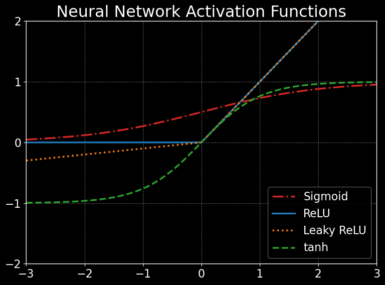
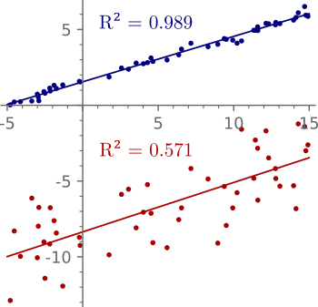
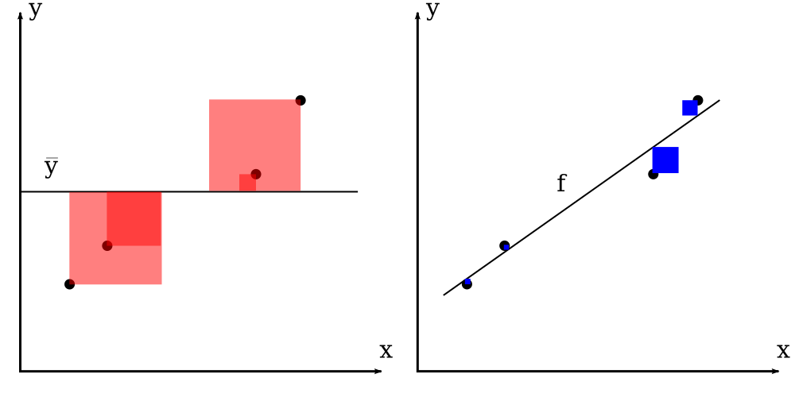
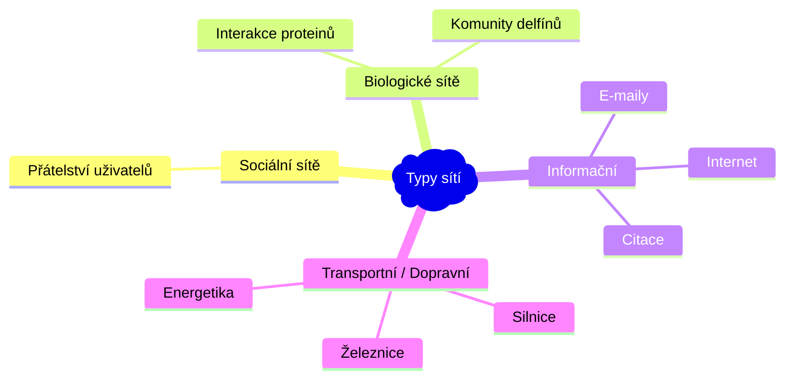

# AZD

- [1. Druhy dat, předzpracování dat, vlastnosti dat. Výběr atributů (zdůvodnění, princip, entropie, Gini index, …)](#1-druhy-dat-předzpracování-dat-vlastnosti-dat-výběr-atributů-zdůvodnění-princip-entropie-gini-index-)
  - [1.1. Typy dat](#11-typy-dat)
  - [1.2. Normalizace](#12-normalizace)
  - [1.3. Feature Engineering](#13-feature-engineering)
  - [1.4. Výběr atributů](#14-výběr-atributů)
    - [1.4.1. Filter methods](#141-filter-methods)
      - [1.4.1.1. Gini index](#1411-gini-index)
      - [1.4.1.2. Entropie](#1412-entropie)
    - [1.4.2. Wrapper methods](#142-wrapper-methods)
    - [1.4.3. Embedded methods](#143-embedded-methods)
- [2. Hledání častých vzorů v datech (základní principy, metody, varianty, implementace)](#2-hledání-častých-vzorů-v-datech-základní-principy-metody-varianty-implementace)
- [3. Shlukovací metody (shlukování pomocí reprezentantů, hierarchické shlukování). Shlukování na základě hustoty, validace shluků, pokročilé metody shlukování (CLARANS, BIRCH, CURE)](#3-shlukovací-metody-shlukování-pomocí-reprezentantů-hierarchické-shlukování-shlukování-na-základě-hustoty-validace-shluků-pokročilé-metody-shlukování-clarans-birch-cure)
  - [3.1. Shlukování pomocí reprezentantů](#31-shlukování-pomocí-reprezentantů)
    - [3.1.1. K-means](#311-k-means)
    - [3.1.2. K-medians](#312-k-medians)
    - [3.1.3. K-medoids](#313-k-medoids)
    - [3.1.4. Affinity propagation](#314-affinity-propagation)
  - [3.2. Hierarchické shlukování](#32-hierarchické-shlukování)
  - [3.3. Shlukování na základě hustoty](#33-shlukování-na-základě-hustoty)
    - [3.3.1. DBSCAN](#331-dbscan)
  - [3.4. Validace shluků](#34-validace-shluků)
- [4. Rozhodovací stromy (princip, algoritmus, metriky pro vhodnou volbu hodnot dělících atributů, prořezávání)](#4-rozhodovací-stromy-princip-algoritmus-metriky-pro-vhodnou-volbu-hodnot-dělících-atributů-prořezávání)
- [5. Pravděpodobnostní klasifikace (Bayesovský teorém, naivní Bayesovský teorém)](#5-pravděpodobnostní-klasifikace-bayesovský-teorém-naivní-bayesovský-teorém)
- [6. Support Vector Machines (princip, algoritmus, kernel trick)](#6-support-vector-machines-princip-algoritmus-kernel-trick)
- [7. Neuronové sítě (základní princip, metody učení, aktivační funkce)](#7-neuronové-sítě-základní-princip-metody-učení-aktivační-funkce)
  - [7.1. Aktivační funkce](#71-aktivační-funkce)
  - [7.2. MLP](#72-mlp)
- [8. Vyhodnocení klasifikačních algoritmů (chybovost, přesnost, pokrytí, f-metrika)](#8-vyhodnocení-klasifikačních-algoritmů-chybovost-přesnost-pokrytí-f-metrika)
- [9. Regrese (lineární a nelineární regrese, regresní stromy, metody vyhodnocení kvality modelu)](#9-regrese-lineární-a-nelineární-regrese-regresní-stromy-metody-vyhodnocení-kvality-modelu)
  - [9.1. Simple linear regression](#91-simple-linear-regression)
  - [9.2. Regresní stromy](#92-regresní-stromy)
  - [9.3. Vyhodnocení](#93-vyhodnocení)
- [10. Typy sítí. Graf a matice sousednosti jako reprezentace sítě. Datové struktury pro reprezentaci různých typů sítí, výhody a nevýhody (matice sousednosti, seznamy sousedů, stromy sousedů), složitost operací, hybridní reprezentace](#10-typy-sítí-graf-a-matice-sousednosti-jako-reprezentace-sítě-datové-struktury-pro-reprezentaci-různých-typů-sítí-výhody-a-nevýhody-matice-sousednosti-seznamy-sousedů-stromy-sousedů-složitost-operací-hybridní-reprezentace)
  - [10.1. Datové struktury pro reprezentaci sítí](#101-datové-struktury-pro-reprezentaci-sítí)
- [11. Topologické vlastnosti sítí, charakteristické hodnoty a jejich distribuce (stupeň, délka cesty, průměr, shlukovací koeficient), typy centralit](#11-topologické-vlastnosti-sítí-charakteristické-hodnoty-a-jejich-distribuce-stupeň-délka-cesty-průměr-shlukovací-koeficient-typy-centralit)
  - [11.1. Centrality](#111-centrality)
- [12. Globální vlastnosti sítí (malý svět, bezškálovost, růst a preferenční připojování). Mocninný zákon a jeho interpretace v prostředí reálných sítí. Asortativita](#12-globální-vlastnosti-sítí-malý-svět-bezškálovost-růst-a-preferenční-připojování-mocninný-zákon-a-jeho-interpretace-v-prostředí-reálných-sítí-asortativita)
- [13. Modely sítí a jejich vlastnosti (Erdös–Rényi, Watts–Strogatz, Barabási–Albert)](#13-modely-sítí-a-jejich-vlastnosti-erdösrényi-wattsstrogatz-barabásialbert)
  - [13.1. Erdős-Rényi (ER)](#131-erdős-rényi-er)
  - [13.2. Watts-Strogatz (WS)](#132-watts-strogatz-ws)
  - [13.3. Barabási–Albert (BA)](#133-barabásialbert-ba)
- [14. Komunity. Globální a lokální přístupy. Modularita](#14-komunity-globální-a-lokální-přístupy-modularita)
- [15. Jiné (pokročilé) modely sítí - modely orientované na komunitní strukturu, temporální sítě](#15-jiné-pokročilé-modely-sítí---modely-orientované-na-komunitní-strukturu-temporální-sítě)
  - [15.1. Temporální sítě](#151-temporální-sítě)
- [16. Odolnost sítí, šíření jevů v sítích. Šíření a maximalizace vlivu v sítích. Predikce linků. Sampling](#16-odolnost-sítí-šíření-jevů-v-sítích-šíření-a-maximalizace-vlivu-v-sítích-predikce-linků-sampling)
  - [16.1. Šíření a maximalizace vlivu v sítích](#161-šíření-a-maximalizace-vlivu-v-sítích)
  - [16.2. Predikce linků](#162-predikce-linků)
- [17. Vícevrstvé sítě, jejich typy a reprezentace. Metody analýzy a vizualizace vícevrstvých sítí, projekce, zploštění](#17-vícevrstvé-sítě-jejich-typy-a-reprezentace-metody-analýzy-a-vizualizace-vícevrstvých-sítí-projekce-zploštění)
  - [17.1. Zploštění](#171-zploštění)
  - [17.2. Projekce](#172-projekce)
- [18. Lokální a globální vlastnosti vícevrstvých sítí, typy centralit a náhodné procházky. Metody detekce komunit ve vícevrstvých sítích](#18-lokální-a-globální-vlastnosti-vícevrstvých-sítí-typy-centralit-a-náhodné-procházky-metody-detekce-komunit-ve-vícevrstvých-sítích)
- [19. Algoritmy pro pattern matching (Vyhledávání jednoho vzorku, více vzorků; Vyhledávání regulárních výrazů; Přibližné vyhledávání)](#19-algoritmy-pro-pattern-matching-vyhledávání-jednoho-vzorku-více-vzorků-vyhledávání-regulárních-výrazů-přibližné-vyhledávání)
- [20. Dokumentografické informační systémy (DIS) (modely DIS - booleovský, vektorový, lexikální analýza, stemming a lematizace, stop slova, konstrukce indexů, vyhodnocení dotazu, relevance, přesnost, úplnost, F-míra)](#20-dokumentografické-informační-systémy-dis-modely-dis---booleovský-vektorový-lexikální-analýza-stemming-a-lematizace-stop-slova-konstrukce-indexů-vyhodnocení-dotazu-relevance-přesnost-úplnost-f-míra)
- [21. Lineární algebra v DIS (metody redukce dimenze, rozklady matic, latentní sémantika, analýza hypertextových dokumentů, PageRank)](#21-lineární-algebra-v-dis-metody-redukce-dimenze-rozklady-matic-latentní-sémantika-analýza-hypertextových-dokumentů-pagerank)
- [22. Neuronové sítě a zpracování textu (word embedding, klasifikace textu, generování textu, …)](#22-neuronové-sítě-a-zpracování-textu-word-embedding-klasifikace-textu-generování-textu-)
  - [22.1. Word Embedding](#221-word-embedding)
  - [22.2. Klasifikace textu](#222-klasifikace-textu)
    - [22.2.1. BERT](#2221-bert)
  - [22.3. Generování textu](#223-generování-textu)
- [23. Popište architekturu konvolučních neuronových sítí, použité vrstvy, princip fungování, základní typy architektur](#23-popište-architekturu-konvolučních-neuronových-sítí-použité-vrstvy-princip-fungování-základní-typy-architektur)
  - [23.1. Vrstvy](#231-vrstvy)
  - [23.2. Typy architektur](#232-typy-architektur)
- [24. Popište architekturu rekurentních neuronových sítí, typy neuronů, princip fungování](#24-popište-architekturu-rekurentních-neuronových-sítí-typy-neuronů-princip-fungování)
  - [24.1. Vanilla RNN](#241-vanilla-rnn)
  - [24.2. Long Short-Term Memory](#242-long-short-term-memory)
  - [24.3. Gated Recurrent Unit (GRU)](#243-gated-recurrent-unit-gru)
  - [24.4. Jaký je rozdíl mezi RNN a architekturou Transformer?](#244-jaký-je-rozdíl-mezi-rnn-a-architekturou-transformer)

## 1. Druhy dat, předzpracování dat, vlastnosti dat. Výběr atributů (zdůvodnění, princip, entropie, Gini index, …)

Explorativní datová analýza (EDA) - prvotní průzkum dat, hledání vzorů, anomálií, ...

- grafy distribucí (histogram)
- krabicové grafy (boxploty)

  
- souhrné statistiky (průměr, medián, rozptyl, směrodatná odchylka, ...)
- vztahy mezi daty, korelace (scatter plot, heatmapa)

### 1.1. Typy dat

1. **Numerická data**
   - Tabulková data
   - Časové řady - signálová data, zvuk
   - Obrazová data
2. **Kategorická data**
   - příznak náleží do nějaké (konečné) množiny hodnot/tříd
   - předzpracování:
     - *ordinal encoding* (dataset Titanic - paluba)
     - *one-hot encoding* *(dummy encoding, binarization)*
       - Někdy je vhodné kódovat třeba $0.1$ místo jedničky, protože to může silně ovlivnit výpočty vzdáleností.
     - *algorithmic encoding* - cyklické příznaky - třeba dny v týdnu *(feature engineering)*
3. **Textová data**
   - **tokenizace** - rozdělení textu na jednotlivé tokeny (slova, znaky, ...)
   - odstranění **stop-slov** (slova, která nemají význam - např. "a", "the", "is", ...)
   - **stemming** - zkracování slov na jejich základní tvar (např. "running" -> "run")
     - Porterův stemmer
   - **embedding** - převod slov na vektory
     - Word2Vec - modely Skip-gram a CBOW
     - GloVe - Global Vectors for Word Representation
4. **Grafová data**

### 1.2. Normalizace

1. **Min-max** $[0,1]$
    $$\tilde{x}=\dfrac{x-\min(x)}{\max(x)-\min(x)} \Rightarrow \tilde{x}\in[0,1]$$
2. **Škálování průměrem**
    $$\tilde{x}=\dfrac{x-\mu}{\max(x)-\min(x)} \Rightarrow \tilde{x}\in[-1,1]$$
3. **Standardizace** (z-skóre)
    $$z=\frac{x - \mu}{\sigma} \Rightarrow \mu(z)=0,\,\,\sigma(z)=1$$
4. **Nelineární** transformace (mocninná / logaritmická)
   - Transformace dat, aby byly více normální (gaussovské).
   - **Box-Cox** - pouze pro (striktně) kladné hodnoty
   - **Yeo-Johnson**
5. **Interkvartilové rozpětí** (IQR) - robustní vůči odlehlým pozorování (outliers)
   $$\tilde{x}=\dfrac{x-\mathrm{med}(x)}{x_{0.75}-x_{0.25}}$$

### 1.3. Feature Engineering

- Vytváření nových atributů z existujících dat.
  - cyklické příznaky (např. dny v týdnu, hodiny v denním cyklu)
  - obrazové příznaky

### 1.4. Výběr atributů

Proč vybírat atributy?

- prokletí dimenzionality
- snížit výpočetní náročnost
- zlepšit interpretovatelnost/vysvětlitelnost modelu

#### 1.4.1. Filter methods

- Nezávisí na konkrétním klasifikačním algoritmu.
- Využívají znalost tříd (supervised).

##### 1.4.1.1. Gini index

Buď třídy $1,2,\dots,C$ a buď $v_1,v_2, \dots, v_A$ všechny (diskrétní nebo diskretizované) hodnoty atributu $A$. Gini index pro konkrétní hodnotu $v_i, i=1,\dots,A,$ je definován jako:

$$
\begin{align*}
\mathrm{Gini}(v_i) &= \sum_{c=1}^C p_c(v_i)(1 - p_c(v_i)),\\
&= \underbrace{\sum_{c=1}^C p_c(v_i)}_{=1} - \sum_{c=1}^C p_c(v_i)^2,\\
&= \boxed{1 - \sum_{c=1}^C p_c(v_i)^2,}
\end{align*}
$$

kde $p_c(v_i)$ je pravděpodobnost, že náhodně vybraný prvek z množiny $v_i$ patří do třídy $c$.

Gini index pro atribut (příznak) $A$ je definován jako vážený průměr Gini indexů pro jednotlivé hodnoty $v_i$:

$$
\mathrm{Gini}(A) = \sum_{i=1}^A \dfrac{N_i}{N} \cdot \mathrm{Gini}(v_i),
$$

##### 1.4.1.2. Entropie

Entropie pro konkrétní hodnotu $v_i$ je definována jako:

$$
E(v_i) = -\sum_{c=1}^C p_c(v_i) \cdot \log(p_c(v_i))
$$

Entropie pro atribut $A$ je definována jako vážený průměr entropií pro jednotlivé hodnoty $v_i$:

$$
E(A) = \sum_{i=1}^A \dfrac{N_i}{N} \cdot E(v_i)
$$

#### 1.4.2. Wrapper methods

- Závisí na konkrétním klasifikačním algoritmu.
- Zvyšují riziko overfittingu.
- Např. postupné přidávání atributů a vyhodnocení (opakuji, dokud se zlepšuje přesnost).

#### 1.4.3. Embedded methods

- Rozhodovací strom
- Lineární regrese
- Wrapper + Embedded: *Recursive Feature Elimination (RFE)* - seřadí atributy podle důležitosti (feature importance) a postupně je odstraňuje.

## 2. Hledání častých vzorů v datech (základní principy, metody, varianty, implementace)

**Formální kontext** je uspořádaná trojice $(X, Y, I)$, kde:

- $X$ je množina objektů,  
- $Y$ je množina atributů,  
- $I \subseteq X \times Y$ je binární relace.

Skutečnost, že objekt $x \in X$ má atribut $y \in Y$, značíme $(x, y) \in I$.

Níže je příklad formálního kontextu (binární matice transakcí), kde $X=\{t_1,t_2,\ldots,t_6\}$ a $Y=\{i_1,i_2,i_3,i_4\}$ a $I=\mathsf{T}$. Tzn. objekty jsou transakce a atributy jsou položky v transakcích. Binární relace $I$ značí, že transakce $t_i$ (objekt) obsahuje položku $i_j$ (atribut).


<details><summary> Výpočet spolehlivosti pravidel </summary>

|Pravidlo|Spolehlivost|
|--|--|
|$i_1 \Rightarrow i_2$| $\dfrac{\mathrm{supp}(i_1, i_2)}{\mathrm{supp}(i_1)}=\dfrac{\frac{1}{3}}{\frac{1}{2}}=\frac{2}{3}$|

</details>

Vytvoříme *Rymon Tree* - strom všech kombinací atributů (položek), pro které je podpora větší něž nula (obecně větší než minimální podpora). Proč je ve třetí úrovni stromu jen $i_{1,2,3}$? Bo, existuje jen jeden řádek kde bitový and pro tři atributy vyjde `true`.

**Podporu (support)** $i$-tého atributu $y$ v matici $\mathsf{T}$ s $N$ objekty (řádky) definujeme:

$$\mathrm{supp}(y_i) = \frac{1}{N}\sum\limits_{r=1}^N \mathsf{T}_{r,y_i}\quad\text{(relativní četnost)}$$

Pro více atributů podporu spočteme jako relativní četnost bitového ANDu mezi příslušenými sloupci:

$$\mathrm{supp}(y_i,y_j) = \frac{1}{N}\sum\limits_{r=1}^N \mathsf{T}_{r,i} \wedge \mathsf{T}_{r,j}$$

a podobně pro více atributů.

**Spolehlivost (confidence)** asociačního pravidla $A \Rightarrow B$ je definována jako:

$$
\text{conf}(A \Rightarrow B) = \frac{\text{supp}(A, B)}{\text{supp}(A)}
$$

Spolehlivost odpovídá **podmíněné pravděpodobnosti**, že se $B$ vyskytne za předpokladu, že se vyskytlo $A$:

$$
\text{conf}(A \Rightarrow B) = P(B \mid A) = \frac{P(A \cap B)}{P(A)}
$$

Implementace např. pomocí algoritmu **Apriori**.

Generování kombinací:

```py
N = 5
for a in range(1, N + 1):
    for b in range(a + 1, N + 1):
        for c in range(b + 1, N + 1):
            # This will print all combinations
            # of (a, b, c), s.t., a < b < c, s.t.,
            # a, b, c are all in [1, N]
            print(a, b, c)
```

## 3. Shlukovací metody (shlukování pomocí reprezentantů, hierarchické shlukování). Shlukování na základě hustoty, validace shluků, pokročilé metody shlukování (CLARANS, BIRCH, CURE)

Co je shlukovaní? Rozdělení dat do skupin (shluků) takových, že jejiž členové jsou si v nějakým smyslu podobní.

- učení bez učitele *(unsupervised learning)*

### 3.1. Shlukování pomocí reprezentantů

#### 3.1.1. K-means

- Vstup: $k$ - počet shluků, $X$ - množina bodů (dat)
- Výstup: $k$ shluků (shluky jsou reprezentovány svými centroidy - průměry bodů ve shluku)

1. Inicializace centroidů (náhodně nebo pomocí K-means++).
2. Přiřazení bodů k nejbližšímu centroidu (shluku).
3. Aktualizace centroidů (průměry bodů ve shluku).
4. Opakuj 2-3, dokud se centroidy nezmění.

#### 3.1.2. K-medians

- Stejné jako K-means, ale místo průměru se používá medián.
- K-medians je robustnější vůči odlehlým pozorováním (outliers).
- Často se používá Manhattanovská vzdálenost (L1 norm).

#### 3.1.3. K-medoids

- Reprezentantem shluku *(medoid)* je záznam z datové sady (nikoliv průměr nebo medián).
- Přesné řešení je NP-těžký problém, obvykle se používají heuristiky.

**PAM** *(Partitioning Around Medoids)*:

1. Náhodně vybereme $k$ medoidů.
2. Přiřadíme každý bod k nejbližšímu medoidu.
3. (SWAP) Dokud se snižuje cenová funkce (třeba SSE):
    - Pro každý medoid $m$ a bod $x$ (který není medoid):
        - Vypočítáme změnu cenové funkce při výměně $m$ za $x$.
        - Pokud je aktuální změna lepší, uložíme dvojici $(m_{best},x_{best})=(m,x)$.
    - Pokud $(m_{best},x_{best})$ sníží cenovou funkci, vyměníme $m_{best}$ za $x_{best}$. Jinak algoritmus končí.

**CLARA** a **CLARANS** urychlují PAM za cenu menší kvality shlukování.

#### 3.1.4. Affinity propagation

- Reprezentantem shluku *(exemplar)* je záznam z datové sady.

### 3.2. Hierarchické shlukování

- Časová složitost alespoň $\mathcal{O}(n^2)$, kde $n$ je počet bodů.
- Vhodné pro menší množiny dat.
- Na začátku máme $n$ shluků (každý bod je shluk).
- Postupně slučujeme shluky do větších shluků.

|||
|--|--|
|||


- **Single Linkage**

  $$d_{SL}(C_i,C_j) = \min\set{d(x,y)\mid x\in C_i, y\in C_j}$$

- **Complete Linkage**

  $$d_{CL}(C_i,C_j) = \max\set{d(x,y)\mid x\in C_i, y\in C_j}$$

- **Average Linkage**

  $$d_{AL}(C_i,C_j)=\dfrac{\sum\limits_{x\in C_i}\sum\limits_{y\in C_j}d(x,y)}{\lvert C_i \rvert\cdot\lvert C_j\rvert}$$

- **Centroid method** (vzdálenost mezi centroidy)

  $$d_C(C_i,C_j) = d(\mu_i,\mu_j),\text{ kde } \mu_i=\dfrac{1}{\lvert C_i\rvert}\sum\limits_{x\in C_i}x$$

- **Ward's method**

  $$d_W(C_i,C_j)=\dfrac{\lvert C_i\rvert\cdot\lvert C_j\rvert}{\lvert C_i\rvert+\lvert C_j\rvert}d^2(C_i,C_j)$$
- **Bisecting k-means** - top-down
  - Na začátku máme jeden shluk (všechny body).
  - Rozdělujeme shluk na dva pomocí 2-means.
- **CURE** (Clustering Using REpresentatives)
  - k-d strom
  - funguje i pro různě velké shluky
- **BIRCH** (Balanced Iterative Reducing and Clustering using Hierarchies)
  - používá stromovou strukturu *Clustering Feature Tree (CFT)* - díky tomu lze efektivně aplikovat hierarchické shlukování (nad listy CFT)
  - lze použít i nad velkými databázemi, není nutné mít všechny body v paměti

### 3.3. Shlukování na základě hustoty

#### 3.3.1. DBSCAN

- Vstup: $X$ - množina bodů, $\varepsilon$ - velikost okolí, `min_sample` - minimální počet bodů v okolí
- Výstup: shluky a šum (outliers, shluk `-1`)
- Není nutné specifikovat počet shluků. Shluky mohou mít různou velikost a tvar a nemusí být lineárně separabilní.


Algoritmus:

1. Identifikace jádrových bodů *(core points)* - body, které mají alespoň `min_sample` bodů v okolí o velikosti $\varepsilon$.
2. Identifikace bodů dostupných z jádrových bodů *(border points)* - body, které mají méně než `min_sample` bodů v okolí o velikosti $\varepsilon$, ale jsou v okolí jádrového bodu.
3. Identifikace šumu *(noise/outliers)* - body, které nejsou jádrové ani okrajové.


<details><summary> Popis příkladu </summary>

- `min_sample=4`

Bod `A` a ostatní červené body jsou **jádrové body** (mají alespoň `min_sample` bodů v okolí o velikosti $\varepsilon$). Body `B` a `C` jsou dostupné z jádrových bodů, takže patří do červeného shluku. Bod `N` je šum (není jádrový ani okrajový).

</details>

Jak zvolit hyperparametry?

- pro `min_sample = 1` je každý bod *core point* (tzn. jeden shluk), `min_sample = 2` odpovídá *single linkage*, tzn. dává smysl pouze `min_sample >= 3`
- heuristika: `min_sample = 2 * dim(X)`
- následně lze zvolit $\varepsilon$ pomocí *k-nearest neighbor distance* (k-NN) - pro každý bod spočítáme vzdálenost k `min_sample - 1`-tému nejbližšímu bodu a seřadíme podle vzdálenosti. Pak hledáme "loket" (elbow) v grafu. Alternativně pro malé datové sady lze zkoumat distribuci vzdáleností v matici vzdáleností.

**OPTICS** *(Ordering Points To Identify the Clustering Structure)* - zobecňuje DBSCAN.

### 3.4. Validace shluků

- **Elbow method** - graf SSE (sum of squared errors) v závislosti na počtu shluků. Hledáme "loket" (elbow), kde se SSE přestává snižovat. (Pouze pro sférické shluky.)
- **Silhouette score** - měří, jak dobře je bod přiřazen do shluku. Čím vyšší hodnota, tím lepší shlukování $[-1,1]$.
- **Intra/Inter cluster distance** - měří vzdálenosti mezi shluky a uvnitř shluku. Minimalizujeme vzdálenosti uvnitř shluku a maximalizujeme vzdálenosti mezi shluky.
  - $\mathrm{intra}(C_i) = \dfrac{1}{\lvert C_i\rvert}\sum\limits_{x,y\in C_i}d(x,y)$
  - $\mathrm{inter}(C_i,C_j) = d(\mu_i,\mu_j)$
- Pokud je počet shluků roven počtu tříd, můžeme spočítat **matici záměn** *(confusion matrix)* a spočítat přesnost klasifikace.

*Curse of dimensionality* - ve vysokých dimenzích je obtížné najít shluky, protože vzdálenosti mezi body se stávají podobné.

## 4. Rozhodovací stromy (princip, algoritmus, metriky pro vhodnou volbu hodnot dělících atributů, prořezávání)


Bez omezení vždy dojde k overfittingu (přetrénování). Preferujeme jednoduché stromy (s menším hloubkou a menším počtem uzlů).

Přetrénování můžeme bránit:

1. **Předčasným zastavením** *(early stopping)* - nastavením:
   - maximální hloubky
   - maximálního počtu příznaků
   - minimálního počtu vzorků v listu
   - minimálního počtu vzorků pro rozdělení uzlu
2. **Prořezáváním**
   - *Cost Complexity Pruning (CCP)* - prořezávání na základě přesnosti a složitosti (tzn. počtu listů)

## 5. Pravděpodobnostní klasifikace (Bayesovský teorém, naivní Bayesovský teorém)

Buď $(\Omega,\mathcal{A},P)$ P.P. a buď $A,B\in\mathcal{A}$, $P(B)>0$. Podmíněnou pravděpodobnost náhodného jevu $A$ za podmínky, že nastal jev $B$ definujeme:
$$\boxed{\,\,P(A \mid B)=\dfrac{P(A \cap B)}{P(B)}\,\,}$$

**Věta o úplné pravděpodobnosti:**

- $\bigcup\limits_{i=1}^n B_i=\Omega$
- $\forall i,j \in\set{1,...,n},i\neq j: \,B_i \cap B_j = \emptyset$
- $\forall i \in\set{1,...,n}: \,B_i > 0$
$$\boxed{\,\,P(A)=\sum_{i=1}^{n} P(A \mid B_i)\cdot P(B_i)\,\,}$$

**Bayesova věta:**

$$
\boxed{
\begin{align*}
    P(B_i | A)&=\dfrac{P(A \cap B_i)}{P(A)}\\&=\dfrac{P(A \mid B_i)\cdot P(B_i)}{\sum\limits_{j=1}^n P(A \mid B_j)\cdot P(B_j)}
\end{align*}
}
$$

V případě Naive Bayes klasifikátoru je jmenovatel $P(A)$ konstantní, takže se dá vynechat:

$$
\boxed{
P(B_i | A)\propto P(A | B_i) \cdot P(B_i)
}
$$

Pro náš příklad s e-maily:

$$
P(S | zpráva)\propto P(zpráva | S) \cdot P(S)
$$

- [StatQuest Naive Bayes](https://youtu.be/O2L2Uv9pdDA?si=4IGcmsMOA5Jjyfvi)
- Předpokládáme, že **atributy jsou nezávislé** (což nemusí být pravda). V našem příkladu uvažujeme, že slova zpráv jsou nezávislé, což určitě není pravda. Např. slova peníze teď se můžou častěji vyskytovat společně.
- Před "AI" byl NB hlavní nástroj pro detekci spamu.


## 6. Support Vector Machines (princip, algoritmus, kernel trick)

Buď $\mathcal{X}=(\mathbf{x}_1,y_1),\ldots,(\mathbf{x}_n,y_n)$ trénovací dataset, kde $\mathbf{x}_i\in\mathbb{R}^d$ a $y_i\in\{-1,1\}$.

Lineární SVM je klasifikační algoritmus, který se snaží najít hyperrovinu, která odděluje jednotlivé třídy ve smyslu maximální mezery *(maximum-margin hyperplane / widest-street principle)*.


>Rozhodovací pravidlo:
>
>$$
\begin{equation}
  \mathrm{sgn}\left(\left\langle\mathbf{w},\mathbf{u} \right\rangle + b\right)=\begin{cases}
    +1 & \text{ (positive class)}\\
    -1 & \text{ (negative class)}
  \end{cases}
\end{equation}
>$$

Z (1) vyplývá (hodnoty 1 a -1 jsou libovolné, ale pevné):

$$
\begin{align}
  \left\langle\mathbf{w},\mathbf{x}^+ \right\rangle + b &\geq 1,\\
  \left\langle\mathbf{w},\mathbf{x}^- \right\rangle + b &\leq -1,
\end{align}
$$

$$
y_i = \begin{cases}
  +1 & \text{positive}\\
  -1 & \text{negative}
\end{cases}
$$

Levé strany rovnic (2,3) přenásobím $y_i$, čímž dostanu:

$$
\begin{align*}
  y_i(\left\langle\mathbf{w},\mathbf{x}_i \right\rangle + b) &\geq 1\\
  y_i(\left\langle\mathbf{w},\mathbf{x}_i \right\rangle + b) - 1&\geq 0
\end{align*}
$$

>Navíc pro $\mathbf{x}_i$ ležící "na krajnici (hranice mezery)":
>
>$$
\begin{equation}
   y_i(\left\langle\mathbf{w},\mathbf{x}_i \right\rangle + b) - 1= 0
\end{equation}
>$$


$$
\begin{align*}
  \text{width} &= (\mathbf{x}^+-\mathbf{x}^-)\dfrac{\mathbf{w}}{||\mathbf{w}||}\\
  &= \dfrac{\left\langle\mathbf{w},\mathbf{x}^+ \right\rangle - \left\langle\mathbf{w},\mathbf{x}^- \right\rangle}{||\mathbf{w}||}\\
  &= \dfrac{1-b - (-1-b)}{||\mathbf{w}||}\quad\text{(from (4))}\\
  &= \dfrac{2}{||\mathbf{w}||}\\
\end{align*}
$$

Vynucením podmínky (4) jsme dostali vzorec pro šířku silnice, kterou chceme maximalizovat:

$$
\begin{align*}
  &\max \dfrac{2}{||\mathbf{w}||} \iff \min||\mathbf{w}|| \iff \boxed{\min\frac{1}{2}||\mathbf{w}||^2}\\
  &\text{s.t.} \quad y_i(\left\langle\mathbf{w},\mathbf{x}_i \right\rangle + b) - 1 = 0\\
\end{align*}
$$

Lagrangeova funkce:

$$
\begin{align}
  L&=\frac{1}{2}||\mathbf{w}||^2-\sum_{i=1}^n \alpha_i\left[y_i(\left\langle\mathbf{w},\mathbf{x}_i \right\rangle + b) - 1\right]\notag\\
  \dfrac{\partial L}{\partial \mathbf{w}} &= \mathbf{w} - \sum_{i=1}^n \alpha_i y_i \mathbf{x}_i \Rightarrow \mathbf{w} =\boxed{\sum_{i=1}^n \alpha_i y_i \mathbf{x}_i} \\
  \dfrac{\partial L}{\partial b} &= -\sum_{i=1}^n \alpha_i y_i \Rightarrow \boxed{\sum_{i=1}^n \alpha_i y_i = 0}\notag\\
\end{align}
$$

Dosazením do $L$ získáme duální problém:

$$
\begin{align}
  \max L&=\max\frac{1}{2}\sum_{i=1}^n \alpha_i y_i \sum_{j=1}^n \alpha_j y_j \left\langle\mathbf{x}_j,\mathbf{x}_i\right\rangle-\notag\\
  &-\sum_{i=1}^n \alpha_i\left[y_i\left(\sum_{j=1}^n \alpha_j y_j \left\langle\mathbf{x}_j,\mathbf{x}_i\right\rangle + b\right) - 1\right]=\notag\\
  &=\max\frac{1}{2}\sum_{i=1}^n\sum_{j=1}^n \alpha_i\alpha_j y_i y_j \left\langle\mathbf{x}_i,\mathbf{x}_j\right\rangle-\notag\\
  &-\sum_{i=1}^n\sum_{j=1}^n \alpha_i\alpha_j y_i y_j \left\langle\mathbf{x}_i,\mathbf{x}_j\right\rangle -\notag\\
  &-\sum_{i=1}^n \underbrace{\alpha_i y_i}_{=0} b + \sum_{i=1}^n \alpha_i=\notag\\
  &=\boxed{\max\sum_{i=1}^n \alpha_i -  \sum_{i=1}^n \sum_{j=1}^n \alpha_i\alpha_j y_iy_j\left\langle\mathbf{x}_i,\mathbf{x}_j\right\rangle}\\
\end{align}
$$

Z (1) a (5) dostáváme upravené rozhodovací pravidlo pro nové vektory (data) $\mathbf{u}$:

$$
\begin{align}
  \mathrm{sgn}\left( \sum_{i=1}^n \alpha_i y_i\left\langle \mathbf{x}_i, \mathbf{u}\right\rangle+b\right)
\end{align}
$$

Lze si všimnout, že (6) a (7) záleží pouze na skalárním součinu vektorů $\mathbf{x}_i$ a $\mathbf{x}_j$.

Tento algoritmus není schopný vyřešit lineárně **ne**separabilní problém (XOR):


V jiném prostoru (např. ve 3D) tento problém je separabilní. Použijeme *kernel trick*, t.j., transformaci dat do jiného prostoru (to lze, protože SVM závisí pouze na skalárním součinu vektorů).:

$$
\begin{align}
  \varphi(\mathbf{x}) &\Rightarrow \max\left\langle \varphi(\mathbf{x})_i,\varphi(\mathbf{x})_j\right\rangle\notag\\
  &\Rightarrow K(\mathbf{x}_i,\mathbf{x}_j) = \left\langle \varphi(\mathbf{x})_i,\varphi(\mathbf{x})_j\right\rangle\notag\\
\end{align}
$$

Polynomiální kernel $\boxed{(\left\langle\mathbf{x}_i,\mathbf{x}_j\right\rangle + 1)^D,}$ kde $D$ je dimenze prostoru (pro $D=2$ je to kvadratický kernel).

Gaussian kernel (RBF kernel):
$$\boxed{e^{-\dfrac{||\mathbf{x}_i-\mathbf{x}_j||}{\sigma}}}$$

## 7. Neuronové sítě (základní princip, metody učení, aktivační funkce)

### 7.1. Aktivační funkce



| Activation | Formula |
|------------|---------|
| **Sigmoid** | $\sigma(x) = \dfrac{1}{1 + e^{-x}},\quad\quad\dfrac{d}{dx}\sigma(x) = \sigma(x)(1 - \sigma(x))$ |
| **ReLU (Rectified Linear Unit)** | $\text{ReLU}(x) = \max(0, x)$ |
| **Tanh (Hyperbolic Tangent)** | $\tanh(x) = \frac{e^x - e^{-x}}{e^x + e^{-x}}$ |
| **Softmax** | $\text{softmax}(x_i) = \frac{e^{x_i}}{\sum_{j=1}^K e^{x_j}}$, where $K$ is the number of classes |
| **Leaky ReLU** | $\text{Leaky ReLU}(x) = \begin{cases} x & \text{if } x \geq 0 \\ \alpha x & \text{if } x < 0 \end{cases}$, where $\alpha$ is a small constant (e.g., $0.01$) |

### 7.2. MLP

Vícevrstvý perceptron.


Random initialization:
$$
\begin{align*}
    \mathsf{W}^{(1)} &= \begin{bmatrix} 0.2 & 0.4 \\ 0.5 & 0.9 \\ 0.8 & 0.1 \end{bmatrix} & \mathbf{b}^{(1)} &= \begin{bmatrix} 0.1 \\ 0.2 \\ 0.3 \end{bmatrix}\\
    \mathsf{W}^{(2)} &= \begin{bmatrix} 0.3 & 0.7 & 0.2 \\ 0.6 & 0.5 & 0.8 \end{bmatrix} & \mathbf{b}^{(2)} &= \begin{bmatrix} 0.1 \\ 0.4 \end{bmatrix}
\end{align*}
$$

Assume input $\mathbf{x} = \begin{bmatrix} 0.5 \\ 0.6 \end{bmatrix}$ and expected output $\mathbf{y} = \begin{bmatrix} 1 \\ 0 \end{bmatrix}$ (i.e., one data point - for simplicity).

$$
\begin{align*}
    \mathbf{z}^{(1)}&=\mathsf{W}^{(1)}\mathbf{x}+\mathbf{b}^{(1)}\\
    \mathbf{a}^{(1)}&=\sigma\left(\mathbf{z}^{(1)}\right)\\
    \mathbf{z}^{(2)}&=\mathsf{W}^{(2)}\mathbf{a}^{(1)}+\mathbf{b}^{(2)}\\
    \mathbf{a}^{(2)}&=\sigma\left(\mathbf{z}^{(2)}\right)
\end{align*}
$$

Compute loss function (MSE):
$$
c(\mathbf{y},\mathbf{a}) = \dfrac{1}{2} \sum\limits_{i=1}^{2} \left(\mathsf{y}_i - a^{(2)}_{i}\right)^2.
$$
Gradient w.r.t. the output layer:
$$\frac{\partial c}{\partial \mathbf{a}^{(2)}}=-\mathbf{y}+\mathbf{a}^{(2)},$$
$$\frac{\partial c}{\partial \mathbf{z}^{(2)}} = \frac{\partial c}{\partial \mathbf{a}^{(2)}} \odot \sigma'(\mathbf{z}^{(2)}).$$
Gradient w.r.t. $\mathsf{W}^{(2)}$ and $\mathbf{b}^{(2)}$:
$$
\boxed{\frac{\partial c}{\partial \mathsf{W}^{(2)}}} = \underbrace{\frac{\partial c}{\partial \mathbf{z}^{(2)}}}_{2\times1} \cdot \underbrace{\left(\mathbf{a}^{(1)}\right)^\top}_{1\times3},
$$
$$
\boxed{\frac{\partial c}{\partial \mathbf{b}^{(2)}}} = \frac{\partial c}{\partial \mathbf{z}^{(2)}}.
$$
Gradient w.r.t. the first layer ($\mathbf{z}^{(1)}$):
$$
\frac{\partial c}{\partial \mathbf{a}^{(1)}} = \underbrace{(\mathsf{W}^{(2)})^\top}_{3\times2} \cdot \underbrace{\frac{\partial c}{\partial \mathbf{z}^{(2)}}}_{2\times1},
$$
$$
\frac{\partial c}{\partial \mathbf{z}^{(1)}} = \frac{\partial c}{\partial \mathbf{a}^{(1)}} \odot \sigma'(\mathbf{z}^{(1)}).
$$
Gradient w.r.t. $\mathsf{W}^{(1)}$ and $\mathbf{b}^{(1)}$:
$$
\boxed{\frac{\partial c}{\partial \mathsf{W}^{(1)}}} = \underbrace{\frac{\partial c}{\partial \mathbf{z}^{(1)}}}_{3\times1} \cdot \underbrace{\mathbf{x}^\top}_{1\times2},
$$
$$
\boxed{\frac{\partial c}{\partial \mathbf{b}^{(1)}}} = \frac{\partial c}{\partial \mathbf{z}^{(1)}}.
$$

## 8. Vyhodnocení klasifikačních algoritmů (chybovost, přesnost, pokrytí, f-metrika)

Hold-out set / train-test split - rozdělení dat na trénovací a testovací množinu. Obvykle 60-75 % dat na trénování.

Robustnější varianta je $k$-fold cross-validation:


Matice záměn (confusion matrix) pro binární klasifikaci:


| Performance Metric | Formula                                                |
|---------------------|--------------------------------------------------------|
| Precision           | $\frac{\text{TP}}{\text{TP} + \text{FP}}$ |
| Recall / Sensitivity / TPR        | $\frac{\text{TP}}{\text{TP} + \text{FN}} = \frac{\text{TP}}{\text{P}}$  |
| Fallout / FPR | $\frac{\text{FP}}{\text{FP} + \text{TN}}=\frac{\text{FP}}{\text{N}}$ |
| Specificity / TNR   | $\frac{\text{TN}}{\text{TN} + \text{FP}} = \frac{\text{TN}}{\text{N}}$ |
| $F_1$-Score            | $\frac{2}{\frac{1}{\text{Precision}} + \frac{1}{\text{Recall}}} = \frac{2\cdot \text{Precision} \cdot \text{Recall}}{\text{Precision} + \text{Recall}} = \frac{2 \text{TP}}{2 \text{TP} + \text{FP} + \text{FN}}$ |
|$F_{\beta }$-Score|$\frac{\beta ^{2}+1}{\frac{1}{\text{Precision}} + \frac{\beta ^{2}}{\text{Recall}}} = \frac{(\beta ^{2}+1)\cdot \text{Precision} \cdot \text{Recall}}{(\beta ^{2}\cdot\text{Precision}) + \text{Recall}}$ |
| Accuracy            | $\frac{\text{TP} + \text{TN}}{\text{TP} + \text{FP} + \text{FN} + \text{TN}}$ = $\frac{\text{TP} + \text{TN}}{\text{P} + \text{N}}$ |

Vyhodnocení pravděpodobnostních klasifikátorů:

- *ROC křivka* je TPR na ose $y$ a FPR na ose $x$ (pro definovaný threshold).
- *Precision-Recall křivka* je $\text{Precision}$ na ose $y$ a $\text{Recall}$ na ose $x$ (pro definovaný threshold).

**Precision/Recall Tradeoff**: Pokud chceme vyšší `recall` na úkor `precision`, tak obvykle zvolíme jiný threshold:

```py
threshold = 0.5
y_pred = [1 if x >= threshold else 0 for x in y_pred]
```

## 9. Regrese (lineární a nelineární regrese, regresní stromy, metody vyhodnocení kvality modelu)

### 9.1. Simple linear regression

- Linerání regrese ve 2D je dána jako: $(x_0, y_0), \ldots, (x_n, y_n) \in \mathbb{R}^2$
- Hledám: $f(x) = \alpha_0 + \alpha_1 x$, s.t.  
    $$
    \sum_{i=0}^n (f(x_i) - y_i)^2 \leq \sum_{i=0}^n (p_1(x_i) - y_i)^2
    $$
  - kde $p_1(x) = \alpha_0 + \alpha_1 x$ je libovolný polynom 1. stupně.
- Optimalizační úloha (metoda nejmenších čtverců):
    $$
    \boxed{
    (\alpha_0, \alpha_1) = \arg\min_{\alpha_0, \alpha_1 \in \mathbb{R}} \underbrace{\sum_{i=0}^n (\alpha_0 + \alpha_1 x_i - y_i)^2}_{Q(\alpha_0, \alpha_1)}
    }
    $$

$$
\begin{align*}
  \dfrac{\partial Q}{\partial \alpha_0} &= 2\sum_{i=0}^n (\alpha_0 + \alpha_1 x_i - y_i) = 0\\
  &\quad\boxed{\alpha_0\sum_{i=0}^n1+\alpha_1\sum_{i=0}^n x_i=\sum_{i=0}^n y_i}\\
  \dfrac{\partial Q}{\partial \alpha_1} &= 2\sum_{i=0}^n (\alpha_0 + \alpha_1 x_i - y_i)x_i = 0\\
  &\quad\boxed{\alpha_0\sum_{i=0}^n x_i+\alpha_1\sum_{i=0}^n x_i^2=\sum_{i=0}^n y_ix_i}\\
\end{align*}
$$

Z nulových bodů dostanu soustavu dvou rovnic o dvou neznámých $\alpha_0$ a $\alpha_1$:

$$
A \vec{\alpha} = \vec{b}
$$

$$
\begin{bmatrix}
\sum 1 & \sum x_i & \\
\sum x_i & \sum x_i^2 \\
\end{bmatrix}
\begin{bmatrix}
\alpha_0 \\
\alpha_1
\end{bmatrix}
=
\begin{bmatrix}
\sum y_i \\
\sum y_i x_i
\end{bmatrix}
$$

Podobně lze odvodit **kvadratickou regresi** (polynom 2. stupně):

$$
\begin{bmatrix}
\sum 1 & \sum x_i & \sum x_i^2 \\
\sum x_i & \sum x_i^2 & \sum x_i^3 \\
\sum x_i^2 & \sum x_i^3 & \sum x_i^4
\end{bmatrix}
\begin{bmatrix}
\alpha_0 \\
\alpha_1 \\
\alpha_2
\end{bmatrix}
=
\begin{bmatrix}
\sum y_i \\
\sum y_i x_i \\
\sum y_i x_i^2
\end{bmatrix}
$$

Obdobně pro **vyšší dimenze** - hledám $f(x) = \alpha_0 + \alpha_1 x_1 + \ldots + \alpha_d x_d$, maticově:

$$
\begin{align*}
  \mathsf{X}\vec{\alpha} &= \vec{y},\\
  \begin{bmatrix}
    1 & x_{11} & \ldots & x_{1d} \\
    1 & x_{21} & \ldots & x_{2d} \\
    \vdots & \vdots & \ddots & \vdots \\
    1 & x_{n1} & \ldots & x_{nd}
  \end{bmatrix}
  \begin{bmatrix}
    \alpha_0 \\
    \alpha_1 \\
    \vdots \\
    \alpha_d
  \end{bmatrix}
  &=
  \begin{bmatrix}
    y_1 \\
    y_2 \\
    \vdots \\
    y_n
  \end{bmatrix},
\end{align*}
$$

kde $\mathsf{X}\in\mathbb{R}^{n,d+1}$, $\vec{\alpha}\in\mathbb{R}^{d+1}$ a $\vec{y}\in\mathbb{R}^n$. Řešení je opět pomocí metody nejmenších čtverců:

$$
\boxed{
\vec{\alpha}=\mathrm{arg}\min_{\vec{\alpha}\in\mathbb{R}^{d+1}} \underbrace{||\mathsf{X}\vec{\alpha}-\vec{y}||^2}_{Q(\vec{\alpha})}
}
$$

$$
\begin{align*}Q(\vec{\alpha})&=\|\mathsf{X}{\vec {\alpha }}-\vec{y}\|^{2}\\&=\left(\mathsf{X}{\vec {\alpha }}-\vec{y}\right)^{\textsf {T}}\left(\mathsf{X}{\vec {\alpha }}-\vec{y}\right)\\&=\vec{y}^{\textsf {T}}\vec{y}-\vec{y}^{\textsf {T}}\mathsf{X}{\vec {\alpha }}-{\vec {\alpha }}^{\textsf {T}}\mathsf{X}^{\textsf {T}}\vec{y}+{\vec {\alpha }}^{\textsf {T}}\mathsf{X}^{\textsf {T}}\mathsf{X}{\vec {\alpha }}\end{align*}
$$

$$
\begin{align*}
  \dfrac{\partial Q}{\partial \vec{\alpha}} &= -\vec{y}\mathsf{X}-\mathsf{X}^T\vec{y}+2X^T\mathsf{X}\vec{\alpha} = 0\\
  &= -2X^T\vec{y}+2X^T\mathsf{X}\vec{\alpha} = 0\\
  &= \mathsf{X}^T\mathsf{X}\vec{\alpha} = \mathsf{X}^T\vec{y}\\
  &\Rightarrow \vec{\hat{\alpha}} = (\mathsf{X}^T\mathsf{X})^{-1}\mathsf{X}^T\vec{y}\\
\end{align*}
$$

Získané $\vec{\hat{\alpha}}$ může být minimum. Lze to ověřit pomocí Hessovy matice.

Varianty lineární regrese:

- Lasso (L1 regularizace) - penalizuje součet absolutních hodnot koeficientů $\sum\limits_{i=1}^d |\alpha_i|$.
- Ridge (L2 regularizace) - penalizuje součet čtverců koeficientů $\sum\limits_{i=1}^d \alpha_i^2$.
- Elastic Net - kombinuje L1 a L2 regularizaci.

### 9.2. Regresní stromy

- [StatQuest: Regression Trees](https://youtu.be/g9c66TUylZ4?si=Z_PZZtBhxK0Bj5pW)


- Procházím pozorování $x_i$ a pro každý práh $T$ *(threshold)* spočítám průměr závislé proměnné nalevo od prahu $\frac{1}{|\{x_j < T\}|}\sum\limits_{j:x_j < T} y_j$ a napravo od prahu $\frac{1}{|\{x_j > T\}|}\sum\limits_{j:x_j > T} y_j$.
- Následně spočítám $\mathrm{SS_{residuals}}$ pro levý a pravý podstrom.
- Opakuji pro všechny možné prahy $T$ a vyberu práh, který minimalizuje $\mathrm{SS_{residuals}}$.


- Stanovím minimální počet pozorování v podstromu (tady např. 7) a opakuji pro všechny podstromy.


- Pro více dimenzí procházím prahy všech prediktorů a vybírám pravidlo, které minimalizuje $\mathrm{SS_{residuals}}$.

### 9.3. Vyhodnocení

- $\mathrm{MAE}=\frac{1}{n}\sum\limits_{i=1}^n |y_i - \hat{y}_i|$ (střední absolutní chyba)
- $\mathrm{MSE}=\frac{1}{n}\sum\limits_{i=1}^n (y_i - \hat{y}_i)^2$ (střední kvadratická chyba)
- $\mathrm{RMSE}=\sqrt{\mathrm{MSE}}$
- $R^2 = "\dfrac{\mathrm{var}(y)-\mathrm{var}(\hat{y})}{\mathrm{var}(y)}"=\dfrac{\frac{1}{n}\mathrm{SS_{target}} - \frac{1}{n}\mathrm{SS_{residuals}}}{\frac{1}{n}\mathrm{SS_{target}}}=1-\dfrac{\sum\limits_{i=1}^n (y_i-\hat{y}_i)^2}{\sum\limits_{i=1}^n (y_i-\overline{y})^2}$
  
  

  

  - Coefficient of determination
  - $(-\infty,1]$ (vyšší, lepší; model predikující průměr $\overline{y}$ má $R^2=0$)
  - Poměr mezi rozptylem reziduí a rozptylem cílové proměnné, tzn. kolik rozptylu cílové proměnné je vysvětleno modelem.
  - Ve více dimenzích se ukazuje, že i šum uměle navyšuje $R^2$. Proto se používá upravené $R^2_{adj}$ = $1-\dfrac{\frac{\mathrm{SS_{residuals}}}{\mathrm{df_{residuals}}}}{\frac{\mathrm{SS_{target}}}{\mathrm{df_{target}}}}$, kde:
    - $\mathrm{df_{residuals}}=n-d-1$ (počet stupňů volnosti reziduí, kde $d$ je počet parametrů modelu)
    - $\mathrm{df_{target}}=n-1$
- $\mathrm{MAPE} = \dfrac{1}{n}\sum\limits_{i=1}^n \dfrac{|y_i - \hat{y}_i|}{|y_i|}$ (střední absolutní procentuální chyba)
  - není definováno, pokud $\exists i:y_i=0$
- $\mathrm{SMAPE}=\dfrac{1}{n}\sum\limits_{i=1}^{n}\dfrac{2\cdot\lvert y_i-\hat{y}_i \rvert}{\lvert y_i \rvert + \lvert \hat{y}_i \rvert}$ (symetrická střední absolutní procentuální chyba)
  - $[0,2]$ (nižší, lepší)

## 10. Typy sítí. Graf a matice sousednosti jako reprezentace sítě. Datové struktury pro reprezentaci různých typů sítí, výhody a nevýhody (matice sousednosti, seznamy sousedů, stromy sousedů), složitost operací, hybridní reprezentace



> Graf je znázorněním sítě. Graf je dvojice $G=(V,E)$, kde $V\neq\emptyset$ je množina vrcholů a $E$ množina hran (množina dvouprvkových podmnožin množiny $V$).

### 10.1. Datové struktury pro reprezentaci sítí


Buď $\Delta$ největší stupeň v $G=(V,E)$. Záleží na hustotě grafu $\rho=\frac{2m}{\binom{n}{2}}$.

| Operace   | Matice sousednosti          | Seznamy sousedů            | Stromy sousedů (BST)        | Vyvážený strom sousedů (AVL / Red-black) |
|-------------|-----------------------|------------------------|-----------------------|--|
| Vložení / odebrání uzlu | $\mathcal{O}(n^2)$    | ?       | $\mathcal{O}(\Delta)$ |$\mathcal{O}(\log_2(\Delta))$ |
| Existence hrany   | $\mathcal{O}(1)$      | $\mathcal{O}(\Delta)$  | $\mathcal{O}(\Delta)$ | $\mathcal{O}(\log_2(\Delta))$ |
| Paměť      | $\mathcal{O}(n^2)$    | $\mathcal{O}(n+m)$ | $\mathcal{O}(n+m)$ | $\mathcal{O}(n+m)$ |

- Matice incidence:

    $$
      \mathbb{B}_{i,j}=
        \begin{cases}
          w & \text{$v_i$ inciduje s výstupní hranou $e_j$}\\
          -w & \text{$v_i$ inciduje se vstupní hranou $e_j$}\\
          0 &\text{jinak}
        \end{cases}
    $$

- Dictionary of Keys (DoK) - `HashMap<node_id, neighbors>; neighbors = HashMap<node_id, weight>` (nebo `HashSet`)
- Stromy sousedů - `type AdjTree = HashMap<node_id, BSTree<(node_id, weight)>>`

## 11. Topologické vlastnosti sítí, charakteristické hodnoty a jejich distribuce (stupeň, délka cesty, průměr, shlukovací koeficient), typy centralit

- **Stupeň** $\mathrm{deg}(v)$ vrcholu $v$ je počet hran, které z něj vycházejí (nebo do něj vstupují). V neorientovaném grafu je stupeň symetrický. V orientovaném grafu je stupeň rozdělen na `in-degree` a `out-degree`.
  - **Průměrný stupeň** neorientovaného grafu $\overline{d}=\frac{m}{n}$.
  - **Distribuce stupňů** (často log-log, pro orientované grafy ve 3D)
- **Délka cesty** je suma vah hran na cestě. Pro neorientovaný graf je to počet hran.
  - Nejkratší cestu mezi dvěma vrcholy lze najít pomocí *Dijkstrova algoritmu* /ˈdaɪkstrə/.
- **Průměr** sítě je délka nejdelší cesty mezi dvěma vrcholy v síti (často odlehlé pozorování).
- **Distribuce vzdáleností** (Floydův–Warshallův algoritmus)
- **Souvislost** sítě (existence cesty mezi libovolnými vrcholy).
  - Histogram velikostí komponent.
  - BFS nebo DFS - na konci zjistíme, jestli jsme prošli všechny vrcholy.
- **Hustota neorientovaného grafu** $\rho=\frac{m}{\binom{n}{2}}$
  - Řídký graf $n\approx m$
  - Hustý graf $m > n^2$
- **Lokální shlukovací koeficient** měří lokální hustotu trojúhelníků:
  
    $$
    CC(v)=\dfrac{T(v)}{\binom{\mathrm{deg}(v)}{2}}=\dfrac{2\cdot T(v)}{\mathrm{deg}(v)(\mathrm{deg}(v)-1)}
    $$

- Globální shlukovací koeficient měří hustotu trojúhelníků:

    $$
    CC(G) = \dfrac{3 \times \text{\# trojúhelníků v $G$}}{\text{\# trojic v $G$}}
    $$

- **Shlukovací efekt** je graf *stupňů* na ose $x$ a *průměrného CC* vrcholů s daným stupněm.

### 11.1. Centrality

Centrality vyjadřují **míru důležitosti vrcholu** z hlediska struktury sítě.

- **Degree centrality**:
  - lokální - stupeň vrcholu
  - globální - průměrný stupeň vrcholů
- **Průměrná vzdálenost** k ostatním vrcholům:
  
    $$
    \text{mean distance}(v)=\frac{1}{n}\sum\limits_{u \in V} d(v,u)
    $$

- **Closeness centrality** - inverze průměrné vzdálenosti k ostatním vrcholům:

    $$
    \mathrm{closeness}(v) = \frac{n}{\sum\limits_{u \in V} d(v,u)}
    $$

- **Betweenness centrality** měří **jak dobře vrchol propojuje síť** pomocí **počtu nejkratších cest** procházejících daným vrcholem $v$ mezi všemi dvojicemi vrcholů $s$ a $t$:

    $$
    \mathrm{betweenness}(v) = \sum\limits_{s\neq v\neq t} \frac{\text{\# nejkratších cest $s\leftrightarrow t$ procházejících $v$}}{\text{\# nejkratších cest $s\leftrightarrow t$}}
    $$
- **PageRank**
- **Eccentricity centrality** - inverze vzdálenosti k nejvzdálenějšímu vrcholu v síti:

    $$
    \text{eccentricity centrality}(v) = \frac{1}{\max\limits_{u \in V} d(v,u)}
    $$

## 12. Globální vlastnosti sítí (malý svět, bezškálovost, růst a preferenční připojování). Mocninný zákon a jeho interpretace v prostředí reálných sítí. Asortativita

Vlastnost **malého světa** je, že *průměrná vzdálenost* je přibližně $\log(n)$. Shlukovací koeficient je větší než u náhodného grafu.

**Asortativita** znamená, že vrcholy s *podobnými vlastnostmi* jsou *spojeny častěji* než vrcholy s různými vlastnostmi (např. bohatí s bohatými, vrcholy s podobným stupněm atd.)

Bezškálové sítě mají **distribuci stupňů** podle **mocninného zákona** (pravidlo 80-20):

| Mocninný zákon | Log-log distribuce stupňů |
|---|---|
|  |  |

Mocninný zákon:

$$\boxed{f(x)=bx^{\alpha} + g(x^{\alpha}),}$$

kde $g(x^{\alpha})$ je asymptoticky menší než $bx^{\alpha}$, a proto se zanedbává.

V logaritmickém měřítku:

$$\boxed{\log \big(f(x)\big)=\log (b) + \alpha\log (x)\approx \alpha\log (x), }$$

tzn. mocninný zákon je **invariantní vůči změně měřítka** - nezávislost na násobící konstantě $b$ - bezškálový, scale-free. "Heavy tail" - kladná šikmost, right skew ("zprava stlačená" distribuce). Buď $d=0,1,\ldots$ stupně a buď $p(d)$ pravděpodobnost, že uzel má stupeň $d$ $\Rightarrow$ $p(d)\approx Cd^{-\alpha}$, kde $C\sum\limits_{d=0}^{+\infty} d^{-\alpha}=1$.

## 13. Modely sítí a jejich vlastnosti (Erdös–Rényi, Watts–Strogatz, Barabási–Albert)

### 13.1. Erdős-Rényi (ER)

- /ˈɛrdøːʃ  ˈrɛɲi/
- **náhodný graf**

### 13.2. Watts-Strogatz (WS)

Vychází z pravidelné kruhové mřížky o $N\in\mathbb{N}$ vrcholech a $k\in\{2n \mid n\in\mathbb{N}\}$ sousedech:


Algoritmus:

0. Zvolím parametry $N\in\mathbb{N}$, $k\in\{2n \mid n\in\mathbb{N}\}$, $p\in[0,1]$.
1. Vytvořím pravidelnou kruhovou mřížku (každý vrchol je spojen s $k$ sousedy).
2. Pro každý vrchol:
   1. Každou hranu s pravděpodobností $p$ přepojím na náhodný vrchol (ne na sebe, aby nevznikla smyčka).

- Pro $p=0$ dostanu pravidelnou kruhovou mřížku.
- Pro $p=1$ dostanu náhodný graf (Erdös–Rényi).
- Jinak má vlastnosti malého světa, ale není bezškálová. Distribuce stupňů je přibližně Poissonovo.

### 13.3. Barabási–Albert (BA)

- Model **preferenčního připojování**.
- Bezškálový graf (distribuce stupňů podle mocninného zákonu).

Algoritmus:

0. Zvolím parametry $m_0\in\mathbb{N}$ (počáteční počet vrcholů), $m\in\mathbb{N}$.
1. Vygeneruji nějaký počáteční graf $G$ s $m_0 > m$ vrcholy (třeba cyklus $C_{m_0}$).
2. Iterativně přidávám vrcholy. Pravděpodobnost, že se nový vrchol připojí k vrcholu $v_i$ je dána vzorcem:

    $$\boxed{(\forall i=1,\ldots,n)\colon p(v_i) = \dfrac{\mathrm{deg}(v_i)}{\sum\limits_{j=1}^n \mathrm{deg}(v_j)} = \dfrac{\mathrm{deg}(v_i)}{2|E(G)|} = \dfrac{\mathrm{deg}(v_i)}{2mt+m_0}}$$

    (tzn. nový vrchol bude pravděpodobněji přiřazen k vrcholu s větším stupněm; rovnost plyne z principu sudosti "$\sum\mathrm{deg}=2m$".)
    1. nový vrchol se připojí k $m$ stávajícím vrcholům.

## 14. Komunity. Globální a lokální přístupy. Modularita

## 15. Jiné (pokročilé) modely sítí - modely orientované na komunitní strukturu, temporální sítě

### 15.1. Temporální sítě

Hrany mohou existovat jen v určitou chvíli (přerušovaně, např. e-maily). Hrany mohou mít měnící se váhu. Obvykle musíme zvolit nějaké časové období (třeba měsíc/rok) a analyzujeme síť vytvořenou z hran, které vznikly v tomto období. Může nás také zajímat vývoj v čase, případně vývoj strukturálních vlastností sítě v čase.

## 16. Odolnost sítí, šíření jevů v sítích. Šíření a maximalizace vlivu v sítích. Predikce linků. Sampling

### 16.1. Šíření a maximalizace vlivu v sítích

Využití např. pro marketing a epidemiologii. Cílem je zjistit, jak se šíří informace v síti hledáním vrcholů s velkým vlivem.

Šíření vlivu/informace lze simulovat např. pomocí modelů *susceptible-infected* ([SI](https://matejfric.github.io/mdbook/ns/ns.html#131-susceptible-infected-si-model)) a independent-cascade ([IC](https://matejfric.github.io/mdbook/ns/ns.html#132-nez%C3%A1visl%C3%BD-kask%C3%A1dov%C3%BD-model-%C5%A1%C3%AD%C5%99en%C3%AD-independent-cascade-model)). Při maximalizaci vlivu se snažíme zvolit minimální počet aktérů a pokrýt maximální (relevantní) část sítě. V sociálních sítích obvykle stačí 3-4 vlivní aktéři k dostatečnému pokrytí (cena/výkon).

### 16.2. Predikce linků

Predikce, že vznikne nová hrana nebo hrana zanikne.

Zajímá nás, které vrcholy by měly být v čase $t+1$ nově spojené a které hrany by měly zaniknout.

Metody založené na podobnosti:

- [Common neighbors](https://matejfric.github.io/mdbook/ns/ns.html#1041-common-neighbors-cn)
- [Jaccard Coefficient](https://matejfric.github.io/mdbook/ns/ns.html#1042-jaccard-coefficient-jc)
- [Preferential attachment](https://matejfric.github.io/mdbook/ns/ns.html#1044-preferential-attachment-pa)
- [Adamic Adar](https://matejfric.github.io/mdbook/ns/ns.html#1043-adamic-adar-index-aa)
- [Resource Allocation index](https://matejfric.github.io/mdbook/ns/ns.html#1045-resource-allocation-index-ra)
- [Cosine similary (Salton index)](https://matejfric.github.io/mdbook/ns/ns.html#1046-cosine-similarity-or-salton-index)
- [Sorensen index](https://matejfric.github.io/mdbook/ns/ns.html#1047-sorensen-index)

[Vyhodnocení predikce linků](https://matejfric.github.io/mdbook/ns/ns.html#105-vyhodnocen%C3%AD-predikce-link%C5%AF):

- Precision, Recall, F1-score, Accuracy, ...

## 17. Vícevrstvé sítě, jejich typy a reprezentace. Metody analýzy a vizualizace vícevrstvých sítí, projekce, zploštění

Vícevrstvá síť je čtveřice (A, $\mathcal{L}$, V, E), kde $G=(V,E)$ je graf, $A\subseteq V\times \mathcal{L}$ je množina aktérů a $\mathcal{L}$ je množina vrstev.

Například můžeme mít třívrstvou homogenní sociální síť, kde někteří lidé (tj. aktéři) spolu pracují, chodí na oběd a chodí běhat.

### 17.1. Zploštění

1. Nevážené.
2. Vážené.

### 17.2. Projekce

Z heterogenní sítě na homogenní.

## 18. Lokální a globální vlastnosti vícevrstvých sítí, typy centralit a náhodné procházky. Metody detekce komunit ve vícevrstvých sítích

- Stupeň aktéra *(degree centrality)* $a$ je suma stupňů vrcholů příslušných $a$ ve vrstvách $L\subseteq{\mathcal{L}}$.
- Sousedé *(neigbors)* aktéra $a$ jsou unikátní sousedé vrcholů příslušných $a$ ve vrstvách $L\subseteq{\mathcal{L}}$.
- Sousedství *(neighborhood)* je počet sousedů aktéra.
- Exluzivní sousedství *(exclusive neighborhood)* je počet sousedů bez sousedů z vrstev $\mathcal{L}\setminus L$.
- Relevance vrcholu je centralita sousedství děleno počtem sousedů ve všech vrstvách (tzn. sousedství pro $\mathcal{L}$).
- Exkluzivní relevance vrcholu je centralita exkluzivního sousedství děleno počtem všech sousedů.

Náhodná procházka ve vícevrstvé síti: V každém kroku má náhodný chodec uniformní pravděpodobnost, že se buď přemístí do jednoho ze sousedních vrcholů v rámci vrstvy, ve které se nachází, nebo přejde do svého protějšku v jiné vrstvě (pokud takový protějšek existuje).

Centralita obsazenosti *(occupation centrality)* aktéra $a$ je pravděpodobnost, že se náhodný chodec na vícevrstvé síti nachází na jakémkoliv vrcholu příslušném $a$.

## 19. Algoritmy pro pattern matching (Vyhledávání jednoho vzorku, více vzorků; Vyhledávání regulárních výrazů; Přibližné vyhledávání)

## 20. Dokumentografické informační systémy (DIS) (modely DIS - booleovský, vektorový, lexikální analýza, stemming a lematizace, stop slova, konstrukce indexů, vyhodnocení dotazu, relevance, přesnost, úplnost, F-míra)

## 21. Lineární algebra v DIS (metody redukce dimenze, rozklady matic, latentní sémantika, analýza hypertextových dokumentů, PageRank)

## 22. Neuronové sítě a zpracování textu (word embedding, klasifikace textu, generování textu, …)

### 22.1. Word Embedding

Cílem je převést slova na numerické vektory takové, aby podobnost vektorů co nejlépe odpovídala podobnosti slov. Jedná se o *unsupervised learning* (učení bez učitele).

- 2013 - **Word2Vec** - Tomáš Mikolov
  - [StatQuest - Word Embedding](https://youtu.be/viZrOnJclY0?si=ZGnIm_xppDMso8iy)
  - [Word2Vec Visualization](https://projector.tensorflow.org/)
- 2014 - **GloVe** (Global Vectors for Word Representation)

Pojmem **Word2Vec** rozumíme dvě architektury neuronových sítí pro učení word embeddingů:

- **Continuous Bag of Words (CBOW)** - na základě okolních slov (kontextu) se síť snaží predikovat chybějící prostřední slovo (nezáleží na pořadí slov).
  
    
  
- **Skip-gram** - na základě jednoho slova se síť snaží predikovat okolní slova (kontext). Kontext slova lze nahradit dvojicemi `(target_word, context_word)`.

    

Okolí je hyperparameter (např. `window=2`, dvě slova nalevo a dvě napravo). Níže je příklad pro `window=1`, kde trénovací sada obsahuje jedinou větu se čtyřmi slovy `word embedding with word2vec`. Výsledkem tohoto příkladu je matice $4\times 2$ (4 slova, dimenze vektorů/embeddingů 2) - odpovídá tomu matice vah "mezi modrou a zelenou vrstvou". V praxi se používá větší dimenze výsledných vektorů (např. 100, 300, 768).


Obdobně by šlo např. predikovat pouze *následující slovo*, ale to by nevedlo ke kvalitnímu embeddingu.

Praktická implementace je trochu složitější, protože v SoftMax se počítá s každým slovem v korpusu, což je výpočetně náročné, proto vznikly některé optimalizace.

Korpusy pro trénování embeddingů mají řádově stovky milionů slov.

Pro vyhodnocení můžeme použít mimojiné redukci dimenze pomocí PCA, t-SNE nebo UMAP. Podobná slova by měla být blízko sebe:


### 22.2. Klasifikace textu

- **detekce spamu**
- **analýza sentimentů** - např. určení, zda je recenze *pozitivní, neutrální nebo negativní*

Před "AI" se používaly klasické metody jako např. Naive Bayes.

Před trénováním modelu je potřeba text předzpracovat:

1. Tokenizace - rozdělení textu na jednotlivé tokeny (slova, znaky nebo věty)
2. Normalizace (volitelně)
   - převedení textu na malá písmena
   - odstranění **diakritiky**
   - odstranění **interpunkce**
   - odstranění **stop-slov**
   - **stemming** (získání základního tvaru `words -> word, removed -> remove`)
   - **lematizace** (`better -> good`)
3. Vytvoření **embeddingu** - převedení textu na číselné vektory (např. Word2Vec, GloVe, BERT, ...).

#### 22.2.1. BERT

- *Bidirectional encoder representations from transformers.*
- Používá pouze encoder z *Transformer* architektury.
- Tokenizer *WordPiece* - vytváří *podslova* (velikostí "slovníku" 30 000 slov, neznámá slova se kódují tokenem `[UNK]`).
  - Na začátku abeceda a speciální tokeny: např `word -> [w, ##o, ##r, ##d]`
  - Postupně se potom tokeny na základě četnosti spojují.
- Předtrénovaní probíhá na velkých korpusech dvěmi úlohami současně:
  - **Masked Language Model (MLM)** - BERT *náhodně maskuje některá slova ve větě* a snaží se předpovědět původní slova, která byla maskována. Např. `"Dnes je slunečný [MASK]"`.
  - **Next Sentence Prediction (NSP)** - BERT predikuje zda *jedna věta logicky následuje po druhé*

### 22.3. Generování textu

*Generative Pre-trained Transformer (GPT)* - jazykový model, který je schopen generovat text na základě zadaného promptu.

Text lze generovat např. i znak po znaku pomocí RNN s LSTM.

## 23. Popište architekturu konvolučních neuronových sítí, použité vrstvy, princip fungování, základní typy architektur

- CNN používají v alespoň jedné vrstvě konvoluci namísto maticového násobení.
- Použití pro strukturovaná data uspořádaná do nějaké pravidelné mřížky. Např. obraz, časové řady, video.
- Hlavní motivací použití hlubokých neuronových sítí pro zpracování obrazu je složitost manuálního výběru obrazový příznaků, což CNN dělají automaticky *(representation learning)*.

### 23.1. Vrstvy

- Konvoluční vrstva
  - `Conv1D` - zpracování signálu, časové řady
  - `Conv2D` - obrázky
  - `Conv3D` - video, lidar
  - Počet kanálů (tj. hloubku obrazu) lze redukovat $1\times1$ konvolucí nebo 3D konvolucí.
  - *Padding* - přidání okrajů pro zachování rozměrů výstupu.
  
    

  - *Stride* - posun konvolučního jádra (např. 2x2) - zmenšení rozměrů výstupu.
  - *Dilated convolution* - větší *receptive field* - oblast, kterou konvoluční jádro pokrývá.

      

- Pooling vrstva
  - `Pool2D` - redukce výšky a šířky
  - `Pool3D` - redukce výšky, šířky a časové dimenze u videa
  - Average Pooling
  - Global Pooling
- Transponovaná (dekonvoluční) vrstva

  

### 23.2. Typy architektur

- 1998 **LeNet**
- 2012 **AlexNet**
- 2015 **VGG** - vyšší hloubka
  - Myšlenka, že dvě vrstvy $3\times3$ jsou ekvivalentní jedné vrstvě $5\times5$ a obdobně tři vrstvy $3\times3$ jsou ekvivalentní jedné vrstvě $7\times7$
- 2015 **GoogleNet** - inception module
- 2015 **ResNet** - residuální spojení
  
  
- 2020 **Vision Transformer** (ViT) - "an image is worth $16\times16$ words"
  
  
  
  1. Rozdělení obrazu na bloky *(patches)* (např. $16\times16$, tzn. $P=16$).
  2. Lineární projekce na vektory *(flatten)*, výsledné vektory mají dimenzi $P^2\cdot C$, kde $C$ je počet kanálů. Každý *patch* odpovídá jednomu *tokenu*.
  3. Poziční embedding.
  4. Přidání *class token*.
  5. **Transformer encoder** $(L\times)$.

      

     1. *Layer normalization*
     2. *Multi-head self attention*, násobení matic $Q, K, V$.
        $$\text{SelfAttention}(Q,K,V)=\text{Softmax}\left(\dfrac{QK^T}{\sqrt{d_k}}\right)V$$
     3. *Layer normalization*
     4. MLP *(classification head)*

## 24. Popište architekturu rekurentních neuronových sítí, typy neuronů, princip fungování

- Proč potřebujeme RNN? Berou v potaz kontext (mají "paměť"), což je nezbytné např. pro zpracování textu nebo pro časově závislé sekvence. Např. analýza sentimentů.

- RNN jsou schopné zpracovávat sekvence libovolné konečné délky. Používá se *backpropagation through time*.

### 24.1. Vanilla RNN

- [StatQuest](https://youtu.be/AsNTP8Kwu80?si=P517XjnCdre0Py1K)


Díky **unrolling**u jsme schopni zpracovat různě dlouhé sekvenční data (třeba spotřebu plynu):


- *Váhy* a *biasy* jsou *stejné pro všechny časy*.
- Dlouhý unrolling má nevýhody:
  - **Vanishing/exploding gradient** (gradienty se zmenšují nebo zvětšují exponenciálně)
    - Kdyby $w_2=2$ (a zanedbali bychom ostatní váhy), tak pro 50 dnů dat (což není moc) bychom vstup násobili $2^{50}$. Naopak pro $w_2 < 1$ nastává vashing gradient problem.
      - **vanishing**: gradient descent udělá málo (zmenšujících se) kroků
        
      - **exploding**: gradient descent "skáče tam a zpátky"
        
    - Tzn. je těžké vanilla RNN natrénovat.
  - Sekvenční zpracování (těžko paralelizovatelné).

Zjednodušený diagram:


### 24.2. Long Short-Term Memory

- [StatQuest](https://youtu.be/YCzL96nL7j0?si=1NqY435Tcz4YTtLF)


Protože ve výpočtu *long-term memory* (zelená linka) nejsou váhy, tak nenastávají problémy s *vanishing/exploding* gradientem!

Unrolling:


"Zjednodušený" diagram:


### 24.3. Gated Recurrent Unit (GRU)

Podobné LSTM, ale nemá `output gate`, takže GRU má méně parametrů než LSTM.

### 24.4. Jaký je rozdíl mezi RNN a architekturou Transformer?

- **RNN** zpracovávají sekvence **prvek po prvku** a používají **skryté stavy** k zachycení informací o předchozích prvcích v sekvenci
- **Transformer** zpracovává celou sekvenci najednou a používá **self-attention** k zachycení závislostí mezi různými prvky v sekvenci.
