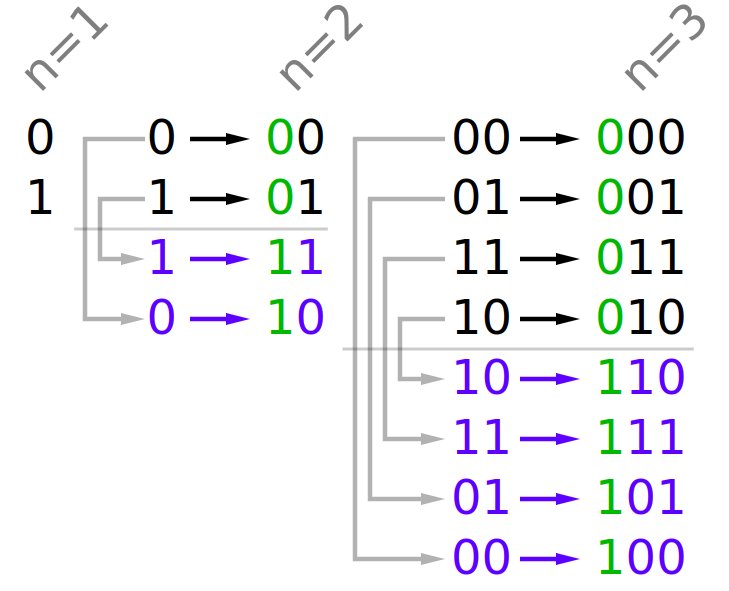
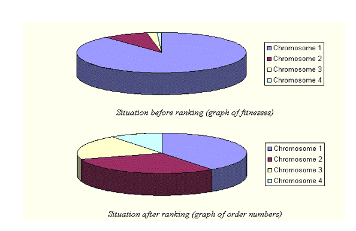
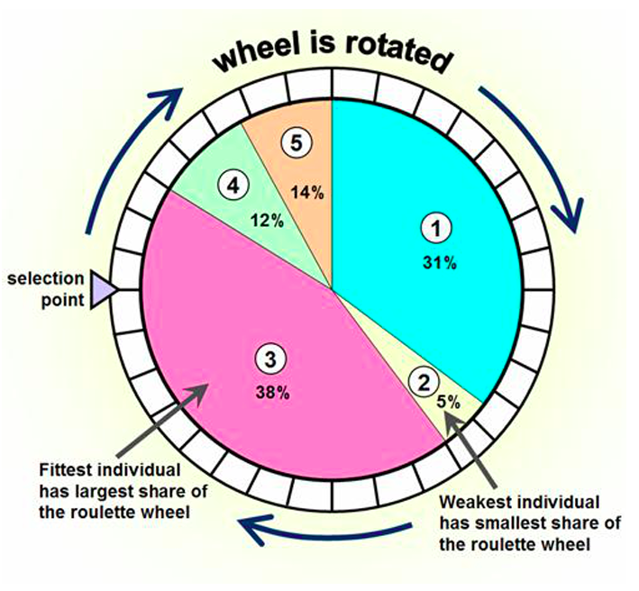
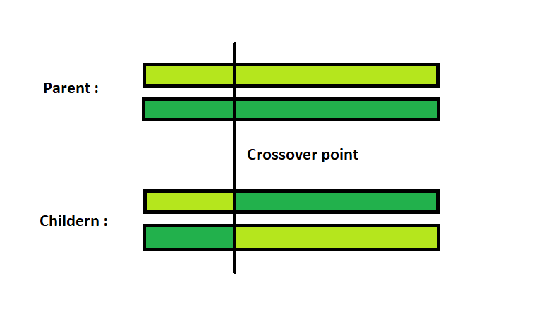
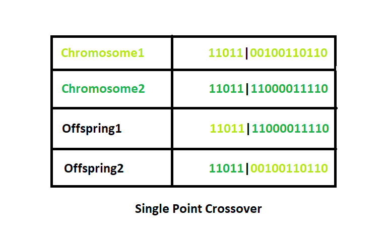
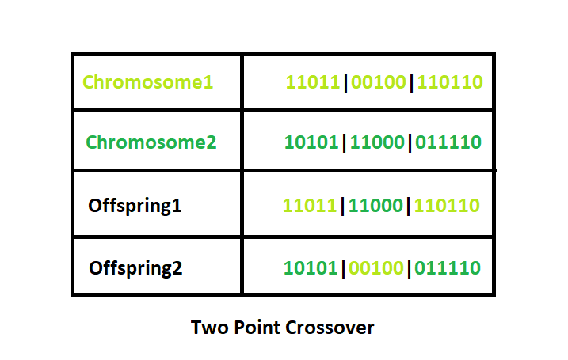
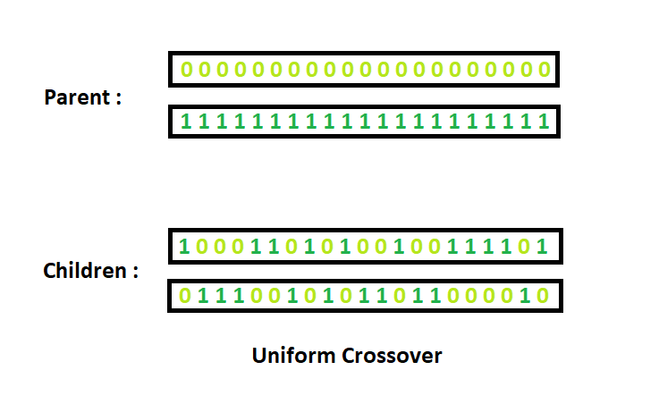

# Biologicky inspirované algoritmy

- [1. Quickstart](#1-quickstart)
- [2. Základní pojmy](#2-základní-pojmy)
  - [2.1. Evoluce](#21-evoluce)
  - [2.2. Strategie](#22-strategie)
  - [2.3. Optimalizační algoritmy a heuristiky](#23-optimalizační-algoritmy-a-heuristiky)
  - [2.4. No Free Lunch Theorem (NFLT)](#24-no-free-lunch-theorem-nflt)
  - [2.5. Evoluční algoritmy](#25-evoluční-algoritmy)
    - [2.5.1. Binary-Reflected Gray Code](#251-binary-reflected-gray-code)
  - [2.6. Populace](#26-populace)
    - [2.6.1. Omezení na argumenty cenové funkce, penalizace, kritické situace](#261-omezení-na-argumenty-cenové-funkce-penalizace-kritické-situace)
  - [2.7. Testovací funkce](#27-testovací-funkce)
  - [2.8. Limity výpočetních systémů (Limes Computablis)](#28-limity-výpočetních-systémů-limes-computablis)
  - [2.9. Limity "inteligentních" systémů](#29-limity-inteligentních-systémů)
- [3. Blind Search](#3-blind-search)
- [4. Hill Climber (Horolezec)](#4-hill-climber-horolezec)
- [5. Tabu Search](#5-tabu-search)
- [6. Simulované žíhání (Simulated Annealing)](#6-simulované-žíhání-simulated-annealing)
- [7. Genetické algoritmy](#7-genetické-algoritmy)
  - [7.1. Výběr rodičů (selection)](#71-výběr-rodičů-selection)
  - [7.2. Generování potomků - křížení (crossover)](#72-generování-potomků---křížení-crossover)
  - [7.3. Mutace](#73-mutace)
- [8. Diferenciální evoluce (Differential Evolution - DE)](#8-diferenciální-evoluce-differential-evolution---de)
  - [8.1. Pseudokód DE](#81-pseudokód-de)
  - [8.2. Parametry DE](#82-parametry-de)
- [9. Hejnová inteligence (Swarm Intelligence - SI)](#9-hejnová-inteligence-swarm-intelligence---si)
  - [9.1. Vlastnosti](#91-vlastnosti)
  - [9.2. Particle Swarm Optimization (PSO)](#92-particle-swarm-optimization-pso)
    - [9.2.1. Rovnice PSO](#921-rovnice-pso)
    - [9.2.2. Pseudokód PSO](#922-pseudokód-pso)
    - [9.2.3. Výhody a nevýhody PSO](#923-výhody-a-nevýhody-pso)
  - [9.3. Samo-organizující se migrační algoritmus (SOMA)](#93-samo-organizující-se-migrační-algoritmus-soma)
    - [9.3.1. SOMA hyperparametry](#931-soma-hyperparametry)
    - [9.3.2. SOMA pseudokód](#932-soma-pseudokód)
  - [9.4. Ant Colony Optimization (ACO)](#94-ant-colony-optimization-aco)
  - [9.5. Firefly Algorithm (FA)](#95-firefly-algorithm-fa)
- [10. Teaching-Learning Based Optimization (TLBO)](#10-teaching-learning-based-optimization-tlbo)
- [11. Multi-objective optimization (NSGA II)](#11-multi-objective-optimization-nsga-ii)
- [12. Symbolická regrese](#12-symbolická-regrese)
  - [12.1. Genetické programování](#121-genetické-programování)

## 1. Quickstart

```bash
python3.11 -m venv .venv
pip install -r requirements.txt 
```

## 2. Základní pojmy

- pro srovnávání algoritmů je vhodná reference **počet ohodnocení cenové funkce** (např. graf počet ohodnocení vs. funkční hodnota)

### 2.1. Evoluce

1. nastavení hyperparametrů
2. generování počáteční populace
3. prvotní vyhodnocení cenové funkce
4. **výběr rodičů** (výběr nejlepších vede k degradaci!)
5. vytvoření potomků
6. **mutace** potomků - s mírou, např. vhodný parametr $\sigma$ u $\mathcal{N}(\mu, \sigma)$
7. vyhodnocení cenové funkce
8. **elitismus** - výběr nejlepších jednotlivců, obecně z potomků i rodičů
9. **nová populace**
10. nahrazení staré populace novou
11. goto 4 (jedna iterace se nazývá **generace**)

### 2.2. Strategie

- **point** strategy (po jednotlivých bodech)
- **population** strategy (po generacích)

### 2.3. Optimalizační algoritmy a heuristiky

Můžou vyřešit "black-box" problém, který se nechová podle známého matematického problému.

- **deterministické** - gradient descent
- **enumerativní** - brute force
- **stochastické**
  - např. Hill Climber, Tabu Search
  - pomalé
  - založené na náhodě
  - vhodné pouze pro malé přípustné množiny $\Omega$
- **kombinované** (mixed) - kombinace deterministických a stochastických algoritmů

### 2.4. No Free Lunch Theorem (NFLT)

- neexistuje algoritmus, který by fungoval na všechny problémy

### 2.5. Evoluční algoritmy

- jednoduchost
- použití decimálních čísel, resp. jejich binárního zápisu
  - využití [Grayova kódu](https://en.wikipedia.org/wiki/Gray_code), kde se každé dvě následující čísla liší pouze jedním bitem

#### 2.5.1. Binary-Reflected Gray Code

- reflect-and-prefix metoda:



### 2.6. Populace

- každá populace je definována vzorem / zástupcem (specimen),
  - např. $Specimen=\big( (float,[Lo,Hi]), (int,[Lo,Hi]), (short,[Lo,Hi]) \big)$
- Co, když je jedinec vygenerován mimo přípustnou množinu?
  - přesun na hranici $\rightarrow$ hromadění jedinců na hranici
  - generace nového jedince, dokud nesplňuje požadavky
  - pohyb po kouli, $\texttt{if } x>x_{max}\colon \Delta x = | x_{max} - x | \Rightarrow x = x_{min} + \Delta x$ (nefunguje pokud $x > 2 x_{max}$, asi by to šlo řešit modulem)

#### 2.6.1. Omezení na argumenty cenové funkce, penalizace, kritické situace

- TODO

### 2.7. Testovací funkce

- často mají globální extrém ve "stejném" bodě nehledě na dimenzi
  - např. Schwefel, $f(\mathbf{x}^{\star})=\mathbf{o}$, $\mathbf{x}^{\star}=(420.97,..., 420.97)$

### 2.8. Limity výpočetních systémů (Limes Computablis)

Počet mikrosekund od počátku vesmíru má 24 číslic. Počet protonů ve známém vesmíru 79.

- matematické - Gödelova věta,
- kvantové - množství informace, které lze teoreticky uložit do množství hmoty

### 2.9. Limity "inteligentních" systémů

- ....

## 3. Blind Search

- Generuji náhodné řešení z prostoru všech řešení (přípustné množiny) pomocí **uniformního rozdělení**

## 4. Hill Climber (Horolezec)

1. nejlepší řešení $\leftarrow$ náhodné řešení z prostoru všech řešení, $X\sim U(lb,ub)$
2. generuju jednotlivce z okolí nejlepšího řešení pomocí **normálního rozdělení** (se zvoleným parametrem $\sigma$) a kontroluju, jestli nový jedinec není mimo přípustnou množinu

## 5. Tabu Search

- podobné jako horolezec, jen při generování jednotlivců (pomocí normálního rozdělění) je vynuceno, aby se neopakovaly předchozí řešení (pomocí fronty a kontroly `solution is in tabu_queue`)

## 6. Simulované žíhání (Simulated Annealing)

1. Nastavení hyperparametrů teploty $T_0 = 1000$, $T_{min} = 0$, $\alpha = 0.95$.
2. Dokud $T > T_{min}$:
   1. Vytvoř jedince $I$ v **přípustné množině** všech řešení $\Omega$ (search space).
   2. Vyhodnoť cenovou funkci $f(I),I\in\Omega$.
   3. Výpočet $\Delta_f = f(I) - f_{best}$.
   4. **Pokud** je nové řešení lepší (tzn. pro minimalizaci $\Delta_f < 0$), aktualizuj řešení.
   5. **Jinak** přijmi nové (horší) řešení, pokud: $r < e^{\frac{\Delta_f}{T}}$, kde $r=\text{random}\big([0,1)\big)$.
   6. Snížení teploty $T \leftarrow T \cdot \alpha$.

Poznámka k výrazu $r < e^{\frac{\Delta_f}{T}}$. Pokud je teplota $T$ vysoká, tak se tento výraz blíží k jedné a je tedy velmi pravděpodobné, že bude přijato nové  řešení (i pokud je horší). Se snižující teplotou se tato pravděpodobnost snižuje.

## 7. Genetické algoritmy

- založeny na principech evoluce v přírodě - C. R. Darwin a G. J. Mendel
- mutují se bity binárního zápisu decimálního čísla
- používá se *fitness* funkce $F$ normalizovaná do intervalu $[0,1]$

Obecný převod cenové funkce na fitness:

$$
F(i)=\frac{F_{max}-F_{min}}{f_{min}-f_{max}}f(i)+\frac{f_{min}F_{min}-f_{max}F_{max}}{f_{min}-f_{max}}
$$

Na intervalu $[0,1]$:

$$
F(i)=\frac{f(i)-f_{max}}{f_{min}-f_{max}}
$$

Na intervalu $[0,1]$ s "ošetřením $\infty$" ($\varepsilon=0.01$):

$$
F(i)=\frac{(1-\varepsilon)f(i)+f_{min}\varepsilon-f_{max}}{f_{min}-f_{max}}
$$

### 7.1. Výběr rodičů (selection)

During each successive generation a proportion of the existing population is selected to breed a new generation. Individual solutions are selected through a stochastic fitness-based process, where the requirement is that fitter solutions (as measured by a fitness function) are typically more likely to be selected.

Rodiče se výbírají stochastickým procesem založeným na *fitness* funkci.

1. Roulette Wheel Selection
   - seřadím jedince podle fitness
   - vygeneruju náhodné číslo $r\in[0,1)$
   - vyberu prvního jedince, který má fitness větší než $r$
   - nefunguje dobře pro velké rozdíly mezi rodiči, proto se používá jednoduchá korekce - *Rank Selection*
2. Rank selection
   - jedincům přiřadím hodnoty $1,2,3,...$ podle fitness (nejhorší jedinec 1), odpovídá to "velikosti úseček"



Rank Selection (Roulette Wheel Selection)



$$\mathcal{P}(X=i)=\frac{fitness(i)}{\sum\limits_j fitness(j)}$$

```python
def pick_one(probabilities: list):
    idx = 0
    r = np.random.uniform()
    while r > 0:
        r -= probabilities[idx]
        idx += 1
    return probabilities[idx - 1]
```

1. Tournament Selection

```pseudocode
choose k (the tournament size) individuals from the population at random
choose the best individual from the tournament with probability p
choose the 2nd best individual with probability p*(1-p)
choose the 3rd best individual with probability p*((1-p)^2)
and so on
```

### 7.2. Generování potomků - křížení (crossover)

- single point crossover




- n-point crossover



- uniform crossover (uniformní křížení - každý gen (bit) je náhodně vybrán z jednoho z odpovídajících genů rodičovských chromozomů)



U **TSP** vedou předchozí metody k nevalidní konfiguraci.

### 7.3. Mutace

- v případě TSP s určitou pravděpodobností prohodím prvky jedince

```python
n_cities = len(offspring)
for _ in offspring:
    # Swap two random neighbors
    if np.random.uniform() < mutation_rate:
        idx1 = int(np.random.uniform(n_cities))
        idx2 = (idx1+1) % n_cities
        offspring = self._swap(offspring, idx1, idx2)
```

## 8. Diferenciální evoluce (Differential Evolution - DE)

- jeden z dnešních nejlepších evolučních algoritmů
  - ale platí NFLT, např. mravenci (ACO) jsou lepší na kombinatorické výpočty
- vychází z genetických algoritmů

### 8.1. Pseudokód DE

1. vygeneruj $NP\in\mathbb{N}$ jedinců počáteční populace
2. vyhodnoť *fitness* počáteční populace (`fitness`)
3. pro $G$ generací opakuj:
   1. zkopíruj původní populaci (`population_new`) a *fitness* populace (`fitness_new`)
   2. pro každého jedince předchozí populace - `for parent in population:`
      1. náhodně vyber tři jedince $x_1,x_2,x_3$
      2. jedinci/rodiče z předchozího kroku se podílejí na tvorbě jednoho nového potomka $\boxed{v=(x_1-x_2)*F+x_3}$, kde $F\in[0,2]$ je *mutační konstanta* a $v$ je tzv. *mutační vektor*
      3. proveď *křížení* - pro každý prvek `trial_vector = np.zeros(D)`: pokud je pravděpodobnost (`np.random.uniform()`$\in[0,1)$) menší než $CR\in [0,1]$ (crossover rate), přiřaď do `trial_vector` prvek z mutačního vektoru $v$, jinak zachovej parametr z rodiče (`trial_vector[i] = parent[i]`)
      4. vyhodnoť *fitness*, pokud je potomek lepší, než aktuální jedinec, tak přidej vytvořeného potomka do nové populace `population_new[i] = trial_vector`, aktualizuj pole `fitness_new` a aktualizuj řešení (pokud je potomek lepší než aktuální nejlepší řešení)
   3. nahraď starou populaci novou:
      1. `population = population_new`
      2. `fitness = fitness_new`

### 8.2. Parametry DE

- $CR\in [0,1]$ - Crossover Rate (doporučení: $[0.5, 0.9]$)
- $D$ - dimenze
- $NP\in[10D,100D]$ - velikost populace
- $F\in[0,2]$ - mutační konstanta - zkrátí nebo natáhne vektor $(0.8)$
- $G>0$ - generace

## 9. Hejnová inteligence (Swarm Intelligence - SI)

- větev AI
- hejnové algoritmy jsou inspirováné chováním hejn zvířat v přírodě, především u hmyzu (mravenci) nebo třeba
  - ptácí (*flock*)
  - ryby (*shoal*)
  - mouchy (*swarm*)
- jedinci/agenti v populaci netvoří potomky, ale **komunikují** spolu
- v hejnové inteligenci neexistují operátory mutace a křížení (crossover)
- z biologie si SI přebírá především kooperativní chování, kdy hejno je schopno vyřešit problém, který žádný jedinec není schopný vyřešit samostatně
- globální inteligence je poháněna lokálními interakcemi

### 9.1. Vlastnosti

- *povědomí o svém okolí* (**awareness**) - každý agent musí mít povědomí o svém okolí
- *samostatnost* (**autonomy**) - každý agent pracuje autonomně (ne jako otrok)
- *vzájemná podpora* (**solidarity**) -  když je úkol dokončen, tak si agenti autonomně hledají nové úkoly
- *rozšiřitelnost* (**expandability**) - po nalezení (lokálního) minima agenti rozšíří oblast hledání
- *robustnost* (**resiliency**) - když je agent odstraněn, tak se systém musí omět zotavit (např. "vyléčit agenta")

### 9.2. Particle Swarm Optimization (PSO)

- PSO napodobuje chování hejna ptáků
- každá částice (particle) má svoji **pozici** ($x$; souřadnice) a **rychlost** ($v$; směrový vektor), navíc si pamatují svoji současnou nejlepší pozici
- `g_best`...globálně nejlepší řešení v populaci
- `p_best`...lokální nejlepší řešení (pro daného agenta)

#### 9.2.1. Rovnice PSO

- rovnice pro rychlost a polohu na základě rychlosti a předchozí polohy

$$
\begin{align*}
v_{d}^{(t+1)} &= [w]\cdot v_{d}^{(t)} - c_1 \cdot \text{rand} \cdot (\text{p\_best}_{i,d} - x_{i,d}^{(t)})+c_2 \cdot \text{rand} \cdot (\text{g\_best}_{d} - x_{i,d}^{(t)}), \\
x_{i,d}^{(t+1)} &= x_{i,d}^{(t)} + v_{d}^{(t+1)},
\end{align*}
$$

kde $\text{rand}\in[0,1)$, $w$ je volitelný parametr setrvačnosti a hyperparametry "učení" $c_1$, $c_2$ určují chování algoritmu a rozptyl roje/hejna

- hyperparametry $c_1$ a $c_2$ je možné tyto hodnoty snižovat s během algoritmu (simulované žíhání)
- výsledkem jsou **tři typy chování**:
  - **individuální** - částice pokračuje vlastní cestou
  - **konzervativní** - částice se vrací ke svému nejlepšímu nalezenému řešení `p_best`
  - **flexibilní** - částice směřuje ke globálně nejlepšímu řešení `g_best`
- pokud částice "vyletí" z přípustné množiny všech řešení, tak se **náhodně vygeneruje nová** (*robustnost*)
  - aby se tento jev příliš často neopakoval, tak je nastavena **maximální rychlost** $v_{max}$

#### 9.2.2. Pseudokód PSO

- TODO

#### 9.2.3. Výhody a nevýhody PSO

- tendence skončit v lokálním extrému
- mnoho hyperparametrů
  - počet částic, doporučení $10D$
  - $v_{max}$...doporučení 1/20 velikosti prohledávaného prostoru, např. $[-10,10]\rightarrow v_{max}=1$
    - příliš malá $\rightarrow$ pomalá konvergence a malá část prohledaného prostoru
    - příliš velká $\rightarrow$ přestřelování optimálního řešení
  - $c_1,c_2$ - hyperparametry učení (ovlivňují hlavně výběr chování částic)
  - $w$ - setrvačnost

### 9.3. Samo-organizující se migrační algoritmus (SOMA)

- Vzdálenost mezi nejlepším řešením a aktuálním musí být nenulová, proto se používá krok třeba $0.13$.
- $ML$...migration loop

#### 9.3.1. SOMA hyperparametry

- `n_migrations`: 100
- `population_size`: 20,
- `perturberation`: 0.4,
- `step`: 0.11,
- `path_length`: 3

#### 9.3.2. SOMA pseudokód

1. Počáteční populace `np.random.uniform(lb,ub,d)`, kde $d$ je dimenze
2. Ohodnocení počáteční populace
3. `leader` je nejlepší řešení z počáteční populace (`np.argmin(population_fitness)`)
4. Migrační kroky `steps = np.arange(0,path_length,step)`
5. Opakuj do `n_migrations`:
   1. `new_population = population.copy()`
   2. Pro každého jedince v populaci kromě leadera:
      1. Jdi ve směru leadera. Buď $x$ jedinec, $\rho$ perturberace, $x_L$ leader a $t$ aktuální délka kroku ($t\in\text{steps}$).
         1. Navíc buď $\vec{\rho} = (\text{np.random.uniform(0,1,d)} < \rho)$ perturberační vektor (obsahuje binární hodnoty).
         2. $\forall t\colon x_{new,t} = x_t + t\vec{\rho}(x_L - x_t)$
         3. Kontrola zda $\forall t\colon x_t\in\Omega$, kde $\Omega$ je přípustná množina. Řešení, která neleží v $\Omega$ třeba náhodně znova vygeneruju.
         4. Vyberu nejlepší z těchto lokálních řešení.
      2. Pokud je nový jedinec lepší než předchozí, přidám ho do `new_population`, aktualizuji řešení, a navíc pokud je dokonce lepší než leader, tak si uložím index na nového leadera.
   3. Aktualizuji populaci a leadera
6. Konec.

### 9.4. Ant Colony Optimization (ACO)

- vhodný pro kombinatorické problémy
- každý mravenec při cestě z hnízda za potravou produkuje feromony (komunikace s ostatními mravenci z kolonie)
- pohyb mravenců je náhodný, avšak v průběhu času je jejich rozhodování ovlivněno feromony
- na nejkratší cestě se feromony hromadí
- důležitá vlastnost feromonů: **vypařování**

### 9.5. Firefly Algorithm (FA)

- méně svítivá světlušky je přitahována (*attractiveness*) k více svítivé světlušce
- *attractiveness* se snižuje se vzdáleností mezi světluškami
- pokud v blízkosti světlušky není žádná, která by svítila více, tak se světluška pohybuje náhodně

## 10. Teaching-Learning Based Optimization (TLBO)

Lze rozdělit do dvou fází:

1. Fáze učení od učitele (*teacher phase*)
2. Fáze učení od ostatních studentů (*learner phase*)

Učitel je jedinec s nejlepší funkční hodnotou. Vylepšuje **průměr** populace.

## 11. Multi-objective optimization (NSGA II)

- NSGA II – Non-Dominated Sorting Genetic Algorithm

## 12. Symbolická regrese

### 12.1. Genetické programování

- Terminály jsou symbolické objekty, které jsou dále nedělitelné (např. proměnné)
- Funkce
- Fitness (např. u logických obvodů požadujeme, abychom pro správný vstup získali správný výstup - vyhodnocení třeba pomocí absolutní chyby nebo accuracy)
- Parametry
