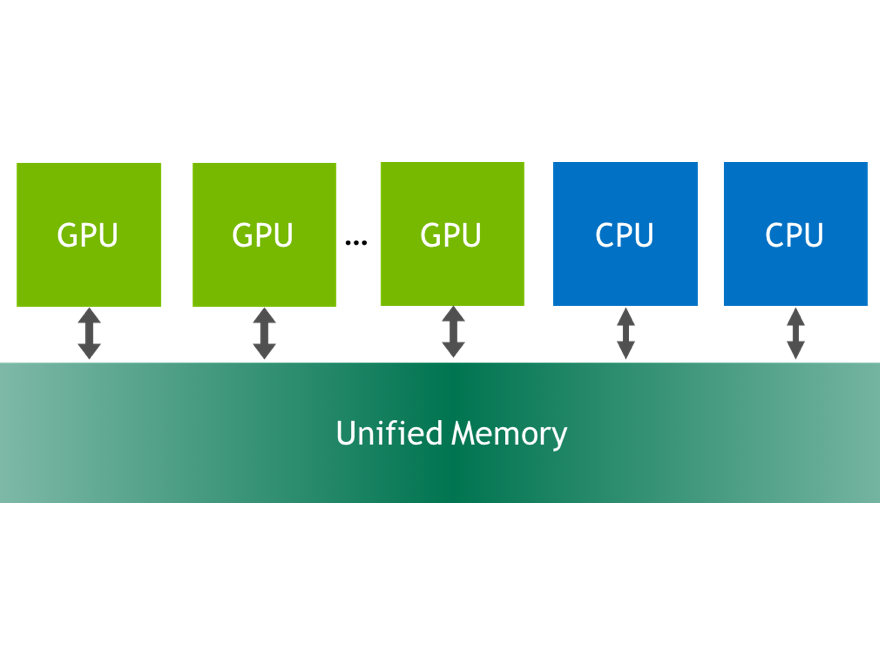
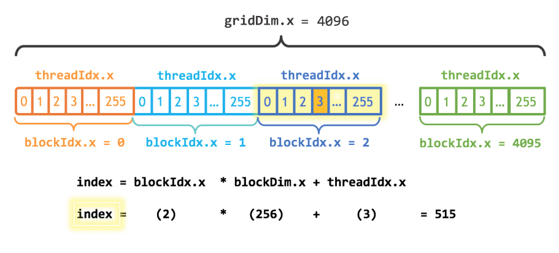

# CUDA

## Introduction

This text is based on [*An Even Easier Introduction to CUDA*](https://developer.nvidia.com/blog/even-easier-introduction-cuda/) blog post by Mark Harris.

<details><summary> Code example: Simple sequential C++ code to add elements of two arrays </summary>

```cpp
{{#include src/add.cpp}}
```

</details>

How to run this code on a GPU? To turn the `add` function into a function that the GPU can run, called a **kernel** in CUDA, one needs to add the specifier `__global__`. The specifier tells CUDA C++ compiler (`nvcc`) that it is function that runs on the GPU and can be called from CPU code.

## Memory Allocation in CUDA

To compute on the GPU, one needs to allocate memory accessible by the GPU. [*Unified Memory*](https://developer.nvidia.com/blog/unified-memory-in-cuda-6/) in CUDA makes this easy by providing a single memory space accessible by all GPUs and CPUs in your system.



To allocate data in unified memory, call `cudaMallocManaged()`, which returns a pointer that you can access from host (CPU) code or device (GPU) code. To free the data, just pass the pointer to `cudaFree()`.

- replace `new` with `cudaMallocManaged()`
- replace `delete []` with `cudaFree`

## How to Launch the Kernel Function?

- triple angle bracket syntax `<<< >>>` - *execution configuration*

```cpp
add<<<1, 1>>>(N, x, y);
```

Before using the result of the kernel function, the CPU need to wait until the kernel is done. This is dobe by calling `cudaDeviceSynchronize()`.

<details><summary> Code example: Add elements of two arrays with one thread on the GPU </summary>

```cpp
{{#include src/add.cu}}
```

</details>

## How to Profile the CUDA Code?

```shell
nvprof ./add_cuda
```

## CUDA Execution Configuration

CUDA GPUs run kernels using *blocks of threads* that are a multiple of **32** in size, so 256 threads is a reasonable size to choose.

```cpp
add<<<1, 256>>>(N, x, y);
```

If we run the code with only this change, it would do the computation once per thread, rather than spreading the computation across the parallel threads.

To do it properly, we need to modify the kernel. CUDA C++ provides keywords that let kernels get the indices of the running threads.

- `threadIdx.x` - index of the current thread within its block
- `blockDim.x` - the number of threads in the block

<details><summary> Code example: Add elements in one block with multiple threads </summary>

```cpp
{{#include src/add_block.cu}}
```

</details>

## CUDA Grid

CUDA GPUs have many parallel processors grouped into **Streaming Multiprocessors (SMs)**. Each SM can run multiple concurrent thread blocks.

The first parameter of the execution configuration specifies the **number of thread blocks**. Together, the blocks of parallel threads make up what is known as the **grid**.

Since we have `N` elements to process, and 256 threads per block, we just need to calculate the number of blocks to get at least `N` threads. We simply divide `N` by the block size (being careful to round up in case `N` is not a multiple of `blockSize`).

```cpp
int blockSize = 256;
int numBlocks = (N + blockSize - 1) / blockSize;
add<<<numBlocks, blockSize>>>(N, x, y);
```



- `gridDim.x` - the number of blocks in the grid
- `blockIdx.x` - the index of the current thread block in the grid

Grid-Stride Loop

```cpp
__global__
void add(int n, float *x, float *y)
{
    // Offset to the beginning of the block
    // and add the thread index.
    int index = blockIdx.x * blockDim.x + threadIdx.x;

    // Stride is equal to the total number
    // of threads in the grid.
    int stride = blockDim.x * gridDim.x;

    // Grid-Stride Loop
    for (int i = index; i < n; i += stride)
        y[i] = x[i] + y[i];
}
```

<details><summary> Code example: Add elements in CUDA grid </summary>

```cpp
{{#include src/add_grid.cu}}
```

</details>
