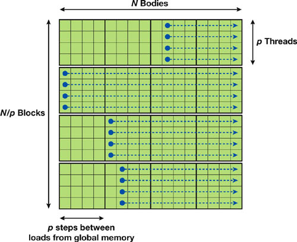

# N-Body Problem

Matěj Frič, FRI0089.

Dne 20. 3. 2024.

---

- [1. Popis problému](#1-popis-problému)
- [2. Simulace problému n-body pomocí technologie CUDA](#2-simulace-problému-n-body-pomocí-technologie-cuda)
- [3. Instance problému](#3-instance-problému)
- [4. Modifikace](#4-modifikace)
- [5. Reference](#5-reference)

## 1. Popis problému

$N$ částic (např. hvězdných těles) se vzájemně přitahuje a odpuzuje podle gravitačních zákonů:

$$
\mathbf{f}_{i,j}=G\dfrac{m_im_j}{\lVert \mathbf{r}_{i,j}\rVert^2}\cdot\dfrac{\mathbf{r}_{i,j}}{\lVert \mathbf{r}_{i,j}\rVert},
$$

kde

- $m_i,m_j$ jsou hmotnosti těles $i$ a $j$,
- $\mathbf{r}_{i,j} = \mathbf{x}_{j} - \mathbf{x}_{i}$ ($\mathbf{x}_{i}$ je pozice tělesa $i$),
- $G$ je gravitační konstanta a
- $\mathbf{f}_{i,j}$ je vektor síly působící na těloso $i$ způsobené gravitační silou tělesa $j$.

Celková velikost síly $\mathbf{F}_i$ působící na těleso $i$ je dána interakcemi se zbylými $N-1$ tělesy:

$$
F_i = \sum\limits_{j=1, j\neq i}^{N}\mathbf{f}_{i,j}=Gm_i\sum\limits_{j=1, j\neq i}^{N}\dfrac{m_j\mathbf{r}_{i,j}}{\lVert \mathbf{r}_{i,j}\rVert^3}
$$

Nicméně jak se tělesa k sobě přibližují, tak síla mezi nimi neomezeně roste. Tato vlastnost není vhodná pro numerickou simulaci. Zanedbáme-li kolize těles, tak můžeme zavést aproximaci celkové síly:

$$
\begin{equation}
    F_i \approx Gm_i\sum\limits_{j=1}^{N}\dfrac{m_j\mathbf{r}_{i,j}}{\sqrt{\left(\lVert \mathbf{r}_{i,j}\rVert^2+\varepsilon^2\right)^{3}}}
\end{equation}
$$

Díky zavedení konstanty $\varepsilon$ můžeme odebrat podmínku $j\neq i$, protože pro $i=j$ dostaneme nulovou sílu.

Pro aktualizaci polohy potřebujeme zrychlení každého tělesa, které lze snadno odvodit z 2. NPZ:

$$
a_i \approx G\sum\limits_{j=1}^{N}\dfrac{m_j\mathbf{r}_{i,j}}{\sqrt{\left(\lVert \mathbf{r}_{i,j}\rVert^2+\varepsilon^2\right)^{3}}}
$$

Rychlost tělesa potom můžeme získat numerickou integrací (např. pomocí Eulerovy metody).

## 2. Simulace problému n-body pomocí technologie CUDA

Můžeme uvažovat nejjednodušší *brute-force* řešení, kdy v každé iteraci simulace je potřeba vypočítat $N^2$ interakcí (každé těleso s každým).

Jedna z možností je použít $N$ vláken, přičemž každé vypočte $N$ interakcí (dohromady $N^2$ interakcí). Lze využít 1D grid s $N/p, p\in\mathbb{N},$ bloky:

Interakce v rámci jednoho řádku se provedou sekvenčně, zatímco jednotlivé řádky jsou zpracovány paralelně. Pozice těles a jejich hmostnost bude uložena v globální paměti (jako vektor, kvůli zarovnávání paměti nejspíše `float4`). V rámci jednoho bloku můžeme vždy překopírovat $p$ těles do *shared memory*. Během sekvenčního výpočtu (přes řádek) můžeme akumulovat hodnotu zrychlení do proměnné v registru vlákna a na konci uložit výslednou hodnotu do globální paměti.

Díky aproximace (1) nemusíme řešit situaci, kdy interakce tělesa se sebou samým by nebyla definována kvůli dělení nulou (diagonála matice interakce těles). Navíc můžeme zanedbat podmínku $i\neq j$ a nenastane tak divergence vláken.

Pole částic může být *double-buffered*, kdy jedno pole může být použito k vizualizaci, zatímco druhé je aktualizováno.

## 3. Instance problému

- 2D (nebo 3D)
- $N\approx[1024, 16384]=[2^{10}, 2^{14}]$

<!--$p \leq 1024$, maximální počet vláken pro jeden blok, $\Rightarrow N \leq 2^{20} = 1048576$. Omezení *shared memory* 65536 B na SM.-->

## 4. Modifikace

Je možné využít hierarchické datové struktury a vyhnout se tak výpočtu všech $N^2$ interakcí (síla klesá s kvadrátem vzdálenosti a interakce vzdálených těles lze zanedbat). Ve 2D lze využít kvadrantový strom a následně na "blízká" tělese lze použít dříve popsaný *brute-force* algoritmus.

## 5. Reference

Lars Nyland, Mark Harris, and Jan Prins:
*Chapter 31. fast n-body simulation with cuda.* [https://developer.nvidia.com/gpugems/gpugems3/part-v-physics-simulation/chapter-31-fast-n-body-simulation-cuda](https://developer.nvidia.com/gpugems/gpugems3/part-v-physics-simulation/chapter-31-fast-n-body-simulation-cuda).
