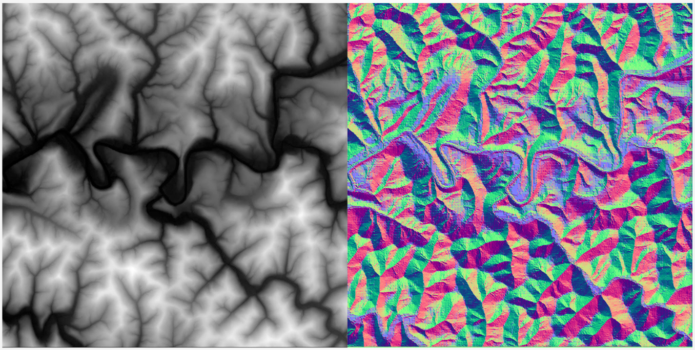

# PA2

- [1. Úvod](#1-úvod)
  - [1.1. Amdahlův zákon](#11-amdahlův-zákon)
  - [1.2. N-Body Problem](#12-n-body-problem)
  - [1.3. Boiler Problem](#13-boiler-problem)
  - [1.4. Dining Philosophers Problem](#14-dining-philosophers-problem)
  - [1.5. nvcc](#15-nvcc)
  - [1.6. VisualStudio22](#16-visualstudio22)
  - [1.7. Limity GPU](#17-limity-gpu)
  - [1.8. Jak vybrat N náhodných unikátních čísel z pole?](#18-jak-vybrat-n-náhodných-unikátních-čísel-z-pole)
- [2. Technologie CUDA](#2-technologie-cuda)
  - [2.1. Práce s vektory](#21-práce-s-vektory)
  - [2.2. Shared memory (SH)](#22-shared-memory-sh)
    - [2.2.1. Statická shared memory](#221-statická-shared-memory)
    - [2.2.2. Dynamická shared memory](#222-dynamická-shared-memory)
  - [2.3. Parallel Reduction](#23-parallel-reduction)
  - [2.4. Zarovnaná paměť](#24-zarovnaná-paměť)
  - [2.5. Bank Conflicts](#25-bank-conflicts)
  - [2.6. Constant Memory](#26-constant-memory)
- [3. Textury](#3-textury)
  - [3.1. Normálové mapy (Normal Mapping)](#31-normálové-mapy-normal-mapping)
- [4. OpenGL](#4-opengl)
  - [4.1. Double Buffering](#41-double-buffering)
  - [4.2. Buffery](#42-buffery)
  - [4.3. GLUT library](#43-glut-library)
- [5. Atomické intrukce (Atomic Functions)](#5-atomické-intrukce-atomic-functions)
  - [5.1. CUDA atomické instrukce](#51-cuda-atomické-instrukce)
- [6. Page Lock Memory](#6-page-lock-memory)
- [7. Unified Memory](#7-unified-memory)
- [8. Stream](#8-stream)
  - [8.1. Memory Stream](#81-memory-stream)
  - [8.2. CUDA Streams](#82-cuda-streams)
- [9. CuBLAS](#9-cublas)
  - [9.1. N-body maticově](#91-n-body-maticově)
- [10. Examples](#10-examples)

## 1. Úvod

- [CUDA Programming Guide](https://docs.nvidia.com/cuda/cuda-c-programming-guide/index.html)

> Proč potřebujeme více jader procesoru? **Skrývání latence** - každá instrukce má nějaký čas vykonávání a my chceme skrývat latenci mezi instrukcemi.

GPU (GP-GPU) poskytuje mnohem větší propustnost instrukcí a paměti oproti CPU podobné ceny.

Rozdíl ve schopnostech GPU a CPU existuje proto, že jsou navrženy s různými cíli. Zatímco CPU je navržen tak, aby vynikal co nejrychlejším prováděním sekvence operací, tzv. vláken, a může paralelně provádět několik desítek těchto vláken, GPU je navržen tak, aby vynikal paralelním prováděním tisíců těchto operací (úlohu rozdělí na velké množství jednotlivých vláken a menším výkonem a dosáhne tak vyšší propustnosti).

Na GPU je více tranzistorů věnováno zpracování dat namísto ukládání dat do mezipaměti *(cache)* a řízení toku *(if else)*.


Typy paralelizmu:

1. **Datový paralelismus**.
2. **Instrukční paralelismus** - využití instrukcí - např. jedny vlákna chystají data, další je zpracovávají.

**Logické vlákno** je *sled instrukcí*. Potřebuju **registry** a nějakou výpočetní jednotku. Běží dokud má instrukce. Přerušení výpočtu vláken určuje programátor.

**Pointer** je proměnná, jejíž hodnotou je adresa.

**Hyper-threading** - každé vlákno se navenek rozdělí. 16jádro má 16 instrukčních sad.

Co rozumíme pojmem **proces**? OS *alokuje a spravuje paměť*, přidělí *stack* a alespoň jeden *main thread*.

Bloky jsou schedulované pomocí Streaming Multiprocessoru (SM). GPU má pouze omezený počet SM *(NVIDIA GeForce GTX 1650 má 14 SM)*.


Skrýváním latence (čekání, **latency hiding**) rozumíme zkrácení nečinnosti procesoru. Instrukce mají nějaký čas vykonávání (např. odmocnina nebo modulo je drahá instrukce). Čtení z disku jakožto nejdražší paměťová operace.

32 CUDA vláken běží se stejnou instrukční sadou ve **warpu**.

### 1.1. Amdahlův zákon

Maximální teoretické zrychlení pomocí paralelismu:

$$\boxed{S=\dfrac{1}{r_s+\dfrac{r_p}{n}}}$$

- $S$ - *speed-up*
- $r_s$ - *serial runtime* (čas sekvenčního algoritmu)
- $r_p$ - *parallel runtime* (čas paralelního běhu)
- $n$ - *number of cores*

Příklad: 70 % programu běží sériově. Máme k dispozici 8 jader.

$$ S=\dfrac{1}{0.7+\dfrac{0.3}{8}} \approx 1.35 $$

### 1.2. N-Body Problem

Výpočet gravitačních interakcí těles, kdy musíme počítat interakce každý s každým (neexistuje matematický model pro $N$ těles).

### 1.3. Boiler Problem

Buď kotel na vodu a dvě kontrolní vlákna. Problém nelze řešit pouze těmito dvěmi vlákny. To, co chce udělat jedno z nich, chce i to druhé. Musí tam být nějaký další prvek, který bude vlákna ovládat (např. semafor, mutex).

### 1.4. Dining Philosophers Problem


### 1.5. nvcc

- Compiler pro rozšíření CUDA.
- Vezme zdroják a rozdělí kód na funkce, které se mají kompilovat pomocí `g++` a `cudapp`.

### 1.6. VisualStudio22


- RMB na projekt, `unload`, upravit verze CUDA, `reload`, `rebuild`.


- *Compute capability* je dána modelem GPU.

### 1.7. Limity GPU

```text
[GPU details]:
  Clock rate                                        : 1.51 GHz
  Number of multiprocessors                         : 14
  Number of cores                                   : 896
  Warp size                                         : 32
  Total amount of global memory                     : 4095 Mb
  Total amount of constant memory                   : 65536 bytes
  Maximum memory pitch                              : 2147483647 bytes
  Texture alignment                                 : 512 bytes
  Run time limit on kernels                         : Yes
  Integrated                                        : No
  Support host page-locked memory mapping           : Yes
  Compute mode                                      : Default (multiple host threads can use this device simultaneously)

[SM details]:
  Number of cores                                   : 64
  Total amount of shared memory per SM              : 65536 bytes
  Total number of registers available per SM        : 65536
  Maximum number of resident blocks per SM          : 16
  Maximum number of resident threads per SM         : 1024
  Maximum number of resident warps per SM           : 32

[BLOCK details]:
  Total amount of shared memory per block           : 49152 bytes
  Total number of registers available for block     : 65536
  Maximum number of threads per block               : 1024
  Maximum sizes of each dimension of a block        : 1024, 1024, 64
  Maximum sizes of each dimension of a grid         : 2147483647, 65535, 65535

SELECTED GPU Device 0: "NVIDIA GeForce GTX 1650" with compute capability 7.5
```

### 1.8. Jak vybrat N náhodných unikátních čísel z pole?

- Dvě pole: originální a pole náhodných hodnot. Sortuju náhodné pole a podle toho měním pozice v originálním poli. Potom vyberu prvních $N$ hodnot z takto vytvořeného pole.

## 2. Technologie CUDA

- Grid se rozpadne na bloky.
- Bloky se rozdělí na warpy. Jeden warp má 32 vláken, které jsou schopny vykonávat SIMT (Single Instruction Multiple Thread).
- `__syncthreads()` - čeká se až všechny warpy dokončí výpočet.

Jeden **streaming multiprocessor (SM) zpracovává jeden blok**. Při dělení problému řádu $N$ obvykle dádá smysl rozdělit úlohu na násobek $|SM|$ bloků, kde $|SM|$ je počet SM.

**Blok je dělený do warpů po 32 vláknech.** Vlákna v rámci jednoho warpu jsou **synchronní** (tzn. nedává smysl volat `__syncthreads()`).

**Global memory** je hodně, ale je pomalá.

**Karta čte obvykle po 512 B.**

### 2.1. Práce s vektory

- Zvolím grid, např. $(2,1,1)$.
- Zvolím velikost bloku např. $(128,1,1)$. Není důvod to komplikovat více dimenzemi.

```cpp
unsigned int tid = blockIdx.x * blockDim + threadIdx;
```

### 2.2. Shared memory (SH)

Shared memory (SH) je alokovaná pro každý thread block, všechny vlákna v rámci bloku mají přístup do stejné sdílené paměti. Latence SH je přibližně 10x nižší oproti globální paměti, která není načtená v cache (pokud nedochází k *bank konfliktům* mezi vlákny). Každý SM má k dispozici 64 KB shared memory. SH je paměť s nízkou latencí v blízkosti každého jádra SM (podobně jako  L1 cache CPU).

Multicast přístup k SH znamená, že přístup do paměti na stejnou pozici více vlákny je v rámci warpu obsloužen současně.

- `__syncthreads()`
- `volatile` řekne compileru, že se nemá provádět cache hodnot, používá se při paralelní redukci

#### 2.2.1. Statická shared memory

V kernelu: `__shared__ int vec[256];`

#### 2.2.2. Dynamická shared memory

V kernelu: `extern __shared__ int x[];` (`extern` a prázdné `[]`)

Při volání kernelu specifikujeme třetí volitený parametr pro velikost SH pro každý blok (v B): `kernel<<<nBlocks, nThreadsPerBlock, nBytesSH>>>(...)`, např. `kernel<<<1, n, n*sizeof(int)>>>(...)`.

Jak postupovat, když potřebuju více SH polí v rámci kernelu?

```cpp
extern __shared__ int s[];
int *integerData = s;                        // nI ints
float *floatData = (float*)&integerData[nI]; // nF floats
char *charData = (char*)&floatData[nF];      // nC chars

myKernel<<<
  gridSize, 
  blockSize, 
  nI*sizeof(int)+nF*sizeof(float)+nC*sizeof(char)
>>>(...);
```

### 2.3. Parallel Reduction

Průchod dat - agregace do jedné hodnoty (min, max, suma atd.)

1. Vlákna zkopírují hodnoty z globalní paměti do shared memory.

Hledání minima:


### 2.4. Zarovnaná paměť

```cuda
cudaError_t cudaMallocPitch(void** devPtr, size_t* pitch, size_t width, size_t height);

cudaError_t cudaMemcpy2D(void* dst, size_t dpitch, const void* src, size_t spitch, size_t width, size_t height, cudaMemcpyKind kind);
```

Sloupcová vs. řádková matice - do 1D se matice ukládá buď po sloupcích *(column major)* nebo po řádcích *(row major)*.

### 2.5. Bank Conflicts

- Přístup k paměti přes nějaký bank. Lze optimalizovat pomocí vhodného indexování prvků.

### 2.6. Constant Memory

- Klíčové slovo `__constant__`, např. `__constant__ __device__ int myVar;`
- Chová se jako konstanta z pohledu GPU, ale lze měnit z HOST.
- `cudaMemCpyToSymbol` a `cudaMemCpyFromSymbol`
- Přístup k poli uloženém v konstantní paměti se serializuje! V tomto případě je lepší SH, která podporuje multicast.

## 3. Textury

- Obrázek - šířka, výška, formát. Mapování se ukládá do datových struktur.


Blok *read-only* paměti sdílené všemi multi-procesory (SM). Rychlý random-access. Přístupy k texturovací paměti jsou cache-ovány.

- 1D - např. gradient - grafická reprezentace nějaké fyzikální veličiny (třeba mapování výšky terénu)
- 2D - obrázek
- 3D - v porovnání s polem 2D textur lze ve 3D provádět interpolaci
- 4D - cube mapa (skybox)

V texturovací jednotce lze nastavit **wrapping** (textura se *opakuje*) nebo **clamping** (přístupy mimo texturu se přesunou na *hranici*).


Proč se nepoužívá `if` na kontrolu `ouf of bound`? Př. 3K textura, 10k objektů, double buffering, 144 fps $\Rightarrow 9\cdot10^6\cdot10000\cdot2\cdot144\Rightarrow$ obrovské množsví instrukcí a práce pro scheduler.

**Mipmapa** je metoda optimalizace textur, kdy se načítájí textury v různých rozlišeních od největší (4k) až do velikosti 1x1 pixel:


### 3.1. Normálové mapy (Normal Mapping)


Příklad normálové mapy (uprostřed) se 3D scénou, ze které byla vypočtena (vlevo), a výsledek při aplikaci na rovný povrch (vpravo).

Normálová mapa je obvykle RGB textura, ve které jsou zakódované souřadnice $x,y,z$. Obvykle převažuje souřadnice $z$, proto normálové mapy bývají do modra (B).

Normálová mapa lze také vypočítat z 2D obrázku pomocí **Sobelova filtru**.

- $x$ ... R ... $[-1,1]\Rightarrow[0,255]$
- $y$ ... G ... $[-1,1]\Rightarrow[0,255]$
- $z$ ... B ... $[0,1]\Rightarrow[0,255]$



## 4. OpenGL

- Knihovna, **stavový stroj**. Používá `main thread`, samotná aplikace musí běžet na jiném vlákně.
- Neumožňuje vytváření oken, není to programovací jazyk.
- Pracuje se v **shaderech**.

Grafika:

Vertex ve 3D je prvek vektorového prostoru $V$, nicméně na obrazovce vidíme jenom projekci do 2D. Manipulujeme s vektory, projektujeme je do jiných vektorových prostorů.

1. Model-View matice.
2. Projekční matice - optická vlastnost pohledu, "vlastnosti čočky" (např. ohnisko kamery).
3. NDC transformace, která převede komolý hranol - kameru do jednotkové krychle (normalizace).
4. Transformace na rozlišení displeje.

CUDA se přizpůsobuje OpenGL (protože OpenGL je starší). Prvně se vytvoří objekt v OpenGL, ke kterému potom přes pointery přistupuju z CUDA.

### 4.1. Double Buffering

- Front buffer, back buffer.
- Jeden buffer ukazuji na obrazovce, druhý upravuji pro další snímek, potom je prohodím.

### 4.2. Buffery

1. **Z-buffer** - z-ová souřadnice určující, které objekty vidíme (vzdálenost mezi přední a zadní ořezovou rovinou kamery).
2. **Accumulation-buffer** - načítání předchozích snímků např. pro *motion-blur*.
3. **Stencil-buffer** - maskování.

### 4.3. GLUT library

- Vrstva nad OpenGL pro vytváření oken.

## 5. Atomické intrukce (Atomic Functions)

- Atomická instrukce je **nedělitelná operace**.
- Je HW zaručeno, že atomická operace bude vykonána pouze jedním vláknem.
- SW implementace lze vytvořit pomocí binárního **semaforu**. Jedno vlákno něco dělá, ostatí v nekonečném cyklu čekájí, až se operace dokončí. Toto by bylo velmi pomalé, proto je to řešeno v HW.

### 5.1. CUDA atomické instrukce

- **shared** nebo **global** memory
- atomické operace jsou pomalejší než standardní (load/store)

```cpp
int y = atomicAdd(x, 1) // y = *x; *x = *x + 1
```

Proč to vrací aktuální stav? **Stack unwinding**.

Možné přístupy hledání maxima v poli pomocí atomických operací:

1. Agregace do jedné hodnoty v globální paměti.
2. Agregace do pole v globální paměti (pro každý blok).
3. Agregace do shared memory v rámci jednoho bloku.

## 6. Page Lock Memory

OS stránkuje paměť (kvůli rychlosti, přes cache). Přednačítá data dopředu (kvůli rychlosti). Podobně funguje i GPU.

Princip **page lock memory** je zamknutí paměti na `host` a `device` (RAM a VRAM). OS tím řekneme, aby paměť stránkoval na stejných adresách. Potom GPU nemusí kontrolovat stránky a **memcopy** je rychlejší.

## 7. Unified Memory

Správa paměti je přenechána OS. Nevýhodou je, že nemáme jak zjistit, kdy je paměť na CPU a kdy na GPU. Pokud program navrhneme špatně, tak může docházet k častému kopírovaní dat mezi CPU a GPU (přičemž z pohledu programátora to nemusí na první pohled být viditelné).

## 8. Stream

- Memory Stream
- File Stream
- Network Stream

Proč mít více streamů? **Skrývání latence** - každá instrukce má nějaký čas vykonávání a my chceme skrývat latenci mezi instrukcemi. Zpracovávání heterogenních úloh.

### 8.1. Memory Stream

- **buffer**, třeba lineární (např. **pole**)
- **ukazatel** - pozice v bufferu
- **realokace**
- **pomocné metody**, třeba operátory `<<` a `>>`
- **dealokace**
- vícevláknová implementace: zamykání, přístup, ...

### 8.2. CUDA Streams

- `cudaStreamCreate`
- `cudaMemcopyAsync` - asynchronní volání
- `cudaStreamSynchronize` - v asynchronním programování musíme vždy někdy zavolat `synchronize`

Co dělat s více streamy?

1. Paralelismus do **hloubky**
   - Buď $i_n$ $n$-tá instrukce, $s_1$ a $s_2$ streamy.
   - Postup: $i_1$ pro $s_1$, $i_2$ pro $s_1$, ..., $i_n$ pro $s_1$ a až potom $i_1$ pro $s_2$ atd.
2. Paralelismus do **šířky** - všechny streamy mohou hned začít pracovat
   - Buď $i_n$ $n$-tá instrukce, $s_1$ a $s_2$ streamy.
   - Postup: $i_1$ pro $s_1$, $i_1$ pro $s_2$, pak $i_2$ pro $s_1$, $i_2$ pro $s_2$ atd.

## 9. CuBLAS

Operace:

- $V\times V$
- $V\times M$
- $M\times M$

`ld` je *leading dimension* - kolik prvků přeskočit, abych se dostal na další dimenzi (sloupec).

`cublas` apriori používá sloupcové matice. Matice $A^{M\times N} \Rightarrow$ v `cublas` $M$ sloupců dimenze $N$ $\Rightarrow$ `ld=N`.

### 9.1. N-body maticově

- Buď $N$ těles dimenze $D$, buď $a$ a $b$ dvě libovolné tělesa.

$$
\begin{align*}
  \sum\limits_{i=0}^{D-1}(a_i-b_i)^2 &= \sum\limits_{i=0}^{D-1}\left(a_i^2-2a_ib_i+b_i^2\right)=\\
  &=\sum\limits_{i=0}^{D-1}a_i^2-2 \sum\limits_{i=0}^{D-1}a_ib_i + \sum\limits_{i=0}^{D-1}b_i^2\\
  &= A^{.2} -2A^TA + A^{.2}
\end{align*},
$$
kde $A^{.2}$ značí kvadrát elementů matice $A$.

$$
\begin{bmatrix}
\times  & a & b & c\\
a & 0 & d_{a,b} & d_{a,c} \\
b & d_{b,a} & 0  & d_{b,c} \\
c & d_{c,a}  & d_{c,b}  & 0 \\
\end{bmatrix}
$$

<!-- $\Rightarrow A.^2 @ \mathbb{1}^{M,N} - 2 A^TA$ -->

`cublas` má pro násobení matic operaci:

$C \leftarrow \alpha AB+\beta C$

```cpp
// OP_T ... transpose
// OP_N ... normal
cublasSgemm(handler, A, B, C)
```

Buď $\mathbb{J}$ matice jedniček.

$$
\begin{align*}
  C &\leftarrow 1 A^{.2}\mathbb{J}^{D,N} + 0C;\\
  C &\leftarrow -2AB^T+1C;\\
  C &\leftarrow 1B^{.2}\mathbb{J}^{D,N} + 1C;\\
  C &\leftarrow \sqrt{C};
\end{align*}
$$

Druhou mocninu elementů matice a odmocninu spočítáme v kernelu.

## 10. Examples

<details><summary> Add vectors </summary>

```cpp
{{#include src/1_add_vectors.cu}}
```

</details>

<details><summary> Pitched memory </summary>

```cpp
{{#include src/2_malloc_pitch.cu}}
```

</details>

<details><summary> Parallel reduce: Raindrops </summary>

```cpp
{{#include src/3_raindrops.cu}}
```

</details>

<details><summary> Constant memory </summary>

```cpp
{{#include src/4_constant_memory.cu}}
```

</details>

<details><summary> Texture memory </summary>

```cpp
{{#include src/5_texture_memory.cu}}
```

</details>

<details><summary> Texture memory: Normal Map </summary>

```cpp
{{#include src/6_normal_map.cu}}
```

</details>

<details><summary> OpenGL integration in CUDA </summary>

```cpp
{{#include src/7_opengl.cu}}
```

</details>

<details><summary> Atomics </summary>

```cpp
{{#include src/8_atomics.cu}}
```

</details>

<details><summary> CUDA streams </summary>

```cpp
{{#include src/9_cuda_streams.cu}}
```

</details>
