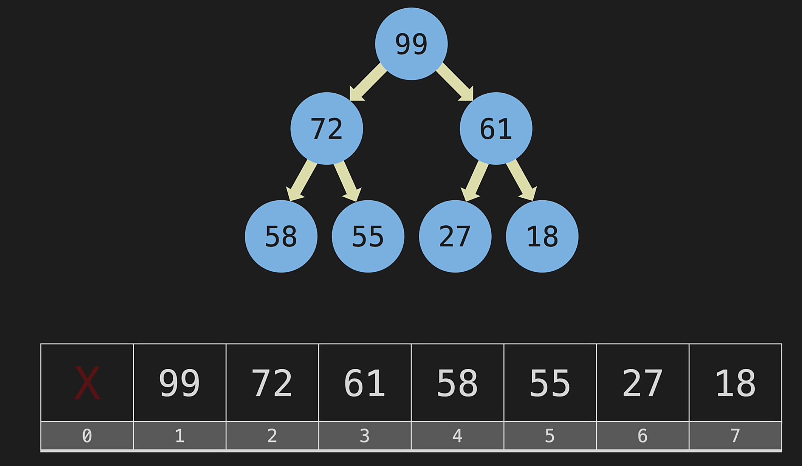

# Databázové systémy

- [1. Struktura PL/SQL bloku](#1-struktura-plsql-bloku)
- [2. Transakce](#2-transakce)
- [3. Procedury](#3-procedury)
  - [3.1. Anonymní procedury](#31-anonymní-procedury)
  - [3.2. Pojmenované procedury](#32-pojmenované-procedury)
  - [3.3. Pojmenované funkce](#33-pojmenované-funkce)
- [4. Trigger](#4-trigger)
- [5. Podmínky](#5-podmínky)
- [6. Cykly](#6-cykly)
- [7. Kurzory](#7-kurzory)
- [8. Hromadné operace](#8-hromadné-operace)
- [9. Statické a dynamické PL/SQL](#9-statické-a-dynamické-plsql)
  - [9.1. Vázené proměnné](#91-vázené-proměnné)
  - [9.2. Prevence SQL Injection](#92-prevence-sql-injection)
- [10. Objektově-relační datový model (ORDM)](#10-objektově-relační-datový-model-ordm)
  - [10.1. Typy metod](#101-typy-metod)
  - [10.2. Uložení objektu v tabulkách](#102-uložení-objektu-v-tabulkách)
  - [10.3. Objektový identifikátor a reference na objekt](#103-objektový-identifikátor-a-reference-na-objekt)
  - [10.4. Dědičnost](#104-dědičnost)
  - [10.5. Změna datových typů](#105-změna-datových-typů)
  - [10.6. Pole](#106-pole)
- [11. Transakce a zotavení](#11-transakce-a-zotavení)
  - [11.1. ACID](#111-acid)
  - [11.2. Techniky zotavení](#112-techniky-zotavení)
- [12. T-SQL](#12-t-sql)
- [13. Halda](#13-halda)

PL/SQL je procedurální rozšíření jazyka SQL.

## 1. Struktura PL/SQL bloku

1. `DECLARE` - nepovinná deklarace lokálních proměnných (prefix `v_`),
2. `BEGIN` - povinné otevření bloku příkazů,
3. `EXCEPTION` - nepovinné zachytávání výjimek,
4. `END` - povinné ukončení bloku.

```sql
v_vek := 20
SELECT vek INTO v_vek
    FROM student
    WHERE login LIKE 'bon007'
```

`SELECT` musí vracet *právě jeden záznam*, jinak je vygenerována výjimka `NO_DATA_FOUND` resp. `TOO_MANY_ROWS`.

<details><summary>Příklad: PL/SQL proměnné</summary>

```sql
DECLARE
  v_fname VARCHAR2(20); --není vhodné (typ se může změnit)
  v_lname Student.lname%TYPE; --preferujeme operátor %TYPE
  v_email Student.email%TYPE;
  v_st Student%ROWTYPE; --záznam z tabulky
  v_date DATE := SYSDATE; --aktuální čas
  v_num NUMBER NOT NULL := 1 ;
BEGIN
  SELECT fname, lname INTO v_fname, v_lname
  FROM student
  WHERE login = 'bon007';

  SELECT * INTO v_st 
  FROM student 
  WHERE login = 'kra228';
  
  v_email := v_fname || '.' || v_lname || '@vsb.cz';
  
  UPDATE students
  SET email = v_email
  WHERE login = 'bon007';
END;
```

</details>

Záznam z tabulky můžeme reprezentovat strukturovaným datovým typem pomocí operátoru `%ROWTYPE`. Např.:

```sql
v_st Student%ROWTYPE;
```

## 2. Transakce

> **Transakce** je *atomická* operace. Buď je provedena celá nebo není proveden žádný příkaz transakce.

<details><summary>Příklad: PL/SQL transakce</summary>

```sql
CREATE TABLE Person (
  login CHAR(5) PRIMARY KEY,
  email VARCHAR(20) NOT NULL,
  password VARCHAR(15) NOT NULL,
  fname VARCHAR(15) NOT NULL,
  mname VARCHAR(15),
  lname VARCHAR(15) NOT NULL,
  street VARCHAR(30),
  city VARCHAR(30)
);

CREATE TABLE Role (
  idRole INT PRIMARY KEY,
  role VARCHAR(30) NOT NULL
);

CREATE TABLE PersonRole (
  login CHAR(5) REFERENCES Person,
  idRole INT REFERENCES Role,
  PRIMARY KEY(login, idRole)
);

INSERT INTO Role VALUES(1, 'Author');

--transakce
BEGIN
  INSERT INTO Person VALUES(
    'sob28', 'jan.sobota@vsb.cz', 'heslo',
    'Jan', NULL, 'Sobota', NULL, NULL);
  INSERT INTO PersonRole VALUES('sob28', 1);
  COMMIT; --transakce proběhla v pořádku, potvrzení změny databáze
EXCEPTION
  WHEN OTHERS THEN
    ROLLBACK; --zrušení transakce
END;
```

</details>

Při nastavení `SET AUTOCOMMIT ON` jsou operace `COMMIT` a `ROLLBACK` ignorovány!

<details><summary>Příklad: PL/SQL zachycení výjimky</summary>

```sql
BEGIN
  INSERT INTO Student (login, fname, lname)
  VALUES ('bon007', 'James', 'Bond');
EXCEPTION
  WHEN DUP_VAL_ON_INDEX THEN
    DBMS_OUTPUT.PUT_LINE('Hodnota atributu login musí být unikátní!');
  WHEN OTHERS THEN
    DBMS_OUTPUT.PUT_LINE(DBMS_UTILITY.FORMAT_ERROR_STACK);
END;
```

</details>

<details><summary>Příklad: PL/SQL vlastní výjimky</summary>

```sql
DECLARE
  too_many_records EXCEPTION;
  v_records INT;
BEGIN
  SELECT COUNT(*) INTO v_records FROM student;
  IF v_records > 20 THEN
    RAISE too_many_records; --výjimka bude propagována do nadřazeného kódu
  ELSE
    INSERT INTO student (login, fname, lname)
    VALUES ('bon007', 'James', 'Bond');
  END IF;
END;

```

</details>

## 3. Procedury

### 3.1. Anonymní procedury

- Jedná se o PL/SQL block.

- Anonymní procedury jsou nepojmenované procedury, které nemohou být volány z jiné procedury.

```sql
DECLARE
  v_name VARCHAR2(30) := 'michal.kratky@vsb.cz';
BEGIN
  INSERT INTO Email VALUES (v_name);
END;
```

### 3.2. Pojmenované procedury

- Pojmenované procedury obsahují *hlavičku se jménem a parametry* procedury.

- Takovouto proceduru je možné volat z jiných procedur nebo spouštět příkazem `EXECUTE` (zkráceně `EXEC`).

- Na rozdíl od anonymních procedur jsou pojmenované procedury předkompilovány a uloženy v databázi.

```sql
CREATE [OR REPLACE] PROCEDURE jmeno_procedury
  (jmeno_parametru [mod] datovy_typ, ...)
IS | AS
  definice_lokalnich_promennych
BEGIN
  telo_procedury
END [jmeno_procedury];
```

- Pro parametry se používá prefix `p_`.
- `mod` může být `{IN | OUT | IN OUT}` - vstupní, výstupní nebo vstupně výstupní proměnná.
- Proměnné typu `VARCHAR2` nebo `NUMBER` se uvádějí bez závorek, které by specifikovaly jejich velikost.
- Spuštěním tohoto kódu se spustí *kompilace*. Pokud je úspěšná, uloží se pojmenovaná procedura do databáze.

<details><summary>Příklad: Pojmenovaná procedura </summary>

```sql
CREATE OR REPLACE PROCEDURE 
InsertEmail(p_login VARCHAR2)
AS
  v_email VARCHAR2(60);
BEGIN
  SELECT email INTO v_email
  FROM Student
  WHERE login = p_login;

  INSERT INTO Email VALUES (v_email);
END;

EXECUTE InsertEmail ('jan440');
```

</details>

### 3.3. Pojmenované funkce

- (Pojmenované) funkce oproti procedurám specifikují návratový typ a *musí vracet hodnotu*.

```sql
CREATE [OR REPLACE] FUNCTION jmeno_funkce
  (jmeno_parametru [mod] datovy_typ, ...)
  RETURN navratovy_datovy_typ
IS | AS
  definice_lokalnich_promennych
BEGIN
  telo_funkce
END [jmeno_funkce];
```

<details><summary>Příklad: Pojmenovaná funkce </summary>

```sql
CREATE OR REPLACE FUNCTION 
GetStudentEmail (p_login IN Student.login%TYPE)
RETURN Student.email%TYPE
AS
  v_email Student.email%TYPE;
BEGIN
  SELECT email INTO v_email FROM Student
  WHERE login = p_login;
  
  RETURN v_email;
END GetStudentEmail;

--Volání funce z PL/SQL bloku (annonymní procedura).
SET SERVEROUTPUT ON;
DECLARE
  v_result Student.email%TYPE;
BEGIN
  v_result := GetStudentEmail('sob28');
  DBMS_OUTPUT.PUT_LINE(v_result);
END;

--Alternativně je možné místo funkce použít
--výstupní parametry procedury:
CREATE OR REPLACE PROCEDURE GetStudentEmail (
  p_login IN Student.login%TYPE,
  p_email OUT Student.email%TYPE
)
AS
BEGIN
  SELECT email INTO p_email FROM Student
  WHERE login = p_login;
END GetStudentEmail;

--Volání procedury je podobné jako u funkce.
DECLARE
  v_email Student.email%TYPE;
BEGIN
  GetStudentEmail('kra22', v_email);
  DBMS_OUTPUT.PUT_LINE(v_email);
END;
```

</details>

## 4. Trigger

Trigger je PL/SQL blok, který je spouštěn v závislosti na nějakém
příkazu jako je `INSERT`, `UPDATE` nebo `DELETE`.

```sql
CREATE [OR REPLACE] TRIGGER jmeno_triggeru
  {BEFORE | AFTER | INSTEAD OF}
  {INSERT [OR] | UPDATE [OR] | DELETE}
  [OF jmeno_sloupce]
  ON jmeno_tabulky
  [REFERENCING OLD AS stara_hodnota NEW AS nova_hodnota]
  [FOR EACH ROW [WHEN (podminka)]]
BEGIN
  prikazy
END;
```

- `OF jmeno_sloupce` – trigger se spouští jen při aktualizaci atributu `jmeno_sloupce`.
- `ON jmeno_tabulky` – specifikujeme tabulku na kterou se
trigger váže.
- `[FOR EACH ROW [WHEN (podminka)]]`
  - Implicitně se trigger spouští pouze jednou pro jeden příkaz (který může aktualizovat (mazat, vkládat) více záznamů).
  - Tímto volitelným parametrem specifikujeme, že trigger má být spouštěn pro každý záznam, který je SQL příkazem aktualizován.
- `[REFERENCING OLD AS stara_hodnota NEW AS
nova_hodnota]`
  - Umožňuje pojmenovat pomocí proměnné staré a nové hodnoty záznamu se kterým manipulujeme.
  - Implicitně jsou tyto proměnné pojmenovány jako `:OLD` a `:NEW`.

<details><summary>Příklad: PL/SQL trigger </summary>

Při mazání záznamu z tabulky `Student` budeme mazaný záznam ukládat do tabulky `Hist_stud`.

```sql
CREATE OR REPLACE TRIGGER del_student
  BEFORE DELETE
  ON student
  FOR EACH ROW
BEGIN
  INSERT INTO Hist_stud (login, name, surname)
  VALUES (:OLD.login, :OLD.name, :OLD.surname);
END;
```

</details>

Pokud se pokusíme v triggeru číst nebo modifikovat stejnou tabulku, pro kterou je daný trigger definován, obdržíme chybu *mutating table error* (i.e. `ORA-04091`). Obecně bychom se takovému triggeru měli vyhnout, ale lze to obejít pomocí *složeného triggeru*.

<details><summary>Příklad: PL/SQL compound trigger </summary>

```sql
CREATE OR REPLACE TRIGGER compound_trigger
  FOR UPDATE OF salary ON employees
  COMPOUND TRIGGER
  -- Declaration part (optional)
  BEFORE STATEMENT IS
    -- Code before the statement execution
  BEGIN
    -- Implementation for BEFORE STATEMENT
  END BEFORE STATEMENT;

  BEFORE EACH ROW IS
    -- Code before each row update
  BEGIN
    -- Implementation for BEFORE EACH ROW
  END BEFORE EACH ROW;

  AFTER EACH ROW IS
    -- Code after each row update
  BEGIN
    -- Implementation for AFTER EACH ROW
  END AFTER EACH ROW;

  AFTER STATEMENT IS
    -- Code after the statement execution
  BEGIN
    -- Implementation for AFTER STATEMENT
  END AFTER STATEMENT;
  
END compound_trigger;
```

</details>

## 5. Podmínky

```sql
IF podminka1 THEN
  -- příkazy pro podminku1
ELSIF podminka2 THEN
  -- příkazy pro podminku2
ELSE
  -- příkazy, které se provedou, pokud žádná z předchozích podmínek není splněna
END IF;
```

## 6. Cykly

```sql
LOOP
--příkazy cyklu
[ EXIT; | EXIT WHEN podminka; ]
END LOOP;
```

<details><summary>Příklad: Cyklus s podmínkou na konci (LOOP) </summary>

```sql
DECLARE
  v_i INT := 0;
BEGIN
  LOOP
    DBMS_OUTPUT.PUT_LINE('v_i: ' || v_i);
    EXIT WHEN v_i >= 5;
    v_i := v_i + 1;
  END LOOP;
END;
```

</details>

```sql
WHILE podminka LOOP
--příkazy cyklu
END LOOP;
```

<details><summary> Příklad: Cyklus s podmínkou na začátku (WHILE) </summary>

```sql
DECLARE
  v_i INT := 0;
BEGIN
  WHILE v_i < 6 LOOP
    DBMS_OUTPUT.PUT_LINE('v_i: ' || v_i);
    v_i := v_i + 1;
  END LOOP;
END;
```

</details>

```sql
FOR jmeno_promenne IN [REVERSE] start..end
LOOP
  -- příkazy cyklu
END LOOP;
```

<details><summary> Příklad: Cyklus s pevným počtem opakování (FOR) </summary>

```sql
DECLARE
  v_i INT;
BEGIN
  FOR v_i IN 0..5
  LOOP
    DBMS_OUTPUT.PUT(v_i);
    IF v_i <> 5 THEN
      DBMS_OUTPUT.PUT(', ');
    END IF;
  END LOOP;
  DBMS_OUTPUT.NEW_LINE();
END;
```

</details>

## 7. Kurzory

Kurzory jsou *pomocné proměnné* vytvořené *po* provedení nějakého SQL příkazu.

- **Implicitní kurzor** – vytváří se automaticky po provedení příkazů jako `INSERT`, `DELETE` nebo `UPDATE`.

- **Explicitní kurzor** – definuje se již v definiční části procedury podobně jako proměnná. Takový kurzor je často spojen s příkazem `SELECT`, který vrací více než jeden řádek.

Definice explicitního kurzoru má následující syntaxi:

```sql
CURSOR jmeno_kursoru IS vysledek_prikazu_select;
```

Kde `vysledek_prikazu_select` vrací množinu záznamů. Pomocí kurzoru můžeme postupně *procházet jednotlivé záznamy* výsledku `SELECT`. V každém kroku programu ukazuje kurzor *pouze na jeden záznam* výsledku.

Práce s kurzorem probíhá pomocí následujících příkazů:

```sql
OPEN jmeno_kurzoru
```

- Otevření kurzoru - provedení SQL příkazu spojeného s kurzorem a nastavení kurzoru na první záznam výsledku.

```sql
FETCH jmeno_kurzoru INTO promenna_zaznam
```

- Načtení aktuálního záznamu kurzoru do proměnné `promenna_zaznam` a posunutí se na další záznam.

```sql
CLOSE jmeno_kurzoru
```

- Zavření kurzoru.

<details><summary> Příklad: PL/SQL kurzor pro načtení všech příjmení z tabulky </summary>

```sql
DECLARE
  CURSOR c_surname IS
    SELECT * FROM Student;
    
  v_record Student%ROWTYPE;
  v_tmp INTEGER := 0;
BEGIN
  OPEN c_surname; --open cursor
  LOOP
    FETCH c_surname INTO v_record;
    EXIT WHEN c_surname%NOTFOUND; --%NOTFOUND returns true when
                                  --there is no other record.
    v_tmp := c_surname%ROWCOUNT; --%ROWCOUNT returns the number of records
                                 --obtained by FETCH.
    DBMS_OUTPUT.PUT_LINE(v_tmp || v_record.surname);
  END LOOP;
  CLOSE c_surname; --close cursor
END;


--Simpler solution with FOR LOOP:
DECLARE
  CURSOR c_surname IS
    SELECT surname FROM Student;
    
  v_surname Student.surname%TYPE;
  v_tmp NUMBER := 0;
BEGIN
  FOR one_surname IN c_surname LOOP
    v_tmp := c_surname%ROWCOUNT;
    v_surname := one_surname.surname;
    DBMS_OUTPUT.PUT_LINE(v_tmp || ' ' || v_surname);
  END LOOP;
END;


--Even simpler without an explicit definition of a cursor:
DECLARE
  v_surname Student.surname%TYPE;
  v_tmp NUMBER := 0;
BEGIN
  FOR one_surname IN (SELECT surname FROM Student)
  LOOP
    v_tmp := v_tmp + 1;
    v_surname := one_surname.surname;
    DBMS_OUTPUT.PUT_LINE(v_tmp || ' ' || v_surname);
  END LOOP;
END;

```

</details>

## 8. Hromadné operace

```sql
... BULK COLLECT INTO collection_name[,collection_name] ...
```

- Hromadné zapsání záznamů do kolekce (pole).

```sql
FORALL index IN lower_bound..upper_bound
sql_statement;
```

- Pro každý záznam v kolekci (poli) proveď nějaký SQL příkaz *(není to cyklus!)*.

<details><summary> Příklad: PL/SQL BULK COLLECT </summary>

Tento blok jazyka PL/SQL deklaruje dvě vnořené tabulky `empl_ids` a `names` a poté provede hromadný sběrný dotaz pro získání ID a příjmení zaměstnanců z tabulky `Employees`.

Následně příkazem `FORALL` provede aktualizaci tabulky `Myemp` s odpovídajícími jmény na základě získaných ID zaměstnanců.

```sql
DECLARE
  TYPE NumTab IS TABLE OF Employees.employee_id%TYPE;
  TYPE NameTab IS TABLE OF Employees.last_name%TYPE;
  
  empl_ids NumTab;
  names NameTab;
BEGIN
  SELECT employee_id, last_name
  BULK COLLECT INTO empl_ids, names
  FROM Employees
  WHERE employee_id > 1000;

  --rest of the code...

  FORALL i IN empl_ids.FIRST..empl_ids.LAST
    UPDATE Myemp
    SET name = names(i)
    WHERE Employee = empl_ids(i);
END;
```

</details>

<details><summary> Příklad: PL/SQL vložení 100 000 záznamů </summary>

```sql
DECLARE
  TYPE UserArray IS VARRAY(10000) OF Usertab%ROWTYPE;
  v_userArray UserArray;
  v_counter NUMBER := 0;
  v_start NUMBER DEFAULT DBMS_UTILITY.GET_TIME;
BEGIN
  v_userArray := UserArray(); -- initialization
  v_userArray.EXTEND(10000); -- resize
  
  -- We must run it 10 times because 
  -- 100,000 items must be inserted.
  FOR i IN 1..10 LOOP
    -- Prepare array
    FOR j IN 1..10000 LOOP
      v_counter := v_counter + 1;
      v_userArray(j).id := v_counter;
      v_userArray(j).fname := 'fname' || v_counter;
      v_userArray(j).lname := 'lname' || v_counter;
    END LOOP;
    
    -- Bulk insert with FORALL
    FORALL k IN v_userArray.FIRST..v_userArray.LAST
      INSERT INTO Usertab VALUES v_userArray(k);
  END LOOP;
  
  DBMS_OUTPUT.PUT_LINE(
    ROUND((DBMS_UTILITY.GET_TIME - v_start) / 100, 2) || ' s'
    );
END;
```

Zrychlení za použití hromadného vkládání je v tomto případě asi **8násobné** v porovnání s vkládáním po 1
záznamu.

</details>

## 9. Statické a dynamické PL/SQL

V PL/SQL bloku nemůžeme přímo volat všechny dostupné SQL příkazy. Příkazy, které lze volat v PL/SQL přímo, nazýváme **statické příkazy** PL/SQL. Mezi statické příkazy patří:

- SELECT, INSERT, UPDATE, DELETE, MERGE,
- LOCK TABLE, COMMIT, ROLLBACK, SAVEPOINT, SET TRANSACTION.

Příkazy, které nemůžeme volat přímo, jsou všechny příkazy JDD (**DDL** - Data Definition Language):

- CREATE, ALTER, DROP, TRUNCATE, RENAME, (COMMENT, GRANT, REVOKE),

a příkazy, které v době překladu nejsou známy (tzn. obsahují nějaké parametry definované až za běhu).

Dynamické PL/SQL umožňuje sestavit a volat jakýkoli SQL příkaz
(na který má uživatel právo) za běhu aplikace. Nevýhodou je, že nelze jednoduše ověřit *syntaktickou správnost* a *sémantické vazby mezi objekty* (správné datové typy, počet parametrů atd.). Navíc se vystavujeme nebezpečí *SQL injection!*

<div class="warning">

Dynamické PL/SQL používáme jen v případě, kdy není možné použít statické PL/SQL!

</div>

<details><summary> Příklad: PL/SQL dynamické vytvoření a odstranění tabulky </summary>

```sql
DECLARE
    v_command VARCHAR2(50);
BEGIN
    EXECUTE IMMEDIATE 'CREATE TABLE Book ' ||
                      '(id INT UNIQUE, name VARCHAR2(50), ' ||
                      'author INT REFERENCES author(author_id))';
    v_command := 'DROP TABLE Book';
    EXECUTE IMMEDIATE v_command;
END;

```

</details>

### 9.1. Vázené proměnné

Při zpracování dotazu databázový systém kontroluje, zda takový dataz již nebyl dříve zpracován. Pokud byl zaslán poprvé, tak:

1. Dotaz je parsován a je pro něj vytvořen *plán vykonávání
dotazu*.
2. Dotaz může být vykonán mnoha způsoby, systém hledá ten
*nejefektivnější*.

Tento proces může v některých případech trvat déle než samotné
vykonání dotazu. Pokud byl dotaz již dříve vykonán, tak SŘBD využije sestavený plán vykonávání dotazu. SŘBD kontroluje celý řetězec dotazu.

```sql
-- Bez použití vázené proměnné se s každým
-- dotazem sestavuje nový plán vykonávání.
SELECT fname, lname, address FROM Student
    WHERE login = 'kra228';
SELECT fname, lname, address FROM Student
    WHERE login = 'fer452';

SELECT fname, lname, address FROM Student
    WHERE login = :login; -- vázaná proměnná
```

Použitím vázaných proměnných snižujeme *čas vykonávání* dotazu a tedy i *zátěž systému* (a zvyšujeme *propustnost*). Statické PL/SQL automaticky používá vázané proměnné.

Konkatenace řetězců vede k neefektivnímu zpracování každého dotazu v SŘBD.

```sql
'UPDATE Student SET class = class + 1 WHERE login = ' || p_login;
```

Pokud je proměnná literál (např. hodnota atributu, ne dynamicky získané jméno tabulky), tak vždy použijeme vázané proměnné:

```sql
CREATE OR REPLACE PROCEDURE updateClass (p_login IN VARCHAR2)
AS
BEGIN
    EXECUTE IMMEDIATE -- vázaná proměnná :x
    'UPDATE Student SET class = class + 1 WHERE login = :x'
    USING p_login; -- p_login --> x
    
    COMMIT;
END;
```

<details><summary> Příklad: PL/SQL dynamické vytvoření a odstranění tabulky </summary>

```sql
DECLARE
    TYPE rc IS REF CURSOR;
    v_rc rc;
    v_dummy ALL_OBJECTS.OBJECT_NAME%TYPE;
    v_start NUMBER := DBMS_UTILITY.GET_TIME;
BEGIN
    FOR i IN 1..1000 LOOP
        OPEN v_rc FOR
        -- 'SELECT object_name FROM all_objects WHERE object_id=' || i; -- konkatenace
        'SELECT object_name FROM all_objects WHERE object_id = :x' USING i; -- vázaná proměnná
        FETCH v_rc INTO v_dummy;
        CLOSE v_rc;
        -- DBMS_OUTPUT.PUT_LINE(v_dummy);
    END LOOP;
    DBMS_OUTPUT.PUT_LINE(
      ROUND((DBMS_UTILITY.GET_TIME - v_start)/100, 2) || 's');
END;
```

- Čas bez využití vázaných proměnných: 65.48s.
- Čas s využitím vázaných proměnných: 0.25s.

</details>

### 9.2. Prevence SQL Injection

- Používání statického SQL, kdykoliv je to možné.
- Používání vázaný proměnných.

```sql
-- Nepoužívejte:
'SELECT * FROM employees WHERE fname = ''' || p_fname || ''' AND lname = ''' || p_lname || '''';

-- Používejte:
'SELECT * FROM employees WHERE fname = :1 AND lname = :2';
```

- `DBMS_ASSERT` - kontrola potencionálně nebezpečných znaků `'` nebo `"`.

## 10. Objektově-relační datový model (ORDM)

- Objektové typy a jejich metody jsou uloženy spolu s daty. Pokud se stejná databáze používá napříč aplikacemi, není nutno duplikovat kód.
- Metody jsou spouštěny na serveru *(server-side)*.
- Objekty mohou reprezentovat vazby (bez použití vazeb).
- Objektové datové typy mohou obsahovat data (atributy) a operace (metody).

<details><summary> Příklad: Objektové datové typy </summary>

```sql
CREATE TYPE person_type AS OBJECT (
    idno NUMBER,
    first_name VARCHAR2(20),
    last_name VARCHAR2(25),
    email VARCHAR2(25),
    phone VARCHAR2(20),
    MAP MEMBER FUNCTION get_idno RETURN NUMBER,
    MEMBER PROCEDURE display(SELF IN OUT NOCOPY person_type)
);
\
-- Tělo metody `get_idno` (číslo záznamu).
CREATE TYPE BODY person_type AS
    MAP MEMBER FUNCTION get_idno RETURN NUMBER IS
    BEGIN
        RETURN idno;
    END;
END;
\
-- Metoda `display` zobrazí všechny hodnoty atributů objektu.
MEMBER PROCEDURE display (SELF IN OUT NOCOPY person_type) IS
BEGIN
    DBMS_OUTPUT.PUT_LINE(TO_CHAR(idno) || ' ' || first_name || ' ' || last_name);
    DBMS_OUTPUT.PUT_LINE(email || ' ' || phone);
END;
END;
\
--Objektové datové typy můžeme používat podobně jako SQL datové typy.
CREATE TABLE contacts (
    contact person_type,
    contact_date DATE
);
-- Záznam vložíme pomocí SQL INSERT.
INSERT INTO contacts VALUES (
    person_type(65, 'Verna', 'Mills', 'vmills@example.com', '1-650-555-0125'),
    DATE '2003-06-24'
);
```

Zmiňované metody nereprezentují výhody ORDM, protože:

- `get_idno` lze nahradit dotazem `SELECT idno FROM person`.
- Metoda `display` zobrazí hodnoty atributů na straně serveru, pokud chceme vypsat hodnoty v aplikaci, je pro nás metoda nepoužitelná.

</details>

### 10.1. Typy metod

- Členské metody - volány nad konkrétním objektem.
- Statické metody - volány nad datovým typem.
- Konstruktor - pro každý datový typ je definován implicitní konstruktor.

```sql
-- Příklad volání metody:
SELECT c.contact.get_idno () FROM contacts c;
```

### 10.2. Uložení objektu v tabulkách

- **Objektové tabulky**
  - obsahují pouze objekty (každý záznam reprezentuje objekt).
  - Mluvíme o tzv. řádkovém objektu (row object).
  - Objekty sdílené s dalšími objekty by měly být uloženy v objektových tabulkách – mohou být referencovány.

```sql
CREATE TABLE person_obj_table OF person_type;
```

- **Relační tabulky**
  - obsahují objekty spolu s ostatními daty.
  - Mluvíme o tzv. sloupcovém objektu (column object).

```sql
CREATE TABLE contacts (contact person_type, contact_date DATE);
```

<details><summary> Příklad: Integritní omezení objektových tabulek </summary>

```sql
-- Location
CREATE OR REPLACE TYPE location_type AS OBJECT (
    building_no NUMBER,
    city VARCHAR2(40)
);

-- Office type
CREATE OR REPLACE TYPE office_type AS OBJECT (
    office_id VARCHAR(10),
    office_loc location_type,
    occupant person_type
);

-- Table of offices
CREATE TABLE office_tab OF office_type (
    office_id PRIMARY KEY
);
```

</details>

<details><summary> Příklad: Objektové tabulky </summary>

```sql
-- Existují dva pohledy: Tabulka s jedním sloupcem, kde každý záznam
-- je instancí objektového datového typu.
DECLARE
    person person_type;
BEGIN
    SELECT VALUE(p) INTO person
    FROM person_obj_table p WHERE p.idno = 101;
    
    person.display();
END;

-- Tabulku obsahující atributy objektového datového typu
-- nad kterou můžeme provádět relační operace.
INSERT INTO person_obj_table VALUES (
    person_type(101, 'John', 'Smith', 'jsmith@example.com', '1-650-555-0135')
);
```

</details>

### 10.3. Objektový identifikátor a reference na objekt

- Objektový identifikátor (OID) identifikuje objekty objektových tabulek.
- OID není přístupné přímo, pouze pomocí reference (typ `REF`).
- SŘBD automaticky generuje OID pro záznamy objektových tabulek.
- Sloupcové objekty jsou identifikovány hodnotou primárního klíče, v případě relačních tabulek s objekty tedy OID nepotřebujeme.
- Ukazatel nebo reference na objekt objektové tabulky je reprezentována datovým typem `REF`.
- `REF` může ukazovat na různé objekty stejného typu nebo má hodnotu `null`.
- Reference tedy nahrazuje cizí klíč implementující vazbu mezi entitami v relačním datovém modelu (RDM).

<details><summary> Příklad: Reference na objekt </summary>

```sql
CREATE TYPE emp_person_type AS OBJECT (
    name VARCHAR2(30),
    manager REF emp_person_type
);
-- Objektová tabulku obsahující instance typu `emp_person_type`, jméno a 
-- volitelně referenci na vedoucího zaměstnance (atribut `manager`).
CREATE TABLE emp_person_obj_table OF emp_person_type;

-- Do tabulky vložíme instanci typu `emp_person_type`.
INSERT INTO emp_person_obj_table VALUES (
    emp_person_type('John Smith', NULL)
);

-- Do tabulky vložíme instanci Bob Jones s nadřízeným John Smith.
INSERT INTO emp_person_obj_table
  SELECT emp_person_type('Bob Jones', REF(e))
    FROM emp_person_obj_table e
    WHERE e.name = 'John Smith';

-- Dereference
SELECT DEREF(e.manager) FROM emp_person_obj_table e;
```

Pokud tabulka obsahuje referenci na objekt pouze jedné tabulky, můžeme s výhodou využít integritní omezení `SCOPE IS` *(scoped REF)*. Takto omezená reference zabírá méně místa a umožňuje efektivnější přístup než `REF` bez tohoto omezení.

```sql
CREATE TABLE contacts_ref (
    contact_ref REF person_type SCOPE IS person_obj_table,
    contact_date DATE
);

INSERT INTO contacts_ref
  SELECT REF(p), DATE '2003-06-26'
    FROM person_obj_table p
    WHERE p.idno = 101;
```

Objektově-relační SŘBD umožňují tzv. implicitní dereferenci:

```sql
SELECT e.name, e.manager.name
  FROM emp_person_obj_table e
  WHERE e.name = 'Bob Jones';
```

V případě relačního datového modelu bychom záznam vedoucího museli získat pomocí operace spojení.

</details>

<details><summary> Příklad: Získání reference na záznam objektové tabulky </summary>

```sql
DECLARE
    person_ref REF person_type;
    person person_type;
BEGIN
    SELECT REF(p) INTO person_ref
    FROM person_obj_table p
    WHERE p.idno = 101;

    SELECT DEREF(person_ref) INTO person FROM dual;
    person.display();
END;
```

</details>

### 10.4. Dědičnost

V objektově-relačních SŘBD můžeme vytvářet hierarchie typů
pomocí dědičnosti.

```sql
-- `student_type` dědí z typu `person_type`
CREATE TYPE student_type UNDER person_type (
    dept_id NUMBER,
    major VARCHAR2(30),
    OVERRIDING MEMBER FUNCTION show RETURN VARCHAR2
) NOT FINAL;
```

### 10.5. Změna datových typů

- Podobně jako můžeme měnit schéma tabulky pomocí `ALTER TABLE`, můžeme v ORDM měnit datový typ (přidávat a měnit atributy a metody).
- Změna datového typu se provádí příkazem: `ALTER TYPE`.
- V případě ORDM musí být ovšem změny automaticky propagovány v celé hierarchii dědičnosti.

### 10.6. Pole

```sql
-- Vytvoření typu:
CREATE TYPE type_name IS 
  {VARRAY | VARYING ARRAY} (size_limit) -- pole s pevnou maximální délkou
  OF element_type [NOT NULL];
```

- `type_name` – název typu
- `element_type` – datový typ prvků tabulky
- `size_limit` – maximální počet prvků pole

<details><summary> Příklad: Pole kalendář </summary>

```sql
DECLARE
    -- Creating a type that can contain up to 366 dates.
    TYPE Calendar IS VARRAY(366) OF DATE;
BEGIN
    NULL; -- Placeholder for any executable code.
END;
```

</details>

<details><summary> Příklad: Asociativní pole (hash table) </summary>

```sql
DECLARE
    -- Creating an associative array type with keys of type VARCHAR and values of type NUMBER
    TYPE population_type IS TABLE OF NUMBER INDEX BY VARCHAR2(64);

    -- Creating two instances of the defined type
    country_population population_type;
    continent_population population_type;
    howmany NUMBER;
    which VARCHAR2(64);
BEGIN
    -- Adding new entries to the country_population array
    country_population('Greenland') := 100000; -- new entry
    country_population('Iceland') := 750000; -- new entry

    -- Accessing the value associated with a key
    howmany := country_population('Greenland');

    -- Adding new entries to the continent_population array
    continent_population('Australia') := 30000000;
    continent_population('Antarctica') := 1000; -- new entry

    -- Updating an existing entry
    continent_population('Antarctica') := 1001;

    -- Retrieving the first key (alphabetically)
    which := continent_population.FIRST;

    -- Retrieving the last key (alphabetically)
    which := continent_population.LAST;

    -- Retrieving the value associated with the last key, which is 'Australia'
    howmany := continent_population(continent_population.LAST);
END;
```

</details>

## 11. Transakce a zotavení

> **Zotavení** *(recovery)* znamená zotavení databáze z nějaké chyby (přetečení hodnoty atributu, pád systému atd.).

- Základní jednotkou zotavení je *transakce*.
- Ne všechny DBS zotavení (a transakce) podporují, často především z výkonnostních důvodů, nicméně většina aplikací se bez podpory transakcí neobejde.
- Při jakékoli chybě musí být databáze v korektním stavu. Tzn. výsledkem zotavení musí být **korektní stav** databáze.

> **Transakce** je logická (nedělitelná, atomická) jednotka práce s databází, která začíná operací `BEGIN TRANSACTION` a končí provedením operací `COMMIT` nebo `ROLLBACK`.

- `COMMIT` – úspěšné ukončení transakce. Programátor oznamuje *transakčnímu manageru*, že transakce byla úspěšně dokončena, databáze je nyní v *korektním stavu*, a všechny změny provedené v rámci transakce mohou být trvale uloženy v databázi.
- `ROLLBACK` – neúspěšné provedení transakce. Programátor oznamuje *transakčnímu manageru*, že databáze může být v nekorektním stavu a všechny změny provedené v rámci transakce musí být zrušeny *(roll back / undo)*.

> Úkolem transakce je převést *korektní* stav databáze na jiný *korektní* stav.

<details><summary> Příklad: Transakce mezi účty </summary>

Chceme převést 100 Kč z účtu číslo 345 na účet číslo 789. Převod musí být proveden jako jedna atomická (nedělitelná) operace, ačkoli se jedná o dvě operace `UPDATE`.

```sql
BEGIN TRANSACTION;
try {
  UPDATE Account 345 { balance -= 100; }
  UPDATE Account 789 { balance += 100; }
  COMMIT;
}
catch(SqlException) {
  ROLLBACK;
}
```

</details>

Jak může dojít k chybě při provádění transakce?

- lokální chyby:
  - chyba v dotazu,
  - přetečení hodnoty atributu
- chyby globální:
  - chyby systémové *(soft crash)* - výpadek proudu, pád systému či SŘBD
  - chyby média *(hard crash)*

Pro podporu operace `ROLLBACK` má systém k dispozici soubor `log` nebo `journal` na disku, kde jsou zaznamenány detaily o všech provedených operacích.

Transakce nemůže být uvnitř jiné transakce.

> Řekneme, že databáze je **konzistentní** právě tehdy, když v databázi neexistují žádné výjimky z daných integritních omezení.

Operace `COMMIT` zavádí tzv. **potvrzovací bod** *(commit point)*. Operace `ROLLBACK` vrací DBS k předchozímu potvrzovacímu bodu.

### 11.1. ACID

Každá transakce musí splňovat vlastnosti ACID:

- **A**tomicity *(atomičnost)* - jsou provedeny všechny operace transkce nebo žádná.
- **C**orrectness *(korektnost)* - transakce převádí korektní stav databáze do jiného korektního stavu.
- **I**solation *(izolovanost)* - transakce jsou navzájem izolované, změny provedené jednou transakcí jsou pro ostatní viditelné až po provední `COMMIT`.
- **D**urability *(trvalost)* - jakmile je transakce potvrzena, změny v databázi se stávají trvalými (i po případném pádu systému).

Kvůli efektivity se používá *vyrovnávací paměť* umístěna v hlavní paměti (RAM). Databáze je kvůli perzistence dat umístěna na disku v datovém souboru.

Všechny změny musí být zapsány do logu před samotným zápisem změn do databáze. Před ukončením vykonávání operace `COMMIT` je do logu zapsán tzv. `COMMIT` záznam. Takovéto pravidlo nazýváme **pravidlo dopředného zápisu do logu** *(write-ahead log rule)*. Systém je pak schopen na základě informací z logu provést zotavení databáze.

Proč nezapisovat změny rovnou na disk? Protože potom často dochází k náhodnému přístupu k paměti (aktualizace datových struktur), zatímco do logu se zapisuje sekvenčně (řádově rychleji).

### 11.2. Techniky zotavení

Během zotavení se po restartu systému provádí pro jednotlivé transakce operace:

- `UNDO` - stav transakce není znám (nebyla ukončena). Transakce musí být zrušena.
- `REDO` - transakce byla úspěšně ukončena (příkazem `COMMIT`), ale změny z *logu* nebyly přeneseny do databáze. Transakce musí být přepracována.

Techniky aktualizace logu a databáze:

1. **Odložená aktualizace** `(NO-UNDO / REDO)`
    - Aktualizace logu a DB se provádí až po potvrzení transakce. Všechny změny se zaznamenávají do paměti.
    - Teprve po provední `COMMIT` se aktualizace zapíšou do logu a potom do DB (pravidlo dopředného zápisu do logu).
    - V případě selhání není nutno provádět `UNDO`.
    - Hrozí přetečení vyrovnávací paměti.

      

2. **Okamžitá aktualizace** `(UNDO / NO-REDO)`
    - Zotavení okamžitou aktualizací provádí aktualizace logu a databáze *po každé aktualizaci transakce*.
    - Pokud transakce selže před dosažením potvrzovacího bodu, pak je nutné provést `UNDO` (na disk byly zapsány aktualizace, které musí být zrušeny).
  
      

    - Do logu se ukládají *původní hodnoty*, což umožní systému provést při zotavení operaci `UNDO`.
    - Dochází k velkému počtu zápisů do databáze, ale nedochází k přetečení vyrovnávací paměti.
3. **Kombinovaná aktualizace** `(UNDO / REDO)`
    - V praxi se používá kombinovaný `UNDO / REDO` algoritmus.
      - Odložená aktualizace – hrozí přetečení paměti.
      - Okamžitá aktualizace – nízký výkon (častý zápis do databáze).
    - Aktualizace jsou zapisovány do logu po `COMMIT`.
    - K aktualizaci databáze dochází v určitých časových intervalech - kontrolních bodech **(check points)**. Např. po určitém počtu zapsaných záznamů do logu.

      

    - V čase kontrolního bodu $t_c$ jsou:
      - Aktualizace transakce $T_1$ zapsány do databáze.
      - Aktualizace transakcí $T_2$ a $T_3$ provedené před $t_c$ zapsány do databáze (v logu jsou uloženy staré hodnoty pro případné `UNDO`).
    - Zotavení ze systémové chyby $t_f$:
      - $T_1$ neřešíme, aktualizace zapsaný v $t_c$.
      - $T_5$ neřešíme, `COMMIT` nebyl proveden a žádné změny nebyly ještě zapsány.
      - $T_2$ `REDO` pro aktualizace po $t_c$ (byly zapsány do logu při `COMMITu`).
      - $T_4$ `REDO` pro všechny aktualizace.
      - $T_3$ `UNDO` pro aktualizace provedené do $t_c$.
    - O transakce $T_3$ a $T_5$ přijdeme, nebyly potvrzené commitem.

## 12. T-SQL

- Názvy lokálních proměnných začínají `@`.
- Chybí `%TYPE` a `%ROWTYPE`.
- Výpis do konzole `PRINT 'Hello,' + "World!"` (`+` pro konkatenaci)

<details><summary> Příklad: T-SQL </summary>

```sql
DECLARE @x INT;
SET @x = 29;
IF @x = 29 PRINT 'The number is 29';
```

```sql
-- SELECT musíme dát do závorek:
IF (SELECT COUNT(*) FROM Pubs.dbo.Authors
    WHERE au_lname LIKE '[A-D]%') > 0
BEGIN
    PRINT 'Found A-D Authors';
END
```

Cyklus `WHILE`:

```sql
DECLARE @counter INT;
SET @counter = 0;
WHILE @counter < 10
BEGIN
    SET @counter = @counter + 1;
    PRINT 'The counter is ' + 
      CAST(@counter AS CHAR); --Cast is not implicit!
END
```

Transakce:

```sql
DECLARE @v_upd1 INT;
DECLARE @v_upd2 INT;

BEGIN TRAN UpdateTransaction;

UPDATE Product SET description = 'desc4' WHERE id = 1;
SET @v_upd1 = @@ROWCOUNT;

UPDATE Product SET description = 'desc5' WHERE id = 4;
SET @v_upd2 = @@ROWCOUNT;

-- Error or no update
IF @@ERROR <> 0 OR @v_upd1 = 0 OR @v_upd2 = 0
BEGIN
    PRINT 'rollback...'
    ROLLBACK
END
ELSE
BEGIN
    PRINT 'commit...'
    COMMIT
END
```

</details>

## 13. Halda

- Halda je podobná BST, ale pouze kořen je jednoznačně určen jako největší prvek (resp. nejmenší). U ostatních prvků není pořadí určeno jednoznačně, pouze rodič musí mít vyšší (resp. nižsí) hodnotu než potomek.
- Halda není vhodná pro vyhledávání, protože pořadí prvků není jednoznačné.
- Halda se standardně reprezentuje pomocí pole.



- Pokud nultý index pole necháme prázdný, zjednodušší se výpočet.


- Nový prvek vložíme na konec pole a "probubláme" nahoru.


<details><summary> Příklad: Implementace haldy </summary>

```python
{{#include src/heap.py}}
```

</details>
