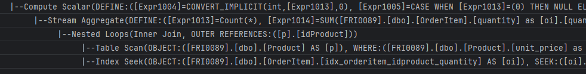
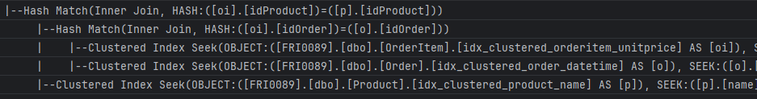
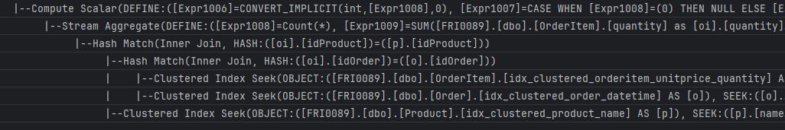

# Join Optimization

- [1. MS SQL Server](#1-ms-sql-server)
  - [1.1. Query 1](#11-query-1)
    - [1.1.1. Index](#111-index)
  - [1.2. Query 2](#12-query-2)
    - [1.2.1. Index](#121-index)
  - [1.3. Query 3](#13-query-3)
    - [1.3.1. Analysis of Subqueries](#131-analysis-of-subqueries)
    - [1.3.2. Index](#132-index)
  - [1.4. Query 4](#14-query-4)
    - [1.4.1. Index](#141-index)
- [2. Oracle](#2-oracle)
  - [2.1. Query 1](#21-query-1)
    - [2.1.1. Index](#211-index)
  - [2.2. Query 2](#22-query-2)
    - [2.2.1. Index](#221-index)
  - [2.3. Query 3](#23-query-3)
    - [2.3.1. Analysis of Subqueries](#231-analysis-of-subqueries)
    - [2.3.2. Index](#232-index)
  - [2.4. Query 4](#24-query-4)
    - [2.4.1. Clustered Tables](#241-clustered-tables)

## 1. MS SQL Server

### 1.1. Query 1

```sql
SELECT *
FROM
    Product p
JOIN
    OrderItem oi ON p.idProduct=oi.idProduct
WHERE
    p.unit_price BETWEEN 20000000 AND 20002000
option (maxdop 1);
```

- 205 rows
- 'OrderItem'. Scan count 1, logical reads 18797 **($\Rightarrow$ main bottleneck)**
- 'Product'. Scan count 1, logical reads 525
- Hash Match
  - Table Scan (Product)
  - Table Scan (OrderItem)

| execution\_count | avg\_cpu\_time\_us | avg\_cpu\_time\_ms | dbid |
| :--------------- | :----------------- | :----------------- | :--- |
| 4                | 769355             | 769                | 277  |

#### 1.1.1. Index

```sql
CREATE INDEX idx_orderitem_idproduct
ON OrderItem(idProduct);
```

| StmtText                                                                                                                                                                                                                                                                       |
| :----------------------------------------------------------------------------------------------------------------------------------------------------------------------------------------------------------------------------------------------------------------------------- |
| \|--Nested Loops\(Inner Join, OUTER REFERENCES:\(\[Bmk1002\], \[Expr1006\]\) WITH UNORDERED PREFETCH\)                                                                                                                                                                         |
| \|--Nested Loops\(Inner Join, OUTER REFERENCES:\(\[p\].\[idProduct\]\)\)                                                                                                                                                                                                       |
| \|    \|--Table Scan\(OBJECT:\(\[FRI0089\].\[dbo\].\[Product\] AS \[p\]\), WHERE:\(\[FRI0089\].\[dbo\].\[Product\].\[unit\_price\] as \[p\].\[unit\_price\]&gt;=\(20000000\) AND \[FRI0089\].\[dbo\].\[Product\].\[unit\_price\] as \[p\].\[unit\_price\]&lt;=\(20002000\)\)\) |
| \|    \|--Index Seek\(OBJECT:\(\[FRI0089\].\[dbo\].\[OrderItem\].\[idx\_orderitem\_idproduct\] AS \[oi\]\), SEEK:\(\[oi\].\[idProduct\]=\[FRI0089\].\[dbo\].\[Product\].\[idProduct\] as \[p\].\[idProduct\]\) ORDERED FORWARD\)                                               |
| \|--RID Lookup\(OBJECT:\(\[FRI0089\].\[dbo\].\[OrderItem\] AS \[oi\]\), SEEK:\(\[Bmk1002\]=\[Bmk1002\]\) LOOKUP ORDERED FORWARD\)                                                                                                                                              |

- Table 'OrderItem'. Scan count 4, logical reads 218
- Table 'Product'. Scan count 1, logical reads 525

| execution\_count | avg\_cpu\_time\_us | avg\_cpu\_time\_ms |
| :--------------- | :----------------- | :----------------- |
| 2                | 7362               | 7                  |

### 1.2. Query 2

```sql
SELECT
    COUNT(oi.idProduct) AS number_of_order_items,
    SUM(oi.quantity) AS total_items_sold
FROM
    Product p
JOIN
    OrderItem oi ON p.idProduct = oi.idProduct
WHERE
    p.unit_price BETWEEN 20000000 AND 20002000
option (maxdop 1);
```

| number\_of\_order\_items | total\_items\_sold |
| :----------------------- | :----------------- |
| 205                      | 996                |

| StmtText                                                                                                                                                                                                                                                                 |
| :----------------------------------------------------------------------------------------------------------------------------------------------------------------------------------------------------------------------------------------------------------------------- |
| \|--Compute Scalar\(DEFINE:\(\[Expr1004\]=CONVERT\_IMPLICIT\(int,\[Expr1013\],0\), \[Expr1005\]=CASE WHEN \[Expr1013\]=\(0\) THEN NULL ELSE \[Expr1014\] END\)\)                                                                                                         |
| \|--Stream Aggregate\(DEFINE:\(\[Expr1013\]=Count\(\*\), \[Expr1014\]=SUM\(\[FRI0089\].\[dbo\].\[OrderItem\].\[quantity\] as \[oi\].\[quantity\]\)\)\)                                                                                                                   |
| \|--Hash Match\(Inner Join, HASH:\(\[p\].\[idProduct\]\)=\(\[oi\].\[idProduct\]\)\)                                                                                                                                                                                      |
| \|--Table Scan\(OBJECT:\(\[FRI0089\].\[dbo\].\[Product\] AS \[p\]\), WHERE:\(\[FRI0089\].\[dbo\].\[Product\].\[unit\_price\] as \[p\].\[unit\_price\]&gt;=\(20000000\) AND \[FRI0089\].\[dbo\].\[Product\].\[unit\_price\] as \[p\].\[unit\_price\]&lt;=\(20002000\)\)\) |
| \|--Table Scan\(OBJECT:\(\[FRI0089\].\[dbo\].\[OrderItem\] AS \[oi\]\)\)                                                                                                                                                                                                 |

- Table 'OrderItem'. Scan count 1, logical reads 18797.
- Table 'Product'. Scan count 1, logical reads 525.

| execution\_count | avg\_cpu\_time\_us | avg\_cpu\_time\_ms |
| :--------------- | :----------------- | :----------------- |
| 2                | 782993             | 782                |

#### 1.2.1. Index

- Do indexu pro `OrderItem` přidám `quantity`, aby se neprováděl `RID Lookup`.

```sql
CREATE INDEX idx_orderitem_idproduct_quantity 
ON OrderItem(idProduct, quantity);
```



- Table 'OrderItem'. Scan count 4, logical reads 13
- Table Table 'Product'. Scan count 1, logical reads 591

| execution\_count | avg\_cpu\_time\_us | avg\_cpu\_time\_ms |
| :--- | :--- | :--- |
| 3 | 6334 | 6 |

### 1.3. Query 3

```sql
SELECT
    oi.*,
    p.*,
    o.*
FROM
    OrderItem oi
JOIN
    Product p ON oi.idProduct = p.idProduct
JOIN
    "Order" o ON oi.idOrder = o.idOrder
WHERE
    p.name LIKE 'Auto%'
    AND o.order_datetime BETWEEN '2022-01-01' AND '2022-12-31'
    AND oi.unit_price BETWEEN 1000000 AND 1010000
option (maxdop 1);
```

- 66 rows

| StmtText                                                                                                                                                                                                                                                                                                                                     |
| :------------------------------------------------------------------------------------------------------------------------------------------------------------------------------------------------------------------------------------------------------------------------------------------------------------------------------------------- |
| \|--Nested Loops\(Inner Join, OUTER REFERENCES:\(\[Bmk1004\], \[Expr1011\]\) WITH UNORDERED PREFETCH\)                                                                                                                                                                                                                                       |
| \|--Nested Loops\(Inner Join, OUTER REFERENCES:\(\[oi\].\[idOrder\], \[Expr1010\]\) WITH UNORDERED PREFETCH\)                                                                                                                                                                                                                                |
| \|    \|--Merge Join\(Inner Join, MERGE:\(\[p\].\[idProduct\]\)=\(\[oi\].\[idProduct\]\), RESIDUAL:\(\[FRI0089\].\[dbo\].\[Product\].\[idProduct\] as \[p\].\[idProduct\]=\[FRI0089\].\[dbo\].\[OrderItem\].\[idProduct\] as \[oi\].\[idProduct\]\)\)                                                                                        |
| \|    \|    \|--Sort\(ORDER BY:\(\[p\].\[idProduct\] ASC\)\)                                                                                                                                                                                                                                                                                 |
| \|    \|    \|    \|--Table Scan\(OBJECT:\(\[FRI0089\].\[dbo\].\[Product\] AS \[p\]\), WHERE:\(\[FRI0089\].\[dbo\].\[Product\].\[name\] as \[p\].\[name\] like 'Auto%'\)\)                                                                                                                                                                   |
| \|    \|    \|--Sort\(ORDER BY:\(\[oi\].\[idProduct\] ASC\)\)                                                                                                                                                                                                                                                                                |
| \|    \|         \|--Table Scan\(OBJECT:\(\[FRI0089\].\[dbo\].\[OrderItem\] AS \[oi\]\), WHERE:\(\[FRI0089\].\[dbo\].\[OrderItem\].\[unit\_price\] as \[oi\].\[unit\_price\]&gt;=\(1000000\) AND \[FRI0089\].\[dbo\].\[OrderItem\].\[unit\_price\] as \[oi\].\[unit\_price\]&lt;=\(1010000\)\)\)                                             |
| \|    \|--Index Seek\(OBJECT:\(\[FRI0089\].\[dbo\].\[Order\].\[PK\_\_Order\_\_C8AAF6FEE0BB95E1\] AS \[o\]\), SEEK:\(\[o\].\[idOrder\]=\[FRI0089\].\[dbo\].\[OrderItem\].\[idOrder\] as \[oi\].\[idOrder\]\) ORDERED FORWARD\)                                                                                                                |
| \|--RID Lookup\(OBJECT:\(\[FRI0089\].\[dbo\].\[Order\] AS \[o\]\), SEEK:\(\[Bmk1004\]=\[Bmk1004\]\),  WHERE:\(\[FRI0089\].\[dbo\].\[Order\].\[order\_datetime\] as \[o\].\[order\_datetime\]&gt;='2022-01-01' AND \[FRI0089\].\[dbo\].\[Order\].\[order\_datetime\] as \[o\].\[order\_datetime\]&lt;='2022-12-31'\) LOOKUP ORDERED FORWARD\) |

- Table 'Order'. Scan count 0, logical reads 4636
- Table 'OrderItem'. Scan count 1, logical reads 18797
- Table 'Product'. Scan count 1, logical reads 525
- CPU time = 328 ms,  elapsed time = 337 ms

#### 1.3.1. Analysis of Subqueries

```sql
SELECT COUNT(*) AS product_count,
       ROUND(100*CAST(COUNT(*) AS FLOAT) / (SELECT COUNT(*) FROM Product),2)
           AS product_count_selectivity
FROM Product
WHERE name LIKE 'Auto%';


SELECT COUNT(*) AS order_count,
       ROUND(100*CAST(COUNT(*) AS FLOAT) / (SELECT COUNT(*) FROM "Order"),2)
           AS order_count_selectivity
FROM "Order"
WHERE order_datetime BETWEEN '2022-01-01' AND '2022-12-31';


SELECT COUNT(*) AS orderitem_count,
       ROUND(100*CAST(COUNT(*) AS FLOAT) / (SELECT COUNT(*) FROM OrderItem), 2)
           AS orderitem_count_selectivity
FROM OrderItem
WHERE unit_price BETWEEN 1000000 AND 1010000;
```

| product\_count | product\_count\_selectivity |
| :------------- | :-------------------------- |
| 3208           | 3.21                        |

| order\_count | order\_count\_selectivity |
| :----------- | :------------------------ |
| 24301        | 4.86                      |

| orderitem\_count | orderitem\_count\_selectivity |
| :--------------- | :---------------------------- |
| 3275             | 0.07                          |

- Jenom `OrderItem` má vysokou selektivitu.

#### 1.3.2. Index

```sql
CREATE CLUSTERED INDEX idx_clustered_orderitem_unitprice 
ON OrderItem(unit_price)

CREATE CLUSTERED INDEX idx_clustered_order_datetime 
ON [Order](order_datetime)

CREATE CLUSTERED INDEX idx_clustered_product_name 
ON Product(name)
```



- CPU time = 15 ms,  elapsed time = 11 ms.
- Table 'Product'. Scan count 1, logical reads 21.
- Table 'Order'. Scan count 1, logical reads 103.
- Table 'OrderItem'. Scan count 1, logical reads 18.

### 1.4. Query 4

```sql
SELECT
    COUNT(oi.idProduct) AS NumberOfOrderItems,
    SUM(oi.quantity) AS TotalNumberOfItemsSold
FROM
    OrderItem oi
JOIN
    Product p ON oi.idProduct = p.idProduct
JOIN
    "Order" o ON oi.idOrder = o.idOrder
WHERE
    p.name LIKE 'Auto%'
    AND o.order_datetime BETWEEN '2022-01-01' AND '2022-12-31'
    AND oi.unit_price BETWEEN 1000000 AND 1010000
option (maxdop 1);
```

| NumberOfOrderItems | TotalNumberOfItemsSold |
| :----------------- | :--------------------- |
| 66                 | 324                    |

| StmtText                                                                                                                                                                                                                                                                                                                                     |
| :------------------------------------------------------------------------------------------------------------------------------------------------------------------------------------------------------------------------------------------------------------------------------------------------------------------------------------------- |
| \|--Compute Scalar\(DEFINE:\(\[Expr1006\]=CONVERT\_IMPLICIT\(int,\[Expr1020\],0\), \[Expr1007\]=CASE WHEN \[Expr1020\]=\(0\) THEN NULL ELSE \[Expr1021\] END\)\)                                                                                                                                                                             |
| \|--Stream Aggregate\(DEFINE:\(\[Expr1020\]=Count\(\*\), \[Expr1021\]=SUM\(\[FRI0089\].\[dbo\].\[OrderItem\].\[quantity\] as \[oi\].\[quantity\]\)\)\)                                                                                                                                                                                       |
| \|--Nested Loops\(Inner Join, OUTER REFERENCES:\(\[Bmk1004\], \[Expr1019\]\) WITH UNORDERED PREFETCH\)                                                                                                                                                                                                                                       |
| \|--Nested Loops\(Inner Join, OUTER REFERENCES:\(\[oi\].\[idOrder\], \[Expr1018\]\) WITH UNORDERED PREFETCH\)                                                                                                                                                                                                                                |
| \|    \|--Hash Match\(Inner Join, HASH:\(\[p\].\[idProduct\]\)=\(\[oi\].\[idProduct\]\)\)                                                                                                                                                                                                                                                    |
| \|    \|    \|--Table Scan\(OBJECT:\(\[FRI0089\].\[dbo\].\[Product\] AS \[p\]\), WHERE:\(\[FRI0089\].\[dbo\].\[Product\].\[name\] as \[p\].\[name\] like 'Auto%'\)\)                                                                                                                                                                         |
| \|    \|    \|--Table Scan\(OBJECT:\(\[FRI0089\].\[dbo\].\[OrderItem\] AS \[oi\]\), WHERE:\(\[FRI0089\].\[dbo\].\[OrderItem\].\[unit\_price\] as \[oi\].\[unit\_price\]&gt;=\(1000000\) AND \[FRI0089\].\[dbo\].\[OrderItem\].\[unit\_price\] as \[oi\].\[unit\_price\]&lt;=\(1010000\)\)\)                                                  |
| \|    \|--Index Seek\(OBJECT:\(\[FRI0089\].\[dbo\].\[Order\].\[PK\_\_Order\_\_C8AAF6FEE0BB95E1\] AS \[o\]\), SEEK:\(\[o\].\[idOrder\]=\[FRI0089\].\[dbo\].\[OrderItem\].\[idOrder\] as \[oi\].\[idOrder\]\) ORDERED FORWARD\)                                                                                                                |
| \|--RID Lookup\(OBJECT:\(\[FRI0089\].\[dbo\].\[Order\] AS \[o\]\), SEEK:\(\[Bmk1004\]=\[Bmk1004\]\),  WHERE:\(\[FRI0089\].\[dbo\].\[Order\].\[order\_datetime\] as \[o\].\[order\_datetime\]&gt;='2022-01-01' AND \[FRI0089\].\[dbo\].\[Order\].\[order\_datetime\] as \[o\].\[order\_datetime\]&lt;='2022-12-31'\) LOOKUP ORDERED FORWARD\) |

- Table 'Order'. Scan count 0, logical reads 4636.
- Table 'OrderItem'. Scan count 1, logical reads 18797.
- Table 'Product'. Scan count 1, logical reads 525.
- CPU time = 328 ms,  elapsed time = 339 ms.

#### 1.4.1. Index

```sql
CREATE CLUSTERED INDEX idx_clustered_orderitem_unitprice ON OrderItem(unit_price, quantity)
CREATE CLUSTERED INDEX idx_clustered_product_name ON Product(name)
CREATE CLUSTERED INDEX idx_clustered_order_datetime ON [Order](order_datetime)
```

| execution\_count | avg\_cpu\_time\_us | avg\_cpu\_time\_ms |
| :--------------- | :----------------- | :----------------- |
| 2                | 7884               | 7                  |

- Table 'Product'. Scan count 1, logical reads 21
- Table 'Order'. Scan count 1, logical reads 103
- Table 'OrderItem'. Scan count 1, logical reads 16



## 2. Oracle

### 2.1. Query 1

```sql
SELECT *
FROM
    Product p
JOIN
    OrderItem oi ON p.idProduct=oi.idProduct
WHERE
    p.unit_price BETWEEN 20000000 AND 20002000;
```

```txt
--------------------------------------------------------------------------------
| Id  | Operation          | Name      | Rows  | Bytes | Cost (%CPU)| Time     |
--------------------------------------------------------------------------------
|   0 | SELECT STATEMENT   |           |    69 |  3450 |  4589   (3)| 00:00:01 |
|*  1 |  HASH JOIN         |           |    69 |  3450 |  4589   (3)| 00:00:01 |
|*  2 |   TABLE ACCESS FULL| PRODUCT   |     1 |    32 |   172   (2)| 00:00:01 |
|   3 |   TABLE ACCESS FULL| ORDERITEM |  5000K|    85M|  4378   (3)| 00:00:01 |
--------------------------------------------------------------------------------

executions:  6
buffer gets:  18753.3333333333333333333333333333333333
cpu_time_ms:  334.303166666666666666666666666666666667
elapsed_time_ms:  583.6615
rows_processed:  45
```

#### 2.1.1. Index

```sql
CREATE INDEX idx_orderitem_idproduct ON OrderItem(idProduct);
```

```txt
--------------------------------------------------------------------------------------------------------
| Id  | Operation                    | Name                    | Rows  | Bytes | Cost (%CPU)| Time     |
--------------------------------------------------------------------------------------------------------
|   0 | SELECT STATEMENT             |                         |    69 |  3450 |   224   (1)| 00:00:01 |
|   1 |  NESTED LOOPS                |                         |    69 |  3450 |   224   (1)| 00:00:01 |
|   2 |   NESTED LOOPS               |                         |    69 |  3450 |   224   (1)| 00:00:01 |
|*  3 |    TABLE ACCESS FULL         | PRODUCT                 |     1 |    32 |   172   (2)| 00:00:01 |
|*  4 |    INDEX RANGE SCAN          | IDX_ORDERITEM_IDPRODUCT |    50 |       |     2   (0)| 00:00:01 |
|   5 |   TABLE ACCESS BY INDEX ROWID| ORDERITEM               |    50 |   900 |    52   (0)| 00:00:01 |


---- Query Processing Statistics ----
executions:  1
buffer gets:  601
cpu_time_ms:  0
elapsed_time_ms:  8.333
rows_processed:  45
```

### 2.2. Query 2

```sql
SELECT
    COUNT(oi.idProduct) AS number_of_order_items,
    SUM(oi.quantity) AS total_items_sold
FROM
    Product p
JOIN
    OrderItem oi ON p.idProduct = oi.idProduct
WHERE
    p.unit_price BETWEEN 20000000 AND 20002000;
```

| number\_of\_order\_items | total\_items\_sold |
| :----------------------- | :----------------- |
| 45                       | 254                |

```txt
---------------------------------------------------------------------------------
| Id  | Operation           | Name      | Rows  | Bytes | Cost (%CPU)| Time     |
---------------------------------------------------------------------------------
|   0 | SELECT STATEMENT    |           |     1 |    19 |  4589   (3)| 00:00:01 |
|   1 |  SORT AGGREGATE     |           |     1 |    19 |            |          |
|*  2 |   HASH JOIN         |           |    69 |  1311 |  4589   (3)| 00:00:01 |
|*  3 |    TABLE ACCESS FULL| PRODUCT   |     1 |    11 |   172   (2)| 00:00:01 |
|   4 |    TABLE ACCESS FULL| ORDERITEM |  5000K|    38M|  4378   (3)| 00:00:01 |
---------------------------------------------------------------------------------

executions:  4
buffer gets:  16398
cpu_time_ms:  249.868
elapsed_time_ms:  251.21225
rows_processed:  1
```

#### 2.2.1. Index

- Do indexu pro `OrderItem` přidám `quantity`, aby se neprováděl `Table access by index ROWID`.

```sql
CREATE INDEX idx_orderitem_idproduct_quantity ON OrderItem(idProduct, quantity);
CREATE INDEX idx_product_id_up ON Product(idProduct, unit_price);
```

```txt
-----------------------------------------------------------------------------------------------------------
| Id  | Operation              | Name                             | Rows  | Bytes | Cost (%CPU)| Time     |
-----------------------------------------------------------------------------------------------------------
|   0 | SELECT STATEMENT       |                                  |     1 |    19 |    84   (2)| 00:00:01 |
|   1 |  SORT AGGREGATE        |                                  |     1 |    19 |            |          |
|   2 |   NESTED LOOPS         |                                  |    69 |  1311 |    84   (2)| 00:00:01 |
|*  3 |    INDEX FAST FULL SCAN| IDX_PRODUCT_ID_UP                |     1 |    11 |    82   (2)| 00:00:01 |
|*  4 |    INDEX RANGE SCAN    | IDX_ORDERITEM_IDPRODUCT_QUANTITY |    50 |   400 |     2   (0)| 00:00:01 |
-----------------------------------------------------------------------------------------------------------

---- Query Processing Statistics ----
executions:  1
buffer gets:  303
cpu_time_ms:  0
elapsed_time_ms:  38.075
rows_processed:  1
```

### 2.3. Query 3

```sql
SELECT
    oi.*,
    p.*,
    o.*
FROM
    OrderItem oi
JOIN
    Product p ON oi.idProduct = p.idProduct
JOIN
    "Order" o ON oi.idOrder = o.idOrder
WHERE
    p.name LIKE 'Auto%'
    AND o.order_datetime BETWEEN 
        TO_DATE('2022-01-01', 'YYYY-MM-DD') AND 
        TO_DATE('2022-12-31', 'YYYY-MM-DD')
    AND oi.unit_price BETWEEN 1000000 AND 1010000;
```

```txt
---------------------------------------------------------------------------------
| Id  | Operation           | Name      | Rows  | Bytes | Cost (%CPU)| Time     |
---------------------------------------------------------------------------------
|   0 | SELECT STATEMENT    |           |  1772 |   124K|  5120   (3)| 00:00:01 |
|*  1 |  HASH JOIN          |           |  1772 |   124K|  5120   (3)| 00:00:01 |
|*  2 |   HASH JOIN         |           |  1772 | 88600 |  4565   (3)| 00:00:01 |
|*  3 |    TABLE ACCESS FULL| ORDERITEM |  2309 | 41562 |  4393   (3)| 00:00:01 |
|*  4 |    TABLE ACCESS FULL| PRODUCT   |  1753 | 56096 |   172   (2)| 00:00:01 |
|*  5 |   TABLE ACCESS FULL | Order     | 22691 |   487K|   555   (2)| 00:00:01 |

executions:  3
buffer gets:  18949
cpu_time_ms:  192.44
elapsed_time_ms:  328.787
rows_processed:  26
```

#### 2.3.1. Analysis of Subqueries

| product\_count | product\_count\_selectivity |
| :------------- | :-------------------------- |
| 1645           | 1.6                        |

| order\_count | order\_count\_selectivity |
| :----------- | :------------------------ |
| 24127        | 4.82                      |

| orderitem\_count | orderitem\_count\_selectivity |
| :--------------- | :---------------------------- |
| 2814             | 0.06                          |

#### 2.3.2. Index

- Vytvoření shlukovaných tabulek `OrderItemClustered` a `OrderClustered`.

```sql
CREATE INDEX idx_clustered_orderitem_ui ON OrderItemClustered(unit_price);

SELECT
    oi.*,
    p.*,
    o.*
FROM
    OrderItemClustered oi
JOIN
    Product p ON oi.idProduct = p.idProduct
JOIN
    OrderClustered o ON oi.idOrder = o.idOrder
WHERE
    p.name LIKE 'Auto%'
    AND o.order_datetime BETWEEN 
        TO_DATE('2022-01-01', 'YYYY-MM-DD') AND 
        TO_DATE('2022-12-31', 'YYYY-MM-DD')
    AND oi.unit_price BETWEEN 1000000 AND 1010000;
```

```txt
--------------------------------------------------------------------------------------------------
| Id  | Operation           | Name                       | Rows  | Bytes | Cost (%CPU)| Time     |
--------------------------------------------------------------------------------------------------
|   0 | SELECT STATEMENT    |                            |  1786 |   242K|  3521   (1)| 00:00:01 |
|   1 |  NESTED LOOPS       |                            |  1786 |   242K|  3521   (1)| 00:00:01 |
|*  2 |   HASH JOIN         |                            |  1786 |   146K|  3521   (1)| 00:00:01 |
|*  3 |    TABLE ACCESS FULL| PRODUCT                    |  1753 | 56096 |   172   (2)| 00:00:01 |
|*  4 |    INDEX UNIQUE SCAN| SYS_IOT_TOP_651063         |  3800 |   192K|  3348   (1)| 00:00:01 |
|*  5 |     INDEX RANGE SCAN| IDX_CLUSTERED_ORDERITEM_UI |  3800 |       |    15   (0)| 00:00:01 |

PLAN_TABLE_OUTPUT
--------------------------------------------------------------------------------------------------
|*  6 |   INDEX UNIQUE SCAN | SYS_IOT_TOP_651049         |     1 |    55 |     0   (0)| 00:00:01 |
--------------------------------------------------------------------------------------------------
 
---- Query Processing Statistics ----
executions:  2
buffer gets:  3351
cpu_time_ms:  14.948
elapsed_time_ms:  20.1715
rows_processed:  1
```

Výsledky jsou špatně porovnatelné, protože shlukované tabulky obsahují jiné data.

Kdybych použil shlukovanou tabulku pro `Product`, tak se zdvojnásobí IO cost (kvůli náhodným hodnotám v databázi a rozdílné velikosti výsledku dotazu) a sníží CPU time. Viz:

```txt
--------------------------------------------------------------------------------------------------
| Id  | Operation           | Name                       | Rows  | Bytes | Cost (%CPU)| Time     |
--------------------------------------------------------------------------------------------------
|   0 | SELECT STATEMENT    |                            |  2310 |  2637K|  3349   (1)| 00:00:01 |
|   1 |  NESTED LOOPS       |                            |  2310 |  2637K|  3349   (1)| 00:00:01 |
|   2 |   NESTED LOOPS      |                            |  2310 |  2513K|  3349   (1)| 00:00:01 |
|*  3 |    INDEX UNIQUE SCAN| SYS_IOT_TOP_651063         |  3800 |   192K|  3348   (1)| 00:00:01 |
|*  4 |     INDEX RANGE SCAN| IDX_CLUSTERED_ORDERITEM_UI |  3800 |       |    15   (0)| 00:00:01 |
|*  5 |    INDEX UNIQUE SCAN| SYS_IOT_TOP_651047         |     1 |  1062 |     0   (0)| 00:00:01 |

PLAN_TABLE_OUTPUT
--------------------------------------------------------------------------------------------------
|*  6 |   INDEX UNIQUE SCAN | SYS_IOT_TOP_651049         |     1 |    55 |     0   (0)| 00:00:01 |
--------------------------------------------------------------------------------------------------

---- Query Processing Statistics ----
executions:  1
buffer gets:  6668
cpu_time_ms:  11.404
elapsed_time_ms:  21.046
rows_processed:  32
```

### 2.4. Query 4

```sql
SELECT
    COUNT(oi.idProduct) AS NumberOfOrderItems,
    SUM(oi.quantity) AS TotalNumberOfItemsSold
FROM
    OrderItem oi
JOIN
    Product p ON oi.idProduct = p.idProduct
JOIN
    "Order" o ON oi.idOrder = o.idOrder
WHERE
    p.name LIKE 'Auto%'
    AND o.order_datetime BETWEEN 
        TO_DATE('2022-01-01', 'YYYY-MM-DD') AND 
        TO_DATE('2022-12-31', 'YYYY-MM-DD')
    AND oi.unit_price BETWEEN 1000000 AND 1010000;
```

| number\_of\_order\_items | total\_items\_sold |
| :----------------------- | :----------------- |
| 26                       | 145                |

```txt
----------------------------------------------------------------------------------
| Id  | Operation            | Name      | Rows  | Bytes | Cost (%CPU)| Time     |
----------------------------------------------------------------------------------
|   0 | SELECT STATEMENT     |           |     1 |    50 |  5120   (3)| 00:00:01 |
|   1 |  SORT AGGREGATE      |           |     1 |    50 |            |          |
|*  2 |   HASH JOIN          |           |  1772 | 88600 |  5120   (3)| 00:00:01 |
|*  3 |    HASH JOIN         |           |  1772 | 65564 |  4565   (3)| 00:00:01 |
|*  4 |     TABLE ACCESS FULL| PRODUCT   |  1753 | 33307 |   172   (2)| 00:00:01 |
|*  5 |     TABLE ACCESS FULL| ORDERITEM |  2309 | 41562 |  4393   (3)| 00:00:01 |

PLAN_TABLE_OUTPUT
----------------------------------------------------------------------------------
|*  6 |    TABLE ACCESS FULL | Order     | 22691 |   288K|   555   (2)| 00:00:01 |
----------------------------------------------------------------------------------

---- Query Processing Statistics ----
executions:  1
buffer gets:  18352
cpu_time_ms:  170.298
elapsed_time_ms:  177.22
rows_processed:  1
```

#### 2.4.1. Clustered Tables

- Shlukované tabulky `OrderItemClustered` a `OrderClustered` a `ProductClustered`.

```sql
CREATE INDEX idx_clustered_orderitem_ui ON OrderItemClustered(unit_price);
```

```txt
---------------------------------------------------------------------------------------------------
| Id  | Operation            | Name                       | Rows  | Bytes | Cost (%CPU)| Time     |
---------------------------------------------------------------------------------------------------
|   0 | SELECT STATEMENT     |                            |     1 |   104 |  3349   (1)| 00:00:01 |
|   1 |  SORT AGGREGATE      |                            |     1 |   104 |            |          |
|   2 |   NESTED LOOPS       |                            |  2310 |   234K|  3349   (1)| 00:00:01 |
|   3 |    NESTED LOOPS      |                            |  2310 |   184K|  3349   (1)| 00:00:01 |
|*  4 |     INDEX UNIQUE SCAN| SYS_IOT_TOP_651063         |  3800 |   192K|  3348   (1)| 00:00:01 |
|*  5 |      INDEX RANGE SCAN| IDX_CLUSTERED_ORDERITEM_UI |  3800 |       |    15   (0)| 00:00:01 |

PLAN_TABLE_OUTPUT
---------------------------------------------------------------------------------------------------
|*  6 |     INDEX UNIQUE SCAN| SYS_IOT_TOP_651047         |     1 |    30 |     0   (0)| 00:00:01 |
|*  7 |    INDEX UNIQUE SCAN | SYS_IOT_TOP_651049         |     1 |    22 |     0   (0)| 00:00:01 |
---------------------------------------------------------------------------------------------------

---- Query Processing Statistics ----
executions:  1
buffer gets:  6684
cpu_time_ms:  11.655
elapsed_time_ms:  25.267
rows_processed:  1
```
