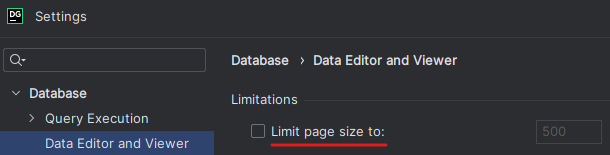
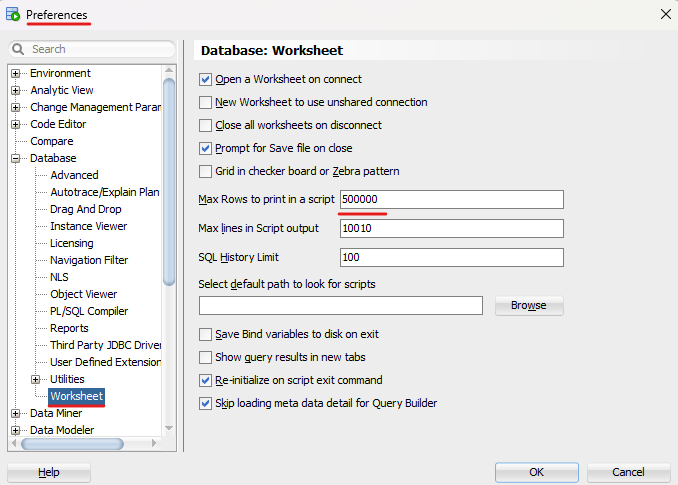

# Pagination

- [1. MS SQL Server](#1-ms-sql-server)
  - [1.1. Stránkování](#11-stránkování)
  - [1.2. Komprimace](#12-komprimace)
- [2. Oracle](#2-oracle)
  - [2.1. Stránkování](#21-stránkování)
  - [2.2. Sloupcové uložení tabulky](#22-sloupcové-uložení-tabulky)
    - [2.2.1. Sloupcová tabulka](#221-sloupcová-tabulka)
    - [2.2.2. Halda](#222-halda)

## 1. MS SQL Server

### 1.1. Stránkování



```sql
-- 300 000 records
SELECT COUNT(*) FROM CustomerHeap;

-- All pages
SELECT * FROM CustomerHeap;

-- 1st page
SELECT * FROM CustomerHeap
ORDER BY (SELECT NULL)
OFFSET 0 ROWS FETCH NEXT 100 ROWS ONLY;

-- last page
SELECT * FROM CustomerHeap
ORDER BY (SELECT NULL)
OFFSET 300000-100 ROWS FETCH NEXT 100 ROWS ONLY;
```

| | All | 1st page | last page |
|--|--|--|--|
| **Rows** | 300 000 | 100 | 100 |
| **Logical reads** | 1750 | 1 | 1750 |
| **Fetching** [ms]| 8411 (9699) | 40 | 65 |
| **CPU time** [ms]| 93 | 0 | 79 |

### 1.2. Komprimace

```sql
CREATE CLUSTERED INDEX idx_clustered_orderitem_idorder_idproduct
ON OrderItem (idOrder, idProduct);

EXEC PrintPagesClusterTable 'OrderItem';

ALTER TABLE OrderItem REBUILD PARTITION = ALL
WITH (DATA_COMPRESSION = none); -- row, page

ALTER INDEX idx_clustered_orderitem_idorder_idproduct ON OrderItem
    REBUILD PARTITION = ALL
WITH (DATA_COMPRESSION = none); -- row, page

-- 288 records
SELECT * FROM OrderItem
WHERE idOrder BETWEEN 1337 AND 1367
OPTION (MAXDOP 1);
```

|| None | Row | Page |
|:--|--:|--:|--:|
|Total Pages| 18 313 | 10 489 | 9513 |
| Logical reads| 5 | 4 | 3 |
| CPU time | 0 | 0 | 0 |

```sql
DROP INDEX idx_clustered_orderitem_idorder_idproduct on OrderItem;

EXEC PrintPages 'OrderItem'; 

-- 97 records
SELECT * FROM OrderItem
WHERE unit_price BETWEEN 420 AND 426
OPTION (MAXDOP 1);

ALTER TABLE OrderItem REBUILD PARTITION = ALL
WITH (DATA_COMPRESSION = none); -- row, page
```

```text
  |--Table Scan(OBJECT:([FRI0089].[dbo].[OrderItem]), WHERE:([FRI0089].[dbo].[OrderItem].[unit_price]>=(420) AND [FRI0089].[dbo].[OrderItem].[unit_price]<=(426)))
```

|| None | Row | Page |
|:--|--:|--:|--:|
| Total Pages| 17 993 | 9 577 | 8 601 |
| Logical reads| 17940 | 9 447 | 8 515 |
| CPU time [ms] | 328 | 625 | 828 |

## 2. Oracle

### 2.1. Stránkování



```sql
-- 300 000 records
SELECT COUNT(*) FROM CustomerHeap

-- All pages
--------------------------------------------------------------------------------
explain plan for
SELECT * FROM CustomerHeap;

select * from table(dbms_xplan.display);

set feedback on SQL_ID;
SELECT * FROM CustomerHeap;
set feedback off SQL_ID;

exec PrintQueryStat('00c8pptt3tayy', 2863259038);

-- 1st page
--------------------------------------------------------------------------------
explain plan for
SELECT * 
FROM CustomerHeap
OFFSET 0 ROWS FETCH NEXT 100 ROWS ONLY;

select * from table(dbms_xplan.display);

set feedback on SQL_ID;
SELECT * FROM CustomerHeap
OFFSET 0 ROWS FETCH NEXT 100 ROWS ONLY;
set feedback off SQL_ID;

exec PrintQueryStat('7cpr59pd5k7pu', 1214089703);

-- last page
--------------------------------------------------------------------------------
explain plan for
SELECT * FROM CustomerHeap
OFFSET 300000-100 ROWS FETCH NEXT 100 ROWS ONLY;

select * from table(dbms_xplan.display);

set feedback on SQL_ID;
SELECT * FROM CustomerHeap
OFFSET 300000-100 ROWS FETCH NEXT 100 ROWS ONLY;
set feedback off SQL_ID;

exec PrintQueryStat('df7mx3nyumgm3', 1214089703);
```

```text
Oracle developer: Only 5 000 rows currently supported in a script results
```

| | All | 1st page | last page |
|--|--|--|--|
| **Rows** | 5000 | 100  | 100  |
| **Buffer gets** | 44 | 4  | 1957  |
| **Elapsed time** [ms]|  100 | 2.76  | 436.3  |
| **CPU time** [ms]| 15 | 0  | 121.17   |

### 2.2. Sloupcové uložení tabulky

#### 2.2.1. Sloupcová tabulka

```sql
SELECT segment_name, blocks, bytes/1024/1024 AS size_mb
FROM user_segments
WHERE segment_name IN ('ORDERITEM');
```

```sql
-- Tabulka <table> bude převedena na sloupcovou tabulku
-- okamžitě po startu databáze.
ALTER TABLE OrderItem INMEMORY PRIORITY CRITICAL;

-- Tabulka <table> bude řádkovou tabulkou - haldou.
ALTER TABLE OrderItem NO INMEMORY;

-- implicit comression
ALTER TABLE OrderItem INMEMORY MEMCOMPRESS FOR query low;

-- highest compression
ALTER TABLE OrderItem INMEMORY MEMCOMPRESS FOR capacity high;
```

Po změně typu tabulky je nutné provést sekvenční průchod, aby se změny aplikovaly, např. `SELECT AVG(unit_price) FROM Product`.

```txt
-----------------------------------------------------------------------------------------
| Id  | Operation                   | Name      | Rows  | Bytes | Cost (%CPU)| Time     |
-----------------------------------------------------------------------------------------
|   0 | SELECT STATEMENT            |           |     1 |     6 |  4371   (2)| 00:00:01 |
|   1 |  SORT AGGREGATE             |           |     1 |     6 |            |          |
|   2 |   TABLE ACCESS INMEMORY FULL| ORDERITEM |  5000K|    28M|  4371   (2)| 00:00:01 |
-----------------------------------------------------------------------------------------
```

```txt
-----------------------------------------------------------------------------------------
| Id  | Operation                   | Name      | Rows  | Bytes | Cost (%CPU)| Time     |
-----------------------------------------------------------------------------------------
|   0 | SELECT STATEMENT            |           |    10 |    90 |  4761  (10)| 00:00:01 |
|   1 |  HASH GROUP BY              |           |    10 |    90 |  4761  (10)| 00:00:01 |
|   2 |   TABLE ACCESS INMEMORY FULL| ORDERITEM |  5000K|    42M|  4378   (3)| 00:00:01 |
-----------------------------------------------------------------------------------------
```

```sql
-- QUERY 1
SELECT AVG(unit_price) FROM OrderItem;

-- QUERY 2
SELECT AVG(unit_price), quantity 
FROM OrderItem 
GROUP BY quantity;
```

| | Query 1<br>Query low | Query 2<br>Query low | Query 1<br>Capacity high | Query 2<br>Capacity high |
|--|--|--|--|--|
| **Buffer gets** | 2 | 2  | 2  | 2 |
| **Elapsed time** [ms]|  114 | 195   | 224  | 320 |
| **CPU time** [ms]| 107 | 203  | 215   | 327 |

```sql
SELECT * 
FROM v$im_segments 
WHERE OWNER='FRI0089';
```

| | Query low | Capacity high |
|:--|--:|--:|
| In memory size | 100 597 760 | 2 031 616 |
| Bytes | 129 712 128 | 12 971 2128 |

#### 2.2.2. Halda

| | Query 1<br>Query low | Query 2<br>Query low | Query 1<br>Capacity high | Query 2<br>Capacity high |
|--|--|--|--|--|
| **Blocks** | 16 000 | 16 000 | 16 000 | 16 000 |
| **Buffer gets** | 15 845 | 15 845  | 15 845  | 15 845 |
| **Elapsed time** [ms]|  270 | 625   | 271  | 694 |
| **CPU time** [ms]| 256 | 629  | 278   | 699 |

<!-- 
| | Query 1<br>Query low | Query 2<br>Capacity high | Query 1<br>Query low | Query 2<br>Capacity high |
|--|--|--|--|--|
| **Blocks** | 16 000 | 16 000 | 16 000 | 16 000 |
| **Buffer gets** | 15 845 | 2  | 15845  | 2 |
| **Elapsed time** [ms]|  270 | 149   | 690  | 309 |
| **CPU time** [ms]| 263 | 176  | 699   | 318 | 
-->
