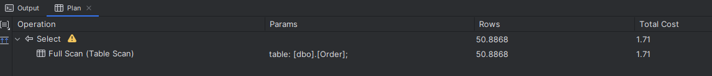
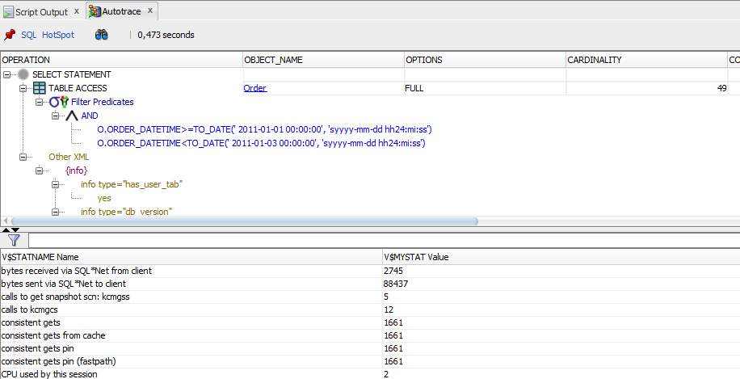
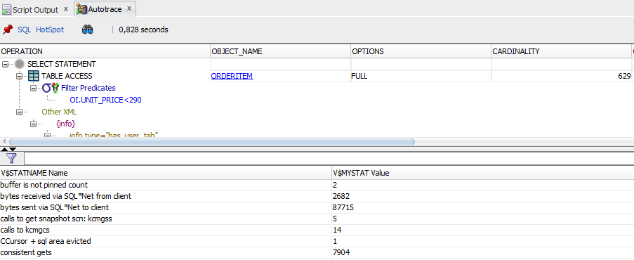

# QEP

- [1. QEP](#1-qep)
  - [1.1. MS SQL Server](#11-ms-sql-server)
    - [1.1.1. Tabulka Order](#111-tabulka-order)
    - [1.1.2. Tabulka OrderItem](#112-tabulka-orderitem)
  - [1.2. Oracle](#12-oracle)
    - [1.2.1. Order](#121-order)
    - [1.2.2. OrderItem](#122-orderitem)
- [2. Vypnutí paralelizace pro MS SQL server](#2-vypnutí-paralelizace-pro-ms-sql-server)
- [3. Fyzické mazání a sekvenční průchod v haldě](#3-fyzické-mazání-a-sekvenční-průchod-v-haldě)
  - [3.1. MS SQL Server](#31-ms-sql-server)
    - [3.1.1. After REBUILD](#311-after-rebuild)
    - [3.1.2. Porovnání](#312-porovnání)
  - [3.2. Oracle](#32-oracle)
    - [3.2.1. Po DELETE](#321-po-delete)
    - [3.2.2. Po SHRINK SPACE](#322-po-shrink-space)
    - [3.2.3. Porovnání](#323-porovnání)

## 1. QEP

### 1.1. MS SQL Server

#### 1.1.1. Tabulka Order

| TableName | RowCounts | TotalPages | TotalPages\_MB | UsedPages | UsedPages\_MB |
| :--- | :--- | :--- | :--- | :--- | :--- |
| Order | 501057 | 1569 | 12.3 | 1562 | 12.2 |

```sql
SELECT *
FROM [Order]
WHERE [Order].ORDER_DATETIME >= '2012-02-01' 
    AND [Order].ORDER_DATETIME < '2012-02-03';
```

```sql
SET SHOWPLAN_TEXT ON; 
```

| StmtText                                                                                                                                                                                                       |
| :------------------------------------------------------------------------------------------------------------------------------------------------------------------------------------------------------------- |
| \|--Table Scan\(OBJECT:\(\[FRI0089\].\[dbo\].\[Order\]\), WHERE:\(\[FRI0089\].\[dbo\].\[Order\].\[order\_datetime\]&gt;='2012-02-01' AND \[FRI0089\].\[dbo\].\[Order\].\[order\_datetime\]&lt;'2012-02-03'\)\) |

```sql
SET SHOWPLAN_ALL ON; 
```

| StmtText                                                                                                                                                                                                       | StmtId | NodeId | Parent | PhysicalOp | LogicalOp  | Argument                                                                                                                                                                                     | DefinedValues                                                                                                                                                                                                                          | EstimateRows | EstimateIO | EstimateCPU | AvgRowSize | TotalSubtreeCost | OutputList                                                                                                                                                                                                                             | Warnings | Type      | Parallel | EstimateExecutions |
| :------------------------------------------------------------------------------------------------------------------------------------------------------------------------------------------------------------- | :----- | :----- | :----- | :--------- | :--------- | :------------------------------------------------------------------------------------------------------------------------------------------------------------------------------------------- | :------------------------------------------------------------------------------------------------------------------------------------------------------------------------------------------------------------------------------------- | :----------- | :--------- | :---------- | :--------- | :--------------- | :------------------------------------------------------------------------------------------------------------------------------------------------------------------------------------------------------------------------------------- | :------- | :-------- | :------- | :----------------- |
| SELECT \*<br/>FROM \[Order\]<br/>WHERE \[Order\].ORDER\_DATETIME &gt;= '2012-02-01' AND \[Order\].ORDER\_DATETIME &lt; '2012-02-03'                                                                            | 1      | 1      | 0      | null       | null       | 1                                                                                                                                                                                            | null                                                                                                                                                                                                                                   | 50.886826    | null       | null        | null       | 1.7100003        | null                                                                                                                                                                                                                                   | null     | SELECT    | false    | null               |
| \|--Table Scan\(OBJECT:\(\[FRI0089\].\[dbo\].\[Order\]\), WHERE:\(\[FRI0089\].\[dbo\].\[Order\].\[order\_datetime\]&gt;='2012-02-01' AND \[FRI0089\].\[dbo\].\[Order\].\[order\_datetime\]&lt;'2012-02-03'\)\) | 1      | 2      | 1      | Table Scan | Table Scan | OBJECT:\(\[FRI0089\].\[dbo\].\[Order\]\), WHERE:\(\[FRI0089\].\[dbo\].\[Order\].\[order\_datetime\]&gt;='2012-02-01' AND \[FRI0089\].\[dbo\].\[Order\].\[order\_datetime\]&lt;'2012-02-03'\) | \[FRI0089\].\[dbo\].\[Order\].\[idOrder\], \[FRI0089\].\[dbo\].\[Order\].\[order\_datetime\], \[FRI0089\].\[dbo\].\[Order\].\[idCustomer\], \[FRI0089\].\[dbo\].\[Order\].\[order\_status\], \[FRI0089\].\[dbo\].\[Order\].\[idStore\] | 50.886826    | 1.1586806  | 0.5513197   | 31         | 1.7100003        | \[FRI0089\].\[dbo\].\[Order\].\[idOrder\], \[FRI0089\].\[dbo\].\[Order\].\[order\_datetime\], \[FRI0089\].\[dbo\].\[Order\].\[idCustomer\], \[FRI0089\].\[dbo\].\[Order\].\[order\_status\], \[FRI0089\].\[dbo\].\[Order\].\[idStore\] | null     | PLAN\_ROW | false    | 1                  |

```sql
SET STATISTICS IO ON; 
```

- Logical reads = 1561,

```sql
SET STATISTICS TIME ON; 
```

- CPU time = 31 ms,
- Elapsed time = 38 ms,
- 60 rows.

Grafický QEP



#### 1.1.2. Tabulka OrderItem

| TableName | RowCounts | TotalPages | TotalPages\_MB | UsedPages | UsedPages\_MB |
| :-------- | :-------- | :--------- | :------------- | :-------- | :------------ |
| OrderItem | 5000000   | 18801      | 146.9          | 18798     | 146.9         |

```sql
SELECT *
FROM ORDERITEM oi
WHERE oi.UNIT_PRICE < 293;
```

```sql
SET SHOWPLAN_TEXT ON; 
```

| StmtText                                                                                                                                                                                                |
| :------------------------------------------------------------------------------------------------------------------------------------------------------------------------------------------------------ |
| \|--Parallelism\(Gather Streams\)                                                                                                                                                                       |
| \|--Table Scan\(OBJECT:\(\[FRI0089\].\[dbo\].\[OrderItem\] AS \[oi\]\), WHERE:\(\[FRI0089\].\[dbo\].\[OrderItem\].\[unit\_price\] as \[oi\].\[unit\_price\]&lt;CONVERT\_IMPLICIT\(bigint,\[@1\],0\)\)\) |

```sql
SET SHOWPLAN_ALL ON; 
```

| StmtText                                                                                                                                                                                                | StmtId | NodeId | Parent | PhysicalOp  | LogicalOp      | Argument                                                                                                                                                                              | DefinedValues                                                                         | EstimateRows | EstimateIO | EstimateCPU | AvgRowSize | TotalSubtreeCost | OutputList                                                                            | Warnings | Type      | Parallel | EstimateExecutions |
| :------------------------------------------------------------------------------------------------------------------------------------------------------------------------------------------------------ | :----- | :----- | :----- | :---------- | :------------- | :------------------------------------------------------------------------------------------------------------------------------------------------------------------------------------ | :------------------------------------------------------------------------------------ | :----------- | :--------- | :---------- | :--------- | :--------------- | :------------------------------------------------------------------------------------ | :------- | :-------- | :------- | :----------------- |
| SELECT \*<br/>FROM ORDERITEM oi<br/>WHERE oi.UNIT\_PRICE &lt; 293                                                                                                                                       | 1      | 1      | 0      | null        | null           | 1                                                                                                                                                                                     | null                                                                                  | 436.14938    | null       | null        | null       | 14.448542        | null                                                                                  | null     | SELECT    | false    | null               |
| \|--Parallelism\(Gather Streams\)                                                                                                                                                                       | 1      | 2      | 1      | Parallelism | Gather Streams | null                                                                                                                                                                                  | null                                                                                  | 436.14938    | 0          | 0.028620664 | 27         | 14.448542        | \[oi\].\[idOrder\], \[oi\].\[idProduct\], \[oi\].\[unit\_price\], \[oi\].\[quantity\] | null     | PLAN\_ROW | true     | 1                  |
| \|--Table Scan\(OBJECT:\(\[FRI0089\].\[dbo\].\[OrderItem\] AS \[oi\]\), WHERE:\(\[FRI0089\].\[dbo\].\[OrderItem\].\[unit\_price\] as \[oi\].\[unit\_price\]&lt;CONVERT\_IMPLICIT\(bigint,\[@1\],0\)\)\) | 1      | 3      | 2      | Table Scan  | Table Scan     | OBJECT:\(\[FRI0089\].\[dbo\].\[OrderItem\] AS \[oi\]\), WHERE:\(\[FRI0089\].\[dbo\].\[OrderItem\].\[unit\_price\] as \[oi\].\[unit\_price\]&lt;CONVERT\_IMPLICIT\(bigint,\[@1\],0\)\) | \[oi\].\[idOrder\], \[oi\].\[idProduct\], \[oi\].\[unit\_price\], \[oi\].\[quantity\] | 436.14938    | 13.926167  | 0.34375492  | 27         | 14.269921        | \[oi\].\[idOrder\], \[oi\].\[idProduct\], \[oi\].\[unit\_price\], \[oi\].\[quantity\] | null     | PLAN\_ROW | true     | 1                  |

```sql
SET STATISTICS IO ON; 
```

- scan count = 33
- logical reads = 18797
- 44 rows

```sql
SET STATISTICS TIME ON; 
```

- CPU time = 470 ms
- elapsed time = 33 ms

### 1.2. Oracle

#### 1.2.1. Order

```sql
SELECT *
FROM "Order" o
WHERE o.ORDER_DATETIME >= DATE '2011-01-01'
    AND o.ORDER_DATETIME < DATE '2011-01-03';
```

```text
---- Query Processing Statistics ----
executions:  18
buffer gets:  1809.5
cpu_time_ms:  13.118
elapsed_time_ms:  17.0498333333333333333333333333333333333
rows_processed:  55.5
username:  FRI0089
query:  SELECT * FROM "Order" o WHERE o.ORDER_DATETIME >= DATE '2011-01-01' AND o.ORDER_DATETIME < DATE '2011-01-03'
```

- blocks: 2048
- size (MB): 16
- used blocks: 2048
- size used (MB): 16
- unused blocks: 0
- size unused (MB): 0

Grafický QEP



#### 1.2.2. OrderItem

```sql
SELECT *
FROM ORDERITEM oi
WHERE oi.UNIT_PRICE < 290;
```

```text
---- Query Processing Statistics ----
executions:  7
buffer gets:  15706.8571428571428571428571428571428571
cpu_time_ms:  143.972
elapsed_time_ms:  143.670714285714285714285714285714285714
rows_processed:  54.28571428571428571428571428571428571429
username:  FRI0089
query:  SELECT * FROM ORDERITEM oi WHERE oi.UNIT_PRICE < 290
```

- blocks: 16384
- size (MB): 128
- used blocks: 16384
- size used (MB): 128
- unused blocks: 0
- size unused (MB): 0

Grafický QEP



## 2. Vypnutí paralelizace pro MS SQL server

```sql
SELECT *
FROM ORDERITEM oi
WHERE oi.UNIT_PRICE < 293
OPTION (MAXDOP 1); --one thread
```

- CPU time = 266 ms,
- elapsed time = 267 ms,
- logical reads = 18797.

| StmtText                                                                                                                                                                   |
| :------------------------------------------------------------------------------------------------------------------------------------------------------------------------- |
| \|--Table Scan\(OBJECT:\(\[FRI0089\].\[dbo\].\[OrderItem\] AS \[oi\]\), WHERE:\(\[FRI0089\].\[dbo\].\[OrderItem\].\[unit\_price\] as \[oi\].\[unit\_price\]&lt;\(293\)\)\) |

| StmtText                                                                                                                                                                   | StmtId | NodeId | Parent | PhysicalOp | LogicalOp  | Argument                                                                                                                                                 | DefinedValues                                                                         | EstimateRows | EstimateIO | EstimateCPU | AvgRowSize | TotalSubtreeCost | OutputList                                                                            | Warnings | Type      | Parallel | EstimateExecutions |
| :------------------------------------------------------------------------------------------------------------------------------------------------------------------------- | :----- | :----- | :----- | :--------- | :--------- | :------------------------------------------------------------------------------------------------------------------------------------------------------- | :------------------------------------------------------------------------------------ | :----------- | :--------- | :---------- | :--------- | :--------------- | :------------------------------------------------------------------------------------ | :------- | :-------- | :------- | :----------------- |
| SELECT \*<br/>FROM ORDERITEM oi<br/>WHERE oi.UNIT\_PRICE &lt; 293<br/>OPTION \(MAXDOP 1\)                                                                                  | 1      | 1      | 0      | null       | null       | 1                                                                                                                                                        | null                                                                                  | 436.14938    | null       | null        | null       | 19.426245        | null                                                                                  | null     | SELECT    | false    | null               |
| \|--Table Scan\(OBJECT:\(\[FRI0089\].\[dbo\].\[OrderItem\] AS \[oi\]\), WHERE:\(\[FRI0089\].\[dbo\].\[OrderItem\].\[unit\_price\] as \[oi\].\[unit\_price\]&lt;\(293\)\)\) | 1      | 2      | 1      | Table Scan | Table Scan | OBJECT:\(\[FRI0089\].\[dbo\].\[OrderItem\] AS \[oi\]\), WHERE:\(\[FRI0089\].\[dbo\].\[OrderItem\].\[unit\_price\] as \[oi\].\[unit\_price\]&lt;\(293\)\) | \[oi\].\[idOrder\], \[oi\].\[idProduct\], \[oi\].\[unit\_price\], \[oi\].\[quantity\] | 436.14938    | 13.926088  | 5.500157    | 27         | 19.426245        | \[oi\].\[idOrder\], \[oi\].\[idProduct\], \[oi\].\[unit\_price\], \[oi\].\[quantity\] | null     | PLAN\_ROW | false    | 1                  |

## 3. Fyzické mazání a sekvenční průchod v haldě

### 3.1. MS SQL Server

```sql
PrintPages 'OrderItem';
```

| TableName | RowCounts | TotalPages | TotalPages\_MB | UsedPages | UsedPages\_MB |
| :-------- | :-------- | :--------- | :------------- | :-------- | :------------ |
| OrderItem | 5000000   | 18801      | 146.9          | 18798     | 146.9         |

```sql
DELETE FROM OrderItem WHERE idOrder % 2 = 0;

SELECT COUNT(*) FROM OrderItem; --2499291
PrintPages 'OrderItem';
```

- Rows = 27,
- CPU time = 204 ms (vs. 266 ms),
- elapsed time = 197 ms (vs. 267 ms),
- Logical reads = 18797.

| StmtText                                                                                                                                                                   | StmtId | NodeId | Parent | PhysicalOp | LogicalOp  | Argument                                                                                                                                                 | DefinedValues                                                                         | EstimateRows | EstimateIO | EstimateCPU | AvgRowSize | TotalSubtreeCost | OutputList                                                                            | Warnings | Type      | Parallel | EstimateExecutions |
| :------------------------------------------------------------------------------------------------------------------------------------------------------------------------- | :----- | :----- | :----- | :--------- | :--------- | :------------------------------------------------------------------------------------------------------------------------------------------------------- | :------------------------------------------------------------------------------------ | :----------- | :--------- | :---------- | :--------- | :--------------- | :------------------------------------------------------------------------------------ | :------- | :-------- | :------- | :----------------- |
| SELECT \*<br/>FROM ORDERITEM oi<br/>WHERE oi.UNIT\_PRICE &lt; 293<br/>OPTION \(MAXDOP 1\)                                                                                  | 1      | 1      | 0      | null       | null       | 1                                                                                                                                                        | null                                                                                  | 15.524931    | null       | null        | null       | 16.675465        | null                                                                                  | null     | SELECT    | false    | null               |
| \|--Table Scan\(OBJECT:\(\[FRI0089\].\[dbo\].\[OrderItem\] AS \[oi\]\), WHERE:\(\[FRI0089\].\[dbo\].\[OrderItem\].\[unit\_price\] as \[oi\].\[unit\_price\]&lt;\(293\)\)\) | 1      | 2      | 1      | Table Scan | Table Scan | OBJECT:\(\[FRI0089\].\[dbo\].\[OrderItem\] AS \[oi\]\), WHERE:\(\[FRI0089\].\[dbo\].\[OrderItem\].\[unit\_price\] as \[oi\].\[unit\_price\]&lt;\(293\)\) | \[oi\].\[idOrder\], \[oi\].\[idProduct\], \[oi\].\[unit\_price\], \[oi\].\[quantity\] | 15.524931    | 13.926088  | 2.749377    | 27         | 16.675465        | \[oi\].\[idOrder\], \[oi\].\[idProduct\], \[oi\].\[unit\_price\], \[oi\].\[quantity\] | null     | PLAN\_ROW | false    | 1                  |

#### 3.1.1. After REBUILD

```sql
ALTER TABLE OrderItem REBUILD;
```

- Scan count 1, logical reads 8973,
- CPU time = 125 ms,
- elapsed time = 134 ms.

| StmtText                                                                                                                                                                   | StmtId | NodeId | Parent | PhysicalOp | LogicalOp  | Argument                                                                                                                                                 | DefinedValues                                                                         | EstimateRows | EstimateIO | EstimateCPU | AvgRowSize | TotalSubtreeCost | OutputList                                                                            | Warnings | Type      | Parallel | EstimateExecutions |
| :------------------------------------------------------------------------------------------------------------------------------------------------------------------------- | :----- | :----- | :----- | :--------- | :--------- | :------------------------------------------------------------------------------------------------------------------------------------------------------- | :------------------------------------------------------------------------------------ | :----------- | :--------- | :---------- | :--------- | :--------------- | :------------------------------------------------------------------------------------ | :------- | :-------- | :------- | :----------------- |
| SELECT \*<br/>FROM ORDERITEM oi<br/>WHERE oi.UNIT\_PRICE &lt; 293<br/>OPTION \(MAXDOP 1\)                                                                                  | 1      | 1      | 0      | null       | null       | 1                                                                                                                                                        | null                                                                                  | 15.524931    | null       | null        | null       | 16.675465        | null                                                                                  | null     | SELECT    | false    | null               |
| \|--Table Scan\(OBJECT:\(\[FRI0089\].\[dbo\].\[OrderItem\] AS \[oi\]\), WHERE:\(\[FRI0089\].\[dbo\].\[OrderItem\].\[unit\_price\] as \[oi\].\[unit\_price\]&lt;\(293\)\)\) | 1      | 2      | 1      | Table Scan | Table Scan | OBJECT:\(\[FRI0089\].\[dbo\].\[OrderItem\] AS \[oi\]\), WHERE:\(\[FRI0089\].\[dbo\].\[OrderItem\].\[unit\_price\] as \[oi\].\[unit\_price\]&lt;\(293\)\) | \[oi\].\[idOrder\], \[oi\].\[idProduct\], \[oi\].\[unit\_price\], \[oi\].\[quantity\] | 15.524931    | 13.926088  | 2.749377    | 27         | 16.675465        | \[oi\].\[idOrder\], \[oi\].\[idProduct\], \[oi\].\[unit\_price\], \[oi\].\[quantity\] | null     | PLAN\_ROW | false    | 1                  |

| TableName | RowCounts | TotalPages | TotalPages\_MB | UsedPages | UsedPages\_MB |
| :-------- | :-------- | :--------- | :------------- | :-------- | :------------ |
| OrderItem | 2499291   | 9121       | 71.3           | 8974      | 70.1          |

#### 3.1.2. Porovnání

|              | Before DELETE (ms) | After DELETE (ms) | After REBUILD (ms) |
| ------------ | -----------------: | ----------------: | -----------------: |
| CPU time     |                266 |               204 |                125 |
| Elapsed time |                267 |               197 |                134 |

### 3.2. Oracle

OrderItem

- blocks: 16384
- size (MB): 128
- used blocks: 16384
- size used (MB): 128
- unused blocks: 0
- size unused (MB): 0

#### 3.2.1. Po DELETE

```sql
DELETE FROM ORDERITEM WHERE mod(IDORDER, 2) = 0;

SELECT COUNT(*) FROM ORDERITEM; --2500988
```

```text
---- Query Processing Statistics ----
executions:  1
buffer gets:  14086
cpu_time_ms:  140.445
elapsed_time_ms:  135.214
rows_processed:  50
username:  FRI0089
query:  SELECT * FROM ORDERITEM oi WHERE oi.UNIT_PRICE < 290
```

#### 3.2.2. Po SHRINK SPACE

```sql
ALTER TABLE OrderItem ENABLE ROW MOVEMENT;
ALTER TABLE OrderItem SHRINK SPACE;
```

```text
---- Query Processing Statistics ----
executions:  3
buffer gets:  7904
cpu_time_ms:  66.56
elapsed_time_ms:  77.4796666666666666666666666666666666667
rows_processed:  25
username:  FRI0089
query:  SELECT * FROM ORDERITEM oi WHERE oi.UNIT_PRICE < 290
```

#### 3.2.3. Porovnání

|              | Before DELETE (ms) | After DELETE (ms) | After REBUILD (ms) |
| ------------ | -----------------: | ----------------: | -----------------: |
| CPU time     |                144 |               140 |                 67 |
| Elapsed time |                144 |               135 |                 77 |
