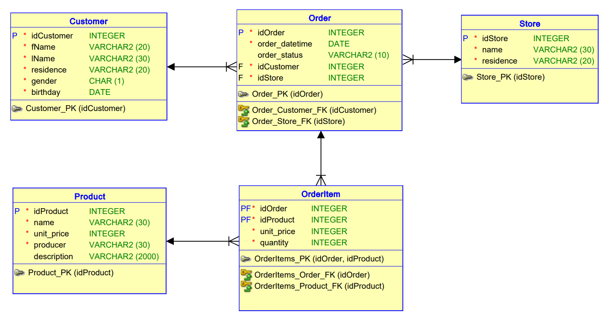
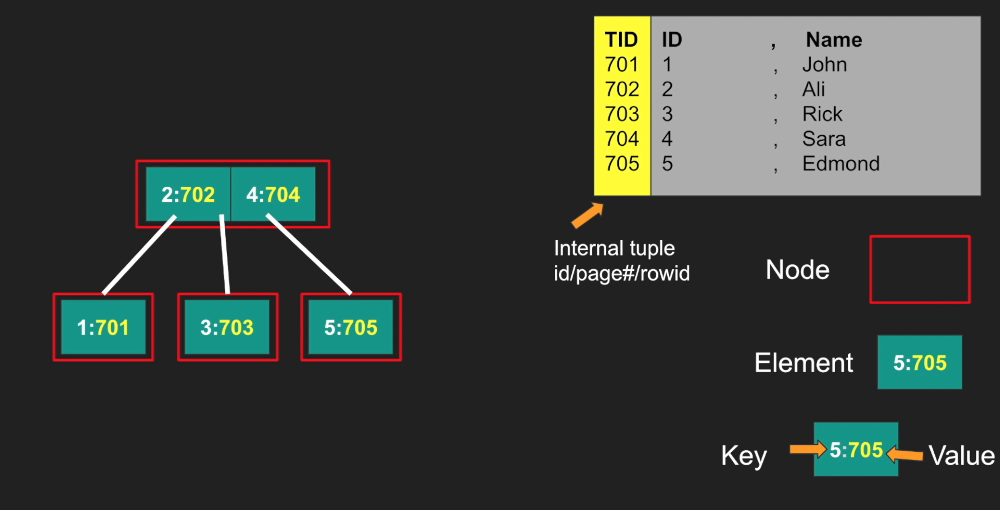
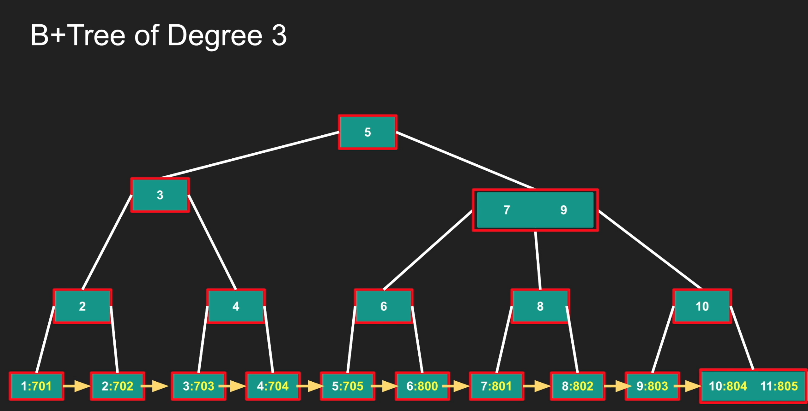
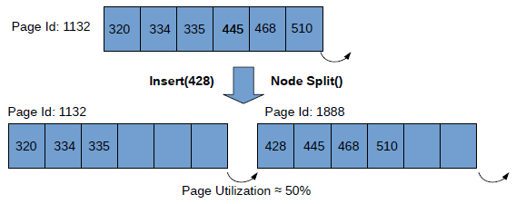
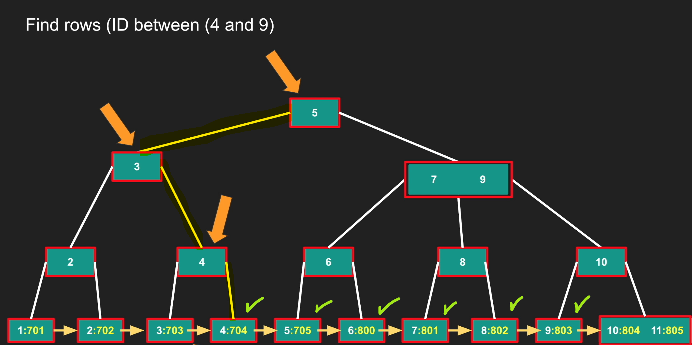
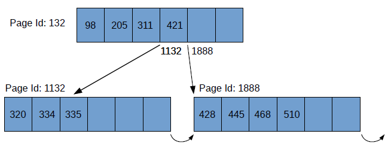
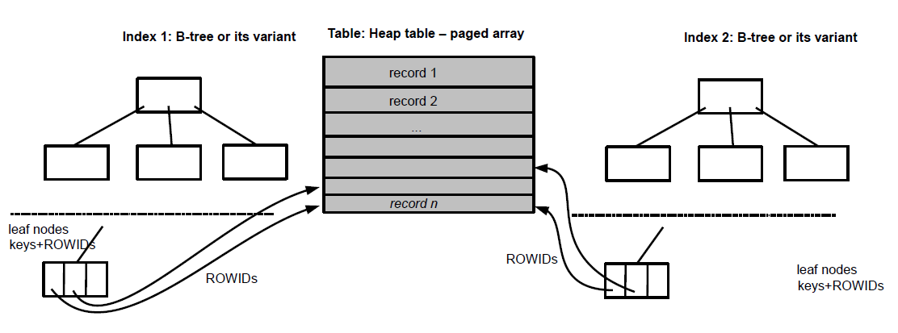

# PDBS

- [1. Testovací databáze ProductOrderDb](#1-testovací-databáze-productorderdb)
- [2. Tabulka typu halda (heap table)](#2-tabulka-typu-halda-heap-table)
  - [2.1. Mazání záznamů](#21-mazání-záznamů)
  - [2.2. Vkládání záznamů](#22-vkládání-záznamů)
- [3. Indexy v DBS](#3-indexy-v-dbs)
  - [3.1. B-strom](#31-b-strom)
  - [3.2. B+strom](#32-bstrom)
  - [3.3. Rozsahový dotaz](#33-rozsahový-dotaz)
  - [3.4. Index](#34-index)
  - [3.5. PL/SQL](#35-plsql)
    - [3.5.1. Zjištění indexů vytvořených pro tabulku](#351-zjištění-indexů-vytvořených-pro-tabulku)
    - [3.5.2. Počet bloků indexu](#352-počet-bloků-indexu)
    - [3.5.3. Výška B+stromu](#353-výška-bstromu)
    - [3.5.4. Další statistiky](#354-další-statistiky)
  - [3.6. SQL Server](#36-sql-server)
    - [3.6.1. Zjištění indexů vytvořených pro tabulku](#361-zjištění-indexů-vytvořených-pro-tabulku)
    - [3.6.2. Počet bloků indexu](#362-počet-bloků-indexu)
    - [3.6.3. Výška B+stromu](#363-výška-bstromu)
    - [3.6.4. Další statistiky](#364-další-statistiky)
- [4. Plán vykonávání dotazu (QEP)](#4-plán-vykonávání-dotazu-qep)
  - [4.1. Zobrazení QEP](#41-zobrazení-qep)
    - [4.1.1. Oracle](#411-oracle)
    - [4.1.2. MS SQL Server](#412-ms-sql-server)
  - [4.2. Čas zpracování sekvenčního průchodu haldou](#42-čas-zpracování-sekvenčního-průchodu-haldou)
    - [4.2.1. Paralelizace MS SQL Server](#421-paralelizace-ms-sql-server)
    - [4.2.2. Paralelizace Oracle](#422-paralelizace-oracle)
  - [4.3. Operace haldy a indexu](#43-operace-haldy-a-indexu)
  - [4.4. Složený klíč indexu](#44-složený-klíč-indexu)
  - [4.5. Index pro multiatribut](#45-index-pro-multiatribut)
  - [4.6. Pokrývající index](#46-pokrývající-index)
- [5. Shlukovaná tabulka](#5-shlukovaná-tabulka)
  - [5.1. Oracle](#51-oracle)
  - [5.2. SQL Server](#52-sql-server)
- [6. Operace spojení (JOIN)](#6-operace-spojení-join)
  - [6.1. Nested loop join](#61-nested-loop-join)
  - [6.2. Nested loop join with index](#62-nested-loop-join-with-index)
  - [6.3. Merge Join (spojení sléváním)](#63-merge-join-spojení-sléváním)
  - [6.4. Hash join](#64-hash-join)
  - [6.5. Shrnutí](#65-shrnutí)
  - [6.6. Použití indexu při ladění dotazů se spojením](#66-použití-indexu-při-ladění-dotazů-se-spojením)
- [7. Stránkování výsledku dotazu](#7-stránkování-výsledku-dotazu)
- [8. Komprimace v DBS](#8-komprimace-v-dbs)
  - [8.1. MS SQL Server](#81-ms-sql-server)
  - [8.2. Oracle](#82-oracle)
- [9. Uložení dat v tabulce](#9-uložení-dat-v-tabulce)
  - [9.1. Řádkové uložení dat](#91-řádkové-uložení-dat)
  - [9.2. Sloupcové uložení dat](#92-sloupcové-uložení-dat)
  - [9.3. Oracle](#93-oracle)
  - [9.4. MS SQL Server](#94-ms-sql-server)
- [10. Další možnosti fyzického návrhu (optimalizace)](#10-další-možnosti-fyzického-návrhu-optimalizace)

## 1. Testovací databáze ProductOrderDb



## 2. Tabulka typu halda (heap table)

> Lineární složitost vyhledávání a neprovádění fyzického mazání záznamů.

- Základní datová struktura pro tabulky relačního datového modelu je **tabulka typu halda** (stránkované pole, resp. stránkovaný seznam).
- Záznamy jsou uloženy ve stránkách/blocích o velikosti nejčastěji 8 kB (používají se násobky alokační jednotky systému, nejčastěji 2kB).
- Vyhledávání je *sekvenční* $\mathcal{O}(n)$.

<details><summary> Příklad: Počet stránek heap table </summary>

(Oracle) Počet stránek:

```sql
SELECT COUNT(*) FROM Customer;
SELECT blocks FROM users_segments
WHERE segment_name = 'CUSTOMER';
```

(Oracle) Počet *využitých* stránek (hlubší rozbor):

```sql
CREATE OR REPLACE PROCEDURE PrintPages (
    ptablename VARCHAR,
    pusername VARCHAR
)
AS
    blocks NUMBER;
    bytes NUMBER;
    unused_blocks NUMBER;
    unused_bytes NUMBER;
    expired_blocks NUMBER;
    expired_bytes NUMBER;
    unexpired_blocks NUMBER;
    unexpired_bytes NUMBER;
    mega NUMBER := 1024.0 * 1024.0;
BEGIN
    dbms_space.unused_space(pusername, ptablename, 'TABLE', blocks, bytes, unused_blocks, unused_bytes, expired_blocks, expired_bytes, unexpired_blocks, unexpired_bytes);
    dbms_output.put_line('blocks: ' || blocks);
    dbms_output.put_line('size (MB): ' || (bytes / mega));
    dbms_output.put_line('used blocks: ' || (blocks - unused_blocks));
    dbms_output.put_line('size used (MB): ' || ((bytes / mega) - (unused_bytes / mega)));
    dbms_output.put_line('unused blocks: ' || unused_blocks);
    dbms_output.put_line('size unused (MB): ' || (unused_bytes / mega));
END;
/

EXEC PrintPages('CUSTOMER', 'KRA28');

SELECT blocks FROM user_segments
WHERE segment_name = 'CUSTOMER';
```

(MS SQL Server) Počet *využitých* stránek (hlubší rozbor):

```sql
CREATE OR ALTER PROCEDURE PrintPages 
    @tableName VARCHAR(30),
    @indexId INT
AS
BEGIN
    SELECT
        t.NAME AS TableName,
        p.rows AS RowCounts,
        SUM(a.total_pages) AS TotalPages,
        ROUND(CAST(SUM(a.total_pages) * 8 AS FLOAT) / 1024, 1) AS TotalPages_MB,
        SUM(a.used_pages) AS UsedPages,
        ROUND(CAST(SUM(a.used_pages) * 8 AS FLOAT) / 1024, 1) AS UsedPages_MB
    FROM sys.tables t
    INNER JOIN sys.indexes i ON t.OBJECT_ID = i.object_id
    INNER JOIN sys.partitions p ON i.object_id = p.OBJECT_ID AND i.index_id = p.index_id
    INNER JOIN sys.allocation_units a ON p.partition_id = a.container_id
    WHERE t.NAME = @tableName AND p.index_id = @indexId
    GROUP BY t.Name, p.Rows
    ORDER BY t.Name;
END;
GO

CREATE OR ALTER PROCEDURE PrintPagesHeap 
    @tableName VARCHAR(30)
AS
BEGIN
    EXEC PrintPages @tableName, 0;
END;
GO

EXEC PrintPagesHeap 'Customer';
EXEC PrintPagesHeap 'OrderItem';
```

</details>

### 2.1. Mazání záznamů

- Záznamy v tabulce nejsou nijak uspořádány. Mazání po každé operaci delete, by v nejhorším případě, znamenalo přesouvání $n$ záznamů v hladě.
- Operace mazání pouze *označí záznam jako smazaný*! Záznam musíme prvně najít, proto složitost $\mathcal{O}(n)$.

<details><summary> Příklad: Fyzické mazání záznamů heap table </summary>

Oracle:

```sql
ALTER TABLE OrderItem ENABLE ROW MOVEMENT;
ALTER TABLE OrderItem SHRINK SPACE;
```

MS SQL Server:

```sql
ALTER TABLE <TableName> REBUILD;
```

</details>

### 2.2. Vkládání záznamů

Při vkládání je záznam umístěn na první nalezenou volnou pozici v tabulce (časová složitost $\mathcal{O}(n)$) nebo na konec pole (složitost $\mathcal{O}(1)$).

Teoretická složitost vkládání do haldy je $\mathcal{O}(1)$, ale:

- Pro *primární klíče* a *jedinečné atributy (unique)* je nutné kontrolovat jedinečnost hodnot atributů.
- Referenční integrita - DBS musí kontrolovat hodnoty pro cizí klíče, zda se záznam vyskytuje v odkazované tabulce.

V haldě mají tyto kontroly složitost v $\mathcal{O}(n)$. Halda je základní úložiště dat pro tabulku, potřebujeme ale také úložiště s lepší časovou složitostí základních operací.

## 3. Indexy v DBS

### 3.1. B-strom



### 3.2. B+strom

$B^+$-strom řádu $C$ má vlastnosti:

- Vnitřní/listový uzel/stránka obsahuje $C-1$ klíčů, vnitřní uzel obsahuje $C$ ukazatelů na dětské uzly.
- **Stránkovatelný** (srovnáme s binárním stromem): C je nastaveno dle velikosti stránky např. 8kB.
- **Vyvážený**: vzdálenost od všech listů ke kořenovému uzlu je stejná.
- **Výška** $h$ je vzdálenost od kořene k listu (počet hran): $h\approx \lceil \log C(n) \rceil$ $\Rightarrow$ maximální počet klíčů $\boxed{N = C^{h+1} − 1}$.
- **Mazání, vkládání** a dotaz na jeden klíč (**bodový dotaz**) mají **časovou složitost** $\mathcal{O}(\log(n))$.
- Počet uzlů/stránek (**IO cost**), které je nutné projít při bodovém dotazu, je $h + 1$.
- Klíče jsou uloženy pouze v interních uzlech. Oproti $B$-stromu má hodnoty pouze v listových uzlech.
- Listové uzly jsou propojené, což pomáhá v rozsahových dotazech.



Pokud chceme vložit klíč do listového uzlu, který je plný, dojde k operaci **štěpení (split)**. V původním uzlu se ponechá 50% položek, do nově vytvořeného uzlu se přesune 50% položek. Důsledkem je **50% využití stránek** $B$-stromu $\Rightarrow$ $B$-strom je tedy cca 2x větší než halda.



### 3.3. Rozsahový dotaz

`between 42 and 420`

1. Bodový dotaz pro nižší hodnotu v rozsahu $(42)$.
2. Porovnávání dalších klíčů ve stránce dokud klíč $\leq 420$.
3. Po porovnání všech klíčů stránky je načtena další listová stránka (Každá listová stránka $B^+$-stromu obsahuje odkaz na následující listovou stránku).





- IO cost = $h + b$
    1. $h$: bodový dotaz (minimum).
    2. $b$: počet prohledávaných listových uzlů.
- Nejhorší případ $\mathcal{O}(n)$ (průchod všech listových stránek).
- Nejlepší případ: IO cost = $h+1$.
- Sousední listové stránky na *disku* jsou umístěny daleko od sebe, při načítání stránek z disku dochází k **náhodným přístupům** (o 2-3 řády pomalejší), proto je někdy pro plán vykonávání zvolen sekvenční průchod haldou.
  - Náhodný přístup v hlavní paměti není tak problematický díky **cache CPU**.

> Pokud jsou stránky $B$-stromu umístěny v hlavní paměti, i pro vyšší $b$ je použit rozsahový dotaz nad $B$-stromem. Pokud jsou stránky umístěny na disku, i pro relativně nízké $b$, DBS použije sekvenční průchod v haldě.

### 3.4. Index

> Index v DBS je většinou implementován jako $B$-strom.

Index neobsahuje celé záznamy, ale pouze:

- **setřízené hodnoty indexovaných atributů (klíč)**.
- **ROWID** (**RID** v SQL Server), které odkazuje na záznam (řádek) v haldě.

Klíč a ROWID pak nazýváme **položkou** uzlu B-stromu.

Typy indexů:

1. Automaticky vytvořený index:
   - Je vytvořen pro primární klíče a jedinečné atributy (unique), když je úložištěm tabulky halda (heap).
2. Ručně vytvořený index:

```sql
CREATE INDEX <index name>
ON <table name>(<list of attributes>)
```

- Klíč B-stromu obsahuje hodnoty atributů z `<list of attributes>`.

Základní schéma úložiště pro tabulku:



> **ROWID (RID)** je nejčastěji 4–10 bytová hodnota skládající se z **čísla bloku** a **pozice záznamu v haldě**.

Proč potřebujeme číslo bloku? Protože bez toho bychom museli prvně najít správnou stránku DB a nebylo by tam žádné zlepšení oproti sekvenčnímu vyhledávání.

Proč DBS nepoužívá paměťový ukazatel? Protože bloky mohou být umístěny na **disku**!

Proč automaticky vytvářené indexy?

- Rychlejší **kontrola jedinečnosti** hodnoty PK (resp. unique atribut).
- Rychlejší **bodové dotazy** pro PK (resp. unique atribut).
- Rychlejší kontrola **referenční integrity** při mazání záznamu tabulky s PK, na který ukazuje FK (jiné tabulky).

DBS nám **ne**umožní automaticky vytvořený index zrušit.

### 3.5. PL/SQL

#### 3.5.1. Zjištění indexů vytvořených pro tabulku

```sql
SELECT index_name 
FROM user_indexes 
WHERE table_name = 'CUSTOMER';

-- Output: INDEX_NAME    SYS_C00552552
```

Tzn. pro primární klíč `idCustomer` je vytvořen index `SYS_C00552552`, B+strom, kde položka obsahuje hodnotu `idCustomer` a `ROWID`, které ukazuje na kompletní záznam do haldy.

#### 3.5.2. Počet bloků indexu

Počet alokovaných bloku (odhad - maximální hodnota):

```sql
SELECT blocks 
FROM user_segments 
WHERE segment_name = 'CUSTOMER';
-- BLOCKS 2048
```

```sql
SELECT blocks 
FROM user_segments 
WHERE segment_name = 'SYS_C00552552';
-- BLOCKS 640
```

<details><summary> PL/SQL procedura PrintPagesUnusedSpace </summary>

```sql
CREATE OR REPLACE PROCEDURE PrintPagesUnusedSpace (
    ptablename VARCHAR,
    pusername VARCHAR,
    ptype VARCHAR
)
AS
    freeblocks NUMBER;
    blocks NUMBER;
    bytes NUMBER;
    unusedblocks NUMBER;
    unusedbytes NUMBER;
    expiredblocks NUMBER;
    expiredbytes NUMBER;
    unexpiredblocks NUMBER;
    unexpiredbytes NUMBER;
    mega NUMBER := 1024.0 * 1024.0;
BEGIN
    dbms_space.unused_space(
        pusername,
        ptablename,
        ptype,
        blocks,
        bytes,
        unusedblocks,
        unusedbytes,
        expiredblocks,
        expiredbytes,
        unexpiredblocks,
        unexpiredbytes
    );

    dbms_output.put_line('blocks: ' || blocks || ', ' || CHR(9) || 'size (MB): ' || (bytes / mega));
    dbms_output.put_line('used blocks: ' || (blocks - unusedblocks) || ', ' || CHR(9) || 'size (MB): ' || ((bytes / mega) - (unusedbytes / mega)));
    dbms_output.put_line('unused blocks: ' || unusedblocks || ', ' || CHR(9) || 'size (MB): ' || (unusedbytes / mega));
    dbms_output.put_line('expired blocks: ' || expiredblocks || ', ' || CHR(9) || 'unexpired blocks: ' || unexpiredblocks);
END;

EXEC PrintPagesUnusedSpace(’CUSTOMER’, ’KRA28’, ’TABLE’);
--blocks: 2048, size (MB): 16
--used_blocks: 2048, size (MB): 16
--unused_blocks: 0, size (MB): 0
--expired_blocks: 7, unexpired_blocks: 128
```

</details>

<details><summary> PL/SQL procedura PrintPagesSpaceUsage </summary>

```sql
CREATE OR REPLACE PROCEDURE PrintPagesSpaceUsage (
    ptablename VARCHAR,
    pusername VARCHAR,
    ptype VARCHAR
)
AS
    unformatted_blocks NUMBER;
    unformatted_bytes NUMBER;
    fs1_blocks NUMBER;
    fs1_bytes NUMBER;
    fs2_blocks NUMBER;
    fs2_bytes NUMBER;
    fs3_blocks NUMBER;
    fs3_bytes NUMBER;
    fs4_blocks NUMBER;
    fs4_bytes NUMBER;
    full_blocks NUMBER;
    full_bytes NUMBER;
BEGIN
    dbms_space.space_usage(
        pusername,
        ptablename,
        ptype,
        unformatted_blocks,
        unformatted_bytes,
        fs1_blocks,
        fs1_bytes,
        fs2_blocks,
        fs2_bytes,
        fs3_blocks,
        fs3_bytes,
        fs4_blocks,
        fs4_bytes,
        full_blocks,
        full_bytes,
        null
    );

    dbms_output.put_line('unformatted blocks: ' || unformatted_blocks);
    dbms_output.put_line('fs1 blocks (0 to 25% free space): ' || fs1_blocks);
    dbms_output.put_line('fs2 blocks (25 to 50% free space): ' || fs2_blocks);
    dbms_output.put_line('fs3 blocks (50 to 75% free space): ' || fs3_blocks);
    dbms_output.put_line('fs4 blocks (75 to 100% free space): ' || fs4_blocks);
    dbms_output.put_line('full blocks: ' || full_blocks);
END;

EXEC PrintPagesSpaceUsage(’CUSTOMER’, ’KRA28’, ’TABLE’);

--unformatted_blocks: 62
--fs1_blocks (0 to 25% free space): 0
--fs2_blocks (25 to 50% free space): 1
--fs3_blocks (50 to 75% free space): 0
--fs4_blocks (75 to 100% free space): 31
--full_blocks: 1914
```

</details>

#### 3.5.3. Výška B+stromu

```sql
SELECT index_name, blevel, leaf_blocks
FROM user_indexes
WHERE table_name = 'CUSTOMER';
```

```text
INDEX_NAME          BLEVEL LEAF_BLOCKS
--------------- ---------- -----------
SYS_C00552552            1         562
```

- Jeden kořen a 562 listových uzlů
- IO cost bodového dotazu $h+1=2$.

#### 3.5.4. Další statistiky

Využijeme příkaz `ANALYZE INDEX <index_name> VALIDATE STRUCTURE;`, který naplní tabulku `index_stats`.

```sql
ANALYZE INDEX SYS_C00552552 VALIDATE STRUCTURE;

SELECT height - 1 AS h,
       blocks,
       lf_blks AS leaf_pages,
       br_blks AS inner_pages,
       lf_rows AS leaf_items,
       br_rows AS inner_items,
       pct_used --využití stránek (až 100 % díky optimalizace)
FROM index_stats
WHERE name = 'SYS_C00552552';
```

| H   | BLOCKS | LEAF_PAGES | INNER_PAGES | LEAF_ITEMS | INNER_ITEMS | PCT_USED |
|-----|--------|------------|-------------|------------|-------------|----------|
| 1   | 640    | 562        | 1           | 300000     | 561         | 100      |

### 3.6. SQL Server

#### 3.6.1. Zjištění indexů vytvořených pro tabulku

```sql
CREATE OR ALTER PROCEDURE PrintIndexes
    @tableName VARCHAR(30)
AS
BEGIN
    SELECT i.name AS indexName
    FROM sys.indexes i --systémový katalog
    INNER JOIN sys.tables t ON t.object_id = i.object_id --systémový katalog
    WHERE t.name = @tableName AND i.name IS NOT NULL;
END;
GO

EXEC PrintIndexes 'Customer';
-- indexName    PK__Customer__D058768742B8AE8D
```

#### 3.6.2. Počet bloků indexu

```sql
CREATE OR ALTER PROCEDURE PrintPagesIndex
    @indexName VARCHAR(30)
AS
BEGIN
    SELECT
        i.name AS IndexName,
        p.rows AS ItemCounts,
        SUM(a.totalpages) AS TotalPages,
        ROUND(CAST(SUM(a.totalpages) * 8 AS FLOAT) / 1024, 1) AS TotalPages_MB,
        SUM(a.usedpages) AS UsedPages,
        ROUND(CAST(SUM(a.usedpages) * 8 AS FLOAT) / 1024, 1) AS UsedPages_MB
    FROM
        sys.indexes i
    INNER JOIN sys.partitions p ON i.object_id = p.object_id AND i.index_id = p.index_id
    INNER JOIN sys.allocation_units a ON p.partition_id = a.container_id
    WHERE
        i.name = @indexName
    GROUP BY
        i.name, p.Rows
    ORDER BY
        i.name;
END;
GO

EXEC PrintPagesHeap 'Customer'; --kapitola 2 - halda
--TableName   RowCounts   TotalPages  TotalPages_MB   UsedPages   UsedPages_MB
--Customer    300000      1753        13.7            1751        13.7

EXEC PrintPagesIndex 'PK__Customer__D058768742B8AE8D';
--IndexName                           ItemCounts   TotalPages  TotalPages_MB   UsedPages   UsedPages_MB
--PK__Customer__D058768742B8AE8D      300000      673         5.3             673         5.3
```

#### 3.6.3. Výška B+stromu

```sql
SELECT i.name, s.index_depth - 1 AS height,
    SUM(s.page_count) AS page_count
FROM sys.dm_db_index_physical_stats (DB_ID(N'kra28'),
    OBJECT_ID(N'Customer'), NULL, NULL, 'DETAILED') AS s
JOIN sys.indexes AS i
ON s.object_id = i.object_id AND s.index_id = i.index_id
WHERE name = 'PK__Customer__D058768742B8AE8D'
GROUP BY i.name, s.index_depth;

--name                            height   page_count
--PK__Customer__D058768742B8AE8D       2          672
```

- IO cost bodového dotazu $h+1=3$.

#### 3.6.4. Další statistiky

```sql
SELECT
    s.indexlevel AS level,
    s.pagecount,
    s.recordcount,
    s.avgrecordsizeinbytes AS avg_record_size,
    ROUND(s.avgpagespaceusedinpercent, 1) AS page_utilization,
    ROUND(s.avgfragmentationinpercent, 2) AS avg_frag
FROM
    sys.dm_db_index_physical_stats(
        DB_ID(N'kra28'), OBJECT_ID(N'Customer'),
        NULL, NULL, 'DETAILED') AS s
JOIN
    sys.indexes i ON s.object_id = i.object_id AND s.index_id = i.index_id
WHERE
    name = 'PKCustomerD058768742B8AE8D';
```

| level | page_count | record_count | avg_record_size | page_utilization | avg_frag |
|-------|------------|--------------|-----------------|------------------|----------|
|   0   |    669     |    300000    |       16        |       99.7       |   0.45   |
|   1   |     2      |     669      |       11        |       53.7       |   100    |
|   2   |     1      |      2       |       11        |        0.3       |    0     |

- `level`: 0 - listové úrovně, 2 - kořenová úroveň
- `page_count`: B-strom obsahuje pouze 3 vnitřní uzly.
- `record_count`: vnitřní uzly obsahují jen 771 klíčů

Využití listových stránek je téměř 100%, zřejmě důsledek optimalizace při vkládání inkrementovaných hodnot PK. Pokud je hodnota nízká, použijeme `ALTER INDEX REBUILD`.

Průměrná fragmentace uzlů `avg_frag` je míra shody logického a fyzického pořadí stránek. Pokud je hodnota nízká, použijeme `ALTER INDEX REORGANIZE`.

## 4. Plán vykonávání dotazu (QEP)

Jakmile optimalizátor vybere nejlevnější (nejrychlejší) plán, dotaz je proveden a uživateli je navrácen výsledek.

V DBS máme možnost zobrazit vybraný **plán vykonávání dotazu** (angl. **query execution plan - QEP**), který obsahuje provedené **fyzické i logické operace**. Tento plán může sloužit ladění dotazu.

Cenu fyzických operací měříme pomocí:

- **IO Cost** – počet přístupů ke **stránkám** datových struktur.
- **CPU Cost** – počet operací, např. počet porovnání provedených při provádění operace. Přístupy ke stránkám dělíme na:
  - logical reads – logické přístupy.
  - physical reads – fyzické přístupy: stránky nejsou v paměti (cache buffer) a musí být načteny z disku. Pokud se nám, i při opakování dotazu, stále objevují **nenulové fyzické přístupy, musíme zvětšit cache buffer**.
- **Processing time** – používáme méně často, závisí na **výkonu** konkrétního serveru, aktuálním **vytížení** atd.

Sekvenční průchod haldou:

- DBS projde všechny bloky haldy bez ohledu na selektivitu dotazu (tedy velikost výsledku), označení:
  - Oracle: `TABLE ACCESS (FULL)`
  - SQL Server: `Table Scan`

### 4.1. Zobrazení QEP

#### 4.1.1. Oracle

```sql
EXPLAIN PLAN FOR 
SELECT * FROM Customer 
WHERE birthday = TO_DATE('01.01.2000', 'DD.MM.YYYY');

SELECT SUBSTR(LPAD(' ', LEVEL-1) || operation || '(' || options || ')', 1, 30) AS "Operation",
       object_name AS "Object",
       "COST" AS "Cost",
       cpu_cost AS "CPU Cost"
FROM PLAN_TABLE
START WITH id = 0
CONNECT BY PRIOR id = parent_id;


-- alternativně:
SELECT * FROM TABLE(DBMS_XPLAN.DISPLAY);

Plan hash value: 2844954298
---------------------------------------------------------------------------
| Id | Operation         | Name     | Rows | Bytes | Cost (%CPU)| Time     |
---------------------------------------------------------------------------
|  0 | SELECT STATEMENT  |          |   10 |   410 | 553 (2)    | 00:00:01 |
|*  1 | TABLE ACCESS FULL| CUSTOMER |   10 |   410 | 553 (2)    | 00:00:01 |
---------------------------------------------------------------------------
```

- **Plan hash value**: (jedinečné) číslo plánu, budeme potřebovat pro zjištění statistik provedení dotazu.
- **Rows**: odhad velikosti výsledku, ve skutečnosti je výsledek 10.
- **Cost**: odhad CPU cost provedení dotazu.

<details><summary> Statistiky provedení dotazu: buffer gets - IO cost </summary>

```sql
COLUMN username FORMAT A10;
COLUMN sqltext FORMAT A30;

SELECT executions AS executions,
       buffergets/executions AS buffergets,
       (cputime/executions)/1000.0 AS cputimems,
       (elapsedtime/executions)/1000.0 AS elapsedtimems,
       rowsprocessed/executions AS rowsprocessed,
       du.username, sqltext
FROM v$sql
INNER JOIN dba_users du ON du.userid = parsing_user_id
WHERE sql_id = '7c0zn2r2hw8y7' AND plan_hash_value = 2844954298;

EXECUTIONS BUFFER_GETS CPU_TIME_MS ELAPSED_TIME_MS ROWS_PROCESSED USERNAME SQL_TEXT
---------- ----------- ----------- --------------- -------------- ---------- ------------------------------
7          1959.28571  14.5274286     15.1642857     61             KRA28      select * from Customer where ...
```

Jak získat `sql_id`?

```sql
SET FEEDBACK ON SQL_ID;

SELECT * FROM Customer
WHERE fname = 'Jana' AND lname = 'Novotná' AND residence = 'České Budějovice';

SET FEEDBACK OFF SQL_ID;

--IDCUSTOMER FNAME LNAME RESIDENCE G BIRTHDAY
--297320 Jana Novotná České Budějovice f 24-OCT-97
--61 rows selected.
--SQL_ID: 1qbvrc9axd1wq
```

</details>

#### 4.1.2. MS SQL Server

```sql
SET SHOWPLAN_TEXT ON; --OFF

SET SHOWPLAN_ALL ON; --OFF

SET STATISTICS IO ON; --OFF
 
SET STATISTICS TIME ON; --OFF
```

### 4.2. Čas zpracování sekvenčního průchodu haldou

Oracle:

- Počet záznamů výsledku: 42
- Buffer gets: 15976
- **CPU time**: 161.3 ms
- Elapsed time: 159.7 ms

SQL Server:

- Počet záznamů výsledku: 60
- Logical reads: 18797
- **CPU time**: 373 ms
- Elapsed time: 30 ms

Zajímá nás především `CPU time`! Pokud bude počet operací nad databází v daný okamžik vyšší, pak DBS nebude moci paralelizovat jednotlivé operace a bude provádět dílčí operace postupně místo paralelně.

#### 4.2.1. Paralelizace MS SQL Server

- Implicitně je paralelizace zapnutá.
- `OPTION (MAXDOP x)`, kde `x` značí počet jader. Pro sekvenční provedení použijeme $x=1$, pro paralelizaci bez omezení počtu jader použijeme $x=0$:

```sql
SELECT * FROM OrderItem
WHERE orderitem.unitprice BETWEEN 1 AND 300
OPTION (MAXDOP 1);
```

#### 4.2.2. Paralelizace Oracle

- Implicitně je paralelizace vypnutá.

```sql
SELECT degree
FROM dba_tables
WHERE table_name = 'ORDERITEM' AND owner = 'KRA28';

--DEGREE: 1

--Nastavení počtu jader pro operace nad tabulkou:
ALTER TABLE OrderItem PARALLEL (DEGREE 4);

--Potlačení paralelismu:
SELECT /*+ noparallel(oi) */ * FROM OrderItem oi
WHERE oi.unitprice BETWEEN 1 AND 300;
```

<div class="warning">

`buffer gets` (Oracle) odpovídá `logical reads` (MS SQL Server).

</div>

### 4.3. Operace haldy a indexu

Dotazy na hodnoty **indexovaného atributu** (např. PK) využívají (někdy) bodového nebo rozsahového dotazu v B-stromu:

1. Pomocí **bodového dotazu v B-stromu** je nalezena hodnota atributu a s ní `ROWID` příslušného záznamu.
    - Oracle:
        - `INDEX (UNIQUE SCAN)` pro bodový dotaz v B-stromu.
        - `INDEX (RANGE SCAN)` pro rozsahový dotaz v B-stromu.
    - SQL Server: `Index Seek` pro bodový i rozsahový dotaz v B-stromu (někdy můžeme rozlišit pomocí velikosti výsledku).
2. Pomocí `ROWID`, DBS přímo získá záznam z haldy:
    - Oracle: `TABLE ACCESS (BY INDEX ROWID)`
    - SQL Server: `RID Lookup`

**IO cost rozsahového dotazu v B-stromu** s velikostí výsledku $r$ (získání $r$ záznamů z haldy) je $\boxed{\text{IO cost}=h+b+r}$.

- $h+b$ - rozsahový dotaz v B-stromu.
- $r$ - přístup k $r$ záznamům haldy pomocí `ROWID`.

Důsledek: pro vyšší $r$ je IO cost $\approx r$.

> Pro rozsahový dotaz je stěžejní, aby DBS byl schopný odhadnout řád velikosti výsledku. Pro rozsáhlý výsledek je rychlejší sekvenční průchod haldou oproti B-stromu.

<div class="warning">

**Selektivita dotazu** je počet záznamů dotazu děleno celkový počet záznamů. Např. pro $r=440, n=100000 \Rightarrow \dfrac{440}{100000}=0.44\%$.

Při selektivitě větší než $1\%$ DBS spíše zvolí sekvenční průchod haldou na místo rozsahového dotazu v B-stromu.

</div>

### 4.4. Složený klíč indexu

Pokud klíč obsahuje více než jeden atribut $a_1,a_2,\ldots,a_k$, mluvíme o
složeném klíči.

Složený klíč je **lexikograficky uspořádán**. Záleží tedy na pořadí atributů složeného klíče! Např. pro PK `(ID_ORDER, ID_PRODUCT)`, jsou klíče prvně setřízeny podle `ID_ORDER` a až poté podle `ID_PRODUCT`:

| ID_ORDER | ID_PRODUCT | UNIT_PRICE | QUANTITY |
|---------|-----------|------------|----------|
|    1    |    4320   |   1796023  |    1     |
|    1    |    7795   |    28533   |    9     |
|    1    |   24477   |    4157    |    9     |
|    1    |   25231   |   41566    |    6     |
|    2    |   19090   |   62625    |    8     |
|    2    |   24733   |   71542    |   10     |

Důsledek: pro dotaz na `ID_PRODUCT` bude použit sekvenční průchod haldou! Záznamy nejsou seřazené, a tedy index nebude využit.

Lexikografickému uspořádání pro klíč $a_1, a_2,\ldots, a_k$ odpovídají dotazy obsahující **bodové dotazy** pro atributy $a_1,\ldots, a_l$, kde $l\leq k$. Pro atribut $a_{l+1}$ může být specifikován **rozsah**, zatímco atributy $a_{l+2}$,\ldots, a_k$ mohou zůstat nespecifikované.

Jakýkoliv jiný dotaz znamená **nevyužití indexu** (dotaz není kompatibilní s lexikografickým uspořádáním indexu). Výjimkou je optimalizace `INDEX SKIP SCAN` v Oracle.

Navíc pokud bude odhad velikosti dotazu dle DBS příliš vysoký, provede se sekvenční průchod.

Např. pro složený klíč o pěti atributech můžu přesně specifikovat první dva, pro třetí zadat rozsah, ale čtvrtý a pátý nechat nespecifikovaný.

> **Shrnutí:**
>
>Index pro (složený) klíč je použit pouze v případě, kdy dotaz odpovídá lexikografickému uspořádání klíče a selektivita dotazu je spíše nízká (zde 1%).
>
>Při vytváření většího počtu indexů, můžeme snadno přesáhnout velikost haldy. Navíc budeme snižovat čas vykonání operací insert a update.

### 4.5. Index pro multiatribut

- Multiatribut je např. `DATE` nebo `DATETIME`. Chová se jako složený klíč, tzn. musí být splněno lexikografické uspořádání.

### 4.6. Pokrývající index

> Pokrývající index (covering index) umožňuje vyhodnotit dotaz bez přístupu do haldy.

Triviální příklad je index na PK:

```sql
SELECT PRODUCT_ID FROM PRODUCT WHERE PRODUCT_ID=1234
```

- QEP Oracle: `INDEX UNIQUE SCAN SYS_C00470722`
- QEP SQL Server: `−−Index Seek (...[ PK Product 5EEC79D078872EE8 ] ), ...)`

Vytvoření pokrývajícího indexu:

```sql
SELECT id_product
FROM Product
WHERE unit_price BETWEEN 1000000 AND 10500000;
-- logical reads = 539

-- Pokud vytvoříme standardní index:
CREATE INDEX product_unit_price 
ON Product (unit_price);
-- logical reads = 194

-- Pokrývající index v MS SQL
CREATE INDEX product_unit_price_id_p
ON Product (unit_price)
INCLUDE (id_product);

-- Pokrývající index v Oracle (nemá klíčové slovo INCLUDE)
CREATE INDEX product_unit_price_id_p 
ON Product (unit_price, id_product)

-- logical reads = 2
```

Položka (list B-stromu) indexu `product_unitprice_id_p` obsahuje:

- Klíč: atribut `unit_price`.
- `RID`: odkaz na záznam v haldě tabulky `Product`.
- Atributy: `id_product`

B-strom je ale setřízen jen podle klíče.

Obecně platí, že index se využívá pro selekci získávající malý počet záznamů (tzv. **vysoce selektivní dotazy**).

## 5. Shlukovaná tabulka

> Shlukovaná tabulka obsahuje **kompletní záznamy**. Pro každou tabulku existuje **vždy jen jedna datová struktura obsahující kompletní záznamy**: halda nebo shlukovaná tabulka.

Pokud použijeme pro uložení tabulky shlukovanou tabulku, pak položka indexu neobsahuje `ROWID` jako odkaz do tabulky, ale **hodnotu PK**. Tzn. shlukovaná tabulka obsahuje hodnotu PK místo `ROWID`.

Dotaz na shlukovanou tabulku a index bývá pomalejší než pro haldu a index. Pro shlukovanou tabulku se jedná o bodový dotaz B-stromu.

Dotaz na jiný atribut než na PK znamená sekvenční průchod B-stromem. Tzn. průchod všech listů B-stromu shlukované tabulky.

Využití stránek:

- Halda ≈ 100%
- Shlukovaná tabulka ≈ 50%

Záznamy ve shlukované tabulce jsou **setřízeny dle PK**. Pokud potřebujeme rychlejší přístup k hodnotám dalších atributů, musíme vytvořit index na tyto atributy.

Pokud jsou bloky umístěny na disku, je sekvenční průchod shlukované tabulky pomalejší než u haldy. Pro bloky v paměti je rozdíl zanedbatelný.

### 5.1. Oracle

`Index Organized Table` (IOT)

```sql
CREATE TABLE my_table (
    --...
) ORGANIZATION INDEX;
```

### 5.2. SQL Server

`Clustered index` - Pozor není to index! Index je `nonclustered index`.

```sql
--Převod haldy na clustered table
CREATE CLUSTERED INDEX OrderItems 
ON OrderItems (idOrder, idProduct);

--Převod clustered table na haldu
DROP INDEX OrderItems ON OrderItems;
```

SQL Server imlicitně vytvoří clustered table. Vytvoření haldy:

```sql
CREATE TABLE my_table (
    --...
    PRIMARY KEY NONCLUSTERED(<attribute>)
)
```

</div>

## 6. Operace spojení (JOIN)

Nejčastějším spojením je **spojení na rovnost hodnot atributů (equality join)**.

Algoritmy operace spojení:

- **Nested loop join**
  - **Nested loop join with index**
- **Merge join**
- **Hash join**

Vstupy algoritmu spojení:

- Dvě relace $R_1, R_2$, $n_1, n_2$ záznamy a $b_1, b_2$ stránkami.
- Pořadová čísla spojovaných atributů $R_1.x$ a $R_2.y$.

Velikost výsledku: $[0, n_1\cdot n_2]$

> Operace načtení záznamu podle odkazu do haldy (v B-stromu):
>
> - MS SQL - `RID Lookup`,
> - Oracle - `Table Access by index ROWID`.

### 6.1. Nested loop join

- $\Theta(n_1\cdot n_2)$

```cpp
for (int i = 0; i < n1; i++)
{
    for (int j = 0; j < n2; j++)
    {
        if (R1[i].x == R2[j].y)
        {
            addToResult(R1[i], R2[j]);
        }
    }
}
```

Nebo stránkovaná verze:

- IO cost $b_1 \cdot b_2$ (oproti $n_1\cdot n_2$)

```cpp
for (int i = 0; i < b1; i++)
{
    B1 = readBlock(R1, i);
    for (int j = 0; j < b2; j++)
    {
        B2 = readBlock(R2, j);
        joinBlocks(B1, B2);
    }
}

void joinBlocks(Block B1, Block B2)
{
    for (int i = 0; i < B1.count; i++)
    {
        for (int j = 0; j < B2.count; j++)
        {
            if (B1[i].x == B2[j].y)
            {
                addToResult(B1[i], B2[j]);
            }
        }
    }
}
```

### 6.2. Nested loop join with index

- $\Theta(n_1\cdot\log n_2)$
- Předpoklad: pro spojovaný atribut $y$ relace $R_2$ je vytvořen index.

### 6.3. Merge Join (spojení sléváním)

- $\Theta(n_1 + n_2)$
- IO cost $b_1 + b_2$
- Předpoklad: Relace $R_1$ a $R_2$ setřízené dle spojovaných atributů $R_1.x$ resp. $R2.y$.

Algoritmus:

1. Porovnáváme aktuální prvky $R_1$ a $R_2$.
2. Pokud jsou stejné, zařadíme do výsledku.
3. Posuneme ukazatel na další prvek v relaci s menším aktuálním prvkem.
4. Provádíme, dokud nedojdeme na konec jedné z relací.

```python
def merge_join(r1, r2, x, y):
    i = 0
    j = 0
    intersection = []
    r1x = r1[x]
    r2y = r2[y]
    while i < len(r1x) and j < len(r2y):
        if r1x[i] == r2y[j]:
            intersection.append(r1x[i])
            i += 1
            j += 1
        elif r1x[i] < r2y[j]:
            i += 1
        else:
            j += 1
    return intersection
```

### 6.4. Hash join

- $\Theta(n_1 + n_2)$ (neuvažujeme operace hashované tabulky)
- IO cost $b_1 + b_2$ (neuvažujeme operace hashované tabulky)
- Algoritmus je využíván, pokud je nutné spojovat větší nesetřízené relace nebo jedna z relací je menší.

Algoritmus:

1. Menší relace (tabulka) je vložena do hashovací tabulky (slovník), kde klíčem je spojovaný atribut.
2. Větší relace (tabulka) je procházena po záznamech:
   - Průchod po klíčích slovníku, záznamy se stejnou hodnotou spojovaných atributů přidáme do výsledku.

### 6.5. Shrnutí

- **Nested loop join** se využívá pokud DBS spojuje menší, **nesetřízené** relace.
- Pokud je u druhé relace k dispozici index, využívá se **Nested loop join s indexem** (stále se musí jednat o dotaz s vysokou selektivitou, a tedy malým počtem záznamů $<1\%$).
- Pokud má DBS k dispozici obě relace **setřízené**, použije algoritmus **Merge join**.
- **Hash join** se využívá, pokud je nutné spojovat **větší nesetřízené relace**, zvláště pokud jedna z relací je menší.

### 6.6. Použití indexu při ladění dotazů se spojením

- Obecně platí, že index se využívá pro selekci získávající malý počet záznamů (tzv. vysoce selektivní dotazy).
- V případě operace spojení se můžeme pokusit vytvořit složený klíč obsahující spojovaný cizí klíč a atributy tabulky, pro které se provádí selekce.
- Pro dotazy `SELECT *` se složený index využije jen v případě dotazů s vyšší selektivitou.
- Pokud dotaz obsahuje projekci jinou než `*`, dáme atributy projekce na konec složeného klíče indexu. Vyhneme se drahým přístupům ke kompletnímu záznamu tabulky a složený index bude spíše využit. Pokud bude takový složený index využit, namísto sekvenčních
průchodů tabulkou získáme výrazně nižší čas vykonání dotazu.

## 7. Stránkování výsledku dotazu

Někdy nepotřebujeme v aplikaci zobrazit všechny výsledky dotazu najednou. Např. tabulka obsahuje 100 000 záznamů, ale v UI se uživateli zobrazuje jen jedna stránka záznamů, např. 100.

1. Cachování na úrovni aplikačního serveru
   - Je vhodné (bezproblémové) pouze v případě **statických** nebo téměř statických dat.

2. Stránkování na úrovni DBS a jeho podpora v ORM
    - Např. metoda třídy `Student`: `Student.Select(loIndex, hiIndex)`

Dotaz se stránkováním (1. stránka):

```sql
SELECT * FROM Customer
WHERE residence = 'Ostrava'
ORDER BY lname, idCustomer
OFFSET 0 
ROWS FETCH NEXT 100 ROWS ONLY;
```

Dotaz se stránkováním (poslední stránka):

```sql
SELECT * FROM Customer
WHERE residence = 'Ostrava'
ORDER BY lname, idCustomer
OFFSET 15500 -- 15 570 records
ROWS FETCH NEXT 100 ROWS ONLY;
```

## 8. Komprimace v DBS

Využívají se jednodušší, starší, spíše rychlé algoritmy, např. **RLE (Run-Length-Encoding)**. Upřednostňujeme **propustnost** *(rychlost komprese/dekomprese)* před **kompresním poměrem** *(kolik se uvolní místa)*.

Kódy proměnné délky *(Eliasovy, Fibonacciho, atd.)* se spíše nepoužívají, protože jsou pomalejší.

**Prefixová komprimace klíčů** B-stromu. Využívá se především u složených klíčů s větším počtem atributů.

Kdy se vyplatí vyšší komprimace i za cenu pomalejší rychlosti dotazu *(vyšší komprimační poměr, nižší propustnost)*? Např. pro **historická data**, které se nepoužívají příliš často.

### 8.1. MS SQL Server

Typy komprimace:

- `row` - kódování proměnné délky pro čísla i řetězce
- `page` - řádková, prefixová a slovníková komprimace (v tomto pořadí)
- `none`

```sql
ALTER TABLE <table> REBUILD PARTITION = ALL
WITH (DATA COMPRESSION = <type>);
```

```sql
ALTER INDEX <index> ON <table> REBUILD PARTITION = ALL
WITH (DATA COMPRESSION = <type>);
```

### 8.2. Oracle

Typy komprimace:

- `compress` - prefixová komprimace klíčů
- `compress advanced low` - komprimace stránek

```sql
CREATE TABLE <table> COMPRESS BASIC ...

CREATE TABLE <table> COMPRESS ADVANCED LOW ...

ALTER TABLE <table> MOVE NOCOMPRESS;

ALTER TABLE <table> MOVE COMPRESS;

CREATE INDEX <index> ON <table> (<...>) COMPRESS;

CREATE INDEX <index> ON <table> (<...>) COMPRESS ADVANCED LOW;

ALTER INDEX <index> REBUILD COMPRESS ADVANCED LOW;
```

## 9. Uložení dat v tabulce

### 9.1. Řádkové uložení dat

V blocích haldy jsou data uložena po záznamech, mluvíme o **řádkovém uložení** **(rowstore)**.

Řádkové uložení je **výhodné** v případě **projekce na všechny nebo větší počet atributů**:

- `SELECT * FROM Customer` – sekvenční průchod haldou.
- `SELECT * FROM Customer WHERE idCustomer=1` – bodový dotaz v indexu, přístup k záznamu v haldě.

Naopak je řádkové uložení **nevýhodné** v případě **projekce na nízký počet atributů**:

- `SELECT AVG(sysdate - birthday) FROM Customer` – sekvenční průchod tabulkou a počítání součtu věku, bloky ovšem obsahují i hodnoty ostatních atributů.

### 9.2. Sloupcové uložení dat

Pokud v dotazech pracujeme jen s několika málo atributy (reálné tabulky mohou mít desítky atributů), můžeme uvažovat o tzv. **sloupcovém uložení dat (columnstore)**.

Jednotlivé hodnoty neobsahují identifikátor řádku (klíč, RID atd.). **Záznamy jsou rekonstruovány podle pořadí hodnot ve sloupci**.

Interně může být každý sloupec reprezentovaný jednou haldou.

Při sloupcovém uložení můžeme dosáhnout **vyššího kompresního poměru**.

Sloupcové uložení je výhodné zejména, pokud dotazy pracují s **malým počtem atributů** tabulky (např. agregace - sekvenční průchod haldou). Je to tedy "opačný" koncept ke konceptu indexu - sekvenční průchod menším objemem dat při nízké selektivitě dotazů.

### 9.3. Oracle

**Oracle In-Memory Column Store** - uložení v hlavní paměti.

```sql
-- Tabulka <table> bude převedena na sloupcovou tabulku
-- po prvním sekvenčním průchodu.
ALTER TABLE <table> INMEMORY;

-- Tabulka <table> bude převedena na sloupcovou tabulku
-- okamžitě po startu databáze.
ALTER TABLE <table> INMEMORY PRIORITY CRITICAL;

-- Tabulka <table> bude řádkovou tabulkou - haldou.
ALTER TABLE <table> NO INMEMORY;
```

Nastavení komprimace sloupcové tabulky:

```sql
ALTER TABLE <table> INMEMORY MEMCOMPRESS FOR <type>;
```

Kde `<type>` může být:

- `DML`
- `QUERY LOW` - implicitní komprese pro dotazy
- `QUERY HIGH`
- `CAPACITY LOW`
- `CAPACITY HIGH` - nejvyšší komprese

### 9.4. MS SQL Server

- **Clustered columnstore index** - sloupcová tabulka
- **Nonclustered columnstore index** - sloupcový index

## 10. Další možnosti fyzického návrhu (optimalizace)

**Materializované pohledy** - uložení výsledku dotazu, vhodné pro časté, složitější dotazy. Nevýhodou je pomalejší aktualizace databáze.

**Rozdělení dat (data partitioning)** - určené pro velké tabulky obsahující např. dlouhodobá měření. Jednotlivé části (tabulky a indexy) pak obsahují data jen za určitý časový úsek.
