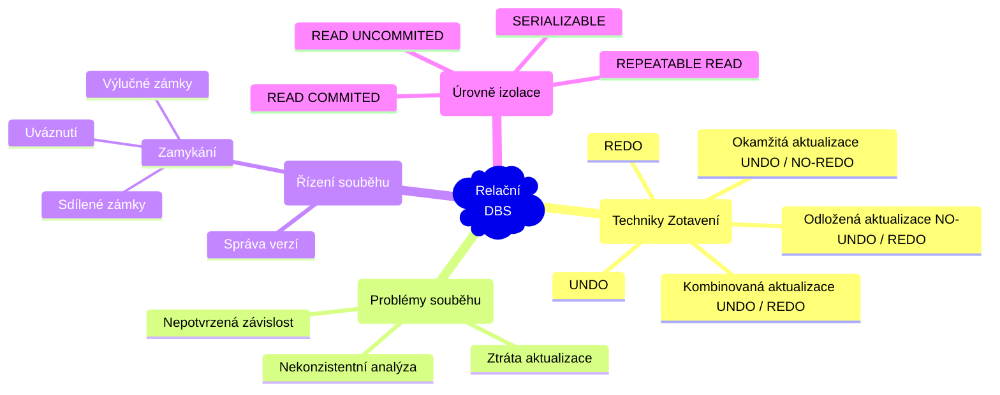
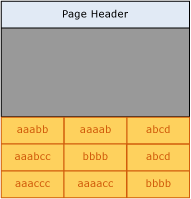
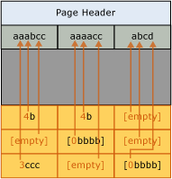
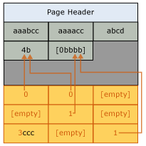
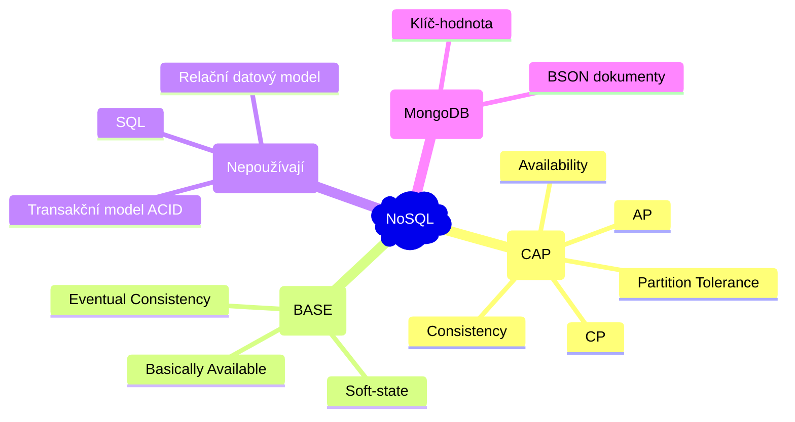

# Databázové systémy

- [1. Relační datový model, SQL; funkční závislosti, dekompozice a normální formy](#1-relační-datový-model-sql-funkční-závislosti-dekompozice-a-normální-formy)
  - [1.1. Funkční závislosti](#11-funkční-závislosti)
  - [1.2. Normální formy](#12-normální-formy)
- [2. Transakce, zotavení, log, ACID, operace COMMIT a ROLLBACK; problémy souběhu, řízení souběhu: zamykání, úroveň izolace v SQL](#2-transakce-zotavení-log-acid-operace-commit-a-rollback-problémy-souběhu-řízení-souběhu-zamykání-úroveň-izolace-v-sql)
  - [2.1. Techniky zotavení](#21-techniky-zotavení)
  - [2.2. Souběh](#22-souběh)
  - [2.3. Techniky řízení souběhu](#23-techniky-řízení-souběhu)
  - [2.4. Úrovně izolace](#24-úrovně-izolace)
- [3. Procedurální rozšíření SQL, PL/SQL, T-SQL, triggery, funkce, procedury, kurzory, hromadné operace](#3-procedurální-rozšíření-sql-plsql-t-sql-triggery-funkce-procedury-kurzory-hromadné-operace)
- [4. Fyzická implementace databázových systémů: tabulka (halda a shlukovaná tabulka) a index typu B-strom, materializované pohledy, rozdělení dat](#4-fyzická-implementace-databázových-systémů-tabulka-halda-a-shlukovaná-tabulka-a-index-typu-b-strom-materializované-pohledy-rozdělení-dat)
- [5. Plán vykonávání dotazů, logické a fyzické operace, náhodné a sekvenční přístupy, ladění vykonávání dotazů](#5-plán-vykonávání-dotazů-logické-a-fyzické-operace-náhodné-a-sekvenční-přístupy-ladění-vykonávání-dotazů)
- [6. Stránkování výsledku dotazu, komprimace tabulek a indexů, sloupcové a řádkové uložení tabulek](#6-stránkování-výsledku-dotazu-komprimace-tabulek-a-indexů-sloupcové-a-řádkové-uložení-tabulek)
  - [6.1. Stránkování výsledku dotazu](#61-stránkování-výsledku-dotazu)
  - [6.2. Komprimace](#62-komprimace)
    - [6.2.1. Prefixová komprimace](#621-prefixová-komprimace)
    - [6.2.2. Slovníková komprimace](#622-slovníková-komprimace)
  - [6.3. Řádkové uložení dat](#63-řádkové-uložení-dat)
  - [6.4. Sloupcové uložení dat](#64-sloupcové-uložení-dat)
- [7. CAP teorém, NoSQL DBS, BASE, replikace, MongoDB, CRUD operace](#7-cap-teorém-nosql-dbs-base-replikace-mongodb-crud-operace)
  - [7.1. BASE](#71-base)
  - [7.2. MongoDB](#72-mongodb)

## 1. Relační datový model, SQL; funkční závislosti, dekompozice a normální formy

**Relační datový model** je způsob uložení dat v databázi pomocí relací $R\subseteq \text{atributy} \times \text{n-tice}$. V praxi často uvažujeme tabulky s uspořádanými řádky a sloupci (relace $R$ nedefinuje uspořádání). Výběr atributů je **projekce** a výběr řádku je **selekce**.


**SQL** *(Structured Query Language)* je **deklarativní jazyk** (tzn. specifikuje co udělat, ne jak to udělat) pro provádění dotazů nad relačními databázovými systémy. Zahrnuje příkazy které můžeme rozdělit do tří kategorií:

1. **DQL - Data Query Language** - dotazování, založeno na relační algebře `SELECT`
2. **DML - Data Manipulation Language** - úprava obsahu tabulek `INSERT`, `UPDATE`, `DELETE`
3. **DDL - Data Definition Language** - úprava struktury tabulky `CREATE`, `ALTER`, `DROP`

### 1.1. Funkční závislosti

> Buď $R$ relace a buď $X,Y\subseteq R$ množiny atributů. Řekneme, že $Y$ **funkčně závisí** na $X$ (značíme $X\to Y$) pokud platí pro každé dvě $n$-tice:
>
> $$(\forall t_1,t_2\in R)\colon \left[t_1[X]=t_2[X]\right] \implies \left[t_1[Y]=t_2[Y]\right].$$
>
> (Pokud mají dvě n-tice stejnou hodnotu pro atributy $X$, musí mít stejnou hodnotu i pro atributy $Y$. `False => True`, takže každý atribut závisí na atributu s unikátními hodnotami.)

**Armstrongovy axiomy**. Bud $X,Y,Z$ množiny atributů relace $R$.

1. **Reflexivita**: Pokud $Y\subseteq X$, pak $X\to Y$.
2. **Rozšíření**: Pokud $X\to Y$, pak $XZ\to YZ$ pro libovolné $Z$.
3. **Transitivita**: Pokud $X\to Y$ a $Y\to Z$, pak $X\to Z$.

Navíc lze dokázat platnost:

1. **Dekompozice**: Pokud $X\to YZ$, pak $X\to Y$ a $X\to Z$. Důkaz:
   1. $X\to YZ$ (dáno)
   2. $YZ\to Y$ (reflexivita)
   3. $[X\to YZ \land YZ\to Y] \implies X\to Y$ (transitivita)
   4. (stejně jako 2,3 pro $X\to Z$)
2. **Sjednocení**: Pokud $X\to Y$ a $X\to Z$, pak $X\to YZ$. Důkaz:
   1. $X\to Y$ a $X\to Z$ (dáno)
   2. $X\to Z \implies X\to XZ$ (rozšíření o $X$)
   3. $X\to Y \implies XZ\to YZ$ (rozšíření o $Z$)
   4. $X\to YZ$ (tranzitivita)

### 1.2. Normální formy

**Klíč** je nejmenší podmnožina atributů, která jednoznačně identifikuje jinou množinu atributů.

Proč normální formy? Konzistence dat, odstranění redundance. Např. `Nakup(JmenoZakaznika, Produkty, Cena)` není v žádné NF. Normální formy jsou mírou kvality návrhu databáze.

1. **1NF** - **atributy musí být atomické** (nedělitelné) - např. `Produkt = "jablko, hruška"` nebo `Adresa = "Ostrava, Hlavní třída 25"` není 1NF. Takové atributy je třeba rozdělit na více atributů nebo tabulek s vazbou 1:N.
2. **2NF** - **každý neklíčový atribut** je **závislý** na ***celém* klíči**, ne jen na jeho části. Důsledek: atributy v tabulce mezi sebou nemají vztah M:N (`zákazník x produkt` je M:N) (+1NF).
3. **3NF** - **nesmí existovat závislosti mezi atributy, které nejsou součástí klíče**. Data nejsou tranzitivně závislá (+2NF).
4. **BCNF** (Boyce-Codd) - pro každou funkční závislost `X -> Y` platí, že `X` je klíč tabulky (+3NF).

**Uzávěr** množiny atributů $X$ (značíme $X+$) je množina všech atributů, které podle atributů $X$ můžeme dohledat ("podle šipek").

**Dekompozice** je proces rozdělení tabulky na několik menších, aby byly splněny podmínky normálních forem.

<details><summary> Příklad </summary>

Tabulka `Kniha`. Předpokládáme jednoho autora a *kandidátní klíč* `(Autor, Název)`.

| Autor | Název | Formát | Strany | Cena | Nakladatelství | Země nakladatelství |
|--------|-------|--------|--------|------|-----------------|---------------------|
| Codd | Databázové systémy | kniha | 300 | 499 | Cambridge | UK |
| Codd | Databázové systémy | e-kniha | 300 | 399 | Cambridge | UK |
| Boyce | Databázové systémy 2 | e-kniha | 400 | 299 | Harvard | USA |

Cena závisí na formátu a tato závislost *není závislá na klíči*. Vytvoříme tabulku `FormatCena(*Název, *Formát, Cena)` a tabulku `Kniha(*Název, Autor, Formát, Strany, Nakladatelství, Země nakladatelství)`, kde klíč je `Název`. Tím získáme 2NF.

Dále existuje tranzitivní závislost `Název -> Nakladatelství -> Země nakladatelství`. Vytvoříme tabulku `Nakladatelství(*Nakladatelství, Země)`. Tím získáme 3NF.

</details>

Poznámky:

- V **konceptuálním modelu** (entity-relation diagramy) nezáleží na volbě databázového systému.
- Databáze je **konzistentní** právě tehdy, když jsou splněny všechny **integritní omezení**.
- **Databázový systém / Systém pro řízení báze dat (SŘBD)** je aplikace poskytující rozhraní pro vytvoření databáze a pro komunikaci s databází.
- **Databáze** je (multi)množina vzájemně propojených dat, které jsou uloženy v databázovém systému.

## 2. Transakce, zotavení, log, ACID, operace COMMIT a ROLLBACK; problémy souběhu, řízení souběhu: zamykání, úroveň izolace v SQL



> **Transakce** je sekvence příkazů která převede databázi z jednoho korektního stavu do druhého korektního stavu. Transakce je atomická operace, buď jsou provedeny všechny příkazy transakce, nebo žádný. Transakce začíná operací `BEGIN TRANSACTION` a končí provedením operací `COMMIT` nebo `ROLLBACK`.

- `COMMIT` – úspěšné ukončení transakce. Programátor oznamuje *transakčnímu manageru*, že transakce byla úspěšně dokončena, databáze je nyní v *korektním stavu*, a všechny změny provedené v rámci transakce mohou být trvale uloženy v databázi.
- `ROLLBACK` – neúspěšné provedení transakce. Programátor oznamuje *transakčnímu manageru*, že databáze může být v nekorektním stavu a všechny změny provedené v rámci transakce musí být zrušeny *(roll back / undo)*.

**Zotavení** znamená zotavení databáze z nějaké chyby (přetečení hodnoty atributu, pád systému). *Základní jednotkou zotavení je transakce*.

<details><summary> Příklad: Transakce mezi účty </summary>

Chceme převést 100 Kč z účtu číslo 345 na účet číslo 789. Převod musí být proveden jako jedna atomická (nedělitelná) operace, ačkoli se jedná o dvě operace `UPDATE`.

```sql
BEGIN TRANSACTION;
try {
  UPDATE Account 345 { balance -= 100; }
  UPDATE Account 789 { balance += 100; }
  COMMIT;
}
catch(SqlException) {
  ROLLBACK;
}
```

</details>

Jak může dojít k chybě při provádění transakce?

- lokální chyby:
  - chyba v dotazu,
  - přetečení hodnoty atributu
- chyby globální:
  - chyby systémové *(soft crash)* - výpadek proudu, pád systému či SŘBD
  - chyby média *(hard crash)*

Pro podporu operace `ROLLBACK` má systém k dispozici soubor `log` nebo `journal` na disku, kde jsou zaznamenány detaily o všech provedených operacích.

Transakce nesmí být uvnitř jiné transakce.

> Řekneme, že databáze je **konzistentní** právě tehdy, když jsou splněny všechny integritní omezení.

Operace `COMMIT` zavádí tzv. **potvrzovací bod** *(commit point)*. Operace `ROLLBACK` vrací DBS k předchozímu potvrzovacímu bodu.

> V relační databázi musí každá transakce splňovat vlastnosti **ACID**:
>
> - **A**tomicity *(atomičnost)* - jsou provedeny všechny operace transakce nebo žádná.
> - **C**orrectness *(korektnost)* - transakce převádí korektní stav databáze do jiného korektního stavu.
> - **I**solation *(izolovanost)* - transakce jsou navzájem izolované, změny provedené jednou transakcí jsou pro ostatní viditelné až po provední `COMMIT`.
> - **D**urability *(trvalost)* - jakmile je transakce potvrzena, změny v databázi se stávají trvalými (i po případném pádu systému).

Kvůli efektivity se používá *vyrovnávací paměť* umístěna v hlavní paměti (RAM). Databáze je kvůli perzistence dat umístěna na disku v datovém souboru.

Všechny změny musí být zapsány do logu před samotným zápisem změn do databáze. Před ukončením vykonávání operace `COMMIT` je do logu zapsán tzv. `COMMIT` záznam. Takovéto pravidlo nazýváme **pravidlo dopředného zápisu do logu** *(write-ahead log rule)*. Systém je pak schopen na základě informací z logu provést zotavení databáze.

Proč nezapisovat změny rovnou na disk? Protože potom často dochází k náhodnému přístupu k paměti (aktualizace datových struktur), zatímco do logu se zapisuje sekvenčně (řádově rychleji).

### 2.1. Techniky zotavení

Během zotavení se po restartu systému provádí pro jednotlivé transakce operace:

- `UNDO` - stav transakce není znám (nebyla ukončena). Transakce musí být zrušena.
- `REDO` - transakce byla úspěšně ukončena (příkazem `COMMIT`), ale změny z *logu* nebyly přeneseny do databáze. Transakce musí být přepracována.

Techniky aktualizace logu a databáze:

1. **Odložená aktualizace** `(NO-UNDO / REDO)`
    - Aktualizace logu a DB se provádí až po potvrzení transakce. Všechny změny se zaznamenávají do paměti.
    - Teprve po provední `COMMIT` se aktualizace zapíšou do logu a potom do DB (pravidlo dopředného zápisu do logu).
    - V případě selhání není nutno provádět `UNDO`.
    - Hrozí přetečení vyrovnávací paměti.

      

2. **Okamžitá aktualizace** `(UNDO / NO-REDO)`
    - Zotavení okamžitou aktualizací provádí aktualizace logu a databáze *po každé aktualizaci transakce*.
    - Pokud transakce selže před dosažením potvrzovacího bodu, pak je nutné provést `UNDO` (na disk byly zapsány aktualizace, které musí být zrušeny).
  
      

    - Do logu se ukládají *původní hodnoty*, což umožní systému provést při zotavení operaci `UNDO`.
    - Dochází k velkému počtu zápisů do databáze, ale nedochází k přetečení vyrovnávací paměti.
3. **Kombinovaná aktualizace** `(UNDO / REDO)`
    - V praxi se používá kombinovaný `UNDO / REDO` algoritmus.
      - Odložená aktualizace – hrozí přetečení paměti.
      - Okamžitá aktualizace – nízký výkon (častý zápis do databáze).
    - Aktualizace jsou zapisovány do logu po `COMMIT`.
    - K aktualizaci databáze dochází v určitých časových intervalech - kontrolních bodech **(check points)**. Např. po určitém počtu zapsaných záznamů do logu.

      

    - V čase kontrolního bodu $t_c$ jsou:
      - Aktualizace transakce $T_1$ zapsány do databáze.
      - Aktualizace transakcí $T_2$ a $T_3$ provedené před $t_c$ zapsány do databáze (v logu jsou uloženy staré hodnoty pro případné `UNDO`).
    - Zotavení ze systémové chyby $t_f$:
      - $T_1$ neřešíme, aktualizace zapsaný v $t_c$.
      - $T_5$ neřešíme, `COMMIT` nebyl proveden a žádné změny nebyly ještě zapsány.
      - $T_2$ `REDO` pro aktualizace po $t_c$ (byly zapsány do logu při `COMMITu`).
      - $T_4$ `REDO` pro všechny aktualizace.
      - $T_3$ `UNDO` pro aktualizace provedené do $t_c$.
    - O transakce $T_3$ a $T_5$ přijdeme, nebyly potvrzené commitem.

### 2.2. Souběh

Souběh nastává, pokud v DBS současně běží několik transakcí.

Problémy souběhu, které mohou nastat jsou:

1. **Ztráta aktualizace** *(lost update)*

    

    - Dojde ke ztrátě aktualizace provedené transakcí $A$ v čase $t_3$.

2. **Nepotvrzená závislost** *(uncommitted dependency)*

    

    1. Transakce $B$ načetla v čase $t_2$ nepotrzenou aktualizaci $x$ zapsanou transakcí $A$ v čase $t_1$.
    2. Transakce $A$ je v čase $t_3$ zrušena.
    3. Transakce $B$ dále pracuje s chybnými hodnotami $x$ (WR konflikt, špinavé čtení).

    

    1. Transakce B se stala závislou na nepotvrzené změně z času $t_1$.
    2. V čase $t_3$ je proveden `ROLLBACK` transakce $A$, který zapříčiní ztrátu aktualizace z času $t_2$ zapsanou transakcí $B$ (bude místo toho nastavená hodnota z času před $t_1$).

3. **Nekonzistentní analýza** *(inconsistent analysis)*
    - Jedna transakce počítá s daty, které jiná transakce upraví. Např. suma hodnot, kdy nějaká transakce upraví hodnotu, kterou už první transakce sečetla (tzn. suma není konzistentní se stavem databáze).

Pokud dvě transakce pracují se stejným záznamem, mohou nastat čtyři konflikty:

1. **RR** - read-read (neovlivňují se)
2. **RW** - může zapříčinit **problém nekonzistentní analýzy** nebo **neopakovatelné čtení** (čtení stejné n-tice s jinými hodnotami)
3. **WR** - může zapříčinit **problém nepotvrzené závislosti** nebo **špinavé čtení** (čtení nepotvrzené hodnoty)
4. **WW** - může zapříčinit **problém nepotvrzené závislosti** i **problém ztráty aktualizace** (špinavý zápis)

### 2.3. Techniky řízení souběhu

- **Zamykání** - jedna kopie dat a přidělování zámků transakcím. Pokud transakce chce provést čtení nebo zápis, tak požádá o zámek na daný objekt. **Dvoufázové uzamykání**:
  1. Pro **čtení** si transakce vyžádá **sdílený zámek** `S`.
  2. Pro **aktualizace** si transakce vyžádá **výlučný zámek** `X`.
  3. Pokud zámek drži jiná transakce, přejde transakce do **stavu čekání** (nesmí nastat **uváznutí** - **deadlock**).
  4. Výlučné i sdílené zámky jsou uvolněny na konci transakce (`COMMIT` nebo `ROLLBACK`).
- **Správa verzí** - při aktualizaci dat DBS vytváří kopie a určuje, která kopie má být viditelná pro ostatní transakce.
  - Vyšší režie, vyšší požadavky na paměť.
  - Pokud převyšují operace `READ`, tak správa verzí je efektivnější.
- **Kombinace** zamykání a správy verzí (časté v SŘBD, např. Oracle).

Uváznutí/deadlock:

| Transakce $A$                  | Čas | Transakce $B$                  |
|-----------------------------|-----|------------------------------|
| získán zámek `S` na $r_1$        | $t_1$  | -                            |
| -                           | $t_2$  | získán zámek `S` na $r_2$         |
| požadavek na zámek `X` na $r_2$  | $t_3$  | -                            |
| wait                        | $t_4$  | požadavek na zámek `X` na $r_1$   |
| wait                        |  $t_5$   | wait                         |
| wait                        |  $\vdots$   | wait                         |

- **Detekce uváznutí**:
  - Nastavení **časových limitů**.
  - **Detekce cyklu** v grafu `Wait-For`, kde se zaznamenávají čekající transakce. Jedna z uváznutých transakcí je zrušena (`ROLLBACK`) a potom spuštěna znova.
- **Prevence pomocí časových razítek**. Jedna z transakcí, která by uvázla, je zrušena podle jejího vzniku (časového razítka).

> Pokud je **plán transakcí serializovatelný**, pak se neprojevují negativní vlivy souběhu a je dodržena **izolace** transakcí ve smyslu ACID. **Dvoufázové zamykání zaručuje serializovatelnost**.

### 2.4. Úrovně izolace

Izolace snižuje propustnost (výkon) DBS. Nicméně nižší izolace přináší rizika problémů souběhu.

| Úroveň izolace   | Špinavé čtení | Neopakovatelné čtení | Výskyt fantomů |
|------------------|----------------|------------------------|-----------------|
| `READ UNCOMMITTED` | Ano            | Ano                    | Ano             |
| `READ COMMITTED`   | Ne             | Ano                    | Ano             |
| `REPEATABLE READ`  | Ne             | Ne                     | Ano             |
| `SERIALIZABLE`     | Ne             | Ne                     | Ne              |

- `SET TRANSACTION ISOLATION LEVEL SERIALIZABLE;`
- `RU` - uvolnění *výlučných zámků* před koncem transakce.
- `RC` - dřívejší uvolnění *sdílených zámků*.

<details><summary> Výskyt fantomů </summary>

| Transakce A                              | Čas | Transakce B                                |
|------------------------------------------|-----|---------------------------------------------|
| `SELECT * FROM student`                    | $t_1$  |                                            |
| `WHERE rocnik BETWEEN 1 AND 2`             |     |                                             |
|                                         | $t_2$  | `INSERT INTO student`                         |
|                                          |     | `VALUES('mar006', 'Marek', 2)`                |
|                                          | $t_3$  | `COMMIT`                                      |
| `SELECT * FROM student`                    | $t_4$  |                                            |
| `WHERE rocnik BETWEEN 1 AND 2`             |     |                                             |
| `COMMIT`                                   | $t_5$  |                                            |

</details>

Navíc SŘBD umožňují explicitní zamykání programátorem.

## 3. Procedurální rozšíření SQL, PL/SQL, T-SQL, triggery, funkce, procedury, kurzory, hromadné operace

- **Trigger** je PL/SQL blok, který je spouštěn v závislosti na nějakém příkazu DML jako je `INSERT`, `UPDATE` nebo `DELETE`.
  - Např. trigger, který každý před smazáním záznamu `BEFORE DELETE` záznam uloží do historizační tabulky.

```sql
CREATE [OR REPLACE] TRIGGER jmeno_triggeru
  {BEFORE | AFTER | INSTEAD OF}
  {INSERT [OR] | UPDATE [OR] | DELETE}
  [OF jmeno_sloupce]
  ON jmeno_tabulky
  [REFERENCING OLD AS stara_hodnota NEW AS nova_hodnota]
  [FOR EACH ROW [WHEN (podminka)]]
BEGIN
  prikazy
END;
```

- **Anonymní procedury** jsou nepojmenované procedury, které nemohou být volány z jiné procedury.
- **Pojmenované procedury** obsahují *hlavičku se jménem a parametry* procedury.
  - Na rozdíl od anonymních procedur jsou pojmenované procedury **předkompilovány a uloženy v databázi**.
  - Pro parametry se používá prefix `p_`.
  - `mod` může být `{IN | OUT | IN OUT}` - vstupní, výstupní nebo vstupně výstupní proměnná.
  - Proměnné typu `VARCHAR2` nebo `NUMBER` se uvádějí bez závorek, které by specifikovaly jejich velikost.

```sql
CREATE [OR REPLACE] PROCEDURE jmeno_procedury
  (p_jmeno_parametru [mod] datovy_typ, ...)
IS | AS
  v_definice_lokalnich_promennych
BEGIN
  -- tělo procedury
END [jmeno_procedury];
```

- **(Pojmenované) funkce** oproti procedurám specifikují návratový typ a *musí vracet hodnotu*.

```sql
CREATE [OR REPLACE] FUNCTION jmeno_funkce
  (p_jmeno_parametru [mod] datovy_typ, ...)
  RETURN navratovy_datovy_typ
IS | AS
  v_definice_lokalnich_promennych
BEGIN
  -- tělo funkce
END [jmeno_funkce];
```

- **Kurzor** je *pomocná proměnná* vytvořená *po* provedení nějakého SQL příkazu.

```sql
CURSOR jmeno_kursoru IS vysledek_prikazu_select;
```

- **Hromadné operace** umožňují efektivní práci s kolekcemi (pole).

```sql
-- načtení do kolekce
SELECT ...
BULK COLLECT INTO v_my_collection[,v_my_other_collection] ...
FROM MyTable;

-- hromadná SQL operace (třeba UPDATE)
FORALL index IN lower_bound..upper_bound
  -- SQL
;
```

<details><summary> Příklad hromadné operace </summary>

Tento blok jazyka PL/SQL deklaruje dvě vnořené tabulky `empl_ids` a `names` a poté provede hromadný sběrný dotaz pro získání ID a příjmení zaměstnanců z tabulky `Employees`.

Následně příkazem `FORALL` provede aktualizaci tabulky `Myemp` s odpovídajícími jmény na základě získaných ID zaměstnanců.

```sql
DECLARE
  TYPE NumTab IS TABLE OF Employees.employee_id%TYPE;
  TYPE NameTab IS TABLE OF Employees.last_name%TYPE;
  
  empl_ids NumTab;
  names NameTab;
BEGIN
  SELECT employee_id, last_name
  BULK COLLECT INTO empl_ids, names
  FROM Employees
  WHERE employee_id > 1000;

  --rest of the code...

  FORALL i IN empl_ids.FIRST..empl_ids.LAST
    UPDATE Myemp
    SET name = names(i)
    WHERE Employee = empl_ids(i);
END;
```

</details>

## 4. Fyzická implementace databázových systémů: tabulka (halda a shlukovaná tabulka) a index typu B-strom, materializované pohledy, rozdělení dat

## 5. Plán vykonávání dotazů, logické a fyzické operace, náhodné a sekvenční přístupy, ladění vykonávání dotazů

## 6. Stránkování výsledku dotazu, komprimace tabulek a indexů, sloupcové a řádkové uložení tabulek

### 6.1. Stránkování výsledku dotazu

> Někdy nepotřebujeme v aplikaci zobrazit všechny výsledky dotazu najednou. Např. tabulka obsahuje 100 000 záznamů, ale v UI se uživateli zobrazuje jen jedna stránka záznamů, např. 100.

1. **Cachování na úrovni aplikačního serveru** - je vhodné (bezproblémové) pouze v případě **statických** nebo téměř statických dat.
2. **Stránkování na úrovni DBS a jeho podpora v ORM** - např. metoda třídy `Student`: `Student.Select(loIndex, hiIndex)`

Dotaz se stránkováním (1. stránka):

```sql
SELECT * FROM Customer
WHERE residence = 'Ostrava'
ORDER BY lname, idCustomer
OFFSET 0
ROWS FETCH NEXT 100 ROWS ONLY;
```

### 6.2. Komprimace

- Ke komprimaci v DBS se obvykle využívají spíše jednodušší, starší a rychlé algoritmy, např. **RLE (Run-Length-Encoding)**.
- Upřednostňujeme **propustnost** *(rychlost komprese/dekomprese)* před **kompresním poměrem** *(kolik se uvolní místa)*.
- Kódy proměnné délky *(Eliasovy, Fibonacciho, atd.)* se spíše nepoužívají, protože jsou pomalejší.
- Používá se např. **prefixová komprimace klíčů** B-stromu. Využívá se především u složených klíčů s větším počtem atributů.
- Kdy se vyplatí vyšší komprimace i za cenu pomalejší rychlosti dotazu *(vyšší komprimační poměr, nižší propustnost)*? Např. pro **historická data**, které se nepoužívají příliš často.

#### 6.2.1. Prefixová komprimace

1. Pro každý sloupec je určena hodnota, kterou lze použít ke zmenšení úložného prostoru pro hodnoty v každém sloupci.
2. Tyto hodnoty jsou uloženy jako metadata *(compression information - CI)* za hlavičkou tabulky.
3. Shodující se prefixy jsou nahrazeny referencemi do *CI*.

|||
|--|--|
|||

#### 6.2.2. Slovníková komprimace

Slovníková komprimace je aplikována po prefixové. Není omezena jen na jednotlivé sloupce, funguje nad celou tabulkou. Zjednodušeně se kódují opakující se sekvence (kód je umístěn do *CI*).



### 6.3. Řádkové uložení dat

- V blocích haldy jsou data uložena po záznamech, mluvíme o **řádkovém uložení** **(rowstore)**.
- Řádkové uložení je **výhodné** v případě **projekce na všechny nebo větší počet atributů**:
  - `SELECT * FROM Customer` – sekvenční průchod haldou.
  - `SELECT * FROM Customer WHERE idCustomer=1` – bodový dotaz v indexu, přístup k záznamu v haldě.
- Naopak je řádkové uložení **nevýhodné** v případě **projekce na nízký počet atributů**:
  - `SELECT AVG(sysdate - birthday) FROM Customer` – sekvenční průchod tabulkou a počítání součtu věku, bloky ovšem obsahují i hodnoty ostatních atributů.

### 6.4. Sloupcové uložení dat

- Pokud v dotazech pracujeme jen s několika **málo atributy** (reálné tabulky mohou mít desítky atributů), můžeme uvažovat o tzv. **sloupcovém uložení dat (columnstore)**.
- Jednotlivé hodnoty neobsahují identifikátor řádku (klíč, RID atd.). **Záznamy jsou rekonstruovány podle pořadí hodnot ve sloupci!**
- Sloupcové uložení je výhodné zejména, pokud dotazy pracují s **malým počtem atributů** při **sekvenčním průchodu** tabulky (typicky **agregace**). Je to tedy "opačný" koncept ke konceptu indexu - sekvenční průchod menším objemem dat při nízké selektivitě dotazů.
- Je výhodné data ve sloupcích třídit? Kvůli komprimaci a vykonávání některých dotazů ano, nicméně, *kvůli rekonstrukci záznamů, musíme zachovat stejné pořadí* v jednotlivých sloupcích, případně k setříděným sloupcům uložit klíč (nebo RID).
- Interně může být každý sloupec reprezentovaný jednou haldou.
- Při sloupcovém uložení můžeme dosáhnout **vyššího kompresního poměru**.

## 7. CAP teorém, NoSQL DBS, BASE, replikace, MongoDB, CRUD operace



> Mějme **distribuovaný DBS** (DDBS) rozložený na více počítačích v síti (tzv. **uzlech**).
>
> **CAP teorém** (**Brewerův teorém**) tvrdí, že pro *distribuovaný DBS* není možné dodržet více než dvě vlastnosti z těchto tří:
>
> - **Konzistence (Consistency)**: každé čtení vrátí buď výsledek posledního zápisu, nebo chybu.
> - **Dostupnost (Availability)**: každé čtení vrátí výsledek (nikdy ne chybu), nemusí se ale jednat o výsledek posledního zápisu.
> - **Odolnost k přerušení sítě (Partition tolerance)**: systém pracuje dál i v případě, že dojde ke ztrátě nebo zdržení libovolného počtu zpráv mezi uzly.
>
> **Při výskytu přerušení systém volí mezi dostupností a konzistencí**, není možné zajistit oboje. Dostupnost a konzistenci je možné zajistit jen v případě neexistence přerušení.

V případě výskytu přerušení sítě, systém musí vybírat mezi dvěma akcemi:

1. Zrušit operaci a tak snížit dostupnost, ale zajistit konzistenci. V případě výskytu přerušení, systém vrátí chybu.
2. Vykonat operaci a tak zachovat dostupnost, ale riskovat nekonzistenci. V případě výskytu přerušení, systém vrátí dostupnou verzi výsledku, nemusí se tedy jednat o výsledek posledního zápisu.

Typicky rozlišujeme dva typy DBS na základě CAP teorému:

- **CP** - konzistence a odolnost vůči přerušení (relační DBS s ACID)
- **AP** - dostupnost a odolnost vůči přerušení (NoSQL DBS s BASE)

> NoSQL databázové systémy jsou označení poměrně široké třídy DBS, které (spíše):
>
> - Nepoužívají relační datový model,
> - Nepoužívají SQL,
> - Nepoužívají transakční model ACID,
> - Používají model **klíč-hodnota** (např. JSON dokument) nebo komplikovanější datový model (**strom** pro XML dokumenty nebo **graf**),
> - Nejsou konkurenční k relačním DBS, jsou určeny pro jiné problémy.

- Oracle a MS SQL taky umožňují ukládání grafů, XML dokumentů apod. Nicméně pracují s těmito daty pomocí modelu ACID.
- Nelze tvrdit, že NoSQL je lepší než transakční model. Záleží na aplikaci.

### 7.1. BASE

**Případná konzistence (Eventual consistency)** je model konzistence používaný v **distribuovaných** databázových systémech k dosažení vysoké dostupnosti.

Případná konzistence znamená, že pokud provedeme nějaké zápisy a systém bude pracovat **dostatečně dlouho bez dalších zápisů, data se nakonec zkonsolidují**: další čtení pak budou vracet stejnou hodnotu (posledního zápisu).

> Systémy založené na **případné konzistenci** jsou často klasifikovány jako systémy s vlastností **BASE**:
>
> - **V podstatě dostupné (Basically-available)**: Čtení a zápis jsou **maximálně dostupné** s použitím všech uzlů sítě, ale **nemusí být konzistentní**, což znamená, že **čtení nemusí vracet poslední zápis**.
> - **Soft-state**: Není garantována konzistence. Po zápisech a nějakém čase chodu systému existuje pouze určitá pravděpodobnost konvergence dat $\Rightarrow$ případná konzistence.
> - **Případná konzistence (Eventual consistency)**.

### 7.2. MongoDB

- **Dokumentová databáze** typu **klíč-hodnota**, kde dokumentem je formát podobný **JSON** (**BSON**).
- Dokument je záznam v dokumentové databázi.
- V JSON dokumentech nepoužíváme dekompozici na entitní typy: ukládáme entity v jednom dokumentu.
- Neexistuje schéma databáze (můžeme ale použít, pokud chceme).
- Položky v dokumentu odpovídají roli sloupců v SQL databázi a lze je indexovat pro zvýšení rychlosti vyhledávání.
- **Nevýhoda**: **redundance**, není možná validace dat dle schématu.
- **Výhoda**: **jednodušší dotazování**, ptáme se na dokument, **nepoužíváme operaci spojení** pro spojování entit.

> **Replikace dat** znamená, že data jsou uložena v několika kopiích (replikách) na uzlech DDBS systému. Cílem je zvýšení dostupnosti.

**CRUD** - `Create`, `Read`, `Update`, `Delete`
