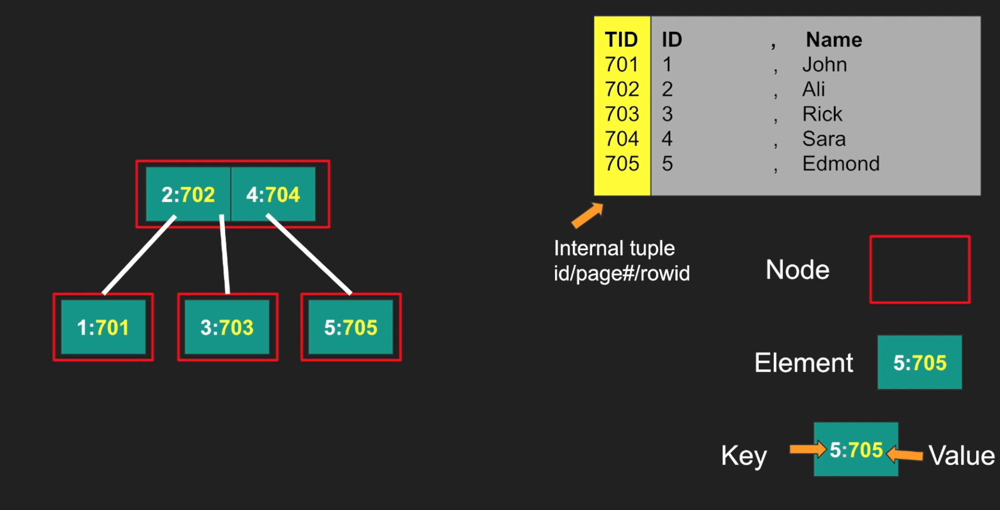

# Databázové systémy

- [1. Relační datový model, SQL; funkční závislosti, dekompozice a normální formy](#1-relační-datový-model-sql-funkční-závislosti-dekompozice-a-normální-formy)
  - [1.1. Funkční závislosti](#11-funkční-závislosti)
  - [1.2. Normální formy](#12-normální-formy)
- [2. Transakce, zotavení, log, ACID, operace COMMIT a ROLLBACK; problémy souběhu, řízení souběhu: zamykání, úroveň izolace v SQL](#2-transakce-zotavení-log-acid-operace-commit-a-rollback-problémy-souběhu-řízení-souběhu-zamykání-úroveň-izolace-v-sql)
  - [2.1. Techniky zotavení](#21-techniky-zotavení)
  - [2.2. Souběh](#22-souběh)
  - [2.3. Techniky řízení souběhu](#23-techniky-řízení-souběhu)
  - [2.4. Úrovně izolace](#24-úrovně-izolace)
- [3. Procedurální rozšíření SQL, PL/SQL, T-SQL, triggery, funkce, procedury, kurzory, hromadné operace](#3-procedurální-rozšíření-sql-plsql-t-sql-triggery-funkce-procedury-kurzory-hromadné-operace)
- [4. Fyzická implementace databázových systémů: tabulka (halda a shlukovaná tabulka) a index typu B-strom, materializované pohledy, rozdělení dat](#4-fyzická-implementace-databázových-systémů-tabulka-halda-a-shlukovaná-tabulka-a-index-typu-b-strom-materializované-pohledy-rozdělení-dat)
  - [4.1. Tabulka typu halda (heap table)](#41-tabulka-typu-halda-heap-table)
  - [4.2. Shlukovaná tabulka](#42-shlukovaná-tabulka)
  - [4.3. Index typu B-strom](#43-index-typu-b-strom)
    - [4.3.1. B-strom](#431-b-strom)
    - [4.3.2. B+strom](#432-bstrom)
    - [4.3.3. Rozsahový dotaz](#433-rozsahový-dotaz)
    - [4.3.4. Složený klíč indexu](#434-složený-klíč-indexu)
  - [4.4. Materializované pohledy (materialized views)](#44-materializované-pohledy-materialized-views)
  - [4.5. Rozdělení dat (partitioning)](#45-rozdělení-dat-partitioning)
- [5. Plán vykonávání dotazů, logické a fyzické operace, náhodné a sekvenční přístupy, ladění vykonávání dotazů](#5-plán-vykonávání-dotazů-logické-a-fyzické-operace-náhodné-a-sekvenční-přístupy-ladění-vykonávání-dotazů)
  - [5.1. Statistiky pro výběr plánu](#51-statistiky-pro-výběr-plánu)
  - [5.2. Operace spojení (JOIN)](#52-operace-spojení-join)
    - [5.2.1. Nested loop join](#521-nested-loop-join)
    - [5.2.2. Nested loop join with index](#522-nested-loop-join-with-index)
    - [5.2.3. Merge Join (spojení sléváním)](#523-merge-join-spojení-sléváním)
    - [5.2.4. Hash join](#524-hash-join)
    - [5.2.5. Shrnutí](#525-shrnutí)
    - [5.2.6. Použití indexu při ladění dotazů se spojením](#526-použití-indexu-při-ladění-dotazů-se-spojením)
- [6. Stránkování výsledku dotazu, komprimace tabulek a indexů, sloupcové a řádkové uložení tabulek](#6-stránkování-výsledku-dotazu-komprimace-tabulek-a-indexů-sloupcové-a-řádkové-uložení-tabulek)
  - [6.1. Stránkování výsledku dotazu](#61-stránkování-výsledku-dotazu)
  - [6.2. Komprimace](#62-komprimace)
    - [6.2.1. Prefixová komprimace](#621-prefixová-komprimace)
    - [6.2.2. Slovníková komprimace](#622-slovníková-komprimace)
  - [6.3. Řádkové uložení dat](#63-řádkové-uložení-dat)
  - [6.4. Sloupcové uložení dat](#64-sloupcové-uložení-dat)
- [7. CAP teorém, NoSQL DBS, BASE, replikace, MongoDB, CRUD operace](#7-cap-teorém-nosql-dbs-base-replikace-mongodb-crud-operace)
  - [7.1. BASE](#71-base)
  - [7.2. MongoDB](#72-mongodb)

## 1. Relační datový model, SQL; funkční závislosti, dekompozice a normální formy

```mermaid
mindmap
  root )"""Databáze""")
    (Relační datový model)
      relace
        atributy
        entice
      projekce
      selekce
      spojení
    (SQL)
      Deklarativní jazyk
      DQL
        SELECT
      DML
        INSERT
        UPDATE
        DELETE
      DDL
        CREATE
        ALTER
        DROP
      DCL
        GRANT
        REVOKE
      TCL
        BEGIN TRANSACTION
        COMMIT
        ROLLBACK
        SAVEPOINT
    (Funkční závislosti)
      Armstrongovy axiomy
        Reflexivita
        Rozšíření
        Transitivita
      Dekompozice
      Sjednocení
    (Normální formy)
      1NF
      2NF
      3NF
      BCNF
```



**Relační datový model** je způsob uložení dat v databázi pomocí relací $R\subseteq \text{atributy} \times \text{n-tice}$. V praxi často uvažujeme tabulky s uspořádanými řádky a sloupci (relace $R$ nedefinuje uspořádání). Výběr atributů je **projekce** a výběr řádku je **selekce**.


**SQL** *(Structured Query Language)* je **deklarativní jazyk** (tzn. specifikuje co udělat, ne jak to udělat) pro provádění dotazů nad relačními databázovými systémy. Zahrnuje příkazy které můžeme rozdělit do tří kategorií:

1. **DQL - Data Query Language** - dotazování, založeno na relační algebře `SELECT`
2. **DML - Data Manipulation Language** - úprava obsahu tabulek `INSERT`, `UPDATE`, `DELETE`
3. **DDL - Data Definition Language** - úprava struktury tabulky `CREATE`, `ALTER`, `DROP`
4. **DCL - Data Control Language** - řízení přístupu k datům `GRANT`, `REVOKE`
5. **TCL - Transaction Control Language** - řízení transakcí `BEGIN TRANSACTION`, `COMMIT`, `ROLLBACK`, `SAVEPOINT`

### 1.1. Funkční závislosti

> Buď relace $R=\mathcal{A}\times\mathcal{N}$, kde $\mathcal{A}$ je množina atributů a $\mathcal{N}$ je množina $n$-tic. Buď $X,Y\subseteq \mathcal{A}$. Řekneme, že $Y$ **funkčně závisí** na $X$ (značíme $X\to Y$) pokud platí pro každé dvě $n$-tice:
>
> $$(\forall r_1,r_2\in \mathcal{N})\colon \left[r_1[X]=r_2[X]\right] \implies \left[r_1[Y]=r_2[Y]\right].$$
>
> (Pokud mají dvě n-tice stejnou hodnotu pro atributy $X$, musí mít stejnou hodnotu i pro atributy $Y$. `False => True`, takže každý atribut závisí na atributu s unikátními hodnotami.)

**Armstrongovy axiomy**. Bud $X,Y,Z$ množiny atributů relace $R$.

1. **Reflexivita**: Pokud $Y\subseteq X$, pak $X\to Y$.
2. **Rozšíření**: Pokud $X\to Y$, pak $XZ\to YZ$ pro libovolné $Z$.
3. **Transitivita**: Pokud $X\to Y$ a $Y\to Z$, pak $X\to Z$.

Navíc lze dokázat platnost:

1. **Dekompozice**: Pokud $X\to YZ$, pak $X\to Y$ a $X\to Z$. Důkaz:
   1. $X\to YZ$ (dáno)
   2. $YZ\to Y$ (reflexivita)
   3. $[X\to YZ \land YZ\to Y] \implies X\to Y$ (transitivita)
   4. (stejně jako 2,3 pro $X\to Z$)
2. **Sjednocení**: Pokud $X\to Y$ a $X\to Z$, pak $X\to YZ$. Důkaz:
   1. $X\to Y$ a $X\to Z$ (dáno)
   2. $X\to Z \implies X\to XZ$ (rozšíření o $X$)
   3. $X\to Y \implies XZ\to YZ$ (rozšíření o $Z$)
   4. $X\to YZ$ (tranzitivita)

### 1.2. Normální formy

> **Klíč** je nejmenší podmnožina atributů, která jednoznačně identifikuje jinou množinu atributů.
<!--  -->
> **Dekompozice** je proces rozdělení tabulky na několik menších (dle počtu sloupců), aby byly splněny podmínky normálních forem.

Proč normální formy? Konzistence dat, odstranění redundance. Např. `Nakup(JmenoZakaznika, Produkty, Cena)` není v žádné NF. Normální formy jsou mírou kvality návrhu databáze.

1. **1NF** - **atributy musí být atomické** (nedělitelné) - např. `Jméno = "<křestní> <příjmení>"`, `Produkt = "jablko, hruška"` nebo `Adresa = "Ostrava, Hlavní třída 25"` není 1NF. Takové atributy je třeba rozdělit na více atributů nebo tabulek s vazbou 1:N.
2. **2NF** - **každý neklíčový atribut** je **závislý** na ***celém* klíči**, ne jen na jeho části. Důsledek: atributy v tabulce mezi sebou nemají vztah M:N (`zákazník x produkt` je M:N) (+1NF).
3. **3NF** - **nesmí existovat závislosti mezi atributy, které nejsou součástí klíče**. Data nejsou tranzitivně závislá (+2NF).
4. **BCNF** (Boyce-Codd) - pro každou funkční závislost `X -> Y` platí, že `X` je klíč tabulky (+3NF).

**Uzávěr** množiny atributů $X$ (značíme $X+$) je množina všech atributů, které podle atributů $X$ můžeme dohledat ("podle šipek").

<details><summary> Příklad: Kniha </summary>

Tabulka `Kniha`. Předpokládáme jednoho autora a *kandidátní klíč* `(*Autor, *Název)`.

| Autor | Název | Formát | Strany | Cena | Nakladatelství | Země nakladatelství |
|--------|-------|--------|--------|------|-----------------|---------------------|
| Codd | Databázové systémy | kniha | 300 | 499 | Cambridge | UK |
| Codd | Databázové systémy | e-kniha | 300 | 399 | Cambridge | UK |
| Boyce | Databázové systémy 2 | e-kniha | 400 | 299 | Harvard | USA |

`Cena` **není** závislá na celém klíči `(Autor, Název)`! `Cena` závisí na dvojici `(Název, Formát)` a tato závislost *není závislá na klíči*. Vytvoříme tabulku `FormatCena(*Název, *Formát, Cena)` a tabulku `Kniha(*Název, *Autor, Strany, Nakladatelství, Země nakladatelství)`. Tím získáme 2NF.

Dále existuje tranzitivní závislost `Název -> Nakladatelství -> Země nakladatelství`. Vytvoříme tabulku `Nakladatelství(*Nakladatelství, Země)`. Tím získáme 3NF.

</details>

<details><summary> Příklad: Studenti a kurzy </summary>

Původní tabulka (1NF):

| student_id | student_name | course_id | course_name | instructor   |
|------------|--------------|-----------|-------------|--------------|
| 1          | Alice        | CS101     | Databases   | Dr. Smith    |
| 2          | Bob          | CS101     | Databases   | Dr. Smith    |
| 3          | Bob      | CS102     | Algorithms  | Dr. Johnson  |
| 1          | Alice        | CS103     | Networks    | Dr. Brown    |

Kurzy (2NF):

| course_id | course_name | instructor   |
|-----------|-------------|--------------|
| CS101     | Databases   | Dr. Smith    |
| CS102     | Algorithms  | Dr. Johnson  |
| CS103     | Networks    | Dr. Brown    |

(Mohla by existovat (pokud neex. dva kurzy se stejným názvem a jiným učitelem) tranzitivní závislost `course_id -> course_name -> instructor`, proto se nejedná o 3NF.)

Studenti (BCNF):

| student_id | student_name |
|------------|--------------|
| 1          | Alice        |
| 2          | Bob          |
| 3          | Bob      |

Studenti v kurzech (BCNF):

| student_id | course_id |
|------------|-----------|
| 1          | CS101     |
| 1          | CS103     |
| 2          | CS101     |
| 3          | CS102     |

</details>

Poznámky:

- V **konceptuálním modelu** (entity-relation diagramy) nezáleží na volbě databázového systému.
- Databáze je **konzistentní** právě tehdy, když jsou splněny všechny **integritní omezení**.
- **Databázový systém / Systém pro řízení báze dat (SŘBD)** je aplikace poskytující rozhraní pro vytvoření databáze a pro komunikaci s databází.
- **Databáze** je (uspořádaná) (multi)množina vzájemně propojených dat, které jsou uloženy v databázovém systému.

## 2. Transakce, zotavení, log, ACID, operace COMMIT a ROLLBACK; problémy souběhu, řízení souběhu: zamykání, úroveň izolace v SQL

```mermaid
mindmap
  root )"""Relační
  DBS""")
    (Techniky Zotavení)
      UNDO
      REDO
      Odložená aktualizace NO-UNDO / REDO
      Okamžitá aktualizace UNDO / NO-REDO
      Kombinovaná aktualizace UNDO / REDO
    (Problémy souběhu)
      Ztráta aktualizace
      Nepotvrzená závislost
      Nekonzistentní analýza
    (Řízení souběhu)
      Zamykání
        Sdílené zámky
        Výlučné zámky
        Uváznutí
      Správa verzí
    (Úrovně izolace)
      SERIALIZABLE
      READ UNCOMMITED
      READ COMMITED
      REPEATABLE READ
    (ACID)
      Atomicity
      Correctness
      Isolation
      Durability
```



> **Transakce** je sekvence příkazů která převede databázi z jednoho korektního stavu do druhého korektního stavu. Transakce je atomická operace, buď jsou provedeny všechny příkazy transakce, nebo žádný. Transakce začíná operací `BEGIN TRANSACTION` a končí provedením operací `COMMIT` nebo `ROLLBACK`.

- `COMMIT` – úspěšné ukončení transakce. Programátor oznamuje *transakčnímu manageru*, že transakce byla úspěšně dokončena, databáze je nyní v *korektním stavu*, a všechny změny provedené v rámci transakce mohou být trvale uloženy v databázi.
- `ROLLBACK` – neúspěšné provedení transakce. Programátor oznamuje *transakčnímu manageru*, že databáze může být v nekorektním stavu a všechny změny provedené v rámci transakce musí být zrušeny *(roll back / undo)*.

**Zotavení** znamená zotavení databáze z nějaké chyby (přetečení hodnoty atributu, pád systému). *Základní jednotkou zotavení je transakce*.

<details><summary> Příklad: Transakce mezi účty </summary>

Chceme převést 100 Kč z účtu číslo 345 na účet číslo 789. Převod musí být proveden jako jedna atomická (nedělitelná) operace, ačkoli se jedná o dvě operace `UPDATE`.

```sql
BEGIN TRANSACTION;
try {
  UPDATE Account 345 { balance -= 100; }
  UPDATE Account 789 { balance += 100; }
  COMMIT;
}
catch(SqlException) {
  ROLLBACK;
}
```

</details>

Jak může dojít k chybě při provádění transakce?

- lokální chyby:
  - chyba v dotazu,
  - přetečení hodnoty atributu
- chyby globální:
  - chyby systémové *(soft crash)* - výpadek proudu, pád systému či SŘBD
  - chyby média *(hard crash)*

Pro podporu operace `ROLLBACK` má systém k dispozici soubor `log` nebo `journal` na disku, kde jsou zaznamenány detaily o všech provedených operacích.

Transakce nesmí být uvnitř jiné transakce.

> Řekneme, že databáze je **konzistentní** právě tehdy, když jsou splněny všechny integritní omezení.

Operace `COMMIT` zavádí tzv. **potvrzovací bod** *(commit point)*. Operace `ROLLBACK` vrací DBS k předchozímu potvrzovacímu bodu.

> V relační databázi musí každá transakce splňovat vlastnosti **ACID**:
>
> - **A**tomicity *(atomičnost)* - jsou provedeny všechny operace transakce nebo žádná.
> - **C**orrectness *(korektnost)* - transakce převádí korektní stav databáze do jiného korektního stavu.
> - **I**solation *(izolovanost)* - transakce jsou navzájem izolované, změny provedené jednou transakcí jsou pro ostatní viditelné až po provední `COMMIT`.
> - **D**urability *(trvalost)* - jakmile je transakce potvrzena, změny v databázi se stávají trvalými (i po případném pádu systému).

Kvůli efektivity se používá *vyrovnávací paměť* umístěna v hlavní paměti (RAM). Databáze je kvůli perzistence dat umístěna na disku v datovém souboru.

Všechny změny musí být zapsány do logu před samotným zápisem změn do databáze. Před ukončením vykonávání operace `COMMIT` je do logu zapsán tzv. `COMMIT` záznam. Takovéto pravidlo nazýváme **pravidlo dopředného zápisu do logu** *(write-ahead log rule)*. Systém je pak schopen na základě informací z logu provést zotavení databáze.

Proč nezapisovat změny rovnou na disk? Protože potom často dochází k náhodnému přístupu k paměti (aktualizace datových struktur), zatímco do logu se zapisuje sekvenčně (řádově rychleji).

### 2.1. Techniky zotavení

Během zotavení se po restartu systému provádí pro jednotlivé transakce operace:

- `UNDO` - stav transakce není znám (nebyla ukončena). Transakce musí být zrušena.
- `REDO` - transakce byla úspěšně ukončena (příkazem `COMMIT`), ale změny z *logu* nebyly přeneseny do databáze. Transakce musí být přepracována.

Techniky aktualizace logu a databáze:

1. **Odložená aktualizace** `(NO-UNDO / REDO)`
    - Aktualizace logu a DB se provádí až po potvrzení transakce. Všechny změny se zaznamenávají do paměti.
    - Teprve po provední `COMMIT` se aktualizace zapíšou do logu a potom do DB (pravidlo dopředného zápisu do logu).
    - V případě selhání není nutno provádět `UNDO`.
    - Hrozí přetečení vyrovnávací paměti.

      

2. **Okamžitá aktualizace** `(UNDO / NO-REDO)`
    - Zotavení okamžitou aktualizací provádí aktualizace logu a databáze *po každé aktualizaci transakce*.
    - Pokud transakce selže před dosažením potvrzovacího bodu, pak je nutné provést `UNDO` (na disk byly zapsány aktualizace, které musí být zrušeny).
  
      

    - Do logu se ukládají *původní hodnoty*, což umožní systému provést při zotavení operaci `UNDO`.
    - Dochází k velkému počtu zápisů do databáze, ale nedochází k přetečení vyrovnávací paměti.
3. **Kombinovaná aktualizace** `(UNDO / REDO)`
    - V praxi se používá kombinovaný `UNDO / REDO` algoritmus.
      - Odložená aktualizace – hrozí přetečení paměti.
      - Okamžitá aktualizace – nízký výkon (častý zápis do databáze).
    - Aktualizace jsou zapisovány do logu po `COMMIT`.
    - K aktualizaci databáze dochází v určitých časových intervalech - kontrolních bodech **(check points)**. Např. po určitém počtu zapsaných záznamů do logu.

      

    - V čase kontrolního bodu $t_c$ jsou:
      - Aktualizace transakce $T_1$ zapsány do databáze.
      - Aktualizace transakcí $T_2$ a $T_3$ provedené před $t_c$ zapsány do databáze (v logu jsou uloženy staré hodnoty pro případné `UNDO`).
    - Zotavení ze systémové chyby $t_f$:
      - $T_1$ neřešíme, aktualizace zapsaný v $t_c$.
      - $T_5$ neřešíme, `COMMIT` nebyl proveden a žádné změny nebyly ještě zapsány.
      - $T_2$ `REDO` pro aktualizace po $t_c$ (byly zapsány do logu při `COMMITu`).
      - $T_4$ `REDO` pro všechny aktualizace.
      - $T_3$ `UNDO` pro aktualizace provedené do $t_c$.
    - O transakce $T_3$ a $T_5$ přijdeme, nebyly potvrzené commitem.

### 2.2. Souběh

Souběh nastává, pokud v DBS současně běží několik transakcí.

Problémy souběhu, které mohou nastat jsou:

1. **Ztráta aktualizace** *(lost update)*

    

    - Dojde ke ztrátě aktualizace provedené transakcí $A$ v čase $t_3$.

2. **Nepotvrzená závislost** *(uncommitted dependency)*

    

    1. Transakce $B$ načetla v čase $t_2$ nepotrzenou aktualizaci $x$ zapsanou transakcí $A$ v čase $t_1$.
    2. Transakce $A$ je v čase $t_3$ zrušena.
    3. Transakce $B$ dále pracuje s chybnými hodnotami $x$ (WR konflikt, špinavé čtení).

    

    1. Transakce B se stala závislou na nepotvrzené změně z času $t_1$.
    2. V čase $t_3$ je proveden `ROLLBACK` transakce $A$, který zapříčiní ztrátu aktualizace z času $t_2$ zapsanou transakcí $B$ (bude místo toho nastavená hodnota z času před $t_1$).

3. **Nekonzistentní analýza** *(inconsistent analysis)*
    - Jedna transakce počítá s daty, které jiná transakce upraví. Např. suma hodnot, kdy nějaká transakce upraví hodnotu, kterou už první transakce sečetla (tzn. suma není konzistentní se stavem databáze).

Pokud dvě transakce pracují se stejným záznamem, mohou nastat čtyři konflikty:

1. **RR** - read-read (neovlivňují se)
2. **RW** - může zapříčinit **problém nekonzistentní analýzy** nebo **neopakovatelné čtení** (čtení stejné n-tice s jinými hodnotami)
3. **WR** - může zapříčinit **problém nepotvrzené závislosti** nebo **špinavé čtení** (čtení nepotvrzené hodnoty)
4. **WW** - může zapříčinit **problém nepotvrzené závislosti** i **problém ztráty aktualizace** (špinavý zápis)

### 2.3. Techniky řízení souběhu

- **Zamykání** - jedna kopie dat a přidělování zámků transakcím. Pokud transakce chce provést čtení nebo zápis, tak požádá o zámek na daný objekt. **Dvoufázové uzamykání** (v Rustu `std::sync::RwLock`):
  1. Pro **čtení** si transakce vyžádá **sdílený zámek** `S`.
  2. Pro **aktualizace** si transakce vyžádá **výlučný zámek** `X`.
  3. Pokud zámek drži jiná transakce, přejde transakce do **stavu čekání** (nesmí nastat **uváznutí** - **deadlock**).
  4. Výlučné i sdílené zámky jsou uvolněny na konci transakce (`COMMIT` nebo `ROLLBACK`).
- **Správa verzí** - při aktualizaci dat DBS vytváří kopie a určuje, která kopie má být viditelná pro ostatní transakce.
  - Vyšší režie, vyšší požadavky na paměť.
  - Pokud převyšují operace `READ`, tak správa verzí je efektivnější.
- **Kombinace** zamykání a správy verzí (časté v SŘBD, např. Oracle).

Uváznutí/deadlock:

| Transakce $A$                  | Čas | Transakce $B$                  |
|-----------------------------|-----|------------------------------|
| získán zámek `S` na $r_1$        | $t_1$  | -                            |
| -                           | $t_2$  | získán zámek `S` na $r_2$         |
| požadavek na zámek `X` na $r_2$  | $t_3$  | -                            |
| wait                        | $t_4$  | požadavek na zámek `X` na $r_1$   |
| wait                        |  $t_5$   | wait                         |
| wait                        |  $\vdots$   | wait                         |

- **Detekce uváznutí**:
  - Nastavení **časových limitů**.
  - **Detekce cyklu** v grafu `Wait-For`, kde se zaznamenávají čekající transakce. Jedna z uváznutých transakcí je zrušena (`ROLLBACK`) a potom spuštěna znova.
- **Prevence pomocí časových razítek**. Jedna z transakcí, která by uvázla, je zrušena podle jejího vzniku (časového razítka).

> Pokud je **plán transakcí serializovatelný**, pak se neprojevují negativní vlivy souběhu a je dodržena **izolace** transakcí ve smyslu ACID. **Dvoufázové zamykání zaručuje serializovatelnost**.

### 2.4. Úrovně izolace

Izolace snižuje propustnost (výkon) DBS. Nicméně nižší izolace přináší rizika problémů souběhu.

| Úroveň izolace   | Špinavé čtení | Neopakovatelné čtení | Výskyt fantomů |
|------------------|----------------|------------------------|-----------------|
| `READ UNCOMMITTED` | Ano            | Ano                    | Ano             |
| `READ COMMITTED`   | Ne             | Ano                    | Ano             |
| `REPEATABLE READ`  | Ne             | Ne                     | Ano             |
| `SERIALIZABLE`     | Ne             | Ne                     | Ne              |

- `SET TRANSACTION ISOLATION LEVEL SERIALIZABLE;`
- `RU` - uvolnění *výlučných zámků* před koncem transakce.
- `RC` - dřívější uvolnění *sdílených zámků*.

<details><summary> Výskyt fantomů </summary>

| Transakce A                              | Čas | Transakce B                                |
|------------------------------------------|-----|---------------------------------------------|
| `SELECT * FROM student`                    | $t_1$  |                                            |
| `WHERE rocnik BETWEEN 1 AND 2`             |     |                                             |
|                                         | $t_2$  | `INSERT INTO student`                         |
|                                          |     | `VALUES('mar006', 'Marek', 2)`                |
|                                          | $t_3$  | `COMMIT`                                      |
| `SELECT * FROM student`                    | $t_4$  |                                            |
| `WHERE rocnik BETWEEN 1 AND 2`             |     |                                             |
| `COMMIT`                                   | $t_5$  |                                            |

</details>

Navíc SŘBD umožňují explicitní zamykání programátorem.

## 3. Procedurální rozšíření SQL, PL/SQL, T-SQL, triggery, funkce, procedury, kurzory, hromadné operace

- **SQL** *(Structured Query Language)* je deklarativní jazyk.
- **Procedurální rozšíření SQL** umožňuje psát složitější logiku využitím podmínek, cyklů, proměnných, výjimek atd.
  - **PL/SQL** je procedurální rozšíření SQL pro databázi *Oracle*.
  - **T-SQL** je procedurální rozšíření SQL pro *Microsoft SQL Server*.
- **Trigger** je PL/SQL blok, který je automaticky spouštěn v závislosti na nějakém příkazu DML jako je `INSERT`, `UPDATE` nebo `DELETE`.
  - Např. Po každém vložení záznamu do tabulky `Order` se automaticky aktualizuje stav skladu.
  - Např. Trigger, který každý před smazáním záznamu `BEFORE DELETE` záznam uloží do historizační tabulky.

```sql
CREATE [OR REPLACE] TRIGGER jmeno_triggeru
  {BEFORE | AFTER | INSTEAD OF}
  {INSERT [OR] | UPDATE [OR] | DELETE}
  [OF jmeno_sloupce]
  ON jmeno_tabulky
  [REFERENCING OLD AS stara_hodnota NEW AS nova_hodnota]
  [FOR EACH ROW [WHEN (podminka)]]
BEGIN
  prikazy
END;
```

- **Anonymní procedury** jsou nepojmenované procedury, které nemohou být volány z jiné procedury.
- **Pojmenované procedury** obsahují *hlavičku se jménem a parametry* procedury.
  - Na rozdíl od anonymních procedur jsou pojmenované procedury **předkompilovány a uloženy v databázi**.
  - Pro parametry se používá prefix `p_`.
  - `mod` může být `{IN | OUT | IN OUT}` - vstupní, výstupní nebo vstupně výstupní proměnná.
  - Proměnné typu `VARCHAR2` nebo `NUMBER` se uvádějí bez závorek, které by specifikovaly jejich velikost.
  - Např. procedura `create_invoice(id)` vytvoří fakturu a zapíše ji do databáze.

```sql
CREATE [OR REPLACE] PROCEDURE jmeno_procedury
  (p_jmeno_parametru [mod] datovy_typ, ...)
IS | AS
  v_definice_lokalnich_promennych
BEGIN
  -- tělo procedury
END [jmeno_procedury];
```

- **(Pojmenované) funkce** oproti procedurám specifikují návratový typ a *musí vracet hodnotu*.
  - Např. `get_discount_customer(id)` vrátí výši slevy pro konkrétního zákazníka.

```sql
CREATE [OR REPLACE] FUNCTION jmeno_funkce
  (p_jmeno_parametru [mod] datovy_typ, ...)
  RETURN navratovy_datovy_typ
IS | AS
  v_definice_lokalnich_promennych
BEGIN
  -- tělo funkce
END [jmeno_funkce];
```

- **Kurzor** je *pomocná proměnná* vytvořená *po* provedení nějakého SQL příkazu. Slouží k práci s více řádky výsledku dotazu (řádek po řádku).

```sql
CURSOR jmeno_kursoru IS vysledek_prikazu_select;
```

- 📦 **Hromadné operace** umožňují efektivní práci s kolekcemi (pole). Hromadné operace jsou výkonnější než kurzory, když není potřeba individuální zpracování.

```sql
-- načtení do kolekce
SELECT ...
BULK COLLECT INTO v_my_collection[,v_my_other_collection] ...
FROM MyTable;

-- hromadná SQL operace (třeba UPDATE)
FORALL index IN lower_bound..upper_bound
  -- SQL
;
```

<details><summary> Příklad hromadné operace </summary>

Tento blok jazyka PL/SQL deklaruje dvě vnořené tabulky `empl_ids` a `names` a poté provede hromadný sběrný dotaz pro získání ID a příjmení zaměstnanců z tabulky `Employees`.

Následně příkazem `FORALL` provede aktualizaci tabulky `Myemp` s odpovídajícími jmény na základě získaných ID zaměstnanců.

```sql
DECLARE
  TYPE NumTab IS TABLE OF Employees.employee_id%TYPE;
  TYPE NameTab IS TABLE OF Employees.last_name%TYPE;
  
  empl_ids NumTab;
  names NameTab;
BEGIN
  SELECT employee_id, last_name
  BULK COLLECT INTO empl_ids, names
  FROM Employees
  WHERE employee_id > 1000;

  --rest of the code...

  FORALL i IN empl_ids.FIRST..empl_ids.LAST
    UPDATE Myemp
    SET name = names(i)
    WHERE Employee = empl_ids(i);
END;
```

</details>

## 4. Fyzická implementace databázových systémů: tabulka (halda a shlukovaná tabulka) a index typu B-strom, materializované pohledy, rozdělení dat

Fyzická implementace databázových systémů zahrnuje využití různých datových struktur pro efektivní organizaci dat s cílem zvýšit výkon databáze.

### 4.1. Tabulka typu halda (heap table)

> Sekvenční vyhledávání s lineární složitostí. Neprovádění fyzického mazání záznamů. Záznamy v tabulce **nejsou** nijak **uspořádány**.

- Základní datová struktura pro tabulky relačního datového modelu je **tabulka typu halda** (stránkované pole, resp. **stránkovaný seznam**).
- Záznamy jsou uloženy ve **stránkách/blocích** o velikosti nejčastěji **8 kB** (používají se násobky alokační jednotky systému, nejčastěji 2kB). Slouží to pro efektivní výměnu dat mezi pamětí *(cache buffer)* a diskem.
- **Vyhledávání** je *sekvenční* $\mathcal{O}(n)$.
- **Mazání** po každé operaci `DELETE` by v nejhorším případě znamenalo přesouvání $n$ záznamů v haldě. Proto operace mazání pouze **označí záznam jako smazaný**! Tzn. počet bloků haldy se po operaci mazání nezmění. Záznam musíme prvně najít, proto složitost $\mathcal{O}(n)$.
- Při **vkládání** je záznam umístěn na první nalezenou volnou pozici v tabulce (časová složitost $\mathcal{O}(n)$) nebo na konec pole (složitost $\mathcal{O}(1)$). Teoretická složitost je konstantní, ale DBS musí ještě kontrolovat:
  - **Jedinečnost** primárního klíče a jedinečných atributů.
  - **Referenční integritu** - cizí klíče odkazují na existující záznamy.
  - **Integritní omezení**.

### 4.2. Shlukovaná tabulka

> Shlukovaná tabulka je uložena jako B+ strom. Obsahuje **kompletní záznamy** indexované podle PK. Pro každou tabulku existuje **vždy jen jedna datová struktura obsahující kompletní záznamy**: halda nebo shlukovaná tabulka.

- Využití stránek:
  - Halda $\approx 100\%$
  - Shlukovaná tabulka $\approx 50\%$ (štěpení B+ stromu)
- Proč se shlukovaná tabulka často používá? **Eliminuje přístup do haldy** pro kompletní záznam, což je kritické zejména u *rozsahových dotazů nad primárním klíčem s vyšším počtem záznamů výsledku*.
- Záznamy ve shlukované tabulce jsou **setřízeny dle PK**. Pokud potřebujeme rychlejší přístup k hodnotám dalších atributů, musíme vytvořit index na tyto atributy.
- Dotaz na shlukovanou tabulku a index bývá pomalejší než pro haldu a index.
- Dotaz na jiný atribut než na PK znamená sekvenční průchod B-stromem.

### 4.3. Index typu B-strom

Typy indexů:

1. **Automaticky vytvořený index** - je vytvořen pro primární klíč a jedinečné atributy (unique), když je úložištěm tabulky halda (heap).
2. **Ručně vytvořený index**:

    ```sql
    CREATE INDEX <index name>
    ON <table name>(<list of attributes>)
    -- Klíč B-stromu obsahuje hodnoty atributů z `<list of attributes>`.
    ```

> Index v DBS je většinou implementován jako $B^+$strom.

#### 4.3.1. B-strom



Častěji se používá varianta $B^+$strom, která obsahuje indexované položky - **klíče** - pouze v listových uzlech.

#### 4.3.2. B+strom

```mermaid
mindmap
  root )B+strom)
    ("""Listový uzel (stránka)
    má C-1 klíčů""")
    (Stránkovatelný)
    (Vyvážený)
    ("Hloubka log(C)")
    ("Mazání, vkládání a dotaz na jeden klíč O(log(n))")
    ("""Bodový dotaz
    IO cost = h + 1""")
    ("""Rozsahový dotaz
    IO cost = h + b + r""")
    (Listové uzly jsou propojené)
```



Obr. $B^+$strom: klíče / indexované položky $\{1,2,\dots,7\}$, ukazatele na záznam v haldě $\{d_1,\dots,d_7\}$.


$B^+$strom řádu $C$ má vlastnosti:

- Listový uzel (stránka) obsahuje $C-1$ klíčů, vnitřní uzel obsahuje $C$ ukazatelů na dětské uzly.
- **Stránkovatelný** (srovnáme s binárním stromem): $C$ je nastaveno dle velikosti stránky (např. 8 kB).
- **Vyvážený**: vzdálenost od všech listů ke kořenovému uzlu je stejná. Tzn. všechny listy jsou ve stejné hloubce.
- **Výška** $h$ je vzdálenost od kořene k listu (počet hran): $h\approx \lceil \log C \rceil$ $\Rightarrow$ maximální počet klíčů $\boxed{n = C^{h+1} − 1}$.
- **Mazání, vkládání** a dotaz na jeden klíč (**bodový dotaz**) mají **časovou složitost** $\boxed{\mathcal{O}(\log(n))}$.
- Počet uzlů/stránek (**IO cost**), které je nutné projít při bodovém dotazu, je $h + 1$.
- Klíče jsou uloženy pouze v interních uzlech. Oproti $B$-stromu má hodnoty pouze v listových uzlech.
- Listové uzly jsou propojené, což pomáhá v rozsahových dotazech.

- Pokud chceme vložit klíč do listového uzlu, který je plný, dojde k operaci **štěpení (split)**.
- V původním uzlu se ponechá 50 % položek, do nově vytvořeného uzlu se přesune 50 % položek. Důsledkem je **50% využití stránek** $B$-stromu $\Rightarrow$ $B$-strom je tedy (teoreticky) cca. 2x větší než halda.

Obr. štěpení uzlu pro $C=6$:


#### 4.3.3. Rozsahový dotaz

`between 42 and 420`

1. Bodový dotaz pro nižší hodnotu v rozsahu $(42)$.
2. Porovnávání dalších klíčů ve stránce dokud klíč $\leq 420$.
3. Po porovnání všech klíčů stránky je načtena další listová stránka (Každá listová stránka $B^+$stromu obsahuje odkaz na následující listovou stránku).


- $\boxed{\text{IO cost} = h + b + r}$
    1. $h$: bodový dotaz bez přístupu k listovému uzlu.
    2. $b$: počet prohledávaných listových uzlů.
    3. $r$: počet přístupů k záznamům haldy pomocí `RID/ROWID`.
- Nejhorší případ $\boxed{\mathcal{O}(n)}$ (průchod všech listových stránek).
- Nejlepší případ: $\boxed{\text{IO cost} = h+1,}$ tzn. $\Omega(h)$.
- Ke stránkám na disku se přistupuje *náhodnými přístupy* (řádově pomalejší než hlavní paměti).
- Bodový dotaz je použit pouze v případě, kdy DBS předem ví, že **velikost výsledku bude nejvýše 1** (selekce na PK nebo jedinečný atribut). Ve všech ostatních případech musí být použit **rozsahový dotaz**.

<div class="warning">

- Index neobsahuje celé záznamy, ale pouze:
  - **setřízené hodnoty indexovaných atributů (klíč)**.
  - **ROWID** (**RID** v SQL Server), které odkazuje na záznam (řádek) v haldě. 4–10 bytová hodnota skládající se z **čísla bloku** a **pozice záznamu v haldě**.
- Klíč a ROWID pak nazýváme **položkou** uzlu B-stromu.

</div>

#### 4.3.4. Složený klíč indexu

> Pokud klíč obsahuje více než jeden atribut $a_1,a_2,\ldots,a_k$, mluvíme o
složeném klíči. Složený klíč je **lexikograficky uspořádán**. Záleží tedy na pořadí atributů složeného klíče!

<details><summary> Příklad lexikografického uspořádání </summary>

Např. pro PK `(ID_ORDER, ID_PRODUCT)`, jsou klíče prvně setřízeny podle `ID_ORDER` a až poté podle `ID_PRODUCT`:

| ID_ORDER | ID_PRODUCT | UNIT_PRICE | QUANTITY |
|---------|-----------|------------|----------|
|    1    |    4320   |   1796023  |    1     |
|    1    |    7795   |    28533   |    9     |
|    1    |   24477   |    4157    |    9     |
|    1    |   25231   |   41566    |    6     |
|    2    |   19090   |   62625    |    8     |
|    2    |   24733   |   71542    |   10     |

Důsledek: pro dotaz na `ID_PRODUCT` bude použit sekvenční průchod haldou! Záznamy nejsou seřazené, a tedy index nebude využit.

</details>

> Lexikografickému uspořádání pro klíč $a_1, a_2,\ldots, a_k$ odpovídají dotazy obsahující **bodové dotazy** *(tzn. selekce na konkrétní hodnotu atributu)* pro atributy $a_1,\ldots, a_l$, kde $l\leq k$. Pro atribut $a_{l+1}$ může být specifikován **rozsah**, zatímco atributy $a_{l+2},\ldots, a_k$ mohou zůstat nespecifikované. Jakýkoliv jiný dotaz znamená **nevyužití indexu** (dotaz není kompatibilní s lexikografickým uspořádáním indexu). Výjimkou je optimalizace `INDEX SKIP SCAN` v Oracle.

- Např. pro složený klíč o pěti atributech můžu přesně specifikovat první dva, pro třetí zadat rozsah, ale čtvrtý a pátý nechat nespecifikovaný.
- Navíc pokud bude odhad velikosti dotazu dle DBS příliš vysoký, provede se sekvenční průchod.

> **Shrnutí:**
>
>Index pro (složený) klíč je použit pouze v případě, kdy dotaz odpovídá lexikografickému uspořádání klíče a selektivita dotazu je spíše nízká (zde 1%).
>
>Při vytváření většího počtu indexů, můžeme snadno přesáhnout velikost haldy. Navíc budeme snižovat čas vykonání operací insert a update.

### 4.4. Materializované pohledy (materialized views)

- Předpočítané výsledky dotazu uložené jako tabulka.
- Narozdíl od běžných pohledů *(views)*, které se přepočítávají při každém dotazu, materializované pohledy uchovávají data.
- Používají se ke **zrychlení častých složitých dotazů**.
- Musí se pravidelně aktualizovat. Aktualizace databáze se může zpomalit.

### 4.5. Rozdělení dat (partitioning)

- Pro velké tabulky, např. pro dlouhodobé měření.
- Data v tabulce se rozdělují na menší části (partitions).
- Rozdělení např. podle jednotlivých *geografických oblastí* nebo *roků*.

## 5. Plán vykonávání dotazů, logické a fyzické operace, náhodné a sekvenční přístupy, ladění vykonávání dotazů

**Plán vykonávání dotazu** je sekvence kroků - algoritmus - který databázový systém provádí v rámci vykonávání konkrétního dotazu.

**Query optimizer** je komponent DBS, který vybírá **nejlevnější** *(nejrychlejší)* **plán**.

**Plan cache** je mezipaměť obsahující nedávno vygenerované plány. Využívá se pro urychlení opakovaných dotazů (nemusí se pokaždé hledat plán; proto je důležité používat vázané proměnné v PL/SQL `:x`).

V DBS máme možnost zobrazit vybraný **plán vykonávání dotazu** (angl. **query execution plan - QEP**), který obsahuje provedené **fyzické i logické operace**. Tento plán může sloužit ladění dotazu.

>**Logické operace** popisují **co** se má udělat. Např.:
>
>```sql
>SELECT * FROM Student
>WHERE rocnik = 1;
>```
>
>**Fyzické operace** popisují **jak** se konkrétně provede *logická operace*. Např. `Hash Join`, `Table Scan` atd.

**Cenu fyzických operací** měříme pomocí:

- **IO Cost** – počet přístupů ke **stránkám** datových struktur.
- **CPU Cost** – počet operací, např. počet porovnání provedených při provádění operace. Přístupy ke stránkám dělíme na:
  - **logické přístupy** - `logical reads` nebo `buffer gets` - počet přístupů k datům, když jsou načtena v paměti.
  - **fyzické přístupy** - `physical reads` – počet přístupů ke stránkám na disku. Stránky nejsou v paměti (cache buffer) a musí být načteny z disku. Pokud se nám, i při opakování dotazu, stále objevují **nenulové fyzické přístupy, musíme zvětšit cache buffer**.
- **Processing time** – používáme méně často, závisí na **výkonu** konkrétního serveru, aktuálním **vytížení**, paralelizaci atd.

|Fyzická operace|MS SQL|Oracle|
|----------------|------|------|
|Sekvenční průchod haldou|`Table Scan`|`TABLE ACCESS (FULL)`|
|Bodový dotaz v B-stromu|`Index Seek`|`INDEX (UNIQUE SCAN)`|
|Rozsahový dotaz v B-stromu|`Index Seek`|`INDEX (RANGE SCAN)`|
|Načtení záznamu podle odkazu (`RID/ROWID`) do haldy (B+strom)|`RID Lookup`|`TABLE ACCESS BY INDEX ROWID`|

> Náhodné přístupy jsou řádově pomalejší než sekvenční přístupy.

### 5.1. Statistiky pro výběr plánu

- Odhad počtu záznamů, které budou vráceny *(selektivita dotazu)*.
- Hustota sloupce = 1 / počet unikátních hodnot v tabulce.
- Existence indexů.
- Datová struktura tabulky.
- Počet záznamů v tabulce *(kardinalita)*.
- Přítomnost (části) tabulky v paměti (cache buffer).

### 5.2. Operace spojení (JOIN)

Při návrhu databáze provádíme **dekompozici schématu do příslušné normální formy**, důvodem je především **odstranění redundance**. Důsledkem potom je nutnost použít operaci **spojení** při dotazování, tak abychom spojovali záznamy v různých tabulkách na základě hodnot atributů.

Nejčastějším spojením je **spojení na rovnost hodnot atributů (equality join)**, kde typicky spojujeme dle cizího klíče jedné tabulky a primárního klíče tabulky druhé. Operace spojení je **častá a drahá**, má tedy radikální dopad na efektivitu provádění dotazů aplikace.

Algoritmy operace spojení:

- **Nested loop join**
  - **Nested loop join with index**
- **Merge join**
- **Hash join**

Vstupy algoritmu spojení:

- Dvě relace $R_1, R_2$ s $n_1, n_2$ záznamy a $b_1, b_2$ stránkami.
- Pořadová čísla spojovaných atributů $R_1(x)$ a $R_2(y)$.

Velikost výsledku: $[0, n_1\cdot n_2]$

#### 5.2.1. Nested loop join

- $\mathcal{O}(n_1\cdot n_2), \Theta(n_1\cdot n_2)$
- $\text{IO cost} = n_1\cdot n_2$

```cpp
for (int i = 0; i < n1; i++)
{
    for (int j = 0; j < n2; j++)
    {
        if (R1[i].x == R2[j].y)
        {
            addToResult(R1[i], R2[j]);
        }
    }
}
```

Nebo **stránkovaná verze**, kde složitost zůstává stejná, ale $\boxed{\text{IO cost} = b_1 \cdot b_2}$ (oproti $n_1\cdot n_2$)

```cpp
void joinBlocks(Block B1, Block B2)
{
    for (int i = 0; i < B1.count; i++)
    {
        for (int j = 0; j < B2.count; j++)
        {
            if (B1[i].x == B2[j].y)
            {
                addToResult(B1[i], B2[j]);
            }
        }
    }
}

for (int i = 0; i < b1; i++)
{
    Block B1 = readBlock(R1, i);
    for (int j = 0; j < b2; j++)
    {
        Block B2 = readBlock(R2, j);
        joinBlocks(B1, B2);
    }
}
```

#### 5.2.2. Nested loop join with index

- $\Theta(n_1\cdot\log n_2)$
- $\text{IO cost} \in [b_1 \cdot (h+1), b_1 \cdot (h+2)]$
  - Pokud není nalezena společná hodnota atributu, tak není potřeba provádět čtení záznamu z haldy, tzn. je proveden pouze bodový dotaz v B+stromu $\Rightarrow\text{IO cost} =h+1$.
- Předpoklad: pro spojovaný atribut $y$ relace $R_2$ je vytvořen index.

```c++
for (int i = 0; i < n1; i++) {
    { ROWID } = RangeScan(I2y, R1[i].x);
    for (int j = 0; j < |{ ROWID }|; j++) {
        r = ReadRecord(R2, ROWID[j]);
        AddToResult(R1[i], r);
    }
}
```

Pokud budou relace a index umístěny na disku, pak rozsahový dotaz indexu bude zpomalen náhodnými diskovými operacemi. **IO cost poroste s velikostí výsledku spojení** (kvůli přístupu k záznamu v $R_2$). IO cost tedy významně redukujeme, pokud v indexu $I_2.y$ budou k dispozici všechny atributy projekce $\Longrightarrow$ **shlukovaná tabulka, pokrývající index**.

#### 5.2.3. Merge Join (spojení sléváním)

- $\Theta(n_1 + n_2)$
- $\text{IO cost} = b_1 + b_2$
- Předpoklad: Relace $R_1$ a $R_2$ jsou **setřízené** dle spojovaných atributů $R_1.x$ resp. $R_2.y$.

>Algoritmus:
>
>1. Porovnáváme aktuální prvky $R_1$ a $R_2$.
>2. Pokud jsou stejné, zařadíme do výsledku.
>3. Jinak posuneme ukazatel na další prvek v relaci s menším aktuálním prvkem.
>4. Provádíme, dokud nedojdeme na konec jedné z relací.

```python
def merge_join(r1, r2, x, y):
    i = 0
    j = 0
    intersection = []

    # select columns to join
    r1x = r1[x]  
    r2y = r2[y]

    while i < len(r1x) and j < len(r2y):
        a = r1x[i]  # left
        b = r2y[j]  # right
        if a == b:
            intersection.append(a)
            i += 1
            j += 1
        elif a < b:
            i += 1
        else:
            j += 1

    return intersection
```

#### 5.2.4. Hash join

- $\Theta(n_1 + n_2)$ (neuvažujeme operace hashované tabulky)
- $\text{IO cost} = b_1 + b_2$ (neuvažujeme operace hashované tabulky)
- Algoritmus je využíván, pokud je nutné spojovat **větší nesetřízené** relace nebo **jedna z relací je menší**.

>Algoritmus:
>
>1. **Menší** relace (tabulka) je vložena **do hashovací tabulky** (slovník), kde **klíčem je spojovaný atribut**.
>2. **Větší** relace (tabulka) je procházena po záznamech:
>    1. Pro každý záznam větší tabulky se vypočte hash.
>    2. Průchod po klíčích slovníku, záznamy se stejnou hodnotou spojovaných atributů přidáme do výsledku.

#### 5.2.5. Shrnutí

<div class="warning">

- **Nested loop join** se využívá pokud DBS spojuje menší, **nesetřízené** relace.
- Pokud je u druhé relace k dispozici index, využívá se **Nested loop join s indexem** (stále se musí jednat o dotaz s vysokou selektivitou, a tedy malým počtem záznamů $<1\%$).
- Pokud má DBS k dispozici obě relace **setřízené**, použije algoritmus **Merge join**.
- **Hash join** se využívá, pokud je nutné spojovat **větší nesetřízené relace**, zvláště pokud jedna z relací je menší.

</div>

#### 5.2.6. Použití indexu při ladění dotazů se spojením

- Obecně platí, že index se využívá pro selekci získávající malý počet záznamů (tzv. **vysoce selektivní dotazy**).
- V případě operace spojení se můžeme pokusit vytvořit **složený klíč** obsahující spojovaný **cizí klíč** a atributy tabulky, pro které se provádí **selekce**.
- Pro dotazy `SELECT *` se složený index využije jen v případě dotazů s vyšší selektivitou.
- Pokud dotaz obsahuje projekci jinou než `*`, dáme atributy projekce na konec složeného klíče indexu. Vyhneme se drahým přístupům ke kompletnímu záznamu tabulky a složený index bude spíše využit. Pokud bude takový složený index využit, namísto sekvenčních
průchodů tabulkou získáme výrazně nižší čas vykonání dotazu.

## 6. Stránkování výsledku dotazu, komprimace tabulek a indexů, sloupcové a řádkové uložení tabulek

### 6.1. Stránkování výsledku dotazu

> Někdy nepotřebujeme v aplikaci zobrazit všechny výsledky dotazu najednou. Např. tabulka obsahuje 100 000 záznamů, ale v UI se uživateli zobrazuje jen jedna stránka záznamů, např. 100.

1. **Cachování na úrovni aplikačního serveru** - je vhodné (bezproblémové) pouze v případě **statických** nebo téměř statických dat.
2. **Stránkování na úrovni DBS a jeho podpora v ORM** - např. metoda třídy `Student`: `Student.Select(loIndex, hiIndex)`

Dotaz se stránkováním (1. stránka):

```sql
SELECT * FROM Customer
WHERE residence = 'Ostrava'
ORDER BY lname, idCustomer
OFFSET 0
ROWS FETCH NEXT 100 ROWS ONLY;
```

### 6.2. Komprimace

- Ke komprimaci v DBS se obvykle využívají spíše jednodušší, starší a rychlé algoritmy, např. **RLE (Run-Length-Encoding)**.
- Upřednostňujeme **propustnost** *(rychlost komprese/dekomprese)* před **kompresním poměrem** *(kolik se uvolní místa)*.
- Kódy proměnné délky *(Eliasovy, Fibonacciho, atd.)* se spíše nepoužívají, protože jsou pomalejší.
- Používá se např. **prefixová komprimace klíčů** B-stromu. Využívá se především u složených klíčů s větším počtem atributů.
- Kdy se vyplatí vyšší komprimace i za cenu pomalejší rychlosti dotazu *(vyšší komprimační poměr, nižší propustnost)*? Např. pro **historická data**, které se nepoužívají příliš často.

#### 6.2.1. Prefixová komprimace

1. Pro každý sloupec je určena hodnota, kterou lze použít ke zmenšení úložného prostoru pro hodnoty v každém sloupci.
2. Tyto hodnoty jsou uloženy jako metadata *(compression information - CI)* za hlavičkou tabulky.
3. Shodující se prefixy jsou nahrazeny referencemi do *CI*.

|||
|--|--|
|||

#### 6.2.2. Slovníková komprimace

Slovníková komprimace je aplikována **po prefixové**. Není omezena jen na jednotlivé sloupce, funguje **nad celou tabulkou**. Zjednodušeně se kódují opakující se sekvence (kód je umístěn do *CI*).


### 6.3. Řádkové uložení dat

- V blocích haldy jsou data uložena po záznamech, mluvíme o **řádkovém uložení** **(rowstore)**.
- Řádkové uložení je **výhodné** v případě **projekce na všechny nebo větší počet atributů**:
  - `SELECT * FROM Customer` – sekvenční průchod haldou.
  - `SELECT * FROM Customer WHERE idCustomer=1` – bodový dotaz v indexu, přístup k záznamu v haldě.
- Naopak je řádkové uložení **nevýhodné** v případě **projekce na nízký počet atributů**:
  - `SELECT AVG(sysdate - birthday) FROM Customer` – sekvenční průchod tabulkou a počítání součtu věku, bloky ovšem obsahují i hodnoty ostatních atributů.

### 6.4. Sloupcové uložení dat

- Pokud v dotazech pracujeme jen s několika **málo atributy** (reálné tabulky mohou mít desítky atributů), můžeme uvažovat o tzv. **sloupcovém uložení dat (columnstore)**.
- Jednotlivé hodnoty neobsahují identifikátor řádku (klíč, RID atd.). **Záznamy jsou rekonstruovány podle pořadí hodnot ve sloupci!**
- Sloupcové uložení je výhodné zejména, pokud dotazy pracují s **malým počtem atributů** při **sekvenčním průchodu** tabulky (typicky **agregace**). Je to tedy "opačný" koncept ke konceptu indexu - sekvenční průchod menším objemem dat při nízké selektivitě dotazů.
- Je výhodné data ve sloupcích třídit? Kvůli komprimaci a vykonávání některých dotazů ano, nicméně, *kvůli rekonstrukci záznamů, musíme zachovat stejné pořadí* v jednotlivých sloupcích, případně k setříděným sloupcům uložit klíč (nebo RID).
- Interně může být každý sloupec reprezentovaný jednou haldou.
- Při sloupcovém uložení můžeme dosáhnout **vyššího kompresního poměru**.

## 7. CAP teorém, NoSQL DBS, BASE, replikace, MongoDB, CRUD operace

```mermaid
mindmap
  root )NoSQL)
    (CAP)
      Consistency
      Availability
      Partition Tolerance
      CP
      AP
    (BASE)
      Basically Available
      Soft-state
      Eventual Consistency
    (Nepoužívají)
      Transakční model ACID
      SQL
      Relační datový model
    (MongoDB)
      Klíč-hodnota
      BSON dokumenty
```



> Mějme **distribuovaný DBS** (DDBS) rozložený na více počítačích v síti (tzv. **uzlech**).
>
> **CAP teorém** (**Brewerův teorém**) tvrdí, že pro *distribuovaný DBS* není možné dodržet více než dvě vlastnosti z těchto tří:
>
> - **Konzistence (Consistency)**: každé čtení vrátí buď výsledek posledního zápisu, nebo chybu.
> - **Dostupnost (Availability)**: každé čtení vrátí výsledek (nikdy ne chybu), nemusí se ale jednat o výsledek posledního zápisu.
> - **Odolnost k přerušení sítě (Partition tolerance)**: systém pracuje dál i v případě, že dojde ke ztrátě nebo zdržení libovolného počtu zpráv mezi uzly.
>
> **Při výskytu přerušení systém volí mezi dostupností a konzistencí**, není možné zajistit oboje. Dostupnost a konzistenci je možné zajistit jen v případě neexistence přerušení.

V případě výskytu přerušení sítě, systém musí vybírat mezi dvěma akcemi:

1. Zrušit operaci a tak snížit dostupnost, ale zajistit konzistenci. V případě výskytu přerušení, systém vrátí chybu.
2. Vykonat operaci a tak zachovat dostupnost, ale riskovat nekonzistenci. V případě výskytu přerušení, systém vrátí dostupnou verzi výsledku, nemusí se tedy jednat o výsledek posledního zápisu.

Typicky rozlišujeme dva typy DBS na základě CAP teorému:

- **CP** - konzistence a odolnost vůči přerušení (relační DBS s ACID)
- **AP** - dostupnost a odolnost vůči přerušení (NoSQL DBS s BASE)

> NoSQL databázové systémy jsou označení poměrně široké třídy DBS, které (spíše):
>
> - Nepoužívají relační datový model,
> - Nepoužívají SQL,
> - Nepoužívají transakční model ACID,
> - Používají model **klíč-hodnota** (např. JSON dokument) nebo komplikovanější datový model (**strom** pro XML dokumenty nebo **graf**),
> - Nejsou konkurenční k relačním DBS, jsou určeny pro jiné problémy.

- Oracle a MS SQL taky umožňují ukládání grafů, XML dokumentů apod. Nicméně pracují s těmito daty pomocí modelu ACID.
- Nelze tvrdit, že NoSQL je lepší než transakční model. Záleží na aplikaci.

### 7.1. BASE

**Případná konzistence (Eventual consistency)** je model konzistence používaný v **distribuovaných** databázových systémech k dosažení vysoké dostupnosti.

Případná konzistence znamená, že pokud provedeme nějaké zápisy a systém bude pracovat **dostatečně dlouho bez dalších zápisů, data se nakonec zkonsolidují**: další čtení pak budou vracet stejnou hodnotu (posledního zápisu).

> Systémy založené na **případné konzistenci** jsou často klasifikovány jako systémy s vlastností **BASE**:
>
> - **V podstatě dostupné (Basically-available)**: Čtení a zápis jsou **maximálně dostupné** s použitím všech uzlů sítě, ale **nemusí být konzistentní**, což znamená, že **čtení nemusí vracet poslední zápis**.
> - **Soft-state**: Není garantována konzistence. Po zápisech a nějakém čase chodu systému existuje pouze určitá pravděpodobnost konvergence dat $\Rightarrow$ případná konzistence.
> - **Případná konzistence (Eventual consistency)**.

### 7.2. MongoDB

- **Dokumentová databáze** typu **klíč-hodnota**, kde dokumentem je formát podobný **JSON** (**BSON**).
- Dokument je záznam v dokumentové databázi.
- V JSON dokumentech nepoužíváme dekompozici na entitní typy: ukládáme entity v jednom dokumentu.
- Neexistuje schéma databáze (můžeme ale použít, pokud chceme).
- Položky v dokumentu odpovídají roli sloupců v SQL databázi a lze je indexovat pro zvýšení rychlosti vyhledávání.
- **Nevýhoda**: **redundance**, není možná validace dat dle schématu.
- **Výhoda**: **jednodušší dotazování**, ptáme se na dokument, **nepoužíváme operaci spojení** pro spojování entit.

> **Replikace dat** znamená, že data jsou uložena v několika kopiích (replikách) na uzlech DDBS systému.
>
> - Cílem je zvýšení dostupnosti.
> - Řízená redundance.

| CRUD   | SQL    |
|--------|--------|
| Create | `INSERT` |
| Read   | `SELECT` |
| Update | `UPDATE` |
| Delete | `DELETE` |
