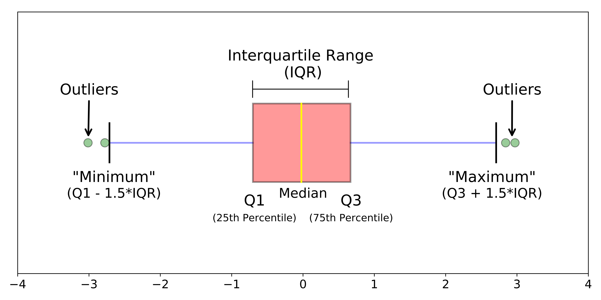

# Matematické základy informatiky

- [1. Výpočetní složitost algoritmů. Techniky analýzy výpočetní složitosti algoritmů: analýza rekurzivních algoritmů, amortizovaná analýza, složitost algoritmů v průměrném případě](#1-výpočetní-složitost-algoritmů-techniky-analýzy-výpočetní-složitosti-algoritmů-analýza-rekurzivních-algoritmů-amortizovaná-analýza-složitost-algoritmů-v-průměrném-případě)
- [2. Matematické modely algoritmů – Turingovy stroje a stroje RAM. Algoritmicky nerozhodnutelné problémy](#2-matematické-modely-algoritmů--turingovy-stroje-a-stroje-ram-algoritmicky-nerozhodnutelné-problémy)
- [3. Třídy složitosti problémů. Třída PTIME a NPTIME, NP-úplné problémy. Další třídy složitosti (PSPACE, EXPTIME, EXPSPACE, polynomiální hierarchie, NLOGSPACE, LOGSPACE, ...)](#3-třídy-složitosti-problémů-třída-ptime-a-nptime-np-úplné-problémy-další-třídy-složitosti-pspace-exptime-expspace-polynomiální-hierarchie-nlogspace-logspace-)
- [4. Výpočetní modely pro paralelní a distribuované algoritmy. Výpočetní složitost paralelních algoritmů. Komunikační složitost](#4-výpočetní-modely-pro-paralelní-a-distribuované-algoritmy-výpočetní-složitost-paralelních-algoritmů-komunikační-složitost)
- [5. Jazyk predikátové logiky prvního řádu. Práce s kvantifikátory a ekvivalentní transformace formulí](#5-jazyk-predikátové-logiky-prvního-řádu-práce-s-kvantifikátory-a-ekvivalentní-transformace-formulí)
- [6. Pojem relace, operace s relacemi, vlastnosti binárních homogenních relací. Relace ekvivalence a relace uspořádání a jejich aplikace](#6-pojem-relace-operace-s-relacemi-vlastnosti-binárních-homogenních-relací-relace-ekvivalence-a-relace-uspořádání-a-jejich-aplikace)
- [7. Pojem operace a obecný pojem algebra. Algebry s jednou a dvěma binárními operacemi](#7-pojem-operace-a-obecný-pojem-algebra-algebry-s-jednou-a-dvěma-binárními-operacemi)
- [8. FCA – formální kontext, formální koncept, konceptuální svazy](#8-fca--formální-kontext-formální-koncept-konceptuální-svazy)
- [9. Asociační pravidla, hledání často se opakujících množin položek](#9-asociační-pravidla-hledání-často-se-opakujících-množin-položek)
- [10. Metrické a topologické prostory – metriky a podobnosti. Jejich aplikace](#10-metrické-a-topologické-prostory--metriky-a-podobnosti-jejich-aplikace)
- [11. Shlukování. Typy shlukování, metody pro určení kvality shlukování, aplikace shlukování](#11-shlukování-typy-shlukování-metody-pro-určení-kvality-shlukování-aplikace-shlukování)
- [12. Náhodná veličina. Základní typy náhodných veličin. Funkce určující rozdělení náhodných veličin](#12-náhodná-veličina-základní-typy-náhodných-veličin-funkce-určující-rozdělení-náhodných-veličin)
- [13. Vybraná rozdělení diskrétní a spojité náhodné veličiny. Binomické, hypergeometrické, negativně binomické, Poissonovo, exponenciální, Weibullovo, normální rozdělení](#13-vybraná-rozdělení-diskrétní-a-spojité-náhodné-veličiny-binomické-hypergeometrické-negativně-binomické-poissonovo-exponenciální-weibullovo-normální-rozdělení)
- [14. Popisná statistika. Číselné charakteristiky a vizualizace kategoriálních a kvantitativních proměnných](#14-popisná-statistika-číselné-charakteristiky-a-vizualizace-kategoriálních-a-kvantitativních-proměnných)
  - [14.1. Číselné charakteristiky](#141-číselné-charakteristiky)
  - [14.2. Vizualizace](#142-vizualizace)
  - [14.3. Identifikace odlehlých hodnot](#143-identifikace-odlehlých-hodnot)
- [15. Metody statistické indukce. Intervalové odhady. Princip testování hypotéz](#15-metody-statistické-indukce-intervalové-odhady-princip-testování-hypotéz)
  - [15.1. Testování hypotéz](#151-testování-hypotéz)

## 1. Výpočetní složitost algoritmů. Techniky analýzy výpočetní složitosti algoritmů: analýza rekurzivních algoritmů, amortizovaná analýza, složitost algoritmů v průměrném případě

## 2. Matematické modely algoritmů – Turingovy stroje a stroje RAM. Algoritmicky nerozhodnutelné problémy

## 3. Třídy složitosti problémů. Třída PTIME a NPTIME, NP-úplné problémy. Další třídy složitosti (PSPACE, EXPTIME, EXPSPACE, polynomiální hierarchie, NLOGSPACE, LOGSPACE, ...)

## 4. Výpočetní modely pro paralelní a distribuované algoritmy. Výpočetní složitost paralelních algoritmů. Komunikační složitost

## 5. Jazyk predikátové logiky prvního řádu. Práce s kvantifikátory a ekvivalentní transformace formulí

## 6. Pojem relace, operace s relacemi, vlastnosti binárních homogenních relací. Relace ekvivalence a relace uspořádání a jejich aplikace

## 7. Pojem operace a obecný pojem algebra. Algebry s jednou a dvěma binárními operacemi

## 8. FCA – formální kontext, formální koncept, konceptuální svazy

## 9. Asociační pravidla, hledání často se opakujících množin položek

## 10. Metrické a topologické prostory – metriky a podobnosti. Jejich aplikace

## 11. Shlukování. Typy shlukování, metody pro určení kvality shlukování, aplikace shlukování

## 12. Náhodná veličina. Základní typy náhodných veličin. Funkce určující rozdělení náhodných veličin

> **Náhodný pokus** je experiment, jehož výsledek nelze s jistotou předpovědět.
>
> **Náhodný jev** je tvrzení o výsledku náhodného pokusu, které lze po jeho provedení rozhodnout.
>
> Buď $\Omega=\{\omega_1,\omega_2,\ldots\}$ množina všech možných výsledků *náhodného pokusu*. **Náhodná veličina** $X$ je funkce $X:\Omega\to\mathbb{R}$, která každému elementárnímu jevu $\omega_i$ přiřazuje reálné číslo $X(\omega_i)$.
>
> Tzn. náhodná veličina je číselné vyjádření výsledku náhodného pokusu.


> Náhodná veličina $X$ má *diskrétní rozdělení pravděpodobnosti* (je diskrétní) právě tehdy, když nabývá *spočetně mnoha hodnot*.
>
> Diskrétní náhodná veličina $X$ s distribuční funkcí $F_X(t)$ je charakterizována *pravděpodobnostní funkcí* $P(X=x_i)$, pro kterou platí
>
> $$F_X(t)=\sum\limits_{x_i<t}P(X=x_i)$$
>
> Distribuční funkce $F_X(t)=P(X\leq t)$ je *neklesající*, *zprava spojitá* a má nejvýše *spočetně mnoho bodů nespojitosti*.


> Náhodná veličina $X$ má *spojité rozdělení pravděpodobnosti* (je spojitá) právě tehdy, když má *spojitou distribuční funkci*.
>
> Spojitá náhodná veličina $X$ s distribuční funkcí $F_X(t)$ je charakterizována *hustotou pravděpodobnosti* $f_X(t)$, pro kterou platí
>
> $$F_X(t)=\int\limits_{-\infty}^t f_X(x)dx$$
>
> - $(\forall x\in\mathbb{R})\colon P(X=x)=0$ (žádné skoky)
> - $P(X < x) = P(X \leq x)$
> - $\int\limits_{-\infty}^{+\infty} f_X(x)dx = 1$
> - $F_X(x)$ je vždy spojitá, ale $f_X$ spojitá být nemusí (např. uniformní rozdělení)
> - $(\forall x\text{ kde }f_X(x)\text{ je spojitá})\colon f_X(x)=F_X'(x)$
> - $\mathbb{E}(X)=\int\limits_{-\infty}^{+\infty} xf_X(x)dx$

## 13. Vybraná rozdělení diskrétní a spojité náhodné veličiny. Binomické, hypergeometrické, negativně binomické, Poissonovo, exponenciální, Weibullovo, normální rozdělení

V posloupnosti *bernoulliovských pokusů* jsou NV *vzájemně nezávislé* a mají *alternativní rozdělení*.

$$X\sim \text{A}(p)\iff p_X(x)=\begin{cases}
            p & \text{if } x=1\\
            1-p & \text{if } x=0\\
            0 & \text{otherwise}
        \end{cases}$$

---

**Binomická** NV reprezentuje **počet úspěchů** v posloupnosti $n$ bernoulliovských pokusů s pravděpodobností úspěchu $p$.

$$X\sim \text{Bi}(n,p)\iff p_X(x)=\begin{cases}
    \binom{n}{x}p^x(1-p)^{n-x} & \text{pro } x=0,1,\ldots,n \\
    0 & \text{jinak}
\end{cases}$$

---

**Geometrická** NV představuje počet bernoulliovských pokusů do prvního úspěchu. Nastane $n-1$ neúspěchů, $(1-p)^{n-1}$, a jeden úspěch $p$.

$$
\begin{equation*}
        X\sim Ge(p)\iff p_X(x)=\begin{cases}
            p\cdot (1-p)^{x-1} & x\in\N\\
            0 & \text{otherwise}
        \end{cases}
\end{equation*}
$$

---

**Hypergeometrická** NV reprezentuje počet prvků se sledovanou vlastností ve výběru $n$ prvků. Např. v krabici je 5 zelených a 25 červených kuliček. Náhodně vybereme 10 kuliček. Jaká je pravděpodobnost, že vybereme právě 3 zelené?

$$X\sim \text{H}(N,K,n)\sim\text{H}(30,5,10) \iff p_X(x)=\frac{\binom{K}{x}\binom{N-K}{n-x}}{\binom{N}{n}}$$

$$P_X(X=3)=p_X(3)=\dfrac{\binom{5}{3}\binom{30-5}{5-3}}{\binom{30}{10}}$$

---

**Negativně binomická** NV reprezentuje **počet pokusů** potřebných k dosažení $k$ úspěchů v posloupnosti bernoulliovských pokusů s pravděpodobností úspěchu $p$.

$$X\sim \text{NB}(k,p)\iff p_X(x)=\begin{cases}
     \binom{x-1}{k-1}p^k(1-p)^{x-k} & \text{pro } x=k,k+1,\ldots \\
     0 & \text{jinak}
 \end{cases}$$

---

**Poissonova** NV reprezentuje **počet událostí** v daném uzavřeném časovém intervalu $t$ (resp. objemu, ploše,...) v Poissonově procesu s *intenzitou* $\lambda$.

$$X\sim \text{Po}(\lambda t)\iff p_X(x)=\frac{\lambda^x e^{-\lambda t}}{x!}$$

---

**Exponenciální** NV reprezentuje **čas do výskytu 1. události** v Poissonově procesu s *intenzitou* $\lambda$.

$$X\sim \exp(\lambda)\iff f_X(x)=\begin{cases}
    \lambda e^{-\lambda x} & \text{pro } x\geq 0 \\
    0 & \text{pro } x<0
\end{cases}$$

---

**Weibullovo rozdělení** pravděpodobnosti je zobecnění exponenciálního rozdělení. Má dva parametry měřítko $\theta$ a tvar $\beta$. Narozdíl od exponenciálního rozdělení nepředpokládá *konstantní intenzitu* výskytu sledované události.

- využití v analýze spolehlivosti, poruch, přežití atd.
- Pro nezápornou SNV definujeme rizikovou funkci $\mathrm{risk}(t)=\dfrac{f(t)}{1-F(t)}$

---

**Normální rozdělení** je charakterizováno dvěma parametry $\mu$ a $\sigma$:

$$\boxed{X\sim\mathcal{N}(\mu,\sigma^2)}$$

- $\mathbb{E}(X)=\mu, \mathbb{D}(X)=\sigma^2$.
- Normované normální rozdělení $Z\sim\mathcal{N}(0,1)$.
- Buď $X\sim\mathcal{N}(\mu,\sigma^2)$, pak $Z=\dfrac{X-\mu}{\sigma}\sim\mathcal{N}(0,1)$.

---

**Gamma** NV vyjadřuje dobu do výskytu $k$-té událostí v Poissonově procesu.

---

**Uniformní** rozdělení.

$$
\begin{equation*}
    X\sim U(\langle a,b\rangle)\iff f_X(x)=\begin{cases}
        \dfrac{1}{b-a} & x\in\langle a,b\rangle\\
        0 & \text{jinak}
    \end{cases}
\end{equation*}
$$

## 14. Popisná statistika. Číselné charakteristiky a vizualizace kategoriálních a kvantitativních proměnných

Popisná statistika se zabývá popisem a vizualizací dat **bez** provádění závěrů o populaci.

1. **Kategorické** proměnné - barva, pohlaví, název rostliny *(Iris)*
2. **Kvantitativní** proměnné - výška, váha, délka okvětních lístků

### 14.1. Číselné charakteristiky

1. Kvantitativní proměnné
   - **Střední hodnota** - průměrná hodnota
     - Pro DNV $X$ s pravděpodobnostní funkcí $p_X(x)$ je střední hodnota definována jako

        $$\mathbb{E}(X)=\sum\limits_{x\in\mathcal{X}}x\cdot p_X(x)$$

     - Pro SNV $X$ s hustotou pravděpodobnosti $f_X(x)$ je střední hodnota definována jako

        $$\mathbb{E}(X)=\int\limits_{-\infty}^{+\infty}x\cdot f_X(x)dx$$

   - **Medián** - prostřední hodnota
   - **Modus** - nejčastější hodnota, tj. $\max p_X(x)$, resp. $\max f_X(x)$
   - **$p$-kvantil** $x_p\in\mathbb{R}$ je číslo, pro které platí $\mathcal{P}(X\leq x_p)=p$
     - Pokud je $F_X$ rostoucí a spojitá, tak $x_p=F_X^{-1}(p)$
   - **Rozptyl** - průměrná kvadratická odchylka dat kolem střední hodnoty

      $$\mathbb{D}(X) = \mu_2' = \mathbb{E}((X-\mathbb{E}(X))^2)= \mathbb{E}(X^2)-(\mathbb{E}(X))^2$$

   - **Směrodatná odchylka** - odmocnina z rozptylu
   - **Variační rozpětí** - $R=x_{max}-x_{min}$
   - **Mezikvartilové rozpětí** - $\mathrm{IQR}=Q_3-Q_1 = x_{0.75}-x_{0.25}$
   - **Variační koeficient** pro nezáporné NV (čím vyšší, tím více rozptýlený soubor dat)

        $$\gamma(X)=\dfrac{\sigma(X)}{\mathbb{E}(X)}$$

   - **Šikmost**

        $$\mathrm{skew}(X)=\dfrac{\mu_3'}{\sigma^3}=\dfrac{\mathbb{E}((X-\mathbb{E}X)^3)}{\sigma^3}$$

        

        $\mathrm{skew}(X)<2$ (negativně zešikmené), $\mathrm{skew}(X)\in\langle-2,2\rangle$, $\mathrm{skew}(X)>2$ (pozitivně zešikmené)

   - **Špičatost**

        $$\mathrm{kurt}(X)=\dfrac{\mu_4'}{\sigma^4}=\dfrac{\mathbb{E}((X-\mathbb{E}X)^4)}{\sigma^4}$$

        

        $\mathrm{kurt}(X)<3$, $\mathrm{kurt}(X)=3$ a $\mathrm{kurt}(X)>3$

Pokud *šikmost* a *standardní špičatost* $(\mathrm{kurt}(X) - 3)$ leží v intervalu $\langle -2,2\rangle$, tak je rozdělení přibližně normální (empiricky).

1. Kategorické proměnné - *nominální ("třídy"), ordinální (pořadí)*
   - **Četnost/frekvence** - počet výskytů kategorie, tabulka četností
   - **Relativní četnost**
   - **Modus** - nejčastější kategorie

| Pohlaví | Absolutní četnost | Relativní četnost |
|---------|--------------------|--------------------|
| muž     | 66                 | 0.78               |
| žena    | 19                 | 0.22               |
| Celkem: | 85                 | 1.00               |

> **Čebyševova nerovnost**
>
> $(\forall k \in \mathbb{R}^+)\colon \boxed{\mathcal{P}(\mu - k\sigma < X < \mu + k\sigma) \geq 1 - \dfrac{1}{k^2},}$ kde $\mu$ je střední hodnota a $\sigma$ je směrodatná odchylka.
>
> <details><summary> Alternativní formulace Čebyševovy nerovnosti </summary>
>
> $$
 \begin{align*}
     \mathcal{P}(|X-\mu |\geq k\sigma ) &\leq {\frac {1}{k^{2}}}\\
     1 - \mathcal{P}(|X-\mu |< k\sigma ) &\leq {\frac {1}{k^{2}}}\\
     \mathcal{P}(|X-\mu |< k\sigma ) &\geq 1 - {\frac {1}{k^{2}}}\\
     \mathcal{P}(\mu - k\sigma < X < \mu + k\sigma ) &\geq 1 - \dfrac{1}{k^2}\\
 \end{align*}$$
>
> </details>

### 14.2. Vizualizace

1. Kategorické
    - sloupcový graf
2. Kvantitativní
    - histogram - ukazuje rozdělení
    - krabicový graf (boxplot)



- Nestačí uvést jen relativní četnost, ale i absolutní četnost. Koláčové grafy jsou většinou nevhodné, je lepší použít sloupcové grafy.
- U histogramu je třeba zvolit vhodnou šířku intervalů. Pokud porovnáváme histogramy, je třeba mít stejnou šířku intervalů.
- Popis os nesmí chybět a neměl by být redundantní.


### 14.3. Identifikace odlehlých hodnot

- Metoda vnitřních hradeb $\langle Q_1-1.5\cdot \mathrm{IQR}, Q_3 + 1.5\cdot \mathrm{IQR}\rangle$
- Metoda vnějších hradeb $\langle Q_1-3\cdot \mathrm{IQR}, Q_3 + 3\cdot \mathrm{IQR}\rangle$

## 15. Metody statistické indukce. Intervalové odhady. Princip testování hypotéz

**Statistická indukce** umožňuje stanovit vlastnosti populace na základě pozorování náhodného výběru. Vychází ze *zákonu velkých čísel* a *centrální limitní věty*.

Např. ve výběru 100 lidí bude průměr IQ 110. V jakém rozmezí a s jakou pravděpodobností se nachází průměr IQ populace?

**Výběrové charakteristiky:**

- **Náhodný výběr** $\mathbf{X}=(X_1, X_2, \ldots, X_n)$ je vektor náhodných veličin, které jsou *nezávislé* a mají *stejné rozdělení* (**i.i.d.**).

| Populační parametr       | Výběrová charakteristika          |
|--------------------------|-----------------------------------|
| Střední hodnota $\mu$      | Výběrový průměr $\overline{X}$             |
| Medián $x_{0.5}$          | Výběrový medián $\tilde{X}_{0.5}$           |
| Směrodatná odchylka $\sigma$  | Výběrová směrodatná odchylka $S$  |
| Pravděpodobnost $p$      | Relativní četnost $\hat{p}$           |

**Odhady parametrů populace:**

- bodový odhad
- intervalový odhad

| Popis                                    | Značení                                   | Interval |
|------------------------------------------|-------------------------------------------|--|
| Hladina významnosti                      | $\alpha$                                  | |
| Hladina spolehlivosti                    | $1 - \alpha$                              | |
| Oboustranný odhad                        | $P(T_D < \mu < T_H) = 1 - \alpha$         |$(T_D; T_H)$|
| Levostranný odhad                        | $P(T_D^* < \mu) = 1 - \alpha$             |$(T_D^*,+\infty)$|
| Pravostranný odhad                      | $P(\mu < T_H^*) = 1 - \alpha$             |$(-\infty, T_H^*)$|

### 15.1. Testování hypotéz

- **Statistická hypotéza** je libovolné tvrzení o rozdělení náhodné veličiny. Cílem testování hypotéz je rozhodnout, zda je daná hypotéza v souladu s pozorovanými daty.
- **Statistika** $T(\mathbf{X})$ je funkce náhodných veličin, a tedy je taky náhodnou veličinou (pokud je $T$ borelovská).
- **Pozorovaná hodnota** $t_{obs}(\mathbf{x})\in\mathbb{R}$, kde $\mathbf{x}=(x_1,\ldots,x_n)$ je konkrétní realizace náhodného výběru, je konkrétní realizací výběrové statistiky $T(\mathbf{X})$.
- Před testováním hypotéz odstraníme *odlehlé pozorování*.

> **Klasický test**
>
> 1. Formulujeme **nulovou** a **alternativní** hypotézu.
>      - Nulová hypotéza je tvrzení, které je vždy postaveno jako *nepřítomnost rozdílu* mezi sledovanými skupinami.
>      - Alternativní hypotéza je pak tvrzení, které popírá platnost nulové hypotézy. Přítomnost rozdílu.
> 2. Stanovíme **hladinu významnosti** $\alpha$ (pravděpodobnost chyby I. druhu).
>
> 3. Zvolíme tzv. testovou statistiku , tj. výběrovou charakteristiku, jejíž rozdělení závisí na testovaném parametru $\theta$. (Rozdělení testové statistiky za předpokladu platnosti nulové hypotézy nazýváme nulové rozdělení.)
> 4. Ověříme předpoklady testu.
> 5. Určíme kritický obor $W^*$:
>
> | Tvar alternativní hypotézy $H_A$ | Kritický obor $W^*$                                     |
> |-----------------------------------|---------------------------------------------------------|
> | $\theta < \theta_0$               | $(-\infty, x_{\alpha})$                                 |
> | $\theta > \theta_0$               | $(x_{1-\alpha}, \infty)$                                |
> | $\theta \neq \theta_0$            | $(-\infty, x_{\alpha/2}) \cup (x_{1-\alpha/2}, \infty)$ |
>
> 6. Na základě konkrétní realizace výběru určíme pozorovanou hodnotu $x_{\text{OBS}}$ testové statistiky.
> 7. Rozhodneme o výsledku testu:
>
> | Situace                    | Interpretace                                            |
> |----------------------------|---------------------------------------------------------|
> | $x_{\text{OBS}} \in W^*$   | Na hladině významnosti $\alpha$ zamítáme $H_0$ ve prospěch $H_A$. |
> | $x_{\text{OBS}} \notin W^*$ | Na hladině významnosti $\alpha$ nezamítáme $H_0$.        |
>
> 8. Místo kroků 5-7 v klasickém testu můžeme určit *p-hodnotu* $p$ a porovnat ji s hladinou významnosti $\alpha$:
>
> | Tvar alternativní hypotézy $H_A$  |                      $p$-hodnota                  |
> |-----------------------------------|----------------------------------------------------|
> | $\theta < \theta_0$               | $F_0(x_{\text{OBS}})$               |
> | $\theta > \theta_0$               | $1 - F_0(x_{\text{OBS}})$           |
> | $\theta \neq \theta_0$            | $2 \min\set{F_0(x_{\text{OBS}}), 1 - F_0(x_{\text{OBS}})}$ |
>
> 9. Rozhodnutí o výsledku testu. *"P-value is low, null hypothesis must go."*
>
> | $p$-hodnota                    | Interpretace                                           |
> |-----------------------------|--------------------------------------------------------|
> | $< \alpha$    | Na hladině významnosti $\alpha$ zamítáme $H_0$ ve prospěch $H_A$. |
> | $\geq \alpha$  | Na hladině významnosti $\alpha$ nezamítáme $H_0$.     |

<details><summary> Jednovýběrový t-test střední hodnoty </summary>

1. Odstraním odlehlá pozorování.
2. $H_0\colon \mu = c, c\in\mathbb{R}$
3. $H_1\colon \mu \neq c$
4. $\alpha=0.05$

```r
t.test(
    x,
    mu = 0,
    alternative = "two.sided",
    conf.level = 0.95
)
```

</details>

Korelace neimplikuje kauzalitu.

$$\rho _{X,Y}={\mathrm {cov} (X,Y) \over \sigma _{X}\sigma _{Y}}={\mathbb{E}((X-\mu _{X})(Y-\mu _{Y})) \over \sigma _{X}\sigma _{Y}}$$
