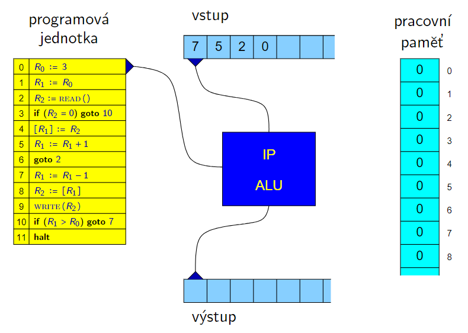
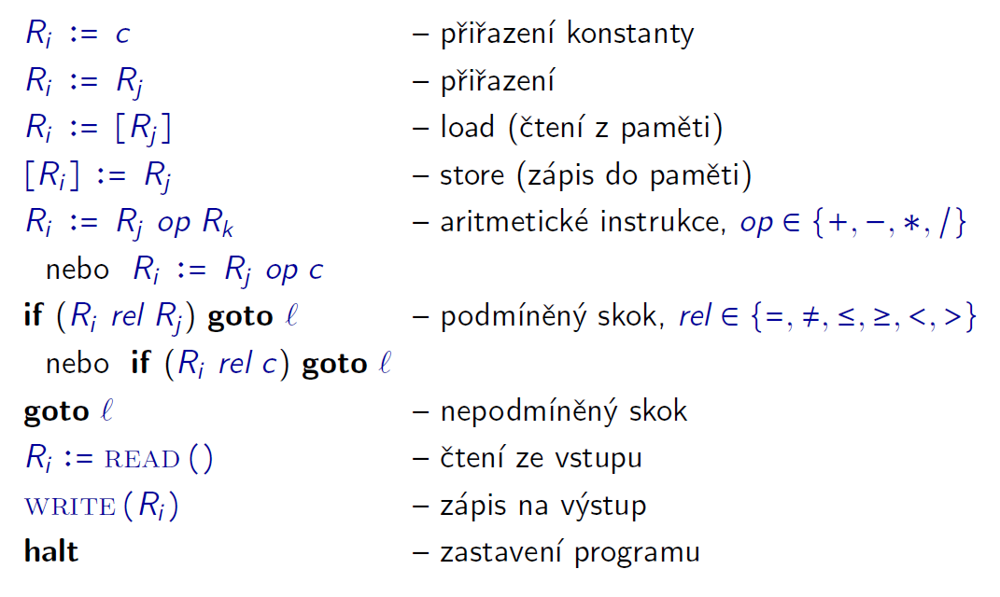
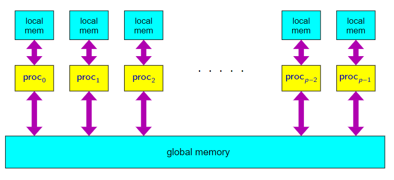
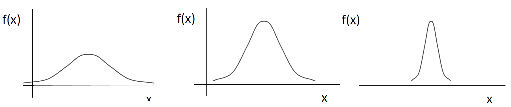

# Matematické základy informatiky

- [1. Výpočetní složitost algoritmů. Techniky analýzy výpočetní složitosti algoritmů: analýza rekurzivních algoritmů, amortizovaná analýza, složitost algoritmů v průměrném případě](#1-výpočetní-složitost-algoritmů-techniky-analýzy-výpočetní-složitosti-algoritmů-analýza-rekurzivních-algoritmů-amortizovaná-analýza-složitost-algoritmů-v-průměrném-případě)
  - [1.1. Analýza rekurzivních algoritmů](#11-analýza-rekurzivních-algoritmů)
  - [1.2. Asymptotická složitost](#12-asymptotická-složitost)
  - [1.3. Amortizovaná analýza](#13-amortizovaná-analýza)
- [2. Matematické modely algoritmů – Turingovy stroje a stroje RAM. Algoritmicky nerozhodnutelné problémy](#2-matematické-modely-algoritmů--turingovy-stroje-a-stroje-ram-algoritmicky-nerozhodnutelné-problémy)
  - [2.1. Turingův stroj](#21-turingův-stroj)
  - [2.2. Stroj RAM](#22-stroj-ram)
  - [2.3. Algoritmicky nerozhodnutelné problémy](#23-algoritmicky-nerozhodnutelné-problémy)
    - [2.3.1. Halting problem](#231-halting-problem)
    - [2.3.2. Kachličkování roviny](#232-kachličkování-roviny)
    - [2.3.3. Postův korespondenční problém (PKP)](#233-postův-korespondenční-problém-pkp)
- [3. Třídy složitosti problémů. Třída PTIME a NPTIME, NP-úplné problémy. Další třídy složitosti (PSPACE, EXPTIME, EXPSPACE, polynomiální hierarchie, NLOGSPACE, LOGSPACE, ...)](#3-třídy-složitosti-problémů-třída-ptime-a-nptime-np-úplné-problémy-další-třídy-složitosti-pspace-exptime-expspace-polynomiální-hierarchie-nlogspace-logspace-)
  - [3.1. Nedeterminismus](#31-nedeterminismus)
  - [3.2. NP úplnost](#32-np-úplnost)
- [4. Výpočetní modely pro paralelní a distribuované algoritmy. Výpočetní složitost paralelních algoritmů. Komunikační složitost](#4-výpočetní-modely-pro-paralelní-a-distribuované-algoritmy-výpočetní-složitost-paralelních-algoritmů-komunikační-složitost)
  - [4.1. Paralelní algoritmy](#41-paralelní-algoritmy)
  - [4.2. Výpočetní složitost paralelních algoritmů](#42-výpočetní-složitost-paralelních-algoritmů)
  - [4.3. Distribuované algoritmy](#43-distribuované-algoritmy)
- [5. Jazyk predikátové logiky prvního řádu. Práce s kvantifikátory a ekvivalentní transformace formulí](#5-jazyk-predikátové-logiky-prvního-řádu-práce-s-kvantifikátory-a-ekvivalentní-transformace-formulí)
- [6. Pojem relace, operace s relacemi, vlastnosti binárních homogenních relací. Relace ekvivalence a relace uspořádání a jejich aplikace](#6-pojem-relace-operace-s-relacemi-vlastnosti-binárních-homogenních-relací-relace-ekvivalence-a-relace-uspořádání-a-jejich-aplikace)
- [7. Pojem operace a obecný pojem algebra. Algebry s jednou a dvěma binárními operacemi](#7-pojem-operace-a-obecný-pojem-algebra-algebry-s-jednou-a-dvěma-binárními-operacemi)
  - [7.1. Algebry s jednou binární operací](#71-algebry-s-jednou-binární-operací)
  - [7.2. Algebry se dvěma binárními operacemi](#72-algebry-se-dvěma-binárními-operacemi)
- [8. FCA – formální kontext, formální koncept, konceptuální svazy](#8-fca--formální-kontext-formální-koncept-konceptuální-svazy)
- [9. Asociační pravidla, hledání často se opakujících množin položek](#9-asociační-pravidla-hledání-často-se-opakujících-množin-položek)
- [10. Metrické a topologické prostory – metriky a podobnosti. Jejich aplikace](#10-metrické-a-topologické-prostory--metriky-a-podobnosti-jejich-aplikace)
  - [10.1. Metriky](#101-metriky)
  - [10.2. Podobnosti](#102-podobnosti)
  - [10.3. Topologické prostory](#103-topologické-prostory)
- [11. Shlukování. Typy shlukování, metody pro určení kvality shlukování, aplikace shlukování](#11-shlukování-typy-shlukování-metody-pro-určení-kvality-shlukování-aplikace-shlukování)
- [12. Náhodná veličina. Základní typy náhodných veličin. Funkce určující rozdělení náhodných veličin](#12-náhodná-veličina-základní-typy-náhodných-veličin-funkce-určující-rozdělení-náhodných-veličin)
- [13. Vybraná rozdělení diskrétní a spojité náhodné veličiny. Binomické, hypergeometrické, negativně binomické, Poissonovo, exponenciální, Weibullovo, normální rozdělení](#13-vybraná-rozdělení-diskrétní-a-spojité-náhodné-veličiny-binomické-hypergeometrické-negativně-binomické-poissonovo-exponenciální-weibullovo-normální-rozdělení)
- [14. Popisná statistika. Číselné charakteristiky a vizualizace kategoriálních a kvantitativních proměnných](#14-popisná-statistika-číselné-charakteristiky-a-vizualizace-kategoriálních-a-kvantitativních-proměnných)
  - [14.1. Číselné charakteristiky](#141-číselné-charakteristiky)
  - [14.2. Vizualizace](#142-vizualizace)
  - [14.3. Identifikace odlehlých hodnot](#143-identifikace-odlehlých-hodnot)
- [15. Metody statistické indukce. Intervalové odhady. Princip testování hypotéz](#15-metody-statistické-indukce-intervalové-odhady-princip-testování-hypotéz)
  - [15.1. Testování hypotéz](#151-testování-hypotéz)

**Algoritmus** je mechanický postup, jak něco spočítat.

**Algoritmický problém** je trojice $(\text{IN}$, $\text{OUT}$ a $R)$, kde

- $\text{IN}$ je množina možných vstupů,
- $\text{OUT}$ je množina možných výstupů
- a $R$ $\subseteq$ $\text{IN}$ $\times$ $\text{OUT}$ je relace přiřazující každému vstupu možné odpovídající výstupy.
    $$(\forall x \in \text{IN})(\exists y\in\text{OUT}):R(x,y)$$

## 1. Výpočetní složitost algoritmů. Techniky analýzy výpočetní složitosti algoritmů: analýza rekurzivních algoritmů, amortizovaná analýza, složitost algoritmů v průměrném případě

- **Složitost algoritmu** je funkce, která popisuje, jak se časová (resp. prostorová) složitost mění s velikostí vstupu.
- **Složitost problému** je složitost "nejefektivnějšího" algoritmu, který problém řeší.

> Uvažujme stroj $\mathcal{M}$. Můžeme definivat funkce **doba výpočtu** nad daným vstupem a **množství paměti** použité při výpočtu nad daným vstupem:
>
> $$\begin{align*}\mathrm{time}_{\mathcal{M}}: \mathrm{input} \rightarrow \mathbb{N} \cup \{\infty\} \\ \mathrm{space}_{\mathcal{M}}: \mathrm{input} \rightarrow \mathbb{N} \cup \{\infty\}\end{align*}$$

Např. pro *Turingův stroj* $\mathcal{M}$ je $\text{input}$ abeceda $\Sigma^*$. Dále $\mathrm{time}_{\mathcal{M}}(x)$ je *počet kroků*, které stroj $\mathcal{M}$ vykoná při zpracování vstupu $x$ a $\mathrm{space}_{\mathcal{M}}(x)$ je počet *políček pásky*, které stroj $\mathcal{M}$ navštíví.

> Buď $\mathrm{size(x)}$ **velikost vstupu** $x$. Pak **časovou složitost v nejhorším případě** definujeme jako:
>
> $$T(n) = \max\{\mathrm{time}_{\mathcal{M}}(x) \mid x\in\mathrm{input} \wedge \mathrm{size}(x) = n\}$$
>
> tj., funkci, která pro daný algoritmus a danou velikost vstupu přiřazuje každému přirozenému číslu $n$ maximální počet instrukcí, které algoritmus provede, pokud dostane vstup velikosti $n$.
>
> Analogicky definujeme **prostorovou složitost v nejhorším případě**:
>
> $$S(n) = \max\{\mathrm{space}_{\mathcal{M}}(x) \mid x\in\mathrm{input} \wedge \mathrm{size}(x) = n\}$$

**Časovou složitost v průměrném případě** definujeme jako aritmetický průměr $T(n)$.

### 1.1. Analýza rekurzivních algoritmů

**Rekurzivní algoritmus** je algoritmus, který převede řešení původního problému na řešení několika podobných problémů pro menší instance.

> **Master Theorem**
>
> Předpokládejme, že $a \geq 1$ a $b > 1$ jsou konstanty, že $f:\mathbb{N}\rightarrow\mathbb{N}$, a že funkce $T(n)$ je definována rekurentním předpisem
>
> $$T(n) = a \cdot T\left(\frac{n}{b}\right) + f(n)$$
>
> (kde $n/b$ může být buď $\lfloor n/b \rfloor$ nebo $\lceil n/b \rceil$). Pak platí:
>
> 1. Pokud $f(n) \in \mathcal{O}(n^{\log_b a - \varepsilon})$ pro nějakou konstantu $\varepsilon > 0$, pak
>    $$ T(n) = \Theta(n^{\log_b a}).$$
>
> 2. Pokud $f(n) \in \Theta(n^{\log_b a})$, pak
>    $$T(n) = \Theta(n^{\log_b a} \log n).$$
>
> 3. Pokud $f(n) \in \Omega(n^{\log_b a + \varepsilon})$ pro nějakou konstantu $\varepsilon > 0$ a pokud $a \cdot f\left (\frac{n}{b}\right) \leq c \cdot f(n)$ pro nějakou konstantu $c < 1$ a všechna dostatečně velká $n$, pak
>    $$T(n) = \Theta(f(n)).$$

Master theorem je možné použít pro analýzu složitosti takových rekurzivních algoritmů, kde:

1. Řešení jednoho podproblému velikosti $n$, kde $n > 1$, se převede na řešení $a$ *podproblémů*, z nichž každý má velikost $\dfrac{n}{b}$.
   - $a$ je počet podproblémů.
   - $b$ kolikrát se zmenší velikost podproblému (většinou se dělí na půl tzn. $b=2$).
2. Doba, která se stráví řešením jednoho podproblému velikosti $n$, *bez* doby v rekurzivních voláních, je určena funkcí $f(n)$.

<details><summary> Příklad: Algoritmus Merge-Sort </summary>

Pro algoritmus Merge-Sort máme:

- $a = 2$ ...počet podproblémů
- $b = 2$ ...velikost podproblému $n/2$
- $f(n) \in \Theta(n)$ ...spojení dvou seřazených sekvencí v čase $\Theta(n)$
- $g(n)=n^{\log_b a}=n$
- $f(n)\text{ "=" }g(n)$, tzn.

Platí, že $f(n) \in \Theta(n^{\log_b a}) = \Theta(n)$, takže podle Master theorem máme:

$$
T(n) \in \Theta(n^{\log_b a} \log n) = \Theta(n \log n).
$$

</details>

### 1.2. Asymptotická složitost

Buď $g : \mathbb{N} \to \mathbb{N}$. Pak pro $f : \mathbb{N} \to \mathbb{N}$ platí:

1. $\boxed{f \in \mathcal{O}(g)}\iff(\exists c > 0)(\exists n_0 \geq 0)(\forall n \geq n_0) :$

    $$
    \boxed{f(n) \leq c \cdot g(n)}
    $$

2. $\boxed{f \in \Omega(g)}\iff(\exists c > 0)(\exists n_0 \geq 0)(\forall n \geq n_0) :$

    $$
    \boxed{f(n) \geq c \cdot g(n)}
    $$

3. $\boxed{f \in \Theta(g)}\iff$

    $$
    \boxed{f \in \mathcal{O}(g) \quad \wedge \quad f \in \Omega(g)}
    $$

4. $\boxed{f \in \omicron(g)}\iff(\exists c > 0)(\exists n_0 \geq 0)(\forall n \geq n_0) :$

    $$
    \boxed{f(n) < c \cdot g(n)}
    $$

5. $\boxed{f \in \omega(g)}\iff(\exists c > 0)(\exists n_0 \geq 0)(\forall n \geq n_0) :$

    $$
    \boxed{f(n) > c \cdot g(n)}
    $$

Navíc platí:

$$
\boxed{\lim_{n \to +\infty} \frac{f(n)}{g(n)} =\begin{cases}
  0 & f \in \omicron(g) \\
  +\infty & f \in \omega(g) \\
  c \in \mathbb{R}^+ & f \in \Theta(g)
\end{cases}}
$$

### 1.3. Amortizovaná analýza

Doplněk k analýze složitosti v nejhorším a průměrném případě. Např. vkládání do `std::Vector` (dynamické pole) má amortizovanou složitost $\mathcal{O}(1)$ pro $n$ vložení.


## 2. Matematické modely algoritmů – Turingovy stroje a stroje RAM. Algoritmicky nerozhodnutelné problémy

### 2.1. Turingův stroj

> Formálně je **Turingův stroj** definován jako šestice $\mathcal{M} = (Q, \Sigma, \Gamma, \delta, q_0, F)$ kde:
>
> - $Q$ je *konečná neprázdná* množina **stavů**.
> - $\Gamma$ je *konečná neprázdná* množina **páskových symbolů** (pásková abeceda).
> - $\Sigma \subseteq \Gamma$ je *konečná neprázdná* množina **vstupních symbolů** (vstupní abeceda).
> - $\delta : (Q \setminus F) \times \Gamma \to Q \times \Gamma \times \{-1, 0, +1\}$ je **přechodová funkce**.
> - $q_0 \in Q$ je **počáteční stav**.
> - $F \subseteq Q$ je množina **konečných stavů**.
>
> Předpokládáme, že v $\Gamma\setminus\Sigma$ je vždy speciální prvek $\square$ označující prázdný znak.

Oproti zásobníkovému automatu umožňuje navíc:

- pohyb "hlavy" oběma směry,
- možnost zápisu na "pásku" na aktuální pozici "hlavy",
- "páska" je *nekonečná*.

Příklad *přechodové funkce*: $\boxed{\delta(q_1, b)=(q_2,x,+1)}$. Jsem ve stavu $q_1$ a na pásce je znak $b$. Přejdu do stavu $q_2$, přepíšu znak na pásce na $x$ a posunu se na pásce o jedno pole doprava.

**Konfigurací Turingova stroje** je trojice $(q, w, i)$, kde:

- $q$ je stav řídící jednotky,
- $w$ je obsah pásky (resp. pásek) a
- $i$ je pozice hlavy (resp. hlav) na pásce.

Jazyk $L\subseteq\Sigma^*$ je TM **přijímán** $\iff$ $\forall w\in L$ existuje posloupnost konfigurací, která končí v koncovém stavu $q_{acc}$. (Výpočet nad slovy mimo $L$ může být nekonečný nebo může skončit ve stavu $q_{rej}$).

Jazyk $L\subseteq\Sigma^*$ je TM **rozpoznán** $\iff$ $\forall w\in L \Rightarrow q_{acc} \,\,\wedge\,\, \forall w\in \{\Sigma^* \setminus L\} \Rightarrow q_{rej}$.

> **Church-Turingova teze**
>
> Každý algoritmus lze realizovat Turingovým strojem.

Simulace Turingových strojů:

1. Libovolná pásková abeceda $\Gamma$ lze převést na binární abecedu $\{0,1\}$ kódováním s pevnou délkou (binární Turingův stroj).
2. Oboustranně někonečná páska na jednostranně nekonečnou pásku pomocí zdvojnásobení počtu stavů (značení $\uparrow$ nebo $\downarrow$).
3. Více hlav na pásce $\Rightarrow$ přidáme do páskové abecedy $\Gamma$ speciální symboly pro každou hlavu např. $a^{1},a^{2}$ (pro každý symbol a každou hlavu).

### 2.2. Stroj RAM

> **Stroj RAM (Random Access Machine)** je idealizovaný model počítače. Skládá se z těchto částí:
>
> - **Programová jednotka** – obsahuje **program** stroje RAM a **ukazatel** na právě prováděnou instrukci.
> - **Pracovní paměť** – tvořená buňkami očíslovanými $0, 1, 2, \dots$
>   - Značíme $R_0, R_1, R_2, \dots$  
>   - Obsah buněk je možné číst i do nich zapisovat.
>   - Pracovní paměť je nekonečná.
> - **Vstupní páska** – z ní je možné pouze číst.
> - **Výstupní páska** – na ni je možné pouze zapisovat.




**Konfigurace stroje RAM** je dána:

- obsahem všech registrů (paměti; včetně *instruction pointer* (IP)),
- obsahem vstupní a výstupní pásky a
- pozicemi čtecí a zapisovací hlavy.

### 2.3. Algoritmicky nerozhodnutelné problémy

> **Algoritmicky nerozhodnutelný problém** je takový *rozhodovací* problém, pro který je dokázáno, že neexistuje algoritmus, který by vždy dal správnou odpověď `ano` nebo `ne`.

<!--  -->

> **Riceova věta**
>
> Každá netriviální I/O vlastnost rozhodovacího programu je nerozhodnutelná.
>
> |                   |              |          |              |
> | ----------------------- | ------------ | -------- | ------------ |
> | Je vlastnost triviální?       | $\times$     | $\times$ | $\checkmark$ |
> | Je vlastnost I/O?             | $\checkmark$ | $\times$ | $\checkmark$ |
> | Je vlastnost nerozhodnutelná? | $\checkmark$ | $\times$ | $\times$     |

#### 2.3.1. Halting problem

- **Vstup:** Zdrojový kód programu $P$ v jazyce $L$, vstupní data $x$.
- **Otázka:** Zastaví se program $P$ po nějakém konečném počtu kroků, pokud dostane jako vstup data $x$?

<details><summary> Důkaz, že Halting problem je nerozhodnutelný </summary>

Pozn. značením $\text{Kod}(M)$ rozumíme kód Turingova stroje $M$ v abecedě $\{0,1\}^*$. (Seznam instrukcí a stavy můžeme zakódovat do jednoho řetězce.)

Předpokládejme, že existuje Turingův stroj $A$, který řeší Halting problem. Dále definujme nový Turingův stroj $\overline{A}$, který příjímá vstup $x=\{0,1\}^*$ a simuluje běh $A$ na vstupu $x$. Pokud se $A$ zastaví, tak $\overline{A}$ se zacyklí a naopak.

Co se stane, když na vstup $\overline{A}$ dáme $\text{Kod}(\overline{A})$?

1. $A$ skončí ve stavu `Ano` a $\overline{A}$ se zacyklí.
2. $A$ skončí ve stavu `Ne` a $\overline{A}$ odpoví `Ano`.

To je spor, že $A$ řeší HP (tzn. že by $A$ mělo vždy pravdu).

</details>

#### 2.3.2. Kachličkování roviny

Vstupem je množina typů kachliček, jako třeba:


Otázka je, zda je možné použitím daných typů kachliček pokrýt celou nekonečnou rovinu tak, aby všechny kachličky spolu sousedily stejnými barvami.

#### 2.3.3. Postův korespondenční problém (PKP)

- **Vstup:** Posloupnosti slov $u_1, u_2, \ldots, u_n$ a $v_1, v_2, \ldots, v_n$ nad nějakou abecedou $\Sigma$.  
- **Otázka:** Existuje nějaká posloupnost $i_1, i_2, \ldots, i_m$, kde $m \geq 1$, kde $(\forall j=1,\dots,m: 1 \leq i_j \leq n)$, a kde  
$$ u_{i_1} u_{i_2} \cdots u_{i_m} = v_{i_1} v_{i_2} \cdots v_{i_m} $$


Kartičky se mohou opakovat a nezáleží na pořadí. Existuje posloupnost kdy zřetězením slov nahoře a dole dostaneme stejné slovo?

PKP je nerozhodnutelný (redukcí z HP).

## 3. Třídy složitosti problémů. Třída PTIME a NPTIME, NP-úplné problémy. Další třídy složitosti (PSPACE, EXPTIME, EXPSPACE, polynomiální hierarchie, NLOGSPACE, LOGSPACE, ...)

<div class="warning">

Třídy složitosti jsou podmnožiny množiny všech (algoritmických) *problémů*.

Konkrétní třída složitosti je vždy charakterizována nějakou vlastností,
kterou mají problémy do ní patřící.

</div>

>Pro libovolnou funkci $f : \mathbb{N} \to \mathbb{N}$ definujeme třídu $\text{D}_{time}\big(f(n)\big)$, resp. $\text{D}_{space}\big(f(n)\big)$, jako třídu obsahující právě ty *rozhodovací* problémy, pro něž existuje algoritmus s *časovou*, resp. *prostorovou*, složitostí $\mathcal{O}(f(n))$.
>
> Dále definuje třídy složitosti pro *rozhodovací* problémy, pro které existuje algoritmus s *polynomiální složitostí*:
> $$\begin{align*}\text{P}_{time} &= \bigcup\limits_{k\geq0}\text{D}_{time}(n^k)\\ \text{P}_{space} &=\bigcup\limits_{k\geq0}\text{D}_{space}(n^k)\end{align*}$$

Definice tříd $\text{P}_{time}$ a $\text{P}_{space}$ nezávisí na použitém *rozumném* výpočetním modelu (Turingovy stroje, RAM stroje a další).

Analogicky definujeme třídy:

- $\text{EXP}_{time}$ a $\text{EXP}_{space}$ pro problémy s exponenciální složitostí $2^{\mathcal{O}(n^k)}\Leftrightarrow \mathcal{O}(c^{n^k})$,
- $\text{LOG}_{time}$ a $\text{LOG}_{space}$ pro problémy s logaritmickou složitostí $\mathcal{O}(\log n)$,
- $\text{2-EXP}_{time}$ a $\text{2-EXP}_{space}$ pro problémy s exponenciální složitostí $2^{2^{\mathcal{O}(n^k)}}$,
- $\text{ELEMENTARY}$ pro problémy se složitostí $2^{2^{2^{^{.^{.^{.^{2^{\mathcal{O}(n^k)}}}}}}}}$

> Pro libovolnou funkci $f: \mathbb{N} \to \mathbb{N}$ platí $\text{D}_{time}\big(f(n)\big) \subseteq \text{D}_{space}\big(f(n)\big)$.

(Protože Turingův stroj během $k$ kroků výpočtu navštíví nanejvýš $k$ políček pásky.)

> Pro libovolnou funkci $f: \mathbb{N} \to \mathbb{N}$ a $c\in\mathbb{R}^+$ platí $\text{D}_{space}\big(f(n)\big) \subseteq \text{D}_{time}\big(2^{cf(n)}\big)$.

(Protože počet konfigurací Turingova stroje je $2^{\mathcal{\Theta}(n)}$ a během korektního algoritmu se žádná konfigurace neopakuje.)

$$
\text{LOGSPACE} \subseteq \text{PTIME} \subseteq \text{PSPACE} \subseteq \text{EXPTIME} \subseteq \text{EXPSPACE} \subseteq \\
2\text{-EXPTIME} \subseteq 2\text{-EXPSPACE} \subseteq \cdots \subseteq \text{ELEMENTARY}
$$

### 3.1. Nedeterminismus

Řekneme, že algoritmus je **nedeterministický**, pokud v každém kroku může vybrat z několika možností, kterou instrukcí pokračovat.

> Nedeterministický algoritmus dává pro daný vstup $x$ odpověď `Ano`, právě tehdy, když existuje alespoň jeden jeho výpočet, který vede k odpovědi `Ano`.


<div class="warning">

Složitost nedeterministického algoritmu v nejhorším případě odpovídá délce nejdelší větve výpočetního stromu.

</div>

<div class="warning">

Hierarchie tříd složitosti:

$$
\text{LS} \subseteq \text{NLS} \subseteq \text{PT} \subseteq \text{NPT} \subseteq \text{PS} = \text{NPS} \subseteq \text{EXPT} \subseteq \text{NEXPT} \subseteq \text{EXPS} = \text{NEXPS}
$$


</div>

### 3.2. NP úplnost

> Problém $P$ je **NP-těžký**, jestliže každý problém z $\text{NPTIME}$ je polynomiálně převeditelný na $P$.  
>
> 
>
> Problém $P$ je **NP-úplný**, jestliže je NP-těžký a navíc sám patří do třídy $\text{NPTIME}$.
>
> 

**NP-úplné problémy**:

- Patří do třídy **NPTIME**, tj. jsou řešitelné v polynomiálním čase nedeterministickým algoritmem.  
- Jsou tedy řešitelné v **exponenciálním čase** (viz vztahy mezi třídami složitosti).  
- Není pro ně znám žádný algoritmus s polynomiální časovou složitostí (ale není dokázáno, že pro daný problém neexistuje polynomiální algoritmus).
- Všechny tyto problémy jsou **navzájem polynomiálně převeditelné**.  
- Pokud bychom pro nějaký NP-těžký problém $P$ nalezli polynomiální algoritmus, platilo by $\text{PTIME} = \text{NPTIME}$.

> Problém $P_1$ je *polynomiálně převeditelný* na problém $P_2$ právě tehdy, když existuje algoritmus $\text{Alg}$ s *polynomiální časovou složitostí*, který převádí problém $P_1$ na problém $P_2$.


> **Cookova věta.** Problém **SAT** je NP-úplný.
>
> **3-SAT**
>
> - **Vstup:** Formule $\varphi$ v *konjunktivní normální formě*, kde každá *klauzule* obsahuje právě 3 *literály*. Např. $(x_1 \lor x_1 \lor x_1) \land (\neg x_1 \lor \neg x_1 \lor \neg x_1)$.
> - **Otázka:** Je $\varphi$ splnitelná?
<!--  -->
> **Problém nezávislé množiny (IS)**
>
> - **Vstup**: Neorientovaný graf $G$, číslo $k$.  
> - **Otázka**: Existuje v grafu $G$ nezávislá množina velikosti $k$?  
>
> 
>
> Nezávislá množina v grafu je podmnožina vrcholů grafu taková, že žádné dva vrcholy z této podmnožiny nejsou spojeny hranou.
<!--  -->
> **GC - Graph Coloring**
>
> - **Vstup:** Neorientovaný graf $G$, přirozené číslo $k$.  
> - **Otázka:** Lze vrcholy grafu $G$ obarvit $k$ barvami tak, aby žádné dva vrcholy spojené hranou neměly stejnou barvu?
<!--  -->
> **VC – Vertex Cover** (Vrcholové pokrytí)
>
> - **Vstup:** Neorientovaný graf $G$ a přirozené číslo $k$.  
> - **Otázka:** Existuje v grafu $G$ množina vrcholů velikosti $k$ taková, že každá hrana má alespoň jeden svůj vrchol v této množině?
>
> 
>
> *"Policajti ve vrcholech musí vidět na všechny hrany."*
<!--  -->
> **CLIQUE** (Problém kliky)
>
> - **Vstup:** Neorientovaný graf $G$ a přirozené číslo $k$.  
> - **Otázka:** Existuje v grafu $G$ množina vrcholů velikosti $k$ taková, že každé dva vrcholy této množiny jsou spojeny hranou?
<!--  -->
> **HC – Hamiltonovský cyklus**  
>
> - **Vstup:** Orientovaný graf $G$.  
> - **Otázka:** Existuje v grafu $G$ Hamiltonovský cyklus (orientovaný cyklus procházející každým vrcholem právě jednou)?
<!--  -->
> **HK – Hamiltonovská kružnice**  
>
> - **Vstup:** Neorientovaný graf $G$.  
> - **Otázka:** Existuje v grafu $G$ Hamiltonovská kružnice (neorientovaný cyklus procházející každým vrcholem právě jednou)?
<!--  -->
> **TSP – Problém obchodního cestujícího**  
>
> - **Vstup:** Neorientovaný graf $G$ s hranami ohodnocenými přirozenými čísly a číslo $k$.  
> - **Otázka:** Existuje v grafu $G$ uzavřená cesta procházející všemi vrcholy taková, že součet délek hran na této cestě (včetně opakovaných) je maximálně $k$?
<!--  -->
> **SUBSET-SUM**
>
> - **Vstup:** Sekvence přirozených čísel $a_1, a_2, \dots, a_n$ a přirozené číslo $s$.  
> - **Otázka:** Existuje množina $I \subseteq \{1, 2, \dots, n\}$ taková, že $\sum\limits_{i \in I} a_i = s$?
<!--  -->
> **Knapsack problem** (Problém batohu, speciální případ SUBSET-SUM)  
>
> - **Vstup:** Sekvence dvojic přirozených čísel $(a_1, b_1), (a_2, b_2), \dots, (a_n, b_n)$ a dvě přirozená čísla $s$ a $t$.  
> - **Otázka:** Existuje množina $I \subseteq \{1, 2, \dots, n\}$ taková, že $\sum\limits_{i \in I} a_i \leq s$ a $\sum\limits_{i \in I} b_i \geq t$?
<!--  -->
> **ILP - Integer Linear Programming** (celočíslené lineární programování)  
>
> - **Vstup:** Celočíselná matice $A$ a celočíselný vektor $b$.  
> - **Otázka:** Existuje celočíselný vektor $x$, takový že $Ax \leq b$?

## 4. Výpočetní modely pro paralelní a distribuované algoritmy. Výpočetní složitost paralelních algoritmů. Komunikační složitost


### 4.1. Paralelní algoritmy

> **Parallel Random Access Machine (PRAM)**
>
> - **Synchronní** model. Instrukce jsou vykonávány na všech procesorech najednou ve stejný okamžik v synchronních krocích. (V asynchronním modelu jsou instrukce vykonávány nezávisle na sobě a pořadí není předvidatelné.)
> - Procesory vzájemně komunikují přes sdílenou **globální paměť** (nepoužívají posílání zpráv).
> - K dispozici je **neomezený** (konečný) **počet procesorů**.
> - Slouží pro *prvotní návrh* paralelních algoritmů nezávisle na konkrétním hardware.
>
> 

Oproti RAM stroji má PRAM navíc operace `load` a `store` pro globální paměť:

$$ R_i:=[R_j]_{glob} \quad\,\text{a}\,\quad [R_i]_{glob}:=R_j $$

Navíc PRAM nemá instrukce pro vstup a výstup:  

- Předpokládá se, že vstupní data jsou na začátku uložena na nějakém stanoveném místě v globální paměti.  
- Podobně se předpokládá, že výstup bude na konci výpočtu zapsán na nějakém stanoveném místě v globální paměti.  

Procesory jsou indexovány — každý má přiděleno `ID` $(0, 1, 2, ...)$, pro jednoduchost můžeme uvažovat ID procesoru uložené v lokální paměti v registru $R_0$.

Varianty PRAM:

- **EREW** — Exclusive-Read Exclusive-Write
- **CREW** — Concurrent-Read Exclusive-Write
- **CRCW** — Concurrent-Read Concurrent-Write
  - **Common** — Pokud do jedné buňky zároveň zapisuje více procesorů, tak musí *všechny zapisovat stejnou hodnotu*.
  - **Arbitrary** — Pokud do jedné buňky zároveň zapisuje více procesorů, tak je *nedeterministicky vybrána* a zapsána jedna hodnota (ostatní se zahodí).
  - **Priority** — Pokud do jedné buňky zároveň zapisuje více procesorů, tak je zapsána hodnota procesoru s *nejnižším ID*.

### 4.2. Výpočetní složitost paralelních algoritmů

>U paralelních algoritmů navržených pro PRAM a vstup velikosti $n$ se používají dva základní parametry:
>
>- **Doba výpočtu (časová složitost)** $t(n)$ - celkový počet kroků, přičemž všechny procesory provádějí krok najednou.
>- **Počet procesorů** $p(n)$ - celkový počet procesorů, který je k dosažení dané doby výpočtu potřeba.

Za **efektivní paralelní algoritmy** jsou považovány ty, kde:  

- **Časová složitost** $t(n)$ je **polylogaritmická**, tj. $\mathcal{O}(\log^k n)$, kde $k\in\mathbb{N}$.
- **Počet procesorů** $p(n)$ je **polynomiální**.  

*Problémy*, pro které existuje *efektivní paralelní algoritmus*, jsou považovány za **dobře paralelizovatelné**.  

> Třídu **NC** (*Nick’s class*) tvoří právě ty *rozhodovací* *problémy*, pro které existuje paralelní algoritmus s *polylogaritmickou časovou složitostí* při použití *polynomiálního počtu procesorů*.

### 4.3. Distribuované algoritmy

- V distribuovaných systémech stroje nemají přístup ke *sdílené globální paměti*.
- Distribuované systémy se skládají z mnoha paralelně běžících procesů, které jsou vzájemně propojeny pomocí **sítě** a komunikují **posíláním zpráv** přes síťová spojení.
- Předpokládáme, že graf **komunikační sítě** je silně souvislý, tzn. existuje cesta z každého vrcholu do každého vrcholu.
- Vrcholy jsou identifikované ID (v realitě spíše MAC adresou)

Přes hrany komunikační sítě lze posílat prvky z množiny zpráv $\mathcal{M}$ a speciální hodnotu `null` (`null` $\notin\mathcal{M}$). V jednu chvíli jedna hrana přenáší právě jednu hodnotu z $\mathcal{M}$ nebo `null`. Hodnota `null` znamená, že přes hranu není posílána žádná zpráva.

> **Časová složitost** se počítá jako *počet provedených kol posílání zpráv*.
>
> **Komunikační složitost** se počítá jako *celkový počet zpráv* poslaných během výpočtu.

<details><summary> Volba koordinátora v síti (Leader Election) </summary>

Problém volby koordinátora v síti na základě nejvyššího unikátního ID, tj. **UID**. Uvažujme nejjednodušší variantu jednosměrného kruhu:


Procesy znají pouze vstupní a výstupní rozhraní. (Neznají topologii sítě ani ID sousedů.)

```py
# Proces má ID `u` a proměnnou `status` (hodnota `leader` nebo `null`).
send := null
if přišla zpráva obsahující UID v then
    case
        v > u: 
          send := v
        v < u:
          send := null
        v = u: 
          status := leader
          send := null
```

- Časová složitost je $\mathcal{O}(n)$, kde $n$ je počet procesů v síti.
- Komunikační složitost je $\mathcal{O}(n^2)$.

</details>

## 5. Jazyk predikátové logiky prvního řádu. Práce s kvantifikátory a ekvivalentní transformace formulí


Predikátová logika prvního řádu *(First-Order Logic, FOL)* je rozšíření výrokové logiky o predikáty a kvantifikátory.

Existují výroky, které nelze vyjádřit pomocí výrokové logiky. Např.

- `Každý student rozumí FOL.`
- `Každé sudé celé číslo je dělitelné dvěma.`

**Abeceda** predikátové logiky prvního řádu obsahuje:

- Logické symboly:
  - Proměnné: $x, y, z, \ldots$
  - Logické spojky: $\neg$ (negace), $\lor$ (disjunkce), $\land$ (konjunkce), $\implies$ (implikace), $\iff$ (ekvivalence)
  - Kvantifikátory: $\forall$ (univerzální kvantifikátor), $\exist$ (existenciální kvantifikátor)
- Speciální symboly:
  - Predikáty
  - Funkce
- Pomocné symboly $\lbrace, \rbrace, (, ), [, ]$

**Jazyk** predikátové logiky prvního řádu obsahuje:

|Termy|Formule|
|---|---|
| **Konstantní symboly** (nulární funkce) `42`, `Bob` | **Atomické formule** `Knows(Bob, FOL)`, `P(x,y)` |
| **Proměnné** `x` | **Složené formule**|
| **Funkce** ($n$-ární) `Sum(x,3)` |  |

Rozdíl mezi funkcí a predikátem: **funkce** dává proměnným **hodnotu**, **predikát** dává proměnným **pravdivostní hodnotu**.

**Složené formule** jsou:

1. **Atomické formule** jsou složené formule.
2. **Binární logické spojky**. (Pokud $P$ a $Q$ jsou složené formule, pak $P\land Q$, $P\lor Q$, $P\implies Q$, $P\iff Q$ jsou také složené formule.)
3. **Negace**. (Pokud $P$ je složená formule, pak $\neg P$ je také složená formule.)
4. **Kvantifikátory**. (Pokud $P(x)$ je složená formule, pak $\forall x\, P(x)$ a $\exist x\, P(x)$ jsou také složené formule.)

Další vlastnosti:

- Univerzální kvantifikátor $\forall$:
  - $\forall x\, P(x)$ rozumíme $P(A)\land P(B)\land \ldots$
- Existenciální kvantifikátor $\exist$:
  - $\exist x\, P(x)$ rozumíme $P(A)\lor P(B)\lor \ldots$
- Vlastnosti kvantifikátorů:
  - De Morgan: $\neg(\forall x\, P(x)) \Leftrightarrow \exist x\, \neg P(x)$
  - De Morgan: $\neg(\exist x\, P(x)) \Leftrightarrow \forall x\, \neg P(x)$
  - Záleží na pořadí kvantifikátorů. Např. $\forall x\, \exist y\, P(x,y)$ není to stejné jako $\exist y\, \forall x\, P(x,y)$.
  - $\forall x\,\forall y\,P(x,y)\Leftrightarrow \forall y\,\forall x\,P(x,y)$
  - $\exists x\,\exists y\,P(x,y)\Leftrightarrow \exists y\,\exists x\,P(x,y)$
  - $\forall x\,P(x)\land \forall x\,Q(x)\Leftrightarrow \forall x\,(P(x)\land Q(x))$
  - $\exists x\,P(x)\lor \exists x\,Q(x)\Leftrightarrow \exists x\,(P(x)\lor Q(x))$
- Platí všechny ekvivalence z výrokové logiky, např.:
  - $x \Rightarrow y \Leftrightarrow \neg x \lor y$
  - $x \Rightarrow y \Leftrightarrow \neg y \Rightarrow \neg x$
- **Vázaná proměnná** je taková proměnná, která se vyskytuje vedle kvantifikátoru $(\forall,\exist)$. Proměnné, které nejsou vázané nazýváme **volné**.
- Formuli nazveme **otevřenou** právě tehdy, když obsahuje alespoň jednu volnou proměnnou. V opačném případě nazveme formuli **uzavřenou**.
- **Valuace** je jedno konkrétní přiřazení prvků univerza proměnným.
- $S(x)$ ... "$x$ je student" je **interpretace** predikátu $S$.

<details><summary> Příklady </summary>

|Výrok|Formule FOL|
|---|---|
|*Každý* student rozumí FOL.|$\forall x\, \text{Student}(x) \implies \text{Knows}(x, \text{FOL})$|
|*Nějaký* student rozumí FOL.|$\exist x\, \text{Student}(x) \land \text{Knows}(x, \text{FOL})$|
|Každé sudé celé číslo je dělitelné dvěma.| $\forall x\, \text{Even}(x) \implies \text{Div}(x, 2)$|
|Existuje kurz, který absolvoval každý student.| $\exist y\,\text{Course}(y) \land \left[ \forall x\, \text{Student}(x) \implies \text{Took}(x,y)\right ]$|

</details>

## 6. Pojem relace, operace s relacemi, vlastnosti binárních homogenních relací. Relace ekvivalence a relace uspořádání a jejich aplikace


> ($n$-ární) **relace** $R$ je podmnožina kartézského součinu množin $R\subseteq A_1 \times \ldots \times A_n = \set{(a_1,\ldots,a_n)\mid (\forall i = 1,\ldots,n): a_i\in A_i}$.

Dělení podle arity:

- unární $R_1\subseteq A_1$
- binární $R_2 \subseteq A_1 \times A_2$
- ternární
- $n$-ární

Relace je *homogenní*, pokud $A_1 = A_2 = \ldots = A_n$. Jinak je *heterogenní*.

> Binární relace $R\subseteq X,Y$ je **zobrazení** z $X$ do $Y$ právě tehdy, když
>
> $$(\forall x\in X)(\forall y_1,y_2\in Y)\colon [xRy_1 \land xRy_2] \Rightarrow y_1=y_2$$

Operace s relacemi:

> Zobrazení $R$ kartézského součinu množin $A_1,\ldots,A_n$ do množiny $B$ nazveme $n$-ární **operací**.
>
> $$R\colon A_1,\ldots,A_n \to B$$

- unární: $|x|,\frac{1}{x},(-x)$, reflexivní uzávěr $\mathrm{Re}(R)$
- binární: $x\cap y, x+y, \langle x,y\rangle$ (skalární součin vektorů je heterogenní)
- $n$-ární: aritmetický průměr, maximum

> Vlastnosti binárních homogenních relací $(\forall x,y,z):$
>
> | Vlastnost           | Výraz                                                      | Poznámka |
> |---------------------|-------------------------------------------------------------|----------|
> | **RE**flexivita     | $xRx$                                                      |  $\mathrm{diag}(\mathbb{A})=\mathbf{1}$        |
> | **IR**eflexivita    | $(x,x)\notin R$                                            |  $\mathrm{diag}(\mathbb{A})=\mathbf{0}$         |
> | **SY**metrie        | $xRy \Rightarrow yRx$                                     |  $\mathbb{A}^\top=\mathbb{A}$        |
> | **AS**ymetrie       | $(x,y) \in R \Rightarrow (y,x) \notin R$                  | žádné smyčky a opačně orientované hrany         |
> | **AN**tisymetrie    | $xRy \wedge yRx \Rightarrow x=y$                          | žádné opačně orientované hrany         |
> | **TR**anzitivita    | $xRy \wedge yRz \Rightarrow xRz$                          | každá cesta délky 2 má i zkratku         |
> | **ÚP**lnost         | $xRy \vee yRx$                                             | po zanedbání orientace $K_n$ se všemi smyčkami          |
> | **SO**uvislost      | $x\neq y \Rightarrow xRy \vee yRx$                        | jako ÚP, ale nemusí mít všechny smyčky         |
>
> **AS**ymetrie $\Rightarrow$ **AN**tisymetrie.

**Relace ekvivalence** je binární homogenní relace, která splňuje vlastnosti **ReSyTr**.

**Relace uspořádání** je binární homogenní relace, která splňuje vlastnosti:

| Uspořádání | Částečné | Úplné |
|:---:|---|---|
| Ostré $\,\,<$ | **IrAsTr** | +SO |
| Neostré $\,\,\leq$ | **ReAnTr** | +ÚP |

## 7. Pojem operace a obecný pojem algebra. Algebry s jednou a dvěma binárními operacemi


> Binární relace $R\subseteq X,Y$ je **zobrazení** z $X$ do $Y$ právě tehdy, když
>
> $$(\forall x\in X)(\forall y_1,y_2\in Y)\colon [xRy_1 \land xRy_2] \Rightarrow y_1=y_2$$

<!--  -->

> Zobrazení $R$ kartézského součinu množin $A_1,\ldots,A_n$ do množiny $B$ nazveme $n$-ární **operací**.
>
> $$R\colon A_1,\ldots,A_n \to B$$

- unární: $|x|,\frac{1}{x},(-x)$, reflexivní uzávěr $\mathrm{Re}(R)$
- binární: $x\cap y, x+y, \langle x,y\rangle$ (skalární součin vektorů je heterogenní)
- $n$-ární: aritmetický průměr, maximum

> **Algebraický systém** je uspořádaná dvojice nosičů a operací $\left(\set{A_i},\set{f_j}\right)$.

Vlastnosti binárních operací. Buď $\circ$ binární homogenní operace na mže $A$.

| Vlastnost                                          | Výraz                                                                       |
| -------------------------------------------------- | --------------------------------------------------------------------------- |
| **UZ**avřenost                                     | $(\forall a,b\in A)(\exists c \in A): a\circ b = c$                         |
| **AS**ociativita                                   | $(\forall a,b,c\in A):\ a\circ (b\circ c) = (a\circ b)\circ c$              |
| **E**xistence **J**ednotkového (neutrálního) prvku | $(\forall x\in A)(\exists e\in A):\ a\circ e = e\circ a = a$                |
| **E**xistence **N**ulového (agresivního) prvku     | $(\forall x\in A)(\exists n\in A):\ a\circ n = n\circ a = n$                |
| **E**xistence **I**nverzního prvku                 | $(\forall a\in A)(\exists a^{-1}\in A):\ a\circ a^{-1}= a^{-1}\circ  a = e$ |
| **KO**mutativita                                   | $(\forall a,b\in A):\ a\circ b= b\circ  a$                                  |
| **ID**empotentnost                                 | $(\forall a\in A):\ a\circ a= a$                                            |

### 7.1. Algebry s jednou binární operací

- *(užzasejeiko**t)*

| Algebra        | Popis                                                                                   | Vlastnost       |
|----------------|------------------------------------------------------------------------------------------|-----------------|
| **Grupoid**     | Dvojice $(A,\circ)$, kde $A$ je neprázdná množina a $\circ$ je binární operace uzavřená na $A$ | **UZ**          |
| **Pologrupa**   | Asociativní grupoid                                                                      | **+ AS**     |
| **Monoid**      | Pologrupa s jednotkovým prvkem                                                           | **+ EJ**|
| **Grupa**       | Monoid s inverzními prvky ke každému prvku                                               | **+ EI** |
| **Abelova grupa** | Komutativní grupa                                                                       | **+ KO** |

- Nechť $(A,\circ)$. Pokud existuje jednotkový/nulový prvek, pak je právě jeden.
- Nechť $(A,\circ)$, $\circ$ je AS, a platí EJ na $A$. Pak $(\forall a \in A): [\exists ! \, a^{-1} \vee \nexists\, a^{-1}]$.
- Nechť $(A,\circ)$ je grupa, pak $(\forall a \in A): \exists ! \, a^{-1}.$
- Pokud v Cayleyho tabulce existuje řádek nebo sloupec s neunikátními hodnotami, pak se nemůže jednat o grupu.
- Neutrální prvek je tam, kde se zkopíruje záhlaví Cayleyho tabulky.
- Např. $(\mathbb{Z}_2,+)$ je Abelova grupa.

### 7.2. Algebry se dvěma binárními operacemi

- **Dělitelé nuly** jsou $(a\neq0 \wedge b\neq0): a\cdot b = 0$.

| Algebra        | Popis                                                                                   |
|--|--|
| **Okruh** *(Ring)* | Trojice $(R,+,\cdot)$, kde $(R,+)$ je *Abelova grupa,* $(R,\cdot)$ *pologrupa* a platí *distributivní zákony*. |
| **Unitární okruh** | Okruh, kde $(R,\cdot)$ je monoid. |
| **Obor** | Unitární okruh bez *dělitelů nuly*. |
| **Obor integrity** | Komutativní obor, tj. $(R,\cdot)$ je *komutativní* monoid. |
| **Těleso** | $(R,+)$ je *Abelova grupa* a $(R\setminus\{0\},\cdot)$ je grupa |
| **Galoisovo těleso** | Konečné těleso. |
| **Pole** | Těleso, kde násobení je komutativní, tj. $(R\setminus\{0\},\cdot)$ je Abelova grupa. |

- Jednotkový prvek aditivní grupy *okruhu* je nulovým prvkem jeho multiplikativního *monoidu*. Tento prvek nazýváme nulovým prvkem okruhu.
- Těleso $\Rightarrow$ obor integrity.
- Konečný obor integrity $\Rightarrow$ konečné pole.

<details><summary> Příklady </summary>

- $(\mathbb{Z}_6,+,\cdot)$ je okruh, ale není to obor integrity, protože ex. dělitelé nuly

    $$\overline{2_6}\cdot\overline{3_6}=\overline{6_6}=\overline{0_6}.$$

- $(\mathbb{Z},+,\cdot)$ je obor integrity, ale není to těleso, protože neex. některé inverze

    $$2\in\mathbb{Z}\quad\wedge\quad 2^{-1}=\dfrac{1}{2}\notin\mathbb{Z}.$$

- $(\mathbb{Z}_p,+,\cdot)$, kde $p$ je prvočíslo je konečné (Galoisovo) těleso.

</details>

## 8. FCA – formální kontext, formální koncept, konceptuální svazy

**Formální konceptuální analýza (FCA)** je metoda, která pracuje s binárními tabulkovými daty - **formálním kontextem** - které popisují relaci mezi objekty a atributy.

**Formální kontext** je uspořádaná trojice $(X,Y,I)$, kde

- $X$ je množina **objektů**,
- $Y$ je množina **atributů**,
- $I\subseteq X\times Y$ je binární **relace**.

Skutečnost, že **objekt** $x\in X$ **má atribut** $y\in Y$, značíme $(x,y)\in I$.

Každý kontext indukuje **šipkové zobrazení** $^\uparrow\colon2^{X}\rightarrow2^{Y}$ a $^\downarrow\colon2^{Y}\rightarrow2^{X}$ definované:

- $A\subseteq X, A^\uparrow=\set{y\in Y \mid (\forall x\in A): (x,y)\in I}$,
- $B\subseteq Y, B^\downarrow=\set{x\in X \mid (\forall y\in B): (x,y)\in I}$.

**Formální koncept** formálního kontextu $(X,Y,I)$ definujeme jako dvojici $(A,B)$, kde

- $X\supseteq \red{A}=B^\downarrow$ nazýváme **extent** a
- $Y\supseteq B=\red{A}^\uparrow$ nazýváme **intent**.

**Konceptuální svaz** je formální kontext $(X,Y,I)$ spolu s relací '$\leq$', s.t.

$$(A_1,B_1)\leq(A_2,B_2)\Leftrightarrow A_1 \subseteq A_2 \Leftrightarrow B_1 \supseteq B_2.$$

<details><summary> Příklad FCA </summary>

Pomocí FCA lze analyzovat hierarchii objektů a atributů, např. vodní plochy:

- Zápisem $x_{a,b,c}$ rozumíme $\set{x_a,x_b,x_c}$.

| "Vodní plochy" | Přírodní $(y_1)$ |  Stojatá $(y_2)$ | Tekoucí $(y_3)$|
|---|---|---|---|
| **Jezero** $(x_1)$ | 1 | 1 | 0 |
| **Rybník** $(x_2)$| 0 | 1 | 0 |
| **Řeka** $(x_3)$| 1 | 0 | 1 |
| **Kanál** $(x_4)$| 0 | 0 | 1 |

| Extent | Intent |
|---|---|
| $e_1=y_1^{\downarrow} = x_{1,3}$ | $i_1=x_{1,3}^{\uparrow} = y_1$ |
| $e_2=y_2^{\downarrow} = x_{1,2}$ | $i_2=x_{1,2}^{\uparrow} = y_2$ |
| $e_3=y_3^{\downarrow} = x_{3,4}$ | $i_3=x_{3,4}^{\uparrow} = y_3$ |
| $e_4= e_1\cap e_2=x_1$ | $i_4=x_{1}^{\uparrow}=y_{1,2}$ |
| $e_5= e_1\cap e_3=x_3$ | $i_5=x_{1}^{\uparrow}=y_{1,2}$ |
| $e_6= e_2\cap e_3=\emptyset$ | $i_6=\emptyset^{\uparrow}=y_{1,2,3}$ |
| $e_7= x_{1,2,3,4}$ | $i_7=x_{1,2,3,4}^{\uparrow}=\emptyset$ |

"Konceptuální svaz vytvářím podle velikosti extentu od spodu nahoru:"


</details>

## 9. Asociační pravidla, hledání často se opakujících množin položek

[Asociační pravidla](../azd/azd.md#2-hledání-častých-vzorů-v-datech-základní-principy-metody-varianty-implementace).

## 10. Metrické a topologické prostory – metriky a podobnosti. Jejich aplikace


Aplikace např. ve *strojovém učení* - shlukování, klasifikace, ...

### 10.1. Metriky

>**Metrický prostor** je dvojice $(\mathcal{M},\rho)$, kde $\mathcal{M}\neq\emptyset$ a $\rho\colon\mathcal{M}\times\mathcal{M}\rightarrow \R$ je metrika, která splňuje $\forall x,y,z\in \mathcal{M}$ axiomy:
>
> 1. **Totožnost** $\boxed{\rho(x,y) = 0 \iff x=y.}$
> 2. **Symetrie** $\boxed{\rho(x,y) = \rho(y,x).}$
> 3. **Trojúhelníková nerovnost** $\boxed{\rho(x,z) \leq \rho(x,y)+\rho(y,z).}$

Metrika je *nezáporná*: $2\rho(x,y)=\rho(x,y)+\rho(y,x)\geq \rho(x,x) = 0$.

| Metrika                         | Vzorec                                                                                                               |
| ------------------------------- | -------------------------------------------------------------------------------------------------------------------- |
| **Minkowského** $(p)$ norma     | $\rho_p(x,y)=\left(\sum\limits_{i=1}^n\lvert x_i - y_i \rvert^p\right)^{\frac{1}{p}}, \quad p \in \langle1,+\infty)$ |
| **Manhattanská** $(L_1)$ norma  | $\rho_1(x,y)=\sum\limits_{i=1}^n\lvert x_i - y_i \rvert$                                                             |
| **Eukleidova** $(L_2)$ norma    | $\rho_2(x,y)=\sqrt{\sum\limits_{i=1}^n(x_i - y_i)^2}$                                                                |
| **Čebyševova** $(\infty)$ norma | $\rho_{\infty}(x,y)=\max\limits_{i=1...n} \lbrace \lvert x_i - y_i \rvert \rbrace$                                   |

- $\rho_1 \geq \rho_2 \geq \dots \geq \rho_{\infty}$

| Metrika                        | Vzorec                                                     |
| ------------------------------ | ---------------------------------------------------------- |
| **Hammingova**                 | Počet rozdílných pozic mezi řetězci stejné délky           |
| **Longest Common Subsequence** | Nejmenší počet operací `vkládání` a `mazání`               |
| **Levenshteinova**             | Nejmenší počet operací `vkládání`, `mazání` a `substituce` |
| **Damerau-Levenshteinova**     | Nejmenší počet operací `vkládání`, `mazání`, `substituce` a `transpozice` |

### 10.2. Podobnosti

> **Podobnost** je zobrazení $\text{sim}\colon\mathcal{V}\times\mathcal{V}\rightarrow \R$, kde $\mathcal{V}\neq\emptyset$, které splňuje $\forall x,y\in \mathcal{V}$ axiomy:
>
> 1. **Nezápornost** $\boxed{\text{sim}(x,y) \geq 0.}$
> 2. **Symetrie** $\boxed{\text{sim}(x,y) = \text{sim}(y,x).}$
> 3. **Totožnost** $\boxed{\text{sim}(x,y) \leq \text{sim}(x,x)}$ a $\boxed{\text{sim}(x,y) = \text{sim}(x,x) \iff x=y}$ (bod je nejvíce podobný sám sobě).

| Podobnost                        | Vzorec                                                     |
| ------------------------------ | ---------------------------------------------------------- |
| **Kosinová podobnost**                 | $\text{sim}_C(x,y)=\dfrac{\langle x,y \rangle}{\lVert{x}\rVert\lVert{y}\rVert}$           |
| **Jaccardova podobnost** | $\text{sim}_J(A,B)=\dfrac{\lvert A \cap B \rvert}{\lvert A \cup B \rvert}$               |

### 10.3. Topologické prostory

> Na množině $X$ je dána **topologie pomocí otevřených množin**, je-li dán systém podmnožin $\mathcal{T} \subseteq 2^X$ takový, že:
>
> - Prázdná a celá množina $\boxed{\emptyset\in \mathcal{T} \wedge X \in \mathcal{T}}$
> - Uzavřenost vůči *průniku dvojic* $\boxed{A,B \in \mathcal{T} \Rightarrow A \cap B\in \mathcal{T}}$
> - Uzavřenost vůči *sjednocení* $\boxed{(\forall A_i \in \mathcal{T}):\,\bigcup\limits_{i} A_i \in \mathcal{T}}$
>
> Pak $(X,\mathcal{T})$ tvoří topologický prostor (TP), kde prvky topologie $\mathcal{T}$ jsou otevřené množiny.

<!--  -->

> Duálně, na množině $X$ je dána **topologie pomocí uzavřených množin**, je-li dán systém podmnožin $\mathcal{T}' \subseteq 2^X$ takový, že:
>
> - Prázdná a celá množina $\boxed{\emptyset\in \mathcal{T}' \wedge X \in \mathcal{T}'}$
> - Uzavřenost vůči *sjednocení dvojic* $\boxed{A,B \in \mathcal{T}' \Rightarrow A \cup B\in \mathcal{T}'}$
> - Uzavřenost vůči *průniku* $\boxed{(\forall A_i \in \mathcal{T}'):\,\bigcap\limits_{i} A_i \in \mathcal{T}'}$
>
> Pak $(X,\mathcal{T}')$ tvoří topologický prostor (TP), kde prvky topologie $\mathcal{T}'$ jsou uzavřené množiny.

- Duální topologii vytvořím $\boxed{\mathcal{T}' = X \setminus \mathcal{T}.}$
- Trivialní topologie $\boxed{\mathcal{T} = \lbrace \emptyset, X \rbrace}$.
- Každý metrický prostor je topologický prostor.

<details><summary> Příklad </summary>

Dvojice $(\lbrace a,b,c \rbrace, \mathcal{T})$, kde $\mathcal{T} = \lbrace \emptyset, \lbrace a,b \rbrace, \lbrace a,c \rbrace,\lbrace a,b,c \rbrace\rbrace$ **není** topologickým prostorem, protože $\lbrace a,b \rbrace \cap \lbrace a,c \rbrace = \lbrace a \rbrace\notin \mathcal{T}$.

</details>

## 11. Shlukování. Typy shlukování, metody pro určení kvality shlukování, aplikace shlukování

[Shlukování](../azd/azd.md#3-shlukovací-metody-shlukování-pomocí-reprezentantů-hierarchické-shlukování-shlukování-na-základě-hustoty-validace-shluků-pokročilé-metody-shlukování-clarans-birch-cure).

## 12. Náhodná veličina. Základní typy náhodných veličin. Funkce určující rozdělení náhodných veličin

> **Náhodný pokus** je experiment, jehož výsledek nelze s jistotou předpovědět.
>
> **Náhodný jev** je tvrzení o výsledku náhodného pokusu, které lze po jeho provedení rozhodnout.
>
> Buď $\Omega=\{\omega_1,\omega_2,\ldots\}$ množina všech možných výsledků *náhodného pokusu*. **Náhodná veličina** $X$ je funkce $X:\Omega\to\mathbb{R}$, která každému elementárnímu jevu $\omega_i$ přiřazuje reálné číslo $X(\omega_i)$.
>
> Tzn. náhodná veličina je číselné vyjádření výsledku náhodného pokusu.


> Náhodná veličina $X$ má *diskrétní rozdělení pravděpodobnosti* (je diskrétní) právě tehdy, když nabývá *spočetně mnoha hodnot*.
>
> Diskrétní náhodná veličina $X$ s distribuční funkcí $F_X(t)$ je charakterizována *pravděpodobnostní funkcí* $P(X=x_i)$, pro kterou platí
>
> $$F_X(t)=\sum\limits_{x_i<t}P(X=x_i)$$
>
> Distribuční funkce $F_X(t)=P(X\leq t)$ je *neklesající*, *zprava spojitá* a má nejvýše *spočetně mnoho bodů nespojitosti*.


> Náhodná veličina $X$ má *spojité rozdělení pravděpodobnosti* (je spojitá) právě tehdy, když má *spojitou distribuční funkci*.
>
> Spojitá náhodná veličina $X$ s distribuční funkcí $F_X(t)$ je charakterizována *hustotou pravděpodobnosti* $f_X(t)$, pro kterou platí
>
> $$F_X(t)=\int\limits_{-\infty}^t f_X(x)dx$$
>
> - $(\forall x\in\mathbb{R})\colon P(X=x)=0$ (žádné skoky)
> - $P(X < x) = P(X \leq x)$
> - $\int\limits_{-\infty}^{+\infty} f_X(x)dx = 1$
> - $F_X(x)$ je vždy spojitá, ale $f_X$ spojitá být nemusí (např. uniformní rozdělení)
> - $(\forall x\text{ kde }f_X(x)\text{ je spojitá})\colon f_X(x)=F_X'(x)$
> - $\mathbb{E}(X)=\int\limits_{-\infty}^{+\infty} xf_X(x)dx$

## 13. Vybraná rozdělení diskrétní a spojité náhodné veličiny. Binomické, hypergeometrické, negativně binomické, Poissonovo, exponenciální, Weibullovo, normální rozdělení

V posloupnosti *bernoulliovských pokusů* jsou NV *vzájemně nezávislé* a mají *alternativní rozdělení*.

$$X\sim \text{A}(p)\iff p_X(x)=\begin{cases}
            p & \text{if } x=1\\
            1-p & \text{if } x=0\\
            0 & \text{otherwise}
        \end{cases}$$

---

**Binomická** NV reprezentuje **počet úspěchů** v posloupnosti $n$ bernoulliovských pokusů s pravděpodobností úspěchu $p$.

$$X\sim \text{Bi}(n,p)\iff p_X(x)=\begin{cases}
    \binom{n}{x}p^x(1-p)^{n-x} & \text{pro } x=0,1,\ldots,n \\
    0 & \text{jinak}
\end{cases}$$

---

**Geometrická** NV představuje počet bernoulliovských pokusů do prvního úspěchu. Nastane $n-1$ neúspěchů, $(1-p)^{n-1}$, a jeden úspěch $p$.

$$
\begin{equation*}
        X\sim Ge(p)\iff p_X(x)=\begin{cases}
            p\cdot (1-p)^{x-1} & x\in\N\\
            0 & \text{otherwise}
        \end{cases}
\end{equation*}
$$

---

**Hypergeometrická** NV reprezentuje počet prvků se sledovanou vlastností ve výběru $n$ prvků. Např. v krabici je 5 zelených a 25 červených kuliček. Náhodně vybereme 10 kuliček. Jaká je pravděpodobnost, že vybereme právě 3 zelené?

$$X\sim \text{H}(N,K,n)\sim\text{H}(30,5,10) \iff p_X(x)=\frac{\binom{K}{x}\binom{N-K}{n-x}}{\binom{N}{n}}$$

$$P_X(X=3)=p_X(3)=\dfrac{\binom{5}{3}\binom{30-5}{5-3}}{\binom{30}{10}}$$

Jiný příklad: plato vajec, 4 vajíčka prasklá, 6 vajíček ok. Buď $X$ počet neporušených vajíček v náhodném výběru 3 vajec. Jaká je pravděpodobnost, že vybereme právě 2 neporušená?

---

**Negativně binomická** NV reprezentuje **počet pokusů** potřebných k dosažení $k$ úspěchů v posloupnosti bernoulliovských pokusů s pravděpodobností úspěchu $p$.

$$X\sim \text{NB}(k,p)\iff p_X(x)=\begin{cases}
     \binom{x-1}{k-1}p^k(1-p)^{x-k} & \text{pro } x=k,k+1,\ldots \\
     0 & \text{jinak}
 \end{cases}$$

---

**Poissonova** NV reprezentuje **počet událostí** v daném uzavřeném časovém intervalu $t$ (resp. objemu, ploše,...) v Poissonově procesu s *intenzitou* $\lambda$.

$$X\sim \text{Po}(\lambda t)\iff p_X(x)=\frac{\lambda^x e^{-\lambda t}}{x!}$$

Např. během roku dostaneme 1200 e-mailů, jaká je pravděpodobnost, že v lednu dostaneme právě 99 e-mailů? $\mathbb{E}(x) = 1200/12$, tzn. $X\sim(\lambda t = 100)$.

Poissonův proces je *stacionární* (konstantní intenzita) a *beznásledný* (události na sobě nezávisí).

---

**Exponenciální** NV reprezentuje **čas do výskytu 1. události** v Poissonově procesu s *intenzitou* $\lambda$.

$$X\sim \exp(\lambda)\iff f_X(x)=\begin{cases}
    \lambda e^{-\lambda x} & \text{pro } x\geq 0 \\
    0 & \text{pro } x<0
\end{cases}$$

---

**Weibullovo rozdělení** pravděpodobnosti je zobecnění exponenciálního rozdělení. Má dva parametry **měřítko** $\theta$ a **tvar** $\beta$. Narozdíl od exponenciálního rozdělení **ne**předpokládá *konstantní intenzitu* výskytu sledované události.

- využití v analýze spolehlivosti, poruch, přežití atd.
- Pro nezápornou SNV definujeme rizikovou funkci $\mathrm{risk}(t)=\dfrac{f(t)}{1-F(t)}$

---

**Normální rozdělení** je charakterizováno dvěma parametry $\mu$ a $\sigma$:

$$\boxed{X\sim\mathcal{N}(\mu,\sigma^2)}$$

- $\mathbb{E}(X)=\mu, \mathbb{D}(X)=\sigma^2$.
- Normované normální rozdělení $Z\sim\mathcal{N}(0,1)$.
- Buď $X\sim\mathcal{N}(\mu,\sigma^2)$, pak $Z=\dfrac{X-\mu}{\sigma}\sim\mathcal{N}(0,1)$.

---

**Gamma** NV vyjadřuje dobu do výskytu $k$-té událostí v Poissonově procesu.

---

**Uniformní** rozdělení.

$$
\begin{equation*}
    X\sim U(\langle a,b\rangle)\iff f_X(x)=\begin{cases}
        \dfrac{1}{b-a} & x\in\langle a,b\rangle\\
        0 & \text{jinak}
    \end{cases}
\end{equation*}
$$

## 14. Popisná statistika. Číselné charakteristiky a vizualizace kategoriálních a kvantitativních proměnných


Popisná statistika se zabývá popisem a vizualizací dat **bez** provádění závěrů o populaci.

1. **Kategorické** proměnné - barva, pohlaví, název rostliny *(Iris)*
2. **Kvantitativní** proměnné - výška, váha, délka okvětních lístků

### 14.1. Číselné charakteristiky

1. Kvantitativní proměnné
   - **Střední hodnota**, resp. populační odhad - průměr - $\mu = \frac{1}{n}\sum\limits_{i=1}^n x_i$
     - Pro DNV $X$ s pravděpodobnostní funkcí $p_X(x)$ je střední hodnota definována jako

        $$\mathbb{E}(X)=\sum\limits_{x\in\mathcal{X}}x\cdot p_X(x)$$

     - Pro SNV $X$ s hustotou pravděpodobnosti $f_X(x)$ je střední hodnota definována jako

        $$\mathbb{E}(X)=\int\limits_{-\infty}^{+\infty}x\cdot f_X(x)dx$$

   - **Medián** - prostřední hodnota
   - **Modus** - nejčastější hodnota, tj. $\max p_X(x)$, resp. $\max f_X(x)$
   - **$p$-kvantil** $x_p\in\mathbb{R}$ je číslo, pro které platí $\mathcal{P}(X\leq x_p)=p$
     - Pokud je $F_X$ rostoucí a spojitá, tak $x_p=F_X^{-1}(p)$
   - **Rozptyl** - průměrná kvadratická odchylka dat kolem střední hodnoty (druhý centralní moment)

      $$\mathbb{D}(X) = \mu_2' = \mathbb{E}((X-\mathbb{E}(X))^2)= \mathbb{E}(X^2)-(\mathbb{E}(X))^2$$

      - Výběrový rozptyl: $S^2=\frac{1}{n-1}\sum\limits_{i=1}^n(x_i-\mu)^2$

   - **Směrodatná odchylka** - odmocnina z rozptylu
   - **Variační rozpětí** - $R=x_{max}-x_{min}$
   - **Mezikvartilové rozpětí** - $\mathrm{IQR}=Q_3-Q_1 = x_{0.75}-x_{0.25}$
   - **Variační koeficient** pro nezáporné NV (čím vyšší, tím více rozptýlený soubor dat)

        $$\gamma(X)=\dfrac{\sigma(X)}{\mathbb{E}(X)}$$

   - **Šikmost**

        $$\mathrm{skew}(X)=\dfrac{\mu_3'}{\sigma^3}=\dfrac{\mathbb{E}((X-\mathbb{E}X)^3)}{\sigma^3}$$

        

        $\mathrm{skew}(X)<2$ (negativně zešikmené), $\mathrm{skew}(X)\in\langle-2,2\rangle$, $\mathrm{skew}(X)>2$ (pozitivně zešikmené)

   - **Špičatost**

        $$\mathrm{kurt}(X)=\dfrac{\mu_4'}{\sigma^4}=\dfrac{\mathbb{E}((X-\mathbb{E}X)^4)}{\sigma^4}$$

        

        $\mathrm{kurt}(X)<3$, $\mathrm{kurt}(X)=3$ a $\mathrm{kurt}(X)>3$

Pokud *šikmost* a *standardní špičatost* $(\mathrm{kurt}(X) - 3)$ leží v intervalu $\langle -2,2\rangle$, tak je rozdělení přibližně normální (empiricky).

1. Kategorické proměnné - *nominální ("třídy"), ordinální (pořadí)*
   - **Četnost/frekvence** - počet výskytů kategorie, tabulka četností
   - **Relativní četnost**
   - **Modus** - nejčastější kategorie

| Pohlaví | Absolutní četnost | Relativní četnost |
|---------|--------------------|--------------------|
| muž     | 66                 | 0.78               |
| žena    | 19                 | 0.22               |
| Celkem: | 85                 | 1.00               |

> **Čebyševova nerovnost**
>
> $(\forall k \in \mathbb{R}^+)\colon \boxed{\mathcal{P}(\mu - k\sigma < X < \mu + k\sigma) \geq 1 - \dfrac{1}{k^2},}$ kde $\mu$ je střední hodnota a $\sigma$ je směrodatná odchylka.
>
> <details><summary> Alternativní formulace Čebyševovy nerovnosti </summary>
>
> $$
 \begin{align*}
     \mathcal{P}(|X-\mu |\geq k\sigma ) &\leq {\frac {1}{k^{2}}}\\
     1 - \mathcal{P}(|X-\mu |< k\sigma ) &\leq {\frac {1}{k^{2}}}\\
     \mathcal{P}(|X-\mu |< k\sigma ) &\geq 1 - {\frac {1}{k^{2}}}\\
     \mathcal{P}(\mu - k\sigma < X < \mu + k\sigma ) &\geq 1 - \dfrac{1}{k^2}\\
 \end{align*}$$
>
> </details>

### 14.2. Vizualizace

1. Kategorické
    - sloupcový graf
2. Kvantitativní
    - histogram - ukazuje rozdělení
    - krabicový graf (boxplot)


- Nestačí uvést jen relativní četnost, ale i absolutní četnost. Koláčové grafy jsou většinou nevhodné, je lepší použít sloupcové grafy.
- U histogramu je třeba zvolit vhodnou šířku intervalů. Pokud porovnáváme histogramy, je třeba mít stejnou šířku intervalů.
- Popis os nesmí chybět a neměl by být redundantní.


### 14.3. Identifikace odlehlých hodnot

- Metoda vnitřních hradeb $\langle Q_1-1.5\cdot \mathrm{IQR}, Q_3 + 1.5\cdot \mathrm{IQR}\rangle$
- Metoda vnějších hradeb $\langle Q_1-3\cdot \mathrm{IQR}, Q_3 + 3\cdot \mathrm{IQR}\rangle$

## 15. Metody statistické indukce. Intervalové odhady. Princip testování hypotéz


**Statistická indukce** umožňuje stanovit vlastnosti populace na základě pozorování náhodného výběru. Vychází ze *zákonu velkých čísel* a *centrální limitní věty*.

Např. ve výběru 100 lidí bude průměr IQ 110. V jakém rozmezí a s jakou pravděpodobností se nachází průměr IQ populace?

**Výběrové charakteristiky:**

- **Náhodný výběr** $\mathbf{X}=(X_1, X_2, \ldots, X_n)$ je vektor náhodných veličin, které jsou *nezávislé* a mají *stejné rozdělení* (**i.i.d.**).

| Populační parametr       | Výběrová charakteristika          |
|--------------------------|-----------------------------------|
| Střední hodnota $\mu$      | Výběrový průměr $\overline{X}$             |
| Medián $x_{0.5}$          | Výběrový medián $\tilde{X}_{0.5}$           |
| Směrodatná odchylka $\sigma$  | Výběrová směrodatná odchylka $S$  |
| Pravděpodobnost $p$      | Relativní četnost $\hat{p}$           |

**Odhady parametrů populace:**

- bodový odhad
- intervalový odhad

Buď $T_D$ a $T_H$ nějaké statistiky a buď $\alpha\in (0,1)$.

| Popis                                    | Značení                                   | Interval |
|------------------------------------------|-------------------------------------------|--|
| Hladina významnosti                      | $\alpha$                                  | |
| Hladina spolehlivosti                    | $1 - \alpha$                              | |
| Oboustranný odhad                        | $P(T_D \leq \theta \leq T_H) = 1 - \alpha$         |$(T_D; T_H)$|
| Levostranný (dolní) odhad                        | $P(T_D^* \leq \theta) = 1 - \alpha$             |$(T_D^*,+\infty)$|
| Pravostranný (horní) odhad                      | $P(\theta \leq T_H^*) = 1 - \alpha$             |$(-\infty, T_H^*)$|

### 15.1. Testování hypotéz

- **Statistická hypotéza** je libovolné tvrzení o rozdělení náhodné veličiny.
- Cílem testování hypotéz je rozhodnout, zda je daná hypotéza v souladu s pozorovanými daty.
- **Statistika** $T(\mathbf{X})$ je funkce náhodných veličin, a tedy je taky náhodnou veličinou (pokud je $T$ borelovská).
- **Pozorovaná hodnota** $t_{obs}(\mathbf{x})\in\mathbb{R}$, kde $\mathbf{x}=(x_1,\ldots,x_n)$ je konkrétní realizace náhodného výběru, je konkrétní realizací výběrové statistiky $T(\mathbf{X})$.
- Před testováním hypotéz odstraníme *odlehlé pozorování*.

> **Klasický test**
>
> 1. Formulujeme **nulovou** a **alternativní** hypotézu.
>      - Nulová hypotéza je tvrzení, které je vždy postaveno jako *nepřítomnost rozdílu* mezi sledovanými skupinami.
>      - Alternativní hypotéza je pak tvrzení, které popírá platnost nulové hypotézy. Přítomnost rozdílu.
> 2. Stanovíme **hladinu významnosti** $\alpha$ (pravděpodobnost chyby I. druhu).
>
> 3. Zvolíme tzv. **testovou statistiku** , tj. výběrovou charakteristiku, jejíž rozdělení závisí na testovaném parametru $\theta$. (Rozdělení testové statistiky za předpokladu platnosti nulové hypotézy nazýváme nulové rozdělení.)
> 4. **Ověříme předpoklady** testu.
> 5. Určíme **kritický obor** $W^*$:
>
> | Tvar alternativní hypotézy $H_A$ | Kritický obor $W^*$                                     |
> |-----------------------------------|---------------------------------------------------------|
> | $\theta < \theta_0$               | $(-\infty, x_{\alpha})$                                 |
> | $\theta > \theta_0$               | $(x_{1-\alpha}, \infty)$                                |
> | $\theta \neq \theta_0$            | $(-\infty, x_{\alpha/2}) \cup (x_{1-\alpha/2}, \infty)$ |
>
> 6. Na základě konkrétní realizace výběru určíme **pozorovanou hodnotu** $x_{\text{OBS}}$ testové statistiky.
> 7. **Rozhodneme** o výsledku testu:
>
> | Situace                    | Interpretace                                            |
> |----------------------------|---------------------------------------------------------|
> | $x_{\text{OBS}} \in W^*$   | Na hladině významnosti $\alpha$ zamítáme $H_0$ ve prospěch $H_A$. |
> | $x_{\text{OBS}} \notin W^*$ | Na hladině významnosti $\alpha$ nezamítáme $H_0$.        |
>
> 8. Místo kroků 5-7 v klasickém testu můžeme určit **p-hodnotu** $p$ a porovnat ji s hladinou významnosti $\alpha$:
>
> | Tvar alternativní hypotézy $H_A$  |                      $p$-hodnota                  |
> |-----------------------------------|----------------------------------------------------|
> | $\theta < \theta_0$               | $F_0(x_{\text{OBS}})$               |
> | $\theta > \theta_0$               | $1 - F_0(x_{\text{OBS}})$           |
> | $\theta \neq \theta_0$            | $2 \min\set{F_0(x_{\text{OBS}}), 1 - F_0(x_{\text{OBS}})}$ |
>
> 9. **Rozhodnutí** o výsledku testu. *"P-value is low, null hypothesis must go."*
>
> | $p$-hodnota                    | Interpretace                                           |
> |-----------------------------|--------------------------------------------------------|
> | $< \alpha$    | Na hladině významnosti $\alpha$ zamítáme $H_0$ ve prospěch $H_A$. |
> | $\geq \alpha$  | Na hladině významnosti $\alpha$ nezamítáme $H_0$.     |

<details><summary> Jednovýběrový t-test střední hodnoty </summary>

1. Odstraním odlehlá pozorování.
2. $H_0\colon \mu = c, c\in\mathbb{R}$
3. $H_1\colon \mu \neq c$
4. $\alpha=0.05$ (hladina významnosti)

```r
t.test(
    x,
    mu = c,
    alternative = "two.sided",
    conf.level = 0.95  # hladina spolehlivosti
)
```

</details>

Korelace neimplikuje kauzalitu.

$$\rho _{X,Y}={\mathrm {cov} (X,Y) \over \sigma _{X}\sigma _{Y}}={\mathbb{E}((X-\mu _{X})(Y-\mu _{Y})) \over \sigma _{X}\sigma _{Y}}$$

>Zákon velkých čísel
>
>Pro $n\rightarrow+\infty$ se výběrový průměr (i.i.d.) blíží střední hodnotě.
<!--  -->
>Centrální limitní věta (CLV)
>
>Pro dost velká $n$ má výběr (i.i.d. se stejným $\mu$ a $\sigma^2<+\infty$) přibližně normální rozdělení.
