# Softwarové inženýrství

- [1. Význam testování, terminologie, testovací proces, Úrovně testování (V-model), Testovací techniky](#1-význam-testování-terminologie-testovací-proces-úrovně-testování-v-model-testovací-techniky)
  - [1.1. Modely testování](#11-modely-testování)
  - [1.2. Úrovně testování](#12-úrovně-testování)
  - [1.3. Testování UI](#13-testování-ui)
- [2. Architektonické styly](#2-architektonické-styly)
  - [2.1. Client-Server](#21-client-server)
  - [2.2. Peer-to-Peer (P2P)](#22-peer-to-peer-p2p)
  - [2.3. Pipes-and-Filter](#23-pipes-and-filter)
  - [2.4. Publish-Subscribe (Event-Driven)](#24-publish-subscribe-event-driven)
  - [2.5. Repository](#25-repository)
  - [2.6. Layering (Vrstvená architektura)](#26-layering-vrstvená-architektura)
  - [2.7. Kombinace architektonických stylů](#27-kombinace-architektonických-stylů)
- [3. Kvalitativní požadavky a jejich dosažení. Měření kvality návrhu](#3-kvalitativní-požadavky-a-jejich-dosažení-měření-kvality-návrhu)
  - [3.1. Měření kvality návrhu](#31-měření-kvality-návrhu)
- [4. Návrhové principy](#4-návrhové-principy)
- [5. Návrhové vzory](#5-návrhové-vzory)
- [6. Co je to Secure Software Development Lifecycle (SSDLC)? Jaká jsou jeho specifika a využití?](#6-co-je-to-secure-software-development-lifecycle-ssdlc-jaká-jsou-jeho-specifika-a-využití)
- [7. Popište pět základních bezpečnostních vlastností, které se používají k zajištění bezpečnosti a spolehlivosti informačních systémů. Zkratka “CIAAN”, tedy “Confidentiality”, “Integrity”, “Availability”, “Authenticity” a “Non-repudiation”. Uveďte příklady softwarových požadavků, které z těchto vlastností vycházejí](#7-popište-pět-základních-bezpečnostních-vlastností-které-se-používají-k-zajištění-bezpečnosti-a-spolehlivosti-informačních-systémů-zkratka-ciaan-tedy-confidentiality-integrity-availability-authenticity-a-non-repudiation-uveďte-příklady-softwarových-požadavků-které-z-těchto-vlastností-vycházejí)
- [8. Penetrační testování software. Deskriptivní a preskriptivní rámce pro penetrační testování. Metody penetračního testování](#8-penetrační-testování-software-deskriptivní-a-preskriptivní-rámce-pro-penetrační-testování-metody-penetračního-testování)

## 1. Význam testování, terminologie, testovací proces, Úrovně testování (V-model), Testovací techniky

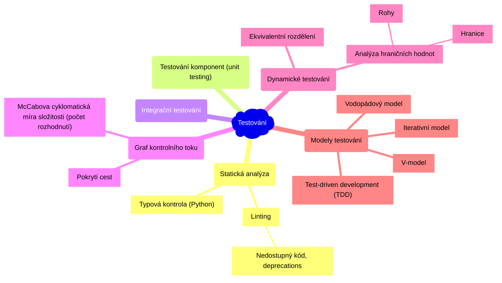

> Testování je proces spouštění programu se záměrem nalézt vadu.

- Cílem testování je **detekování vady**.
- Testování může ukázat přítomnost vad, ale nemůže prokázat absenci vad.

> **Testování komponent (unit testing) a proč vůbec testovat?**
>
> U rozsáhlých projektů je často potřeba **aktualizovat** určité **moduly** a podle potřeby **refaktorizovat** kód. Takové změny mohou způsobit **nechtěné následky** u jiných modulů, které aktualizovaný modul používají. To může někdy narušit stávající funkčnost. Kvalitní testy fungují jako **ochrana** proti těmto nechtěným následkům.
>
> Jako vývojáři bychom měli kód (ideálně od zahájení vývoje) testovat, abychom zajistili, že všechny moduly v aplikaci fungují tak jak mají. Testy komponent (unit testy) umožňují zkontrolovat, zda **malé izolované moduly fungují správně**, a umožňují opravit nesrovnalosti, které mohou vzniknout při aktualizacích a refaktorizaci.

- **Chyba** - lidská/strojová - způsobí vznik vady
- **Vada** - chybná část kódu/hardware, která může způsobit selhání
- **Selhání** - pokud se provede *vadný* kód, může to vést k chybnému výsledku (tzn. selhání), chování systému, které neodpovídá specifikaci

U nasazených systému nás může zajímat **Mean Time Between Failures (MTBF)**.

### 1.1. Modely testování

1. **Vodopádový model**:

    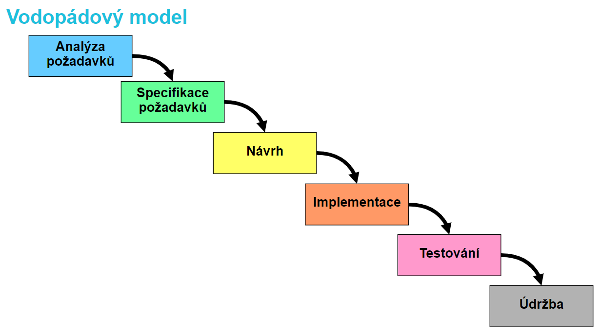

2. **V-model**:
    - V-model rozšiřuje vodopádový model tím, že pro každou fázi vývoje definuje odpovídající fázi testování.

    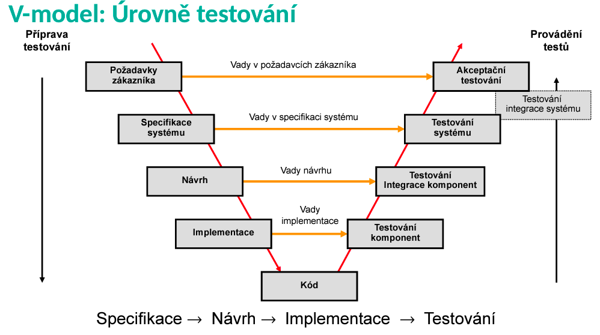

3. **Iterativní model** (např. Scrum):

    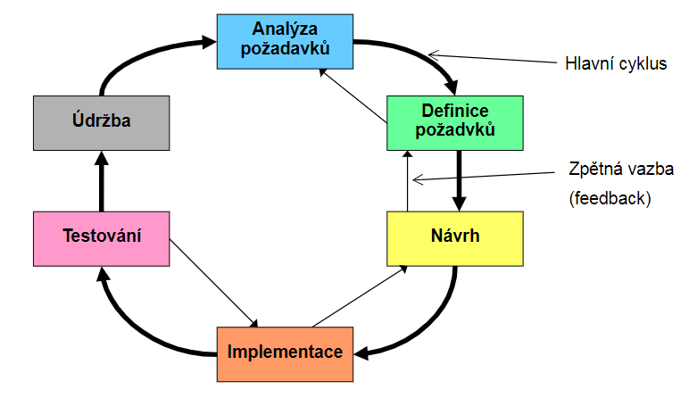

4. **Test-driven development** (TDD):
    - Jako první se píšou testy (tzn. na začátku by žádný test neměl projít).

    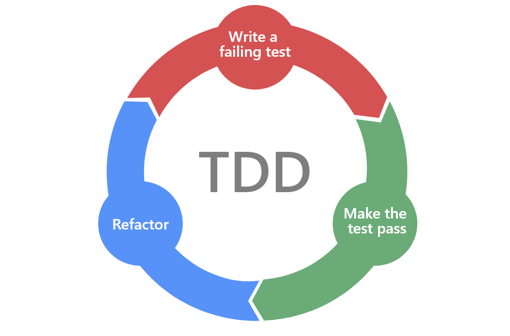

### 1.2. Úrovně testování

1. Testování komponent
2. Testování integrace komponent
3. Testování systému (funkční a nefunkční)
4. Akceptační testování
5. Obslužné testování *(Maintenance testing)*

### 1.3. Testování UI

**A/B testování** - porovnání dvou verzí UI (např. webové stránky) a vyhodnocení, která verze je lepší.

## 2. Architektonické styly

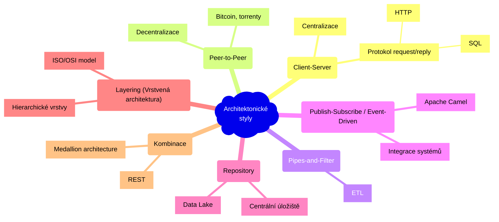

### 2.1. Client-Server

- server nabízí nějakou službu, klient ji používá
- klient používá služby serveru na základě protokolu požadavek / odpověď *(request / reply)*
- **centralizace** - snaha centralizovat funkce na server
- jednoduchost aktualizací

### 2.2. Peer-to-Peer (P2P)

- **decentralizace** ("opak klient-server")
- dobré škálování, vysoká odolnost vůči výpadkům
- každý komponent (klient) má vlastní procesy a chová se zároveň jako *klient a server*
- bitcoin, torrenty *(bittorrent protokol)*
- složité zajištění bezpečnosti

### 2.3. Pipes-and-Filter

- **pipe** - tok dat (jedním směrem)
- **filter** - transformace dat
- **pump** - zdroj dat
- **sink** - cíl dat
- např. programy v Linuxu: `ls -R | grep "swi" | wc -l` (`ls` je pump, `grep` je filter, `wc -l` počet řádků)
- snadná znovupoužitelnost, rozšiřitelnost a škálovatelnost
- jednoduchý paralelismus
- filtry mohou být přidány, odstraněny nebo přesunuty bez zásadních změn v ostatních filtrech
- *Single Responsibility Principle* - každý filtr by měl mít pouze jednu zodpovědnost
- typicky se používá v **ETL (Extract, Transform, Load) pipelines**

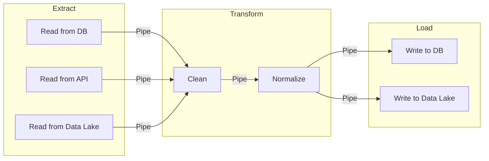

### 2.4. Publish-Subscribe (Event-Driven)

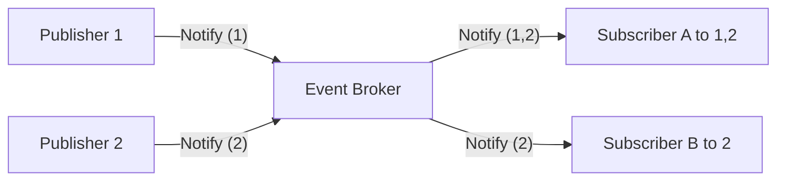

- když nějaký komponent ohlásí event - **publish** - tak komponenty, které jsou přihlášeny k odběru zpráv tohoto komponentu (subscribed) jsou notifikovány
- registrace k odběru zpráv - **subscribe** - komponenty vyjadřují zájem o eventy vytvořené daným komponentem
- používá se k **integraci systémů**
  - např. *Apache Camel*
- jednoduchá rozšiřitelnost a znovupoužitelnost
- složité testování
- potřeba sdíleného repozitáře
- např. implementace e-shopu

### 2.5. Repository

- **centrální sdílené úložiště** (např. soubor na disku) a **komponenty**, které nad tímto úložištěm komunikují (aktualizace, zápis a čtení dat)
- dostupnost dat pro všechny komponenty, ale zároveň musí všechny komponenty být schopny s těmito daty pracovat
- např. **data lake** - jednotný přístup k datům z různých zdrojů - různé databáze, parquet, csv, ...

### 2.6. Layering (Vrstvená architektura)

- vrstvy jsou hierarchické
  - vnější vrstva se chová jako klient vůči vnitřní vrstvě (komponenta z vnitřní vrstvy by neměla záviset na komponentě z vnější)
  - layer bridging - nějaká vrstva se přeskočí
  - komunikace mezi vrstvami probíhá pomocí protokolů
- vysoká úroveň abstrakce
- relativně jednoduchá úprava vrstev
- ne vždy je možné tuto architekturu snadno použít (nemusí být jednoduché rozdělit problém do vrstev podle míry abstrakce)
- výkon může být omezený režijními náklady *(overhead cost)* komunikace mezi vrstvami
- např. ISO/OSI model

### 2.7. Kombinace architektonických stylů

- **REST** (Representational state transfer) - RESTful-API
- **Medallion architecture** - "Pipes-and-Filter + Repository + Layering"
  - **Bronze** - raw data (ETL)
  - **Silver** - cleaned data (ELT)
  - **Gold** - data products (ELT)

## 3. Kvalitativní požadavky a jejich dosažení. Měření kvality návrhu

> **Funkční požadavky** - požadavky na **funkcionalitu** systému - např.: *systém umožní registraci uživatelů pomocí e-mailu a hesla*.
>
> **Kvalitativní požadavky** - požadavky na **kvalitu** systému - např.: *systém musí být dostupný 99,9 % času*.

### 3.1. Měření kvality návrhu

- **Chidamber & Kemerer metriky** (1996, 100 citací `¯\_(ツ)_/¯`) - pro každou třídu definují:
  1. Hloubku stromu dedičnosti.
  2. Počet metod.
  3. Počet potomků.
  4. Provázanost mezi objekty.
- **McCabova cyklomatická míra složitosti** - počet rozhodnutí v grafu řídícího toku
- **Úroveň vnoření** - cykly, podmínky
- **Fan-in, Fan-out** - kolik modulů daný modul volá a kolika moduly je modul volán.
- **Modularita** závisí na **soudržnosti (cohesion)** a **provázanosti (coupling)**.
- **Minimalizujeme provázanost** - míru (ne)závislosti mezi moduly. Provázanost měří komplexitu vazeb mezi moduly a jejich počet.
  1. **Provázání obsahu** *(content)* - jedna SW jednotka přímo mění interní data jiné SW jednotky.
  2. **Společné provázání** *(common)* - SW jednotky mají přístup ke stejným globálním datům
  3. **Řídící provázanost** *(control)* - jeden modul řídí chování (volá metody) jiného modulu
  4. **Stamp coupling** - vyměňování složitých datových struktur (např. serializované objekty)
  5. **Datová provázanost** - pouze hodnoty
  6. **Žádná provázanost** - např. `print("Hello")`

      

- **Maximalizujeme soudržnost** - souvislost vnitřních prvků modulu.
  1. **Nesouvisející** soudržnost - části SW jednotky spolu nesouvisí (porušení SRP, god object, anti-pattern).
  2. **Logická** soudržnost - části SW jednotky jsou projeny jen strukturou kódu.
  3. **Časová** soudržnost - části SW jednotky jsou propojeny, protože se spouští ve stejný čas.
  4. **Procedurální** soudržnost - části SW jednotky jsou propojeny, protože se spouští při stejné akci (např. backup).
  5. **Komunikační** soudržnost - SW jednotka funguje nad stejnými daty.
  6. **Funkční** soudržnost - SW jednotka obsahuje pouze prvky nezbytné pro výkon jedné funkcionality.
  7. **Informační** soudržnost - `f(x) = x^2 + 1`

## 4. Návrhové principy

**SOLID Design Principles** - *Robert C. Martin*

|||||
|--|--|--|--|
|**Single Responsibility Principle**| **SRP** | **Princip jedné odpovědnosti** | **Třída/funkce by měla mít *pouze jednu zodpovědnost* (funkčnost), která je jasně vystižena jejím názvem.** Pokud zodpovědnost třídy/funkce nelze popsat bez spojek ve slučovacím poměru (a, i, nebo, potom, ...), může být špatně navržena. |
|**Open Close Principle**| **OCP** | **Princip otevřenosti a uzavřenosti** | **Třída by měla být *otevřená pro rozšíření*, ale *uzavřená pro modifikaci*.** Tzn. měli bychom být schopni přidat novou funkcionalitu bez nutnosti měnit existující kód. Např. několik konkrétních tříd implementujících interface: `IPrinter`, `EPUBPrinter`, `PDFPrinter`. |
|**Liskov Substitution Principle**| **LSP** | **Liskové substituční princip** | **Podtřídy by měly být zaměnitelné s jejich bázovými třídami.** Pokud máme *interface* a nějakou hierarchii tříd, která implementuje tento *interface*, tak bychom měli být vždy schopni nahradit **předka potomkem** bez omezení správnosti všech metod předka. Polymorfismus. Např. do `Rectangle` lze přiřadit `Square`. |
|**Interface Segregation Principle**| **ISP** | **Princip oddělení rozhraní** | **Více specifických rozhraní je lepší než jedno univerzální rozhraní.** *Interface* by neměl definovat příliš mnoho chování (metod). Je lepší takové rozhraní rozdělit na více specifických rozhraní. *YAGNI - You Ain't Going to Need It.* Decoupling. |
|**Dependency Inversion Principle**| **DIP** | **Princip obrácení závislostí** | **Závislosti by měly směřovat od konkrétnímu typu k abstraktnímu.** Cílem je redukce závislostí v kódu. Pokud konkrétní typy závisí pouze na rozhraní, lze je snadno nahradit jinou implementací. Moduly vyšší úrovně by neměly záviset na modulech nižší úrovně. Znovupoužitelnost.|

|Nižší modul závisí na vyšším.| Změna `IBar` vynutí změnu u vyššího modulu. | Princip obrácení závislostí (DIP) - vyšší modul vlastní `IBar`, změny jdou směrem dolů. |
|--|--|--|
|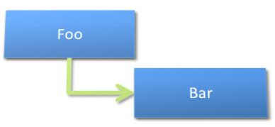| 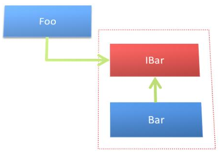 | 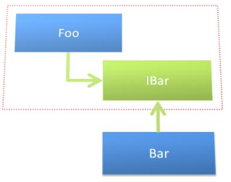 |

## 5. Návrhové vzory

## 6. Co je to Secure Software Development Lifecycle (SSDLC)? Jaká jsou jeho specifika a využití?

## 7. Popište pět základních bezpečnostních vlastností, které se používají k zajištění bezpečnosti a spolehlivosti informačních systémů. Zkratka “CIAAN”, tedy “Confidentiality”, “Integrity”, “Availability”, “Authenticity” a “Non-repudiation”. Uveďte příklady softwarových požadavků, které z těchto vlastností vycházejí

## 8. Penetrační testování software. Deskriptivní a preskriptivní rámce pro penetrační testování. Metody penetračního testování
