# Softwarové inženýrství

- [1. Význam testování, terminologie, testovací proces, Úrovně testování (V-model), Testovací techniky](#1-význam-testování-terminologie-testovací-proces-úrovně-testování-v-model-testovací-techniky)
  - [1.1. Modely testování](#11-modely-testování)
  - [1.2. Úrovně testování](#12-úrovně-testování)
  - [1.3. Testování UI](#13-testování-ui)
- [2. Architektonické styly](#2-architektonické-styly)
  - [2.1. Client-Server](#21-client-server)
  - [2.2. Peer-to-Peer (P2P)](#22-peer-to-peer-p2p)
  - [2.3. Pipes-and-Filter](#23-pipes-and-filter)
  - [2.4. Publish-Subscribe (Event-Driven)](#24-publish-subscribe-event-driven)
  - [2.5. Repository](#25-repository)
  - [2.6. Layering (Vrstvená architektura)](#26-layering-vrstvená-architektura)
  - [2.7. Kombinace architektonických stylů](#27-kombinace-architektonických-stylů)
  - [2.8. Výběr architektonického vzoru - trade-off analýza](#28-výběr-architektonického-vzoru---trade-off-analýza)
- [3. Kvalitativní požadavky a jejich dosažení. Měření kvality návrhu](#3-kvalitativní-požadavky-a-jejich-dosažení-měření-kvality-návrhu)
  - [3.1. Měření kvality návrhu](#31-měření-kvality-návrhu)
- [4. Návrhové principy](#4-návrhové-principy)
- [5. Návrhové vzory](#5-návrhové-vzory)
  - [5.1. Gamma kategorizace](#51-gamma-kategorizace)
  - [5.2. Vzory vytváření](#52-vzory-vytváření)
  - [5.3. Vzory strukturální](#53-vzory-strukturální)
  - [5.4. Vzory chování](#54-vzory-chování)
- [6. Co je to Secure Software Development Lifecycle (SSDLC)? Jaká jsou jeho specifika a využití?](#6-co-je-to-secure-software-development-lifecycle-ssdlc-jaká-jsou-jeho-specifika-a-využití)
- [7. Popište pět základních bezpečnostních vlastností, které se používají k zajištění bezpečnosti a spolehlivosti informačních systémů. Zkratka “CIAAN”, tedy “Confidentiality”, “Integrity”, “Availability”, “Authenticity” a “Non-repudiation”. Uveďte příklady softwarových požadavků, které z těchto vlastností vycházejí](#7-popište-pět-základních-bezpečnostních-vlastností-které-se-používají-k-zajištění-bezpečnosti-a-spolehlivosti-informačních-systémů-zkratka-ciaan-tedy-confidentiality-integrity-availability-authenticity-a-non-repudiation-uveďte-příklady-softwarových-požadavků-které-z-těchto-vlastností-vycházejí)
- [8. Penetrační testování software. Deskriptivní a preskriptivní rámce pro penetrační testování. Metody penetračního testování](#8-penetrační-testování-software-deskriptivní-a-preskriptivní-rámce-pro-penetrační-testování-metody-penetračního-testování)
  - [8.1. Deskriptivní rámce](#81-deskriptivní-rámce)
  - [8.2. Preskriptivní rámce](#82-preskriptivní-rámce)
  - [8.3. Metody penetračního testování](#83-metody-penetračního-testování)
  - [8.4. Proces PT](#84-proces-pt)

## 1. Význam testování, terminologie, testovací proces, Úrovně testování (V-model), Testovací techniky

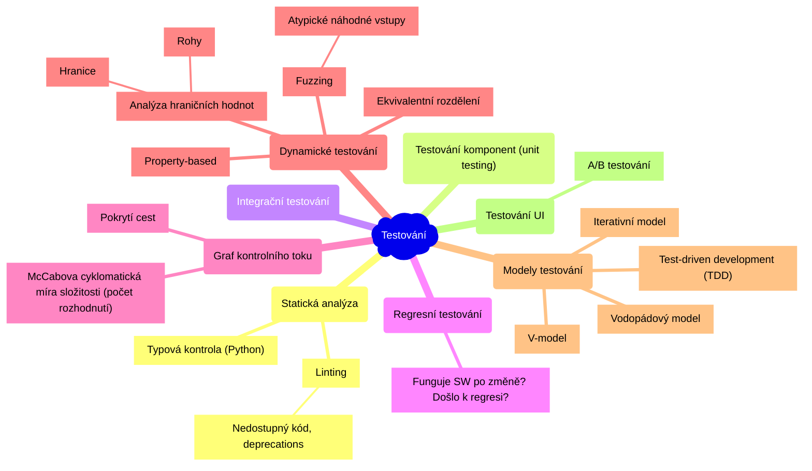

> Testování je proces spouštění programu se záměrem nalézt vadu.

- Cílem testování je **detekování vady**.
- Testování může ukázat přítomnost vad, ale nemůže prokázat absenci vad.

> **Testování komponent (unit testing) a proč vůbec testovat?**
>
> U rozsáhlých projektů je často potřeba **aktualizovat** určité **moduly** a podle potřeby **refaktorizovat** kód. Takové změny mohou způsobit **nechtěné následky** u jiných modulů, které aktualizovaný modul používají. To může někdy narušit stávající funkčnost. Kvalitní testy fungují jako **ochrana** proti těmto nechtěným následkům **(regresní testování, regrese)**.
>
> Jako vývojáři bychom měli kód (ideálně od zahájení vývoje) testovat, abychom zajistili, že všechny moduly v aplikaci fungují tak jak mají. Testy komponent (unit testy) umožňují zkontrolovat, zda **malé izolované moduly fungují správně**, a umožňují opravit nesrovnalosti, které mohou vzniknout při aktualizacích a refaktorizaci.

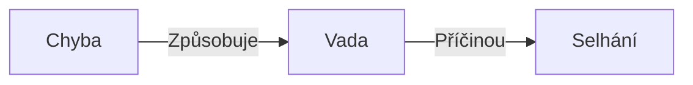

- **Chyba** - lidská/strojová - způsobí vznik vady
- **Vada** - chybná část kódu/hardware, která může způsobit selhání
- **Selhání** - pokud se provede *vadný* kód, může to vést k chybnému výsledku (tzn. selhání), chování systému, které neodpovídá specifikaci

U nasazených systému nás může zajímat **Mean Time Between Failures (MTBF)**.

### 1.1. Modely testování

1. **Vodopádový model** - "dokonalý kód neobsahuje chyby, takže testování je zbytečné".

    

2. **V-model** - rozšiřuje vodopádový model tím, že pro každou fázi vývoje definuje odpovídající fázi testování.

    

3. **Iterativní model** (např. Scrum) - zpětná vazba (feedback).

    

4. **Test-driven development** (TDD) - jako první se píšou testy (tzn. na začátku by žádný test neměl projít).

    

### 1.2. Úrovně testování

1. Testování komponent
2. Testování integrace komponent
3. Testování systému (funkční a nefunkční)
4. Akceptační testování
5. Obslužné testování *(Maintenance testing)*

### 1.3. Testování UI

**A/B testování** - porovnání dvou verzí UI (např. webové stránky) a vyhodnocení, která verze je lepší.


## 2. Architektonické styly

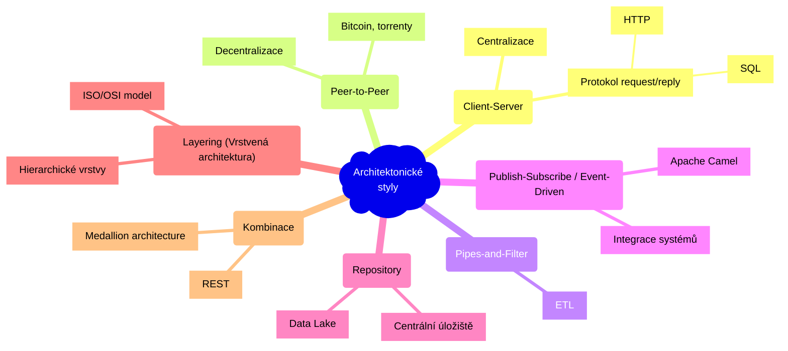

### 2.1. Client-Server


- server nabízí nějakou službu, klient ji používá
- klient používá služby serveru na základě protokolu požadavek / odpověď *(request / reply)*
- **centralizace** - snaha centralizovat funkce na server
- jednoduchost aktualizací, oddělení zodpovědnosti
- selhání serveru může způsobit výpadek celého systému

### 2.2. Peer-to-Peer (P2P)


- **decentralizace** ("opak klient-server")
- dobré škálování, vysoká odolnost vůči výpadkům
- každý komponent (klient) má vlastní procesy a chová se zároveň jako *klient a server* (všechny komponenty jsou si rovny)
- bitcoin, torrenty *(BitTorrent protokol)*
- složité zajištění bezpečnosti

### 2.3. Pipes-and-Filter

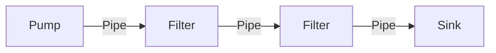

- **pipe** - tok dat (jedním směrem)
- **filter** - transformace dat
- **pump** - zdroj dat
- **sink** - cíl dat
- např. programy v Linuxu: `ls -R | grep "swi" | wc -l` (`ls` je pump, `grep` je filter, `wc -l` počet řádků)
- snadná znovupoužitelnost, rozšiřitelnost a škálovatelnost
- jednoduchý paralelismus
- filtry mohou být přidány, odstraněny nebo přesunuty bez zásadních změn v ostatních filtrech
- *Single Responsibility Principle* - každý filtr by měl mít pouze jednu zodpovědnost
- typicky se používá v **ETL (Extract, Transform, Load) pipelines**

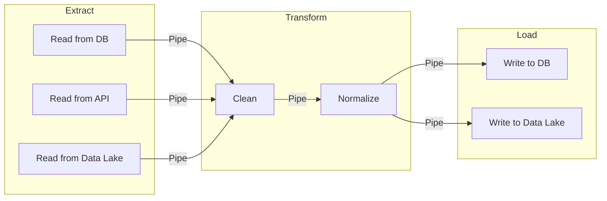

### 2.4. Publish-Subscribe (Event-Driven)

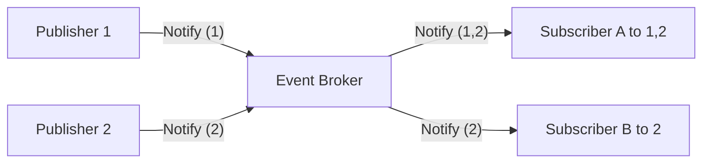

- když nějaký komponent ohlásí event - **publish** - tak komponenty, které jsou přihlášeny k odběru zpráv tohoto komponentu (subscribed) jsou notifikovány
- registrace k odběru zpráv - **subscribe** - komponenty vyjadřují zájem o eventy vytvořené daným komponentem
- používá se k **integraci systémů**
  - např. *Apache Camel*
- jednoduchá rozšiřitelnost a znovupoužitelnost
- složité testování
- potřeba sdíleného repozitáře
- např. implementace e-shopu
- návrhový vzor **Observer**

### 2.5. Repository

- **centrální sdílené úložiště** (např. soubor na disku) a **komponenty**, které nad tímto úložištěm komunikují (aktualizace, zápis a čtení dat)
- dostupnost dat pro všechny komponenty, ale zároveň musí všechny komponenty být schopny s těmito daty pracovat
- např. **data lake** - jednotný přístup k datům z různých zdrojů - různé databáze, parquet, csv, ...

### 2.6. Layering (Vrstvená architektura)

- vrstvy jsou hierarchické
  - vnější vrstva se chová jako klient vůči vnitřní vrstvě (komponenta z vnitřní vrstvy by neměla záviset na komponentě z vnější)
  - layer bridging - nějaká vrstva se přeskočí
  - komunikace mezi vrstvami probíhá pomocí protokolů
- vysoká úroveň abstrakce
- relativně jednoduchá úprava vrstev
- ne vždy je možné tuto architekturu snadno použít (nemusí být jednoduché rozdělit problém do vrstev podle míry abstrakce)
- výkon může být omezený režijními náklady *(overhead cost)* komunikace mezi vrstvami
- např. ISO/OSI model

### 2.7. Kombinace architektonických stylů

- **REST** (Representational state transfer) - RESTful-API
- **Medallion architecture** - "Pipes-and-Filter (ETL) + Repository + Layering"
  - **Bronze** - raw data
  - **Silver** - cleaned data
  - **Gold** - data products

### 2.8. Výběr architektonického vzoru - trade-off analýza

- "analýza kompromisů"
- prioritu nastavíme se stake-holdery a přiřadíme vhodnost vzorů podle zkušenosti
- vynásobím *vektor priorit* s *vektorem vzoru*, čím vyšší číslo, tím vhodnější

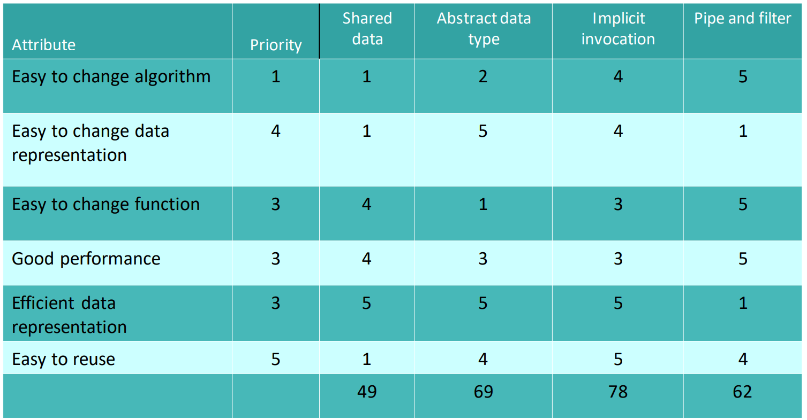

## 3. Kvalitativní požadavky a jejich dosažení. Měření kvality návrhu

> **Funkční požadavky** - požadavky na **funkcionalitu** systému - např.: *systém umožní registraci uživatelů pomocí e-mailu a hesla*.
>
> **Kvalitativní požadavky** - požadavky na **kvalitu** systému - např.: *systém musí být dostupný 99,9 % času*.

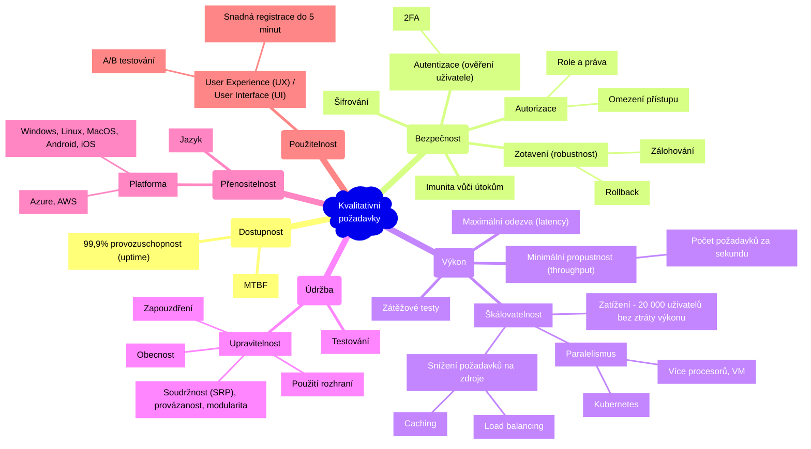

### 3.1. Měření kvality návrhu

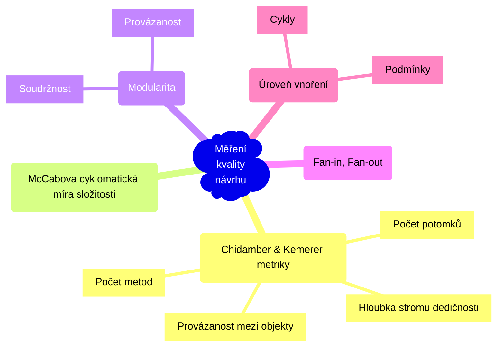

- **Chidamber & Kemerer metriky** (1996, 100 citací `¯\_(ツ)_/¯`) - pro každou třídu definují:
  1. Hloubku stromu dedičnosti.
  2. Počet metod.
  3. Počet potomků.
  4. Provázanost mezi objekty.
  5. A další.
- **McCabova cyklomatická míra složitosti** - počet rozhodnutí v grafu řídícího toku
- **Úroveň vnoření** - cykly, podmínky
- **Fan-in, Fan-out** - kolik modulů daný modul volá a kolika moduly je modul volán.
- **Modularita** závisí na **soudržnosti (cohesion)** a **provázanosti (coupling)**.
- **Minimalizujeme provázanost** - míru (ne)závislosti mezi moduly. Provázanost měří komplexitu vazeb mezi moduly a jejich počet.
  1. **Provázání obsahu** *(content)* - jedna SW jednotka přímo mění interní data jiné SW jednotky.
  2. **Společné provázání** *(common)* - SW jednotky mají přístup ke stejným globálním datům
  3. **Řídící provázanost** *(control)* - jeden modul řídí chování (volá metody) jiného modulu
  4. **Stamp coupling** - vyměňování složitých datových struktur (např. serializované objekty)
  5. **Datová provázanost** - pouze hodnoty
  6. **Žádná provázanost** - např. `print("Hello")`

      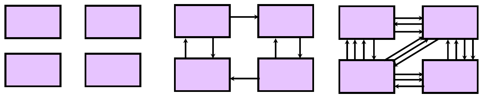

- **Maximalizujeme soudržnost** - souvislost vnitřních prvků modulu.
  1. **Nesouvisející** soudržnost - části SW jednotky spolu **nesouvisí** (porušení SRP, god object, anti-pattern).
  2. **Logická** soudržnost - části SW jednotky jsou projeny jen **strukturou kódu**.
  3. **Časová** soudržnost - části SW jednotky jsou propojeny, protože se spouští **ve stejný čas**.
  4. **Procedurální** soudržnost - části SW jednotky jsou propojeny, protože se spouští při **stejné akci** (např. backup).
  5. **Komunikační** soudržnost - SW jednotka funguje nad **stejnými daty**.
  6. **Funkční** soudržnost - SW jednotka obsahuje pouze prvky **nezbytné** pro výkon jedné funkcionality.
  7. **Informační** soudržnost - `f(x) = x^2 + 1`

## 4. Návrhové principy

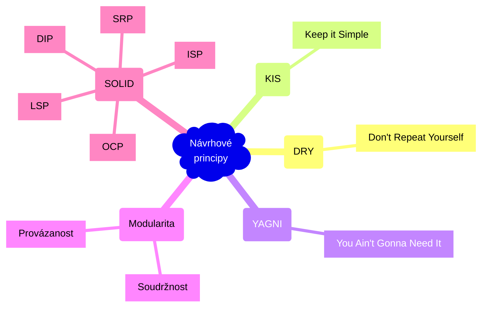

**DRY - Don't Repeat Yourself** - místo opakování kódu je většinou lepší vytvořit znovupoužitelný modul.

**KIS - Keep it Simple** - kód by neměl být zbytečně složitý. Velmi důležité pro práci v týmu.

**YAGNI - You Ain't Gonna Need It** - neimplementuj funkčnost, kterou aktuálně nepotřebuješ.

**Modularita** - soudržnost a provázanost (viz [Měření kvality návrhu](#31-měření-kvality-návrhu)).

**SOLID Design Principles** - *Robert C. Martin*

|||||
|--|--|--|--|
|**Single Responsibility Principle**| **SRP** | **Princip jedné odpovědnosti** | **Třída/funkce by měla mít *pouze jednu zodpovědnost* (funkčnost), která je jasně vystižena jejím názvem.** Pokud zodpovědnost třídy/funkce nelze popsat bez spojek ve slučovacím poměru (a, i, nebo, potom, ...), může být špatně navržena. |
|**Open Close Principle**| **OCP** | **Princip otevřenosti a uzavřenosti** | **Třída by měla být *otevřená pro rozšíření*, ale *uzavřená pro modifikaci*.** Tzn. měli bychom být schopni přidat novou funkcionalitu bez nutnosti měnit existující kód. Např. několik konkrétních tříd implementujících interface: `IPrinter`, `EPUBPrinter`, `PDFPrinter`. |
|**Liskov Substitution Principle**| **LSP** | **Liskové substituční princip** | **Podtřídy by měly být zaměnitelné s jejich bázovými třídami.** Pokud máme *interface* a nějakou hierarchii tříd, která implementuje tento *interface*, tak bychom měli být vždy schopni nahradit **předka potomkem** bez omezení správnosti všech metod předka. Polymorfismus. Např. do `Rectangle` lze přiřadit `Square`. |
|**Interface Segregation Principle**| **ISP** | **Princip oddělení rozhraní** | **Více specifických rozhraní je lepší než jedno univerzální rozhraní.** *Interface* by neměl definovat příliš mnoho chování (metod). Je lepší takové rozhraní rozdělit na více specifických rozhraní. *YAGNI - You Ain't Going to Need It.* Decoupling. |
|**Dependency Inversion Principle**| **DIP** | **Princip obrácení závislostí** | **Závislosti by měly směřovat od konkrétnímu typu k abstraktnímu.** Cílem je redukce závislostí v kódu. Pokud konkrétní typy závisí pouze na rozhraní, lze je snadno nahradit jinou implementací. Moduly vyšší úrovně by neměly záviset na modulech nižší úrovně. Znovupoužitelnost. Návrhový vzor **Bridge**.|


<details><summary> DIP </summary>

Bez DIP:

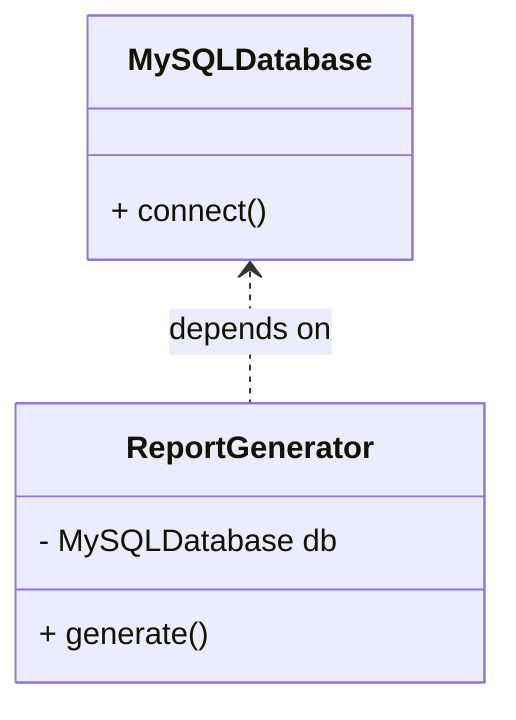

```python
# Without DIP
class MySQLDatabase:
    def connect(self):
        print("Connected to MySQL")

class ReportGenerator:
    def __init__(self):
        self.database = MySQLDatabase()

    def generate(self):
        self.database.connect()
```

Problém: `ReportGenerator` přímo závisí na konkrétní implementaci `MySQLDatabase` (nižší modul). Pokud chceme použít jinou databázi, musíme měnit `ReportGenerator`.

S DIP:

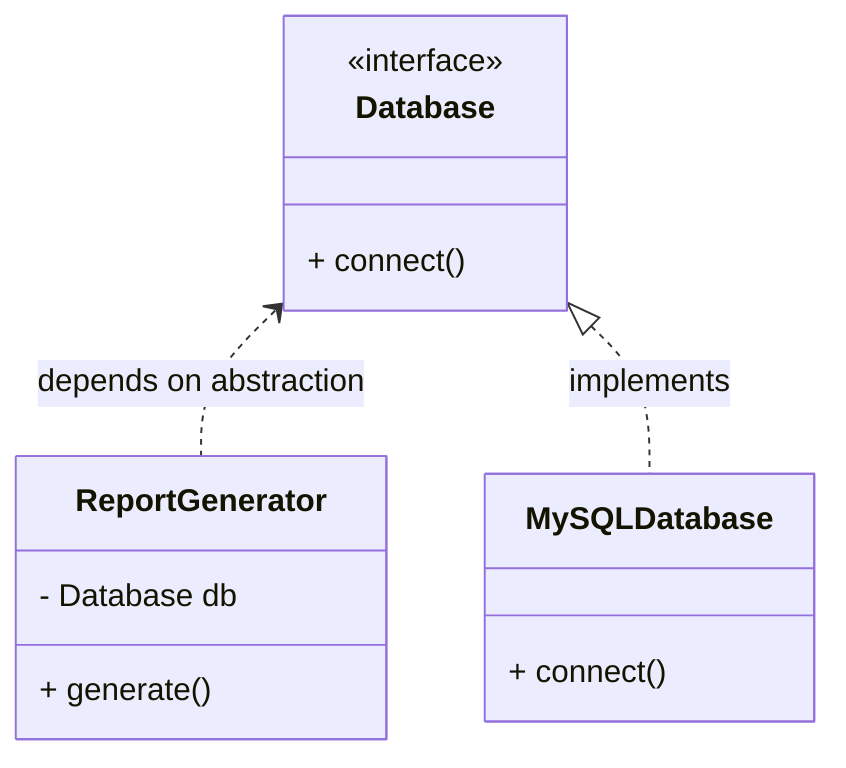

```python
# With DIP
from abc import ABC, abstractmethod

class Database(ABC):
    @abstractmethod
    def connect(self):
        pass

class MySQLDatabase(Database):
    def connect(self):
        print("Connected to MySQL")

class ReportGenerator:
    def __init__(self, db: Database):
        self.database = db

    def generate(self):
        self.database.connect()
```

Teď `ReportGenerator` závisí na abstraktním rozhraní `Database`, nikoli na konkrétní implementaci. Můžeme snadno přidat další databáze bez nutnosti měnit `ReportGenerator`.

</details>

## 5. Návrhové vzory

Gamma et al. *Design Patterns: Elements of Reusable Object-Oriented Software* (1994).

### 5.1. Gamma kategorizace

1. **Vzory vytváření** *(Creational Patterns)* - tvorba / konstrukce objektů
2. **Vzory strukturální** *(Structural Patterns)* - význam pro dobrý API design
3. **Vzory chování** *(Behavioral Patterns)*

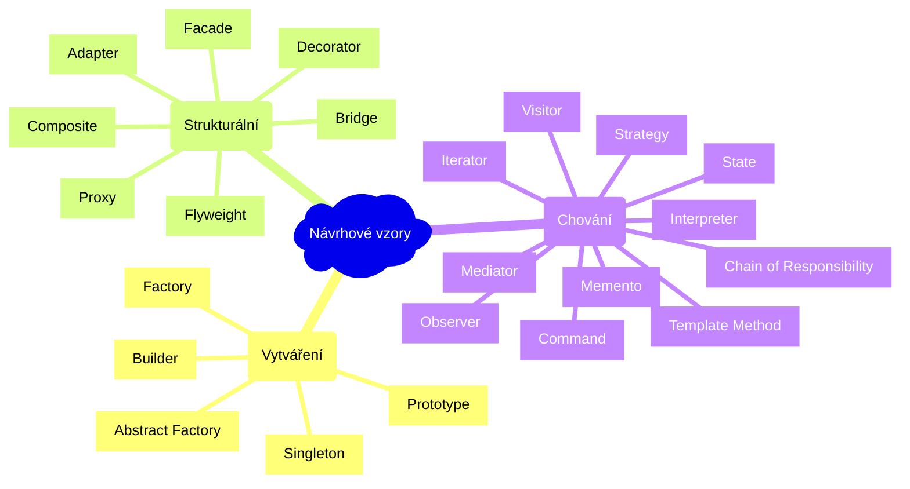

### 5.2. Vzory vytváření

1. **Stavitel (Builder)** - vzor pro vytváření složitých objektů po částech.
    - Např. `PersonBuilder().with_name("John").with_age(30)`, praktičtější příklad - složité předzpracování dat
    - Můžeme definovat "recepty" pro často vytvářené objekty, např. `PersonBuilder.get_recipe("john")`

2. **Továrna (Factory)** - vzor pro vytváření objektů bez nutnosti specifikovat konkrétní třídu.

    <details><summary> Factory </summary>

    ```python
    class Person:
        def __init__(self, id, name):
            self.id = id
            self.name = name

    class PersonFactory:
        id = 0

        def create_person(self, name):
            p = Person(PersonFactory.id, name)
            PersonFactory.id += 1
            return p
    ```

    </details>

3. **Abstraktní továrna (Abstract Factory)** - hierarchie továren.
4. **Prototyp (Prototype)** - klonování objektu. Vytváření objektu pomocí kopie jiného objektu. Např. `copy.copy()` nebo `copy.deepcopy()`.

    <details><summary> Prototyp </summary>

    ```python
    import copy

    class Person:
        def __init__(self, name):
            self.name = name

        def clone(self):
            return copy.copy(self)

    john = Person("John")
    john_clone = john.clone()
    ```

    </details>

5. **Singleton** - vzor pro zajištění, že třída má pouze jednu instanci a poskytuje globální přístup k této instanci. Např. `logging`.

### 5.3. Vzory strukturální

1. **Adaptér (Adapter)** - vzor pro **přizpůsobení rozhraní** jedné třídy jinému rozhraní.
2. **Most (Bridge)** - vzor pro **oddělení abstrakce od implementace** (decoupling) pomocí vytvoření mostu mezi hierarchiemi **(DIP)**.

    

    <details><summary> Most </summary>

    ```python
    # Shapes can be rendered in vector or raster form

    class Renderer():
        def render_circle(self, radius):
            pass


    class VectorRenderer(Renderer):
        def render_circle(self, radius):
            print(f'Drawing a circle of radius {radius}')


    class RasterRenderer(Renderer):
        def render_circle(self, radius):
            print(f'Drawing pixels for circle of radius {radius}')


    class Shape:
        def __init__(self, renderer):
            self.renderer = renderer

        def draw(self): pass
        def resize(self, factor): pass


    class Circle(Shape):
        def __init__(self, renderer, radius):
            super().__init__(renderer)
            self.radius = radius

        def draw(self):
            self.renderer.render_circle(self.radius)


    if __name__ == '__main__':
        raster = RasterRenderer()
        vector = VectorRenderer()
        circle = Circle(vector, 5)
        circle.draw()
    ```

    </details>

3. **Kompozit (Composite)** - když od jednoduchého (skalárního) i složeného objektu očekáváme podobné nebo stejné chování.

    <details><summary> Kompozit </summary>

    ```python
    class Graphic:
        def draw(self): pass


    class Circle(Graphic):
        def draw(self):
            print("Drawing a circle")


    class Square(Graphic):
        def draw(self):
            print("Drawing a square")


    class Group(Graphic):
        def __init__(self):
            self.graphics = []

        def add(self, graphic):
            self.graphics.append(graphic)

        def draw(self):
            for graphic in self.graphics:
                graphic.draw()

    group = Group()
    group.add(Circle())
    group.add(Square())
    group.draw()
    ```

    </details>

    ```mermaid
    classDiagram
        class Graphic {
            + draw()
        }
        
        class Circle {
            + draw()
        }
        
        class Square {
            + draw()
        }
        
        class Group {
            - graphics: List~Graphic~
            + add(graphic)
            + draw()
        }
        
        Graphic <|.. Circle
        Graphic <|.. Square
        Graphic <|..o Group  : contains
    ```

4. **Dekorátor (Decorator)** - vzor pro **dynamické přidání chování** objektu.

    <details><summary> Dekorátor </summary>

    ```python
    class Shape(ABC):
        def __str__(self):
            return ''


    class Circle(Shape):
        def __init__(self, radius=0.0):
            self.radius = radius


    class ColoredShape(Shape):
        def __init__(self, shape, color):
            if isinstance(shape, ColoredShape):
                raise Exception('Cannot apply ColoredDecorator twice')
            self.shape = shape
            self.color = color

    circle = Circle(5.0)
    colored_circle = ColoredShape(circle, 'red')
    ```

    </details>

5. **Facade** - vzor pro **zjednodušení rozhraní** komplexního kódu.
    - Např. `std::cout` (výpis do konzole - na pozadí musí být nějaký buffer a nevím co všechno) nebo `sklearn`.
6. **Flyweight** - vzor pro **snížení paměťové náročnosti**. Uložení dat mimo objekt a přístup přes referenci.
    1. Př. u *formátování textu* si nebudeme ukládat formátování pro každý znak, ale budeme si pamatovat pouze indexy `start`, `end` a typ formátování.
    2. Ve 2D hře nebude mít každý objekt uvnitř uložený svůj *sprite*, ale pouze *referenci* na daný sprite.
7. **Proxy** - úprava existující třídy buď pomocí *kompozice* nebo *dědičnosti*. **OCP**.
    - Virtuální proxy - načítání objektu až když je potřeba (`lazy loading`).
    - Protection proxy - omezení přístupu. Např. `CarProxy` - protection proxy pro `Car`, která zajišťuje, že auto může řídit pouze řidič, který je starší 18 let.
    - Caching proxy

        ```mermaid
            classDiagram
                class Driver {
                    - name: String
                    - age: Integer
                    + __init__(name, age)
                }
                
                class Car {
                    - model: String
                    + __init__(model)
                    + drive()
                }
                
                class CarProxy {
                    - driver: Driver
                    - car: Car
                    + __init__(driver, car)
                    + drive()
                }
                
                CarProxy o-- Driver
                CarProxy o-- Car
        ```

### 5.4. Vzory chování

1. **Chain of Responsibility** - umožňuje předat požadavek řetězci zpracovatelů *(handlers)*. Každý zpracovatel buď pošle požadavek v řetězci dál nebo požadavek zpracuje.
2. **Command** - zapouzdřuje nějaký *požadavek jako objekt*. Umožňuje ukládání požadavků do fronty, čímž lze implementovat `undo` a `redo`.
3. **Interpreter** - vzor pro **interpretaci** jazyků:
    1. *lexing* - rozdělení textu na tokeny.
    2. *parsing* - interpretace tokenů
4. **Iterator** - Přístup k prvkům kolekce bez znalosti imlementace dané kolekce. Např. binární strom.
    - `get_next()` - vrátí další prvek
    - `has_next()` - vrátí `True`, pokud existuje další prvek
5. **Memento** - reprezentuje *stav systému* (typicky bez metod), *ke kterému se můžeme vrátit* (quicksave, rollback).

    <details><summary> Memento </summary>

    ```python
    class Memento:
        def __init__(self, balance: int) -> None:
            self.balance = balance


    class BankAccount:
        def __init__(self, balance: int = 0) -> None:
            self.balance = balance

        def deposit(self, amount: int) -> Memento:
            self.balance += amount
            return Memento(self.balance)

        def restore(self, memento: int) -> None:
            self.balance = memento.balance
    ```

    </details>

6. **Mediator** - Definuje, jak by spolu měla množina objektů interagovat. Např. *chatovací aplikace* `ChatRoom` je mediátor mezi uživateli `User`.
7. **Observer** - Definuje one-to-many závislost publisher-subscriber(s). Pokud jeden objekt změní stav, tak všechny závislé objekty jsou automaticky aktualizovány.
8. **State** - Umožňuje změnu chování objektu na základě změny vnitřního stavu - změnou třídy objektu (níže `state` je buď `OnState` nebo `OffState`). Konečný automat (lze implementovat třeba přes `enum`, nemusí to být OOP).

    ```mermaid
    classDiagram
        class Switch {
            - state: State
            + on()
            + off()
        }
        
        class State {
            <<Abstract>>
            + on(switch)
            + off(switch)
        }
        
        class OnState {
            + off(switch)
        }
        
        class OffState {
            + on(switch)
        }
        
        State --o Switch
        State <|.. OnState
        State <|.. OffState
    ```

    - `OnState.off(switch)` provede `switch.state = OffState()`.
    - `OnState.on(switch)` neudělá nic.

9. **Strategy** - Definuje skupinu algoritmů, zapouzdří je a docílí jejich vzájemné zaměnitelnosti. Volba algoritmu probíhá až v době běhu programu.

    ```mermaid
    classDiagram
        class Navigator {
            - route_strategy
            + build_route(A, B)
        }
        
        class RouteStrategy {
            <<interface>>
            + build_route(A, B)
        }
        
        class RoadStrategy {
            + build_route(A, B)
        }
        
        class PublicTransportStrategy {
            + build_route(A, B)
        }
        
        class WalkingStrategy {
            + build_route(A, B)
        }
        
        RouteStrategy --o Navigator
        RouteStrategy <|.. RoadStrategy
        RouteStrategy <|.. PublicTransportStrategy
        RouteStrategy <|.. WalkingStrategy
    ```

10. **Visitor** - Reprezentuje operaci, která se provádí na struktuře složené z objektů. Např. `IntegerExpression`, `AdditionExpression` a `Visitor` který spočítá hodnotu výrazu.
11. **Template method** - Definuje "skeleton" algoritmu, konkrétní implementace se provádí v podtřídě.

    <details><summary> Template Method </summary>

    ```python
    from abc import ABC

    class Game(ABC):

        def run(self):
            self.start()
            while not self.have_winner:
                self.take_turn()
            print(f'Player {self.winning_player} wins!')

        def start(self): pass

        @property
        def have_winner(self): pass

        def take_turn(self): pass

        @property
        def winning_player(self): pass
    ```

    </details>

## 6. Co je to Secure Software Development Lifecycle (SSDLC)? Jaká jsou jeho specifika a využití?

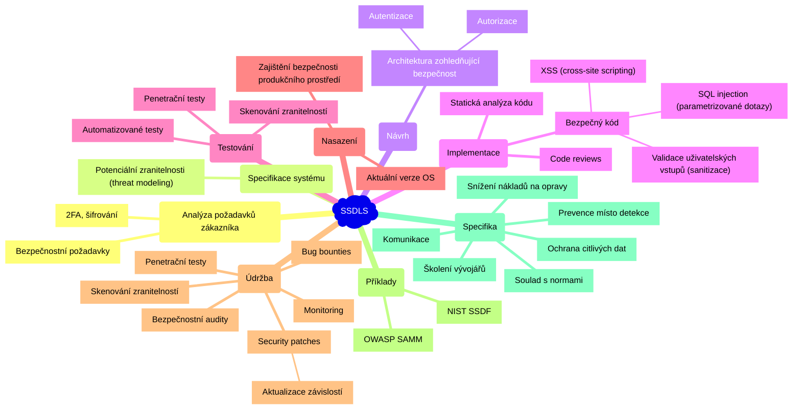

**SDLC** je proces vývoje SW.

**SSDLC** přidává do každé fáze **SDLC** požadavky na počítačovou bezpečnost. Od začátku SDLC je zohledněna bezpečnost, což vede k *nižším nákladům na opravy zranitelností* a *nižšímu riziku nasazení zranitelného SW do produkčního prostředí*.

National Institute of Standards and Technology **(NIST)** definuje Secure software development framework **(SSDF)**, který definuje jak realizovat **SSDLC**.

1. **Analýza požadavků zákazníka** - stanovení **bezpečnostních požadavků** (např. 2FA, šifrování, ...)
2. **Specifikace systému** (plánování) - identifikace **potenciálních zranitelností** *(threat modeling)*
3. **Návrh** - **architektura** zohledňující **bezpečnost** (např. nastavení uživatelských rolí, ...)
4. **Implementace** - zaměření na **bezpečný kód** (SQL injection, ...), code reviews, statická analýza kódu
5. **Testování** - **penetrační testy**, skenování zranitelností, testování kódu, automatizované testy
6. **Nasazení** - zajištění **bezpečnosti produkčního prostředí** (např. aktuální verze OS)
7. **Údržba** - pravidelné **bezpečnostní aktualizace** *(security patches)*, penetrační testy, bug bounties (odměny za nahlášení vady), skenování zranitelností, monitoring, bezpečnostní audity

Důležitá je **komunikace** mezi vývojáři a experty na počítačovou bezpečnost. Bezpečnostní experti by měli být zapojeni do každé fáze vývoje SW.

Mezi další specifika SSDLC patří:

- **Prevence místo detekce** - zaměření na prevenci zranitelností a útoků
- **Školení vývojářů** - školení vývojářů v oblasti bezpečnosti a zranitelností
- Soulad s **bezpečnostními normami a standardy**
- **Snížení nákladů na opravy zranitelností**, protože jsou zranitelnosti odhaleny dříve v procesu vývoje.
- Zranitelnosti jsou odhaleny dříve v procesu vývoje, což snižuje riziko nasazaní zranitelného SW do produkčního prostředí.
- Ochrana **citlivých dat** a informací před zneužitím útočníky.
- Pravidelné **bezpečnostní audity**.

Známé příklady SSDLC:

- **OWASP SAMM** - *Software Assurance Maturity Model*
- **NIST SSDF** - *Secure Software Development Framework*

**XSS** je zranitelnost, která umožňuje útočníkovi vložit škodlivý kód do webové stránky, který se poté spustí v prohlížeči oběti. Např. vložení JavaScriptu do komentáře na webové stránce.

## 7. Popište pět základních bezpečnostních vlastností, které se používají k zajištění bezpečnosti a spolehlivosti informačních systémů. Zkratka “CIAAN”, tedy “Confidentiality”, “Integrity”, “Availability”, “Authenticity” a “Non-repudiation”. Uveďte příklady softwarových požadavků, které z těchto vlastností vycházejí

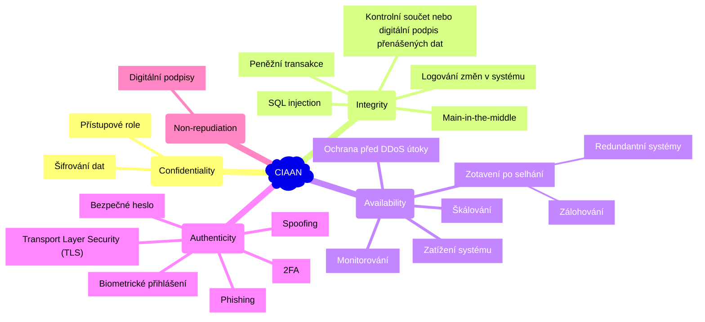

Jedná se o softwarové požadavky, které mají zajistit bezpečnost systému:

| CIAAN | Popis | SW požadavky | Útoky |
|-------|-------|--------------|-------|
| Confidentiality (důvěrnost) | Zajištění, že informace jsou přístupné pouze oprávněným osobám. Ochrana před neoprávněným přístupem. | Šifrování dat; Přístupové role a práva (kontrola přístupu); Autorizace uživatelů (co může uživatel dělat) | - |
| Integrity (integrita) | Zamezení neautorizované modifikace nebo zničení informací. | Logování změn v systému; Kontrolní součet nebo digitální podpis přenášených dat; Šifrování dat při přenosu | MitM; SQL Injection |
| Availability (dostupnost) | Zajištění, že informace jsou vždy přístupné oprávněným uživatelům. | Rychlé zotavení při selhání (zálohování, redundantní systémy); Monitorování; Škálování; Load balancing | DDoS |
| Authenticity (autentičnost) | Ověření identity uživatele (autentizace). Uživatel je tím, za koho se vydává. | 2FA; Bezpečné heslo; Biometrické přihlášení | Spoofing; Phishing; Vishing; Keylogging |
| Non-repudiation (nepopiratelnost) | Odesílatel nemůže popřít, že zprávu odeslal a příjemce nemůže popřít, že zprávu přijal. | Digitální podpisy (nepopiratelnost a integrita); logování aktivity | Key Theft |

- **SQL Injection** - neošetřené webové aplikace mohou útočníkům dát k dispozici nástroj pro modifikaci dat přímo v databázi.
- **MitM** - útočník odposlouchává komunikaci mezi dvěma stranami a může ji modifikovat.
- **Spoofing** - osoba nebo program se vydává za jinou osobu nebo program.
- [Ukázka asymetrického šifrování](./systems_and_networking.md#5-bezpečnost-počítačových-sítí-s-tcpip-útoky-paketové-filtry-stavový-firewall-šifrování-a-autentizace-virtuální-privátní-sítě).

## 8. Penetrační testování software. Deskriptivní a preskriptivní rámce pro penetrační testování. Metody penetračního testování

> **Penetrační testování** je kontrolovaný proces simulující útok na informační systém, aplikaci nebo síť s cílem odhalit *zranitelnosti*, které by mohly být zneužity útočníkem.

Analytici zabývající penetračním testováním jsou experti v oblasti etického hackování, kteří vyživájí hackerské nástroje a techniky k odhalené zranitelností informačního systému.

### 8.1. Deskriptivní rámce

Deskriptivní (popisné) rámce popisují jak penetrační testy ve *skutečnosti probíhají*.

- **BSIMM** /bee sim/ - **Building Security in Maturity Model** - analýza existujícího SW.
- **MITRE ATT&CK** (MITRE Adversarial Tactics, Techniques and Common Knowledge)
  - Útočný vektor.
  - MITRE ATT&CK® je celosvětově dostupná znalostní databáze taktik a technik útočníků založená na reálných pozorováních.
- **Cyber Kill Chain - Lockheed Martin**

### 8.2. Preskriptivní rámce

Preskriptivní rámce *přesně* popisují jak by měly penetrační testy probíhat.

- **OWASP - Open Worldwide Application Security Project**

### 8.3. Metody penetračního testování

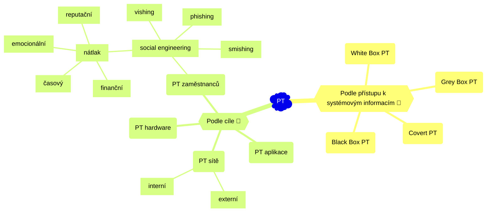

**Podle přístupu k systémovým informacím:**

- **White Box PT**
  - Analytik má přístup k *systémovým informacím*.
  - Sdílení zdrojového kódu a informací o komponentách, zapojení a architektuře.
- **Black Box PT**
  - Analytikovi jsou poskytnuty nanejvýš *základní nebo žádné informace*.
  - Analytik tak *vystupuje jako útočník*, který má k dispozici pouze veřejně dostupnou dokumentaci.
  - Tam, kde znalosti a veřejně dostupná dokumentace nestačí, je zapotřebí reverzní inženýrství.
- **Grey Box PT**
  - Kombinace předchozích dvou přístupů.
- **Covert PT** (tajné) - testování probíhá bez vědomí zaměstnanců organizace.

**Podle cíle:**

- PT **aplikace** - často podle **OWASP Top 10** zranitelností (pravidelně aktualizovaný seznam 10 nejzávažnějších zranitelností webových aplikací)
- PT **sítě**
  - **externí** - útok zvenku
  - **interní** - útok zevnitř pomocí odcizených přihlašovacích údajů
- PT **hardware** - notebooky, IoT zařízení, USB drop
- PT **zaměstnanců** - social engineering (lidský faktor, typicky *časový, finanční, reputační a emocionální* **tlak** na zaměstnance, aby provedli akci, kterou by jinak neudělali)
  - *phishing*
  - *vishing (voice phishing)*
  - *smishing (SMS phishing)*

### 8.4. Proces PT

(Pouze pro ilustraci.)

1. **Průzkum** (reconnaissance) - shromáždění informací o cíli
2. **Skenování** (scanning) - skenování cíle a shromáždění informací např. o *otevřených portech*
3. **Zneužití** (exploitation) - pokus o zneužití zranitelnosti
   - SQL injection
   - DOS (Denial of Service)
   - XSS (Cross-Site Scripting) - umístění škodlivého skriptu do webové stránky organizace
   - Social engineering - manipulace s lidmi
   - Man-in-the-middle - odposlech komunikace mezi dvěma stranami
   - Brute-force - pokus o prolomení hesla pomocí hrubé síly
4. **Získání přístupu** (gaining access) - pokus o získání přístupu do systému
5. **Eskalace** (escalation) - pokus o zvýšení úrovně přístupu
6. **Udržení přístupu** (maintaining access) - pokus o udržení přístupu do systému
7. **Zpráva** (reporting) - zpráva o výsledcích penetračního testování
8. **Úklid** (cleanup) - odstranění všech změn provedených během penetračního testování

<details><summary> Cyber Kill Chain </summary>

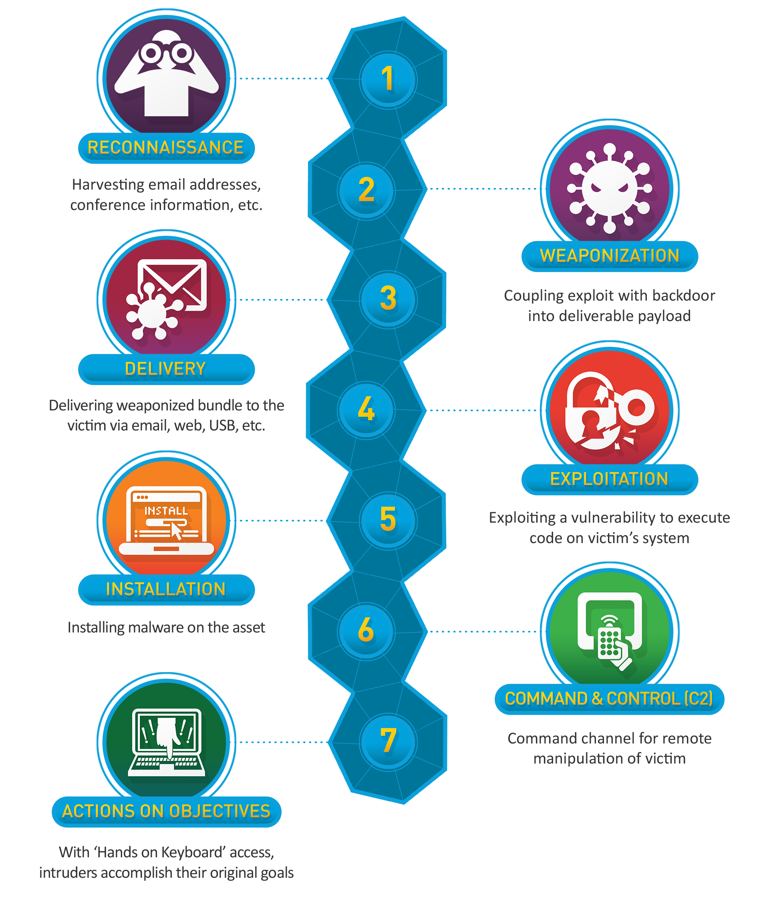

</details>
