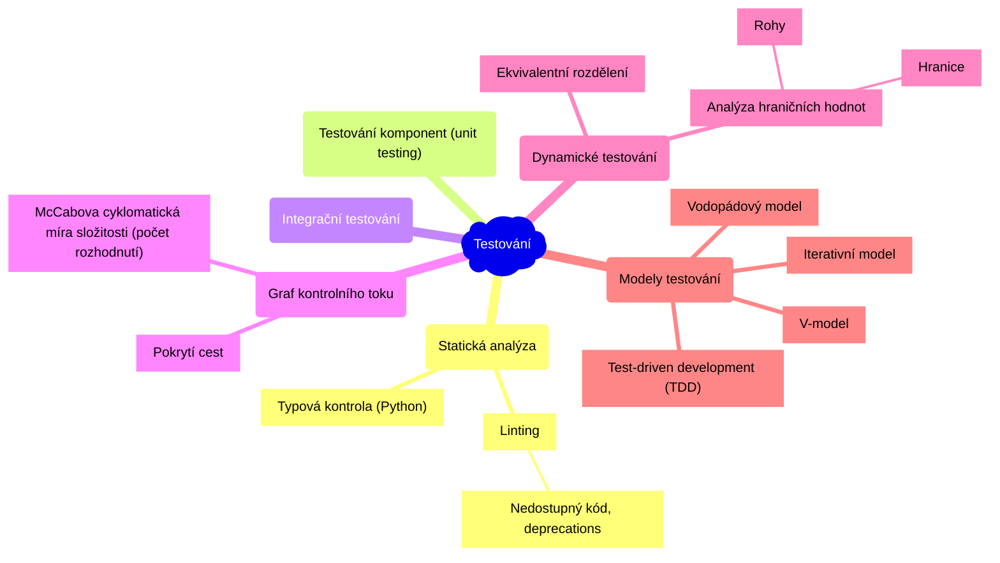

# Softwarové inženýrství

- [1. Význam testování, terminologie, testovací proces, Úrovně testování (V-model), Testovací techniky](#1-význam-testování-terminologie-testovací-proces-úrovně-testování-v-model-testovací-techniky)
  - [1.1. Modely testování](#11-modely-testování)
  - [1.2. Úrovně testování](#12-úrovně-testování)
- [2. Architektonické styly](#2-architektonické-styly)
- [3. Kvalitativní požadavky a jejich dosažení. Měření kvality návrhu](#3-kvalitativní-požadavky-a-jejich-dosažení-měření-kvality-návrhu)
- [4. Návrhové principy](#4-návrhové-principy)
- [5. Návrhové vzory](#5-návrhové-vzory)
- [6. Co je to Secure Software Development Lifecycle (SSDLC)? Jaká jsou jeho specifika a využití?](#6-co-je-to-secure-software-development-lifecycle-ssdlc-jaká-jsou-jeho-specifika-a-využití)
- [7. Popište pět základních bezpečnostních vlastností, které se používají k zajištění bezpečnosti a spolehlivosti informačních systémů. Zkratka “CIAAN”, tedy “Confidentiality”, “Integrity”, “Availability”, “Authenticity” a “Non-repudiation”. Uveďte příklady softwarových požadavků, které z těchto vlastností vycházejí](#7-popište-pět-základních-bezpečnostních-vlastností-které-se-používají-k-zajištění-bezpečnosti-a-spolehlivosti-informačních-systémů-zkratka-ciaan-tedy-confidentiality-integrity-availability-authenticity-a-non-repudiation-uveďte-příklady-softwarových-požadavků-které-z-těchto-vlastností-vycházejí)
- [8. Penetrační testování software. Deskriptivní a preskriptivní rámce pro penetrační testování. Metody penetračního testování](#8-penetrační-testování-software-deskriptivní-a-preskriptivní-rámce-pro-penetrační-testování-metody-penetračního-testování)

## 1. Význam testování, terminologie, testovací proces, Úrovně testování (V-model), Testovací techniky

> Testování je proces spouštění programu se záměrem nalézt vadu.

- Cílem testování je **detekování vady**.
- Testování může ukázat přítomnost vad, ale nemůže prokázat absenci vad.

> **Testování komponent (unit testing) a proč vůbec testovat?**
>
> U rozsáhlých projektů je často potřeba **aktualizovat** určité **moduly** a podle potřeby **refaktorizovat** kód. Takové změny mohou způsobit **nechtěné následky** u jiných modulů, které aktualizovaný modul používají. To může někdy narušit stávající funkčnost. Kvalitní testy fungují jako **ochrana** proti těmto nechtěným následkům.
>
> Jako vývojáři bychom měli kód (ideálně od zahájení vývoje) testovat, abychom zajistili, že všechny moduly v aplikaci fungují tak jak mají. Testy komponent (unit testy) umožňují zkontrolovat, zda **malé izolované moduly fungují správně**, a umožňují opravit nesrovnalosti, které mohou vzniknout při aktualizacích a refaktorizaci.

- **Chyba** - lidská/strojová - způsobí vznik vady
- **Vada** - chybná část kódu/hardware, která může způsobit selhání
- **Selhání** - pokud se provede *vadný* kód, může to vést k chybnému výsledku (tzn. selhání), chování systému, které neodpovídá specifikaci

U nasazených systému nás může zajímat **Mean Time Between Failures (MTBF)**.

### 1.1. Modely testování

1. **Vodopádový model**:

    

2. **V-model**:
    - V-model rozšiřuje vodopádový model tím, že pro každou fázi vývoje definuje odpovídající fázi testování.

    

3. **Iterativní model** (např. Scrum):

    

4. **Test-driven development** (TDD):
    - Jako první se píšou testy (tzn. na začátku by žádný test neměl projít).

    

### 1.2. Úrovně testování

1. Testování komponent
2. Testování integrace komponent
3. Testování systému (funkční a nefunkční)
4. Akceptační testování
5. Obslužné testování *(Maintenance testing)*

## 2. Architektonické styly

## 3. Kvalitativní požadavky a jejich dosažení. Měření kvality návrhu

## 4. Návrhové principy

**SOLID Design Principles** - *Robert C. Martin*

|||||
|--|--|--|--|
|**Single Responsibility Principle**| **SRP** | **Princip jedné odpovědnosti** | **Třída/funkce by měla mít *pouze jednu zodpovědnost* (funkčnost), která je jasně vystižena jejím názvem.** Pokud zodpovědnost třídy/funkce nelze popsat bez spojek ve slučovacím poměru (a, i, nebo, potom, ...), může být špatně navržena. |
|**Open Close Principle**| **OCP** | **Princip otevřenosti a uzavřenosti** | **Třída by měla být *otevřená pro rozšíření*, ale *uzavřená pro modifikaci*.** Tzn. měli bychom být schopni přidat novou funkcionalitu bez nutnosti měnit existující kód. Např. několik konkrétních tříd implementujících interface: `IPrinter`, `EPUBPrinter`, `PDFPrinter`. |
|**Liskov Substitution Principle**| **LSP** | **Liskové substituční princip** | **Podtřídy by měly být zaměnitelné s jejich bázovými třídami.** Pokud máme *interface* a nějakou hierarchii tříd, která implementuje tento *interface*, tak bychom měli být vždy schopni nahradit **předka potomkem** bez omezení správnosti všech metod předka. Polymorfismus. Např. do `Rectangle` lze přiřadit `Square`. |
|**Interface Segregation Principle**| **ISP** | **Princip oddělení rozhraní** | **Více specifických rozhraní je lepší než jedno univerzální rozhraní.** *Interface* by neměl definovat příliš mnoho chování (metod). Je lepší takové rozhraní rozdělit na více specifických rozhraní. *YAGNI - You Ain't Going to Need It.* Decoupling. |
|**Dependency Inversion Principle**| **DIP** | **Princip obrácení závislostí** | **Závislosti by měly směřovat od konkrétnímu typu k abstraktnímu.** Cílem je redukce závislostí v kódu. Pokud konkrétní typy závisí pouze na rozhraní, lze je snadno nahradit jinou implementací. Moduly vyšší úrovně by neměly záviset na modulech nižší úrovně. Znovupoužitelnost.|

|Nižší modul závisí na vyšším.| Změna `IBar` vynutí změnu u vyššího modulu. | Princip obrácení závislostí (DIP) - vyšší modul vlastní `IBar`, změny jdou směrem dolů. |
|--|--|--|
||  |  |

## 5. Návrhové vzory

## 6. Co je to Secure Software Development Lifecycle (SSDLC)? Jaká jsou jeho specifika a využití?

## 7. Popište pět základních bezpečnostních vlastností, které se používají k zajištění bezpečnosti a spolehlivosti informačních systémů. Zkratka “CIAAN”, tedy “Confidentiality”, “Integrity”, “Availability”, “Authenticity” a “Non-repudiation”. Uveďte příklady softwarových požadavků, které z těchto vlastností vycházejí

## 8. Penetrační testování software. Deskriptivní a preskriptivní rámce pro penetrační testování. Metody penetračního testování
