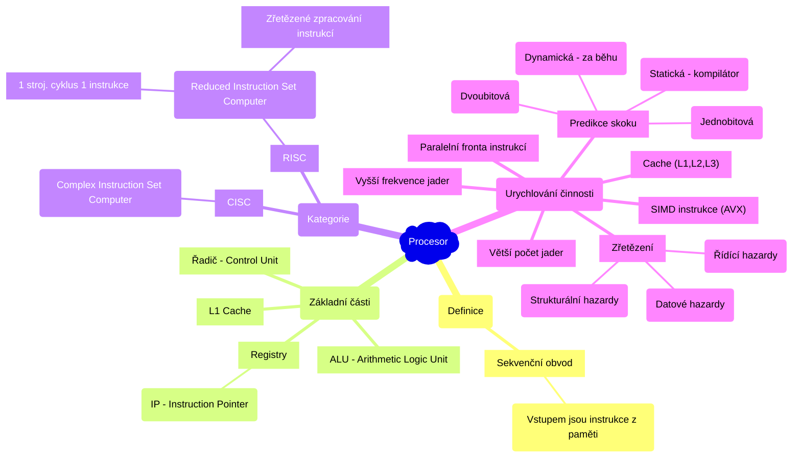
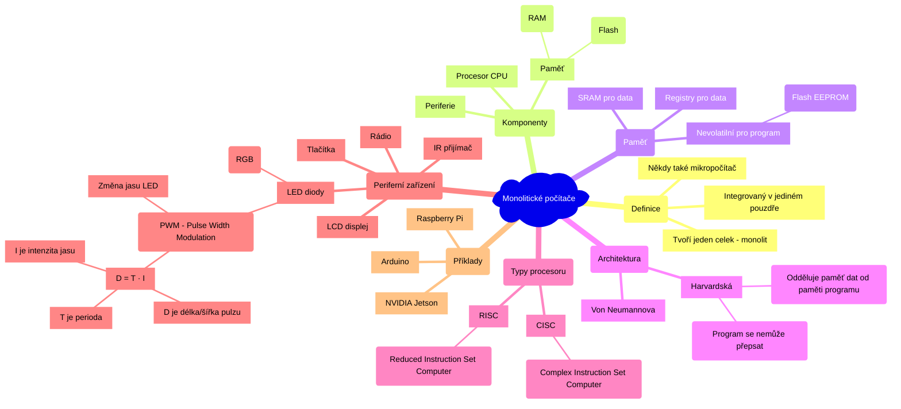
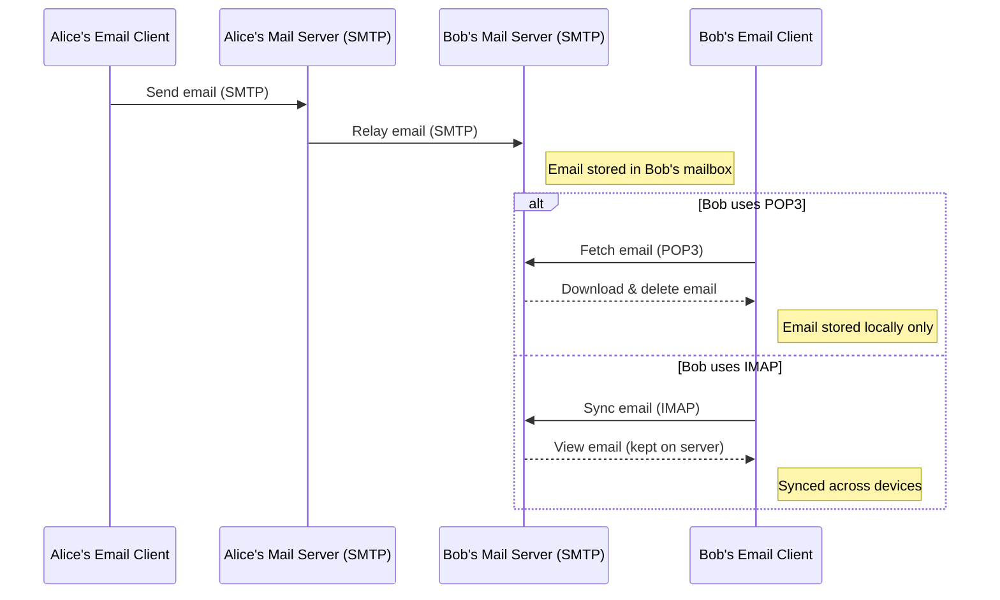
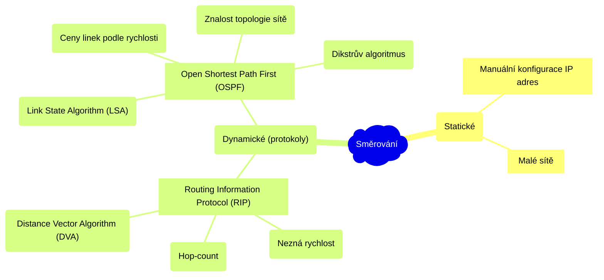
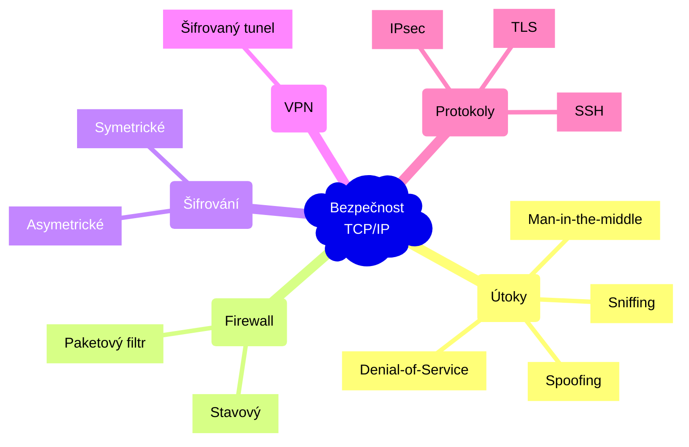
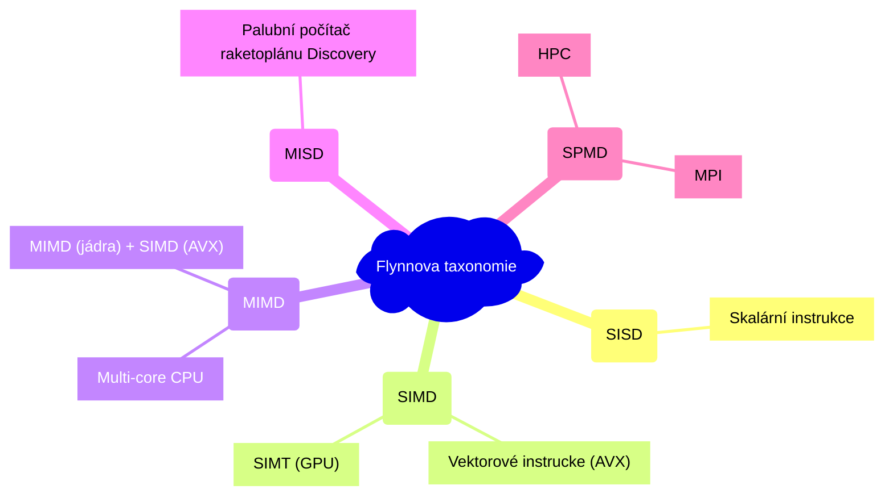

# Počítačové systémy a sítě

- [1. Architektura univerzálních procesorů. Principy urychlování činnosti procesorů](#1-architektura-univerzálních-procesorů-principy-urychlování-činnosti-procesorů)
  - [1.1. Zpracování instrukce a zřetězení (pipelining)](#11-zpracování-instrukce-a-zřetězení-pipelining)
  - [1.2. Problémy zřetězení](#12-problémy-zřetězení)
  - [1.3. Paměťová hierarchie](#13-paměťová-hierarchie)
- [2. Základní vlastnosti monolitických počítačů a jejich typické integrované periférie. Možnosti použití](#2-základní-vlastnosti-monolitických-počítačů-a-jejich-typické-integrované-periférie-možnosti-použití)
  - [2.1. Typické periferní zařízení](#21-typické-periferní-zařízení)
  - [2.2. Využití](#22-využití)
- [3. Protokolová rodina TCP/IP](#3-protokolová-rodina-tcpip)
  - [3.1. Síťové protokoly a služby](#31-síťové-protokoly-a-služby)
  - [3.2. Vzdálený přístup](#32-vzdálený-přístup)
  - [3.3. E-maily](#33-e-maily)
- [4. Problémy směrování v počítačových sítích. Adresování v IP sítích](#4-problémy-směrování-v-počítačových-sítích-adresování-v-ip-sítích)
- [5. Bezpečnost počítačových sítí s TCP/IP: útoky, paketové filtry, stavový firewall. Šifrování a autentizace, virtuální privátní sítě](#5-bezpečnost-počítačových-sítí-s-tcpip-útoky-paketové-filtry-stavový-firewall-šifrování-a-autentizace-virtuální-privátní-sítě)
- [6. Paralelní výpočty a platformy: Flynnova taxonomie, SIMD, MIMD, SPMD. Paralelismus na úrovni instrukcí, datový a funkční paralelismus. Procesy a vlákna](#6-paralelní-výpočty-a-platformy-flynnova-taxonomie-simd-mimd-spmd-paralelismus-na-úrovni-instrukcí-datový-a-funkční-paralelismus-procesy-a-vlákna)
- [7. Systémy se sdílenou a distribuovanou pamětí: komunikace mezi procesy (souběh, uváznutí, vzájemné vyloučení). Komunikace pomocí zasílání zpráv. OpenMP, MPI](#7-systémy-se-sdílenou-a-distribuovanou-pamětí-komunikace-mezi-procesy-souběh-uváznutí-vzájemné-vyloučení-komunikace-pomocí-zasílání-zpráv-openmp-mpi)
  - [7.1. Model sdílené paměti](#71-model-sdílené-paměti)
    - [7.1.1. OpenMP](#711-openmp)
  - [7.2. Model distribuované paměti](#72-model-distribuované-paměti)
- [8. Paralelní redukce a paralelní scan: principy fungování ve vybrané technologii a příklady užití](#8-paralelní-redukce-a-paralelní-scan-principy-fungování-ve-vybrané-technologii-a-příklady-užití)
  - [8.1. Paralelní redukce](#81-paralelní-redukce)
  - [8.2. Prefix sum (paralelní scan)](#82-prefix-sum-paralelní-scan)
- [9. Konkurentní datové struktury: přehled, blokující a neblokující implementace](#9-konkurentní-datové-struktury-přehled-blokující-a-neblokující-implementace)

## 1. Architektura univerzálních procesorů. Principy urychlování činnosti procesorů


> Procesor je *sekvenční obvod*, vstupem jsou instrukce z paměti.



### 1.1. Zpracování instrukce a zřetězení (pipelining)

Zpracování instrukce je rozděleno do několika fází a často je možné aby se fáze překrývaly (pokud nejsou instrukce na sobě závislé).

| Krok | Zkratka | Význam              |
| :--- | :-----: | :------------------ |
| 1.   |   VI    | Výběr Instrukce     |
| 2.   |   DE    | Dekódování          |
| 3.   |   VA    | Výpočet Adresy      |
| 4.   |   VO    | Výběr Operandu      |
| 5.   |   PI    | Provedení Instrukce |
| 6.   |   UV    | Uložení Výsledku    |

|                                CISC                                |                                RISC                                |
| :----------------------------------------------------------------: | :----------------------------------------------------------------: |
|  |  |

(V současnosti se nejčastěji používá nějaká kombinace CISC a RISC.)

### 1.2. Problémy zřetězení

- **Datové hazardy** - např. rozpracovaná instrukce potřebuje data předchozí instrukce (může řešit překladač)
  - $a+b+c\Rightarrow$ `ADD a, b; ADD a, c`
- **Strukturální hazardy** - např. omezení sběrnice
- **Řídící hazardy** - např. skok na jinou instrukci (řeší se predikcí skoku nebo paralelní frontou instrukcí)
  - především podmíněné skoky
  - jednobitová predikce
  - dvoubitová predikce (stavový automat)

### 1.3. Paměťová hierarchie


## 2. Základní vlastnosti monolitických počítačů a jejich typické integrované periférie. Možnosti použití



> Monolitický počítač je malý počítač *integrovaný v jediném pouzdře* (na jednom čipu). Tvoří jeden celek - monolit. Někdy také *mikropočítač*.
>
> Monolitický počítač obsahuje **procesor** (CPU), **paměť** (RAM, Flash) a **periferie**.

Pro program se používá *nevolatilní* paměť, která zachovává data i po odpojení (např. Flash EEPROM). Pro data se používají registry nebo SRAM paměti. Převážně se tedy používá harvardská architektura, která odděluje paměti pro data od paměti programu (tzn. program se nemůže přepsat).

| Von Neumannova architektura                                          | Harvardská architektura                                      |
| -------------------------------------------------------------------- | ------------------------------------------------------------ |
|  |  |

Podle typu procesoru rozlišujeme **CISC** (Complex Instruction Set Computer) a **RISC** (Reduced Instruction Set Computer) monolitické počítače.

**Sběrnice** je skupina signálových vodičů, která přenáší data mezi komponenty počítače (např. PCI, USB, I$^2$C).

### 2.1. Typické periferní zařízení

- LCD displej
- LED diody (RGB)
  - PWM (Pulse Width Modulation) - pomocí PWM lze měnit jas LED
    - $D = T \cdot I,$
    - kde $D$ je délka/šířka pulzu *(PWM duty cycle)*, T je perioda (třeba v ms) a $I\in<0,1>$ je intenzita (úroveň jasu)
    - 
- Tlačítka
- Rádio
- IR přijímač

**Časovač** umožní provádět události v pevných intervalech které se řídí hodinovým signálem (např. polling periferií).

**Watchdog** je časovač který resetuje systém nebo jinak převezme řízení, pokud přestane odpovídat hlavní program (např. zacyklení).

### 2.2. Využití

- Řízení **stroje** - např. pračka, tiskárna, lednička, CNC obrábění (Computer Numerical Control)
- **Edge computing** - mikropočítač přímo zpracovává data ze senzorů (např. na nějakém stroji) a do cloudu posílá jen výsledky (nízká latence, ale limitovaný výpočetní výkon)
- **Cloud computing** - mikropočítač posílá data ze senzorů do cloudu, v cloudu se zpracovávají a výsledky se posílají zpět (vyšší latence pro komunikaci, ale téměř neomezený výpočetní výkon)
- **IoT** *(Internet of Things)* - mikropočítače jsou připojeny k internetu a komunikují mezi sebou (např. chytré domácnosti)

## 3. Protokolová rodina TCP/IP


Vrstvy OSI RM:

1. **Fyzická** vrstva - fyzický přenos bitů
    - **Hub** (rozbočovač)
    - **Repeater** (opakovač)
    - **Modem** (modulátor-demodulátor - převádí digitální signál na analogový a opačně
    - **ADSL** - přenos dat po telefonní lince (s použitím modemu)
    - Kabely:
      - **metalické** kabely
        - **koaxiální** kabely
        - **kroucená dvojlinka** (twisted pair) - UTP, STP, FTP
          - UTP *(Unshielded Twisted Pair)* - nechráněná kroucená dvojlinka
          - STP *(Shielded Twisted Pair)* - stíněná kroucená dvojlinka
          - RJ45 koncovka
      - **optické kabely**
2. **Spojová** vrstva - přenos rámců s **MAC** adresami *(Media Access Control, šest dvojic hexadecimálních čísel) - Ethernet
    - **switche** (přepínače)
    - detekce a korekce chyb
3. **Síťová** vrstva - *směrování paketů* **routery** (směrovače)
    - **IP** adresy, IPv4 (32 bitů) a IPv6 (128 bitů)
    - **ARP** *(Address Resolution Protocol)* - `IP -> MAC`, mapování IP adresy na MAC adresu
    - **NAT** *(Network Address Translation)* - překlad libovolné IP adresy an jinou IP adresu (nejčastěji privátní na veřejné). Umožňuje aby pod jednou IPv4 adresou bylo více počítačů najednou.
    - **ICMP** *(Internet Control Message Protocol)* - `ping`, `traceroute`
4. **Transportní** vrstva
    - **TCP** *(Transmission Control Protocol)* - spolehlivý, velký soubor - *segmenty*
    - **UDP** *(User Datagram Protocol)* - nespolehlivý, rychlost, stream - *datagramy* (zdrojový port není povinný)
    - **port** (trans**port**ní vrstva) reprezentuje cílový bod komunikace
      - číslo portu (`uint16`, `0-65535`, $\langle0, 2^{16} - 1\rangle$) je unikátní identifikátor procesu nebo síťové služby v operačním systému
5. **Relační** (session) vrstva - *dialog mezi účastníky* (udržování a synchronizace komunikace)
6. **Prezentační** vrstva - sjednocení formátů dat, kódování
7. **Aplikační** vrstva - konkrétní aplikace (prohlížeč, databázový klient)
    - **HTTP** *(Hypertext Transfer Protocol)* - `GET`, `POST`, `PUT`, `DELETE`, ...
    - **DHCP** *(Dynamic Host Configuration Protocol)* - automatické přidělování IP adresy a dalších síťových parametrů (např. DNS serveru) klientům v síti
    - **FTP** *(File Transfer Protocol)* - protokol pro přenos souborů mezi počítači (klient-server/server-klient)
    - **DNS** *(Domain Name System)* - překlad doménového jména na IP adresu (a naopak). Analogie k telefonnímu seznamu. Typy záznamů:
       - **A** (Address) - překlad domény na IPv4 adresu
       - **AAAA** (IPv6 Address) - překlad domény na IPv6 adresu
       - **CNAME** (Canonical Name) - alias pro jinou doménu
       - **MX** (Mail Exchange) - určuje poštovní server pro danou doménu
       - **TXT** (Text) - libovolný textový záznam
       - **SOA** (Start of Authority) - určuje autoritu pro danou doménu

### 3.1. Síťové protokoly a služby

Kdysi byla fyzická topologie sítě totožná s logickou, ale dnes se použivají VLAN (virtuální LAN) na spojové vrstvě (L2). Jeden fyzický switch se může chovat jako více logických switchů.


### 3.2. Vzdálený přístup

- **TELNET** - nešifrovaný protokol pro vzdálený přístup k počítači (terminálový emulátor), port `23`
- **SSH** *(Secure Shell)* - šifrovaný protokol pro vzdálený přístup k počítači (terminálový emulátor), šifrování pomocí *asymetrické kryptografie* (veřejný a privátní klíč), port `22`

### 3.3. E-maily

- **SMTP** *(Simple Mail Transfer Protocol)* - protokol pro odesílání e-mailů od klienta na poštovní server a přeposílání e-mailů mezi poštovními servery
    1. **Zjištění domény příjemce** - Mail server si vezme část za zavináčem e-mailu (např. `domena.com`).
    2. **Dotaz na DNS** - Mail server se ptá DNS: *„Který server má na starost e-maily pro `domena.com`?“*
        - **Hledání MX** (Mail Exchange) **záznamu** pro danou doménu (v DNS). DNS odpoví IP adresou serveru, kam má **SMTP** poslat e-mail.
- **POP3** *(Post Office Protocol 3)* - protokol pro stahování a odstraňování e-mailů z poštovního serveru (stáhne na klienta a odstraní ze serveru)
- **IMAP** *(Internet Message Access Protocol)* - protokol pro přístup k e-mailům na poštovním serveru, stahování kopie



## 4. Problémy směrování v počítačových sítích. Adresování v IP sítích



**Směrování** zprostředkovává směrovač (router, síťový prvek síťové vrstvy L3) pomocí směrovací tabulky. Cílem je směrovat pakety od zdroje k cíli přes síťové prvky předáváním paketů. Předáváním paketů rozumíme přenos paketu z jednoho síťového rozhraní (síťová karta s MAC adresou) do druhého.

|  Typ  |  Cíl/maska  |  Next hop   | Metrika (nižší je lepší) |
| :---: | :---------: | :---------: | :----------------------: |
|   R   | 10.0.0.0/16 | 172.16.10.1 |            2             |

Typ znamená *typ směrování*:

- C - connected (přímo připojené)
- S - static (staticky konfigurované)
- R - RIP
- O - OSPF

**Statické směrování** znamená, že pravidla ve směrovací tabulce jsou spravovány ručně. Vhodné pouze pro malé sítě.

**Dynamické směrování** se automaticky adaptuje na změny v síti. *Dynamické směrovací protokoly* *(RIP, OSPF)* hledají nejkratší cesty v síti. Samotné směrování provádí *směrovače (routery)* podle *směrovací tabulky*.

- **Routing Information Protocol** *(RIP)*
  - Používá *Distance Vector Algorithm (DVA)*, který nezná rychlost spojení a používá *hop-count* (počet skoků) jako metriku pro určení nejkratší cesty.
    1. Router periodicky broadcastem (RIPv1, nebo multicast RIPv2) posílá svoji směrovací tabulku.
    2. Obdržená směrovací tabulka je porovnána s tou současnou.
    3. Aktualizace levnějších nebo neznámých cest.
  - Nevhodné pro velké sítě.
  - RIPv1 nepracuje s maskou sítě, tzn. nevhodné pro VLSM (níže; preferujeme RIPv2).
- **Open Shortest Path First** *(OSPF)*
  - Používá *Link State Algorithm (LSA)*.
    1. Síťové prvky rozesílají sítí, ke kterým uzlům se můžou připojit.
    2. Každý prvek rekonstruuje topologii sítě.
  - Router zná topologii sítě a pomocí *Dikstrova algoritmu* určí nejkratší cestu na základě ceny spojení podle *přenosové rychlosti*.

Metody směrování:

| Unicast                                       | Broadcast                                       | Multicast                                       | Anycast                                       |
| --------------------------------------------- | ----------------------------------------------- | ----------------------------------------------- | --------------------------------------------- |
|  |  |  |  |
| one-to-one                                    | one-to-all                                      | one-to-many-of-many                             | one-to-one-of-many                            |

**Anycast** - Jedna IP adresa je sdílena více servery na různých místech.

**IP adresa** slouží k identifikaci zařízení v síťové vrstvě TPC/IP modelu. Dnes existují dvě verze adres:

- původní **IPv4** - 32bitové číslo (čtveřice bajtů)
- novější **IPv6** - 128bitové číslo (osmice hexadecimálních číslic)
  - IPv6 poskytuje mnohem větší adresní prostor než IPv4, který už je vyčerpaný.

K adresaci se typicky používá **adresování s maskou podsítě proměnné délky** *(Variable-Length Subnet Mask, VLSM)*. "Podstíť je cokoliv mezi routery." (Uvažujeme L2 switche. [Zdroj](http://infra2.cs.vsb.cz/grygarek/TPS-0304/lect/VLSM/VLSM.html).)


- Největší síť `S1` 7 bitů (120 + 2 zaokrouhleno k nejbližší vyšší mocniněně dvojky).
- `S2` 6 bitů (50 + 2 adres).
- `S3` 5 bitů (25 + 2 adres).
- `S4` 4 bity (7 + 2 adres).
- Spoje - podsítě `S5-S8` pořebují 2 bity. Proč?
  - `00` id podsítě
  - `01` id prvního routeru
  - `10` id druhého routeru
  - `11` broadcast

K pokrytí sítě potřebujeme alespoň 256 adres. Uvažujme, že nám poskytovatel internetu přidělí adresu `10.0.0.0/24`. Tzn. z masky 24 víme, že máme k adresování 32-24=8 bitů (poslední byte IP adresy.)


Adresní plán sítě:

- Zápisem `::128` rozumíme `10.0.0.128` apod.
- `ff = 15*16^1 + 15*16^0 = 255`

| Síť | Prefix (binární) | Adresa sítě | Maska podsítě   | Použitelné adresy | Broadcast |
| --- | ---------------- | ----------- | --------------- | ----------------- | --------- |
| S1  | ::1xxx xxxx      | ::0/25      | ff.ff.ff.128 | ::1 - ::126       | ::127     |
| S2  | ::01xx xxxx      | ::128/26    | ff.ff.ff.192 | ::129 - ::190     | ::191     |
| S3  | ::001x xxxx      | ::192/27    | ff.ff.ff.224 | ::193 - ::222     | ::223     |
| S4  | ::0001 xxxx      | ::224/28    | ff.ff.ff.240 | ::225 - ::238     | ::239     |
| S5  | ::0000 11xx      | ::240/30    | ff.ff.ff.252 | ::241 - ::242     | ::243     |
| S6  | ::0000 10xx      | ::244/30    | ff.ff.ff.252 | ::245 - ::246     | ::247     |
| S7  | ::0000 01xx      | ::248/30    | ff.ff.ff.252 | ::249 - ::250     | ::251     |
| S8  | ::0000 00xx      | ::252/30    | ff.ff.ff.252 | ::253 - ::254     | ::255     |

## 5. Bezpečnost počítačových sítí s TCP/IP: útoky, paketové filtry, stavový firewall. Šifrování a autentizace, virtuální privátní sítě



Problém TCP/IP sítí je, že typicky jsou všechna data přenášena nešifrovaně. Data lze nejen přečíst, ale i upravit.

Útoky:

- **Man-in-the-middle (MITM)** - útočník odposlouchává nebo modifikuje komunikaci mezi dvěma stranami. (Lze řešit šifrováním.)
- **Denial-of-Service (DoS)** - cílem je přetížit systém nebo službu velkým množstvím požadavků a způsobit tak její nedostupnost.
- **Spoofing** - útočník se vydává za jiného uživatele (např. podvržením IP adresy).
- **Sniffing** - odposlech síťového provozu.

**Paketové filtry** - druh **firewallu**, který kontroluje pakety na základě pravidel: **IP adresa, port, protokol**.

**Stavový firewall** (stateful) - sleduje **stav spojení**. Bezpečnější než čistý paketový filtr.

**Transport Layer Security** (TLS) je kryptografický protokol pro komunikaci přes počítačovou síť. Používá se v **aplikační vrstvě** TCP/IP. Navíc *Datagram Transport Layer Security (DTLS)* se používá v *transportní vrstvě*. Nahradil zastaralý protokol *Secure Sockets Layer (SSL)*.

**Internet Protocol Security (IPsec)** - sada protokolů **síťové vrstvy**, která obstarává *autentizaci a šifrování paketů* při komunikaci přes Internet Protocol (IP).

**Symetrická kryptografie** - stejný klíč pro šifrování i dešifrování (např. **AES**).

**Asymetrická kryptografie** - šifrování pomocí *veřejného* a *privátního* klíče (např. **RSA**). Veřejný klíč je známý všem, privátní klíč je tajný.


- **C**onfidentiality (důvěrnost) - šifrování zprávy
- **I**ntegrity (of data; integrita) - zpráva nebyla změněna během přenosu
- **A**uthenticity (autenticita) - ověření identity odesílatele
- **N**on-repudiation (nepopiratelnost) - odesílatel nemůže popřít, že zprávu odeslal

Asymetrická kryptografie je založena na vynásobení dvou velkých prvočísel, což je rychlý proces, nicméně zpětné hledání těchto dvou čísel (tedy rozklad na prvočísla) je velmi náročný.

**Virtuální privátní sítě** *(VPN – Virtual Private Network)* - vytváří **šifrovaný tunel** mezi klientem a cílovou sítí přes *veřejný internet*. Např. umožňuje bezpečný vzdálený přístup k podnikové síti.

## 6. Paralelní výpočty a platformy: Flynnova taxonomie, SIMD, MIMD, SPMD. Paralelismus na úrovni instrukcí, datový a funkční paralelismus. Procesy a vlákna

*Task-switching - pseudo-paralelismus.*

**Datový paralelismus** - data jsou rozdělena do *bloků* a každý blok je zpracován *procesem/vláknem*.

**Instrukční paralelismus** - využití nezávislých instrukcí - např. jedny vlákna chystají data, další je zpracovávají nebo třeba ukládají.

**Hyper-threading** - každé vlákno se navenek rozdělí. 16jádro má 16 instrukčních sad.

Co rozumíme pojmem **proces**? OS alokuje a spravuje *paměť*, přidělí *zásobník* a alespoň jedno *hlavní jádro (main thread)*.

**Logické vlákno** je *sled instrukcí*. Potřebuju *registry* a nějakou *výpočetní jednotku*. Běží dokud má instrukce. Přerušení výpočtu vláken určuje programátor.

Proč potřebujeme více jader procesoru? **Skrývání latence** - každá instrukce má nějaký čas vykonávání a my chceme skrývat latenci mezi instrukcemi (tzn. zkrátit čas nečinnosti procesoru). Např. odmocnina nebo modulo jsou drahé operace, nejdražší je čtení z disku (nebo dokonce ze vzdáleného disku neno data lake).

**SPMD** (Single Program Multiple Data) - každý proces spouští stejný program, ale na jiných datech. Neexistuje žádný *"hlavní proces"*. Využívá se v **MPI** (Message Passing Interface) - compiler `mpicc` (C), `mpicxx` (C++). Typicky se používá v HPC (High Performance Computing) - na superpočítačích.



|                         |                                            Single Data                                            |                                           Multiple Data                                           |
| :---------------------: | :-----------------------------------------------------------------------------------------------: | :-----------------------------------------------------------------------------------------------: |
|  Single Instruction  |  |  |
| Multiple Instruction |  |  |


Skalární přístup (SISD)

```c
float a[8], b[8], c[8];
for (int i = 0; i < 8; i++)
    c[i] = a[i] + b[i];
```

**Vektorové instrukce** (SIMD) - instrukce, které provádějí stejnou operaci na více datech najednou (např. AVX)

```c
// x86-64 AVX2
#include <immintrin.h>

// SIMD (Single Instruction, Multiple Data) 
// AVX (Advanced Vector Extensions)
__m256 vec_a = _mm256_loadu_ps(a);
__m256 vec_b = _mm256_loadu_ps(b);
__m256 vec_c = _mm256_add_ps(vec_a, vec_b);
_mm256_storeu_ps(c, vec_c);
```

## 7. Systémy se sdílenou a distribuovanou pamětí: komunikace mezi procesy (souběh, uváznutí, vzájemné vyloučení). Komunikace pomocí zasílání zpráv. OpenMP, MPI

- komunikace sdílením stavu (mutexy)
- komunikace zasíláním zpráv (kanály, MPI)

### 7.1. Model sdílené paměti


Procesy *sdílejí adresní prostor*, kde můžou *asynchronně* číst a zapisovat.

**Souběh** *(race condition)* může nastat např. když dvě nebo více vláken přistupuje současně ke stejnému místu v paměti **(kritická sekce)**, alespoň jedno z nich zapisuje a vlákna nepoužívají synchronizaci k řízení svého přístupu (toto je porušení základního pravidla Rustu - *aliasing + mutabilita*). K souběhu může dojít také pokud výsledek programu závisí na pořadí vykonávání vláken.

Přístup do sdílené paměti je synchronizován pomocí **vzájemného vyloučení** *(**mut**ual **ex**clusion - mutex)*, což lze řešit například pomocí *binárního semaforu* neboli zámku (hodnota `0/1` - `locked/unlocked`).

**Uváznutí** *(deadlock)* nastane, např. když dva procesy čekají navzájem na uvolnění zámku nebo když jeden proces se pokusí získat dvakrát stejný zámek.

```rust
use std::sync::Mutex;

fn drop_late(m: &Mutex<Option<u32>>) {
    if let Some(v) = m.lock().unwrap().as_ref() {
        println!("The Option contains a value {v}!");
        // Deadlock (attempts to acquire a second lock on the same mutex)
        m.lock().unwrap();
    }
}
```

#### 7.1.1. OpenMP

<details><summary> Nastavení ve Visual Studio </summary>

1. Right-click your project > `Properties`.
2. `Configuration Properties > C/C++ > Language`
3. Set OpenMP Support to `Yes (/openmp)`.
4. `Configuration Properties > C/C++ > Command Line`
5. In the `Additional Options` box at the bottom, add: `-openmp:experimental` (OpenMP 5.0+).

</details>

```cpp
#include <iostream>
#include <omp.h>

int main() {
    int num_threads = omp_get_max_threads();
    std::cout << "Max available threads: " << num_threads << std::endl;

    // Paralelní blok
    #pragma omp parallel
    {
        // Každé vlákno provede tento blok
        std::cout << "Thread " << omp_get_thread_num() << " of " << omp_get_num_threads() << std::endl;
    }
    
    #pragma omp parallel
    {
        #pragma omp critical
        // Tento blok je chráněn vzájemným vyloučením.
        // Pouze jedno vlákno může provést tento blok najednou.
        std::cout << "Thread " << omp_get_thread_num() << " of " << omp_get_num_threads() << std::endl;
    }

    // #pragma omp barrier 
    // Čekání na všechny vlákna, před pokračováním dál (fork-join).
    // (Implicitně na konci každého paralelního bloku.)

    return 0;
}
```

### 7.2. Model distribuované paměti


Každý proces má vlastní data a adresní prostor. Procesy komunikují pomocí **zasílání zpráv** (např. pomocí MPI). MPI je standard pro komunikaci mezi procesy v distribuovaném systému. Usnadňuje implementaci, protože řeší detaily komunikace mezi procesy - výběr nejrychlejší cesty (shared memory, síť, ...), pořadí zásílaných zpráv, jistota, že zpráva dorazila, atd. Implementace standardu MPI je např. OpenMPI. Existují bindingy pro různé jazyky (C, C++, Fortran, Python, ...).

MPI navíc implementuje standardní komunikační rutiny jako:

- **point-to-point**
- **broadcast** (*one-to-many*, stejná zpráva pro všechny)
- **scatter** (*one-to-many*, různé zprávy pro různé procesy)
- **gather** (*many-to-one*, různé zprávy pro jeden proces, opak scatter)
- **reduce** (*many-to-one*, agregace dat z více procesů do jednoho procesu, např. `sum`, `max`, `min`)


```bash
# Start MPI program with 4 processes on a single computer
mpiexec -n 4 ./my_program
```

## 8. Paralelní redukce a paralelní scan: principy fungování ve vybrané technologii a příklady užití

### 8.1. Paralelní redukce

Průchod dat - **agregace** do jedné hodnoty (`min`, `max`, `sum` atd.)


```cpp
#include <iostream>
#include <omp.h>  // OpenMP

int main() {
    const int N = 10;
    int sum = 0;

    // Paralelní redukce
    #pragma omp parallel for reduction(+:sum)
    for (int i = 0; i < N; ++i) {
        sum += i;
        std::cout << "Thread " << omp_get_thread_num() << " added " << i << std::endl;
    }
    std::cout << "Sum MIMD = " << sum << std::endl;

    sum = 0;
    // Redukce pomocí vektorových instrukcí (AVX2)
    #pragma omp simd reduction(+:sum)
    for (int i = 0; i < N; ++i) {
        sum += i;
    }
    std::cout << "Sum SIMD = " << sum << std::endl;

    // a kombinace... MIMD + SIMD
    // #pragma omp parallel for simd reduction(+:sum)
    
    return 0;
}
```

### 8.2. Prefix sum (paralelní scan)

> **Hillis-Steele** (Stride to $n$):
>
> 
>
> Zápisem $\oplus_{1:4}$ rozumíme $a_1\oplus a_2\oplus a_3\oplus a_4$, kde $\oplus$ je libovolná **asociativní binární operace** (např. `+`, `*`, `XOR`).
<!--  -->
> **Up Sweep & Down Sweep**
>
> - [Guy E. Blelloch - Prefix Sums and Their Applications](https://www.cs.cmu.edu/~guyb/papers/Ble93.pdf)
> - Modré šipky značí sčítání, šedé přesun, červená reset na nulu.
> - (Algoritmus pracuje in-place s jedním polem stejně jako Hillis-Steele)
>
> 

```cpp
#include<iostream>
#include<chrono>

#define N 10

using namespace std;

int main() {
    int a[N], simd_scan[N], scan_a;
    for (int i = 0; i < N; i++) {
        a[i] = i;
        simd_scan[i] = 0;
    }
    scan_a = 0;
    #pragma omp simd reduction(inscan, +:scan_a)
    for (int i = 0; i < N; i++) {
        scan_a += a[i];
        #pragma omp scan inclusive(scan_a)
        simd_scan[i] = scan_a;
    }
    std::cout << "SIMD Scan Output:\n";
    for (int i = 0; i < N; i++)
        std::cout << simd_scan[i] << "\t";
    return 0;
}
```

## 9. Konkurentní datové struktury: přehled, blokující a neblokující implementace

Naivní použití standardních datových struktur může vést k souběhu (race condition). Konkurentní datové struktury obvykle používají nějaké prostředky pro synchronizaci - vzájemné vyloučení, atomické operace. Např. `queue.Queue` (MPMC kanál) v Pythonu je konkurentní datová struktura, která používá zámky pro synchronizaci přístupu k frontě.

Problém blokující implementace je, že vlákno čeká na zámek - *spin / busy wait* - se 100% vytížením jádra. Pro neblokující implementaci I/O operací můžeme použít např. `epoll` (Linux) pro monitorování více file descriptorů najednou (stačí jednoho vlákno). Alternativou je asynchronní programování - vlákna se neblokují, ale čekají na události, např. `async/await` v Rustu.

```rust
use tokio::net::TcpListener;

#[tokio::main]
async fn main() {
    let listener = TcpListener::bind("127.0.0.1:6379").await.unwrap();

    loop {
        let (socket, _) = listener.accept().await.unwrap();
        // A new task is spawned for each inbound socket. The socket is
        // moved to the new task and processed there.
        tokio::spawn(async move {
            process(socket).await;
        });
    }
}
```

**MPSC** channel:

```rust
use std::sync::mpsc::channel;
use std::thread;

let (sender, receiver) = channel();

// Spawn off an expensive computation
thread::spawn(move || {
    sender.send(expensive_computation()).unwrap();
});

// Do some useful work for awhile

// Let's see what that answer was
// (blocking)
println!("{:?}", receiver.recv().unwrap());
```

**SPSC** channel `tokio::sync::oneshot:channel()` - např. pro signál k vypnutí serveru.
