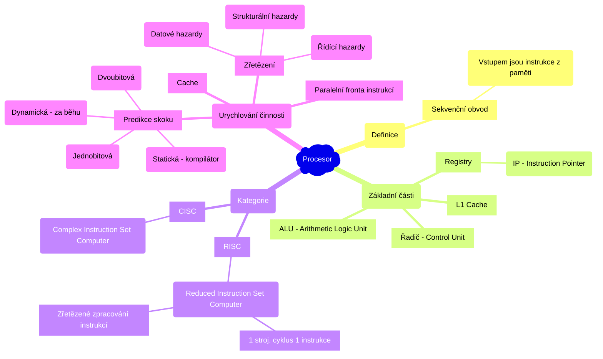
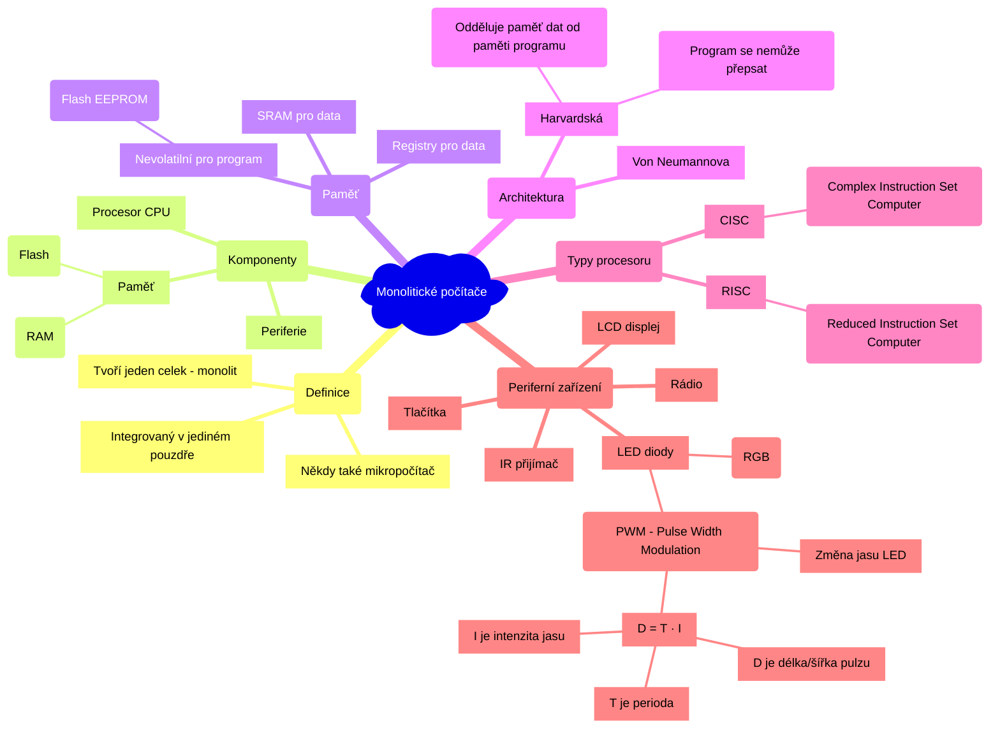

# Počítačové systémy a sítě

- [1. Architektura univerzálních procesorů. Principy urychlování činnosti procesorů](#1-architektura-univerzálních-procesorů-principy-urychlování-činnosti-procesorů)
  - [1.1. Zpracování instrukce a zřetězení](#11-zpracování-instrukce-a-zřetězení)
  - [1.2. Problémy zřetězení](#12-problémy-zřetězení)
  - [1.3. Paměťová hierarchie](#13-paměťová-hierarchie)
- [2. Základní vlastnosti monolitických počítačů a jejich typické integrované periférie. Možnosti použití](#2-základní-vlastnosti-monolitických-počítačů-a-jejich-typické-integrované-periférie-možnosti-použití)
  - [2.1. Typické periferní zařízení](#21-typické-periferní-zařízení)
- [3. Protokolová rodina TCP/IP](#3-protokolová-rodina-tcpip)
- [4. Problémy směrování v počítačových sítích. Adresování v IP sítích](#4-problémy-směrování-v-počítačových-sítích-adresování-v-ip-sítích)
- [5. Bezpečnost počítačových sítí s TCP/IP: útoky, paketové filtry, stavový firewall. Šifrování a autentizace, virtuální privátní sítě](#5-bezpečnost-počítačových-sítí-s-tcpip-útoky-paketové-filtry-stavový-firewall-šifrování-a-autentizace-virtuální-privátní-sítě)
- [6. Paralelní výpočty a platformy: Flynnova taxonomie, SIMD, MIMD, SPMD. Paralelismus na úrovni instrukcí, datový a funkční paralelismus. Procesy a vlákna](#6-paralelní-výpočty-a-platformy-flynnova-taxonomie-simd-mimd-spmd-paralelismus-na-úrovni-instrukcí-datový-a-funkční-paralelismus-procesy-a-vlákna)
- [7. Systémy se sdílenou a distribuovanou pamětí: komunikace mezi procesy (souběh, uváznutí, vzájemné vyloučení). Komunikace pomocí zasílání zpráv. OpenMP, MPI](#7-systémy-se-sdílenou-a-distribuovanou-pamětí-komunikace-mezi-procesy-souběh-uváznutí-vzájemné-vyloučení-komunikace-pomocí-zasílání-zpráv-openmp-mpi)
- [8. Paralelní redukce a paralelní scan: principy fungování ve vybrané technologii a příklady užití](#8-paralelní-redukce-a-paralelní-scan-principy-fungování-ve-vybrané-technologii-a-příklady-užití)
- [9. Konkurentní datové struktury: přehled, blokující a neblokující implementace](#9-konkurentní-datové-struktury-přehled-blokující-a-neblokující-implementace)

## 1. Architektura univerzálních procesorů. Principy urychlování činnosti procesorů

> Procesor je *sekvenční obvod*, vstupem jsou instrukce z paměti.

### 1.1. Zpracování instrukce a zřetězení

| Krok | Zkratka |Význam                 |
|:------|:-------:|:-----------------|
| 1.   | VI | Výběr Instrukce   |
| 2.   | DE | Dekódování        |
| 3.   | VA | Výpočet Adresy    |
| 4.   | VO | Výběr Operandu    |
| 5.   | PI | Provedení Instrukce |
| 6.   | UV | Uložení Výsledku  |

|CISC|RISC|
|:--:|:--:|
|||

(V současnosti se nejčastěji používá nějaká kombinace CISC a RISC.)

### 1.2. Problémy zřetězení

- **Datové hazardy** - např. rozpracovaná instrukce potřebuje data předchozí instrukce (může řešit překladač)
  - $a+b+c\Rightarrow$ `ADD a, b; ADD a, c`
- **Strukturální hazardy** - např. omezení sběrnice
- **Řídící hazardy** - např. skok na jinou instrukci (řeší se predikcí skoku nebo paralelní frontou instrukcí)
  - především podmíněné skoky
  - jednobitová predikce
  - dvoubitová predikce (stavový automat)

### 1.3. Paměťová hierarchie

## 2. Základní vlastnosti monolitických počítačů a jejich typické integrované periférie. Možnosti použití

> Monolitický počítač je malý počítač *integrovaný v jediném pouzdře* (na jednom čipu). Tvoří jeden celek - monolit. Někdy také *mikropočítač*.
>
> Monolitický počítač obsahuje **procesor** (CPU), **paměť** (RAM, Flash) a **periferie**.

Pro program se používá *nevolatilní* paměť, která zachovává data i po odpojení (např. Flash EEPROM). Pro data se používají registry nebo SRAM paměti. Převážně se tedy používá harvardská architektura, která odděluje paměti pro data od paměti programu (tzn. program se nemůže přepsat).

| Von Neumannova architektura | Harvardská architektura |
|--------------------------|------------------------------|
|| |

Podle typu procesoru rozlišujeme **CISC** (Complex Instruction Set Computer) a **RISC** (Reduced Instruction Set Computer) monolitické počítače.

### 2.1. Typické periferní zařízení

- LCD displej
- LED diody (RGB)
  - PWM (Pulse Width Modulation) - pomocí PWM lze měnit jas LED
    - $D = T \cdot I,$
    - kde $D$ je délka/šířka pulzu *(PWM duty cycle)*, T je perioda (třeba v ms) a $I\in<0,1>$ je intenzita (úroveň jasu)
    - 
- Tlačítka
- Rádio
- IR přijímač

## 3. Protokolová rodina TCP/IP

## 4. Problémy směrování v počítačových sítích. Adresování v IP sítích

## 5. Bezpečnost počítačových sítí s TCP/IP: útoky, paketové filtry, stavový firewall. Šifrování a autentizace, virtuální privátní sítě

## 6. Paralelní výpočty a platformy: Flynnova taxonomie, SIMD, MIMD, SPMD. Paralelismus na úrovni instrukcí, datový a funkční paralelismus. Procesy a vlákna

## 7. Systémy se sdílenou a distribuovanou pamětí: komunikace mezi procesy (souběh, uváznutí, vzájemné vyloučení). Komunikace pomocí zasílání zpráv. OpenMP, MPI

## 8. Paralelní redukce a paralelní scan: principy fungování ve vybrané technologii a příklady užití

## 9. Konkurentní datové struktury: přehled, blokující a neblokující implementace
