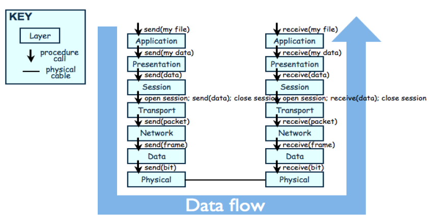
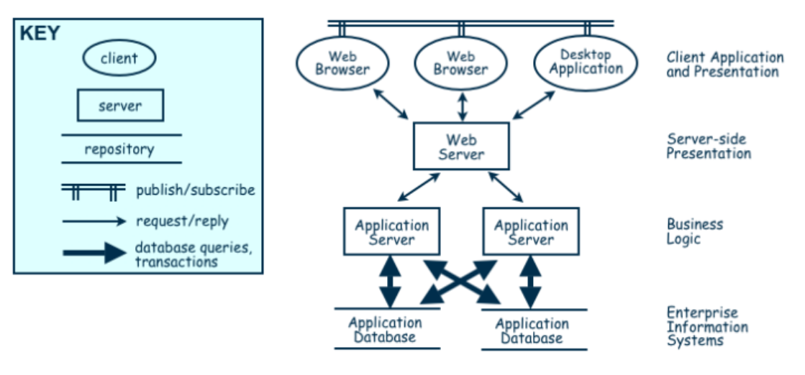
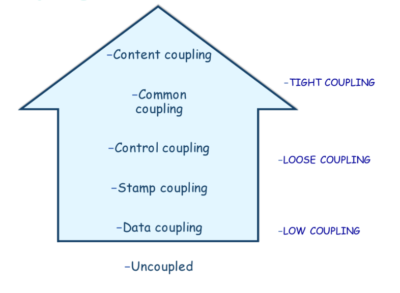
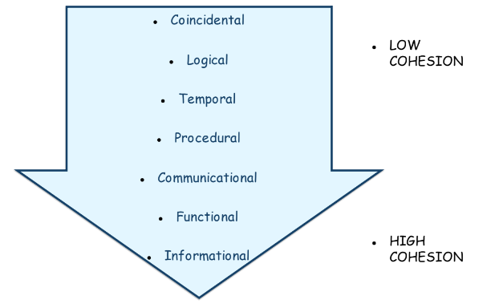
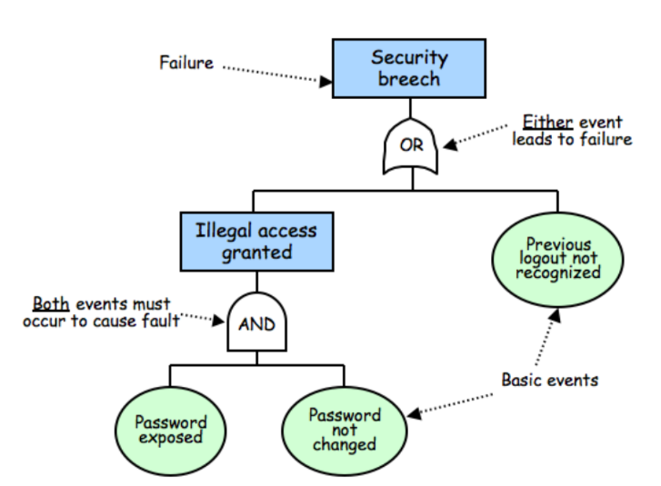
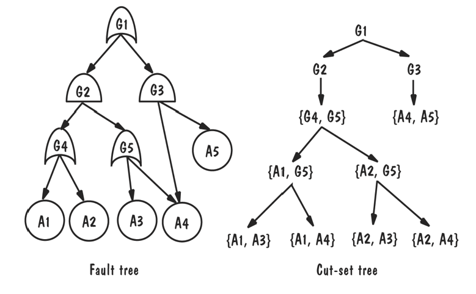
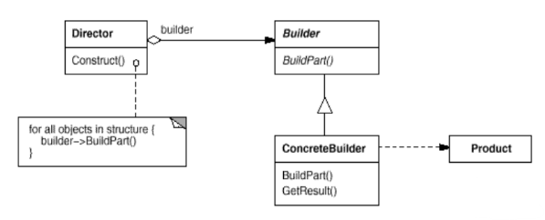
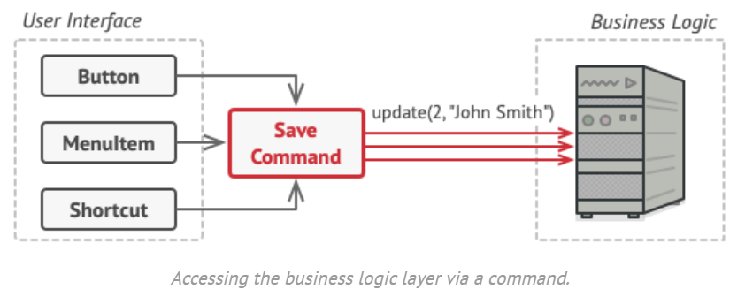
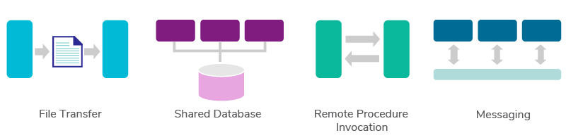

# Architektura software

- [1. Požadavky software](#1-požadavky-software)
  - [1.1. Základní pojmy](#11-základní-pojmy)
  - [1.2. Funkční požadavky](#12-funkční-požadavky)
  - [1.3. Kvalitativní požadavky (Nefunkční požadavky)](#13-kvalitativní-požadavky-nefunkční-požadavky)
  - [1.4. Omezení](#14-omezení)
- [2. Architektonické styly a návrh SW architektury](#2-architektonické-styly-a-návrh-sw-architektury)
  - [2.1. Client-Server](#21-client-server)
  - [2.2. Peer-to-Peer (P2P)](#22-peer-to-peer-p2p)
  - [2.3. Pipes-and-Filter](#23-pipes-and-filter)
  - [2.4. Publish-Subscribe](#24-publish-subscribe)
  - [2.5. Repositories](#25-repositories)
  - [2.6. Layering (Vrstvená architektura)](#26-layering-vrstvená-architektura)
  - [2.7. Kombinace architektonických stylů](#27-kombinace-architektonických-stylů)
- [3. Kvalitativní atributy](#3-kvalitativní-atributy)
  - [3.1. Upravitelnost/Modifikovatelnost (Modifiability)](#31-upravitelnostmodifikovatelnost-modifiability)
    - [3.1.1. Techniky minimalizace počtu jednotek ovlivněných změnami](#311-techniky-minimalizace-počtu-jednotek-ovlivněných-změnami)
    - [3.1.2. Techniky minimalizace dopadů změn](#312-techniky-minimalizace-dopadů-změn)
  - [3.2. Výkonost (Efficiency)](#32-výkonost-efficiency)
  - [3.3. Bezpečnost (Security)](#33-bezpečnost-security)
  - [3.4. Spolehlivost (Reliability)](#34-spolehlivost-reliability)
  - [3.5. Robustnost (Robustness)](#35-robustnost-robustness)
  - [3.6. Použitelnost (Usability)](#36-použitelnost-usability)
- [4. Výběr architektonického vzoru](#4-výběr-architektonického-vzoru)
  - [4.1. Trade-off analýza](#41-trade-off-analýza)
- [5. Dominantní designové principy](#5-dominantní-designové-principy)
  - [5.1. Modularita](#51-modularita)
  - [5.2. Coupling (Provázanost)](#52-coupling-provázanost)
  - [5.3. Cohesion (Soudržnost)](#53-cohesion-soudržnost)
  - [5.4. Používání rozhraní](#54-používání-rozhraní)
  - [5.5. Zapouzdření](#55-zapouzdření)
- [6. Analýza zabezpeční (Safety Analysis)](#6-analýza-zabezpeční-safety-analysis)
- [7. Měření kvality designu](#7-měření-kvality-designu)
  - [7.1. Chidamber \& Kemerer metriky](#71-chidamber--kemerer-metriky)
  - [7.2. Ostatní metriky](#72-ostatní-metriky)
- [8. Návrhové vzory](#8-návrhové-vzory)
  - [8.1. Gamma kategorizace](#81-gamma-kategorizace)
  - [8.2. Vzory vytváření (Creational Patterns)](#82-vzory-vytváření-creational-patterns)
    - [8.2.1. Stavitel (Builder)](#821-stavitel-builder)
  - [8.3. Vzory strukturální (Structural Patterns)](#83-vzory-strukturální-structural-patterns)
    - [8.3.1. Most (Bridge)](#831-most-bridge)
    - [8.3.2. Dekorátor (Decorator)](#832-dekorátor-decorator)
  - [8.4. Vzory chování (Behavioral Patterns)](#84-vzory-chování-behavioral-patterns)
    - [8.4.1. Command](#841-command)
    - [8.4.2. Iterator](#842-iterator)
    - [8.4.3. Template Method](#843-template-method)
- [9. SOLID Design Principles](#9-solid-design-principles)
  - [9.1. Single Responsibility Principle (SRP) or Separation of Concerns (SoC)](#91-single-responsibility-principle-srp-or-separation-of-concerns-soc)
  - [9.2. Open-Close Principle (OCP)](#92-open-close-principle-ocp)
  - [9.3. Liskov Substitution Principle (LSP)](#93-liskov-substitution-principle-lsp)
  - [9.4. Interface Segregation Principle (ISP)](#94-interface-segregation-principle-isp)
  - [9.5. Dependency Inversion Principle (DIP)](#95-dependency-inversion-principle-dip)
- [10. Integrace](#10-integrace)
  - [10.1. Integrační styly](#101-integrační-styly)
    - [10.1.1. Integrační kritéria](#1011-integrační-kritéria)
    - [10.1.2. Možnosti integrace](#1012-možnosti-integrace)
- [11. GIT](#11-git)

## 1. Požadavky software

### 1.1. Základní pojmy

- **SW jednotka** - komponenta / třída / atd. (obecný pojem)

### 1.2. Funkční požadavky

- požadavky na funkcionalitu SW
- např. pokud senzor zjistí, že je poškozené sklo, tak musí systém informovat security

### 1.3. Kvalitativní požadavky (Nefunkční požadavky)

Důležité pro vývojáře:

- Udržovatelnost (maintainability) - testovatelnost, pochopitelnost, modifikovatelnost
- Přenositelnost (na jiný OS)
- Znovupoužitelnost
- Testovatelnost

Důležité pro uživatele:

- Dostupnost
- Výkonost
- Bezpečnost - např. bezpečné heslo, 2FA
- Spolehlivost (MTBF)
- Robustnost (vůči chybám)
- Použitelnost (UI)

### 1.4. Omezení

- Zdroje - výpočetní, finanční
- Délka vývoje
- Fyzické prostředí - např. letadlo nemůže mít nekonečně dlouhé křídlo s šířkou jednoho atomu

## 2. Architektonické styly a návrh SW architektury

- design SW je kreativní proces, kdy se snažíme implementovat všechny požadavky zákazníka
- **"hrubý návrh"** - systémová architektura
- **"detailní návrh"** - třídní diagramy, SW jednotky atd.

Architektonické styly:

1. Client-Server
2. Peer-to-Peer
3. Pipes-and-Filter
4. Publish-Subscribe
5. Repository
6. Layering

### 2.1. Client-Server

- server nabízí nějakou službu, klient ji používá
- klient používá služby serveru na základě protokolu požadavek / odpověď *(request / reply)*
- **centralizace** - snaha centralizovat funkce na server
- jednoduchost aktualizací

### 2.2. Peer-to-Peer (P2P)

- **decentralizace** ("opak klient-server")
- dobré škálování, vysoká odolnost vůči výpadkům
- každý komponent (klient) má vlastní procesy a chová se zároveň jako klient a server
- bitcoin, torrenty

### 2.3. Pipes-and-Filter

- "pípy a filtry"
- tok dat - pipe
- transformace dat - filter
- např. programy v Linuxu (`ls -R | grep "sw-quality"`)
- snadná znovupoužitelnost a rozšiřitelnost
- jednoduchý paralelismus

### 2.4. Publish-Subscribe

- když nějaký komponent ohlásí event - **publish** - tak komponenty, které jsou přihlášeny k odběru zpráv tohoto komponentu (subscribed) jsou notifikovány
- registrace k odběru zpráv - **subscribe** - komponenty vyjadřují zájem o eventy vytvořené daným komponentem
- **integrace systémů**
  - např. *Apache Camel*
- jednoduchá rozšiřitelnost a znovupoužitelnost
- složité testování
- potřeba sdíleného repozitáře

### 2.5. Repositories

- **centrální sdílené úložiště** (např. soubor na disku) a **komponenty**, které nad tímto úložištěm komunikují (aktualizace, zápis a čtení dat)
- dostupnost dat pro všechny komponenty, ale zároveň musí všechny komponenty být schopny s těmito daty pracovat

### 2.6. Layering (Vrstvená architektura)

- vrstvy jsou hierarchické
  - vnější vrstva se chová jako klient vůči vnitřní vrstvě (komponenta z vnitřní vrstvy by neměla záviset na komponentě z vnější)
  - layer bridging - nějaká vrstva se přeskočí
  - komunikace mezi vrstvami probíhá pomocí protokolů
- vysoká úroveň abstrakce
- relativně jednoduchá úprava vrstev
- ne vždy je možné tuto architekturu snadno použít (nemusí být jednoduché rozdělit problém do vrstev podle míry abstrakce)
- výkon může být omezený režijními náklady *(overhead cost)* komunikace mezi vrstvami
- např. ISO/OSI model



### 2.7. Kombinace architektonických stylů



- praktický příklad kombinace architektonických stylů - REST (Representational state transfer)
  - RESTful-API

## 3. Kvalitativní atributy

### 3.1. Upravitelnost/Modifikovatelnost (Modifiability)

- design SW by měl umožňovat snadné změny
- zapouzdření komponent (encapsulation)
- soudržnost (cohesion)
- obecnost - nedělám jednotku pro konkrétní problém (např. jenom pro jeden datový typ)
- použití rozhraní (interface)

#### 3.1.1. Techniky minimalizace počtu jednotek ovlivněných změnami

- **očekávání změn** - komponenty, u kterých lze očekávat změny by měly být zapouzdřeny do jedné SW jednotky pro snadnou výměnu/úpravu
- **soudržnost** (cohesion) - týká se jedné SW jednotky
  - míra modularity SW
  - pokud jednotka dělá mnoho různých věcí, tak není soudržná (viz [9.1. Single Responsibility Principle (SRP) or Separation of Concerns (SoC)](#91-single-responsibility-principle-srp-or-separation-of-concerns-soc))
- **obecnost** - schopnost pracovat s různými typy dat (očekávání změny vstupních dat)

#### 3.1.2. Techniky minimalizace dopadů změn

- provázanost (coupling) - jak moc jsou jednotky propojené, resp. samostatné (snažíme se minimalizovat provázanost)
- použití rozhraní (nebo více rozhraní) - jednotky spolu komunikují přes rozhraní (viz [9.4. Interface Segregation Principle (ISP)](#94-interface-segregation-principle-isp))

### 3.2. Výkonost (Efficiency)

- **doba odezvy** *(response time)* - jak rychle systém odpovídá na požadavky
- **propustnost** *(throughput /:ˈθruːˌpʊt:/)* - kolik zvládne systém požadavků za jednotku času
- **zatížení** *(load)* - kolik uživatelů zvládne SW obsloužit
- **zvýšení využití** zdrojů
  - **paralelizace** - např. *více vláken*, *více clusterů*
- **snížení požadavků** na zdroje
  - odstranění zbytečných požadavků
  - **first come / first served**
  - **explicitní priorita požadavků** - prioritní fronta
  - **deadline** - první se zpracuje požadavek, který má nejbližší deadline

### 3.3. Bezpečnost (Security)

- **immunity** - schopnost zmařit pokus o útok
- **resilience** - schopnost rychle se zotavit z útoku (např. rychlé obnovení)

### 3.4. Spolehlivost (Reliability)

- SW je spolehlivý, pokud pracuje určenou dobu bez selhání podle nastavaných požadavků / očekávaného chování
- pasivní detekce vad - čekám až vada nastane
- aktivní detekce vad - kontrola symptomů, predikce
- zpracování výjimek - např. deadlock, data corruption

Zotavení se z vady:

- zrušení transakce
- rollback / checkpoint
- backup

### 3.5. Robustnost (Robustness)

- SW je robustní, pokud obsahuje mechanismy pro zotavení z chyby nebo přizpůsobení se chybě
  - zrušení transakce
  - rollback / checkpoint
  - backup

### 3.6. Použitelnost (Usability)

- UI by mělo být v samostatné SW jednotce
- model okolí (např. ztmavení displeje ve tmě)

## 4. Výběr architektonického vzoru

### 4.1. Trade-off analýza

- "analýza kompromisů"
- prioritu nastavíme se stake-holdery a přiřadíme vhodnost vzorů podle zkušenosti
- vynásobím vektor priorit s vektorem vzoru, čím vyšší číslo, tím vhodnější


## 5. Dominantní designové principy

1. dekompozice a modularita (cohesion/soudržnost & coupling/provázanost)
2. používání rozhraní
3. zapouzdření - skrývání návrhových rozhodnutí

### 5.1. Modularita

- při změně modulu nemusím měnit zbytek kódu (pokud je dobře navržen a není silně provázaný s ostatními moduly)
- moduly zjednodušují orientaci v SW produktu

### 5.2. Coupling (Provázanost)

- snažíme se **minimalizovat coupling (provázanost)** a **maximalizovat cohesion (soudržnost)** ==> tím se zvyšuje modularita
- **coupling je míra závislosti mezi moduly** - komplexita vazeb a jejich počet



- **content coupling** - jedna SW jednotka přímo mění **interní data** druhé
  - jedna třída mění *public instanční proměnné* druhé třídy
  - přímé *volání setterů*
  - volání `goto`
  - změna kódu za běhu programu
- **common coupling** - když více modulů má přístup ke stejným **globálním datům**
  - jednoduchost přístupu ke globálním proměnným
  - není to thread-safe
  - nemáme kontrolu nad tím, kdo má ke globálním datům přístup a kdo je může upravovat
- **control coupling** - jeden modul řídí chování jiného modulu (volá jeho metody)

```python
class A:
    def __init__(self, x: int) -> None:
        self.x = x

    def foo(self) -> str:
        b = B()
        if b.check_int(self.x):
            return "Hello!"
        else:
            return "Bye!"


class B:
    def check_int(self, x: int) -> bool:
        return x > 10


if __name__ == "__main__":
    a = A(11)
    print(a.foo())
```

- **stamp coupling** - vyměňování složitých strukturovaných dat mezi moduly (např. serializace objektů a jejich následné čtení v jiné třídě, když se takto nějaká struktura používá, tak by měla být stabilně navržena)
- **data coupling** - pouze hodnoty dat (nestrukturovaná data)

### 5.3. Cohesion (Soudržnost)



- **coincidental / unrelated cohesion** - části SW jednotky spolu nesouvisí (nejhorší stupeň, porušení SRP, anti-pattern)
- **logical cohesion** - části SW jednotky jsou propojeny pouze logickou strukturou kódu
- **temporal cohesion** - data a funkce jsou propojeny, protože jsou použity ve stejném čase při exekuci kódu, třeba spuštění při startu PC
- **procedural cohesion** - podobné jako temporal, při nějaké akci (např. backup)
- **communication cohesion** - fungují nad stejnými daty (např. pouze jeden konkrétní dataset)
- **functional cohesion** - ideální stav - všechny prvky nezbytné pro danou funkci jsou obsaženy v jednom modulu a všechny prvky jsou nezbytné pro výkon této funkce
- **informational cohesion**

```cpp
Module A {
  """
  It's said to have perfect informational cohesion because it cannot be reduced any more than that.
  """
  r(x) = 5x + 3
}
```

### 5.4. Používání rozhraní

- vždy bychom se měli v kódu snažit používat nejobecnější rozhraní (viz ISP a LSP)

### 5.5. Zapouzdření

- skrytí návrhových rozhodnutí zvenčí

## 6. Analýza zabezpeční (Safety Analysis)





## 7. Měření kvality designu

### 7.1. Chidamber & Kemerer metriky

- WMC - **Weighted Methods Per Class** – low is better
- DIT - **Depth of Inheritance Tree** – maximum recommended DIS is 5 or less
- NOC - **Number of Children**
- CBO - **Coupling Between Object classes** - number of classes to which a class is coupled
- RFC - **Response For Class**
- LCOM1 - **Lack of Cohesion of Methods**

### 7.2. Ostatní metriky

- **McCabova cyklomatická míra složitosti** (*McCabes's Cyclomatic Complexity*): $\boxed{M=E-N+2P}$ ("**počet rozhodnutí** - kosočtverců v grafu kontrolního toku - **plus jedna**")
  - E = počet hran
  - N = počet uzlů (rozhodnutí (kosočtverce) a start/end)
  - P = počet souvislých grafových komponent
- **Řádky kódu**
- **Úroveň vnoření**
- **Fan-in, Fan-out** - kolik modulů daný modul volá a kolika moduly je modul volán
  - typicky velké rozdíly, pokud jsou oba počty velké, tak je na místě přemýšlet o komplexitě daného modulu

## 8. Návrhové vzory

- návrhové vzory jsou vzory, které se v praxi často opakují nejen v OOP jazycích
- viz [refactoring.guru](https://refactoring.guru/design-patterns)
- co je důležité vědět?

1. název vzoru
2. záměr/důvod vzoru
3. struktura vzoru

- **GoF** - **Gang of Four** - autoři knihy Design Patterns: Elements of Reusable Object-Oriented Software (1994)
  - definovali 21 návrhových vzorů, které jsou definované dále

### 8.1. Gamma kategorizace

- podle jednoho z autorů GoF - Erich Gamma - vznikla tzv. gamma kategorizace

1. **Vzory vytváření** (Creational Patterns)
    - tvorba / konstrukce objektů
      - explicitní - konstruktor
      - implicitní - DI (Dependency Injection), reflection
      - wholesale (single statement)
      - piecewise (step-by-step)
2. **Vzory strukturální** (Structural Patterns)
    - význam pro dobrý API design
3. **Vzory chování** (Behavioral Patterns)
    - "každý je jiný"

### 8.2. Vzory vytváření (Creational Patterns)

Creational patterns defer some part of object creation to a subclass
or another object.

1. Builder
2. Factory - defines an interface to create an object, but let subclasses decide which class to instantiate
3. Abstract Factory
4. Prototype
5. Singleton

#### 8.2.1. Stavitel (Builder)

- tvorba komplexního objektu po částech



### 8.3. Vzory strukturální (Structural Patterns)

Structural patterns compose classes or objects.

1. Adapter
2. Bridge
3. Decorator
4. Facade
5. Flyweight
6. Proxy

#### 8.3.1. Most (Bridge)

#### 8.3.2. Dekorátor (Decorator)

### 8.4. Vzory chování (Behavioral Patterns)

Behavioral Patterns describe algorithms or cooperation of objects.

1. Chain of Responsibility
2. Command
3. Interpreter
4. Iterator - přístup k prvkům kolekce bez znalosti imlementace dané kolekce
5. Memento - "quicksave"
6. Mediator - definuje, jak by spolu měla množina objektů interagovat
7. Observer - definuje 1--* závislost, pokud jeden objekt změní stav, tak všechny závislé objekty jsou automaticky aktualizovány
8. State - umožňuje změnu chování objektu na základě změny vnitřního stavu
9. Strategy - definuje skupinu algoritmů, zapouzdří je a docílí jejich vzájemné zaměnitelnosti
10. Visitor - reprezentuje operaci, která se provádí na prvcích objektu
11. Template method - definuje "skeleton" algoritmu

#### 8.4.1. Command



Místo implementace spousty různých tlačítek budeme implementovat několik **tříd příkazů** pro všechny možné operace a propojíme je s konkrétními tlačítky v závislosti nad zamýšleným chováním tlačítek.

#### 8.4.2. Iterator

- má dvě metody `get_next` a `has_next`
- jednotné rozhraní pro průchod heterogenních kolekcí
- konkrétní iterátor je úzce spjatý s datovou strukturou, jejíž průchod chceme implementovat
  - přistupuje k interním proměnným dané datové struktury
  - jak lze přistoupit k interní proměnné kolekce přes zapouzdření? Např. v C# mají kolekce vnořenou třídu Enumerable

#### 8.4.3. Template Method

- abstraktní metody
- předdefinujeme názvy metod, které musí potomci implementovat
- vzor chování potomků, pomocí názvů metod

## 9. SOLID Design Principles

1. **SRP** - Single Responsibility Principle
2. **OCP** - Open Close Principle
3. **LSP** - Liskov Substitution Principle
4. **ISP** - Interface Segregation Principle
5. **DIP** - Dependency Inversion Principle

### 9.1. Single Responsibility Principle (SRP) or Separation of Concerns (SoC)

- a class should have its primary responsibility and it shouldn't take on other responsibilities
- anti-pattern - god object - one class that does all kinds of stuff
- e.g., `class Journal`
  - primary function: adding entries, removing entries, printing entries
  - secondary function: saving, loading, etc.   $\Rightarrow$ `class PersistenceManager`  

### 9.2. Open-Close Principle (OCP)

- open for extension, closed for modification
- industry **Specification** design pattern

### 9.3. Liskov Substitution Principle (LSP)

- Barbara Liskov (Turingova cena 2008)
- Pokud mám interface a nějakou hierarchii tříd, která implementuje tento interface, tak bych měl být vždy schopen nahradit předka potomkem bez omezení správnosti všech metod!

### 9.4. Interface Segregation Principle (ISP)

- Interface by neměl mít příliš velké množství metod. Je lepší takové rozhraní rozdělit na více rozhraní.
- YAGNI - You Ain't Going to Need It

```python
from abc import ABC, abstractmethod

class Machine(ABC):
    @abstractmethod
    def print(self, document):
        raise NotImplementedError()

    @abstractmethod
    def fax(self, document):
        raise NotImplementedError()

    @abstractmethod
    def scan(self, document):
        raise NotImplementedError()
```

```python
class Printer(ABC):
    @abstractmethod
    def print(self, document): pass


class Scanner(ABC):
    @abstractmethod
    def scan(self, document): pass
```

### 9.5. Dependency Inversion Principle (DIP)

- Instead of depending on a low level module directly, create an interface for the low level modules, and let the high level module depend on the interface.

## 10. Integrace

### 10.1. Integrační styly

#### 10.1.1. Integrační kritéria

- application coupling
- jednoduchost
- integrační technologie
- datové formáty (.json, .xml,...)
- asynchronnost

#### 10.1.2. Možnosti integrace

- **přenos souborů** *(file transfer)* - export / import sdílených dat
- **sdílená databáze** *(shared database)* - aplikace přistují ke sdílené databázi
- **vzdálené volání procedur** *(remote procedure invocation)*- eventy
- **zasílání zpráv** *(messaging)* - sender / receiver



## 11. GIT

- `git init`
- `git add <soubor>`...stage a file
- `git add remote <custom-remote-name> <remote-url>`...nejčastěji název `origin`
- `git push <nazev_remote> <branch>`
- `git fetch <nazev_remote>`
- `git merge [<nazev_remote>] <branch>`
- `git rebase [<nazev_remote>] <branch>`
- `git checkout [-b] <branch>`...přepnutí na branch
  - `-b` vytvoří novou branch
- `git push <nazev_remote> HEAD`...push jiné branch než "main"; lze nastavit defaultně přepínačem `-u` (upstream), abych při dalším push nemusel psát origin a HEAD (tj. ukazatel na aktuální branch)
- `git pull <remote-url> <remote-branch> --allow-unrelated-histories`...pull z jiného remote repozitáře, bez přidání pomocí `git remote add <custom-remote-name> <remote-url>`
- branch je ukazatel na commit
- co patří do `.gitignore`? Třeba soubory, které se vytvoří při buildu (třeba .venv)
- `amend` lze upravit poslední `commit`
