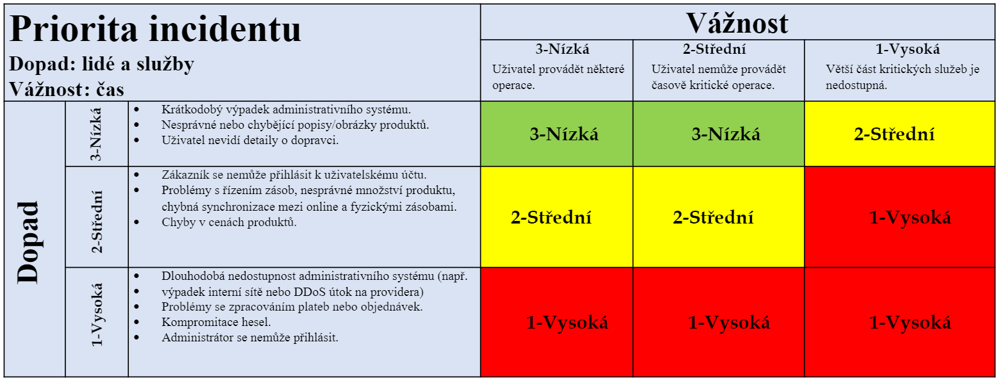

# Cyber Security

- [1. Základní pojmy](#1-základní-pojmy)
- [2. Jak připravit test?](#2-jak-připravit-test)
  - [2.1. Cyber Kill Chain - Lockheed Martin](#21-cyber-kill-chain---lockheed-martin)
  - [2.2. MITRE ATT\&CK (Adversary Tactics, Techniques, and Common Knowledge)](#22-mitre-attck-adversary-tactics-techniques-and-common-knowledge)
  - [2.3. Přístupy k testování](#23-přístupy-k-testování)
    - [2.3.1. BSIMM](#231-bsimm)
    - [2.3.2. OWASP](#232-owasp)
- [3. Jak můžeme útok ovlivnit?](#3-jak-můžeme-útok-ovlivnit)
- [4. Penetration Testing (PT)](#4-penetration-testing-pt)
  - [4.1. Metody penetračního testování](#41-metody-penetračního-testování)
  - [4.2. White Box PT](#42-white-box-pt)
  - [4.3. Black Box PT](#43-black-box-pt)
  - [4.4. Grey Box PT](#44-grey-box-pt)
- [5. Co by se mělo testovat?](#5-co-by-se-mělo-testovat)
  - [5.1. Technologie](#51-technologie)
  - [5.2. Lidi](#52-lidi)
- [6. Test-Driven-Development (TDD)](#6-test-driven-development-tdd)
  - [6.1. AAA Unit Test Pattern](#61-aaa-unit-test-pattern)
  - [6.2. Techniky code coverage](#62-techniky-code-coverage)
  - [6.3. Integration Testing](#63-integration-testing)
- [7. Incident Management](#7-incident-management)
  - [7.1. Prioritizace incidentů](#71-prioritizace-incidentů)
  - [7.2. Eskalace](#72-eskalace)
- [8. Požadavky na počítačovou bezpečnost](#8-požadavky-na-počítačovou-bezpečnost)
  - [8.1. Principy bezpečnosti](#81-principy-bezpečnosti)
    - [8.1.1. CIA](#811-cia)
    - [8.1.2. OWASP](#812-owasp)
    - [8.1.3. Vize bezpečnostních cílů](#813-vize-bezpečnostních-cílů)

## 1. Základní pojmy

- **Cyber threat actors** (adversaries) - snaží se využít existující zranitelnosti systému (vulnerabilities) s úmyslem poškodit oběť
  - Státem sponzorovaní aktéři
  - Aktéři kyberkriminality
  - Nájemní hackeři
  - Hacktivisté
- **Supply chain** *(dodavatelský řetězec)* - všechno co vede k dodání finálního produktu
- **Ransomware** - např. vymáhání peněz pod hrozbou zveřejnění ukradených dat
- **Formjacking** - JavaScript pro krádež údajů o kreditní kartě a dalších informací z platebních formulářů na e-shopech
- **Magecart** - označuje několik hackerských skupin, které se zaměřují na krádeže osobních dat z formulářu webových stránek (především údeje o platebních kartách)
- **Cryptojacking** - útočníci se pokoušejí spustit škodlivý kód na zařízeních obětí bez jejich vědomí a využívají prostředky zařízení oběti k těžbě kryptoměn
- **Denial of service (DoS) attacks**
- **Software development life cycle (SDLC)** - proces vývoje SW
  - **Secure SDLC (SSDLC)** - navíc přidává počítačovou bezpečnost v každém kroce SDLC
- **Secure software development framework (SSDF)** - vytvořeno National Institute of Standards and Technology (**NIST**)
  - definuje jak realizovat SSDLC
  - snaha snížit počet zranitelností systému
- **Requirement Traceability Matrix (RTM)** je dokument (často tabulka), který sleduje úplnost splnění požadavků na projekt.
- **Bug Bounty** - Společnosti nabízející finanční odměny za nalezení zranitelností v systému.
- **SW Požadavky** - co by měl SW splňovat
  1. **Funkční** - důležité pro zákazníka (např. redundance a diverzita - př. v autě dva digitální senzory a dva optické)
  2. **Kvalitativní** (nefunkční) - důležité pro vývojáře
- **Role v počítačové bezpečnosti**
  - Test Manager
  - Test Analyst - identifikuje a definuje potřebné testy
  - Test Designer - implementace testů
  - Tester - provádí testy

## 2. Jak připravit test?

### 2.1. Cyber Kill Chain - Lockheed Martin

1. **Reconnaissance** - Sběr dat, skenování systému, hledání zranitelností.
2. **Weaponization** - Útočníci vyvíjejí malware s využitím bezpečnostních zranitelností.
3. **Delivery** - Útočník doručí malware prostřednictvím phishingového e-mailu nebo jiného média.
4. **Exploitation** - Škodlivý kód je doručen do systému organizace. Útočníci získají příležitost zneužít systémy organizace instalací nástrojů, spouštěním skriptů a úpravou bezpečnostních certifikátů.
5. **Installation** - Malware nainstaluje zadní vrátka *(backdoor)* nebo trojského koně *(trojan)* pro vzdálený přístup. který poskytuje přístup útočníkovi.
6. **Command and Control** - Útočník získá kontrolu nad systémy organizace. Útočníci získají přístup k privilegov;aným účtům.
7. **Actions on Objective** - Útočník nakonec extrahuje data ze systému. Cílem je shromáždit, zašifrovat a extrahovat důvěrné informace z prostředí organizace.

### 2.2. MITRE ATT&CK (Adversary Tactics, Techniques, and Common Knowledge)

- Útočný vektor.
- MITRE ATT&CK® je celosvětově dostupná znalostní databáze taktik a technik útočníků založená na reálných pozorováních.
- Je široce přijímána jako průmyslový standard.
- Jde o krok dále než *Cyber Kill Chain* tím, že rozšiřuje cíle útočníků na vysoké úrovni na 14 různých taktik.

### 2.3. Přístupy k testování

- Descriptive frameworks (popisné rámce): **BSIMM** /:bee simm:/
- Prescriptive frameworks (normativní rámce): **OWASP**

#### 2.3.1. BSIMM

The Building Security In Maturity Model (**BSIMM**) - analýza existujícího SW.

#### 2.3.2. OWASP

The Open Web Application Security Project (**OWASP**) - typický rámec testování, který lze vytvořit v rámci organizace. V rámci celého SDLC.

## 3. Jak můžeme útok ovlivnit?

| Činnost     | Popis                                                                                                  |
|-------------|--------------------------------------------------------------------------------------------------------|
| Detect *(detekce)*    | Snaží se detekovat pokusy o skenování nebo průnik do organizace.                                        |
| Deny *(zamítnutí)*   | Zastavuje útoky v jejich průběhu.                                                              |
| Disrupt *(rušení)*      | Přerušuje datovou komunikaci prováděnou útočníkem.                                      |
| Degrade *(degradace)*   | Vytváří opatření, která omezí účinnost útoku.                                                           |
| Contain *(omezení)*     | Zmatení útočníka poskytnutím falešných informací nebo nastavením návnadných prostředků.                    |

## 4. Penetration Testing (PT)

Penetrační testování napodobuje chování typického útočníka. Jedná se o simulovaný útok na systém za účelem *vyhodnocení bezpečnosti* testovaného systému. Cílem je najít *zranitelnosti*, které by útočník mohl zneužít.

1. **Průzkum** - Fáze shromažďování informací o cílovém systému.
2. **Skenování** - Použití nástrojů k prohloubení znalostí útočníka o systému.
3. **Získání přístupu**: Pomocí informací získaných v předchozích fázích může útočník zaútočit na cílový systém.

### 4.1. Metody penetračního testování

- **Code-review**
- **Fuzzing** - generování atypických vstupů ve snaze odhalit co největší množství interních stavů systému
- **Skenování zranitelností**

### 4.2. White Box PT

- Systémové *informace* jsou analytikovi *poskytnuty předem*.
- Sdílení zdrojového kódu a informací o komponentách, zapojení a architektuře.

### 4.3. Black Box PT

- Analytikovi jsou poskytnuty nanejvýš *základní nebo žádné informace*.
- Analytik tak *vystupuje jako útočník*, který má k dispozici pouze veřejně dostupnou dokumentaci.
- Tam, kde znalosti a veřejně dostupná dokumentace nestačí, je zapotřebí *reverzní inženýrství*.

### 4.4. Grey Box PT

- Kombinace předchozích dvou přístupů.

## 5. Co by se mělo testovat?

### 5.1. Technologie

- firmware
- webové stránky
- mobilní aplikace
- infrastruktura
  - počítače,
  - mobilní zařízení,
  - síťové prvky (routery, switche - admin admin :D)

### 5.2. Lidi

- školení o počítačové bezpečnosti

## 6. Test-Driven-Development (TDD)

- Testy se píší před psaním kódu.
- Tato metodologie pomáhá nalézt chyby v systému brzy.
- Dobré unittesty slouží jako dokumentace projektu.

### 6.1. AAA Unit Test Pattern

- **Arrange, Act, Assert (AAA)**
  - Arrange - příprava vstupů
  - Act - spuštění testu
  - Assert - verifikace výsledků testu

### 6.2. Techniky code coverage

Pokrytí kódu je procentuální část kódu, která je pokryta automatizovanými testy.

- Statement Coverage
- Decision Coverage
- Branch Coverage
- Condition Coverage
- Finite State Machine Coverage

### 6.3. Integration Testing

Integrační testování je definováno jako typ testování, při kterém jsou *softwarové moduly* logicky *integrovány* a testovány jako skupina. Typický softwarový projekt se skládá z více softwarových modulů, které programují různí programátoři. Účelem této úrovně testování je *odhalit chyby ve vzájemné interakci* mezi těmito softwarovými moduly při jejich integraci.

- **Big Bang** - integrační testování jedné jednotky, která vznikne integrací všech modulů v projektu
  - vhodné jedině pro malé projekty
  - složitá lokalizace chyb
- **Incremental** Approach
  - **Top Down**
  - **Bottom Up**
    - jednoduchá lokalizace chyb
    - nemusí se čekat vývoj všech modulů
    - kritické moduly ("nahoře") jsou testovány jako poslední
  - **Sandwich Testing** - kombinace top-down a bottom-up

## 7. Incident Management

1. **Incident** - Něco se rozbilo nebo se brzy rozbije. Co nejrychleji proveďte opravu.
2. **Problem** - Základní příčina incidentu. Zůstává otevřená, dokud se příčina nevyřeší (vytváří "work-arounds").
3. **Service Request** - Běžné prosby o pomoc, ale nic není rozbité (např. "Pomůžete mi resetovat heslo?")

### 7.1. Prioritizace incidentů

Cíle pro zajištění úrovně služeb v případě incidentu:

| **Priorita** | **Cílová doba odezvy**   | **Cílová doba vyřešení** |
|--------------|--------------------------|--------------------------|
| 3 (Nízká)    | 90% ve 24 hodinách       | 90% v 7 dnech            |
| 2 (Střední)  | 90% ve 4 hodinách        | 90% ve 12 hodinách       |
| 1 (Vysoká)   | 95% do 1 hodiny          | 90% do 4 hodin           |

### 7.2. Eskalace

K eskalaci incidentu dochází, když zaměstnanec nedokáže incident vyřešit sám a potřebuje předat úkol zkušenějšímu nebo specializovanému pracovníkovi.

- V principu jak a koho kontaktovat v případě incidentu (podle vážnosti).

## 8. Požadavky na počítačovou bezpečnost

- [Common Vulnerability Disclosures](https://cve.org) - záznamy o častých zranitelnostech systému
- **Security Requirements Specification (SecRS)** - dokument o požadavcích na počítačovou bezpečnost

### 8.1. Principy bezpečnosti

#### 8.1.1. CIA

1. **C**onfidentiality *(důvěrnost)* - kontrola nad daty, zajištění ochrany osobních údajů
2. **I**ntegrity - zamezení neautorizované modifikace nebo zničení informací, součástí je nepopirateslnost (*non-repudiation*, kdo to udělal) a pravost informací (*autheticity*, informace patří nějakému ověřenému účtu).
3. **A**vailability - informace musí být vždy přístupné

#### 8.1.2. OWASP

- v principu to samé jako CIA

#### 8.1.3. Vize bezpečnostních cílů

| Security Measure      | Associated Security Mechanisms                              |
|-----------------------|------------------------------------------------------------|
| Access Control        | Biometrics; Certificates; Multilevel security; Passwords and keys; Reference monitor; Registration; Time limits; User permissions; VPN  |
| Security Policy       | Administrative privileges; Malware detection; Multilevel security; Reference monitor; Secure channels; Security session; Single access point; Time limits; User permissions; VPN  |
| Non-repudiation       | Administrative privileges; Logging and auditing; Reference monitor  |
| Physical Protection   | Access cards; Alarms; Equipment tagging; Locks; Offsite storage; Secured rooms; Security personnel  |
| System Recovery        | Backup and restoration; Configuration management; Connection service agreement; Disaster recovery; Off-site storage; Redundancy  |
| Attack detection       | Administrative privileges; Alarms; Incident response; Intrusion detection systems; Logging and auditing; Malware detection; Reference monitor  |
| Boundary Protection   | DMZ (Demilitarized Zone); Firewalls; Proxies; Single access point; VPN  |
