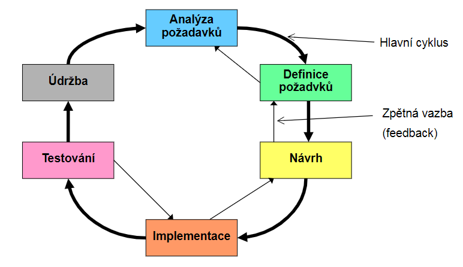

# Testování software

- [1. Základní pojmy](#1-základní-pojmy)
  - [1.1. Základní principy](#11-základní-principy)
  - [1.2. Cena selhání](#12-cena-selhání)
  - [1.3. Specifikace cestů](#13-specifikace-cestů)
    - [1.3.1. Test Case (TC)](#131-test-case-tc)
  - [1.4. Provádění testů](#14-provádění-testů)
  - [1.5. Záznam testů a vyhodnocování](#15-záznam-testů-a-vyhodnocování)
  - [1.6. Kritéria ukončení testování](#16-kritéria-ukončení-testování)
  - [1.7. Opakované testování (Re-Testing)](#17-opakované-testování-re-testing)
  - [1.8. Regresní schéma](#18-regresní-schéma)
- [2. Testování komponent (unit testing) a proč vůbec testovat](#2-testování-komponent-unit-testing-a-proč-vůbec-testovat)
  - [2.1. Co testovat](#21-co-testovat)
  - [2.2. Python unittest](#22-python-unittest)
    - [2.2.1. Pokrytí testu](#221-pokrytí-testu)
    - [2.2.2. Parameterized Tests](#222-parameterized-tests)
    - [2.2.3. BeforeAll \& BeforeEach \& AfterEach \& AfterAll](#223-beforeall--beforeeach--aftereach--afterall)
    - [2.2.4. Test Standard Output](#224-test-standard-output)
- [3. Statická analýza](#3-statická-analýza)
  - [3.1. Statické metriky](#31-statické-metriky)
- [4. Dynamické testování](#4-dynamické-testování)
  - [4.1. Black-box testování](#41-black-box-testování)
    - [4.1.1. Ekvivalentní rozdělení](#411-ekvivalentní-rozdělení)
    - [4.1.2. Analýza hraničních hodnot](#412-analýza-hraničních-hodnot)
    - [4.1.3. Testování přechodu mezi stavy](#413-testování-přechodu-mezi-stavy)
- [5. White-box testovací metody](#5-white-box-testovací-metody)
- [6. Cíle](#6-cíle)
- [7. Testovací data](#7-testovací-data)
- [8. Obtížnost porovnání](#8-obtížnost-porovnání)
- [9. Prioritizace testů](#9-prioritizace-testů)
  - [9.1. Metody prioritizace testů](#91-metody-prioritizace-testů)
- [10. Validace a Verifikace (V\&V)](#10-validace-a-verifikace-vv)
- [11. Modely pro testování](#11-modely-pro-testování)
  - [11.1. Vodopádový model](#111-vodopádový-model)
  - [11.2. V-model (úrovně testování)](#112-v-model-úrovně-testování)
  - [11.3. Iterativní model](#113-iterativní-model)
  - [11.4. Test-driven development (TDD)](#114-test-driven-development-tdd)
- [12. Úrovně testování](#12-úrovně-testování)

## 1. Základní pojmy

> Testování je proces spouštění programu se záměrem **nalézt vadu**.

- Cílem testování je **detekování vady** (základem je pečlivost).
- Testování může ukázat přítomnost vad, ale nemůže prokázat absenci vad.
- Testování může přinášet špatné zprávy.
- Testování je část zajištění jakosti (Quality Assurance).
- MTBF - **Mean Time Between Failures** (střední doba mezi poruchami)
- Chyba (Error): ”omyl” (lidská, procesní nebo strojová), která zanáší vady do softwaru.
- Vada (Fault): ”bug” nebo ”nedostatek (defect)”, chybná část kódu nebo hardwaru.
- Selhání (Failure): pokud se provede vadný kód, může to vést k chybnému výsledku (to znamená k selhání).
- **Chyba** $\Rightarrow$ **Vada** $\Rightarrow$ **Selhání** (chyba způsobí vadu a ta je příčinou selhání!)

### 1.1. Základní principy

- izolace testovacího kódu od zbytku aplikace
- automatizace (řeší frameworky)
- reprodukovatelnost
- rychlost

### 1.2. Cena selhání

- spolehlivost je pravděpodobnost, že nenastane selhání
- QoL - kvalita života - funkčnost SW, user friendliness (odcházení ke konkurenci)

### 1.3. Specifikace cestů

- co a jak se bude testovat
- základní stavební kameny testování jsou testovací případy (test cases)

#### 1.3.1. Test Case (TC)

- jedinečné jméno/titulek
- jedinečné id
- popis (ideálně není potřeba)
- podmínky/předpoklady (stav systému, při kterém může být test splněn - vstupní hodnoty)
- akce (kroky)
- očekáváné výsledky (assertions)

Automatizované testování např. Selenium, pytest, unittest

Pro parametrizované testy často proběhne hned několik TC během jedné metody.

### 1.4. Provádění testů

- manuálně (třeba klikání na GUI, ideálně podle nějakého dokumentu - návodu)
- automatizovaně (např. Selenium)
- testovací prostředí (nainstalované knihovny, testovací data, aplikace)
- testovací sekvence (závisí na pořadí operací testů, např. CRUD - Create, Read, Update, Delete)

### 1.5. Záznam testů a vyhodnocování

- např. u databází při testech transakcí lze vyhodnotit test až po ukončení transakcí (test konzistence dat)
- logování testů

### 1.6. Kritéria ukončení testování

- MTBF
- pokrytí

### 1.7. Opakované testování (Re-Testing)

- znovuspuštění testů po dodání opravy
- testování na podobné nebo související chyby (třeba, když nefungují obrázky v exportu do .pdf, co když nefungují ani v exportu do .html)

### 1.8. Regresní schéma

Co dělat, když se nestíhá testovat (tzn. re-testing je příliš pomalý)?

- snížení frekvence dodání
- **ikrementální vývoj** - "night buildy (NB)" - testuje se např. jednou týdně
- schéma **Round-Robin**: systém se testuje po částech, např.: NB-1 řádky 1-100, NB-2 řádky 101-200 atd.

## 2. Testování komponent (unit testing) a proč vůbec testovat

U rozsáhlých projektů je potřeba často aktualizovat určité moduly a podle potřeby rafaktorizovat kód. Takové změny mohou způsobit nechtěné následky u jiných modulů, které aktualizovaný modul používají. To může někdy narušit stávající funkčnost.

Jako vývojáři bychom měli kód (ideálně od zahájení vývoje) testovat, abychom zajistili, že všechny moduly v aplikaci fungují tak jak mají. Testy komponent (unit testy) umožňují zkontrolovat, zda malé izolované moduly fungují správně, a umožňují opravit nesrovnalosti, které mohou vzniknout při aktualizacích a refaktorizaci.

Manuální testování je neefektivní, obvzláště pro *exhaustive* testování velkého počtu různých argumentů (`assert is_prime(7) == True`)

### 2.1. Co testovat

- algortimus a logiku
- datové struktury
- interfaces
- nezávislé cesty
- podmínky ohraničení (analýza hraničních hodnot)
- ošetření chyb

### 2.2. Python unittest

```python
# <module-name>.py

import unittest
from <module> import <function_to_test>
# all entries within <> are placeholders

class TestClass(unittest.TestCase):
    def test_<name_1>(self):
        # check function_to_test

    def test_<name_2>(self):
        # check function_to_test
    :
    :
    :

    def test_<name_n>(self):
        # check function_to_test

# or alternatively from command line:
# $python3 -m unittest <module-name>.py
if __name__=='__main__':
    unittest.main()
```

- `assertEqual(expected_value,actual_value)` - Asserts that expected_value == actual_value
- `assertTrue(result)` - Asserts that bool(result) is True
- `assertFalse(result)` - Asserts that bool(result) is False
- `assertRaises(exception, function, *args, **kwargs)` - Asserts that function(*args, **kwargs) raises the exception

Konkrétní příklad:

```python
# prime_number.py
import math
def is_prime(num):
    '''Check if num is prime or not.'''
    # raise TypeError for invalid input type
    if type(num) != int:
        raise TypeError('num is of invalid type')
    # raise ValueError for invalid input value
    if num < 0:
        raise ValueError('Check the value of num; is num a non-negative integer?')
    # for valid input, proceed to check if num is prime
    for i in range(2,int(math.sqrt(num))+1):
        if num%i==0:
        return False
    return True

# test_prime.py
import unittest
from prime_number import is_prime
class TestPrime(unittest.TestCase):
    def test_prime_not_prime(self):
        self.assertTrue(is_prime(2))
        self.assertTrue(is_prime(5))
        self.assertFalse(is_prime(9))
        self.assertTrue(is_prime(11))
    def test_typeerror_1(self):
        with self.assertRaises(TypeError):
            is_prime(6.5)
    def test_typeerror_2(self):
        with self.assertRaises(TypeError):
            is_prime('five')
    def test_valueerror(self):
        with self.assertRaises(ValueError):
            is_prime(-4)
            
if __name__=='__main__':
    unittest.main()
```

Každá testovací metoda by měla začínat prefixem `test_`!

Zdroj: [freeCodeCamp | How to Write Unit Tests for Python Functions](https://www.freecodecamp.org/news/how-to-write-unit-tests-for-python-functions/)

#### 2.2.1. Pokrytí testu

Pokrytí testu je poměr mezi počtem řádků provedených alespoň jedním testem a celkovým počtem řádků zdrojového kódu.

```txt
test coverage = lines of code executed by tests / total number of lines
```

```bash
pip install coverage
python -m coverage run -m unittest #run coverage module
python -m coverage report #create coverage report
python -m coverage html #create coverage report in HTML format (can highlight lines of code without corresponding tests)
```

Pro pokrytí cest (path coverage) neexistuje žádná jednoduchá automatizovaná kontrola. Lze vyčíst třeba z rozhodovacího diagramu.

Zdroje:

- [pythontutorial | Python Unittest Coverage](https://www.pythontutorial.net/python-unit-testing/python-unittest-coverage/)
- [docs.karrlab.org/intro_to_wc_modeling/master/0.0.1/concepts_skills/software_engineering/testing_python](https://docs.karrlab.org/intro_to_wc_modeling/master/0.0.1/concepts_skills/software_engineering/testing_python.html)

#### 2.2.2. Parameterized Tests

```python
from parameterized import parameterized

class TestSequence(unittest.TestCase):
    @parameterized.expand([
        ["foo", "a", "a",],
        ["bar", "a", "b"],
        ["lee", "b", "b"],
    ])
    def test_sequence(self, name, a, b):
        self.assertEqual(a,b)
```

#### 2.2.3. BeforeAll & BeforeEach & AfterEach & AfterAll

```python
import unittest

class Test(unittest.TestCase):

    @classmethod
    def setUpClass(cls):
        """ Code to execute before all of the tests. For example, this can be used to create temporary
        files or to connect to a database.
        """
        cls._connection = createExpensiveConnectionObject()
        pass

    @classmethod
    def tearDownClass(cls):
        """ Code to execute after all of the tests. For example, this can be used to clean up temporary
        files or to close connection to a database.
        """
        cls._connection.destroy()
        pass

    def setUp(self):
        """ Code to execute before each test. """
        pass

    def tearDown(self):
        """ Code to execute after each test. """
        pass
```

#### 2.2.4. Test Standard Output

```python
# $ pip install capturer
import capturer

def test_stdout(self):
    with capturer.CaptureOutput() as captured:
        run_method()
        stdout = captured.get_text()
        self.assertEqual(stdout, expected)
```

## 3. Statická analýza

- analýza programu vykonávaná bez spuštění programu - obecně "linting", "podtrhávání" (např. IntelliSense, [SonnarLint](https://docs.sonarcloud.io/improving/sonarlint/))
  - nedostupný kód (podmínka vždy vyhodnocená jako false; dvojí přiřazení do proměnné `a=3; a=5;`)
  - definice bez použití
  - překročení hranic polí
  - složitost programu (příliš vnořených cyklů/podmínek, příliš dlouhé metody)
- třídní diagram
- strom volání

### 3.1. Statické metriky

- **McCabova cyklomatická míra složitosti** (*McCabes's Cyclomatic Complexity*): $\boxed{M=E-N+2P}$ ("**počet rozhodnutí** - kosočtverců v grafu kontrolního toku - **plus jedna**")
  - E = počet hran
  - N = počet uzlů (rozhodnutí (kosočtverce) a start/end)
  - P = počet souvislých grafových komponent
- **Řádky kódu**
- **Úroveň vnoření**
- **Fan-in, Fan-out** - kolik modulů daný modul volá a kolika moduly je modul volán
  - typicky velké rozdíly, pokud jsou oba počty velké, tak je na místě přemýšlet o komplexitě daného modulu

## 4. Dynamické testování

### 4.1. Black-box testování

- **Na základě požadavků (funkční, kvalitativní)**

#### 4.1.1. Ekvivalentní rozdělení

- Identifikují se množiny vstupních hodnot, za předpokladu, že testovaný systém zachází stejně se všemi hodnotami v dané množině.
- Vytvoří se jeden testovací případ pro každou identifikovanou množinu (třídu ekvivalence - ReSyTr)


#### 4.1.2. Analýza hraničních hodnot

Pro každou identifikovanou hranici ve vstupech a výstupech se vytvoří dva testovací případy. Jeden na každé straně hranice, tak blízko hranici jak jen to je možné.

- nejen "hrany", ale i "rohy"
- mezí může být velké množství (např. rodné číslo)
- řetězce:
  - Délka min/max
  - Prázdný `""`
  - Bílé znaky (whitespace) – mezery, tabulátory, zalomení řádku
  - Oddělovače – středník, čárka, dvojtečka, uvozovky, apostrofy
  - Speciální znaky
  - UTF-8 - čeština, čínština, azbuka atd.


#### 4.1.3. Testování přechodu mezi stavy

- Funkční chování je namodelováno pomocí **stavového automatu**
- Vytvoření testovacích případů pro:
  1. každý stav automatu.
  2. použití každého přechodu automatu (0-přechodové pokrytí)
  3. každou možnou posloupnost přechodů (n-přechodové pokrytí)

## 5. White-box testovací metody

- **Založeno na implementaci (struktura kódu)**
- Rozhodovací bloky / skoky v kódu
- Použití proměnných
- TC vychází z požadavků

Graf kontrolního toku:


## 6. Cíle

Důkladný přístup:

- PČ - platná část (*VP - Valid Part*),
- NČ - neplatná část (*IP - Invalid Part*),
- PSH (VB), NSH (IB)
  
V časové tísni záleží na hlavním účelu testování:

- Minimální snaha nalezení vady - důvěra v uživatele - pouze PČ (VP)?
- Maximální nalezení vady: PSH(VB) nejprve (a dále NSH(IB)?)

## 7. Testovací data

- profesionální/vlastní generátory
- modifikovaná/degradovaná data (např. bez platných rodných čísel)
- Excel, SQL

## 8. Obtížnost porovnání

- GUI
- rychlost SW
- problém s reálným časem
- fuzzy logika, neuronové sítě

## 9. Prioritizace testů

- Vážnost (možnost selhání)
- Pravděpodobnost (např. něco, co může nastat jen jednou do měsíce)
- Viditelnost (např. na úvodní straně UI)
- Obtížnost testu (např. časová)
- Co je kritické z pohledu byznysu
- Obtížnost opravy v případě nalezení chyby

### 9.1. Metody prioritizace testů

- Náhodná
- Expertův "sedmý smysl"
- Tradiční analýza rizik (SWOT):


- Analytické hierarchické procesy (AHS):
  


## 10. Validace a Verifikace (V&V)

- v unittestech a integračních testech nám většinou jde o **verifikaci**, stejně tak třeba při testech po spuštění nové verze SW
- **validace**: např. UML, POC (prototyping),...


## 11. Modely pro testování

1. **Waterfall**
2. **Iterativní** (SCRUM, RUP)
3. **Extreme programming** (XP) - agile software development methodology
   - Code review (CR)
   - Test-driven development (TDD)
   - Postupný vývoj
   - Jednoduchost
   - Design
   - Integrační testovaní

### 11.1. Vodopádový model

There is no ideal model. Waterfall model is the right one in ideal world.

- Analysis - I understand everything.
- Design - I design perfect solution with complete and right knowledge of customer and target platform.
- Coding - Design is coded without bugs.
- Testing – Well, why the hell test ideal system? Testing can be omitted...
- Eureka!!! the system is accepted and it fulfills all stakeholder needs, but ideal does not exist in reality therefore waterfall model is out of touch with reality.


### 11.2. V-model (úrovně testování)


### 11.3. Iterativní model

- The development is divided into iterations.
- The project is split into small pieces (iterations), in which we deliver product to the customer to get customer feedback.



### 11.4. Test-driven development (TDD)

- Jako první se píšou testy. Tzn. na začátku vývoje by neměl žádný z testů projít!
- Testovací kód je stejně důležitý, ne-li důležitější než produkční kód!
- Testy by měly sloužit jako forma dokumentace.

Princip FIRST:

- **F**ast - test musí být rychlý
- **I**ndependent - testy na sobě nesmí záviset
- **R**epeatable - test musí být reprodukovatelný v jakémkoliv prostředí
- **S**elf-validating - asserty, výsledek testu musí být binární (OK/NOK)
- **T**imely - test musí být napsán ve vhodném čase


## 12. Úrovně testování

1. Testování komponent
2. Testování integrace komponent
3. Testování systému (funkční a nefunkční)
4. Testování integrace systému
5. Akceptační testování
6. Obslužné testování (Maintenance testing)
