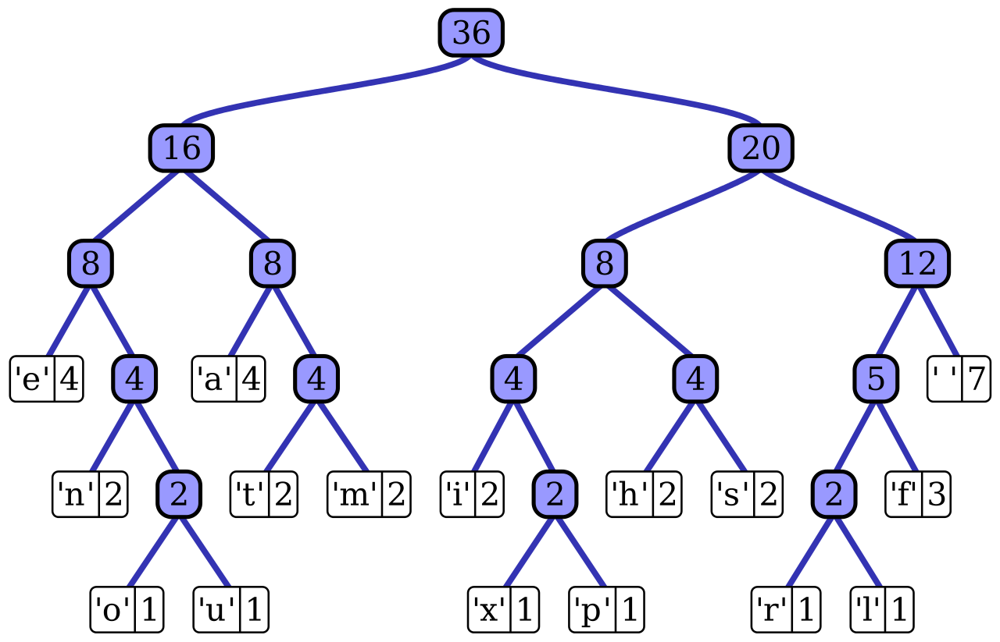

# MATD

- [1. Exact Pattern Matching](#1-exact-pattern-matching)
  - [1.1. Brute Force](#11-brute-force)
  - [1.2. Vyhledávání pomocí konečného deterministického automatu](#12-vyhledávání-pomocí-konečného-deterministického-automatu)
  - [1.3. Knuth-Morris-Pratt (KMP) Algorithm](#13-knuth-morris-pratt-kmp-algorithm)
  - [1.4. Boyer-Moore-Horspool Algorithm](#14-boyer-moore-horspool-algorithm)
  - [1.5. Aho-Corasick (AC) Algorithm](#15-aho-corasick-ac-algorithm)
- [2. Přibližné vyhledávání řetezců (Exact Pattern Matching)](#2-přibližné-vyhledávání-řetezců-exact-pattern-matching)
  - [2.1. NDFA](#21-ndfa)
- [3. Vector Model](#3-vector-model)
- [4. Kódování](#4-kódování)
  - [4.1. Elias Gamma Coding](#41-elias-gamma-coding)
  - [4.2. Huffman coding](#42-huffman-coding)
  - [4.3. Aritmetické kódování](#43-aritmetické-kódování)
  - [4.4. Run-length Encoding (RLE)](#44-run-length-encoding-rle)
  - [4.5. Burrows–Wheeler transform (BWT)](#45-burrowswheeler-transform-bwt)
- [5. Latentní sémantická analýza](#5-latentní-sémantická-analýza)

## 1. Exact Pattern Matching

### 1.1. Brute Force

- $\mathcal{O}(m\cdot n)$
- Posun v textu o jednu pozici.

### 1.2. Vyhledávání pomocí konečného deterministického automatu

>Deterministický konečný automat (DKA/DFA) je pětice $(Q, \Sigma, \delta, q_0, F)$, kde
>
>- $Q$ je neprázdná konečná množina stavů,
>- $\Sigma$ je abeceda (neprázdná konečná množina symbolů),
>- $\delta : Q \times \Sigma \rightarrow Q$ je přechodová funkce,
>- $q_0 \in Q$ je počáteční stav,
>- $F \subseteq Q$ je množina přijímajících stavů.
>
>DFA má pouze konečnou paměť. Např. není schopný vyřešit **parity problem** (kontrola uzavřených závorek).
>
>Derivace regulárního výrazu:
>

Příklad `P="abab"`:

- prefixy: $Q=\{\varepsilon, a, ab, aba, abab\}$
- indexy prefixů: $I=\{0,1,2,3,4\}$

| $Q$           | $I$ | $a$ | $b$ | $\Sigma\setminus\{a,b\}$ |
|---------------|-----|-----|-----|--------------------------|
| $\varepsilon$ | 0   | 1   | 0   | 0                        |
| $a$           | 1   | 1   | 2   | 0                        |
| $ab$          | 2   | 3   | 0   | 0                        |
| $aba$         | 3   | 1   | 4   | 0                        |
| $abab$        | 4   | 3   | 0   | 0                        |

- Sloupce $a$, $b$, $\Sigma\setminus\{a,b\}$ jsou vstupy automatu.

### 1.3. Knuth-Morris-Pratt (KMP) Algorithm

- [KMP | Wiki](https://en.wikipedia.org/wiki/Knuth%E2%80%93Morris%E2%80%93Pratt_algorithm)
- $\mathcal{O}(m+n)$
- Předzpracování vzorku - vytvoření tabulky pro posuny v textu.

### 1.4. Boyer-Moore-Horspool Algorithm

- $\mathcal{O}(m*n)$, ale $\Theta(m+n/m)$
- Předzpracování vzorku - vytvoření tabulky pro posuny v textu. Využívá znaky, které nejsou ve vzorku pro delší skoky. Shoda se kontroluje od konce.
- Např. $T=ab\underline{c}def$, $P=aa\underline{b}$
- Definuju si tabulku pro ASCII znaky, jejich pozici ve vzorku a odpovídající posuny.
- [Handbook of Exact String Matching](.lectures/Handbook_of_Exact_String_Matching_Algorithms.pdf) (str. 119)

1. Předzpracování bez posledního znaku $P$
   - `shift = |p| - i - 1`
2. Vyhledávání od konce $P$

### 1.5. Aho-Corasick (AC) Algorithm

- Efektivní vyhledávání více slov pomocí DFA.
- **Dictionary-matching** algorithm that locates elements of a finite set of strings (the "dictionary") within an input text.
- It matches all strings *simultaneously*.


## 2. Přibližné vyhledávání řetezců (Exact Pattern Matching)

**Hamming**ova vzdálenost - počet pozic, kde se řetězce liší.

**Levenshtein**ova (editační) vzdálenost - nejmenší počet operací vkládání, mazání a substituce.

### 2.1. NDFA


$T=\text{survey}$

0. `<iterace>: [vstup] -> (<stav>, <pozice v patternu>)`
1. $t_0\colon (1,i)$
2. $t_1\colon s\rightarrow[(2,i+1), (9,i), (8,i)]$

## 3. Vector Model

| TF | Doc1 | Doc2 | ... | DocN |
|--|--|--|--|--|
| term1 | 10 | 0 | ... |  3 |
| term2 | 15 | 0 | ... |  0 |
| term3 | 0 | 8 | ... |  7 |

$$\boxed{\mathrm{idf}(\mathrm{term}) = \log\dfrac{N}{\mathrm{df}(\mathrm{term})},}$$

kde $N$ je počet dokumentů v kolekci a $\mathrm{df}_{\mathrm{term}}$ je počet dokumentů obsahujících $\mathrm{term}$.

Pro dotaz $q$: $\mathrm{Score}(q,d)=\sum\limits_{t\in q} \mathrm{TF}_{d,t} \cdot \mathrm{idf}(t)$

## 4. Kódování

### 4.1. Elias Gamma Coding

- Každé kladné celé číslo ve dvojkové soustavě začíná jedničkou.

Unární čísla:

$$
\begin{align*}
  u(1) &= 1\\
  u(2) &= 01\\
  u(3) &= 001\\
  &\vdots
\end{align*}
$$

Př. $4 \Rightarrow b(4) =100 \Rightarrow \lvert b(4) \rvert = 3 \Rightarrow u( \lvert b(4) \rvert -1)\Rightarrow \gamma(4)=00100$ (první tři bity jsou $u(3)$, další dva jsou $b(4)$ bez *leading* bitu)

### 4.2. Huffman coding

- [Huffman coding](https://en.wikipedia.org/wiki/Huffman_coding)



### 4.3. Aritmetické kódování


Encoding the message `"WIKI"` with arithmetic coding

1. The letter frequencies are found.
2. The interval $[0, 1)$ is partitioned in the ratio of the frequencies.
3. The corresponding interval is iteratively:
      1. partitioned for each letter in the message.
      2. Any value in the final interval is chosen to represent the message.

2*–6*: The partitioning and value if the message were `"KIWI"` instead.

### 4.4. Run-length Encoding (RLE)

- [RLE](https://en.wikipedia.org/wiki/Run-length_encoding)

Consider a screen containing plain black text on a solid white background. There will be many long runs of white pixels in the blank space, and many short runs of black pixels within the text. A hypothetical scan line, with `B` representing a black pixel and `W` representing white, might read as follows:

```text
WWWWWWWWWWWWBWWWWWWWWWWWWBBBWWWWWWWWWWWWWWWWWWWWWWWWBWWWWWWWWWWWWWW
```

With a run-length encoding (RLE) data compression algorithm applied to the above hypothetical scan line, it can be rendered as follows:

```text
12W1B12W3B24W1B14W
```

### 4.5. Burrows–Wheeler transform (BWT)

- Přeuspořádává řetězce znaků do sekvencí podobných symbolů (změna uspořádání).
- Používá se např. v kombinaci s **move-to-front (MTF) transform** a **run-length encoding (RLE)**.
- Použití `bzip2`.

## 5. Latentní sémantická analýza

TF Matice $A$:

| TF | $D_1$ | $D_2$ | ... | $D_N$ |
|--|--|--|--|--|
| $w_1$ | 10 | 0 | ... |  3 |
| $w_2$ | 15 | 0 | ... |  0 |
| $w_3$ | 0 | 8 | ... |  7 |

SVD rozklad $A=U\Sigma V^T$

| $U$ | $b_1$ | $b_2$ | ... | $b_N$ |
|--|--|--|--|--|
| $w_1$ |  |  |  |  |
| $w_2$ |  |  |  |  |
| $w_3$ |  |  |  |  |

| $\Sigma$ |  |  |  |
|--|--|--|--|
|  | $\sigma_1$ |  |  |
|  |  | $\ddots$ |  |
|  |  |  | $\sigma_N$  |

$\sigma_1 > \sigma_2 > \cdots > \sigma_N$

| $V^T$ | $b_1$ | $b_2$ | ... | $b_N$ |
|--|--|--|--|--|
| $D_1$ |  |  |  |  |
| $D_2$ |  |  |  |  |
| $D_3$ |  |  |  |  |

Singulární čísla matice $\Sigma$ udávají, jak důležitý je daný bázový vektor $b$ - **koncept** (latentní dimenze).

Pokud uvažujeme TF matici $A$, kde *řádky jsou věty* a *sloupce jsou slova*, tak `argmax(U[:,0])` je index nejvýznamější věty a `argmax(V_T[:,0])` je index nejvýznamějšího slova.
