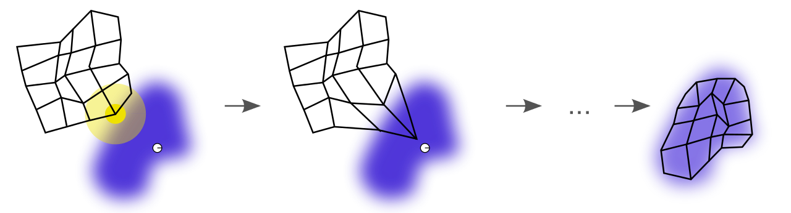
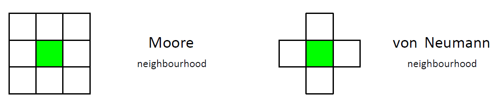
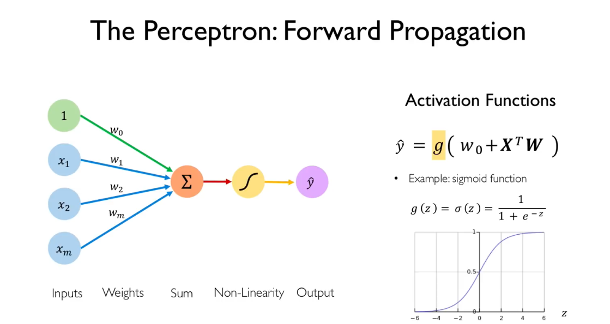
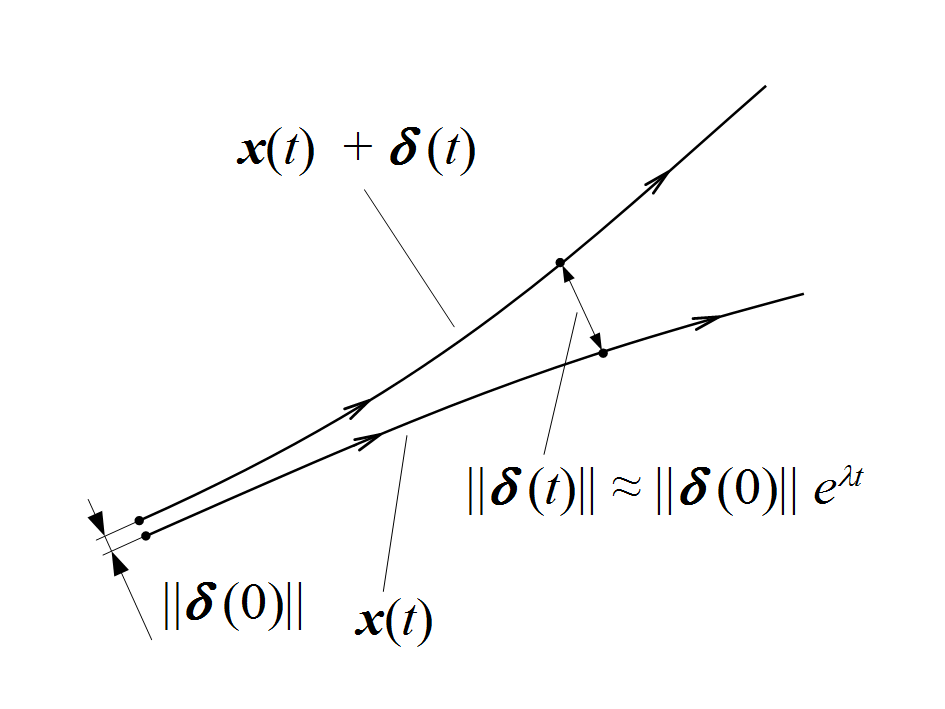
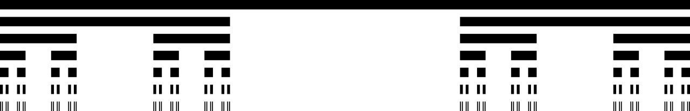

# NAVY

- [1. Hopfield Network (HN)](#1-hopfield-network-hn)
  - [1.1. Hebian Learning - How does a HN Learn?](#11-hebian-learning---how-does-a-hn-learn)
  - [1.2. Energy](#12-energy)
- [2. Fractals](#2-fractals)
  - [2.1. Iterated Function System (IFS)](#21-iterated-function-system-ifs)
    - [2.1.1. Lindenmayer systems (L-Systems)](#211-lindenmayer-systems-l-systems)
  - [2.2. Time Escape Algorithm (TEA)](#22-time-escape-algorithm-tea)
    - [2.2.1. Mandelbrot Set](#221-mandelbrot-set)
    - [2.2.2. Julia Set](#222-julia-set)
- [3. Deterministic Chaos](#3-deterministic-chaos)
  - [3.1. Examples](#31-examples)
- [4. Self-Organizing Map (SOM)](#4-self-organizing-map-som)
- [5. Cellular Automata](#5-cellular-automata)
- [6. Summary and Questions](#6-summary-and-questions)
  - [6.1. What are typical properties of chaos?](#61-what-are-typical-properties-of-chaos)
  - [6.2. What is the role of the **bias** in neural networks?](#62-what-is-the-role-of-the-bias-in-neural-networks)
  - [6.3. Describe a perceptron](#63-describe-a-perceptron)
  - [6.4. Every neuron (unit) has an activations function. What is the input of this function?](#64-every-neuron-unit-has-an-activations-function-what-is-the-input-of-this-function)
  - [6.5. What is the purpose of learning rate in ANN and why is it usually set to a small value (such as 0.01)?](#65-what-is-the-purpose-of-learning-rate-in-ann-and-why-is-it-usually-set-to-a-small-value-such-as-001)
  - [6.6. What is "deterministic chaos"?](#66-what-is-deterministic-chaos)
  - [6.7. What is Lyapunov exponent?](#67-what-is-lyapunov-exponent)
  - [6.8. How do you determine the color of a point in Mandelbrot set?](#68-how-do-you-determine-the-color-of-a-point-in-mandelbrot-set)
  - [6.9. Explain fractal dimension on Cantor set](#69-explain-fractal-dimension-on-cantor-set)

## 1. Hopfield Network (HN)

- [Main Source | TDS](https://towardsdatascience.com/hopfield-networks-neural-memory-machines-4c94be821073)
- Example of an **associative** Recurrent Neural Network (RNN).

Associative memory is a system in which a memory recall is initiated by the **associability of an input pattern to a memorized one**. Associative memory allows for the retrieval and completion of a memory using only an incomplete or noisy portion of it.

Single layer, fully connected. Connections between neurons in a HN are **symmetric** $(w_{i,j}=w_{j,i})$. Therefore, all weights can be stored in a $N\times N$ square symmetric matrix (with zeros on diagonal - no loops), where $N$ is the number of neurons in HN.

A neuron is updated depending on **linear combinations** of its input:

$$
y_i=\sum\limits_{j}y_jw_{i,j}
$$

HN uses binary-threshold output function *(state)*:

$$
s(x) =
\begin{cases}
    1 & \text{if } x \geq 0 \\
    -1 & \text{otherwise}
\end{cases}
$$

The neurons in a (standard) HN represent binary information. Each neuron is in state -1 (off) or 1 (on). Any information which can be stored as a string of binary values can be memorized and recalled by a HN.

HN can store [$\approx 0.14N$ patterns](https://www.frontiersin.org/articles/10.3389/fncom.2016.00144/full) or $m = \dfrac{n}{2\log(n)}$. If multiple patterns are stored, the network converges to the pattern that is most similar to the initial state of the network.

### 1.1. Hebian Learning - How does a HN Learn?

> Neurons which fire together, wire together.
>
> If two neurons that are connected by a synapse are active at the same time, the strength of their connection increases (the weight in the HN increases) and vice versa.

For one pattern:

$$
w_{i,j} = s_is_j
$$

For $M$ simultaneously-stored patterns:

$$
w_{i,j} = \dfrac{1}{n}\sum\limits_{p=1}^{M}s_i^{(p)}s_j^{(p)}=\dfrac{1}{n}YY^T,
$$

where $Y$ is a matrix of patterns stored as row vectors.

Hebian learning is *one-shot*, i.e., there is only one pass through the network (no backpropagation).

### 1.2. Energy

HN can be considered a stable attractor. At any input state, the network converges to a final stable state.


$$
E = -\dfrac{1}{2}\sum\limits_{i,j=1}^{N}w_{i,j}s_is_j = -\dfrac{1}{2}y^Twy
$$

## 2. Fractals

Two basic algorithms:

- **IFS - Iterated Function System**
- **TEA - Time Escape Algorithm**

Application of fractal geometry:

- Games - terrain generation
- Encryption
- Compression - space filling curves
- Telecommunication technologies - fractal antenna (Sierpinky carpet)

### 2.1. Iterated Function System (IFS)

IFS is based on affine transformations (do not change object properties, just the projection)

- Scale (shrink, enlarge) - $a,b,c,d$
- Translation - $e,f$
- Rotation - $\varphi, \theta$

$$
\begin{align*}
  w(\mathbf{x})&=w
  \begin{pmatrix}
    x_1\\
    x_2
  \end{pmatrix}=
  \begin{pmatrix}
    r_1\cos\varphi & -r_2\sin\theta\\
    r_1\sin\varphi & r_2\cos\theta
  \end{pmatrix}\cdot
  \begin{pmatrix}
    x_1\\
    x_2
  \end{pmatrix}+
  \begin{pmatrix}
    e\\
    f
  \end{pmatrix}\\
  w(\mathbf{x})&=w
  \begin{pmatrix}
    x_1\\
    x_2
  \end{pmatrix}=
  \begin{pmatrix}
    a & b\\
    c & d
  \end{pmatrix}\cdot
  \begin{pmatrix}
    x_1\\
    x_2
  \end{pmatrix}+
  \begin{pmatrix}
    e\\
    f
  \end{pmatrix}
\end{align*}
$$

#### 2.1.1. Lindenmayer systems (L-Systems)

Rule based fractals.

1. Axiom
  $$A\colon F+F$$
2. Rule
  $$R\colon F \rightarrow F+F-F$$

- Koch snowflake
- Sierpinsky triangle
- Bansley fern

### 2.2. Time Escape Algorithm (TEA)

#### 2.2.1. Mandelbrot Set

Quadratic recurrence equation, $z\in \mathbb{C},c \in \mathbb{C}$:

$$
\begin{align*}
  z_0 &= 0\\
  z_{n+1} &= z_n^2 + c
\end{align*}
$$

#### 2.2.2. Julia Set

## 3. Deterministic Chaos

Deterministic chaos refers to a phenomenon where a system exhibits seemingly random behavior despite being governed by deterministic laws or equations.

Properties of deterministic chaos:

- **Sensitivity to initial conditions.**
- **Divergence of nearby trajectories.**

### 3.1. Examples

- Lorenz attractor.
- Double-rod pendulum.
- Logistic map, bifurcation diagram.
  $$y_{n+1} = y_n\cdot a\cdot(1-y_n)$$
- Self similarity, fractal geometry.
- Cellular Automata: forest fire, game of life.

## 4. Self-Organizing Map (SOM)

- *Teuvo Kohonen* - sometimes called Kohonen map or Kohonen network instead of **SOM**.
- **Unsupervised** ML algorithm.
- Type of **ANN** trained using **competetive learning** (rather than error-correction learning using backpropaggation).



An illustration of the training of a self-organizing map. The blue blob is the distribution of the training data, and the small white disc is the current training sample. At first (left) the SOM nodes are arbitrarily positioned in the data space. The node (highlighted in yellow) which is nearest to the training sample is selected. It is moved towards the training sample, as (to a lesser extent) are its neighbors on the grid. After many iterations the grid tends to approximate the data distribution (right).


Kohonen defined two basic mechanisms which characterize the **spatial network self-organization**:

1. Find the output neuron *(winning)* that best matches the input pattern *(training sample)*. This is done by *minimizing distance* (or maximizing similarity).
2. Modify winner's weights and its surrounding *(the winning vicinity)*.

Initialization: weights are set to small random numbers (or sampled from the 1st principal component)

## 5. Cellular Automata

- 2D **grid** of cells (can be generalized to 3D).
- Each cell has a **neighborhood**.
- At given time $t$, each cell is in one of defined **state**s.
- We can define a **transition rule**, which maps state of a cell to a different state.



## 6. Summary and Questions

### 6.1. What are typical properties of chaos?
  
- Sensitivity to initial conditions.
- Divergence of nearby trajectories.

### 6.2. What is the role of the **bias** in neural networks?
  
- A bias value allows you to **shift the activation function to the left or right**.

### 6.3. Describe a perceptron



### 6.4. Every neuron (unit) has an activations function. What is the input of this function?

Scalar (dot) product of inputs and weights plus bias.

### 6.5. What is the purpose of learning rate in ANN and why is it usually set to a small value (such as 0.01)?

Learning rate is a hyperparameter that determines the **step size** at which the model parameters (weights and biases) are updated during the training process using optimization algorithms like gradient descent.

Why a small value? Trade-off between the **rate of convergence** and **overshooting minima**.

- Stability - prevent oscillations.
- Precision - prevention of skipping/overshooting minima.

(Too small LR can lead to slow convergence.)

### 6.6. What is "deterministic chaos"?

An oxymoron 😀.

Deterministic chaos refers to a phenomenon where a system exhibits seemingly random behavior despite being governed by deterministic laws or equations.

Deterministic nature of chaotic systems does **not** make them **predictable**.

### 6.7. What is Lyapunov exponent?

Lyapunov exponent of a dynamical system is a quantity that characterizes the **rate of separation of infinitesimally close trajectories**.

Trajectories with initial separation $\lVert\delta(0)\rVert$ diverge exponentially in time $t$, with Lyapunov exponent $\lambda$.



### 6.8. How do you determine the color of a point in Mandelbrot set?

```python
def mandelbrot(c: complex, max_iter=1000):
    """Computes the number of iterations to escape the Mandelbrot set.

    Parameters
    ----------
    c : complex
        The complex number to test.
    max_iter : int, default=1000
        The maximum number of iterations.

    Returns
    -------
    int
        The number of iterations before escaping. The number of iterations
        then corresponds to the color of the pixel.
    """
    z = 0
    n = 0
    while abs(z) <= 2 and n < max_iter:
        z = z * z + c
        n += 1
    return n
```

### 6.9. Explain fractal dimension on Cantor set

Fractal dimension measures **complexity** of a pattern and it is also a measure of **space-filling capacity** of a pattern.

Cantor ternary set is built by removing the middle third of a line segment and then repeating the process with the remaining shorter segments.



$$
\text{Hausdorff dimension $d_f$}=\dfrac{\ln2}{\ln3}\approx0.631
$$
