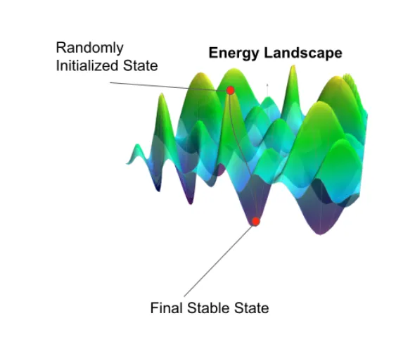

# NAVY

- [1. Hopfield Network (HN)](#1-hopfield-network-hn)
  - [1.1. Hebian Learning - How does a HN Learn?](#11-hebian-learning---how-does-a-hn-learn)
  - [1.2. Energy](#12-energy)

## 1. Hopfield Network (HN)

- [Main Source | TDS](https://towardsdatascience.com/hopfield-networks-neural-memory-machines-4c94be821073)
- Example of an **associative** Recurrent Neural Network (RNN).

Associative memory is a system in which a memory recall is initiated by the **associability of an input pattern to a memorized one**. Associative memory allows for the retrieval and completion of a memory using only an incomplete or noisy portion of it.

Single layer, fully connected. Connections between neurons in a HN are **symmetric** $(w_{i,j}=w_{j,i})$. Therefore, all weights can be stored in a $N\times N$ square symmetric matrix (with zeros on diagonal - no loops), where $N$ is the number of neurons in HN.

A neuron is updated depending on **linear combinations** of its input:

$$
y_i=\sum\limits_{j}y_jw_{i,j}
$$

HN uses binary-threshold output function *(state)*:

$$
s(x) =
\begin{cases}
    1 & \text{if } x \geq 0 \\
    -1 & \text{otherwise}
\end{cases}
$$

The neurons in a (standard) HN represent binary information. Each neuron is in state -1 (off) or 1 (on). Any information which can be stored as a string of binary values can be memorized and recalled by a HN.

HN can store [$\approx 0.14N$ patterns](https://www.frontiersin.org/articles/10.3389/fncom.2016.00144/full) or $m = \dfrac{n}{2\log(n)}$. If multiple patterns are stored, the network converges to the pattern that is most similar to the initial state of the network.

### 1.1. Hebian Learning - How does a HN Learn?

> Neurons which fire together, wire together.
>
> If two neurons that are connected by a synapse are active at the same time, the strength of their connection increases (the weight in the HN increases) and vice versa.

For one pattern:

$$
w_{i,j} = s_is_j
$$

For $M$ simultaneously-stored patterns:

$$
w_{i,j} = \dfrac{1}{n}\sum\limits_{p=1}^{M}s_i^{(p)}s_j^{(p)}=\dfrac{1}{n}YY^T,
$$

where $Y$ is a matrix of patterns stored as row vectors.

Hebian learning is *one-shot*, i.e., there is only one pass through the network (no backpropagation).

### 1.2. Energy

HN can be considered a stable attractor. At any input state, the network converges to a final stable state.

$$
E = -\dfrac{1}{2}\sum\limits_{i,j=1}^{N}w_{i,j}s_is_j = -\dfrac{1}{2}y^Twy
$$
