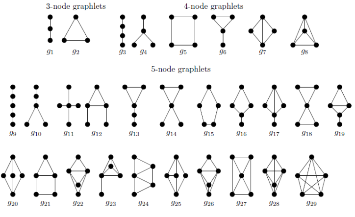

# Network Science

- [1. Základní pojmy](#1-základní-pojmy)
  - [1.1. Literatura](#11-literatura)
  - [1.2. Vizualizace](#12-vizualizace)
  - [1.3. Graf vs. síť](#13-graf-vs-síť)
  - [1.4. Vlastnosti sítí reálného světa](#14-vlastnosti-sítí-reálného-světa)
  - [1.5. Typy sítí](#15-typy-sítí)
  - [1.6. Teorie grafů](#16-teorie-grafů)
  - [1.7. Datové struktury](#17-datové-struktury)
  - [1.8. Paretovo pravidlo 80/20](#18-paretovo-pravidlo-8020)
  - [1.9. Metrika](#19-metrika)
- [2. Explorativní datová analýza (EDA)](#2-explorativní-datová-analýza-eda)
  - [2.1. Preprocessing (předzpracování)](#21-preprocessing-předzpracování)
  - [2.2. Hustota](#22-hustota)
  - [2.3. Souvislost](#23-souvislost)
  - [2.4. Stupně](#24-stupně)
  - [2.5. Vzdálenosti](#25-vzdálenosti)
    - [2.5.1. Floydův–Warshallův algoritmus](#251-floydůvwarshallův-algoritmus)
    - [2.5.2. Dijkstrův algoritmus](#252-dijkstrův-algoritmus)
    - [2.5.3. Vlastnosti sítí vzhledem k cestám](#253-vlastnosti-sítí-vzhledem-k-cestám)
  - [2.6. Existence shluků](#26-existence-shluků)
  - [2.7. Reciprocity](#27-reciprocity)
  - [2.8. Centrality](#28-centrality)
    - [2.8.1. Centrality založené na stupních vrcholů](#281-centrality-založené-na-stupních-vrcholů)
    - [2.8.2. Centrality založené na cestách mezi vrcholy](#282-centrality-založené-na-cestách-mezi-vrcholy)
  - [2.9. Podobnosti](#29-podobnosti)
    - [2.9.1. Počet společných sousedů](#291-počet-společných-sousedů)
    - [2.9.2. Cosinová podobnost](#292-cosinová-podobnost)
- [3. Komunity](#3-komunity)
  - [3.1. Otázky](#31-otázky)
  - [3.2. Neformální definice komunity](#32-neformální-definice-komunity)
  - [3.3. Řídkost, souvislost](#33-řídkost-souvislost)
  - [3.4. Přístup zdola nahoru](#34-přístup-zdola-nahoru)
  - [3.5. Přístup shora dolů](#35-přístup-shora-dolů)
  - [3.6. Detekce komunit pomocí hierarchického shlukování](#36-detekce-komunit-pomocí-hierarchického-shlukování)
  - [3.7. K-souvislá komponenta](#37-k-souvislá-komponenta)
  - [3.8. Kliky](#38-kliky)
    - [3.8.1. Clique Percolation Method (CPM)](#381-clique-percolation-method-cpm)
    - [3.8.2. K-core](#382-k-core)
    - [3.8.3. Výpočetní složitost](#383-výpočetní-složitost)
  - [3.9. Hledání komunit dělením grafu](#39-hledání-komunit-dělením-grafu)
    - [3.9.1. Řezy](#391-řezy)
    - [3.9.2. Kernighan-Lin](#392-kernighan-lin)
  - [3.10. Betweenness Clustering - Girvan \& Newman](#310-betweenness-clustering---girvan--newman)
  - [3.11. Modularita](#311-modularita)
  - [3.12. Algoritmus Louvain](#312-algoritmus-louvain)
  - [3.13. Walktrap - Náhodná procházka (Random Walk)](#313-walktrap---náhodná-procházka-random-walk)
  - [3.14. Lokální metody](#314-lokální-metody)
  - [3.15. Ego sítě](#315-ego-sítě)
- [4. Konstrukce sítí](#4-konstrukce-sítí)
  - [4.1. Dva základní přístupy](#41-dva-základní-přístupy)
  - [4.2. k-NN - k nejbližších sousedů](#42-k-nn---k-nejbližších-sousedů)
  - [4.3. Epsilon-radius](#43-epsilon-radius)
  - [4.4. Kombinovaná metoda epsilon-radius a k-NN](#44-kombinovaná-metoda-epsilon-radius-a-k-nn)
  - [4.5. Metoda b-matching](#45-metoda-b-matching)
  - [4.6. Nearest Neighbor Networks (NNN)](#46-nearest-neighbor-networks-nnn)
- [5. Modely sítí](#5-modely-sítí)
  - [5.1. Pravidelné grafy (mřížky)](#51-pravidelné-grafy-mřížky)
  - [5.2. Náhodné grafy](#52-náhodné-grafy)
  - [5.3. Model malého světa (SW - Small World)](#53-model-malého-světa-sw---small-world)
    - [5.3.1. Watts-Strogatz](#531-watts-strogatz)
    - [5.3.2. Watts-Newman](#532-watts-newman)
  - [5.4. Barabási–Albert (BA model)](#54-barabásialbert-ba-model)
    - [5.4.1. Mocninný zákon](#541-mocninný-zákon)
    - [5.4.2. Vlastnosti Scale-Free (SF) sítí](#542-vlastnosti-scale-free-sf-sítí)
- [6. Vzorkování (Sampling)](#6-vzorkování-sampling)
  - [6.1. Pravděpodobnostní metody](#61-pravděpodobnostní-metody)
    - [6.1.1. Random Node Sampling (RN)](#611-random-node-sampling-rn)
    - [6.1.2. Random Degree Node Sampling (RN)](#612-random-degree-node-sampling-rn)
    - [6.1.3. Random Edge Sampling](#613-random-edge-sampling)
    - [6.1.4. Random Node-Edge Sampling](#614-random-node-edge-sampling)
  - [6.2. Prohledávání grafu](#62-prohledávání-grafu)
    - [6.2.1. Breadth-First Search (BFS)](#621-breadth-first-search-bfs)
    - [6.2.2. Depth-First Search (DFS)](#622-depth-first-search-dfs)
    - [6.2.3. Snowball Sampling (SBS)](#623-snowball-sampling-sbs)
    - [6.2.4. Random Walk Sampling (RWS)](#624-random-walk-sampling-rws)
    - [6.2.5. Forest Fire Sampling (FFS)](#625-forest-fire-sampling-ffs)
    - [6.2.6. Metropolis-Hastings Random Walk Sampling](#626-metropolis-hastings-random-walk-sampling)
- [7. Význam stupně vrcholu](#7-význam-stupně-vrcholu)
  - [7.1. Spojité atributy](#71-spojité-atributy)
- [8. Robustnost sítí (Network Resillience)](#8-robustnost-sítí-network-resillience)
  - [8.1. Motivace](#81-motivace)
  - [8.2. Perkolace](#82-perkolace)
    - [8.2.1. Perkolace ve scale-free sítích](#821-perkolace-ve-scale-free-sítích)
- [9. Dynamické sítě](#9-dynamické-sítě)
  - [9.1. Vyvíjející se sítě](#91-vyvíjející-se-sítě)
  - [9.2. Temporální sítě](#92-temporální-sítě)
    - [9.2.1. Spoluautorská síť (informatika)](#921-spoluautorská-síť-informatika)
- [10. Predikce linků](#10-predikce-linků)
  - [10.1. Využití](#101-využití)
  - [10.2. Co je Machine Learning?](#102-co-je-machine-learning)
  - [10.3. Metody predikce linků](#103-metody-predikce-linků)
  - [10.4. Similarity-based](#104-similarity-based)
    - [10.4.1. Common Neighbors (CN)](#1041-common-neighbors-cn)
    - [10.4.2. Jaccard Coefficient (JC)](#1042-jaccard-coefficient-jc)
    - [10.4.3. Adamic-Adar Index (AA)](#1043-adamic-adar-index-aa)
    - [10.4.4. Preferential Attachment (PA)](#1044-preferential-attachment-pa)
    - [10.4.5. Resource Allocation Index (RA)](#1045-resource-allocation-index-ra)
    - [10.4.6. Cosine similarity or Salton Index](#1046-cosine-similarity-or-salton-index)
    - [10.4.7. Sorensen Index](#1047-sorensen-index)
  - [10.5. Vyhodnocení predikce linků](#105-vyhodnocení-predikce-linků)
- [11. Vícevrstvé sítě](#11-vícevrstvé-sítě)
  - [11.1. Occupation centrality](#111-occupation-centrality)
  - [11.2. Degree Centrality](#112-degree-centrality)
  - [11.3. Degree deviation](#113-degree-deviation)
  - [11.4. Neighborhood](#114-neighborhood)
  - [11.5. Neighborhood Centrality](#115-neighborhood-centrality)
  - [11.6. Connective Redundancy](#116-connective-redundancy)
  - [11.7. Exclusive Neighborhood](#117-exclusive-neighborhood)
  - [11.8. Random Walk](#118-random-walk)
  - [11.9. Vzdálenosti ve vícevrstvých sítích](#119-vzdálenosti-ve-vícevrstvých-sítích)
  - [11.10. Random walk closeness](#1110-random-walk-closeness)
  - [11.11. Random walk betweenness](#1111-random-walk-betweenness)
  - [11.12. Relevance aktéra ve vrstvě](#1112-relevance-aktéra-ve-vrstvě)
  - [11.13. Flattening \& Projection](#1113-flattening--projection)
  - [11.14. Nevážený flattening](#1114-nevážený-flattening)
  - [11.15. Vážený flattening](#1115-vážený-flattening)
  - [11.16. Projekce](#1116-projekce)
- [12. Miscellaneous](#12-miscellaneous)

## 1. Základní pojmy

- Network Science je věda o *komplexních systémech reprezentovaných sítěmi*.
- Komplexní síť - často složitá a dynamická (vyvíjející se v čase) struktura. Např. sociální sítě, internet, dopravní sítě, klimatologie...
  - mnoho sítí má tzv. strukturu jádro-periferie
- Úkolem je hledání efektivních nástrojů pro práci s rozsáhlými sítěmi.

### 1.1. Literatura

- [vsb.ochodkova](https://www.cs.vsb.cz/ochodkova/)
- [kniha](http://networksciencebook.com/)

### 1.2. Vizualizace

- [Gephi](https://gephi.org/)
- [NetworkX](https://networkx.org/)

### 1.3. Graf vs. síť

- **graf** - pokud mezi uzly neexistuje vazba (hrana), pak neexistuje žádné
propojení (matematika)
- **síť** - pokud mezi uzly není vazba, pak si vazbou nejsme jisti (reálný svět)
- graf je znázorněním sítě

### 1.4. Vlastnosti sítí reálného světa

- **malý svět** - průměrná délka nejkratší cesty mezi uzly je $\log n$ nebo menší
- **bezškálovost** - rozdělení (distribuce) stupňů uzlů podle *mocninného zákona*
- **komunitní struktura**

### 1.5. Typy sítí

- sociální (např. *spolupráce herců, vědců* - lidi vrcholy, spolupráce hrana)
- informační (např. *citace* - orientovaný graf, *internet* - taky orientovaný graf, síť zasílání e-mailů)
- biologické (např. interakce proteinů, komunity delfínů)
- technologické (např. telefonní síť)
- transportní (např. silniční, železniční, energetické)
- klimatické
- sémantické (pracují nad jazykovým korpusem)

### 1.6. Teorie grafů

- **Jednoduchý graf** je graf bez smyček a multihran
- **Bipartitní graf** - dvě množiny vrcholů s prázdným průnikem, hrany pouze mezi těmito dvěmi partitami, ne v rámci jedné partity (např. síť herců a filmů)
- **Regulární/Pravidelný graf** - každý vrchol má stejný stupeň (pro skutečná data nereálné)
- **Sled** - posloupnost vrcholů a hran
- **Tah** - můžou se opakovat vrcholy, ale ne hrany
- **Cesta** - posloupnost vrcholů a hran, kde se neopakují vrcholy ani hrany (délka nejkratší cesty je vzdálenost)
- **Souvislý graf** - existuje cesta mezi všemi dvojice vrcholů tohoto grafu
- **Komponenty souvislosti** - maximální souvislý graf
- **Podgraf** $G=(V,E)$ je $G'=(V',E')$ s. t. $V'\subset V \wedge E'\subset E$
- Pokud v $G$ existuje cesta z $u$ do $v$, tak je vrchol $v$ **dostupný** z $u$
- Pokud je $G$ kladně ohodnocený, tak platí $\triangle$ nerovnost
- **Klika** je úplný graf
- **Diáda** je $K_2$

### 1.7. Datové struktury

- matice sousednosti $\mathbb{A}$
  - operace zjištění sousednosti $\mathcal{O}(1)$
- matice incidence $n\times m$ (počet vrcholů krát počet hran)
  - nevhodné pro smyčky
  - řídká matice
  - pro neorientovaný graf hodnoty 0/1, pro orientovaný graf 1/-1/0 (nebo váhy ohodnocených hran):
  $$\mathbb{B}_{i,j}=\begin{cases}1 & \text{$v_i$ inciduje s $e_j$}\\0 &\text{jinak}\end{cases}$$
  $$\mathbb{B}_{i,j}=\begin{cases}
      1 & \text{$v_i$ inciduje s výstupní hranou $e_j$}\\
      -1 & \text{$v_i$ inciduje se vstupní hranou $e_j$}\\
      0 &\text{jinak}\end{cases}$$
- seznam vrcholů a sousedů
  - pro setříděné sousedy: operace zjištění sousednosti $\mathcal{O}(\log_2\Delta)$, kde $\Delta$ je největší stupeň grafu
  - pro nesetříděné sousedy: operace zjištění sousednosti $\mathcal{O}(\Delta)$, kde $\Delta$ je největší stupeň grafu
- seznam hran (relací) ve tvaru $[(1,2),(2,3),...]$

Časovou a paměťovou složitost ovlivňuje především hustota grafu.

### 1.8. Paretovo pravidlo 80/20

- 80 % majetku vlastní 20 % lidí
- 80 % vrcholů má malý stupeň, 20 % jsou centra atd.

### 1.9. Metrika

Metrický prostor je dvojice $(\mathcal{M}, \rho)$, kde $\mathcal{M}\neq\emptyset$ a $\rho\colon \mathcal{M} \times \mathcal{M} \rightarrow \mathbb{R}$ je tzv. metrika, která splňuje 3 axiomy $(\forall x,y,z \in \mathcal{M})$:

1. $\rho(x,y) = 0 \iff x=y$ ...totožnost
2. $\rho(x,y)=\rho(y,x)$ ...symetrie
3. $\rho(x,y)+\rho(y,z) \geq \rho(x,z)$ ...trojúhelníková nerovnost

Nezápornost $\rho(x,y) \geq 0$ plyne z předchozích axiomů.

## 2. Explorativní datová analýza (EDA)

Co je standardní EDA? Základní statistická analýza (distribuce, korelace), chybějící hodnoty, duplikáty,...

Zajímají nás především **základní strukturální vlastnosti**:

- **lokální**
- **globální**

### 2.1. Preprocessing (předzpracování)

- orientovavá / neorientovaná síť (zanedbání orientace hran ano/ne)
- odstranění smyček ano/ne (obvykle se odstraňují)
- nahrazení multihran ohodnocenou hranou nebo jen jednoduchou hranou
- odstranění izolovaných vrcholů (stupeň nula), popř. malých souvislých komponent (závisí na velikosti sítě)

### 2.2. Hustota

- Řídký graf - řádově tolik hran, kolik je vrcholů $m=\mathcal{O}(n)$.
- Hustý graf - více hran než vrcholů $m=\mathcal{O}(n^2)$.
- Pro husté grafy mohou být některé algoritmy neefektivní.
- průměrný stupeň neorientovaného grafu: $\boxed{<d>=\frac{2m}{n}},$
  - po vydělení největším stupněm $(n-1)\rightarrow \frac{2m}{n\cdot(n-1)},$
  - tak definujeme hustotu $\boxed{H = \frac{2m}{n\cdot(n-1)}}.$

### 2.3. Souvislost

- Je síť souvislá? $\Rightarrow$ analýza nebo zanedbání komponent souvislosti
- Sítě jsou zpravidla nesouvislé a v mnoha sítích existuje jedna velká komponenta (*giant component*)
- **Histogram komponent** - počet vrcholů v komponentě na ose $x$ a počet takových komponent na ose $y$
- Orientovaný graf je **silně souvislý** $\iff$ existuje cesta mezi každou dvojicí vrcholů $v_i$ a $v_j$ a zároveň $v_j$ a $v_i$ (tzn. v obou směrech)
- Souvislost se určuje BFS, DFS nebo Floydovým algoritmem - základní technika v předzpracování síťových dat

### 2.4. Stupně

- minimální, maximální a průměrný stupeň, distribuce stupňů (histogram - stupeň vs. počet vrcholů takového stupně)
- lokální stupeň (lokální vlastnost sítě): $\sigma_i=\sum\limits_{j}\mathbb{A}_{i,j}$ (součet přes řádky pro jednotlivé vrcholy)
- průměrný stupeň (globální vlastost sítě): $\sigma_{avg}=\frac{1}{n}\sum\limits_{i=1}^{N}\sigma_i$
  - vyšší průměrný stupeň $\Rightarrow$ hustší graf

### 2.5. Vzdálenosti

- měří se délky cest (počet hran nebo jejich ohodnocení)
- může nás zajímat např. průměrná vzdálenost, maximální vzdálenost (průměr - *diameter*)
- mnoho rozsáhlých sítí má malý průměr (*small-world phenomenon*)

#### 2.5.1. Floydův–Warshallův algoritmus

- [wiki](https://cs.wikipedia.org/wiki/Floyd%C5%AFv%E2%80%93Warshall%C5%AFv_algoritmus)
- $\mathcal{O}(n^3)$
- z matice sousednosti vypočte matici nejkratší cest mezi všemi dvojicemi vrcholů v grafu

#### 2.5.2. Dijkstrův algoritmus

- najde délky nejkratších cesty z jednoho vrcholu do všech ostatních

#### 2.5.3. Vlastnosti sítí vzhledem k cestám

- **lokální excentricita** vrcholu $v_i$ je nejdelší vzdálenost $d$ (délka nejkratší cesty) z $v_i$ do jiného vrcholu grafu, tj. $\text{exc}(v_i)=\max\limits_{j}\set{d(v_i,v_j)}$
- **globální průměr** (diameter) $d(G)= \max\limits_{i,j}\{D_{i,j}\}=\max\limits_{i,j}\{d(v_i,v_j)\}$, kde $D$ je matice vzdáleností (tzn. maximum z matice vzdáleností - maximální vzdálenost z nejkratších vzdáleností mezi všemi vrcholy)
- **globální průměrná vzdálenost**:

$$
\boxed{\mu=\dfrac{1}{\binom{n}{2}}\sum\limits_i\sum\limits_{j>i} d(v_i,v_j)}
$$

### 2.6. Existence shluků

- shluky vrcholů jsou skupiny vrcholů podobných vlastností (např. kosinová podobnost, vzdálenost)
- **shlukovací koeficient** (*clustering coefficient*; lokální a globální)
  - čím vyšší, tím hustší síť
  - měří hustotu $\triangle$ (lokálních shluků) v grafu
  - je maximální pro $K_n \Rightarrow CC(v_i)=1$
  - např. pro středový vrchol $v_i$ u $W_6$ ("kolo") je $\sigma_i=6$ (stupeň $v_i$) a $m_i=6$ (počet hran mezi sousedy), $C_i=0.4$
  - lokální: $\boxed{CC(v_i)=\frac{m_i}{\binom{\sigma_i}{2}}=\frac{2m_i}{\sigma_i(\sigma_i-1)}}$ (počet hran mezi sousedy děleno maximálním počtem hran mezi sousedy)
  - globální (tranzitivita sítě): $\boxed{CC=\frac{1}{n}\sum\limits_{i=1}^{n}C(v_i)}$ nebo $\boxed{CC=\frac{3\cdot\text{number of triangles in G}}{\text{number of connected triples of vertices}}}$
    - co je *connected triple*? např. $o-o-o$
  - pozor, tyto dva vzorce pro globální shlukovací koeficient dávají různé výsledky!
- **shlukovací efekt** je graf stupňů na ose $x$ a průměrného $CC$ vrcholů s daným stupněm

### 2.7. Reciprocity

V orientovaném grafu se často měří počet orientovaných cyklů délky 2 - **reciprocity**
$$\boxed{r=\frac{1}{n}\sum\limits_{i,j}A_{i,j}A_{j,i}}$$

### 2.8. Centrality

Centrality vyjadřují **míru důležitosti vrcholu** z hlediska struktury sítě. Každá centralita je založena na určitých předpokladech, záleží na konkrétní síti.

#### 2.8.1. Centrality založené na stupních vrcholů

- Eigenvector Centrality
- PageRank
- **Degree Centrality** (DC) - z pohledu stupně vrcholu
  - lokální - stupeň vrcholu $\sigma_i=\sum\limits_{j}\mathbb{A}_{i,j}$ (popř. in/out stupeň pro orientovaný graf)
  - globální - průměrný stupeň $\sigma_{avg}=\frac{1}{n}\sum\limits_{i=1}^{N}\sigma_i$
  - vizualizace - shlukovací efekt (stupeň vs. počet vrcholů)
  - sociální síť - čím větší stupeň, tím vlivnější člověk
  - citační síť - čím větší vstupní stupeň (kolikrát byla publikace citována), tím větší vliv

#### 2.8.2. Centrality založené na cestách mezi vrcholy

- **Eccentricity Centrality** (EC)
  - průměr grafu je outlier, proto se EC moc nepoužívá
  - $EC(v_i) = \dfrac{1}{\text{exc}(v_i)} = \dfrac{1}{\max\limits_j\set{d(v_i,v_j)}}$
- **Mean Distance** - **průměrná vzdálenost** vrcholů od daného vrcholu $v_i$
  - $\boxed{l_i = \dfrac{1}{n}\sum\limits_{j=1}^{n}D_{i,j}}$, kde $D$ je matice vzdáleností a $n$ je počet vrcholů
  - malé hodnoty pro vrcholy málo vzdálené od ostatních
  - typická vzdálenost se s rostoucím $n$ zvětšuje jako $\log n$, vede to k malým rozdílům v hodnotách
- **Closeness Centrality** (CC) - **inverze výpočtu průměrné vzdálenosti**
  - $\boxed{C_i = \dfrac{1}{l_i}=\dfrac{n}{\sum\limits_{j=1}^{n}D_{i,j}}}$, kde $D$ je matice vzdáleností a $n$ je počet vrcholů
  - složistost obecně $\mathcal{O}(n^3)$, kvůli výpočtu matice vzdáleností
  - problémy s více komponentami ($D_{i,j}=\infty$)
- **Betweenness Centrality** (BC) - **jak dobře vrchol propojuje síť** ("zkratky," důležitá role pro globální vzdálenost)
  - např. pro *hvězdu* je BC maximální pro její centrální vrchol
  - BC vrcholu $v_i$ je **počet nejkratších cest procházejících vrcholem** $v_i$
  - nechť $\psi_{st}$ je počet nejkratších cest mezi vrcholy $s$ a $t$ a nechť $\psi_{st}(v)$ je počet nejkratších cest mezi vrcholy $s$ a $t$, které procházejí vrcholem $v$. Pak $\boxed{BC(v)=\sum\limits_{s\neq v\neq t}\frac{\psi_{st}(v)}{\psi_{st}}}$
  - složistost v nejlepším případě $\mathcal{O}(n^3)$, kvůli výpočtu matice vzdáleností

### 2.9. Podobnosti

#### 2.9.1. Počet společných sousedů

$\boxed{\kappa_{i,j}=\sum\limits_k \mathbb{A}_{i,k}\mathbb{A}_{k,j}}$

#### 2.9.2. Cosinová podobnost

$\boxed{c_{i,j}=\frac{\kappa_{i,j}}{\sqrt{\sigma_i\cdot \sigma_j}}},$
kde $\sigma_i$ je stupeň vrcholu $i$.

- čím vyšší hodnota podobnosti, tím jsou si datové body podobnější
- čím vyšší vzdálenost, tím jsou si datové body méně podobné, proto se vzdálenost označuje jako nepodobnost

## 3. Komunity

- dělení sítí na nějaké smysluplné "podsítě", obdoba shluků
- není to náhodné dělení, *komunity mají nějaké pravidla*
- např. dvě komunity delfínů, vědci na univerzitě, slova (a jejich asociace; overlapping)
- typické pro biologické (delfíni, proteiny) a sociální sítě (koníčky, vědecká témata)

### 3.1. Otázky

1. Má síť **komunitní strukturu**?
2. **Velikost** komunity
3. **Počet** komunit
4. **Příslušnost** vrcholů ke komunitě

### 3.2. Neformální definice komunity

**Komunita je lokálně hustý podgraf.**

- Komunity jsou skupiny vrcholů, mezi kterými jsou spojení hustá, ale mezi jednotlivými komunitami jsou spojení řídká.
- Komunity jsou lokálně husté souvislé podgrafy grafu sítě.
- **Komunity jsou skupiny navzájem podobných vrcholů.**
- Komunity jsou skupiny vrcholů, které mají větší pravděpodobnost vzájemného propojení, než propojení mezi komunitami.

### 3.3. Řídkost, souvislost

- Souvislé komponenty - největší souvislý podgraf
- Síť je řídká, pokud $|E|\ll|E|_{max}$
- $K$-souvislé komponenty $\rightarrow$ testování odolnosti sítí (co se stane, když odstraním $x$ hran)
- Většina reálných sítí je řídká.
- Detekce komunit je snadná pouze v případě **řídkých grafů**, tj. pokud počet hran $m$ je v řádu počtu $n$ uzlů grafu.
- Pokud $m \gg n$, rozdělení hran mezi uzly je příliš homogenní a dostáváme se spíše k problému klasického shlukování na základě podobnosti.  

### 3.4. Přístup zdola nahoru

- Z lokálních "mikrostruktur" (dyády, kliky) se snažíme vytvořit nějakou "makrostrukturu".

### 3.5. Přístup shora dolů

- Snaha identifikovat podsítě, které jsou lokálně hustšími sítěmi.
- Hledání "slabých míst", které vedou k rozdělení sítě na souvislé komponenty.

### 3.6. Detekce komunit pomocí hierarchického shlukování

1. Každý vrchol má vlastní komunitu
2. Vypočtu podobnosti mezi vrcholy a vrcholy s nejvyšší hodnotou podobnosti sloučím do jedné komunity
    - single linkage, complete linkage, average linkage, centroid linkage, Wardova metoda
3. Opakuji krok 2, dokud mám více než $K$ komunit

### 3.7. K-souvislá komponenta

- Maximální podmnožina vrcholů taková, že žádná dvojice vrcholů se nestane nedostupnou, odstraníme-li méně než $k$ vrcholů.

### 3.8. Kliky

- Hledání klik ($K_3$ a větší), kliky se mohou překrývat
- **Maximální klika**, je klika, kterou nelze rozšířit o další vrchol
- **Největší klika** je největší kompletní podgraf v grafu
- **Klikovost** grafu je velikost největší kliky

#### 3.8.1. Clique Percolation Method (CPM)

- Výsledkem CPM jsou překrývající se komunity, jejichž podgrafy jsou klikami.
- Algoritmus nejprve odstraní všechny úplné podgrafy (kliky), které nejsou součástí větších klik, tedy musíme nalézt všechny maximální kliky. Pak se vytvoří *clique-clique overlap matrix* a po úpravách se naleznou tzv. *k-clique komunity*.
- Dvě $k$-kliky jsou považovány za sousedící, pokud sdílejí $k - 1$ uzlů.
- Překlápí se hrany klik.
- Metoda shora dolů.

#### 3.8.2. K-core

- často se hledají struktury blízké kompletnímu podgrafu
- zvolňuje se přísný požadavek na kliky
- algoritmus **$K$-core** - každý vrchol struktury má alespoň stupeň $k$
  - nepřekrývající se struktury
  - postupně odstraňujeme vrcholy se stupněm menším než $k$ `for kk in range(1,k)`

#### 3.8.3. Výpočetní složitost

- Nalezení kliky dané velikosti $k$: $\mathcal{O}\left(n^kk^2 \right)$
- Nalezení největší kliky: $\mathcal{O}\left(3^{n/3} \right)$

### 3.9. Hledání komunit dělením grafu

- **Dělení grafu** (graph partitioning) - rozdělení sítě na $k$ skupin *přibližně stejné velikosti* se současnou *minimalizací počtů hran mezi vrcholy různých skupinami*
  - většina algoritmů používá metodu **Iterative Bisection**
    - iterativní dělení grafu na dvě části (shora dolů) $\Rightarrow$ komunity se nemůžou překrývat
  - kombinatorický problém, přesné řešení je NP-úplný problém
    - bi-partition (dělení na dvě části s $n_1$ a $n_2$ vrcholy) $n=n_1 + n_2 \Rightarrow \frac{n!}{n_1!n_2!}$ (počet různých rozdělení množiny je Bellovo číslo $B_n$ - hooodně)
  - algoritmus **Kernighan-Lin**
  - algoritmus **Spectral bisection**

#### 3.9.1. Řezy

- **minimální řez** - hranový řez s minimálním počtem hran, graf přestane být souvislý, ale komponenty souvislé budou
- buď $G(V,E)$ graf a buď $V = V_1 \cup V_2$ jeho dělení.
  - řez $\boxed{Q = cut(V_1,V_2) = \sum\limits_{v_1\in V_1,v_2\in V_2}e_{v_1,v_2}}$
  - a další normalizované varianty (třeba součet stupňů vrcholů)
- minimální řez pomocí maximálního toku
  - funguje na orientovaných grafech, ale musíme vybrat **zdroj** (*source*) a **stok** (*sink*, spotřebič)

#### 3.9.2. Kernighan-Lin

1. rozdělení vrcholů sítě do dvou skupin požadovaných velikostí (třeba náhodně)
2. pro každou dvojici $(v_i, v_j)$ takovou, že
     - vrcholy jsou z jiných komunit, $[v_i \in c_1 \wedge v_j \in c_2] \vee [v_i \in c_2 \wedge v_j \in c_1]$,
     - vypočteme, jak by se změnila velikost řezu, kdybychom vrcholy $v_i,v_j$ vyměnili
3. vyměníme vrcholy dvojice $(v_i, v_j)$, která **nejvíce zmenší velikost řezu**
4. opakuj (2, 3) s omezením, že každý vrchol v síti lze přesunout pouze jednou
5. nakonec vybereme stav, kdy byla velikost řezu nejnižší

### 3.10. Betweenness Clustering - Girvan & Newman

- **edge betweenness** - kolik nejkratších cest mezi vrcholy $s$ a $t$ vede přes hranu $e$, děleno počet všech možných cest:
  - $\boxed{BC(e)=\sum\limits_{s\neq t} \frac{\psi_{st}(e)}{\psi_{st}}}$
- postupně se **odstraňují hrany s největší edge betweenness**, dokud se graf nerozdělí na požadovaný počet komunit
- hledání/přepočítání nejkratších cest (betweeness) v každé iteraci - vysoká časová složitost $\mathcal{O}(n^3)$
- pro určení *goodness* dělení na komunity lze použít funkci **modularity**, optimalizace funkce modularity vede k nepřekrývajícím se komunitám
  - metoda shora dolů - "divizivní clustering" - "obrázený dendrogram"

### 3.11. Modularita

- Funkce modularity **měří kvalitu komunitní struktury**. Čím vyšší modularita, tím "lepší" komunitní struktura.
- Je definovaná pro **ne**překrývající se komunity.
- $Q$ = "počet hran mezi vrcholy v komunitě" mínus "očekávaný počet náhodných hran - počet hran, které by v komunitě byly, kdyby to byl náhodný graf se stejným počtem vrcholů a se stejnou distribucí stupňů"
- $\boxed{Q=\dfrac{1}{2}\sum\limits_{i,j}A_{i,j}\delta(c_i,c_j) - \dfrac{1}{2}\sum\limits_{i,j}\dfrac{\sigma_i\sigma_j}{2m}\delta(c_i,c_j)}$
- $Q\in [-0.5, 1)$
- Maximalizace modularity má však dva protikladné, ale souběžné problémy:
  - tendence rozdělit velké komunity na menší
  - tendence tvořit velké komunity sloučením malých, které jsou menší než určitá prahová hodnota závislá na počtu hran v sítí a propojení komunit

### 3.12. Algoritmus Louvain

- $\mathcal{O}(n\log{n})$
- heuristická metoda pro "hladovou" (greedy) optimalizaci modularity

1. na začátku mám $n$ komunit ($n$ vrcholů, zdola nahoru)
2. lokálními změnami komunit se optimalizuje modularita
3. komunity jsou agregovány za účelem vybudování nové sítě komunit - vytvoření "super-uzlů" - komunity
4. opakuj 1-2, dokud se mění modularita

### 3.13. Walktrap - Náhodná procházka (Random Walk)

- Walktrap je metoda založená na náhodných procházkách (stochastický proces).
- Myšlenka spočívá v tom, náhodné procházky v grafech mají tendenci zůstávat v lokálně hustých podgrafech.

### 3.14. Lokální metody

- Metody zdola nahoru.
- Začínají hledání komunit z náhodného vrcholu (popř. hrany).
- **Lokální expanze** - vrcholy se přidávají jeden po druhém na základě zvolené *fitness* funkce.
- Zaiane2009 - použití fitness funkce **sharpness** (ostrost) $R=\dfrac{B_{in_{edge}}}{B_{in_{edge}}+B_{out_{edge}}}$
  - předpoklad, že více hran směřuje do komunity (*core*), než ven do neznámé části grafu

### 3.15. Ego sítě

- vycházejí z komunit, které jsou tvořeny jedním vrcholem (**ego**) a vrcholy se vzdáleností jedna od tohoto vrcholu (**alter ega**)

## 4. Konstrukce sítí

Konstrukce sítí je převod vektorových / tabulkových dat na síťová data. Např. za účelem **vizualizace** nebo **hledání komunit** ("shlukování"). Jsme schopni provést embedding mnohadimenzionálních dat do 2D (vytvořením matice podobnosti nebo nepodobnosti (vzdálenosti)).

1. $G=(V,E),$ $(\forall v \in V)\colon$ `for row in table: v = row` ...v prvním kroce považujeme každý záznam v tabulce jako jeden vrchol
2. $K_n$ - propojíme všechny vrcholy hranami, vznikne úplný graf, tzn. $\mathbb{A} = \mathbf{1}^{n,n}$
3. **Sparsifikace** - odstraňování hran - použije se např. nějaká funkce **podobnosti** a **threshold**
   - funkce podobnosti umožňuje kvantifikovat, jak odlišné nebo podobné jsou dva datové objekty s ohledem na jejich atributy
   - např. eukleidovská vzdálenost, korelační koeficienty (Pearson, Jaccard), kosinová podobnost, gaussian kernel (RBF)...

### 4.1. Dva základní přístupy

- unsupervised - konstrukce sítě nezávislá na úloze
- supervised - konstrukce sítě závislá na úloze, pokud mám označení tříd (*labels*), tak je můžu použít k přizpůsobení sítě

### 4.2. k-NN - k nejbližších sousedů

- matice vah $W$ pro všechny dvojice, kde $sim$ je funkce podobnosti $W_{i,j} = sim(i,j)$
- jako funkce podobnosti se často používá *gaussian kernel* (RBF - radial basis function):
  - $\boxed{K(x,y)=\exp\left({-\dfrac{\lVert x-y \rVert^{2}_{2}}{2\sigma^2}}\right)=\exp\left(-\dfrac{\langle x-y,x-y \rangle}{2\sigma^2}\right),}$
  - kde $\sigma>0$ je parametr rozpětí (odpovídá směrodatné odchylce normálního rozdělení)
- matici vah potom po řádcích sestupně setřídíme a vybereme $k$ největších hodnot (resp. indexů, viz `np.argmax`; pro vzdálenosti/nepodobnosti opačně), dané vrcholy propojíme hranou (popř. $k+1$, protože největší podobnost je vždy mezi vrcholem samotným a to je smyčka)
- druhá možnost je matici $W$ binarizovat s nějakým thresholdem $\tau$ a tím ji převést na matici sousednosti $\mathbb{A}$
- pokud zvolím $k=1$, tak je velmi pravděpodobné, že dostanu graf o méně vrcholech, než je počet záznamů (pokud zanedbáváme smyčky), protože vrchol by měl být nejvíce podobný sám se sebou
  - obecně pro menší $k$ lze očekávat méně propojenou síť
- obecně orientovaná síť

### 4.3. Epsilon-radius

- $\varepsilon$-radius je metoda založená na poloměru okolí $\varepsilon>0$.
- Neorientovaná hrana mezi dvěma uzly je přidána, pokud je vzdálenost mezi nimi menší než $\varepsilon$, kde $\varepsilon>0$ je předem definovaná konstanta.
- Je dán bod $x$. Kolem něj nakreslíme $n$-dimenzionální sféru o poloměru $\varepsilon$. Mezi bodem $x$ a všemi ostatními body uvnitř této sféry přidáme neorientované hrany.
- Metoda $\varepsilon$-radius může vracet **nesouvislé** sítě.
- Obecně **ne**orientovaná síť.

### 4.4. Kombinovaná metoda epsilon-radius a k-NN

Snaží se odstranit nedostatky obou metod:

- V řídkých oblastech nutí metoda k-NN vrchol spojit se s k nejbližšími vrcholy, i
když jsou od sebe vzdáleny. V tomto případě lze říci, že okolí tohoto vrcholu by
obsahovalo nepodobné body.
- Ekvivalentně by nesprávné hodnoty $\varepsilon$ mohly snadno vést k nesouvislým
komponentám, podgrafům nebo izolovaným vrcholům.

$$
  f(v_i) = \begin{cases}
    \varepsilon\text{-radius}(v_i), &\text{if $|\varepsilon\text{-radius}(v_i)|>k$},\\
    k\text{-NN}(v_i), &\text{otherwise}.
  \end{cases}
$$

- $|\varepsilon\text{-radius}(v_i)|$ reprezentuje počet sousedů $v_i$, kteří by byli přidání do grafu pomocí metody $\varepsilon\text{-radius}$.

### 4.5. Metoda b-matching

- Na rozdíl od sítě získané metodou k-NN zajišťuje síť obdržená metodou **b-matching**, že každý uzel v síti má *stejný počet sousedů*, proto vytváří vyváženou nebo pravidelnou síť.
- Zkonstruovaná síť však **nemá vlastnosti reálných sítí**.

### 4.6. Nearest Neighbor Networks (NNN)

- Konstrukce sítě v kombinaci se shlukováním.

## 5. Modely sítí

- pravidelné grafy - mřížky (reálné sítě nejsou pravidelné)
- náhodný graf
- model malého světa
- bezškálový graf (*scale-free*, Barabási-Albertové model)

### 5.1. Pravidelné grafy (mřížky)

- **pravidelný (regulární) graf** - všechny vrcholy stejného stupně
- **mřížky**
- velký průměr
- vysoký shlukovací koeficient (nebo 0 u čtvercové mřížky)
- konstantní distribuce stupňů

### 5.2. Náhodné grafy

<!-- - náhodně spojíme dvojici vrcholů s pravděpodobností $p = \dfrac{2m}{n(n-1)}$, kde $n$ je počet vrcholů a $m$ počet hran -->
- $m_{max}=\binom{n}{2}=\frac{n(n-1)}{2}$

Máme dva základní modely:

- model $\boxed{G_{n,m}}$ - právě $m$ náhodných hran
  - průměrný stupeň $\langle d\rangle$ pro dost velká $n$ je $\langle d\rangle = 2m/n$
- model $\boxed{G_{n,p}}$ - hrany s pravděpodobností $p$
  - nemusím vždy dostat stejný počet hran $\boxed{|E|=m = p\cdot\dfrac{n(n-1)}{2}}$
  - průměrný stupeň $\langle d\rangle$ pro dost velká $n$ je $\boxed{\langle d\rangle = np}$ (střední hodnota binomické náhodné veličiny)
  - distribuce stupňů má **Poissonovo rozdělení** okolo průměrného stupně $\langle d\rangle$, což vylučuje existenci center (reálné sítě mají mocninné rozdělení - huby/centra a komunitní strukturu)
  - malý průměr a malá průměrná vzdálenost - odhad průměrné vzdálenosti pro dost velká $n$ je $\boxed{L=\dfrac{\log n}{\log\langle d\rangle}}$
  - nízký shlukovací koeficient - odhad shlukovacího koeficientu pro dost velká $n$ je $\boxed{CC=p}$
  - algoritmus:
    - začnu s prazdným grafem na $n$ vrcholech
    - pro každou z $\binom{n}{2}$ dvojic vrcholů $(v_i,v_j)$ vygeneruju náhodné číslo $r$ z uniformního rozdělení
    - pokud $r\leq p$ přidám do grafu neoritovanou hranu $(v_i,v_j)$

Model náhodného grafu nevyhovuje reálným sítím zejména, protože reálné sítě mají

- **mocninné rozdělení** distribuce stupňů (power-law), ne Poissonovo.
- často **vysoký shlukovací koeficient**, náhodné grafy mají obecně malý shlukovací koeficient, který se s rostoucím $n$ blíží k 0 (při konstantní pravděpodobnosti $p$).
- **komunitní strukturu**.

### 5.3. Model malého světa (SW - Small World)

- pro shlukovací koeficient by mělo platit $CC_{SW} \gg CC_{RAND}$
- vlastnost **small world** $L \approx \log(n)$, kde $L$ je průměrná vzdálenost a $n$ počet vrcholů

#### 5.3.1. Watts-Strogatz

- vychází z kruhové mřížky
- kruhová mřížka o $n$ vrcholech, $m$ hranách, kde každý vrchol sousedí s prvními $k$ sousedy a hrana je *přepojena* náhodně s pravděpodobností $p$
- stále přibližně Poissonovo rozdělení
- není scale-free

#### 5.3.2. Watts-Newman

- kruhová mřížka o $n$ vrcholech, $m$ hranách, kde každý vrchol sousedí s prvními $k$ sousedy a náhodně je přidána hrana s pravděpodobností $p$
- není scale-free

### 5.4. Barabási–Albert (BA model)

- **model preferenčního připojování** - vrcholy se přidávají postupně na základě pravděpodobnosti, která zohledňuje stupně vrcholů a mocninný zákon (mocninné rozdělení)
- vrcholy s větším stupněm mají větší pravděpodobnost na připojení dalšího vrcholu
  - "bohatí bohatnou a chudí chudnou"
  - pravděpodobnost připojení nového vrcholu k $i$-tému vrcholu, kde $\sigma_i$ je stupeň vrcholu, se spočte jako: $\boxed{p_i = \dfrac{\sigma_i}{\sum\limits_{j=1}^n \sigma_j} = \dfrac{\sigma_i}{2mt},}$ kde $m$ je počet hran mezi novým vrcholem a stávajícími a $t$ je čas přidání vrcholu
- inspirováno vývojem internetu/webu - uvažuje se neustálý růst sítě
- mocninné rozdělení a parametrem $\alpha=3$, $f(x)=bx^3$
- graf je souvislý
- starší vrcholy jsou "bohatší" - mají vyšší stupeň
- struktura core-periphery (jádro-periferie)

1. V prvním kroce vygeneruji nějaký počáteční graf, třeba cyklus o $n_0$ vrcholech.
2. Iterativně přidávám vrcholy s pravděpodobností "stupeň vrcholu / suma všech stupňů" (viz výše; tzn. nový vrchol bude pravděpodobněji přiřazen k vrcholu s větším stupněm).
   1. nový vrchol se připojí k $m$ stávajícím vrcholům (konstantní vstupní parametr).

#### 5.4.1. Mocninný zákon

- $\boxed{f(x)=bx^{\alpha} + g(x^{\alpha})}$, kde $g(x^{\alpha})$ je asymptoticky menší oproti $bx^{\alpha}$, a proto se zanedbává
- v logaritmickém měřítku (log-log) získáme: $\boxed{\log \big(f(x)\big)=\log (b) + \alpha\log (x)}$, tzn. mocninný zákon je **invariantní vůči změně měřítka** - nezávislost na násobící konstantě $b$ (scale-free)
  - sítě, které mají tuto vlastnost se nazývají jako **scale-free sítě** ("bezškálové")
- buď $d=0,1,\ldots$ stupně a buď $p(d)$ pravděpodobnost, že uzel má stupeň $d$ $\Rightarrow$ $p(d)\approx Cd^{-\alpha}$, kde $C\sum\limits_{d=0}^{+\infty} d^{-\alpha}=1$
- "heavy tail" - right skew ("zprava stlačená" distribuce, kladná šikmost)

#### 5.4.2. Vlastnosti Scale-Free (SF) sítí

- mocninné rozdělení distribuce vrcholů
- mohou být generovány náhodnými procesy (např. model preferenčního připojování - BA model)
- vysoce propojené centra, která drží síť pohromadě

## 6. Vzorkování (Sampling)

- vzorkování se používá např. pro statistické průzkumy - marketing, předvolební průzkumy
- my se budeme věnovat vzorkování vhodných reprezentantů z velkých datových sad
- reálné sítě mohou mít obrovské rozměry, nastávají problémy s časovou složitostí některých algoritmů
  - např. metoda **Girvan-Newman** $\mathcal{O}(m^2n)$ pro hledání komunit na základě betweeness centrality
  - **Floydův–Warshallův** algoritmus $\mathcal{O}(n^3)$
- **metody vzorkování** na základě *vrcholů* anebo *hran*
- proč provádět sampling?
  - vizualizace
  - sparsifikace
  - průzkum skryté populace
- metody dle cíle samplingu:
  - **scaledown sampling** - vzorek, kde $n' \ll n$, přičemž jsou (ideálně) všechny vlastnosti co nejvíc podobné původnímu grafu  
  - **back-in-time sampling** - snaha vrátit se k dřívější podobě sítě
  - **local substructures** - snaha odhadnout četnost lokálních substruktur
- pro vyhodnocení samplingu lze použít dvouvýběrový **Kolmogorov-Smirnov** test ($D$-statistika)
- může nás zajímat např. přítomnost lokálních substruktur - **graphletů** (vzory v sítích - např. trojúhelníky, diamanty, hvězdy, kliky atd.) a **motifs** (orientované)

### 6.1. Pravděpodobnostní metody

- náhodný výběr vrcholů anebo hran, pokud máme **přístup k celé síti**

#### 6.1.1. Random Node Sampling (RN)

- Každý vrchol je do vzorku zařazen s uniformní pravděpodobností $p=1/n$.
- Když vybereme vrchol, tak přidáme do vzorku i všechny hrany, které vedou mezi přidávaným vrcholem a všemi již přidanými.
- Nemusí být zachována souvislost.
- Je nutné předem specifikovat velikost vzorku $S$.

#### 6.1.2. Random Degree Node Sampling (RN)

- Vrcholy s větším stupněm mají větší pravděpodobnost být přidány do vzorku $p=\dfrac{\sigma(v)}{2m}$, kde $\sigma(v)$ je stupeň vrcholu $v$ a $m$ je počet hran v síti.
- Vzorek bude mít *větší průměrný stupeň než původní síť*.

#### 6.1.3. Random Edge Sampling

- výběr hran s uniformním rozdělením
- zkreslená statistika ve prostěch uzlů s vyšším stupněm

#### 6.1.4. Random Node-Edge Sampling

- nejprve se vybere vrchol s uniformní pravděpodobností a až potom náhodně incidentní hrana
- hrany incidentní s vrcholy velkého stupně jsou podhodnoceny (je jich málo) a naopak vrcholy nízkého stupně jsou vzorkovány nadměrně

### 6.2. Prohledávání grafu

- nemusíme mít přístup k celé síti
  
1. **procházení grafem** - BFS, DFS, Snowball, Forest Fire - každý vrchol je navštíven pouze jednou
2. **průzkum grafu** - náhodná procházka (Random Walk, RW with Restart, RW with Random Jump)

#### 6.2.1. Breadth-First Search (BFS)

- každý vrchol je v jednom ze stavů: unknown $U$, discovered $D$, visited $V$
- vybere se počáteční vrchol (seed) - stav $D$, ostatní vrcholy jsou ve stavu $U$
- když je vrchol navštíven $(V)$, tak všechni sousedi se přesunou do stavu $D$
- v každé iteraci se (z fronty) vybere vrchol ve stavu $D$, který ještě není $V$

#### 6.2.2. Depth-First Search (DFS)

- v každé iteraci se (ze zásobníku) vybírá nejpozději discovered $D$ uzel, který doposud nebyl navštíven

#### 6.2.3. Snowball Sampling (SBS)

- podobné BFS
- parametr $n$, který určuje, kolik sousedů v jednom kroku BFS bude přidáno k aktuálnímu vrcholu $v$

#### 6.2.4. Random Walk Sampling (RWS)

- stochastický proces procházení grafem
- každý soused aktuálního vrcholu $v$ má pravděpodobnost $p=\dfrac{1}{\sigma(v)}$, že bude přidán do vzorku (a dále se tento krok opakuje z pozice souseda)
- opakovaní, dokud vzorek nemá požadovanou velikost
- tento algoritmus může "uvíznout" v nějaké izolované komponentě
  - **Random Walk with Restart**
    - s danou pravděpodobností se vrátím do počátečního vrcholu $v_0$  
  - **Random Walk with Random Jump**
    - s danou pravděpodobností skočím do jiné části sítě

#### 6.2.5. Forest Fire Sampling (FFS)

- kombinace Snowball samplingu (SBS) a Random Walk samplingu (RWS)
- rekurzivně "zapaluje" hrany

#### 6.2.6. Metropolis-Hastings Random Walk Sampling

- Markov chain Monte Carlo
- Markovův řetězec v tomto případě představuje posloupnost navštívených vrcholů, které mají požadovanou distribuci stupňů.

## 7. Význam stupně vrcholu

- Assotrative mixing (homofilní vazby) - kladná korelace vzhledem ke stupni (propojení vrcholů s nízkým stupněm a vysokým stupněm)
  - síť je assotrative (výběrový, nenáhodná), pokud významná část hran spojuje vrcholy stejného typu (např. se stejnou hodnotou atributu, s podobným stupněm atd.)
  - počet hran mezi atributy stejného typu je dán $\boxed{\dfrac{1}{2}\sum\limits_{i,j}A_{i,j}\delta(c_i,c_j),}$ stejně jako u modularity můžeme navíc určit *očekávaný počet hran*; normalizovanou verzi modularity pro kategoriální atributy nazýváme **asortativní koeficient**, který má tu vlastnost, že pro síť s vrcholy stejného typu má hodnotu 1 (modularity by v tomto případě 1 nikdy nebyla)
- Disassotrative mixing (heterofilní vazby) - negativní korelace
- Náhodná síť - žádná korelace

### 7.1. Spojité atributy

- pokud jsou vrcholy s podobnými hodnotami daného atributu spojeny častěji, tak říkáme, že síť je **rozvrstvená (stratified)** podle tohoto atributu
- pro spojité atributy je taky definován asortativní koeficient, akorát je založený na kovarianci

## 8. Robustnost sítí (Network Resillience)

- Snaha porozumět šíření jevů v síti (např. porucha, požár, nemoc)
- Zkoumání kaskádový jevů / kolapsů
  - selhání jednoho uzlu může vyvolat selhání sousedů
  - např. blackout, DDoS, zemětřesení, šíření informací apod.
- Obrana proti útokům a vadám

### 8.1. Motivace

- biologii a medicíně (např. šíření mutací)
- sociologii a ekonomii (např. stabilita společnosti - hladomor, války)
- ekologie (biodiverzita a stabilita ekosystému)
- technologické sítě (rozvodné sítě, dopravní sítě, komunikační sítě atd.)

### 8.2. Perkolace

Odstranění jednoho uzlu má jen omezený dopad na celistvost (souvislost sítě). Odstranění několika uzlů ale může rozbít síť na několik izolovaných celků (podsítí, podgrafů).

- náhodný útok / selhání - odebírání hran / vrcholů s uniformní pravděpodobností
- cílený útok - snaha napáchat, co největší škody
  - obvykle odstraňujeme hrany s nejvyšší edge betwenness ("most / úzké hrdlo")

#### 8.2.1. Perkolace ve scale-free sítích

V bezškálové síti máme mnohem více vrcholů s malým stupněm než hubů (center). Proto náhodné odstranění vrcholu vede k tomu, že se odstraňují převážně vrcholy s malým stupněm a šance na náhodné odstranění hubu je zanedbatelná. Vrcholy s malým stupněm přispívají k robustnosti sítě.

Cílený útok na centra - po odstranění několika málo center se síť rozpadne do malých shluků.

# Network Science II

- **information spreading** - šíření informací
- **link prediction** - např. doporučování kontaktů v sociálních sítích
- **network embedding** - odstranění hran

Pokud jsme schopni síť vizualizovat, můžeme ji označit jako malou, pokud ji nejsme schopni vizualizovat, můžeme ji označit jako velkou a musíme se spoléhat na analýzy a algoritmy.

Typické charakteristiky sítí:

- sociální - velké huby, šum
- spolupráce - kliky
- komunikační - kliky, hvězdy
- biologické - nepřesné

## 9. Dynamické sítě

- Základní charakteristikou je *stochastický přístup k analýze*.
- Pracuje se *pravděpodobností existence* (nebo mírou aktivity)
vrcholu, resp. hrany, v daném časovém okamžiku.
- Jevy se často v dynamických sítích modelují pomocí *simulace*.
- Často se také předpokládá, že vrcholy sítě mohou být různého
typu (heterogenní síť).

### 9.1. Vyvíjející se sítě

- V čase přibývají vrcholy a hrany.
- Lze jednoduše simulovat např. pomocí Barabasi-Albert modelu.

### 9.2. Temporální sítě

- "time-varying networks"
- Hrany existují jen v jistém čase a mohou mít měnící se váhu.
- Hrany mohou existovat "přerušovaně", tedy v určitých časových intervalech v síti jsou a v jiných ne.

#### 9.2.1. Spoluautorská síť (informatika)

- Simplexem je klika (jedna publikace, na níž má hranu každý s každým spoluautorem)
- [https://www.cs.cornell.edu/~arb/data/coauth-DBLP/](https://www.cs.cornell.edu/~arb/data/coauth-DBLP/)
- Průměrný stupeň roste v čase. Proč? Protože s lepšími technologiemi komunikace se lidé mohou snáze spojit a spolupracovat.

## 10. Predikce linků

- Predikce, že vznikne nová hrana nebo hrana zanikne.

Formálně, buď $G(t)$ graf v čase $t$ a $G(t+1)$ graf v čase $t+1$. Predikcí linků rozumíme dvě množiny dvojic vrcholů:

1. $\mathcal{N}$ - dvojice, které v čase $t$ nebyly spojeny hranou, ale v čase $t+1$ ji získají,
2. $\mathcal{R}$ - dvojice, které v čase $t$ byly spojeny hranou, ale v čase $t+1$ ji ztratí.

### 10.1. Využití

- Systémy doporučování (např. uživatelů na sociálních sítích).
- Predikce interakcí v proteinových sítích.
- Spolupráce v akademických sítích.
- Analýza kriminálních/teroristických/podvodných sítí.

### 10.2. Co je Machine Learning?

Metoda analýzy dat, obvykle pracuje nad datovými tabulkami.

Dimenze sítě/grafu je z pohledu ML velmi vysoká - matice sousednosti - dimenze $n$ (počet vrcholů).

### 10.3. Metody predikce linků

- Similarity-based - založené na podobnosti mezi dvojicemi vrcholů.
- Dimensionality-reduction-based - *Layoutovací* algoritmy dokáží sníži dimenzi až na 2D. Maticové rozklady (SVD).
- Learning based - ML metody (např. grafové neuronové sítě).
- Information-theory-based - měření náhodnosti pomocí *entropie*.
- Clustering-based - komunity.

### 10.4. Similarity-based

#### 10.4.1. Common Neighbors (CN)

$S(x,y)=|\Gamma(x)\cap\Gamma(y)|$,

kde $\Gamma(v)$ je množina sousedů vrcholu $v$ a $x,y,v\in G$, kde $G=(V,E)$ je graf.

#### 10.4.2. Jaccard Coefficient (JC)

$S(x,y)=\dfrac{|\Gamma(x)\cap\Gamma(y)|}{|\Gamma(x)\cup\Gamma(y)|}$

- i.e., normalizovaný počet společných sousedů (CN).

#### 10.4.3. Adamic-Adar Index (AA)

$S(x,y)=\sum\limits_{z\in\Gamma(x)\cap\Gamma(y)}\dfrac{1}{\log|\Gamma(z)|}$

- méně obvyklý soused má větší váhu než častý soused, jinými slovy, větší váha je přiřazena společným sousedům, kteří mají nižší stupeň.

#### 10.4.4. Preferential Attachment (PA)

$S(x,y)=|\Gamma(x)| \cdot |\Gamma(y)|$

#### 10.4.5. Resource Allocation Index (RA)

$S(x,y)=\sum\limits_{z\in\Gamma(x)\cap\Gamma(y)}\dfrac{1}{|\Gamma(z)|}$

- AA bez logaritmu.

#### 10.4.6. Cosine similarity or Salton Index

$S(x,y)=\dfrac{|\Gamma(x)\cap\Gamma(y)|}{\sqrt{|\Gamma(x)|\cdot|\Gamma(y)|}}$

#### 10.4.7. Sorensen Index

$S(x,y)=\dfrac{2|\Gamma(x)\cap\Gamma(y)|}{|\Gamma(x)|+|\Gamma(y)|}$

### 10.5. Vyhodnocení predikce linků

- Matice záměn (confusion matrix) pro binární klasifikaci, jestli existuje hrana mezi vrcholy.

## 11. Vícevrstvé sítě

> Vícevrstá síť je čtveřice $M=(A,\mathcal{L},V,E)$, kde $A$ je množina aktérů, $\mathcal{L}$ je množina vrstev a $(V, E)$ je graf, přičemž $V\subseteq A\times \mathcal{L}$.
>
> - Aktér je entita z reálného světa reprezentovaná vrcholem, která má vztahy s jinými aktéry.
> - Vrchol je konkrétní aktér v dané vrstvě.

- Nejjednodušší přístup je analyzovat každou vrstvu zvlášť.

### 11.1. Occupation centrality

Centralita obsazenosti aktéra $a\in A$ vícevrstvé sítě $M=(A,\mathcal{L},V,E)$ je pravděpodobnost, že náhodný chodec na $M$ se nachází na jakémkoliv vrcholu odpovídajícímu aktérovi $a$.

### 11.2. Degree Centrality

Buď $a$ aktér a buď $L\subseteq 2^{\mathcal{L}}$:

$$
  \mathrm{deg}(a, L) = \left\{ {(a,l),(a',l)}\in E \mid a, a'\in A \wedge l \in L \right\},
$$

kde $A$ je množina aktérů a $E$ je množina hran. Tzn. suma stupňů aktéra $a$ všech vrstev $L$.

### 11.3. Degree deviation

$$
\sqrt{\dfrac{\sum\limits_{l\in L}\left( \mathrm{deg}(a, l) - \dfrac{\mathrm{deg}(a, L)}{|L|}\right)^2}{|L|}}
$$

### 11.4. Neighborhood

Buď $a$ aktér a $L\subseteq 2^{\mathcal{L}}$:

$$
\mathrm{neighbors}(a, L) = \left\{ a' \mid \exists l\in L: (a,l),(a',l)\in E \right\}
$$

Tzn. množina (unikátních) sousedů aktéra $a$ všech vrstev $L$.

### 11.5. Neighborhood Centrality

$$\mathrm{neighborhood}(a, L) = |\mathrm{neighbors}(a, L)|$$

### 11.6. Connective Redundancy

$$\mathrm{connective\_redundancy}(a, L) = 1 - \dfrac{\mathrm{neighborhood}(a, L)}{\mathrm{deg}(a,L)}$$

### 11.7. Exclusive Neighborhood

$$\mathrm{x\_neighborhood}(a, L) = |\mathrm{neighbors}(a, L)\,\setminus\,\mathrm{neighbors}(a, \mathcal{L}\setminus L)|$$

### 11.8. Random Walk

Náhodný chodec v uzlu $(a, l)$, kde $a\in A$ a $l\in L$, může s uniformní pravděpodobností přejít do jednoho ze svých sousedů $(a', l)$ v rámci téže vrstvy $l$ nebo může přejít do svého protějšku $(a, l')$ v jiné vrstvě $l'$.

Pro experiment definujeme konstantní délku a počet procházek. Zvolíme náhodný vrchol a náhodnou vrstvu. Počítame, kolikrát byl který vrchol navštíven.

Vzdálenosti mezi vrcholy lze spočítat s časovou složitostí $\mathcal{O}(n^3)$. Random walk lze využít pro aproximaci vzdáleností.

### 11.9. Vzdálenosti ve vícevrstvých sítích

Vzdálenosti reprezentujeme pomocí matice. Na diagonále jsou počty přechodů v rámci $i$-té sítě. Mimo diagonálu jsou počty přechodů mezi vrstvami (prvek na indexu $(i,j)$ znamená přechod z $i$-té sítě do $j$-té sítě).

$$
\begin{pmatrix}
\# 1 & \# 1 \rightarrow 2 \\
\# 2 \rightarrow 1 & \#2
\end{pmatrix}
$$

### 11.10. Random walk closeness

### 11.11. Random walk betweenness

### 11.12. Relevance aktéra ve vrstvě

$$\mathrm{relevance}(a,L) = \dfrac{\mathrm{neighborhood}(a, L)}{\mathrm{neighborhood}(a, \mathcal{L})}$$

Exkluzivní relevance (silnější tvrzení, bez redundance spojení v jiných vrstvách):

$$\mathrm{x\_relevance}(a,L) = \dfrac{\mathrm{x\_neighborhood}(a, L)}{\mathrm{neighborhood}(a, \mathcal{L})}$$

### 11.13. Flattening & Projection

Díky tomu můžeme používat standardní metody analýzy sítí, jako např detekce komunit.

### 11.14. Nevážený flattening

**Nevážený flattening** vícevrstvé sítě $(A,\mathcal{L},V,E)$ je graf $(V_f,E_f)$, kde $V_f=\{a\mid(a,L)\in V\}$ a $E_f=\{(a,a')\mid\{(a,L),(a',L')\}\in E\}$.

### 11.15. Vážený flattening

**Vážený flattening** vícevrstvé sítě $(A,\mathcal{L},V,E)$, je vážený graf $(V_f,E_f,w)$, kde

$$w(a_i,a_j)=\sum\limits_{\{(a_i,L_k),(a_j,L_l)\}\in E}\Theta_{k,l},$$

kde $\Theta\in\mathbb{R}^{|\mathcal{L}|\times |\mathcal{L}|}$ je matice vah přechodů mezi vrstvami, tzn. $\Theta_{k,l}$ representuje váhu přechodu z $k$-té vrstvy do $l$-té vrstvy.

### 11.16. Projekce

## 12. Miscellaneous

**Asortativita** znamená, že vrcholy s podobnými vlastnostmi jsou spojeny častěji než vrcholy s různými vlastnostmi.
