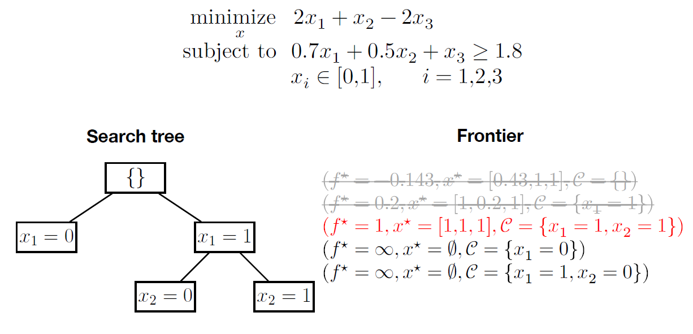

# Operations Research

- [1. Motivation](#1-motivation)
- [2. Operations Research Lifecycle](#2-operations-research-lifecycle)
- [3. Linear Programming](#3-linear-programming)
  - [3.1. Examples](#31-examples)
  - [3.2. Simplex Method](#32-simplex-method)
    - [3.2.1. Canonical form of LP](#321-canonical-form-of-lp)
    - [3.2.2. Conversion to canonical form](#322-conversion-to-canonical-form)
    - [3.2.3. Simplex Method](#323-simplex-method)
  - [3.3. Transportation Problem](#33-transportation-problem)
    - [3.3.1. Northwest Corner Rule](#331-northwest-corner-rule)
  - [3.4. Assignment Problem](#34-assignment-problem)
    - [3.4.1. Hungarian Algorithm](#341-hungarian-algorithm)
- [4. Additional Resources](#4-additional-resources)
- [5. Integer Linear Programming (ILP)](#5-integer-linear-programming-ilp)
  - [5.1. Binary ILP](#51-binary-ilp)
  - [5.2. Multi-objective optimization](#52-multi-objective-optimization)

> "The scientists were asked to do **research on** (military) **operations**" $\Rightarrow$ Operations Research.

## 1. Motivation

Consider a fleet of delivery trucks. How to plan production and routing in the most optimal way (maximize profit)?

"All models are wrong, but some are useful."

## 2. Operations Research Lifecycle

## 3. Linear Programming

- All mathematical functions in the model are linear functions.

### 3.1. Examples

 Example in 2D 

| Product          | Wood | Time | Profit |
|:----------------:|:----:|:----:|:------:|
| Table   ($x_1$)  | 10   |  5   | 180    |
| Wardrobe ($x_2$) | 20   | 4    | 200    |
| (Totals)         | 200  | 80   | ?      |

- $x_1$ is the # of tables,
- $x_2$ is the # of wardrobes.

Maximize:
$$ 180 x_1 + 200 x_2 $$
subject to,
$$
\begin{align*}
    10 x_1 + 20 x_2 &\leq 200\\
    5 x_1 + 4 x_2 &\leq 80\\
    x_1 &\geq 0\\
    x_2 &\geq 0
\end{align*}
$$

Graphical solution using [Desmos](https://www.desmos.com/calculator):

- Red point - solution.
- Black points - boundary points.

If we added another column in the table ("material"), a new constraint would appear. If we added a new row ("product"), a new dimension would appear.

 Example in 3D 

| Product          | $m_1$ | $m_2$ | $m_3$ | Profit |
|:----------------:|:----:|:----:|:--------|:------:|
| $p_1$ $(x)$   | 2   |  4   |  2     | 4    |
| $p_2$ $(y)$ | 3   | 0    |  5      | 3    |
| $p_3$ $(z)$ | 2   | 3    |  0      | 6    |
| (Totals)   | 440  | 470   | 430     |?      |

Maximize:
$$ 4x + 3y + 6z $$
subject to,
$$
\begin{align*}
    2x + 3y + 2z &\leq 440\\
    4x + 3z &\leq 470\\
    2x + 5y &\leq 430\\
    x &\geq 0\\
    y &\geq 0\\
    z &\geq 0
\end{align*}
$$

 Solved example in 2D 

| Product          | M  | P | Profit |
|:----------------:|:----:|:----:|:------:|
| A ($x$)  | 1.5   | 2.5   | 50    |
| B ($y$)  | 2.5   | 1.5    | 40    |
| (Totals)         | 300  | 240   | ?      |

Maximize:
$$ 50 x + 40 y $$
subject to,
$$
\begin{align*}
    1.5 x + 2.5 y &\leq 300\\
    2.5 x + 1.5 y &\leq 240\\
    x &\geq 0\\
    y &\geq 0
\end{align*}
$$

$$
\begin{align*}
    3x + 5y &= 600\\
    5x + 3y &= 480\\
    \hline\\
    25y - 9y &= 5\cdot 600 - 3\cdot 480\\
    16y &= 1560\\
    y &= 97.5\\
    \hline\\
    x &= \dfrac{480 - 3y}{5} = 37.5
\end{align*}
$$

### 3.2. Simplex Method

The idea is to move on a polytop (polyhedron). The direction is given by the objective function, for maximization we move in the direction of the largest increase at each step. Below is an illustration in 3D:

#### 3.2.1. Canonical form of LP

Linear programming problem is in the canonical form iff,

1. the problem is in form of a maximalization,
2. all constraints are in a form of equality,
3. all right sides are positive.

#### 3.2.2. Conversion to canonical form

1. $\min\Rightarrow\max$ *(multiply by $-1$ when necessary)*.
2. Make all right sides positive *(multiply by $-1$ when necessary)*.
3. Add **slack / surplus** variables to convert inequalities to equalities.
   - $\geq\colon x + y \geq 10 \Rightarrow  x + y - s = 10$
   - $\leq\colon x + y \leq 10 \Rightarrow  x + y + s = 10$

#### 3.2.3. Simplex Method

1. Canonical form
2. Column rule
3. Row rule
4. Check optimality condition

### 3.3. Transportation Problem

- [Python PuLP](https://www.coin-or.org/PuLP/CaseStudies/a_transportation_problem.html)

Shipping cost in $\$$ per truck:

| Mill / Warehouse          | $w_1$ | $w_2$ | $w_3$ | $w_4$ | Output |
|:----------------:|:----:|:----:|:--------|:------:|:---:|
| $m_1$   | 4   |  5   |  6     | 8    | 75 |
| $m_2$ | 1   | 9    |  5      | 3    | 10 |
| $m_3$ | 2   | 3    |  6      | 6    | 15 |
| Allocation   | 10  | 20   | 40     | 30      | $\times$ |

$$
\left(
\begin{matrix}
    x_{11} & x_{12} & x_{13} & x_{14} &&&& &&&& \\
    &&&& x_{21} & x_{22} & x_{23} & x_{24} &&&& \\
    &&&& &&&& x_{31} & x_{32} & x_{33} & x_{34} \\
    x_{11}  &&&& x_{21} &&&& x_{31} &&&\\
    & x_{12} &&&& x_{22} &&&& x_{32} &&\\
    && x_{13} &&&& x_{23} &&&& x_{33} &\\
    &&& x_{14} &&&& x_{24} &&&& x_{34}
\end{matrix}
\right\rvert\left.
\begin{matrix}
    75\\ 10\\ 15\\ 10\\ 20\\ 40\\ 30
\end{matrix}
\right)
$$

- Transportation problem can represented by a **bipartite graph**.

> **Integer solution property.** If all coefficients are integers, then all feasible solutions are also integers.

 Examples 

- [Video tutorial](https://youtu.be/WZIyL6pcItY?si=Ps5bp4_loy2g5V5E)

Coefficients of the objective are calculated as $A_{i,j}+\text{\$ per truck}$.

If `supply = demand`, we talk about a **balanced transportation problem**. However, here `supply > demand`.

Below, is the situation when `supply < demand`:

Another approach is to set the supply as *static*, change inequalities to equalities since all available supply will be used. Consequently, we change demand constraints to inequalities, because some demands are not going to be fully met:

If we wanted to exclude some of the connections (e.g., one of the paths is not possible for some reason), we can simply set the corresponding coefficient to zero. In the table, we denote such connection with $M$ which stands for many (infinite cost).

#### 3.3.1. Northwest Corner Rule

- Simple heuristic for transportation problem.

- Row 1: `supply = 15`
  - $15 - 5 = 10$ (current supply minus current demand)
  - $10 - 10 = 0$ (demand is not yet fully satisfied, but supply is)
- The initial basic feasible solution is:
  - $x_{11}=5$,
  - $x_{12}=10$,
  - $x_{22}=5$,
  - $x_{23}=15$,
  - $x_{24}=5$,
  - $x_{34}=10$.

### 3.4. Assignment Problem

The assignment model is:
$$
Z = \sum_{i=1}^{n} \sum_{j=1}^{n} c_{ij}x_{ij}
$$
subject to
$$
\begin{equation}
  \sum_{j=1}^{n} x_{ij} = 1 \quad \text{for } i = 1, 2, \ldots, n
\end{equation}
$$
$$
\begin{equation}
  \sum_{i=1}^{n} x_{ij} = 1 \quad \text{for } j = 1, 2, \ldots, n
\end{equation}
$$
and $x_{ij} \geq 0$ for all $i$ and $j$ ($x_{ij}$ is binary, for all $i$ and $j$).

Each assignee performs exactly one task $(1)$ and each task is assigned exactly to one assignee $(2)$.

#### 3.4.1. Hungarian Algorithm

- [Calculator](https://www.hungarianalgorithm.com/hungarianalgorithm.php)
- [Example](https://brilliant.org/wiki/hungarian-matching/)

The Hungarian algorithm consists of the four steps below. The first two steps are executed once, while Steps 3 and 4 are repeated until an optimal assignment is found. The input of the algorithm is an n by n square matrix with only nonnegative elements.

1. **Subtract row minima**

    For each row, find the lowest element and subtract it from each element in that row.

2. **Subtract column minima**

    Similarly, for each column, find the lowest element and subtract it from each element in that column.

3. **Cover all zeros with a minimum number of lines**

    Cover all zeros in the resulting matrix using a minimum number of horizontal and vertical lines. If $n$ lines are required, an optimal assignment exists among the zeros. The algorithm stops. The assignment will be where the 0's are in the matrix such that only one 0 per row and column is part of the assignment.

    If less than $n$ lines are required, continue with Step 4.

4. **Create additional zeros**

    Find the smallest element (call it $k$) that is not covered by a line in Step 3. Subtract $k$ from all uncovered elements, and add $k$ to all elements that are covered twice.

## 4. Additional Resources

- [Algorithms visualized](https://visualgo.net/en)

# Operations Research II

Practical examples? E.g., university timetable; traffic lights; factories and stock with limited capacity and minimum requrements, ...

## 5. Integer Linear Programming (ILP)

$$
\begin{align*}
& \underset{\mathbf{x} \in \mathbb{Z}^n}{\text{maximize}}   && \mathbf{c}^\mathrm{T} \mathbf{x}\\
& \text{subject to} && A \mathbf{x} \le \mathbf{b}, \\
&  && \mathbf{x} \ge \mathbf{0}
\end{align*}
$$

The feasible integer points are shown in red, and the red dashed lines indicate their convex hull, which is the smallest convex polyhedron that contains all of these points.

The blue lines together with the coordinate axes define the polyhedron of the LP relaxation, which is given by the inequalities *without the integrality constraint*.

The goal of the optimization is to move the black dashed line as far upward while still touching the polyhedron. The optimal solutions of the integer problem are the points $(1,2)$ and $(2,2)$ that both have an objective value of $2$. The unique optimum of the relaxation $(1.8, 2.8)$ with objective value of $2.8$.

If the solution of the relaxation is rounded to the nearest integers, it is not feasible for the ILP!

### 5.1. Binary ILP

1. Solve the relaxation (LP)
2. If the solution is an integer solution, we are done.
3. Otherwise, branch-and-bound algorithm until an integer solution is found:
   1. Set constraints for the 1st variable and evaluate. We set $x_1=0 \Rightarrow$ no solution, and $x_1=1 \Rightarrow$ non-integer solution.
   2. Evaluate the branches (we do not continue with the branch $x_1=0$, because there the solution does not satisfy the constraints). In our example, evaluate $x_2=0$ and $x_2=1$.

### 5.2. Multi-objective optimization

- Non-dominated Sorting Genetic Algorithm II ([NSGA-II](https://ieeexplore.ieee.org/document/996017))
