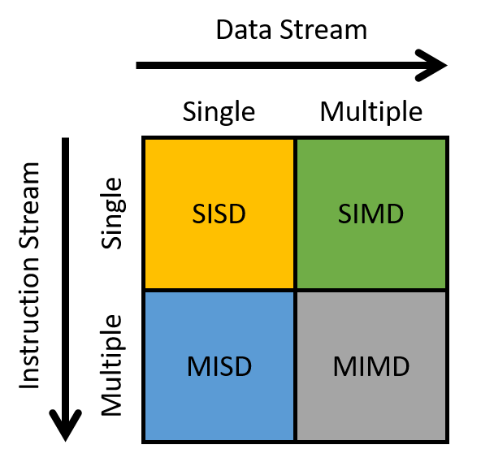
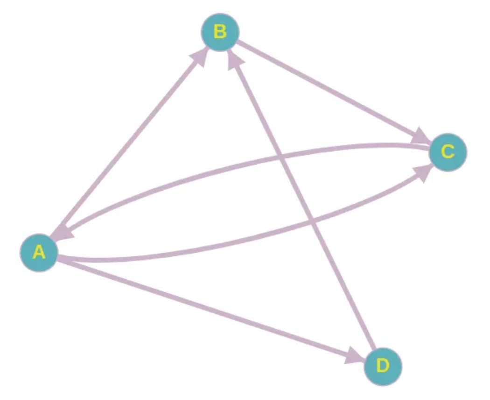

# Paralelní algoritmy 1

- [1. Multiprocessing a multithreading](#1-multiprocessing-a-multithreading)
  - [1.1. Proces](#11-proces)
  - [1.2. Vlákno (Thread)](#12-vlákno-thread)
  - [1.3. Task-switching](#13-task-switching)
- [2. Flynnova taxonomie](#2-flynnova-taxonomie)
- [3. Komponenty frameworku pro paralelní výpočty](#3-komponenty-frameworku-pro-paralelní-výpočty)
- [4. Open Multi-Processing (OpenMP)](#4-open-multi-processing-openmp)
  - [4.1. Výhody oproti manuálnímu multiprocessingu](#41-výhody-oproti-manuálnímu-multiprocessingu)
  - [4.2. Model Fork-Join](#42-model-fork-join)
  - [4.3. Příklady implementace](#43-příklady-implementace)
    - [4.3.1. Klauzule `reduce`](#431-klauzule-reduce)
    - [4.3.2. Klauzule `critical`](#432-klauzule-critical)
  - [4.4. Výhody a nevýhody](#44-výhody-a-nevýhody)
- [5. Intel Thread Building Blocks (TBB)](#5-intel-thread-building-blocks-tbb)
- [6. Historie počítání na GPU a úvod do technologie CUDA](#6-historie-počítání-na-gpu-a-úvod-do-technologie-cuda)
  - [6.1. Paměti](#61-paměti)
  - [6.2. CUDA-C](#62-cuda-c)
    - [6.2.1. Klíčová slova](#621-klíčová-slova)
    - [6.2.2. Proměnné](#622-proměnné)
    - [6.2.3. Funkce](#623-funkce)
- [7. Prefix Sum](#7-prefix-sum)
  - [7.1. Stride to N (Hillis-Steele)](#71-stride-to-n-hillis-steele)
  - [7.2. Blelloch - vyvažovaný strom](#72-blelloch---vyvažovaný-strom)
  - [7.3. Up-sweep \& Down-sweep](#73-up-sweep--down-sweep)
- [8. PageRank](#8-pagerank)

## 1. Multiprocessing a multithreading

### 1.1. Proces

- spustitelný SW je v procesním modelu organizovaný do sekvenčních procesů
- běžící program
- procesy jsou nezávislé (izolované OS) a komunikují přes **IPC** - **I**nter **P**rocess **C**ommunication
- každý proces má svoje místo v paměti, nesdílí paměť s jinými procesy

Stavy procesu

- (nový)
- běžící (running) $\rightarrow$ čekající (waiting) - čekání na vstup
- čekající (waiting) $\rightarrow$ připraven (ready) - vstup připraven
- připraven (ready) $\rightarrow$ běžící (running) - scheduler vybere proces a alokuje CPU
- běžící (running) $\rightarrow$ připraven (ready) - scheduler odstraní proces z CPU
- (ukončený)


### 1.2. Vlákno (Thread)

- jednotka parelelního výpočtu
- komunikace mezi vlákny (ITC - Inter Thread Communication) je **levnější** než IPC
- každé vlánko má vlastní **stack** (zásobník), **registry** a **čítač** (program counter) a
- každé vlákno sdílí **adresní prostor**, **datové úložiště** a **výpočetní zdroje** (mj. sdílená paměť)

### 1.3. Task-switching

- více procesů používá sdílené zdroje (CPU), rychlý task-switching může dávat iluzi paralelismu (pseudo-parallelismus, concurrency)


## 2. Flynnova taxonomie




## 3. Komponenty frameworku pro paralelní výpočty

## 4. Open Multi-Processing (OpenMP)

- parelení zpracování dat
- paralelní spouštění bloků kódu
- **directive-based** implementace, tzn. programátor rozhodne **co** a kompilátor rozhodne **jak**

### 4.1. Výhody oproti manuálnímu multiprocessingu

- kompilátor vybírá *best practises* a nejlepší vzory
- automatizace a optimalizace
- *portability* (nezáleží na OS)

### 4.2. Model Fork-Join

- jedno hlavní vlákno - **master**
- master provádí operace **fork**, tzn. vytvoří $n$ **worker** vláken na začátku paralelních regionů
- paralelní vlákna sdílejí práci a synchronizují se (**sync**) na konci paralelních regionů
- každé vlákno pracuje se sdílenými a privátními proměnnými
- základní stavební kámen standardu OpenMP


### 4.3. Příklady implementace

- `#pragma omp parallel if (is_parallel == 1) num_threads(8) private(a) shared(b) firstprivate(c)`
  - následující blok se má provést paralelně, pokud `is_parallel == 1`, s pevným počtem vláken (8)
  - každé vlákno má privátní kopii proměnné $a$ a $c$, ale všechny sdílí proměnnou $b$
  - hodnota každé privátní kopie $c$ je inicializována na hodnotu $c$ před začátkem paralelního bloku


```cpp
#include <omp.h>
//…

int main()
{
    int tid, nthreads;
    #pragma omp parallel private(tid)
    {
        tid = omp_get_thread_num();
        printf(”Hello World from thread % d\ n ", tid);
        #pragma omp barrier
        if (tid == 0)
        {
            nthreads = omp_get_num_threads();
            printf(”Total threads = % d\ n ",nthreads);
         }
      }
}
```

- `#pragma omp for`
  - v těle cyklu nelze provést `break`
  - iterace musí být **nezávislé**
  - **implicitní synchronizace** na konci cyklu (lze zrušit pomocí `nowait`)


```cpp
#include <cmath>

int main() 
{
    const int size = 256;
    double sinTable[size];

    #pragma omp parallel 
    {
        …
        #pragma omp for
        for (int n = 0; n < size; ++n)
            sinTable[n] = std::sin(2 * M_PI * n / size);
    }
}
```

#### 4.3.1. Klauzule `reduce`

- např. *suma prvků v poli* - ale tento problém není triviální, protože při naivní implementaci by nastal souběh (zámky by kvůli režii byly ještě pomalejší než sériový výpočet)
- řešením je paralelní ("návrhový") vzor **redukce**


```cpp
#include <omp.h>

int main() {
    int i, n, chunk;
    float a[100], b[100], result;

    n = 100;
    chunk = 10;
    result = 0.0;

    for (i = 0; i < n; i++) {
        a[i] = i * 1.0;
        b[i] = i * 2.0;
    }

    #pragma omp parallel for default(shared) private(i) schedule(static, chunk) reduction(+:result)
    for (i = 0; i < n; i++)
        result = result + (a[i] * b[i]);

    return 0;
}
```

#### 4.3.2. Klauzule `critical`

- `#pragma omp critical` - daný kód může vykonávat pouze jedno vlákno současně (jako `mutex::lock()`)

### 4.4. Výhody a nevýhody

+jednoduchost

+jednotný zdroják pro sériový a paralelní kód

+přenositelnost a podpora (gcc)

+kód funguje sériově bez jakýchkoliv úprav

-omezení na počítače se sdílenou pamětí

-potřeba kompilátoru s podporou OpenMP

## 5. Intel Thread Building Blocks (TBB)

- alternativa OpenMP
- vytváří se grafová struktura výpočtu - **TBB Flow Graph**


- např. $f_2$ a $f_3$ by se mohly vykonávat paralelně

## 6. Historie počítání na GPU a úvod do technologie CUDA

- vždy se jedná kombinaci CPU a GPU
- vývoj byl motivován renderováním počítačových her
- standardy CUDA (nVidia) a OpenCL (otevřený standard)
- vývoj General-Purpose-GPU $\rightarrow$ **GPGPU**
- GPU jsou silně optimalizované pro paralelní výpočty, jakýkoliv sériový výpočet je neefektivní
- GPU vycházejí ze SIMD (single-instruction-multiple-data) - všechny procesory vykonávají stejnou instrukci, pouze si rozdělí data
- GPU mají omezení na velikosti gridu, bloků
- vlákna se skládají do bloků a bloky se skládají do gridu (mřížky)
- obvykle se pracuje s mocninami dvojky, protože k tomu jsou přizpůsobeny caches atd.
- není zaručeno pořadí operací, lze ale nastavit synchronizaci (bariéry) na úrovni bloku a na úrovni celé karty (např. na konci kódu před tranferem dat z `device` zpět do `host`)

### 6.1. Paměti

- host memory
- device memory - pro převod dat mezi CPU a GPU
- global memory - největší, pomalá oproti ostatním na `device`
- constant memory - rychlá, malá, read-only
- texture memory - např. po obdélnících
- shared memory - rychlá paměť sdílená mezi vlákny v rámci bloku

### 6.2. CUDA-C

- rozšíření jazyka C
- kompiler `nvcc`, `*.cu` extension
- IDE NVidia nsight (nebo VS extension)

#### 6.2.1. Klíčová slova

- `__host__` - na CPU
- `__global__` - volá kernel na GPU (vždy je `void`, karta nemůže nic vracet)
- `__device__` - funkce na GPU

#### 6.2.2. Proměnné

- `blockIdx.x|y|z`, `threadIdx.x|y|z`
- `gridDim.x|y|z`, `blockDim.x|y|z`

#### 6.2.3. Funkce

- `cudaMalloc()`
- `cudaMemcpy()`
- `cudaFree()`
- `sudaMemcpyHostToDevice`
- `sudaMemcpyDeviceToHost`

## 7. Prefix Sum

- `np.cumsum`
- primitivní algoritmus, který se často používá v jiných algoritmech
- triviální implementace v cyklu $\mathcal{O}(n)$, ale iterace nejsou nezávislé!
  - `for i..n: y[i] = y[i-1] + x[i]`
  - naivní řešení - každé vlákno řeší jednu sumu

### 7.1. Stride to N (Hillis-Steele)

- paralelní složitost $\mathcal{O}(n\log n)$

1. každý prvek sčítám s následujícím prvkem (nezávislost operací)
2. krok (stride) nastavím na dva, sčítám ob jeden prvek (1. se 3., 2. se 4. atd.), prvních stride prvků zkopíruju
3. stride násobím dvěma (ve 3. iteraci stride=4), sčítám ob čtyři prvky (1. s 5., 2. s 6. atd.), prvních stride prvků zkopíruju
4. algoritmus končí, když stride $\geq n$

### 7.2. Blelloch - vyvažovaný strom

- bottom-up
- sestavím binární strom součtů prvků
- strom můžu paralelně procházet (za cenu vyšší paměťové složitosti)
- klesá intuitivita řešení

### 7.3. Up-sweep & Down-sweep

- paralelní složitost $\mathcal{O}(n)$ (ale klesá intuitivita řešení)

## 8. PageRank

- centralita grafu (např. jak rozbít zločinecký gang? hlavní gangster musí mít vysoký pagerank)
- $\boxed{PR(u)=\dfrac{1-d}{|V|}+d\sum\limits_{v\in N \rightarrow u}\dfrac{PR(v)}{|N\leftarrow v|}}$
- $V$ - množina vrcholů grafu $G$
- $N\leftarrow v$ - množina vrcholů, do kterých vedou hrany z $v$ (odchozí hrany z $v$, výstupní stupeň $\boxed{out(v)}$)
- $N\rightarrow v$ - množina vrcholů, ze kterých vede hrana do $v$ (příchozí hrany do $v$)
- $d\in[0,1]$ je teleportační faktor (konstanta obvykle nastavená na 0.85)
- na začátku se $PR$ inicializuje na $\dfrac{1}{|V|}$
- výstupem je pravděpodobnostní rozdělení $\Rightarrow\sum\limits_{v\in V}PR(v)=1$

<details><summary> Příklad </summary>

- [PageRank | Medium](https://medium.com/analytics-vidhya/parallel-pagerank-an-overview-of-algorithms-and-their-performance-ce3b2a2bfdb6)



- $d=0.85$
- $PR(A)=\dfrac{1-0.85}{4}+0.85\cdot \dfrac{PR(C)}{|\set{A}|}$
- $PR(B)=\dfrac{1-0.85}{4}+0.85\cdot \left(\dfrac{PR(A)}{|\set{B,C,D}|} + \dfrac{PR(D)}{|\set{B}|}\right)$
- $PR(C)=\dfrac{1-0.85}{4}+0.85\cdot \left(\dfrac{PR(A)}{|\set{B,C,D}|} + \dfrac{PR(B)}{|\set{C}|}\right)$
- $PR(D)=\dfrac{1-0.85}{4}+0.85\cdot \dfrac{PR(A)}{|\set{B,C,D}|}$

</details>
