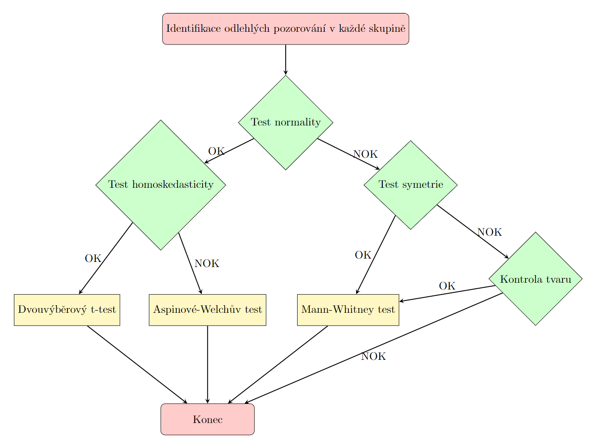

# PaS

- [1. Pravděpodobnost](#1-pravděpodobnost)
  - [1.1. Klasická (Laplaceova) definice pravděpodobnosti](#11-klasická-laplaceova-definice-pravděpodobnosti)
  - [1.2. Statistická definice pravděpodobnosti (Richard von Mise)](#12-statistická-definice-pravděpodobnosti-richard-von-mise)
  - [1.3. Geometrická definice pravděpodobnosti](#13-geometrická-definice-pravděpodobnosti)
  - [1.4. Kolmogorova (axiomatická) definice pravděpodobnosti](#14-kolmogorova-axiomatická-definice-pravděpodobnosti)
- [2. Náhodná veličina (NV)](#2-náhodná-veličina-nv)
  - [2.1. Diskrétní NV](#21-diskrétní-nv)
  - [2.2. Spojitá NV](#22-spojitá-nv)
    - [2.2.1. Weibullovo rozdělení](#221-weibullovo-rozdělení)
    - [2.2.2. Z-skóre](#222-z-skóre)
    - [2.2.3. Pravidlo 3 sigma](#223-pravidlo-3-sigma)
    - [2.2.4. Riziková funkce (intenzita poruch)](#224-riziková-funkce-intenzita-poruch)
  - [2.3. Vlastnosti NV](#23-vlastnosti-nv)
    - [2.3.1. Rozptyl](#231-rozptyl)
    - [2.3.2. Šikmost](#232-šikmost)
    - [2.3.3. Špičatost](#233-špičatost)
    - [2.3.4. Kvantily](#234-kvantily)
  - [2.4. Čebyševova nerovnost](#24-čebyševova-nerovnost)
  - [2.5. Centrální limitní věta (Lindenberg-Lévy)](#25-centrální-limitní-věta-lindenberg-lévy)
  - [2.6. Kovariance](#26-kovariance)
  - [2.7. Percentil](#27-percentil)
  - [2.8. Odlehlá pozorování](#28-odlehlá-pozorování)
- [3. Statistika](#3-statistika)
  - [3.1. Klasický test](#31-klasický-test)
  - [3.2. Čistý test významnosti](#32-čistý-test-významnosti)
- [4. Bodové a intervalové odhady](#4-bodové-a-intervalové-odhady)
  - [4.1. Bodový odhad střední hodnoty](#41-bodový-odhad-střední-hodnoty)
    - [4.1.1. Příklad](#411-příklad)
  - [4.2. Bodový odhad variability](#42-bodový-odhad-variability)
  - [4.3. Odhad parametru binomického rozdělení](#43-odhad-parametru-binomického-rozdělení)
  - [4.4. Porušení normality](#44-porušení-normality)
  - [4.5. Intervalové odhady](#45-intervalové-odhady)
  - [4.6. Statistický hypotéza](#46-statistický-hypotéza)
    - [4.6.1. Nulová hypotéza](#461-nulová-hypotéza)
    - [4.6.2. Alternativní hypotéza](#462-alternativní-hypotéza)
  - [4.7. Jednovýběrový t-test střední hodnoty](#47-jednovýběrový-t-test-střední-hodnoty)
  - [4.8. Wilcoxův test](#48-wilcoxův-test)
  - [4.9. Rozhodovací diagram](#49-rozhodovací-diagram)
- [5. Dvouvýběrové testy](#5-dvouvýběrové-testy)
  - [5.1. O shodě střední hodnoty](#51-o-shodě-střední-hodnoty)
  - [5.2. O shodě rozptylu](#52-o-shodě-rozptylu)
  - [5.3. Rozhodovací diagram](#53-rozhodovací-diagram)
- [6. Vícevýběrové testy](#6-vícevýběrové-testy)
  - [6.1. Vícenásobné porovnávání](#61-vícenásobné-porovnávání)
  - [6.2. Vícevýběrové testy homoskedasticity](#62-vícevýběrové-testy-homoskedasticity)
  - [6.3. ANOVA](#63-anova)
  - [6.4. Post hoc analýza - interpretace](#64-post-hoc-analýza---interpretace)
    - [6.4.1. Příklad](#641-příklad)
- [7. Kontingenční tabulky](#7-kontingenční-tabulky)
  - [7.1. Vizualizace](#71-vizualizace)
- [8. Šance a riziko](#8-šance-a-riziko)
  - [8.1. Relativní riziko](#81-relativní-riziko)
  - [8.2. Poměr šance](#82-poměr-šance)
  - [8.3. epi.2by2](#83-epi2by2)

## 1. Pravděpodobnost

- **náhodný pokus** - konečný děj, který není deterministický
- **náhodný jev** - tvrzení o výsledku náhodného pokusu (např. padne sudé číslo na kostce)
- **elementární jev** - $\omega$ - jednotlivý výsledek náhodného pokusu (např. padne 6)
- **základní prostor** - $\Omega$ - množina všech elementárních jevů

### 1.1. Klasická (Laplaceova) definice pravděpodobnosti

> Buď $\Omega$ uniformní prostor $n$ elementárních jevů (tzn. všechny elementární jevy jsou rovnocenné). Pak pravděpodobnost (náhodného) jevu $A$ složeného z $m$ elementárních jevů je $\boxed{\mathcal{P}(A) =\dfrac{m}{n}.}$

### 1.2. Statistická definice pravděpodobnosti (Richard von Mise)

> Buď $A$ náhodný jev, $n$ počet všech realizací (náhodného) pokusu a buď $n(A)$ počet příznivých jevů (jev $A$ nastal). Pak $\boxed{\mathcal{P}(A) =\lim\limits_{n\rightarrow +\infty}\dfrac{n(A)}{n}.}$

### 1.3. Geometrická definice pravděpodobnosti

> Buď $\Omega$ oblast v prostoru a buď $A\subseteq \Omega$ uzavřená (pod)oblast. Pravděpodobnost, že jev $A$ nastal (tzn. náhodně zvolený bod v oblasti $\Omega$ leží v oblasti $A$) je ${\mathcal{P}(A) =\dfrac{|A|}{|\Omega|}.}$

- zobecnění pro nespočetnou množinu všech možných realizací jevu

### 1.4. Kolmogorova (axiomatická) definice pravděpodobnosti

>Buď $\Omega$ lib. množina. Řekneme, že $\mathcal{A}\subseteq 2^{\Omega}$ je $\mathbf{\sigma}$-algrebra podmnožin množiny $\Omega$, platí-li současně:
>
> 1. $\Omega\in\mathcal{A}$
> 2. $A\in\mathcal{A}\Rightarrow \overline{A}\in\mathcal{A}$
> 3. $A_1,A_2,...\in\mathcal{A}\Rightarrow \bigcup\limits_{n\in\N} A_n\in\mathcal{A}$

Tzn. $\sigma$-algrebra $\mathcal{A}$ obsahuje celé $\Omega$, je uzavřená vůči doplňku a spočetnému sjednocení svých prvků.
Navíc lze ukázat, že $\emptyset\in\mathcal{A}$, a že $\mathcal{A}$ je uzavřená také vůči spočetnému (a konečnému) průniku a sjednocení svých prvků.

> Pravděpodobností na $\sigma$-algebře $\mathcal{A}$ rozumíme množinovou funkci $P:\mathcal{A}\rightarrow\R$ takovou, že
>
> 1. $(\forall A\in\mathcal{A}):P(A)\geq 0$
> 2. $P(\Omega) = 1$
> 3. Pokud $A_1,A_2,...\in \mathcal{A}\wedge (\forall i,j\in\N\mid i\neq j):A_i\cap A_j$
    $\Rightarrow P\left(\,\bigcup\limits_{i=1}^{\infty} A_i \,\right) = \sum\limits_{i=1}^{\infty} P(A_i)$

Trojici $(\Omega,\mathcal{A},P)$ nazveme pravděpodobnostním prostorem. Prvky $\sigma$-algebry $\mathcal{A}$ nazýváme náhodné jevy. $\Omega$ je množina elementárních jevů.

## 2. Náhodná veličina (NV)

> Náhodná veličina je funkce, která zobrazuje elementární jevy $\omega\in\Omega$ na reálná čísla.

Náhodná veličina je model výsledku náhodného pokusu.

Jak vykreslit rozložení NV?

```r
mu <- 266
sigma <- 16
x <- seq(mu - 3*sigma, mu + 3*sigma, 0.01)
fx <- dnorm(x,mu,sigma)
Fx <- pnorm(x,mu,sigma)

plot(x,fx)
```

### 2.1. Diskrétní NV

> Náhodná veličina $X$ má diskrétní rozdělení pravděpodobnosti (je diskrétní), právě když nabývá spočetně mnoha hodnot.

$F(x)=\mathcal{P}(X < x)$

$\mathcal{P}(a\leq X < b)=\mathcal{P}(X < b) - \mathcal{P}(X < a) = F(b)-F(a)$


### 2.2. Spojitá NV

> Náhodná veličina $X$ má spojité rozdělení pravděpodobnosti (je spojitá), právě když má spojitou
distribuční funkci.

$\boxed{F(t)=\int\limits_{-\infty}^{t}f(x)\mathrm{d}x}$

$\Rightarrow \boxed{f(x) = F'(x)}$

- plocha pod funkcí hustoty je jedna

#### 2.2.1. Weibullovo rozdělení

> $X$ ... délka časových intervalů mezi událostmi (i v případě, kdy neplatí předpoklad o konstantní intenzitě událostí)
>
> $X\sim Wb(scale=\theta=\frac{1}{\lambda},shape=\beta)$

#### 2.2.2. Z-skóre

> Nechť $X\sim\mathcal{N}(\mu,\sigma^2)$. Definujme NV $Z$, mnohdy nazývanou z-skóre, jako $\boxed{Z=\dfrac{X-\mu}{\sigma}}$. Pak NV $Z$ má normované normální rozdělení, $Z\sim\mathcal{N}(0,1)$.
>
> Pro distribuční funkce normální NV $X$ a normované normální NV $Z$ platí převodní vztah $\boxed{F(x)=\Phi\left(\dfrac{x-\mu}{\sigma}\right)}$

#### 2.2.3. Pravidlo 3 sigma

Buď $X\sim\mathcal{N}(\mu,\sigma^2)$. Potom platí:

|  k  | $\mathcal{P}(\mu - k\sigma < X < \mu + k\sigma)$ |
|-----|----------------------------------------------|
|  1  | 0.682                                        |
|  2  | 0.954                                        |
|  3  | 0.997                                        |

#### 2.2.4. Riziková funkce (intenzita poruch)

> Pro nezápornou náhodnou veličinu $X$ se spojitým rozdělením popsaným distribuční funkcí $F(t)$ definujeme pro $F(t)\neq0$ rizikovou funkci jako $\boxed{\mathrm{risk}(t)=\dfrac{f(t)}{1-F(t)}}$

Představuje-li náhodná veličina $X$ dobu do poruchy nějakého zařízení, pak pravděpodobnost, že pokud do
času $t$ nedošlo k žádné poruše, tak k ní dojde v následujícím krátkém úseku délky $\Delta t$, je přibližně $\mathcal{P}(t\leq X < t+\Delta \mid X>t)\approx\mathrm{risk}(t)\cdot \Delta t$

> Příklad: Doba přežití pacienta v měsících má Weibulovo rozdělení s lineárně rostoucí rizikovou funkcí a parametrem měřítka 50. Jaká je hodnota rizikové funkce v 24 měsících? Jaká je pravděpodobnost, že pacient, který přežil 24 měsíců, zemře v následujících 14 dnech?
>
> Buď NV $X\sim \mathrm{Weibull}(scale=50, shape=2)$.
>
> $\mathrm{risk}(t)=\dfrac{f(t)}{1-F(t)}$
>
> ```r
> # Hodnota rizikové funkce v 24 měsících
> risk24 <- dweibull(24,scale=50, shape=2) / 
>  (1-pweibull(24,scale=50, shape=2))
> # Pravděpodobnost, že pacient, který přežil 24 měsíců,
> # zemře v následujících 14 dnech (půl měsíce)
> p <- risk24 * 0.5
> ```

### 2.3. Vlastnosti NV

> Variační koeficient $\gamma(X)$ definujeme pro **nezáporné** NV jako $\gamma(X)=\dfrac{\sigma}{\mu}$, resp. $V=\dfrac{s}{\lvert\overline{X}\rvert}$.

- Často se vyjadřuje v %.
- Pokud je $\gamma(X)<50 \%$, tak mluvíme o homogenním souboru.

#### 2.3.1. Rozptyl

> $\mathbb{D}(X) = \mathbb{E}((X-\mathbb{E}(X))^2)= \mathbb{E}(X^2)-(\mathbb{E}(X))^2$

#### 2.3.2. Šikmost

> Šikmost $\mathrm{skew}(X)=\dfrac{\mu_3'}{\sigma^3}=\dfrac{\mathbb{E}((X-\mathbb{E}X)^3)}{\sigma^3}$

Negativní, nulová a kladná šikmost (negativní $\rightarrow$ odtlačím rozdělení z negativní části osy $x$ apod.):

Šikmost $\mathrm{skew}(X)<2$ (negativně zešikmené), šikmost $\mathrm{skew}(X)\in\langle-2,2\rangle$, šikmost $\mathrm{skew}(X)>2$ (pozitivně zešikmené)


#### 2.3.3. Špičatost

> Špičatost $\mathrm{kurt}(X)=\dfrac{\mu_4'}{\sigma^4}=\dfrac{\mathbb{E}((X-\mathbb{E}X)^4)}{\sigma^4}$.

Špičatost pro $\mathrm{kurt}(X)<3$, $\mathrm{kurt}(X)=3$ (normální rozdělení) a $\mathrm{kurt}(X)>3$


Pojem **standardní špičatost** je $\boxed{{kurt}(X)-3}$.

Potom můžeme empiricky zjišťovat předpoklad normality $\Rightarrow$ šikmost a standardní špičatost $\in\langle-2,2\rangle$.

#### 2.3.4. Kvantily

> $p$-kvantil $x_p\in\mathbb{R}$ je číslo, pro které platí $\mathcal{P}(X\leq x_p)=p$

### 2.4. Čebyševova nerovnost

> $(\forall k \in \mathbb{R}^+)\colon \boxed{\mathcal{P}(\mu - k\sigma \leq X \leq \mu + k\sigma) < 1 - \dfrac{1}{k^2},}$ kde $\mu$ je populační průměr $\hat{\mu}\approx \overline{X}$ a $\sigma$ je populační směrodatná odchylka $\hat{\sigma}\approx s$.

|  k  | $\mathcal{P}(\mu - k\sigma < X < \mu + k\sigma)$ |
|-----|----------------------------------------------|
|  1  | >0                                           |
|  2  | >0.75                                        |
|  3  | >0.89                                        |

### 2.5. Centrální limitní věta (Lindenberg-Lévy)

Nechť $(X_n)$ je posploupnost nezávislých stejně rozdělených (**i.i.d.**) NV se střední hodnotou $\mu=EX_i$ a konečným rozptylem $\sigma^2=DX_i$. Pak
$$\dfrac{\sum\limits_{i=1}^{n}X_i - n\mu}{\sqrt{n}\sigma} \xrightarrow{D}\mathcal{N}(0,1)$$
$$\sqrt{n}\dfrac{\overline{X_n} - \mu}{\sigma}\,\,\xrightarrow{\,\,\,D\,\,}\,\,\mathcal{N}(0,1)$$
  
Důsledek. Pro všechna dost velká $n$:
  
$$\dfrac{\overline{X_n} - \mu}{\dfrac{\sigma}{ \sqrt{n}}}\sim\mathcal{N}(0,1)$$
  
$$\boxed{\overline{X_n}\sim\mathcal{N}\left(\mu,\dfrac{\sigma^2}{n}\right)}$$
  
$$\boxed{\sum_{i=1}^nX_i\sim\mathcal{N}\left(n\mu,n\sigma^2\right)}$$

Jsou-li $X_1,X_2,\ldots,X_n$ nezávislé náhodné veličiny se stejnou střední hodnotou $\mu_X$ a se stejným konečným rozptylem $\sigma_X^2$, pak výběrový průměr $\overline{X}_n$ má při dostatečně velkém počtu pozorování přibližně normální rozdělení, ať už $X_i$ pocházejí z libovolného rozdělení.

**Předpoklady CLV:**

- $X_i$ nezávislé náhodné veličiny,
- $E(X_1) = E(X_2) = \ldots = E(X_n) = \mu_X$,
- $D(X_1) = D(X_2) = \ldots = D(X_n) = \sigma_X^2 < +\infty$,
- $n\rightarrow+\infty$ (v praxi: $\boxed{n > 30}$, výběr neobsahuje odlehlé pozorování.)

### 2.6. Kovariance

Buď $X,Y$ NV s konečnými rozptyly. Pak kovarianci definujeme jako střední hodnotu součinu odchylek NV od jejich střední hodnoty:

$$cov(X,Y)=\mathbb{E}((X-\mathbb{E}(X))(Y-\mathbb{E}(Y)))$$

$$cov(X,Y)=\mathbb{E}(XY)-\mathbb{E}(X)\mathbb{E}(Y)$$

### 2.7. Percentil

Percentil je relativní umístění vzhledem k ostatním posuzovaným na stupnici do hodnoty $100$, přičemž $100$ je nejvyšší umístění (tzn. percentil udává, kolik procent ostatních účastníků dosáhlo horšího výsledku).

### 2.8. Odlehlá pozorování

Interkvartilové rozpětí $\boxed{\mathrm{IQR}=x_{0.75} - x_{0.25}}$

Jak odstranit odlehlá pozorování?

1. Metoda vnitřních hradeb $\boxed{\langle x_{0.25}-1.5\mathrm{IQR}, x_{0.75}+1.5\mathrm{IQR}\rangle}$
2. Metoda vnějších hradeb $\boxed{\langle x_{0.25}-3\mathrm{IQR}, x_{0.75}+3\mathrm{IQR}\rangle}$

Hodnoty mimo tyto hradby budou odstraněny.

## 3. Statistika

**Náhodný výběr** $\boxed{\mathbf{X}=(X_1, X_2, \ldots, X_n)}$ je vektor náhodných veličin, které jsou *nezávislé* a mají *stejné rozdělení* (**i.i.d.**).

**Statistika** $\boxed{T(\mathbf{X})}$ je funkce náhodných veličin, a tedy je taky náhodnou veličinou (pokud je $T$ borelovská).

**Pozorovaná hodnota** $\boxed{t_{obs}(\mathbf{x})\in\mathbb{R}}$, kde $\mathbf{x}=(x_1,\ldots,x_n)$ je konkrétní realizace náhodného výběru, je konkrétní realizací výběrové statistiky $T(\mathbf{X})$.

**Populační charakteristiky** (obecně značíme $\theta$) jsou konstanty,ale většinou nedokážeme určit jejich přesnou hodnotu.

| Populační parametry          | Symbol                           |
|------------------------------|----------------------------------|
| Střední hodnota              | $\mu$ nebo $\mathbb{E}(X)$        |
| Medián                       | $x_{0,5}$                    |
| Rozptyl                       | $\sigma^2$ nebo $\mathbb{D}(X)$   |
| Směrodatná odchylka          | $\sigma$ nebo $\sigma(X)$ |
| Pravděpodobnost              | $\pi$                        |

**Výběrové charakteristiky** jsou NV a na základě realizace náhodného výběru dokážeme určit jejich pozorované hodnoty.

| Výběrové charakteristiky     | Symbol                           |
|------------------------------|----------------------------------|
| (Výběrový) průměr            | $\bar{X}$ nebo $\mu$      |
| Výběrový medián              | $\tilde{X}$ nebo $X_{0,5}$|
| Výběrový rozptyl             | $S^2$                         |
| Výběrová směrodatná odchylka | $S$                           |
| Relativní četnost            | $P$                           |

| Pozorované hodnoty výběrových charakteristik                            | Symbol                         |
|-----------------------------------------------------------------------|--------------------------------|
| (Výběrový) průměr             | $\bar{x}$ nebo $\hat{\mu}$ |
| Výběrový medián                       | $\hat{x}_{0,5}$ |
| Výběrový rozptyl                      | $s^2$ nebo $\hat{\sigma}^2$|
| Výběrová směrodatná odchylka          | $s$ nebo $\hat{\sigma}$    |
| Výběrová pravděpodobnost              | $p$ nebo $\hat{\pi}$ |

**Statistická hypotéza** je libovolné tvrzení o rozdělení náhodné veličiny.

### 3.1. Klasický test

1. Formulujeme nulovou a alternativní hypotézu.
2. Stanovíme hladinu významnosti (pravděpodobnost chyby I. druhu).

3. Zvolíme tzv. testovou statistiku , tj. výběrovou charakteristiku, jejíž rozdělení závisí na testovaném parametru $\theta$. (Rozdělení testové statistiky za předpokladu platnosti nulové hypotézy nazýváme nulové rozdělení.)
4. Ověříme předpoklady testu.
5. Určíme kritický obor $W^*$:

| Tvar alternativní hypotézy $H_A$ | Kritický obor $W^*$                                     |
|-----------------------------------|---------------------------------------------------------|
| $\theta < \theta_0$               | $(-\infty, x_{\alpha})$                                 |
| $\theta > \theta_0$               | $(x_{1-\alpha}, \infty)$                                |
| $\theta \neq \theta_0$            | $(-\infty, x_{\alpha/2}) \cup (x_{1-\alpha/2}, \infty)$ |

6. Na základě konkrétní realizace výběru určíme pozorovanou hodnotu $x_{\text{OBS}}$ testové statistiky.
7. Rozhodneme o výsledku testu:

| Situace                    | Interpretace                                            |
|----------------------------|---------------------------------------------------------|
| $x_{\text{OBS}} \in W^*$   | Na hladině významnosti $\alpha$ zamítáme $H_0$ ve prospěch $H_A$. |
| $x_{\text{OBS}} \notin W^*$ | Na hladině významnosti $\alpha$ nezamítáme $H_0$.        |

Čím větší je rozsah výběru, tím menší efekt „postačuje“ k zamítnutí nulové hypotézy.

Čím větší je rozsah výběru, tím menší efekt
bude označen za statisticky významný.

Při použití příliš malého rozsahu výběru bude i prakticky významný efekt označen za statisticky nevýznamný.

Při použití příliš velkého rozsahu výběru bude i velmi malý efekt (prakticky nevýznamný) označen za statisticky významný.

### 3.2. Čistý test významnosti

Místo kroků 5-7 (v klasickém testu) provedeme:

1. Výpočet $p$-hodnoty:

| Tvar alternativní hypotézy $H_A$  |                      $p$-hodnota                  |
|-----------------------------------|----------------------------------------------------|
| $\theta < \theta_0$               | $F_0(x_{\text{OBS}})$               |
| $\theta > \theta_0$               | $1 - F_0(x_{\text{OBS}})$           |
| $\theta \neq \theta_0$            | $2 \min\set{F_0(x_{\text{OBS}}), 1 - F_0(x_{\text{OBS}})}$ |

2. Rozhodnutí o výsledku testu:

| $p$-hodnota                    | Interpretace                                           |
|-----------------------------|--------------------------------------------------------|
| $< \alpha$    | Na hladině významnosti $\alpha$ zamítáme $H_0$ ve prospěch $H_A$. |
| $\geq \alpha$  | Na hladině významnosti $\alpha$ nezamítáme $H_0$.     |

## 4. Bodové a intervalové odhady

- $\alpha$...hladina významnosti
- $1-\alpha$...hladina spolehlivosti
- $P(T_D < \mu < T_H)=1-\alpha$...oboustranný odhad $(T_D; T_H)$, v R-ku `two.sided`
- $P(T_D^* < \mu)=1-\alpha$...levostranný odhad $(T_D^*,+\infty)$, v R-ku `greater`
- $P(\mu < T_H^*)=1-\alpha$...pravostranný odhad $(-\infty, T_H^*)$, v R-ku `less`
- Pozn. $T_D$ není to stejné jako $T_D^*$, protože oboustranný odhad rozdělí data na 2.5 %, 95 %, 2.5 %, zatímco levostranný na 5 % a 95 % (stejně pro $T_H$)
- Odhady zaokrouhlujeme na desetiny, dolní dolů a horní nahoru
  - např. $(20.31859, 27.71495) \Rightarrow (\text{floor}(T_D), \text{ceil}(T_H)) \Rightarrow (20.3, 27.8)$

### 4.1. Bodový odhad střední hodnoty

Předpoklad **normality** dat:

- žádná odlehlá pozorování,
- histogram, Q-Q graf,
- šikmost, špičatost $\in (-2,2)$,
- Shapiro-Wilkův test.

Pokud je splněna **normalita** $\Rightarrow$ bodový odhad střední hodnoty je pozorovaná hodnota (výběrového) průměru $\boxed{\hat{\mu}=\overline{x}=\frac{1}{n}\sum\limits_{i=1}^n x_i}$

#### 4.1.1. Příklad

- Střední hodnota je přibližně: $\overline{X}=296.6$
- 90% oboustranný intervalový odhad pro $\mu$: $(291.4, 301.8)$
  - interpretace: "s 90% p-stí je střední hodnota v intervalu..."
- $P(291.4 < \mu < 301.8) = 0.9$

### 4.2. Bodový odhad variability

Výběrový rozptyl $\boxed{S^2=\dfrac{\sum\limits_{i=1}^n (X_i-\overline{X})^2}{n-1}}$

Výběrová směrodatná odchylka $S=\sqrt{S^2}$

### 4.3. Odhad parametru binomického rozdělení

- předpklad: počet pozorování $n$ musí vyhovovat nerovnosti: $\boxed{n > \dfrac{9}{P(1-P)}}$
  - snaží se zajistit, abychom neodhadovali příliš "vzácný" jev pomocí příliš malého počtu pozorování

### 4.4. Porušení normality

- nelze pracovat s $\mu$ $\Rightarrow$ pracujeme s mediány $x_{0.5}$

### 4.5. Intervalové odhady

Pomocí intervalových odhadů jsme schopni s určitou spolehlivostí určit hodnotu populačního parametru.

### 4.6. Statistický hypotéza

Statistická hypotéza je libovolné tvrzení o rozdělení náhodného výběru.

- jednovýběrový problém - jeden parametr poronáváme s pevnou hodnotou
- dvouvýběrový problém - porovnání dvou populačních parametrů
- vícevýběrový problém - porovnání více populačních parametrů

#### 4.6.1. Nulová hypotéza

- nepřítomnost rozdílu
- vždy s rovná se
- "obžalovaný je nevinen"
- **"$p$-value is low, null hypothesis must go!"**
- $p$-value obvykle zaokrouhlujeme na tisíciny (pokud je velmi malá, tak zapíšu $<0,001$)
- $p$-value $< \alpha$ nulovou hypotézu zamítáme na hladině významnosti $\alpha$
- $p$-value $\geq \alpha$ nulovou hypotézu **ne**zamítáme na hladině významnosti $\alpha$
- např. Shapiro-Wilk:
  - $H_0:$ data jsou z normálního rozdělení ($p$-value $< \alpha$)
  - $H_1:$ data nejsou z normálního rozdělení ($p$-value $\geq \alpha$)
  - `shapiro.test(df$column)`

#### 4.6.2. Alternativní hypotéza

- přítomnost rozdílu
- "obžalovaný je vinen"

### 4.7. Jednovýběrový t-test střední hodnoty

- vždy prvně odstraním odlehlá pozorování
- $\mu = c, c\in\mathbb{R}$

```r
t.test(x, mu = 0,
       alternative = c("two.sided", "less", "greater"),
       conf.level = 0.95)
```

- př. $H_0: \mu = 290, H_1: \mu \neq 290, \alpha = 0.1$
  - `t.test(data1$odehrane_hod_2018, mu = 290, alternative = "two.sided", conf.level = 0.9)`
  - $p$-value $<0.1$, intervalový odhad $[291.5, 301.7]$, tzn. testovaná hodnota není obsažena v intervalovém odhadu $\Rightarrow$ zamítáme nulovou hypotézu
  - závěr: střední hodnota se statisticky významně liší od hodnoty 290 na hladině významnosti 10 %

### 4.8. Wilcoxův test

- vždy prvně odstraním odlehlá pozorování
- při porušení normality provedu test symetrie
  - symetrická data $\Rightarrow$ Wilcoxův test (medián)
  - nesymetrická data $\Rightarrow$ znaménkový test (medián)

### 4.9. Rozhodovací diagram


## 5. Dvouvýběrové testy

### 5.1. O shodě střední hodnoty

- $H_0:\,\mu_1=\mu_2 \iff \mu_1-\mu_2 = 0$
- $H_1:\,\mu_1\neq \mu_2 \iff \mu_1-\mu_2 \neq 0$ (oboustranná alternativa)
- $H_1:\,\mu_1<\mu_2 \iff \mu_1-\mu_2 < 0$
- $H_1:\,\mu_1>\mu_2 \iff \mu_2-\mu_1 > 0$
- pro intervalové odhady **rozdílu** středních hodnot (vždy vycházím z ekvivalentního zápisu ve formě rozdílu)
- dvouvýběrový $t$-test $\Rightarrow$ intervalový odhad rozdílu středních hodnot
  - předpoklad normality a shody rozptylů
- Aspinové-Welchův test $\Rightarrow$ intervalový odhad rozdílu středních hodnot
  - předpoklad normality (rozptyly můžou být různé)
- Mannův-Whitneyho test $\Rightarrow$ intervalový odhad rozdílu mediánů
  - předpoklad stejného tvaru rozdělení (obálky histogramu by měly být podobné, popř. test symetrie)
- Test o shodě parametrů $p$ dvou binomických rozdělení

### 5.2. O shodě rozptylu

- $H_0:\,\sigma^2_1=\sigma^2_2 \iff \dfrac{\sigma^2_1}{\sigma^2_2}= 1$
- otázka kolikrát se rozptyly liší?
- intervalový odhad pro **poměr** rozptylů (vždy vycházím z ekvivalentního zápisu ve formě poměru rozptylů)
- test o shodě rozptylů ($F$-test) $\Rightarrow$ intervalový odhad poměru rozptylů
  - předpoklad normality dat

### 5.3. Rozhodovací diagram

Nulová hypotéza o shodě středních hodnot: $H_0: \mu_1=\mu_2$

1. odstranění odlehlých pozorování
2. test normality pro každou skupinu
   1. u obou normality nebyla zamítnuta
      - test o shodě rozptylů
        1. $\sigma^2_1=\sigma^2_2$ $\Rightarrow$ dvouvýběrový $t$-test
        2. $\sigma^2_1\neq\sigma^2_2$ $\Rightarrow$ Aspinové-Welchův test
   2. alespoň u jedné skupiny byla normalita zamítnuta
      - kontrola stejného tvaru obou rozdělení (pokud splněno) $\Rightarrow$ Mannův-Whitneyho test $\Rightarrow$ $H_0: x^{(1)}_{0.5}=x^{(2)}_{0.5}$ (test shody mediánů)



## 6. Vícevýběrové testy

1. Identifikace odlehlých pozorování v každé skupině
2. Ověření normality v každé skupině
   1. OK: **Bartlettův test** homoskesticity (předpoklad normality)
      1. OK: **ANOVA**
         1. OK: konec
         2. NOK: **Tukey**ho post-hoc analýza
      2. NOK: **Kruskalův-Wallisův** test
         1. OK: konec
         2. NOK: **Dunn**ové post-hoc analýza
   2. NOK: **Test symetrie** pro každou skupinu
      1. OK: **Kruskalův-Wallisův** test
         1. OK: konec
         2. NOK: **Dunn**ové post-hoc analýza
      2. NOK: Kontrola přibližně stejného tvaru rozdělení, se zaměření na rozdíly v šikmosti
         1. OK: **Kruskalův-Wallisův** test
            1. OK: konec
            2. NOK: **Dunn**ové post-hoc analýza

Pozn. **Leveneho** test homoskesticity pro "nenormální" data v tomto rozhodovacím diagramu není obecně potřeba použít.


### 6.1. Vícenásobné porovnávání

- museli bychom provést $\binom{k}{2}$ testů, kde $k$ je počet parametrů
  - tomu odpovídá chyba 1. druhu: $1-(1-\alpha)^{\binom{k}{2}}$
  - na hladině významnosti $\alpha=0.05$ pro $k=3$ je odpovídající chyba 1. druhu $1- (0.95\cdot 0.95\cdot 0.95) = 0.143$
- tyto závěry vedou k tzv. **Bonferroniho korekce**
  - snížíme hladinu významnosti každého z dílčích testů na $\dfrac{\alpha}{\binom{k}{2}}$
  - tato korekce se použivá v Dunnové post-hoc analýze po Kruskal-Wallis testu (resp. v Tukey HSD po testu ANOVA)

### 6.2. Vícevýběrové testy homoskedasticity

- u vícenásobného krabicového grafu se dívám na "velikosti krabic"
- Bartlett (normalita)
- Levene

### 6.3. ANOVA

- ANalysis Of VAriance
- test shody středních hodnot

- rozdíly mezi třídami
- rozdíly uvnitř tříd - reziduální (zbytkové) vlivy

Liší-li se průměry jednotlivých skupin vlivem různých středních hodnot příslušných populací, pak musí být rozptyl mezi třídami dostatečně velký vzhledem k rozptylu uvnitř tříd.

### 6.4. Post hoc analýza - interpretace

- vícenásobné porovnávání s korekcí

Srovnávané třídy rozdělíme do tzv. **homogenních skupin** (podmnožin), tj. podmnožin obsahujících pouze ty třídy, pro něž v rámci post hoc analýzy *nebyla zamítnuta hypotéza o shodě středních hodnot* (pro žádnou z dvojic tříd v rámci homogenní skupiny).

Jak najít homogenní skupiny?

1. Srovnávané třídy **seřadíme sestupně** podle průměru (resp. mediánu)
2. Označíme třídu s **největším** průměrem (mediánem) písmenem $a$.
3. Podíváme se na výsledek post hoc analýzy pro srovnání dané třídy a třídy s **druhým nejvyšším průměrem** (mediánem). Když neevidujeme statisticky významný rozdíl, označíme druhou třídu rovněž písmenem $a$. Obdobně pro třetí nejvyšší atd.
4. Označíme třídu s **druhým největším** průměrem (mediánem) písmenem $b$ a opakujeme krok 3 pro všechny třídy s nižším průměrem (mediánem). Obdobně pro zbylé třídy (písmena $c$, $d$,...).
5. Odstraníme písmena, která jsou všechna obsažena v skupinách tříd označených jiným písmenem.
6. Každé písmeno indikuje jednu homogenní skupinu.
7. Homogenní skupiny se můžou překrývat.

#### 6.4.1. Příklad

Buď $\alpha=0.05$ hladina významnosti. Tabulky jsou seřazené sestupně podle průměru nárůstu FPS.

Tukeyho post-hoc analýza (p-hodnoty po aplikování Bonferroniho korekce):

|               | RX 6800 XT | RX 7700 XT | RTX 2080 Ti | RTX 3070 Ti |
|---------------|------------|------------|-------------|-------------|
| RX 6800 XT    | $\times$   | 0,219      | 0,007       | $<0,001$    |
| RX 7700 XT    | $\times$   | $\times$   | 0,584       | $<0,001$    |
| RTX 2080 Ti   | $\times$   | $\times$   | $\times$    | $<0,001$    |
| RTX 3070 Ti   | $\times$   | $\times$   | $\times$    | $\times$    |

Tukeyho post-hoc analýza (písmenkové schéma):

|               | RX 6800 XT | RX 7700 XT | RTX 2080 Ti | RTX 3070 Ti |
|---------------|------------|------------|-------------|-------------|
| RX 6800 XT    | $a$        |            |             |             |
| RX 7700 XT    | $a$        | $b$        |             |             |
| RTX 2080 Ti   |            | $b$        | $(c)$       |             |
| RTX 3070 Ti   |            |            |             | $d$         |

(písmeno $c$ odstraním - pro $\alpha=0.05$ se statisticky liší od ostatních)

Výsledné pořadí grafických karet podle středních hodnot nárůstu FPS (homogenní skupiny):

1. (RX 6800 XT, RX 7700 XT),
2. (RX 7700 XT, RTX 2080 Ti),
3. (RTX 3070 Ti).

## 7. Kontingenční tabulky

- analýza závislosti dvou a více kvalitativních proměnných
- asociační tabulka je kontingenční tabulka 2x2

### 7.1. Vizualizace

- 100% sloupcový graf:


- mozaikový graf:


- na rozdíl od 100% skládaného sloupcového grafu zobrazuje poměry absolutních četností - šířky jednotlivých sloupců
- proč se tedy nepoužívá? protože lidi jsou blbí a nerozumí tomu

## 8. Šance a riziko

- riziko = pravděpodobnost (např. $45/58 \approx 77.6 \%$)
- šance - poměr/kurz (např. $45:13 \approx 3.46$)

### 8.1. Relativní riziko

- Kolikrát má *skupina1* větší riziko oproti *skupině2*?
- $\hat{RR}=\dfrac{p_1}{p_2}$

### 8.2. Poměr šance

- Kolikrát je šance *skupiny1* větší než *skupiny2*
- $\hat{OR}=\dfrac{chance_1}{chance_2}$

### 8.3. epi.2by2

- bodové a intervalové odhady rizik a šancí kontingenční tabulky
- rizikovější skupina (exponovaná, ta s větším rizikem/pravděpodobností) musí být v prvním řádku (např. hráči Windows)
- v první sloupci musí být ta vlastnost, která nás zajímá (např. neaktivní hráči)
