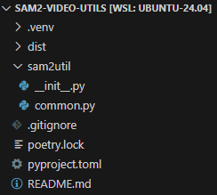

# Python Poetry

```sh
python3 -m vevn .venv
. ./.venv/bin/activate
pip install poetry
poetry config virtualenvs.create false
poetry init
poetry config virtualenvs.in-project true
touch README.md
echo $'.venv\ndist' > .gitignore
```



## Utility Commands

```sh
poetry show --tree  # dependencies
poetry config --list
poetry export --output requirements.txt
```

## Testing

```sh
poetry run pytest -v
poetry run python -m unittest discover
```

## PyPi Publishing

[https://python-poetry.org/docs/repositories/#configuring-credentials](https://python-poetry.org/docs/repositories/#configuring-credentials)

```sh
poetry config pypi-token.pypi <my-token>
poetry config pypi-token.testpypi <your-token>
poetry build
poetry publish
```
