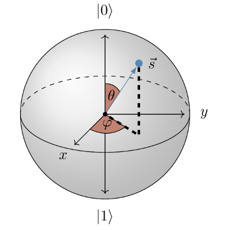

# Quantum Computing (QC)

Any **single-qubit state** can be written as

$$
\begin{align*}
  |\psi\rangle &= \alpha|0\rangle + \beta|1\rangle,\\
  |\alpha|^2 + |\beta|^2 &= 1.
\end{align*}
$$

- $|\psi\rangle$ is a qubit
- $\alpha,\beta\in\mathbb{C}$
  - $\alpha=\Re(\alpha) + \Im(\alpha)$
  - $\beta=\Re(\beta) + \Im(\beta)$
  - $\Rightarrow 4$ dimensional space
- $|0\rangle = \begin{pmatrix}1\\0\end{pmatrix}$
- $|1\rangle = \begin{pmatrix}0\\1\end{pmatrix}$

## Felix Bloch - Bloch Sphere

$$
\begin{align*}
|\psi\rangle &= \cos(\theta/2) e^{i\varphi_{0}}|0\rangle + \sin(\theta/2) e^{i\varphi_{1}}|1\rangle\\
&= e^{i\varphi_{0}}\left(\cos(\theta/2) |0\rangle + \sin(\theta/2) e^{i(\varphi_{1}-\varphi_{0})}|1\rangle\right)
\end{align*}
$$

$\vec{s}$ is called the **Bloch vector**.
