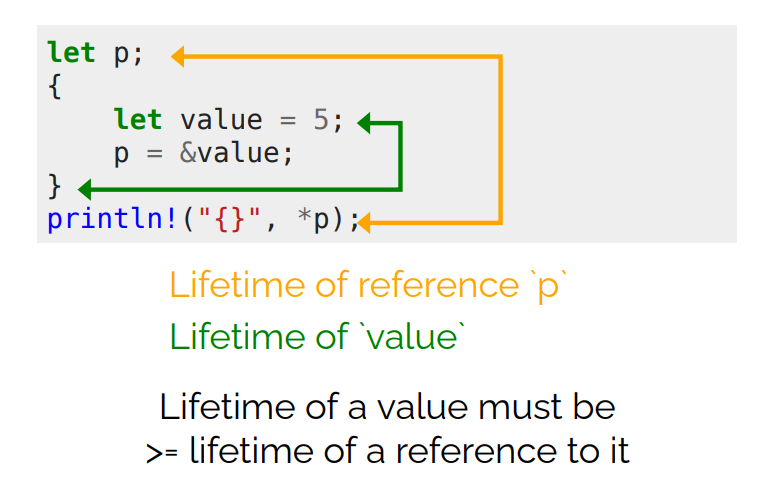

# Rust

Motto: *"Safety, concurrency and speed."*

- [1. Cargo](#1-cargo)
- [2. Variables](#2-variables)
  - [2.1. Shadowing](#21-shadowing)
  - [2.2. Integers](#22-integers)
  - [2.3. Float](#23-float)
  - [2.4. Char and String](#24-char-and-string)
  - [2.5. Tuple](#25-tuple)
  - [2.6. Array](#26-array)
- [3. Modules](#3-modules)
- [4. Control Flow](#4-control-flow)
  - [4.1. Conditions](#41-conditions)
  - [4.2. Loops](#42-loops)
- [5. Strings](#5-strings)
  - [5.1. String](#51-string)
  - [5.2. Borrowed String Slice](#52-borrowed-string-slice)
- [6. Collections](#6-collections)
  - [6.1. Vector](#61-vector)
  - [6.2. Hash Map](#62-hash-map)
  - [6.3. Other Collections](#63-other-collections)
    - [6.3.1. VecDeque](#631-vecdeque)
    - [6.3.2. LinkedList](#632-linkedlist)
    - [6.3.3. HashSet](#633-hashset)
    - [6.3.4. BinaryHeap](#634-binaryheap)
- [7. Enums](#7-enums)
  - [7.1. Option](#71-option)
  - [7.2. Result](#72-result)
- [8. Closures](#8-closures)
- [9. Concurrency](#9-concurrency)
- [10. Macros](#10-macros)
- [11. Pattern Matching](#11-pattern-matching)
  - [11.1. Irrefutable Patterns](#111-irrefutable-patterns)
  - [11.2. Refutable Patterns](#112-refutable-patterns)
- [12. Sound Code Principles](#12-sound-code-principles)
  - [12.1. Newtype Design Pattern](#121-newtype-design-pattern)
  - [12.2. Encapsulation](#122-encapsulation)
  - [12.3. Product Types and Sum Types](#123-product-types-and-sum-types)
  - [12.4. Typestate Design Pattern](#124-typestate-design-pattern)
  - [12.5. Copy on write (COW)](#125-copy-on-write-cow)
- [13. Memory Safety Principles](#13-memory-safety-principles)
  - [13.1. Ownership](#131-ownership)
  - [13.2. Borrowing](#132-borrowing)
  - [13.3. Lifetimes](#133-lifetimes)
- [14. Traits](#14-traits)
  - [14.1. Binary Relations](#141-binary-relations)
  - [14.2. Trade-offs of Traits and Enums](#142-trade-offs-of-traits-and-enums)
- [15. Heap](#15-heap)
- [16. Reference Counting](#16-reference-counting)
- [17. Closure](#17-closure)

## 1. Cargo

- Build system and package manager.
- Creating new project: `cargo new <project_name>`
- Building: `cargo build`
- Building and running: `cargo run`
- Checking that the project compiles: `cargo check`
- Building for release: `cargo build --release`
- Static checker: `cargo clippy`
- See the code with added Prelude and replaced macros: `cargo expand`

Translation unit in Rust is called a crate and all source files are compiled as a whole. Contrary to C, where for each file, an object file is created and the object files are then linked together to create a binary.

## 2. Variables

### 2.1. Shadowing

```rust
fn main() {
    let x = 5;

    let x = x + 1;

    {
        let x = x * 2;
        println!("The value of x in the inner scope is: {x}");
        // 12 (inner scope)

        let y = 7;
    }

    println!("The value of x is: {x}");
    // 6

    println!("The value of y is: {y}");
    // Compile time error.
    // Variable is dropped when exiting scope.
    // There is no garbage collector. 
}
```

### 2.2. Integers

| Length  | Signed | Unsigned |
|---------|--------|----------|
| 8-bit   | i8     | u8       |
| 16-bit  | i16    | u16      |
| 32-bit  | i32    | u32      |
| 64-bit  | i64    | u64      |
| 128-bit | i128   | u128     |
| arch    | isize  | usize    |

- `isize` and `usize` is architecture dependent (32bit or 64bit)
- `0b` binary
- `0o` octal
- `0x` hexadecimal

### 2.3. Float

- `f32`
- `f64`

### 2.4. Char and String

- Unicode $\rightarrow$ char is four bytes in size

```rust
fn main() {
    let c = 'z'; // single quotes
    let z: char = 'ℤ'; // with explicit type annotation
    let heart_eyed_cat = '😻';
}
```

### 2.5. Tuple

- An inhomogeneous collection with a fixed size. Upper limit of length 12, upon exceeding this values tuples lose some functionality.

```rust
fn main() {
    let tup: (i32, f64, u8) = (500, 6.4, 1);

    let tup = (500, 6.4, 1);

    let (x, y, z) = tup;

    println!("The value of y is: {y}");

    let x: (i32, f64, u8) = (500, 6.4, 1);

    // Access a tuple element directly by using a period.
    let five_hundred = x.0;
    let six_point_four = x.1;
    let one = x.2;

    // Tuple with mutable elements (but fixed size).
    let mut x: (i32, i32) = (1, 2);
    x.0 = 0;
    x.1 += 5;
}
```

### 2.6. Array

- *Fixed* length.
- Allocated on *stack*.
- Can only contain elements of a *single type*.
- Upper limit of length 32, upon exceeding this values arrays lose some functionality.

```rust
let a = [1, 2, 3, 4, 5];
let a: [i32; 5] = [1, 2, 3, 4, 5];
let a = [3; 5];  // [3, 3, 3, 3, 3]

let first = a[0];
let second = a[1];
```

## 3. Modules

```rust
// ./my_utils.rs
pub fn my_util() {
    println!("Hello from util!");
}

// ./lib.rs
pub mod my_utils;  // import file `./my_utils.rs`

pub fn greet() {
    println!("Hello!");
}

// ./main.rs
// `hello` is the name of the cargo project (==> and the name of the library)
use hello::greet;

fn main() {
    greet();
    // or hello::greet(); without the "import" (use)
}
```

## 4. Control Flow

### 4.1. Conditions

```rust
// C way:
if num == 5 {
    msg = "five";
} else if num == 4 {
    msg = "four";
} else {
    msg = "other";
}

// Rustacean way:
// `if` is an expression, "return"
// values inside must be of the same type!
msg = if num == 5 {
    "five" // no `;` "return value"
} else if num == 4 {
    "four"
} else {
    "other"
}; // mandatory `;` marks end of an expression

// There is no ternary operator, but since
// if is an expression, we can write:
num = if condition {} else {};
```

### 4.2. Loops

```rust
let my_range: Range<i32> = 1..10;
let my_range_inc: Range<i32> = 1..=10;
```

```rust
// Unconditional loop
'my_loop: loop {
    loop {
        // Break the named loop
        break 'my_loop;
        // Break the inner-most loop
        break;
    }
}
```

```rust
let a = loop {
    // do stuff
    break 5  // assign 5 to `a` (no `;`)
}
```

```rust
while condition {
    // do stuff
}
```

```rust
for num in [1,2,3].iter() {
    // do stuff with `num`
}

for (x,y) in array.iter() {
    // do stuff with `x` and `y`
}

for i in 0..50 {
    // <0,50)
}

for i in 0..=50 {
    // <0,50>
}
```

## 5. Strings

- UTF-8
- Cannot be indexed by position without using an iterator. Why? Because UTF-8 characters have variable length from 1 to 4 bytes.
- Indexing on standard library collections is always *constant*, but this wouldn't be the case for UTF-8 strings.

```rust
word.nth(index);
word.bytes()[index]; // ok for ASCII (English text)
word.chars()[index]; // scalers (symbols including separate diacritics)
// unicode-segmentation::graphemes(word) ...package to extract graphemes
```


### 5.1. String

- modifiable

```rust
let msg = String::from("Hello!");
let fruit Vec<String> = vec!["apple".to_string(), "banana".to_string()];
```


### 5.2. Borrowed String Slice

- cannot be modified


## 6. Collections

### 6.1. Vector

- Generic type `Vec<T>`

```rust
let mut v: Vec<i32> = Vec::new();
v.push(7);
let x = v.pop();
v.push(1);
println!("{}", v[0]);

let mut v = vec![1, 2, 3];
```

### 6.2. Hash Map

- Generic type `HashMap<K,V>`
- Insert, look up, and remove in $\mathcal{O}(1)$.

```rust
let mut dict: HashMap<u8, bool> = HashMap::new();
h.insert(42, true);
h.insert(7, false);
```

### 6.3. Other Collections

#### 6.3.1. VecDeque

- Ring buffer implementing double ended queue.
- Front, back $\mathcal{O}(1)$ (everything else is worse).

#### 6.3.2. LinkedList

- Fast add and remove, otherwise slow.

#### 6.3.3. HashSet

- Set operations.

#### 6.3.4. BinaryHeap

- "Priority queue".
- Pops off the max values.

## 7. Enums

```rust
// Example
enum Item {
    Empty,
    Ammo(u8),  // single type
    Things(String, i32),  // tuple
    Place {x: i32, y: i32},  // anonymous struct
}
```

### 7.1. Option

- Standard library `enum`.

```rust
// Standard library definition.
enum Option<T> {
    Some<T>,
    None,
}
```

```rust
if let Some(x) = my_optional_var {
    println!("value of `my_optional_var` is {}", x);
}

// Branches must be exhaustive - for all cases.
// All branch arms must either return nothing
// or return the same type.
match my_optional_var {
    Some(x) => {
        println!("value is {}", x);
    },
    None(x) => {
        println!("none");
    },
}

match my_optional_var {
    // "default" - match anything
    _ => {
        println!("who cares");
    },
}


let mut x = None;
x = Some(5);
x.is_some();
x.is_none();
```

### 7.2. Result

```rust
// Standard library definition.
#[must_use]
enum Result<T, E> {
    Ok(T),
    Err(E),
}
```

```rust
use std::fs::File;

fn main() {
    let res = File::open("foo");

    let f = res.unwrap(); // Result or crash
    let f = res.expect("Custom error message for a crash.");

    if res.is_ok() {
        let f = res.unwrap(); // Result
    }

    // Full pattern matching
    match res {
        Ok(f) => { /* stuff with `f` */ };
        Err(e) => { /* stuff with `e` */ };
    }
}
```

## 8. Closures

- **Anonymous function** that can borrow or capture data from its scope.
- Syntax: `|x, y| { x + y}` ...parameter list without type annotations followed by function body.
- Technically, this is also a closure `|| {}`.
- Closure will, by default, borrow a value (take a reference). It can also capture a value (assume an ownership) using `move || {/* do stuff */}`.

```rust
let add = |x, y| {x + y};
add(1, 2);  // returns 3
```

```rust
let mut v = vec![2, 4, 6];
v.iter()
 .map(|x| x * 3)
 .filter(|x| (*x) > 10)
```

## 9. Concurrency

```rust
use std::thread;

fn main() {
    let handle = thread::spawn(|| {
        // closure - "main function of the thread"
    });

    // do stuff simultaneously in the main thread

    // barrier (wait for the thread)
    handle.join().unwrap();
}
```

## 10. Macros

- Macros are inlined in compile time, i.e., a macro is replaced with the code defined in the macro.

## 11. Pattern Matching

### 11.1. Irrefutable Patterns

- Must always match.

```rust
struct Product {
    id: i32,
    name: String,
    price: f32,
    // If we add a new field, we need to update all the pattern matches.
    // If we forget to update one, we get a compile time error.
    // If we didn't use pattern matching, we might forget to update some places.
    // discount: f32,
}

fn foo(
    Product {
        id,
        name,
        price,
    }: Product,
) {
    println!("product id: {}, name: {}, price: {}", id, name, price);
}

fn main() {
    let product = Product {
        id: 123,
        name: "product".to_string(),
        price: 9.99,
    };
    let Product{ id: product_id, price , ..} = product;
    println!("id: {}, price: {}", product_id, price);
    foo(product);

    let my_tuple = (1, 2, 3);
    let (a, b, c) = my_tuple; // irrefutable

    for (a, b, c) in vec![(1, 2, 3), (4, 5, 6)] {
        println!("a: {}, b: {}, c: {}", a, b, c);
    }
}
```

### 11.2. Refutable Patterns

- May not match.
- `if let <pattern> = <expression> { /* do stuff */ }`

```rust
let my_tuple = (true, 2);
if let (true, 2) = my_tuple {
    // matches
    println!("true and 2");
} else {
    // does not match
    println!("not true and 2");
}
```

- `if let struct`

```rust
struct Product {
    id: i32,
    name: String,
    price: f32,
}

let product = Product {
    id: 100,
    name: "product".to_string(),
    price: 9.99,
};

if let Product {id: 0..=100, ..} = product {
    println!("id is between 0 and 100");
}
```

- `while let`

```rust
// while let
let mut my_vec = vec![1, 2, 3];
while let Some(x) = my_vec.pop() {
    println!("{}", x);
}
```

- `let <pattern> = match <expression> { <pattern> => { /* do stuff */ } }`

```rust
let my_tuple = (true, 42);
match my_tuple {
    (true, 2) => {
        println!("true and 2");
    },
    (true, a) | (false, a) => {
        println!("true or false and {}", a);
    },
    // match everything else
    _ => {
        println!("glitch in the matrix");
    },
}
```

## 12. Sound Code Principles

### 12.1. Newtype Design Pattern

What's wrong in this snippet?

```rust
fn get_car_id() -> u32 {
    0
}

fn get_driver_id() -> u32 {
    0
}

fn order_taxi(car_id: u32, driver_id: u32) {}

fn main() {
    let car_id = get_car_id();
    let driver_id = get_driver_id();
    order_taxi(driver_id, car_id);
}
```

The `driver_id` and `car_id` arguments are swapped in the `order_taxi` function call! How can we mitigate hard-to-detect bugs like this? The **Newtype pattern** comes into play!

```rust
struct CarId(u32); // newtype
struct DriverId(u32);

fn get_car_id() -> CarId {
    CarId(0)
}

fn get_driver_id() -> DriverId {
    DriverId(0)
}

fn order_taxi(car_id: CarId, driver_id: DriverId) {}

fn main() {
    let car_id = get_car_id();
    let driver_id = get_driver_id();

    // If we swapped the arguments now,
    // a compile time error would occur.
    order_taxi(car_id, driver_id);
}
```

Another example would be units such as degrees Celsius, meters, kilograms, etc.

```rust
struct Years(i64);

struct Days(i64);

impl Years {
    pub fn to_days(&self) -> Days {
        Days(self.0 * 365)
    }
}


impl Days {
    /// truncates partial years
    pub fn to_years(&self) -> Years {
        Years(self.0 / 365)
    }
}
```

### 12.2. Encapsulation

- Implementation hiding.
- Invariants that cannot be affected from outside of a module.
- Outside of a module (either a single source file or an explicit module block `mod /*name*/ { /*content*/}`), everything is private by default.

```rust
mod email {
    // Invariant ("assumption"): `email` is a valid e-mail address (always)
    pub struct Email {
        // If this field was public, anybody could change it
        // and violate the invariant.
        email: String,
    }

    pub fn create_email(text: String) -> Email {
        assert!(text.contains("@"));
        Email { email: text }
    }
}

fn main() {
    let email = email::create_email("foo".to_string());
}
```

### 12.3. Product Types and Sum Types

- Typically `struct` is a *product type* and `enum` is a *sum type*.

```rust
// Product type
struct Person {
    id: u8,           // 256 options
    is_student: bool, // 2 options
}
// ==> 256 * 2 = 512 options/combinations


// Sum type
enum ComputerState {
    OFF,
    ON(u64), // tuple struct (e.g., uptime)
    SLEEPING { uptime: u64, sleep_time: u64 } // struct
}
```

### 12.4. Typestate Design Pattern

```rust
struct RequestBuilder;
impl RequestBuilder {
    fn http_auth(&self) {}
    fn token_auth(&self) {}
    fn build(&self) {}
}
```

Make sure that `RequestBuilder` is always built with one and only one type of `auth`.

```rust
struct RequestBuilder<Auth> {
    auth: Auth,
}

impl RequestBuilder<()> {
    fn new() -> Self {
        RequestBuilder { auth: () }
    }

    fn http_auth(self) -> RequestBuilder<HttpAuth> {
        RequestBuilder { auth: HttpAuth }
    }

    fn token_auth(self) -> RequestBuilder<TokenAuth> {
        RequestBuilder { auth: TokenAuth }
    }
}

impl RequestBuilder<HttpAuth> {
    fn build(&self) {
        println!("Building with HTTP Auth");
        // Build logic for HTTP auth
    }
}

impl RequestBuilder<TokenAuth> {
    fn build(&self) {
        println!("Building with Token Auth");
        // Build logic for Token auth
    }
}

// Empty struct to represent state for HTTP authentication
struct HttpAuth;

// Empty struct to represent state for Token authentication
struct TokenAuth;

fn main() {
    let builder = RequestBuilder::new();
    let http_builder = builder.http_auth();
    http_builder.build();

    let token_builder = RequestBuilder::new().token_auth();
    token_builder.build();

    // The following would cause a compile error because the default builder cannot call `build`
    // let invalid_builder = RequestBuilder::new();
    // invalid_builder.build();  // ERROR
}
```

Key Points:

1. `RequestBuilder` is generic over an authentication state.
2. Initially, the builder starts in an "empty" state (`RequestBuilder<()>`), which can't call `build`.
3. Calling either `http_auth` or `token_auth` transitions the builder to the appropriate state.
4. The `build` method is only available when the builder is in a valid state, such as `HttpAuth` or `TokenAuth`.

### 12.5. Copy on write (COW)

```rust
use std::borrow::Cow;

// This is equivalent to `Cow` - Copy on write
enum OwnedOrBorrowed<'a> {
    Owned(String),
    Borrowed(&'a str),
}

fn to_upper_if_needed(s: &str) -> OwnedOrBorrowed {
    if s.chars().all(|c| c.is_uppercase()) {
        OwnedOrBorrowed::Borrowed(s)
    } else {
        OwnedOrBorrowed::Owned(s.to_uppercase())
    }
}

// with Cow:
fn to_upper_if_needed_cow(s: &str) -> Cow<str> {
    if s.chars().all(|c| c.is_uppercase()) {
        Cow::Borrowed(s)
    } else {
        Cow::Owned(s.to_uppercase())
    }
}

fn main() {
    let s = "HELLO";
    match to_upper_if_needed(s) {
        OwnedOrBorrowed::Owned(s) => println!("Owned: {}", s),
        OwnedOrBorrowed::Borrowed(s) => println!("Borrowed: {}", s),
    }

    let s = "HELLO";
    let s = to_upper_if_needed_cow(s);
    println!("{}", s);
}
```

## 13. Memory Safety Principles

Memory errors:

- Ouf of bounds access
- Double free
- Use after free
- Dangling pointers
- Null pointer dereference
- ...

Memory errors occur most often when using aliasing together with mutability.

```cpp
std::vector<int> v = {1, 2, 3};
int& p = v[0];
v.push_back(4);

// Undefined behavior (UB):
// `v` was reallocated and `p` is now dangling.
*p = 42;
```

<div class="warning">

Rust solution:

> You can alias or mutate, but not both at the same time (w.r.t. a single variable).

</div>

### 13.1. Ownership

<div class="warning">

- Every value has exactly one owner.
- When the owner goes out of scope, the value is dropped (released).

</div>

### 13.2. Borrowing

- **Immutable/shared** reference: `&T` (multiple at a time)
- **Mutable/unique** reference: `&mut T` (only one at a time)

### 13.3. Lifetimes



## 14. Traits

- Similar to interfaces in other languages.

```rust
trait Animal {
    fn make_sound(&self);
}

#[derive(
    Debug,     // `println!("{:?}", elephant);`
    PartialEq, // for equality comparison
    Hash,
    Default, // `Elephant::default()` - call the default constructor for all fields
)]
struct Elephant {
    name: String,
    age: u32,
}

struct Giraffe {
    name: String,
    age: u32,
}

impl Animal for Elephant {
    fn make_sound(&self) {
        println!("Elephant sound");
    }
}

impl Animal for Giraffe {
    fn make_sound(&self) {
        println!("Giraffe sound");
    }
}

/// `dyn` is short for "dynamic dispatch".
/// I.e., the actual implementation is determined at runtime
/// by looking into the **vtable**.
fn make_sound(animal: &dyn Animal) {
    animal.make_sound();
}

// We don't know the size of the object at compile time.
// Therefore, we need to use a smart pointer to heap.
fn zoo(animals: Vec<Box<dyn Animal>>) {
    for animal in animals {
        animal.make_sound();
    }
}

fn main() {
    let elephant = Elephant {
        name: "Dumbo".to_string(),
        age: 42,
    };
    let giraffe = Giraffe {
        name: "Melman".to_string(),
        age: 7,
    };

    zoo(vec![
        Box::new(Elephant {
            name: "Dumbo".to_string(),
            age: 42,
        }),
        Box::new(Giraffe {
            name: "Melman".to_string(),
            age: 7,
        }),
    ]);
}
```

Dynamic dispatch is necessary, because the actual implementation is determined at runtime. Compiler doesn't know the *actual type and size* of the object at compile time; therefore, the code cannot be "statically generated" at compile time. Instead, **VTABLE** is used to look up the actual implementation at runtime.

### 14.1. Binary Relations

```rust
use std::cmp::{PartialEq, Eq, PartialOrd, Ord};
use std::fmt::{Display, Formatter};

#[derive(Debug, Copy, Clone, PartialEq, Eq)]
struct Vec2D {
    a: u32,
    b: u32,
}

fn main() {
    let v = Vec2D { a: 42, b: 7 };
    let w = Vec2D { a: 42, b: 7 };
    if v == w {
        println!("equal");
    }
    
    // IEEE standard says NaN != NaN
    // => f32 does not implement Eq
    let same = f32::NAN == f32::NAN;
    println!("{:?}", same);
}
```

- `Eq` is rexlexive, symmetric, and transitive.
- `PartialEq` is symmetric and transitive.
- Similarly for `Ord` and `PartialOrd`.

### 14.2. Trade-offs of Traits and Enums

When we have a **fixed** set of types, we can use an `enum`. If we need to add a **new type**, we have to update all the places where the enum is used. Static dispatch.

When we have a **variable** set of types, we can use a `trait`. If we need to add a new type, we only need to implement the trait for the new type. However, if we need to add a **new behavior** (method), we have to update all types that implement the trait. Dynamic dispatch.

## 15. Heap

How to add something to heap?

```rust
let x = Box::new(42);
```

Either large objects or objects with unknown size (e.g., recursive data structures).

## 16. Reference Counting

One object can have multiple owners, when the object is dropped, the reference count is decremented. When the reference count reaches zero, the object is dropped. We cannot mutate the object, because it is shared (aliasing + mutability rule).

```rust
use std::rc::Rc;

struct Person {
    name: String,
}

fn main() {
    let p = Person { name: "Alice".to_string() };
    let p = Rc::new(p);
    let p2 = p.clone(); // shared reference count +1
}
```

Reference counted pointer allows us work with multiple pointers without lifetimes at the cost of a small overhead.

```rust
use std::cell::RefCell;

let c = RefCell::new(String::new());
let ref1 = c.borrow();
let ref2 = c.borrow_mut(); // panic (aliasing + mutability)
```

`RefCell` transfers the responsibility of checking the aliasing + mutability rule to runtime. If the rule is violated, the program panics.

## 17. Closure

- `FnMut` - may mutably borrow a value.
- `FnOnce` - may consumes a value; therefore cannot be called more than once.
- `Fn` - may only immutably borrow a value.
- `Fn` $\subseteq$ `FnOnce` $\subseteq$ `FnMut`

```rust
fn time_code<F: FnOnce(u32) -> ()>(func: F) {
    let start = std::time::Instant::now();
    func(42);
    let duration = start.elapsed();
    println!("Time elapsed: {:?}", duration);
}

fn create_adder(x: u32) -> impl Fn(u32) -> u32 {
    //|y| x + y // captures `x`, `y` may outlive `x`
    move |y| x + y // `struct Closure{x: u32}`
}

fn main() {
    time_code(|x| {
        println!("Hello, world! {}", x);
    });

    let adder = create_adder(42);
    println!("{}", adder(7));
}
```
