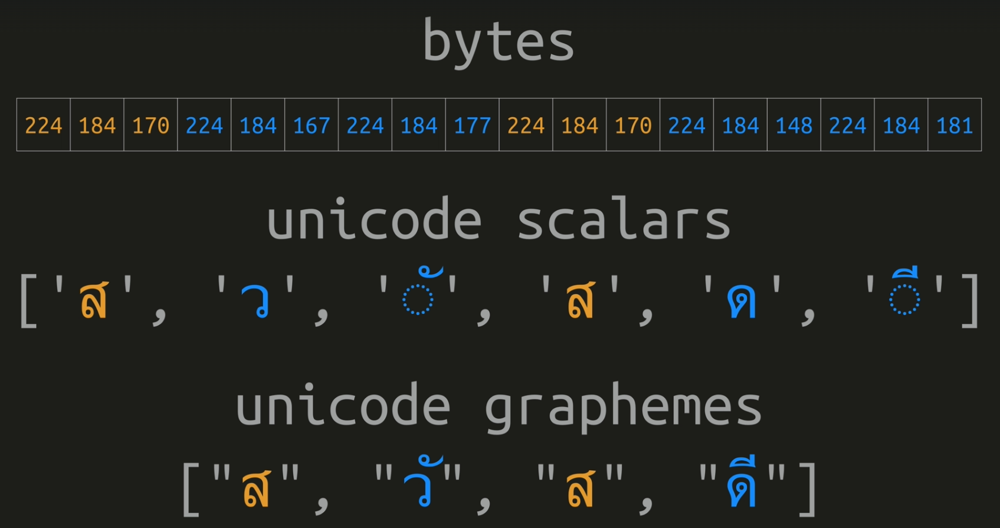
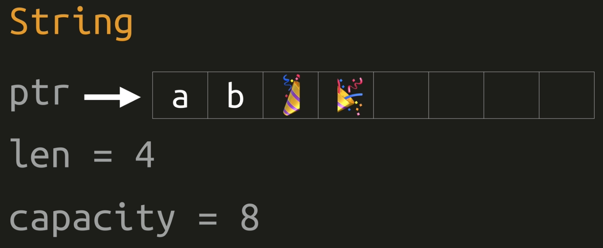
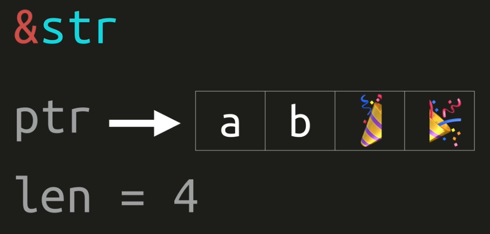

# Rust

Motto: *"Safety, concurrency and speed."*

- [1. Cargo](#1-cargo)
- [2. Variables](#2-variables)
  - [2.1. Shadowing](#21-shadowing)
  - [2.2. Integers](#22-integers)
  - [2.3. Float](#23-float)
  - [2.4. Char and String](#24-char-and-string)
  - [2.5. Tuple](#25-tuple)
  - [2.6. Array](#26-array)
- [3. Modules](#3-modules)
- [4. Control Flow](#4-control-flow)
  - [4.1. Conditions](#41-conditions)
  - [4.2. Loops](#42-loops)
- [5. Strings](#5-strings)
  - [5.1. String](#51-string)
  - [5.2. Borrowed String Slice](#52-borrowed-string-slice)
- [6. Collections](#6-collections)
  - [6.1. Vector](#61-vector)
  - [6.2. Hash Map](#62-hash-map)
  - [6.3. Other Collections](#63-other-collections)
    - [6.3.1. VecDeque](#631-vecdeque)
    - [6.3.2. LinkedList](#632-linkedlist)
    - [6.3.3. HashSet](#633-hashset)
    - [6.3.4. BinaryHeap](#634-binaryheap)
- [7. Enums](#7-enums)
  - [7.1. Option](#71-option)
  - [7.2. Result](#72-result)
- [8. Closures](#8-closures)
- [9. Concurrency](#9-concurrency)

## 1. Cargo

- Build system and package manager.
- Creating new project: `cargo new <project_name>`
- Building: `cargo build`
- Building and running: `cargo run`
- Checking that the project compiles: `cargo check`
- Building for release: `cargo build --release`
- Static checker: `cargo clippy`

## 2. Variables

### 2.1. Shadowing

```rust
fn main() {
    let x = 5;

    let x = x + 1;

    {
        let x = x * 2;
        println!("The value of x in the inner scope is: {x}");
        // 12 (inner scope)

        let y = 7;
    }

    println!("The value of x is: {x}");
    // 6

    println!("The value of y is: {y}");
    // Compile time error.
    // Variable is dropped when exiting scope.
    // There is no garbage collector. 
}
```

### 2.2. Integers

| Length  | Signed | Unsigned |
|---------|--------|----------|
| 8-bit   | i8     | u8       |
| 16-bit  | i16    | u16      |
| 32-bit  | i32    | u32      |
| 64-bit  | i64    | u64      |
| 128-bit | i128   | u128     |
| arch    | isize  | usize    |

- `isize` and `usize` is architecture dependent (32bit or 64bit)
- `0b` binary
- `0o` octal
- `0x` hexadecimal

### 2.3. Float

- `f32`
- `f64`

### 2.4. Char and String

- Unicode $\rightarrow$ char is four bytes in size

```rust
fn main() {
    let c = 'z'; // single quotes
    let z: char = 'ℤ'; // with explicit type annotation
    let heart_eyed_cat = '😻';
}
```

### 2.5. Tuple

- An inhomogeneous collection with a fixed size. Upper limit of length 12, upon exceeding this values tuples lose some functionality.

```rust
fn main() {
    let tup: (i32, f64, u8) = (500, 6.4, 1);

    let tup = (500, 6.4, 1);

    let (x, y, z) = tup;

    println!("The value of y is: {y}");

    let x: (i32, f64, u8) = (500, 6.4, 1);

    // Access a tuple element directly by using a period.
    let five_hundred = x.0;
    let six_point_four = x.1;
    let one = x.2;

    // Tuple with mutable elements (but fixed size).
    let mut x: (i32, i32) = (1, 2);
    x.0 = 0;
    x.1 += 5;
}
```

### 2.6. Array

- *Fixed* length.
- Allocated on *stack*.
- Can only contain elements of a *single type*.
- Upper limit of length 32, upon exceeding this values arrays lose some functionality.

```rust
let a = [1, 2, 3, 4, 5];
let a: [i32; 5] = [1, 2, 3, 4, 5];
let a = [3; 5];  // [3, 3, 3, 3, 3]

let first = a[0];
let second = a[1];
```

## 3. Modules

```rust
// ./my_utils.rs
pub fn my_util() {
    println!("Hello from util!");
}

// ./lib.rs
pub mod my_utils;  // import file `./my_utils.rs`

pub fn greet(str) {
    println!("Hello!");
}

// ./main.rs
use hello::greet;

fn main() {
    greet();
    // or hello::greet(); without the "import" (use)
}
```

## 4. Control Flow

### 4.1. Conditions

```rust
// C way:
if num == 5 {
    msg = "five";
} else if num == 4 {
    msg = "four";
} else {
    msg = "other";
}

// Rustacean way:
// `if` is an expression, "return"
// values inside must be of the same type!
msg = if num == 5 {
    "five" // no `;` "return value"
} else if num == 4 {
    "four"
} else {
    "other"
}; // mandatory `;` marks end of an expression

// There is no ternary operator, but since
// if is an expression, we can write:
num = if condition {} else {};
```

### 4.2. Loops

```rust
// Unconditional loop
'my_loop: loop {
    loop {
        // Break the named loop
        break 'my_loop;
        // Break the inner-most loop
        break;
    }
}
```

```rust
while condition {
    // do stuff
}
```

```rust
for num in [1,2,3].iter() {
    // do stuff with `num`
}

for (x,y) in array.iter() {
    // do stuff with `x` and `y`
}

for i in 0..50 {
    // <0,50)
}

for i in 0..=50 {
    // <0,50>
}
```

## 5. Strings

- UTF-8
- Cannot be indexed by position without using an iterator. Why? Because UTF-8 characters have variable length from 1 to 4 bytes.
- Indexing on standard library collections is always *constant*, but this wouldn't be the case for UTF-8 strings.

```rust
word.nth(index);
word.bytes()[index]; // ok for ASCII (English text)
word.chars()[index]; // scalers (symbols including separate diacritics)
// unicode-segmentation::graphemes(word) ...package to extract graphemes
```



### 5.1. String

- modifiable

```rust
let msg = String::from("Hello!");
let fruit Vec<String> = vec!["apple".to_string(), "banana".to_string()];
```



### 5.2. Borrowed String Slice

- cannot be modified



## 6. Collections

### 6.1. Vector

- Generic type `Vec<T>`

```rust
let mut v: Vec<i32> = Vec::new();
v.push(7);
let x = v.pop();
v.push(1);
println!("{}", v[0]);

let mut v = vec![1, 2, 3];
```

### 6.2. Hash Map

- Generic type `HashMap<K,V>`
- Insert, look up, and remove in $\mathcal{O}(1)$.

```rust
let mut dict: HashMap<u8, bool> = HashMap::new();
h.insert(42, true);
h.insert(7, false);
```

### 6.3. Other Collections

#### 6.3.1. VecDeque

- Ring buffer implementing double ended queue.
- Front, back $\mathcal{O}(1)$ (everything else is worse).

#### 6.3.2. LinkedList

- Fast add and remove, otherwise slow.

#### 6.3.3. HashSet

- Set operations.

#### 6.3.4. BinaryHeap

- "Priority queue".
- Pops off the max values.

## 7. Enums

```rust
// Example
enum Item {
    Empty,
    Ammo(u8),  // single type
    Things(String, i32),  // tuple
    Place {x: i32, y: i32},  // anonymous struct
}
```

### 7.1. Option

- Standard library `enum`.

```rust
// Standard library definition.
enum Option<T> {
    Some<T>,
    None,
}
```

```rust
if let Some(x) = my_optional_var {
    println!("value of `my_optional_var` is {}", x);
}

// Branches must be exhaustive - for all cases.
// All branch arms must either return nothing
// or return the same type.
match my_optional_var {
    Some(x) => {
        println!("value is {}", x);
    },
    None(x) => {
        println!("none");
    },
}

match my_optional_var {
    // "default" - match anything
    _ => {
        println!("who cares");
    },
}


let mut x = None;
x = Some(5);
x.is_some();
x.is_none();
```

### 7.2. Result

```rust
// Standard library definition.
#[must_use]
enum Result<T, E> {
    Ok(T),
    Err(E),
}
```

```rust
use std::fs::File;

fn main() {
    let res = File::open("foo");

    let f = res.unwrap(); // Result or crash
    let f = res.expect("Custom error message for a crash.");

    if res.is_ok() {
        let f = res.unwrap(); // Result
    }

    // Full pattern matching
    match res {
        Ok(f) => { /* stuff with `f` */ };
        Err(e) => { /* stuff with `e` */ };
    }
}
```

## 8. Closures

- **Anonymous function** that can borrow or capture data from its scope.
- Syntax: `|x, y| { x + y}` ...parameter list without type annotations followed by function body.
- Technically, this is also a closure `|| {}`.
- Closure will, by default, borrow a value (take a reference). It can also capture a value (assume an ownership) using `move || {/* do stuff */}`.

```rust
let add = |x, y| {x + y};
add(1, 2);  // returns 3
```

```rust
let mut v = vec![2, 4, 6];
v.iter()
 .map(|x| x * 3)
 .filter(|x| (*x) > 10)
```

## 9. Concurrency

```rust
use std::thread;

fn main() {
    let handle = thread::spawn(|| {
        // closure - "main function of the thread"
    });

    // do stuff simultaneously in the main thread

    // barrier (wait for the thread)
    handle.join().unwrap();
}
```
