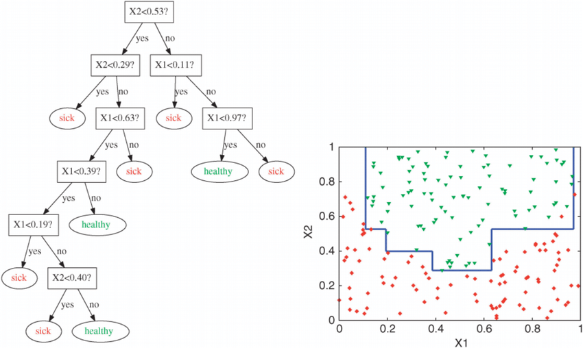
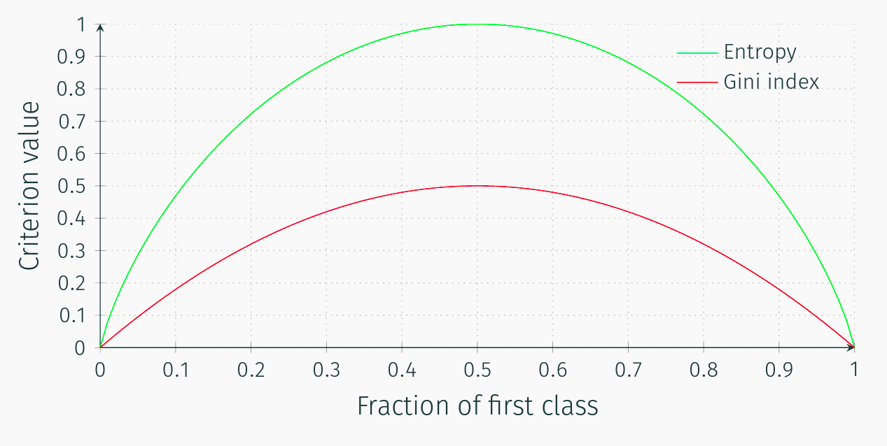
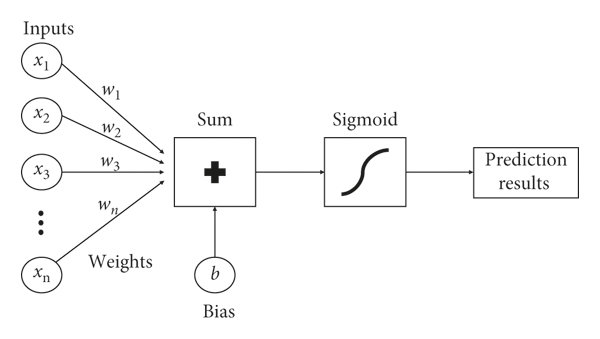

# Strojové učení

- [1. Dolování častých vzorů (Frequent Itemset Mining)](#1-dolování-častých-vzorů-frequent-itemset-mining)
  - [1.1. Apriori algoritmus](#11-apriori-algoritmus)
- [2. Explorativní datová analýza (EDA)](#2-explorativní-datová-analýza-eda)
  - [2.1. Typy dat](#21-typy-dat)
  - [2.2. Normalizace](#22-normalizace)
- [3. Shlukování](#3-shlukování)
  - [3.1. Algoritmy založené na reprezentantech](#31-algoritmy-založené-na-reprezentantech)
    - [3.1.1. K-median](#311-k-median)
    - [3.1.2. K-means](#312-k-means)
    - [3.1.3. K-medoids](#313-k-medoids)
    - [3.1.4. Affinity Propagation](#314-affinity-propagation)
  - [3.2. Hierarchické shlukování - Bottom up](#32-hierarchické-shlukování---bottom-up)
  - [3.3. Top down](#33-top-down)
  - [3.4. Shlukovací algoritmy založené na hustotě (Density-based Clustering)](#34-shlukovací-algoritmy-založené-na-hustotě-density-based-clustering)
    - [3.4.1. DBSCAN](#341-dbscan)
    - [3.4.2. DENCLUE](#342-denclue)
  - [3.5. Interní validace shlukování](#35-interní-validace-shlukování)
    - [3.5.1. SSE](#351-sse)
    - [3.5.2. Intra-cluster to Inter-cluster distance ratio](#352-intra-cluster-to-inter-cluster-distance-ratio)
    - [3.5.3. Silhouette Coefficient](#353-silhouette-coefficient)
  - [3.6. Externí validace shlukování](#36-externí-validace-shlukování)
  - [3.7. Interpretace shlukování](#37-interpretace-shlukování)
  - [3.8. Škálovatelné shlukování](#38-škálovatelné-shlukování)
  - [3.9. SOM - Self-Organizing Maps](#39-som---self-organizing-maps)
- [4. Detekce odlehlých hodnot (outlier detection)](#4-detekce-odlehlých-hodnot-outlier-detection)
  - [4.1. Extrémní hodnoty](#41-extrémní-hodnoty)
- [5. Redukce dimenze](#5-redukce-dimenze)
  - [5.1. Feature Selection](#51-feature-selection)
  - [5.2. Dimension Reduction](#52-dimension-reduction)
  - [5.3. PCA](#53-pca)
  - [5.4. SVD](#54-svd)
  - [5.5. Non-negative Matrix Factorization (NMF or NNMF)](#55-non-negative-matrix-factorization-nmf-or-nnmf)
- [6. Klasifikace](#6-klasifikace)
  - [6.1. Rozhodovací strom (Decision Tree)](#61-rozhodovací-strom-decision-tree)
    - [6.1.1. Ensemble metody](#611-ensemble-metody)
  - [6.2. Naïve Bayes Classifier](#62-naïve-bayes-classifier)
  - [6.3. SVM](#63-svm)
    - [6.3.1. Kernelovské metody](#631-kernelovské-metody)
  - [6.4. Hodnocení klasifikace](#64-hodnocení-klasifikace)
  - [6.5. Logistická regrese](#65-logistická-regrese)
- [7. Neural Networks (NN)](#7-neural-networks-nn)
- [8. Ensemble metody](#8-ensemble-metody)
  - [8.1. Bagging/Boostrapping](#81-baggingboostrapping)
  - [8.2. Boosting](#82-boosting)
  - [8.3. Gradient Boosted Decision Trees](#83-gradient-boosted-decision-trees)
- [9. XGBoost](#9-xgboost)
  - [9.1. Bias Variance Tradeoff](#91-bias-variance-tradeoff)
  - [9.2. Classification and Regression Trees (CART)](#92-classification-and-regression-trees-cart)
- [10. Hluboké učení](#10-hluboké-učení)
  - [10.1. Autoencoder](#101-autoencoder)
  - [10.2. Variational Autoencoder](#102-variational-autoencoder)
  - [10.3. CNN](#103-cnn)
  - [10.4. RNN](#104-rnn)
    - [10.4.1. Text Embedding](#1041-text-embedding)
    - [10.4.2. Word2Vec](#1042-word2vec)
      - [10.4.2.1. Continuous bag-of-words model](#10421-continuous-bag-of-words-model)
      - [10.4.2.2. Continuous skip-gram model](#10422-continuous-skip-gram-model)
    - [10.4.3. BERT](#1043-bert)
    - [10.4.4. Attention vrstva](#1044-attention-vrstva)
- [11. Miscellaneous](#11-miscellaneous)
  - [11.1. Precision/Recall Tradeoff](#111-precisionrecall-tradeoff)
  - [11.2. Batch size](#112-batch-size)

## 1. Dolování častých vzorů (Frequent Itemset Mining)

- Matice transakcí $T \times N$

### 1.1. Apriori algoritmus

Algoritmus Apriori funguje na základě hledání častých množin položek v souboru transakčních dat. Časté množiny položek jsou množiny položek, které se v transakcích vyskytují společně s četností větší nebo rovnou stanovenému minimálnímu prahu podpory (support).

>Rymon Tree
>
>

## 2. Explorativní datová analýza (EDA)

EDA odpovídá prvotnímu průzkumu dat - hledání vzorů, anomálií, testy hypotéz, kontrola předpokladů (e.g., normální rozdělení), souhrné statistiky

### 2.1. Typy dat

1. Numerická data
2. Kategorická data
   - příznak náleží do nějaké (konečné) množiny hodnot/tříd
   - předzpracování:
     - binarizace
     - ordinal encoding
     - one-hot encoding (dummy encoding) $\rightarrow$ je vhodné kódovat třeba $0.1$ místo jedničky, protože to může silně ovlivnit výpočty vzdáleností
     - embedding (e.g., word2vec)
     - algorithmic encoding (cyklické příznaky - třeba dny v týdnu)
3. Textová data
4. Škálování / normalizace dat

### 2.2. Normalizace

1. **Min-max**
$$x'=\frac{x-\min{x}}{\max{x}-\min{x}}$$
$$x'=a+\frac{(x-\min{x})(b-a)}{\max{x}-\min{x}}$$
2. **Škálování průměrem** $x'=\frac{x-\mu}{\max{x}-\min{x}}$
3. **Standardizace** $z=\frac{x - \mu}{\sigma}$
4. **Nelineární** transformace (mocninná / logaritmická)
   - **Box-Cox** - pouze pro (striktně) kladné hodnoty
   - **Yeo-Johnson**

## 3. Shlukování

1. Algoritmy založené na reprezentantech
2. Hierarchické shlukování
3. Shlukovací algoritmy založené na hustotě

Co dělat s kategoriálními daty? Například histogram hodnot, modus.

### 3.1. Algoritmy založené na reprezentantech

- L2 norma, p-norma
- kosinová vzdálenost
- Mahalanobis distance - zohledňuje rozdělení v každé dimenzi (měla by být více robustní)
- tvoří disjunktní shluky
- reprezentant obecně v datech neexistuje

#### 3.1.1. K-median

- Manhattan distance
- optimální reprezentant pro každý shluk je medián podle všech dimenzí v daném shluku
  
#### 3.1.2. K-means

- sférické shluky
- k-means++
- SSE
- rozděluje prostor - Voronói diagram

Význam **cosine distance** ve výsledném shlukování:

- Podívám se, kde je bod (0,0) a představím si jednotkovou kružnici. Zajímají mě výšeče jednotkové kružnice.

#### 3.1.3. K-medoids

- reprezentant je vždy jeden ze záznamů z datasetu ("nevymýšlí si")
- škálovatelná implementace - algoritmy CLARA a CLARANS

#### 3.1.4. Affinity Propagation

- reprezentant je vždy jeden ze záznamů z datasetu ("nevymýšlí si")
- není nutné předem specifikovat počet clusterů
- je to **deterministický algoritmus**
- funkce podobnosti/vzdálenosti nemusí být symetrická nemusí splňovat ani trojúhelníkovou nerovnost
- message passing algorithm for exemplar clustering
- $N$ bodů dimenze $M$
- $S^{N\times N}$ - similarity matrix
  - $S_{i,j} = - \langle x_i - x_j, x_i - x_j \rangle$ ...eukleidovská norma na druhou $\lVert\star\rVert^2$ mezi i-tým a j-tým bodem
- $R^{N\times N}$ - responsibility matrix
- $A^{N\times N}$ - accessibility matrix
- $C^{N\times N}$ - criterion matrix
  - $C = R + A$

Cílem algoritmu *Affinity Propagation* je maximalizovat výraz $\sum\limits_{i=1}^N\text{sim}(x_i,\psi(x_i))$, kde $x_n$ je *data point* a $\psi(x_i)$ je reprezentant $x_i$ (*examplar*). Tzn. maximalizujeme podobnost mezi body a jejich reprezentanty, ke kterým jsou přiřazeny.

1) Inicializace $R$ a $A$ na nulové matice $R=A=\mathbf{0}^{N\times N}$ a stanovení maximálního počtu iterací.
2) Prvně se aktualizuje matice R (paralelismus přes batche řádků).
   - $R_{i,j} = S_{i,j}-\max\limits_{k\neq j}(A_{i,k}+S_{i,k})$
   - Matice $R$ vyjadřuje jak vhodný je reprezentant $j$ pro bod $i$

    ```python
    for i<N:
      for j<N:
        sums = []
        for k<N:
          if k != j:
            sums.append(A[i][k] + S[i][k])
        R[i][j] =  S[i][j] - max(sums)
    ```

3) (barrier do dokončení výpočtu 1) Poté se aktualizuje matice A (závisou na předchozím spočítání matice R)
   - cross-availability: $A_{i,j} = \min\left\{0,R_{j,j}+\sum\limits_{k\neq i,j}\max\{0, R_{k,j}\}\right\}$
   - self-availability: $A_{j,j} = \sum\limits_{k\neq j}\max\{0, R_{k,j}\}$
   - Matice $A$ vyjadřuje, jak vhodný je reprezentant $j$ pro bod $i$ v porovnání s ostatními možnými reprezentanty.
4) $C = R + A$
5) Po ukončení:
   - $\psi(x_i) = \argmax\limits_{j=1,...,N}C_{i,j}$

### 3.2. Hierarchické shlukování - Bottom up

- tvoří disjunktní shluky
- single linkage, complete linkage
- [vizualizace](https://matteucci.faculty.polimi.it/Clustering/tutorial_html/hierarchical.html)

>Linkage Types
>
>

### 3.3. Top down

- Bisecting K-means

### 3.4. Shlukovací algoritmy založené na hustotě (Density-based Clustering)

- triviální řešení - ekvidistatní mrížka - exponenciální složitost
  - Grid ranges $p$
  - Density threshold $\tau$

#### 3.4.1. DBSCAN

- podobné mřížce
- obdélníkové oblasti jsou nahrazeny $$sférickými oblastmi$$ s definovaným poloměrem $\mathbf{Eps}$
- density threshold $\tau$
- [vizualizace](https://www.naftaliharris.com/blog/visualizing-dbscan-clustering/)
- využívá *kD-Tree* ke zrychlení prohlédávání prostoru ("rozděluje k-dimenzionální prostor" - space-partitioning data structure)
- krok č.1: určení jádra, okolí a šumu

#### 3.4.2. DENCLUE

- vytváří model hustoty bodů, volí centroidy v místech s největší hustotou
- gradientní metoda, krok ve směru růstu hustoty

### 3.5. Interní validace shlukování

- SSE and silhuette curve are examples of internal criteria
- external criteria use labels (gini index, entropy)

#### 3.5.1. SSE

- metrika pro sférické shluky (complete linkage, $k$-means)
- minimální pro $X=C$
- snažíme se ji
- $\boxed{SSE=\sum\limits_{X\in\mathcal{C}}dist(X,C)^2}$

#### 3.5.2. Intra-cluster to Inter-cluster distance ratio

- Calinski-Harabasz
- Davies-Bouldin

#### 3.5.3. Silhouette Coefficient

- "poměr vzdálenosti bodu od centroidu v rámci shluku vůči vzdálenostem k ostatním shlukům"
- Snažíme se Silhouette Coefficient maximalizovat
- "silueta"

### 3.6. Externí validace shlukování

- porovnání s target variable
- **gini index, entropie**
- porovnání různých shlukovacích algoritmů - confusion matrix

### 3.7. Interpretace shlukování

- K-means...shluk je reprezentován průměrem
- DBSCAN...složitější interpretace

### 3.8. Škálovatelné shlukování

- CLARA, CLARANS
- BIRCH - kombinace hierarchického shlukování a $k$-means
  - používá CF-strom

### 3.9. SOM - Self-Organizing Maps

- shlukování pomocí neuronových sítí

## 4. Detekce odlehlých hodnot (outlier detection)

- čištění dat - odlehlá hodnota může být šum
- platební podvody - např. platba 1000€ z Hongkongu bude českou bankou nejspíše zablokována

### 4.1. Extrémní hodnoty

- na základě hustoty (jako DBSCAN, ale hledají se oblasti, které nejsou "husté")
- Mahalanobis distance

## 5. Redukce dimenze

- curse of dimensionality - vzdálenosti ve vyšších dimenzích se stávají podobnými a je těžké vzdálenost rozlišit
- často jsou příznaky korelované

### 5.1. Feature Selection

- výběr příznaků např. na základě entropie, rozptylu, korelace

### 5.2. Dimension Reduction

- Hledání optimálního mapování mezi původní dimenzí a cílovou (nižší) dimenzí.
- Každá nová dimenze je lineární/nelineární kombinací původních příznaků.

### 5.3. PCA

- "vlastní čísla vyjadřují důležitost dané dimenze"
- speciální případ SVD

### 5.4. SVD

Buď $\mathbf{A}\in\mathbb{R}^{m\times n}$ libovolná matice. Pak existují ortogonální matice  $\mathbf{U}\in\mathbb{R}^{m\times m}$, $\mathbf{V}\in\mathbb{R}^{n\times n}$ a diagonální matice $\mathbf{S}\in\mathbb{R}^{m\times n}$ takové, že
$$\boxed{\mathbf{A}=\mathbf{USV}^T,}$$
kde $\mathbf{U}$ obsahuje levé singulární vektory, $\mathbf{S}$ obsahuje singulární hodnoty a $\mathbf{V}^T$ obsahuje pravé singulární vektory.

### 5.5. Non-negative Matrix Factorization (NMF or NNMF)

## 6. Klasifikace

- NFLT - pokud algoritmus funguje velmi dobře na nějakém problém, určitě bude nějaký jiný problém, kde dobře fungovat nebude

### 6.1. Rozhodovací strom (Decision Tree)

- rozhodovací strom by měl být první volba u klasifikačních problémů, často se používá jako základní (baseline) model
- dekompozice problému - princip rozděl a panuj
- nejjednodušší metoda dělí rozhodovací rovinu (decision plane) vertikálními a horizontálními dělícími přímkami

>Decision Plane
>
>

- kritéria rozdělení (split criteria)
  - Error rate
  - Gini index
  - Entropie

- rozhodovací strom se vždy naučí overfittuje na trénovací množině
- na testovací množině (hold-out/test set) lze postupně provádět prořezávání (pruning) - odstraňování listových uzlů
- metody založené na rozhodovacích stromech **nepotřebují žádné předzpracování dat**, protože berou každý atribut (feature) zvlášť
- cyklus přes atributy a jejich hodnoty
- rozhodovací strom v principu provádí feature selection a řekne nám, které features jsou nebo nejsou důležité

  

- pro pomíchaná data - poměr $0.5$ vyjde gini index i entropie maximální - obojí se snažíme minimalizovat

#### 6.1.1. Ensemble metody

- už jsou hůře vysvětlitelné, ale můžou naznačit, které atributy jsou globálně nejdůležitější

### 6.2. Naïve Bayes Classifier

- *předpokládá nezávislost náhodných jevů* - nezávislost příznaků (features)
- slovníky pro jednotlivé kategorie/třídy a počítání četností
- je schopný pracovat s kategoriálnímu i textovými daty (před "AI" to byl hlavní nástroj pro detekci spamu)
- snadná interpretace

### 6.3. SVM

- see applet [libsvm](https://www.csie.ntu.edu.tw/~cjlin/libsvm/)!
- maximalizace marginu mezi daty ze dvou tříd $\rightarrow$ hledání dělící nadroviny
- lineární SVM není nic přelomového - existují efektivnější metody pro hledání dělící přímky/nadroviny - např. logistická regrese
- výhoda SVM je v možnosti používat různé kernel funkce - lineární, polynomiální, Gaussian RBF (Radial Basis Function) $K(x,y)=e^{-\dfrac{\lVert x-y \rVert_{2}^{2}}{2\sigma^2}}$, sigmoid, exponenciální, laplacian $\longrightarrow$ **kernel trick**
  - v praxi se používá lineární, polynomiální a Gaussian RBF kernel
- obecně složitost $\mathcal{O}(n^2)$ $\longrightarrow$ pomalé pro velké množství dat (ale např. random forest není o moc rychlejší)
- $C$...jak moc vadí, že se body překrývají
- $\gamma$...do jaké vzdálenosti se dívám
- ve vyšších dimenzích to **není interpretovatelný** model

#### 6.3.1. Kernelovské metody

- pokud někde pracuji se skalárním součinem, tak můžu použít kernel funkci

### 6.4. Hodnocení klasifikace

- $ACC = \dfrac{TP+TN}{TP+TN+FP+FN}$

### 6.5. Logistická regrese

Pro jednoduchost binární klasifice ve 2D. Rovnice přímky lze vyjádřit jako $w_1x_1+w_2x_2+b = 0 \iff y = ax+b$. Přímka tvoří rozhodovací hranici $a = w_1x_1+w_2x_2+b$,

$$
\begin{align*}
\text{if } a \geq 0 &\longrightarrow \text{predict } 1 \text{ "pozitivní část roviny"}\\
\text{if } a < 0 &\longrightarrow \text{predict } 0 \text{ "negativní část roviny"}
\end{align*}
$$

Jedná se o tzv. *step function*


Kvůli difencovatelnosti se používá **sigmoid** $\boxed{\sigma(a)=\dfrac{1}{1+e^{-a}}}$.


Rozhodovací rovina se změní na:

$$
\begin{align*}
\text{if } \sigma(a) \geq 0.5 &\longrightarrow \text{predict } 1 \text{ "pozitivní část roviny"}\\
\text{if } \sigma(a) < 0.5 &\longrightarrow \text{predict } 0 \text{ "negativní část roviny"}
\end{align*}
$$

Když aplikujeme funckci sigmoid na lineání regresi, tak tento model nazýváme **logistická regrese**. Argument funkce sigmoid se nazývá *logit* nebo *activation*. Sigmoid se také někdy interpretuje jako podmíněná pravděpodobnost.

$$\boxed{\mathcal{P}(y=1 \mid \mathbf{x}) = \sigma\left(\sum\limits_{d=1}^{D}w_{d}x_{d}+b\right) = \sigma(\mathbf{w}^T\mathbf{x}+b) = \dfrac{1}{1+e^{-\mathbf{w}^T\mathbf{x}-b}}}$$



- pozn. $\mathbf{w}^T\mathbf{x}+b=0$ je rovnice nadroviny (*hyperplane*)
- základní logistická regrese je limitovaná na hledání lineárního rozdělení prostoru (jako lineární SVM)
- problém logistické regrese je řešitelný metodou *gradient descent*

## 7. Neural Networks (NN)

- [Neural Network Tensorflow Playground](https://playground.tensorflow.org/)
- Ve vrstvě může být více neuronů. Buď $M$ počet neuronů, potom pro každý neuron $z_m$ platí $z_m = \sigma(\mathbf{w}_m^T\mathbf{x}+b_m)$, což lze vektorizovat jako $\mathbf{z} = \sigma(\mathsf{W}^T\mathbf{x}+\mathbf{b})$, kde $\mathsf{W}\in\mathbb{R}^{D\times M}$, $\mathbf{z}\in\mathbb{R}^{M}$, and $\mathbf{x}\in\mathbb{R}^{D}$
- NN vychází z logistické regrese, pro dvou-vrstvou NN získáme rozhodovací hranici: $\mathsf{W}^{(2)T}\sigma\left(\mathsf{W}^{(1)T}x+b^{(1)}\right)+b^{(2)} = \mathsf{W}^{(2)T}\mathbf{z}^{(1)}+\mathbf{b}^{(2)}$, kde horní index $^{(l)}$ odpovídá $l$-té vrstvě z $L$.

## 8. Ensemble metody

- obecně random foresty nelze přeučit kvůli stochastickému dělení dat

### 8.1. Bagging/Boostrapping

- různá data pro různé stromy
- Random Forest

### 8.2. Boosting

- AdaBoost

### 8.3. Gradient Boosted Decision Trees

- LightGBM
- CatBoost
- XGBoost

## 9. XGBoost

- [Extreme Gradient Boostring](https://xgboost.readthedocs.io/en/stable/tutorials/model.html) (or on [GitHub](https://github.com/dmlc/xgboost/blob/82d846bbeb83c652a0b1dff0e3519e67569c4a3d/doc/tutorials/model.rst))

In order to train the model, we need to define the objective function to measure how well the model fit the training data. The objective functions consists of two parts - **training loss** and **regularization term**:

$$
\text{obj}(\theta) = L(\theta) + \Omega(\theta),
$$

where $\theta$ are model parameters, $L(\theta)$ is the training loss function, and $\Omega(\theta)$ is the regularization term.

### 9.1. Bias Variance Tradeoff


The regularization term controls the complexity of the model, which helps us to avoid overfitting. The general principle is we want both a simple and predictive model.

### 9.2. Classification and Regression Trees (CART)

- classification and regression trees (CART)


$$
\hat{y}_i = \sum_{k=1}^K f_k(x_i), f_k \in \mathcal{F},
$$

where $K$ is the number of trees, $f_k$ is a function in the functional space $\mathcal{F}$, and $\mathcal{F}$ is the set of all possible CARTs. The objective function to be optimized is given by

$$
\text{obj}(\theta) = \sum_i^n l(y_i, \hat{y}_i) + \sum_{k=1}^K \omega(f_k),
$$

where $\omega(f_k)$ is the complexity of the tree $f_k$, defined in detail later.

## 10. Hluboké učení

### 10.1. Autoencoder

Učení probíhá v režimu komprese (vytvoří se latentní vektor) a následné dekomprese. Autoencoder není vhodný pro klasifikaci. Proč? Encoder se snaží co nejlépe komprimovat vstup, prvky vytvořeného latentního vektoru ("features") nerozlišují mezi různými třídami vstupů (komprimují celý prostor trénovací množiny).

- Komprese (např. textu).
- One Class Classification - informace, jesti model dříve daná data viděl.
- Detekce outlierů.
- Denoising.


### 10.2. Variational Autoencoder

- Fungují na základě skládání vícerozměrných normálních rozdělení a větě o úplné pravděpodobnosti $\mathcal{P}(x)=\int \mathcal{P}(x|z)\mathcal{P}(z)\mathrm{d} x$
- $\mathcal{P}(x|z)$ je modelované pomocí vícerozměrného normálního rozdělení $\mathcal{N}(\mu, \Sigma)$.
- Používají se dvě ztrátové funkce - podobnost na úrovní pixelů a podobnost distribuce se standardním normálním rozdělení pomocí KLD:

$$
D_\text{KL}\left(
    \mathcal{N}\left(\left(\mu_1, \ldots, \mu_k\right)^\mathsf{T}, \operatorname{diag} \left(\sigma_1^2, \ldots, \sigma_k^2\right)\right) \parallel
    \mathcal{N}\left(\mathbf{0}, \mathbf{I}\right)
  \right) \\=
  {1 \over 2} \sum_{i=1}^k \left(\sigma_i^2 + \mu_i^2 - 1 - \ln\left(\sigma_i^2\right)\right).
$$


### 10.3. CNN

By definition a confusion matrix $C$ is such that  $C_{i,j}$  is equal to the number of observations known to be in group $i$ and predicted to be in group $j$.

- Conv1D - např. zpracování signálu, časové řady
- Conv2D - standardně obrázky
- Conv3D - lidar, video, hloubkový obraz

**Convolution increases depth**; thus, if you start with a grayscale image with `depth=1` and apply Conv2D layer with 32 filters, output will have the depth of 32.

**Pooling reduces width and height**, but depth stays the same.

Keras example:

```python
model = keras.Sequential([
    # Encoder - feature engineering
    keras.layers.Conv2D(32, (3,3), activation='relu', input_shape=(32, 32, 3)),
    keras.layers.MaxPooling2D((2, 2)),
    keras.layers.Conv2D(16, (3,3), activation='relu'),
    # Decoder - fully connected network (classification)
    keras.layers.Flatten(),
    keras.layers.Dense(64, activation='relu'),
    keras.layers.Dense(class_count, activation='softmax')
])
```

```text
_________________________________________________________________
 Layer (type)                Output Shape              Param #   
=================================================================
 conv2d (Conv2D)             (None, 30, 30, 32)        896       
                                                                 
 max_pooling2d (MaxPooling2  (None, 15, 15, 32)        0         
 D)                                                              
                                                                 
 conv2d_1 (Conv2D)           (None, 13, 13, 16)        4624      
                                                                 
 flatten (Flatten)           (None, 2704)              0         
                                                                 
 dense (Dense)               (None, 64)                173120    
                                                                 
 dense_1 (Dense)             (None, 10)                650     
```

- Weights of the convolutional layers are concentrated in the convolution masks.

### 10.4. RNN

- Proč potřebujeme RNN? Berou v potaz **kontext** (mají "paměť"), což je nezbytné např. pro zpracování textu nebo pro časově závislé sekvence. Např. **sentiment analysis**.
- RNN jsou náchylné na *vanishing gradient problem*.
- RNN jsou schopné zpracovávat sekvence libovolné konečné délky. Používá se **backpropagation through time**.
- RNN nelze paralelizovat a trénovat pomocí grafických akcelerátorů $\Rightarrow$ výpočetně náročné.


- $h_i$ ...hidden state

#### 10.4.1. Text Embedding

- Každému slovu odpovídá jeden vektor.
- Embeddingem rozumíme matici, kde jeden řádek odpovídá jednomu slovu.

```python
# Dimension of embedded representation (for words)
embedding_dim = 128

# Number of unique tokens in vocabulary
vocab_size = 10000

# Output dimension after vectorizing
# (how long sequences do we have?
#  e.g. tweets are on average 100 character)
sequence_length = 30
```

Speciální tokeny:

- `''` - empty token
- `[UNK]` - unknown token (not included in the training corpus)

GRU, LSTM:

- Usually we don't stack multiple recurrent layers (LSTM, GRU) - susceptible to vanishing gradient.
- LSTM is more complicated but less prone to underfitting compared to GRU.
- LSTM is often used together with `RMSprop`.

Why should we use **pre-trained embeddings**?

Often, the embeddings are trained on **large corpuses** (e.g. Wikipedia); therefore, the final quality should be better (better context). However, for **specialized domains** (e.g., *medicine* or *law*) we would need to choose an appropriate embedding or train our own.

#### 10.4.2. Word2Vec

- Používá sliding-window.
- Pro kvalitní embedding je potřeba velké množství dat - alespoň desítky tisíc vět. Např. jedna knížka nestačí (není tam dostatek kontextu).

##### 10.4.2.1. Continuous bag-of-words model

- predicts the middle word based on surrounding context words.
- the context consists of a few words before and after the current (middle) word.
- this architecture is called a bag-of-words model as the **order of words in the context is not important**.

##### 10.4.2.2. Continuous skip-gram model

- predicts words within a certain range before and after the current word in the same sentence.
- window size 2 corresponds to two words before a given word and 2 words behind it.

#### 10.4.3. BERT

- Bidirectional Encoder Representations from Transformers (BERT)
- Čte kontext slova z obou stran.
- Při inferenci lze nastavit **teplotu**. Vyšší teplota znamená vyšší randomizaci. Např. pro bing chat lze taky nastavit různé úrovně...

#### 10.4.4. Attention vrstva

- Myšlenka je taková, že to, co není důležité, můžeme zahodit. Naopak *důležité* věci si zapamatujeme.
- Attention vrstva potlačuje *forget gate*. V principu nastavuje váhy tokenů po *bidirectional LSTM* vrstvě.
- *Self-attention* - v rámci řetězce se vypočte *attention* vůči všem tokenům.

## 11. Miscellaneous

### 11.1. Precision/Recall Tradeoff

Pokud chceme vyšší *recall* na úkor *precision*, tak obvykle zvolíme jiný **threshold**:

```py
threshold = 0.5
y_pred = [1 if x >= threshold else 0 for x in y_pred]
```

### 11.2. Batch size

What's the advantage of a larger batchsize? Higher speed.

Why? Backpropagation is not computed as many times (bottleneck).
