# Teoretická informatika (TI)

- [1. Výpočetní modely](#1-výpočetní-modely)
  - [1.1. Automaty](#11-automaty)
    - [1.1.1. Deterministický konečný automat](#111-deterministický-konečný-automat)
    - [1.1.2. Nedeterministický konečný automat](#112-nedeterministický-konečný-automat)
    - [1.1.3. Zobecněný nedeterministický konečný automat](#113-zobecněný-nedeterministický-konečný-automat)
    - [1.1.4. Aplikace](#114-aplikace)
  - [1.2. Bezkontextové jazyky](#12-bezkontextové-jazyky)
  - [1.3. Zásobníkový automat](#13-zásobníkový-automat)
  - [1.4. Chomského hierarchie](#14-chomského-hierarchie)
  - [1.5. Turingův stroj](#15-turingův-stroj)
    - [1.5.1. Church-Turingova teze](#151-church-turingova-teze)
    - [1.5.2. Binární Turingův stroj](#152-binární-turingův-stroj)
    - [1.5.3. Turingovsky úplné jazyky](#153-turingovsky-úplné-jazyky)
    - [1.5.4. Simulace mezi variantami Turingových strojů](#154-simulace-mezi-variantami-turingových-strojů)
  - [1.6. Stroj RAM](#16-stroj-ram)
  - [1.7. Graf řídícího toku](#17-graf-řídícího-toku)
  - [1.8. Minského stroj](#18-minského-stroj)
  - [1.9. Konfigurace jako data](#19-konfigurace-jako-data)
- [2. Rozhodovací problémy](#2-rozhodovací-problémy)
  - [2.1. Nerozhodnutelné problémy](#21-nerozhodnutelné-problémy)
    - [2.1.1. Halting problem](#211-halting-problem)
    - [2.1.2. Kachličkování roviny](#212-kachličkování-roviny)
  - [2.2. Částečně rozhodnutelné problémy](#22-částečně-rozhodnutelné-problémy)
  - [2.3. Doplňkové problémy](#23-doplňkové-problémy)
  - [2.4. Postova věta](#24-postova-věta)
  - [2.5. Riceova věta](#25-riceova-věta)
- [3. Převody mezi problémy](#3-převody-mezi-problémy)
- [4. Složitost algoritmů](#4-složitost-algoritmů)
  - [4.1. Turingův stroj](#41-turingův-stroj)
  - [4.2. RAM stroj](#42-ram-stroj)
  - [4.3. Časová a prostorová složitost](#43-časová-a-prostorová-složitost)
  - [4.4. Asymptotická notace](#44-asymptotická-notace)
  - [4.5. Vzorce](#45-vzorce)
  - [4.6. Analýza rekurzivních algoritmů](#46-analýza-rekurzivních-algoritmů)
  - [4.7. Práce s velkými čísly](#47-práce-s-velkými-čísly)
- [5. Třídy složitosti](#5-třídy-složitosti)
  - [5.1. Vztahy mezi třídami složitosti](#51-vztahy-mezi-třídami-složitosti)
  - [5.2. Horní a dolní odhady složitosti problémů](#52-horní-a-dolní-odhady-složitosti-problémů)
- [6. Nedeterminismus](#6-nedeterminismus)
  - [6.1. Nedeterministické třídy složitosti](#61-nedeterministické-třídy-složitosti)
- [7. NP úplnost](#7-np-úplnost)
  - [7.1. SAT problém](#71-sat-problém)
- [8. PS úplnost](#8-ps-úplnost)
  - [8.1. Generalized Geography (GG)](#81-generalized-geography-gg)
- [9. Paralelní algoritmy](#9-paralelní-algoritmy)
  - [9.1. Parallel Random Access Machine (PRAM)](#91-parallel-random-access-machine-pram)

**Teoretická informatika** je vědní obor na pomezí mezi matematikou a informatikou. Zkoumá

- obecné otázky týkající se algoritmů,
- formalismy pro popis algoritmů,
- syntaxi a sémantiku formálních jazyků a další.

**Algoritmus** — mechanický postup, jak něco spočítat. Algoritmy slouží k řešení různých problémů. Konkrétní vstup nějakého problému se nazývá **instance** problému.

V zadání problému musí být určeno:

- co je množinou možných vstupů,
- co je množinou možných výstupů,
- jaký je vztah mezi vstupy a výstupy.

<div class="warning">

Algoritmický problém je trojice $(\text{IN}$, $\text{OUT}$ a $R)$, kde

- $\text{IN}$ je množina možných vstupů,
- $\text{OUT}$ je množina možných výstupů
- a $R$ $\subseteq$ $\text{IN}$ $\times$ $\text{OUT}$ je relace přiřazující každému vstupu možné odpovídající výstupy.
    $$(\forall x \in \text{IN})(\exists y\in\text{OUT}):R(x,y)$$

</div>

Problémům, kde množina výstupů je `{Ano/Ne}` se říká **rozhodovací problémy**.

**Optimalizační problém** je hledání nejlepšího řešení v množině různých řešení podle daného kritéria.

Problém je **řešitelný** právě tehdy, když existuje algoritmus, který pro libovolný přípustný vstup vrátí správný výstup v konečném čase.

Algoritmus **řeší** daný problém, pokud:

1. Se pro *každý vstup* po *konečném* počtu kroků *zastaví*.
2. Pro *každý vstup* vydá *správný výstup*.

**Korektnost algoritmu** — ověření toho, že daný algoritmus skutečně řeší daný problém.

**Výpočetní složitost algoritmu**:

- **Časová složitost** — jak závisí doba výpočtu na velikosti vstupu.
- **Paměťová (prostorová) složitost** — jak závisí množství použité paměti na velikosti vstupu.

> **(Formální) jazyk** $L$ v abecedě $\Sigma$ je libovolná podmnožina množiny $\Sigma^*$, tj. $L\subseteq\Sigma^*$, kde
>
> - abeceda $\Sigma$ je *neprázdná* *konečná* množina symbolů,
> - slovo je *konečná* sekvence symbolů abecedy $\Sigma$,
> - jazyk je množina slov,
> - množina všech slov abecedy se označuje $\Sigma^*$.
>
> $L^+=L\cdot L^* = \bigcup\limits_{k\geq1}L^k$

U algoritmických problémů často předpokládáme, že vstupy i výstupy jsou kódovány slovy z nějaké abecedy. Např. pro popis grafu můžeme kódovat seznam vrcholů a hran:

$$(1,2,3,4,5),((1,2),(2,4),(4,3),(3,1),(2,5),(4,5))$$

## 1. Výpočetní modely

**Konfigurace** je popis stavu stroje v nějakém okamžiku výpočtu.

Výpočet stroje $M$, provádějícího algoritmus `Alg`, kde zpracovává vstup $w$, je **posloupnost konfigurací**.

- Začíná se v *počáteční konfiguraci*.
- Každým krokem stroj přechází z jedné konfigurace do další.
- Výpočet končí v *koncové konfiguraci*.

### 1.1. Automaty

#### 1.1.1. Deterministický konečný automat

>Deterministický konečný automat (DKA/DFA) je pětice $(Q, \Sigma, \delta, q_0, F)$, kde
>
>- $Q$ je *neprázdná konečná* množina stavů,
>- $\Sigma$ je abeceda (*neprázdná konečná* množina symbolů),
>- $\delta : Q \times \Sigma \rightarrow Q$ je přechodová funkce, tzn. dvojici (stav, symbol) přiřadí stav,
>- $q_0 \in Q$ je počáteční stav,
>- $F \subseteq Q$ je množina přijímajících stavů.
>
>DFA má pouze konečnou paměť. Např. není schopný vyřešit **parity problem** (kontrola uzavřených závorek).

#### 1.1.2. Nedeterministický konečný automat

Nedeterministický konečný automat (NKA/NFA) se od DKA liší *množinou počátečních stavů* $I\subset Q$ a přechodovou funkcí

$$\delta : Q \times \Sigma \rightarrow \mathcal{P}(Q),$$

kde $\mathcal{P}$ je potenční množina.

#### 1.1.3. Zobecněný nedeterministický konečný automat

Zobecněný nedeterministický konečný automat (ZNKA) se od NKA liší jen přechodovou funkcí

$$\delta : Q \times (\Sigma\cup\{\varepsilon\}) \rightarrow \mathcal{P}(Q).$$

#### 1.1.4. Aplikace

1. Převod konečného automatu na regulární výraz

    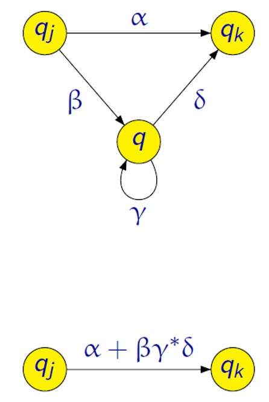

2. Zřetězení jazyků

    

3. Iterace jazyků

    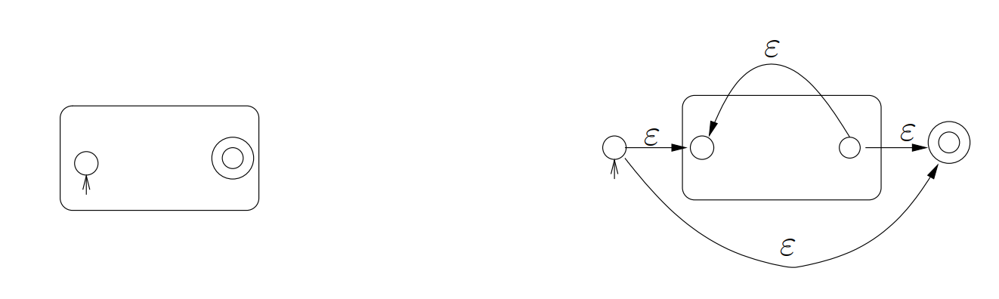

4. Sjednocení jazyků

    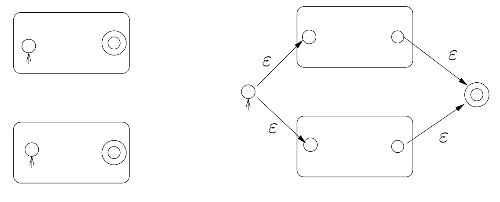

### 1.2. Bezkontextové jazyky

> Bezkontextová gramatika (CFG) je definována jako uspořádaná čtveřice $G = (\Pi, \Sigma, S, P)$, kde:
>
> - $\Pi$ je konečná množina *neterminálních symbolů* (neterminálů),
> - $\Sigma$ je konečná množina *terminálních symbolů* (terminálů), přičemž $\Pi \cap \Sigma = \emptyset$,
> - $S \in \Pi$ je *počáteční* (startovací) *neterminál*,
> - $P$ je konečná množina *pravidel* typu $A \rightarrow β$, kde:
>   - $A$ je neterminál, tedy $A \in \Pi$,
>   - $β$ je řetězec složený z terminálů a neterminálů, tedy $β \in (\Pi \cup \Sigma)^*$.

Pokud je jazyk regulární, tak je bezkontextový.

### 1.3. Zásobníkový automat

> Zásobníkový automat (ZA/SA) $M$ je definován jako šestice $M = (Q, \Sigma, \Gamma, \delta, q_0, Z_0)$, kde:
>
> - $Q$ je konečná neprázdná množina *stavů*,
> - $\Sigma$ je konečná neprázdná množina *vstupních symbolů* (vstupní abeceda),
> - $\Gamma$ je konečná neprázdná množina *zásobníkových symbolů* (zásobníková abeceda),
> - $q_0 \in Q$ je *počáteční stav*,
> - $Z_0 \in \Gamma$ je *počáteční zásobníkový symbol* a
> - $\delta$ je zobrazení množiny $Q \times (\Sigma \cup \{\epsilon\}) \times \Gamma$ do množiny všech konečných podmnožin množiny $Q \times \Gamma^*$.

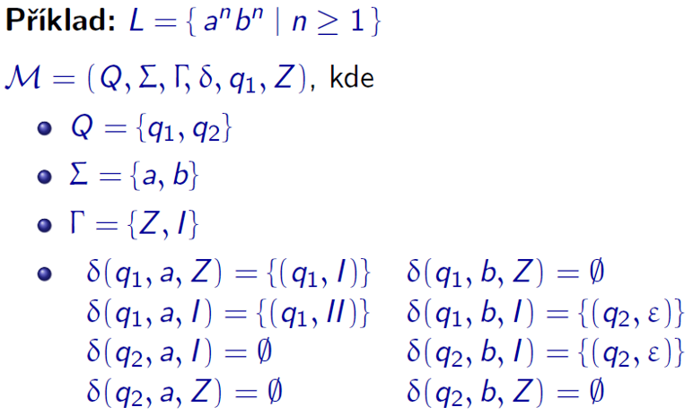

Alternativní zkrácený zápis:

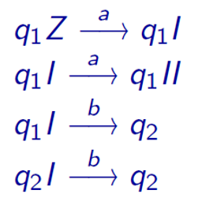

($Z$ jako začátek, $I$ jako čítač symbolů $a$ na zásobníku. Slovo příjmá prázdným zásobníkem.)

<div class="warning">

**Ekvivalence bezkontextových gramatik a zásobníkových automatů.**

Ke každé bezkontextové gramatice $G$ lze sestrojit ekvivalentní (nedeterministický) zásobníkový automat. Navíc ke každému ZA lze sestrojit ekvivalentní bezkontextovou gramatiku.

</div>

### 1.4. Chomského hierarchie

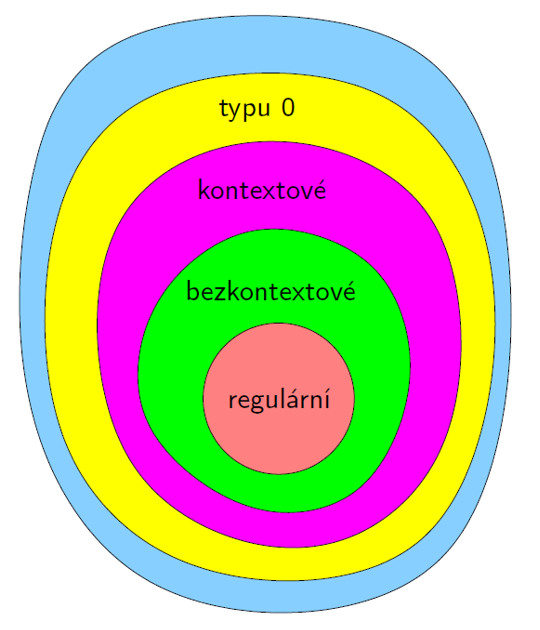

- **Typ 0 - rekurzivně spočetné** jazyky:
  - obecné generativní gramatiky
  - Turingovy stroje (deterministické, nedeterministické)

- **Typ 1 - kontextové** jazyky:
  - kontextové gramatiky
  - nedeterministické lineárně omezené automaty

- **Typ 2 - bezkontextové** jazyky:
  - bezkontextové gramatiky
  - nedeterministické zásobníkové automaty

- **Typ 3 - regulární** jazyky:
  - regulární gramatiky
  - konečné automaty (deterministické, nedeterministické)
  - regulární výrazy

### 1.5. Turingův stroj

> Formálně je **Turingův stroj** definován jako šestice $\mathcal{M} = (Q, \Sigma, \Gamma, \delta, q_0, F)$ kde:
>
> - $Q$ je *konečná neprázdná* množina **stavů**.
> - $\Gamma$ je *konečná neprázdná* množina **páskových symbolů** (pásková abeceda).
> - $\Sigma \subseteq \Gamma$ je *konečná neprázdná* množina **vstupních symbolů** (vstupní abeceda).
> - $\delta : (Q \setminus F) \times \Gamma \to Q \times \Gamma \times \{-1, 0, +1\}$ je **přechodová funkce**.
> - $q_0 \in Q$ je **počáteční stav**.
> - $F \subseteq Q$ je množina **konečných stavů**.
>
> Předpokládáme, že v $\Gamma\setminus\Sigma$ je vždy speciální prvek $\square$ označující prázdný znak.

Oproti zásobníkovému automatu umožňuje navíc:

- pohyb "hlavy" oběma směry,
- možnost zápisu na "pásku" na aktuální pozici "hlavy",
- "páska" je *nekonečná*.

Příklad *přechodové funkce*: $\boxed{\delta(q_1, b)=(q_2,x,+1)}$. Jsem ve stavu $q_1$ a na pásce je znak $b$. Přejdu do stavu $q_2$, přepíšu znak na pásce na $x$ a posunu se na pásce o jedno pole doprava.

**Konfigurací Turingova stroje** je trojice $(q, w, i)$, kde:

- $q$ je stav řídící jednotky,
- $w$ je obsah pásky (resp. pásek) a
- $i$ je pozice hlavy (resp. hlav) na pásce.

Jazyk $L\subseteq\Sigma^*$ je TM **přijímán** $\iff$ $\forall w\in L$ existuje posloupnost konfigurací, která končí v koncovém stavu $q_{acc}$. (Výpočet nad slovy mimo $L$ může být nekonečný nebo může skončit ve stavu $q_{rej}$).

Jazyk $L\subseteq\Sigma^*$ je TM **rozpoznán** $\iff$ $\forall w\in L \Rightarrow q_{acc} \,\,\wedge\,\, \forall w\in \{\Sigma^* \setminus L\} \Rightarrow q_{rej}$.

#### 1.5.1. Church-Turingova teze

> Každý algoritmus lze realizovat Turingovým strojem.

<div class="warning">

Převod problému:

1. Program ve vyšším programovacím jazyce
2. Graf řídícího toku
3. Stroj RAM
4. Vícepáskový Turingův stroj
5. Jednopáskový Turingův stroj

</div>

#### 1.5.2. Binární Turingův stroj

- Binární Turingův stroj pracuje s omezenou páskovou abecedou $\Gamma = \{0, 1, \square\}$.
- Reprezentuje všechny Turingovy stroje, protože každý Turingův stroj s libovolnou abecedou lze lze simulovat binárním Turingůvým strojem.
- Symboly libovolné abecedy můžeme zakódovat řetězci $0$ a $1$ s *pevnou* délkou.

#### 1.5.3. Turingovsky úplné jazyky

Jazykům (resp. strojům), které jsou dostatečně obecné na to, aby se do nich (resp. do jejich instrukcí) daly přeložit programy napsané v libovolném jiném programovacím jazyce, se říká **Turingovsky úplné**.

#### 1.5.4. Simulace mezi variantami Turingových strojů

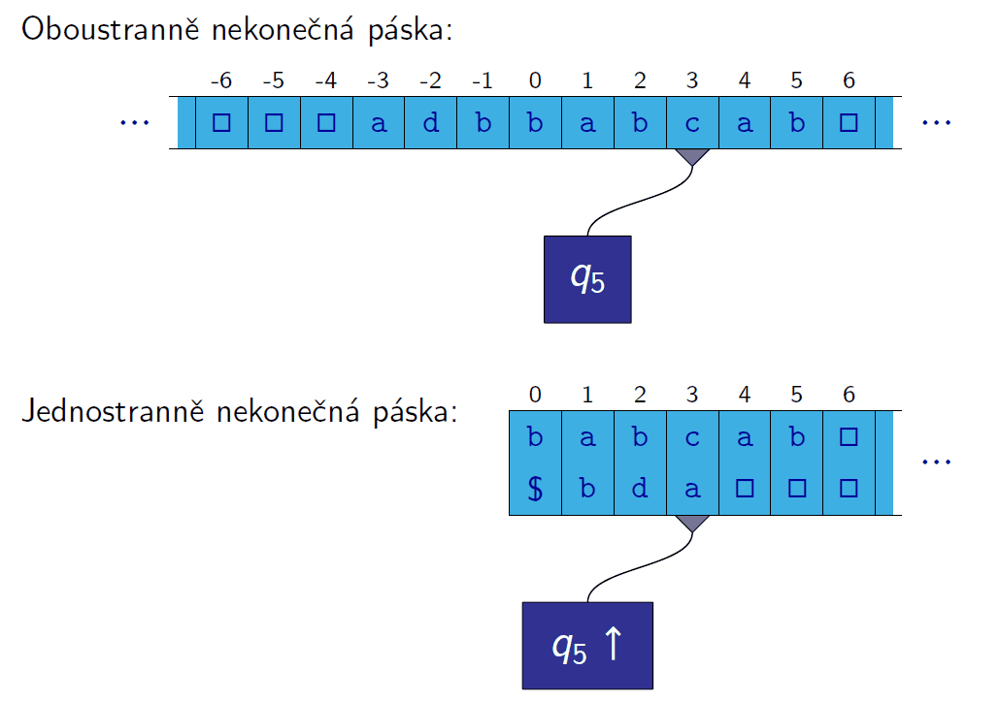

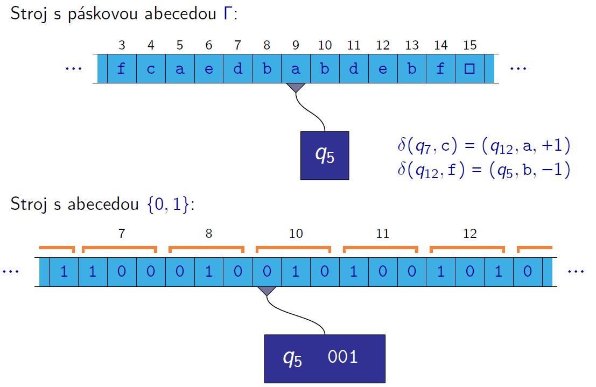

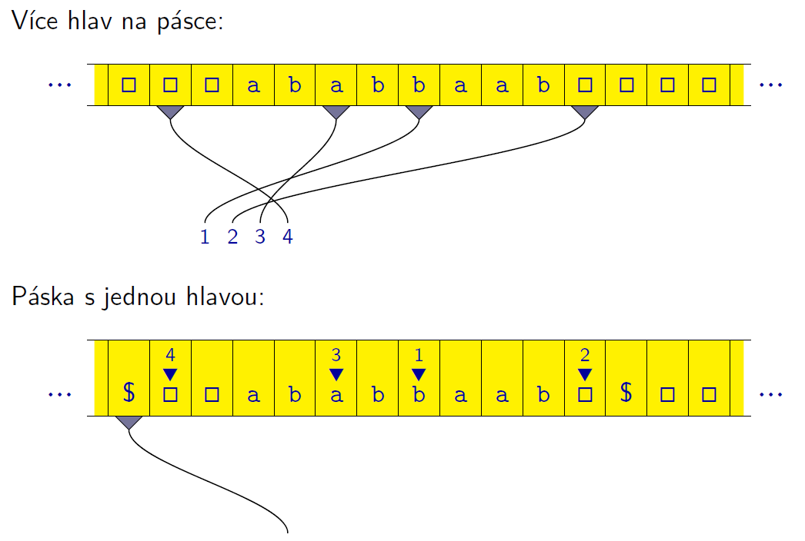

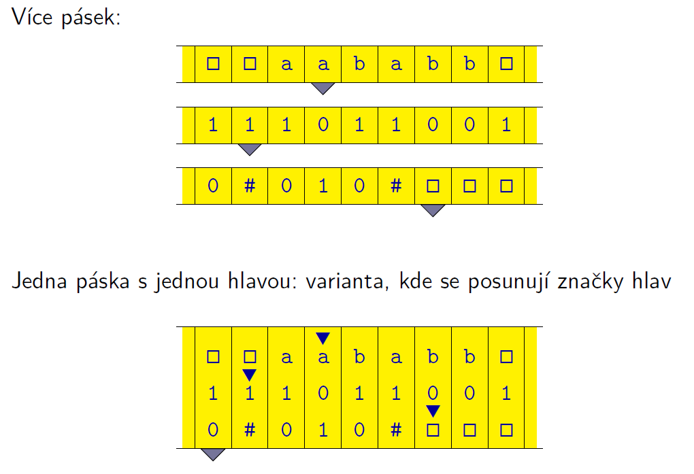

### 1.6. Stroj RAM

**Stroj RAM (Random Access Machine)** je idealizovaný model počítače. Skládá se z těchto částí:

- **Programová jednotka** – obsahuje **program** stroje RAM a **ukazatel** na právě prováděnou instrukci.
- **Pracovní paměť** – tvořená buňkami očíslovanými $0, 1, 2, \dots$
  - Značíme $R_0, R_1, R_2, \dots$  
  - Obsah buněk je možné číst i do nich zapisovat.
  - Pracovní paměť je nekonečná.
- **Vstupní páska** – z ní je možné pouze číst.
- **Výstupní páska** – na ni je možné pouze zapisovat.

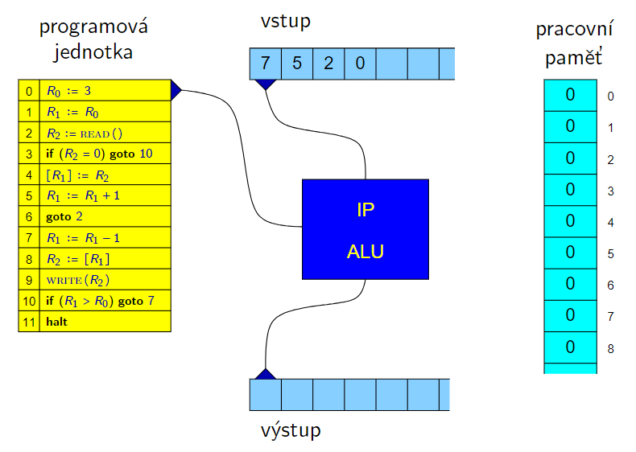
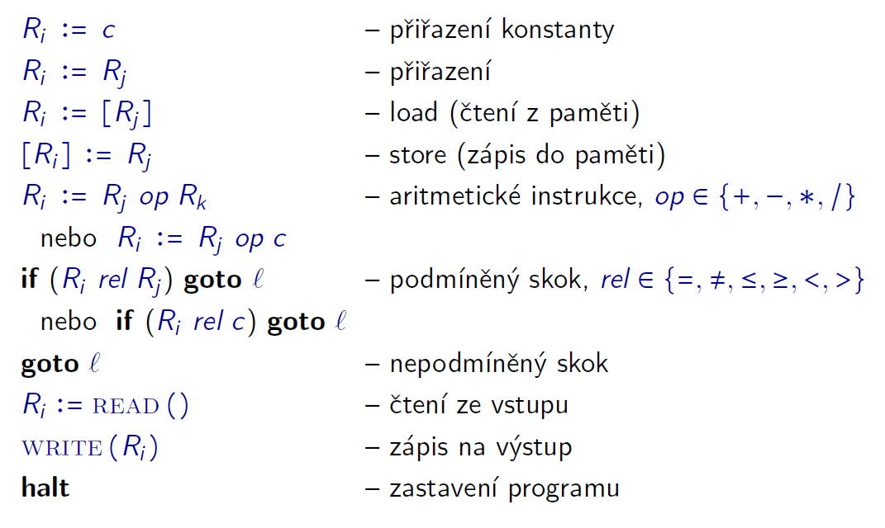

**Konfigurace stroje RAM** je dána:

- obsahem všech registrů (paměti; včetně *instruction pointer* (IP)),
- obsahem vstupní a výstupní pásky a
- pozicemi čtecí a zapisovací hlavy.

<details><summary> Řešený příklad </summary>

```ram
    R3 := 4
    R1 := READ()  // vstup 8
    R2 := R3
    R0 := 1
L1: [R2] := R0
    R2 := R2 + 1
    if (R1 <= 0) goto L2
    R1 := R1 - 1
    R0 := R0 + R0
    R0 := R0 + 1
    goto L1
L2: if (R2 = R3) goto L3
    R2 := R2 - 1
    R0 := [R2]
    WRITE(R0)
    goto L2
L3: halt
```

<details><summary> Řešení </summary>

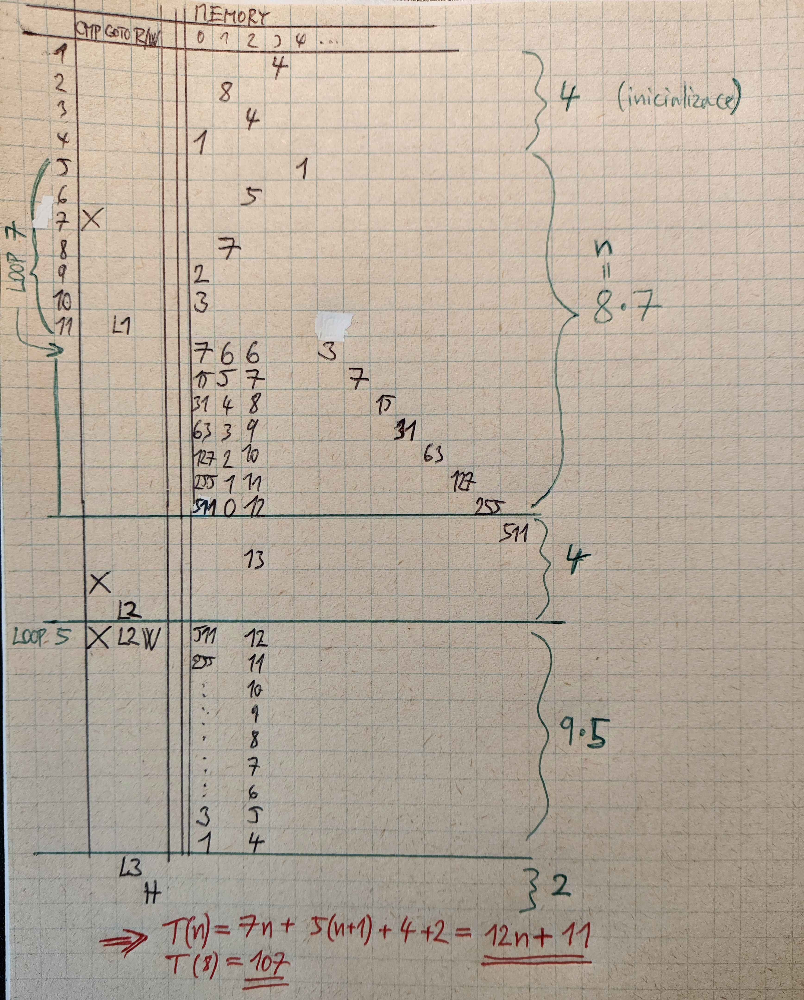

Tento RAM stroj vytvoří sekvenci $2^{n+1}-1, 2^{n}-1,\dots,2^{1}-1$.

</details>

</details>

### 1.7. Graf řídícího toku

Konfigurace grafu řídícího toku je dána:

- řídícím stavem (vrchol v grafu řídícího toku) a
- obsahem paměti (hodnoty jednotlivých proměnných).

### 1.8. Minského stroj

Minského stroj je stroj, který má **konečnou řídící jednotku** a **konečný počet čítačů**. Každý z čítačů může obsahovat jako svou hodnotu **libovolně velké přirozené číslo**. S těmito čítači může stroj provádět pouze následující operace:

- zvýšit hodnotu čítače o 1, tj. `x += 1`,
- pokud je hodnota čítače větší než 0, snížit tuto hodnotu o 1, tj. `x -= 1`,
- testovat, zda je hodnota čítače rovna 0, a na základě toho provést větvení programu, tj. `if x = 0 then goto L`

Navíc má Minského stroj operaci nepodmíněného skoku `goto L` a operaci zastavení `halt`.

**Konfigurace Minského stroje** je dána:

- stavem řídící jednotky a
- hodnotami všech čítačů.

<details><summary> Simulace Minského stroje s 5 čítači pomocí Minského stroje se 2 čítači </summary>

1. **Prvočíselné kódování**, kde hodnoty 5 čítačů (označme je jako $x_1,x_2,\dots,x_5$) zakódujeme do jednoho čísla $N$ pomocí vzorce:
   $$N = 2^{x_1} \cdot 3^{x_2} \cdot 5^{x_3} \cdot 7^{x_4} \cdot 11^{x_5}$$

2. Pro zvýšení hodnoty $i$-tého čítače musíme vynásobit $N$ příslušným prvočíslem $p_i$:
   - Pro čítač 1: $N := N \cdot 2$
   - Pro čítač 2: $N := N \cdot 3$
   - Pro čítač 3: $N := N \cdot 5$
   - Pro čítač 4: $N := N \cdot 7$
   - Pro čítač 5: $N := N \cdot 11$

3. Pro snížení hodnoty $i$-tého čítače musíme vydělit $N$ příslušným prvočíslem $p_i$:
   - Pro čítač 1: $N := N / 2$
   - Pro čítač 2: $N := N / 3$
   - Pro čítač 3: $N := N / 5$
   - Pro čítač 4: $N := N / 7$
   - Pro čítač 5: $N := N / 11$

4. Pro test i-tého čítače na nulu musíme:
   1. Opakovaně dělit $N$ příslušným prvočíslem.
   2. Pokud již není dělitelné, zbytek po dělení nám řekne, zda je čítač nulový.

5. Použití dvou čítačů:
   - První čítač $A$ používáme pro uchování aktuální hodnoty $N$.
   - Druhý čítač $B$ používáme jako pomocný pro realizaci násobení a dělení.

6. Násobení číslem $k$:
   - Opakuj k-krát: $A := A + B$

7. Dělení číslem $k$:
   - Pomocí $B$ počítáme, kolikrát se k vejde do $A$.
   - Zbytek zůstane v $A$.

8. Test dělitelnosti:
   - Postupně odečítáme $k$, dokud není $A < k$.
   - Pokud $A = 0$, číslo bylo dělitelné.

Obdobně lze simulovat *libovolný konečný počet čítačů* pomocí dvou čítačů.

</details>

Platí, že činnost Turingova stroje lze simulovat Minským strojem se dvěma čítači.

### 1.9. Konfigurace jako data

Konfigurace stroje můžeme chápat jako data, a tedy jako slovo v nějaké abecedě.

> **Univerzální Turingův stroj** $U$ je stroj, který pro vstup $\text{Kod}(M)$ a slovo $w\in\Sigma^*$ (kde $\Sigma^*$ je vstupní abeceda $M$) simuluje běh Turingova stroje $M$ na vstupu $w$.

Analogicky funguje hardware počítače, je schopný vykonávat libovolný algoritmus.

## 2. Rozhodovací problémy

### 2.1. Nerozhodnutelné problémy

#### 2.1.1. Halting problem

- **Vstup:** Zdrojový kód programu $P$ v jazyce $L$, vstupní data $x$.
- **Otázka:** Zastaví se program $P$ po nějakém konečném počtu kroků, pokud dostane jako vstup data $x$?

Lze dokázat, že halting problem je *nerozhodnutelný*, ale je *částečně rozhodnutelný*.

<details><summary> Důkaz, že Halting problem je nerozhodnutelný </summary>

Pozn. značením $\text{Kod}(M)$ rozumíme kód Turingova stroje $M$ v abecedě $\{0,1\}^*$. (Seznam instrukcí a stavy můžeme zakódovat do jednoho řetězce.)

Předpokládejme, že existuje Turingův stroj $A$, který řeší Halting problem. Dále definujme nový Turingův stroj $\overline{A}$, který příjímá vstup $x=\{0,1\}^*$ a simuluje běh $A$ na vstupu $x$. Pokud se $A$ zastaví, tak $\overline{A}$ se zacyklí a naopak.

Co se stane, když na vstup $\overline{A}$ dáme $\text{Kod}(\overline{A})$?

1. $A$ skončí ve stavu **Ano** a $\overline{A}$ se zacyklí.
2. $A$ skončí ve stavu **Ne** a $\overline{A}$ odpoví **Ano**.

To je spor, že $A$ řeší HP (tzn. že by $A$ mělo vždy pravdu).

</details>

#### 2.1.2. Kachličkování roviny

Vstupem je množina typů kachliček, jako třeba:

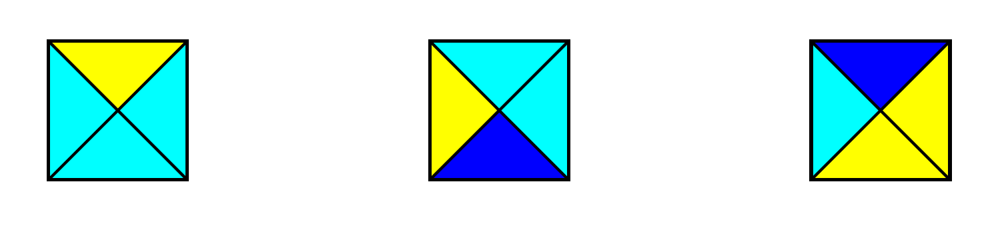

Otázka je, zda je možné použitím daných typů kachliček pokrýt celou nekonečnou rovinu tak, aby všechny kachličky spolu sousedily stejnými barvami.

### 2.2. Částečně rozhodnutelné problémy

Rozhodovací problém $P$ je **částečně rozhodnutelný**, jestliže existuje algoritmus $A$, který:

- Pokud dostane jako vstup instanci problému $P$, pro kterou je správná odpověď **Ano**, tak se na tomto vstupu po konečném počtu kroků zastaví a dá odpověď **Ano**.
- Pokud dostane jako vstup instanci problému $P$, pro kterou je správná odpověď **Ne**, tak se na tomto vstupu *buď zastaví* a dá odpověď **Ne** *nebo* se na tomto vstupu *nikdy nezastaví*.

### 2.3. Doplňkové problémy

> Doplňkový problém k danému rozhodovacímu problému $P$ je problém, kde vstupy jsou stejné jako u problému $P$ a otázka je negací otázky z problému $P$.

Pokud je problém $P$ nerozhodnutelný, tak je nerozhodnutelný i jeho doplňkový problém $\overline{P}$.

<details><summary> Doplňkový problém k Halting problému: </summary>

- **Vstup:** Zdrojový kód programu $P$ v jazyce $L$, vstupní data $x$.
- **Otázka:** Poběží program $P$ do nekonečna, pokud dostane jako vstup data $x$? (Tj. nezastaví se na nich)?

</details>

<details><summary> Doplňkový problém k problému SAT: </summary>

- **Vstup:** Booleovská formule $\varphi$.
- **Otázka:** Je formule $\varphi$ nesplnitelná (tj. je kontradikcí)?

</details>

### 2.4. Postova věta

> *Rozhodovací* problém $P$ je rozhodnutelný $\iff$ $P$ i $\overline{P}$ jsou *částečně rozhodnutelné*.

Z Postovy věty plyne, že pokud je problém $P$ nerozhodnutelný, tak doplňkový problém $\overline{P}$ **není** částečně rozhodnutelný.

### 2.5. Riceova věta

> Každá netriviální I/O vlastnost rozhodovacího programu je nerozhodnutelná.

Vlastnost je netriviální, pokud existuje alespoň jeden program, který ji má a alespoň jeden program, který ji nemá. Tzn. vlastnost je triviální, pokud ji mají všechny programy nebo ji nemá žádný program.

Vlastnost $V$ je vstupně/výstupní (I/O), právě tehdy, když každé dva programy se stejnou I/O tabulkou buď mají oba vlastnost $V$, nebo ji oba nemají.

Možnosti vyplnění "tabulky" pro vlastnost $V$:

| Otázka                  |              |   |   |
|-------------------------|--------------|---|---|
| Je $V$ triviální?       | $\times$     | $\times$ | $\checkmark$ |
| Je $V$ I/O?             | $\checkmark$ | $\times$ | $\checkmark$ |
| Je $V$ nerozhodnutelná? | $\checkmark$ | $\times$ | $\times$ |

(Třetí řádek plyne z Riceovy věty.)

Dle Riceovy věty je prakticky jakákoliv netriviální otázka týkající se ověřování software (např. testování korektnosti) algoritmicky nerozhodnutelná.

## 3. Převody mezi problémy

> Pokud máme o nějakém *rozhodovacím* problému dokázáno, že je *nerozhodnutelný*, můžeme ukázat nerozhodnutelnost dalších problémů pomocí *redukcí (převodů) mezi problémy*.

Problém $P_1$ je převeditelný na problém $P_2$, jestliže existuje algoritmus $\text{Alg}$ takový, že:

- Jako vstup může dostat libovolnou instanci problému $P_1$.
- K instanci problému $P_1$, kterou dostane jako vstup (označme ji $w$), vyprodukuje jako svůj výstup instanci problému $P_2$ (označme ji $\text{Alg}(w)$).
- Platí, že pro vstup $w$ je v problému $P_1$ odpověď **Ano** právě tehdy, když pro vstup $\text{Alg}(w)$ je v problému $P_2$ odpověď **Ano**.

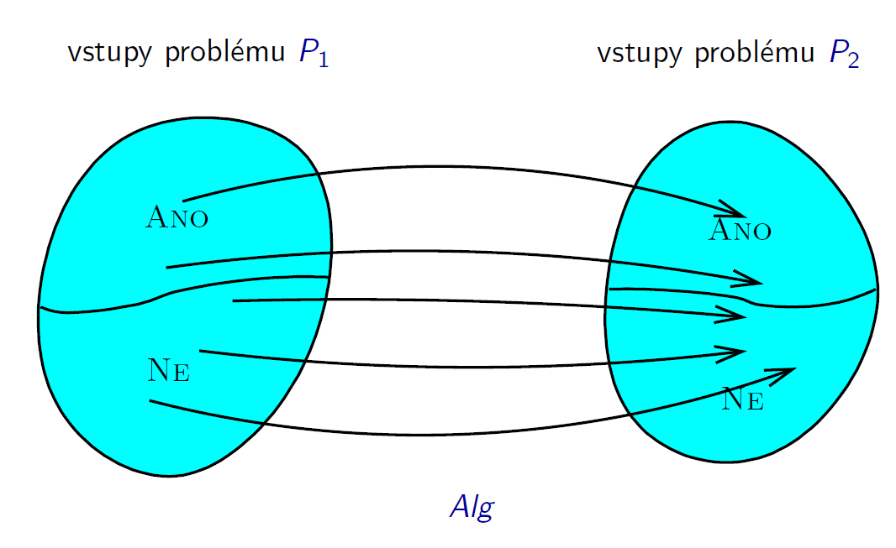

## 4. Složitost algoritmů

Různé algoritmické problémy jsou různě těžké. Obtížnější problémy vyžadují *více času a paměti* k řešení.

- **Složitost algoritmu** je funkce, která popisuje, jak se časová (resp. prostorová) složitost mění s velikostí vstupu.
- **Složitost problému** je složitost "nejefektivnějšího" algoritmu, který problém řeší.

Uvažujme stroj $\mathcal{M}$. Můžeme definivat funkce **doba výpočtu** na daným vstupem a **množství paměti** použité při výpočtu nad daným vstupem:

$$
\begin{align*}
  \mathrm{time}_{\mathcal{M}}: \mathrm{input} \rightarrow \mathbb{N} \cup \{\infty\} \\
  \mathrm{space}_{\mathcal{M}}: \mathrm{input} \rightarrow \mathbb{N} \cup \{\infty\}
\end{align*}
$$

### 4.1. Turingův stroj

Buď TM $M=(Q,\Sigma,\Gamma,\delta,q_0,F)$:

$$
\mathrm{time}_{\mathcal{M}}: \Sigma^* \rightarrow \mathbb{N} \cup \{\infty\}
$$

Pro $w\in\Sigma^*$ je $\mathrm{time}_{\mathcal{M}}(w)$ počet kroků, které $\mathcal{M}$ vykoná při výpočtu nad vstupem $w$.

$$
\mathrm{space}_{\mathcal{M}}: \Sigma^* \rightarrow \mathbb{N} \cup \{\infty\},
$$

Pro $w\in\Sigma^*$ je $\mathrm{space}_{\mathcal{M}}(w)$ počet políček pásky, které $\mathcal{M}$ během výpočtu nad vstupem $w$ navštíví.

### 4.2. RAM stroj

Pro RAM stroj můžeme dobu výpočtu definovat dvěma způsoby:

- **Jednotková míra** - počet provedených instrukcí.
- **Logaritmická míra** - součet doby trvání jednotlivých instrukcí, doba trvání instrukce závisí na počtu bitů hodnot, se kterými pracuje (např. násobení dvou $n$-bitových čísel má logaritmickou míru $n^2$).

Pro množství paměti:

- **Jednotková míra** - počet použitých paměťových buněk.
- **Logaritmická míra** - maximální počet použitých paměťových buněk, které bylo potřeba v nějaké konfiguraci.

### 4.3. Časová a prostorová složitost

Buď $\mathrm{size(x)}$ **velikost vstupu** $x$. Pak **časovou složitost v nejhorším případě** definujeme jako:

$$
T(n) = \max\{\mathrm{time}_{\mathcal{M}}(x) \mid x\in\mathrm{input} \wedge \mathrm{size}(x) = n\}
$$

tj., funkci, která pro daný algoritmus a danou velikost vstupu přiřazuje každému přirozenému číslu $n$ maximální počet instrukcí, které algoritmus provede, pokud dostane vstup velikosti $n$.

Analogicky definujeme **prostorovou složitost v nejhorším případě**:

$$
S(n) = \max\{\mathrm{space}_{\mathcal{M}}(x) \mid x\in\mathrm{input} \wedge \mathrm{size}(x) = n\}
$$

**Časovou složitost v průměrném případě** definujeme jako aritmetický průměr $T(n)$.

### 4.4. Asymptotická notace

Buď $g : \mathbb{N} \to \mathbb{N}$. Pak pro $f : \mathbb{N} \to \mathbb{N}$ platí:

1. $\boxed{f \in \mathcal{O}(g)}\iff(\exists c > 0)(\exists n_0 \geq 0)(\forall n \geq n_0) :$

    $$
    \boxed{f(n) \leq c \cdot g(n)}
    $$

2. $\boxed{f \in \Omega(g)}\iff(\exists c > 0)(\exists n_0 \geq 0)(\forall n \geq n_0) :$

    $$
    \boxed{f(n) \geq c \cdot g(n)}
    $$

3. $\boxed{f \in \Theta(g)}\iff$

    $$
    \boxed{f \in \mathcal{O}(g) \wedge f \in \Omega(g)}\iff \boxed{\lim_{n \to +\infty} \frac{g(n)}{f(n)} = c > 0}
    $$

4. $\boxed{f \in \omicron(g)}\iff(\exists c > 0)(\exists n_0 \geq 0)(\forall n \geq n_0) :$

    $$
    \boxed{f(n) < c \cdot g(n)}\iff\boxed{\lim_{n \to +\infty} \frac{f(n)}{g(n)} = 0}
    $$

5. $\boxed{f \in \omega(g)}\iff(\exists c > 0)(\exists n_0 \geq 0)(\forall n \geq n_0) :$

    $$
    \boxed{f(n) > c \cdot g(n)}\iff\boxed{\lim_{n \to +\infty} \frac{f(n)}{g(n)} = +\infty}
    $$

> Poznámka: Existují dvojice funkcí $f,g\colon\mathbb{N}\rightarrow\mathbb{N}$, s.t.
>
>$$f\in\mathcal{O}(g) \quad\text{a}\quad g\notin\mathcal{O}(f),$$
>
>např.:
>
> $$
f(n)=n \quad\text{a}\quad
g(n) =
\begin{cases}
n^2 & \text{if } n \bmod 2 = 0, \\
\lceil \log_2 n \rceil & \text{otherwise.}
\end{cases}
$$

Platí, že pokud $f\in\mathcal{O}(g)$, tak i $f + g\in\mathcal{O}(g)$.

Často se proto při analýze celkové časové složitosti $T(n)$ omezíme jen na analýzu nejčastěji prováděné instrukce.

> O funkci $f$ řekneme, že je:
>
> - **logaritmická**, pokud $f(n) \in \Theta(\log n)$
> - **lineární**, pokud $f(n) \in \Theta(n)$
> - **kvadratická**, pokud $f(n) \in \Theta(n^2)$
> - **kubická**, pokud $f(n) \in \Theta(n^3)$
> - **polynomiální**, pokud $f(n) \in \mathcal{O}(n^k)$ pro nějaké $k > 0$
> - **exponenciální**, pokud $f(n) \in \mathcal{O}(c^{n^k})$ pro nějaké $c > 1$ a $k > 0$

Pro konkrétní problém můžeme mít dva algoritmy takové, že jeden má menší prostorovou složitost a druhý zase menší časovou složitost.

Pokud je časová složistost v $\mathcal{O}(f(n))$, pak je i prostorová složitost v $\mathcal{O}(f(n))$.

>Funkce $f$ je **polynomiální**, jestliže je shora omezena nějakým polynomem, tj. jestliže existuje nějaká konstanta $k$ taková, že $f \in \mathcal{O}(n^k)$.
>
>Polynomiální jsou například funkce, které patří do následujících tříd:
>$$\mathcal{O}(n), \quad \mathcal{O}(n \log n), \quad \mathcal{O}(n^2), \quad \mathcal{O}(n^5), \quad \mathcal{O}(\sqrt{n}), \quad \mathcal{O}(n^{100})$$
>
>**Polynomiální algoritmus** je algoritmus, jehož časová složitost je polynomiální — tj. shora omezená nějakým polynomem (tedy v $\mathcal{O}(n^k)$, kde $k$ je nějaká konstanta).

### 4.5. Vzorce

Logaritmus:

$$
\boxed{
\log_a b = x \iff a^x = b
}
$$
$$
\boxed{
a^{\log_b n} = n^{\log_b a}
}
$$

Součet aritmetické posloupnosti:
$$
\boxed{
\sum_{i=0}^{n-1} a_i = \frac{1}{2} n (a_0 + a_{n-1})
}
$$

Součet geometrické posloupnosti (kde $q \neq 1$):

$$
\boxed{
\sum_{i=0}^{n} a_i = a_0 \frac{q^{n+1} - 1}{q - 1}
}
$$

### 4.6. Analýza rekurzivních algoritmů

**Rekurzivní algoritmus** je algoritmus, který převede řešení původního problému na řešení několika podobných problémů pro menší instance.

> **Master Theorem**
>
> Předpokládejme, že $a \geq 1$ a $b > 1$ jsou konstanty, že $f:\mathbb{N}\rightarrow\mathbb{N}$, a že funkce $T(n)$ je definována rekurentním předpisem
>
> $$T(n) = a \cdot T\left(\frac{n}{b}\right) + f(n)$$
>
> (kde $n/b$ může být buď $\lfloor n/b \rfloor$ nebo $\lceil n/b \rceil$). Pak platí:
>
> 1. Pokud $f(n) \in \mathcal{O}(n^{\log_b a - \varepsilon})$ pro nějakou konstantu $\varepsilon > 0$, pak
>    $$ T(n) = \Theta(n^{\log_b a}).$$
>
> 2. Pokud $f(n) \in \Theta(n^{\log_b a})$, pak
>    $$T(n) = \Theta(n^{\log_b a} \log n).$$
>
> 3. Pokud $f(n) \in \Omega(n^{\log_b a + \varepsilon})$ pro nějakou konstantu $\varepsilon > 0$ a pokud $a \cdot f\left (\frac{n}{b}\right) \leq c \cdot f(n)$ pro nějakou konstantu $c < 1$ a všechna dostatečně velká $n$, pak
>    $$T(n) = \Theta(f(n)).$$

Master theorem je možné použít pro analýzu složitosti takových rekurzivních algoritmů, kde:

1. Řešení jednoho podproblému velikosti $n$, kde $n > 1$, se převede na řešení $a$ podproblémů, z nichž každý má velikost $\frac{n}{b}$.
2. Doba, která se stráví řešením jednoho podproblému velikosti $n$, *bez* doby v rekurzivních voláních, je určena funkcí $f(n)$.

<details><summary> Příklad: Algoritmus Merge-Sort </summary>

Pro algoritmus Merge-Sort máme:

- $a = 2$ ...počet podproblémů
- $b = 2$ ...velikost podproblému $n/2$
- $f(n) \in \Theta(n)$ ...spojení dvou seřazených sekvencí v čase $\Theta(n)$
- $g(n)=n^{\log_b a}=n$
- $f(n)\text{ "=" }g(n)$, tzn.

Platí, že $f(n) \in \Theta(n^{\log_b a}) = \Theta(n)$, takže podle Master theorem máme:

$$
T(n) \in \Theta(n^{\log_b a} \log n) = \Theta(n \log n).
$$

</details>

### 4.7. Práce s velkými čísly

$$
u = \sum_{i=0}^{n-1} U[i] \cdot q^i
$$

Na takto uložené číslo se můžeme dívat tak, že jde o zápis čísla $u$ v číselné soustavě o základu $q$, a prvky pole $U$ představují jednotlivé "číslice" tohoto zápisu.

Sčítání/odčítání lze provést "školním" způsobem $\mathcal{O}(n)$. Násobení "školním" způsobem $\mathcal{O}(n^2)$. Nicméně existuje rekurzivní algoritmus - **Karacubovo násobení** - který má složitost $\mathcal{O}(n^{\log_2 3}) \sim \mathcal{O}(n^{1.59})$.

Podobně existuje **Strassenův algoritmus** pro násobení matic s časovou složitostí $\mathcal{O}(n^{\log_2 7}) \sim \mathcal{O}(n^{2.81})$.

## 5. Třídy složitosti

<div class="warning">

Třídy složitosti jsou podmnožiny množiny všech (algoritmických) *problémů*.

Daná konkrétní třída složitosti je vždy charakterizována nějakou vlastností,
kterou mají problémy do ní patřící.

</div>

>Pro libovolnou funkci $f : \mathbb{N} \to \mathbb{N}$ definujeme třídu $\text{D}_{time}\big(f(n)\big)$, resp. $\text{D}_{space}\big(f(n)\big)$, jako třídu obsahující právě ty *rozhodovací* problémy, pro něž existuje algoritmus s časovou, resp. prostorovou, složitostí $\mathcal{O}(f(n))$.
>
> Dále definuje třídy složitosti pro *rozhodovací* problémy, pro které existuje algoritmus s polynomiální složitostí:
> $$\begin{align*}\text{P}_{time} &= \bigcup\limits_{k\geq0}\text{D}_{time}(n^k)\\ \text{P}_{space} &=\bigcup\limits_{k\geq0}\text{D}_{space}(n^k)\end{align*}$$

**Poznámka**: Za *rozumné* sekvenční výpočetní modely jsou považovány ty, které se umí vzájemně simulovat s Turingovými stroji tak, že doba výpočtu vzroste při takové simulaci nanejvýš *polynomiálně*.

- Za *rozumné* považujeme varianty Turingových strojů, RAM stroje při použití logaritmické míry (závisí na počtu bitů hodnot, se kterými RAM stroj pracuje) a další.
- Naopak např. Minského stroje nejsou považovány za *rozumné* (simulace Turingova stroje s exponenciální složitostí).

> Řekneme, že třída složitosti je **robustní**, právě tehdy, když pro všechny *rozumné* sekvenční výpočetní modely obsahuje stejné problémy.

Tzn. definice tříd $\text{P}_{time}$ a $\text{P}_{space}$ nezávisí na použitém *rozumném* výpočetním modelu.

Analogicky definujeme třídy:

- $\text{EXP}_{time}$ a $\text{EXP}_{space}$ pro problémy s exponenciální složitostí $2^{\mathcal{O}(n^k)}\Leftrightarrow \mathcal{O}(c^{n^k})$,
- $\text{LOG}_{time}$ a $\text{LOG}_{space}$ pro problémy s logaritmickou složitostí $\mathcal{O}(\log n)$,
- $\text{2-EXP}_{time}$ a $\text{2-EXP}_{space}$ pro problémy s exponenciální složitostí $2^{2^{\mathcal{O}(n^k)}}$,
- $\text{ELEMENTARY}$ pro problémy se složitostí $2^{2^{2^{^{.^{.^{.^{2^{\mathcal{O}(n^k)}}}}}}}}$

### 5.1. Vztahy mezi třídami složitosti

Pokud Turingův stroj provede $m$ kroků, tak použije maximálně $m$ políček na pásce. Tzn. pokud existuje pro nějaký problém algoritmus s časovou složitostí $\mathcal{O}(f(n))$, tak má tento algoritmus prostorovou složitost (nejvýše) $\mathcal{O}(f(n))$.

> Pro libovolnou funkci $f: \mathbb{N} \to \mathbb{N}$ platí $\text{D}_{time}\big(f(n)\big) \subseteq \text{D}_{space}\big(f(n)\big)$.

Z toho plyne, že $\text{P}_{time} \subseteq \text{P}_{space}$ atd.

Konfigurace libovolného stroje můžeme reprezentovat pomocí slova $w$ v nějaké abecedě $\Sigma$. Pro abecedu s počtem slov odpovídajícím počtu konfigurací stroje $|\Sigma|=c$ platí, že počet slov délky $n$ je $c^n$, tj. $2^{\Theta(n)}$. Během výpočtu korektního algoritmu se žádná konfigurace neopakuje, jinak by algoritmus běžel donekonečna. Tzn. pro algoritmus s prostorovou složitostí $\mathcal{O}(f(n))$ existuje $2^{\mathcal{O}(f(n))}$ konfigurací.

> Pro libovolnou funkci $f: \mathbb{N} \to \mathbb{N}$ platí, že pokud je nějaký problém $P$ řešený algoritmem s prostorovou složitostí $O(f(n))$, pak časová složitost tohoto algoritmu je $2^{\mathcal{O}(f(n))}$.
>
> Pokud je tedy problém $P$ ve třídě $\text{D}_{space}(f(n))$, pak je i ve třídě $\text{D}_{time}(2^{c \cdot f(n)})$ pro nějaké $c > 0$

$$
\text{LOGSPACE} \subseteq \text{PTIME} \subseteq \text{PSPACE} \subseteq \text{EXPTIME} \subseteq \text{EXPSPACE} \subseteq \\
2\text{-EXPTIME} \subseteq 2\text{-EXPSPACE} \subseteq \cdots \subseteq \text{ELEMENTARY}
$$

### 5.2. Horní a dolní odhady složitosti problémů

**Horním odhadem složitosti** problému rozumíme to, že složitost problému není vyšší než nějaká uvedená. Např

- Problém *dosažitelnosti v grafu* je v $\text{PTIME}$.
- Problém *ekvivalence dvou regulárních výrazů* je v $\text{EXPSPACE}$.

Pokud chceme zjistit nějaký horní odhad složitosti problému, stačí ukázat, že existuje algoritmus s danou složitostí.

**Dolním odhadem složitosti** problému rozumíme to, že složitost problému je alespoň taková jako nějaká uvedená. Obecně je zjišťování (netriviálních) dolních odhadů složitosti problémů mnohem obtížnější než zjišťování horních odhadů. Pro odvození dolního odhadu musíme totiž ukázat, že **každý** algoritmus řešící daný problém má danou složitost.

## 6. Nedeterminismus

Řekneme, že algoritmus je **nedeterministický**, pokud v každém kroku může vybrat z několika možností, kterou instrukcí pokračovat.

> Nedeterministický algoritmus dává pro daný vstup $x$ odpověď "Ano", právě tehdy, když existuje alespoň jeden jeho výpočet, který vede k odpovědi "Ano".

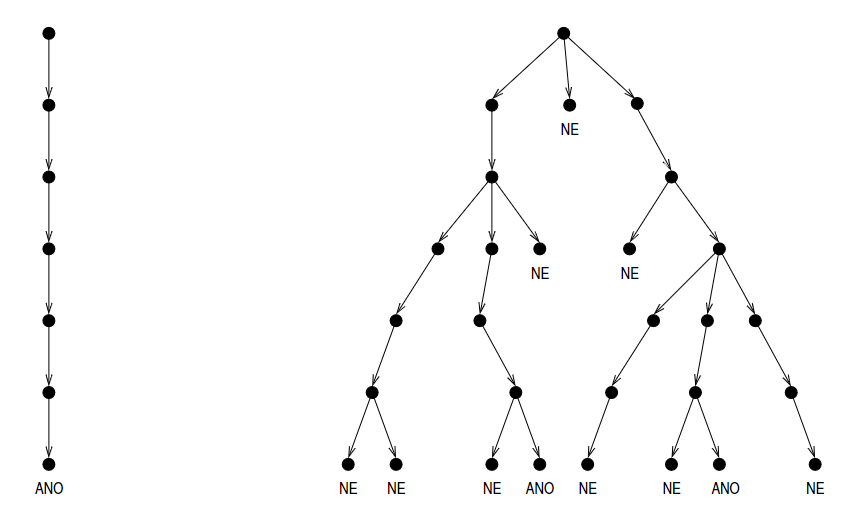

<div class="warning">

Složitost nedeterministického algoritmu v nejhorším případě odpovídá délce nejdelší větve výpočetního stromu.

</div>

Například u jednopáskového Turingova stroje se bude deterministická a nedeterministická varianta lišit pouze v definici přechodové funkce $\delta$:

- **Deterministická:** $\delta: (Q - F) \times \Gamma \to Q \times \Gamma \times \{-1, 0, +1\}$,
- **Nedeterministická:** $\delta: (Q - F) \times \Gamma \to 2^{(Q \times \Gamma \times \{-1, 0, +1\})}$

**Nedeterministický RAM stroj** má oproti deterministickému RAMu navíc instrukci
$\boxed{\texttt{nd\_goto } s_1, s_2}$, která umožňuje RAM stroji vybrat si jedno z možných pokračování (návěstí).

### 6.1. Nedeterministické třídy složitosti

> Pro funkci $f: \mathbb{N} \to \mathbb{N}$ rozumíme třídou časové složitosti $\text{N}_{time}(f)$ množinu těch rozhodovacích problémů, které jsou řešeny nedeterministickými RAMy s časovou složitostí v $\mathcal{O}(f(n))$.
>
> Pro funkci $f: \mathbb{N} \to \mathbb{N}$ rozumíme třídou prostorové složitosti $\text{N}_{space}(f)$ množinu těch rozhodovacích problémů, které jsou řešeny nedeterministickými RAMy s prostorovou složitostí v $\mathcal{O}(f(n))$.
>
> $$\text{NP}_{time} = \bigcup\limits_{k\geq0}\text{N}_{time}(n^k)$$

| Symbol       | Třída složitosti     |
|--------------|----------------------|
| $\text{LS}$      | $\text{LOG}_{\text{space}}$   |
| $\text{NLS}$     | $\text{NLOG}_{space}$            |
| $\text{PT}$      | $\text{P}_{time}$               |
| $\text{NPT}$     | $\text{NP}_{time}$              |
| $\text{EXPT}$    | $\text{EXP}_{time}$             |
| $\text{NEXPT}$   | $\text{NEXP}_{time}$            |

Zřejmě platí, že na deterministické algoritmy se můžeme dívat jako na speciální případ nedeterministických.

$$
\begin{align*}
  \text{LS} &\subseteq \text{NLS}\\
  \text{PT} &\subseteq \text{NPT}\\
  \text{PS} &\subseteq \text{NPS}\\
  \text{EXPT} &\subseteq \text{NEXPT}\\
  \text{EXPS} &\subseteq \text{NEXPS}\\
  &\,\,\,\vdots
\end{align*}
$$

Navíc ani nedeterministický algoritmus nemůže použít řádově více buněk paměti něž kolik udělá kroků, tzn.

$$
\begin{align*}
  \text{NPT} &\subseteq \text{NPS}\\
  \text{NEXPT} &\subseteq \text{NEXPS}\\
  &\,\,\,\vdots
\end{align*}
$$

> Nedeterministický algoritmus s časovou složitostí $\mathcal{O}\big(f(n)\big)$ je možné simulovat deterministickým algoritmem s prostorovou složitostí $\mathcal{O}\big(f(n)\big)$.

Myšlenka důkazu: Deterministický algoritmus bude procházet *strom výpočtů nedeterministického algoritmu do hloubky pomocí zásobníku*.

Z toho plyne, že

$$
\begin{align*}
  \text{NPT} &\subseteq \text{PS}\\
  \text{NEXPT} &\subseteq \text{EXPS}\\
  &\,\,\,\vdots
\end{align*}
$$

Počet kroků nedeterministického algoritmu v rámci jedné větve výpočtu může být až $2^{\mathcal{O}(f(n))}$. Simulace všech větví deterministickým algoritmem by měla složitost $2^{2^{\mathcal{O}(f(n))}}$. Nicméně lze postupovat chytřeji, konkrétně vytvořit graf o $2^{\mathcal{O}(f(n))}$ vrcholech (pro všechny konfigurace) a orientovaných hranách (přechody mezi konfiguracemi). Poté lze vytvořit deterministický algoritmus, který bude procházet tento graf a hledat cestu z počáteční do koncové konfigurace, kdy výsledek je "Ano". Tento algoritmus bude mít složitost $2^{\mathcal{O}(f(n))}$. Tzn.:

> Činnost **ne**deterministického algoritmu, jehož *prostorová* složitost je $\mathcal{O}(f(n))$, je možné simulovat deterministickým algoritmem, jehož *časová* složitost je $2^{\mathcal{O}(f(n))}$.

Z toho plyne, že

$$
\begin{align*}
  \text{NLS} &\subseteq \text{PT}\\
  \text{NPS} &\subseteq \text{EXPT}\\
  \text{NEXPS} &\subseteq \text{2-EXPT}\\
  &\,\,\,\vdots
\end{align*}
$$

> Věta (Savitch). Činnost **ne**deterministického algoritmu s *prostorovou* složitostí $\mathcal{O}\big(f(n)\big)$ je možné simulovat deterministickým algoritmem s *prostorovou* složitostí $\mathcal{O}\big(f(n)^2\big)$.

Hierarchie tříd složitosti:

$$
\text{LS} \subseteq \text{NLS} \subseteq \text{PT} \subseteq \text{NPT} \subseteq \text{PS} = \text{NPS} \subseteq \text{EXPT} \subseteq \text{NEXPT} \subseteq \text{EXPS} = \text{NEXPS}
$$

## 7. NP úplnost

### 7.1. SAT problém

Je booleovská formule splnitelná?

$\varphi = x_1 \wedge (\neg x_2 \vee x_3)$

Lze nastavit $x_1,x_2,x_3$ tak, aby $\varphi$ byla pravdivá?

## 8. PS úplnost

**Kvantifikované booleovské formule (QBF)** je příklad PSPACE úplného problému. Redukcí z QBF lze úkázat PSPACE úplnost mnoha dalších problémů, např. *oblázkové hry*.

### 8.1. Generalized Geography (GG)

## 9. Paralelní algoritmy

Způsob vzájemné komunikace:

- sdílená paměť
- posílání zpráv

Vzájemná synchronizace:

- synchronní - instrukce jsou vykonávány na všech procesorech najednou ve stejný okamžik (v synchronních krocích)
- asynchronní - instrukce jsou vykonávány nezávisle na sobě, pořadí není předvidatelné

### 9.1. Parallel Random Access Machine (PRAM)

- **Synchronní** model.
- Procesory sdílí společnou **globální paměť**.
- K dispozici je neomezený (konečný) počet procesorů.
- Slouží pro prvotní návrh paralelních algoritmů nezávisle na konkrétním hardware.

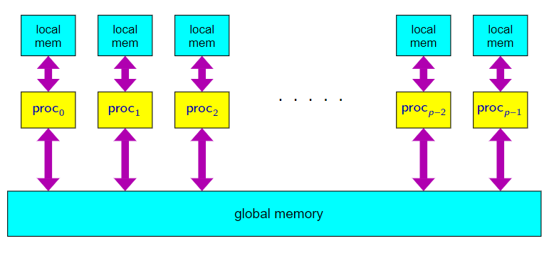

Oproti RAM stroji má PRAM navíc operace `load` a `store` pro globální paměť:

$$ R_i:=[R_j]_{glob} \quad\,\text{a}\,\quad [R_i]_{glob}:=R_j $$

Navíc PRAM nemá instrukce pro vstup a výstup:  

- Předpokládá se, že vstupní data jsou na začátku uložena na nějakém stanoveném místě v globální paměti.  
- Podobně se předpokládá, že výstup bude na konci výpočtu zapsán na nějakém stanoveném místě v globální paměti.  

Procesory jsou indexovány — každý má přiděleno `ID` $(0, 1, 2, ...)$, pro jednoduchost můžeme uvažovat ID procesoru uložené v lokální paměti v registru $R_0$.

Varianty PRAM:

- **EREW** — Exclusive-Read Exclusive-Write
- **CREW** — Concurrent-Read Exclusive-Write
- **CRCW** — Concurrent-Read Concurrent-Write
  - **Common** — pokud do jedné buňky zároveň zapisuje více procesorů, tak musí *všechny zapisovat stejnou hodnotu*
  - **Arbitrary** — pokud do jedné buňky zároveň zapisuje více procesorů, tak je *nedeterministicky vybrána* a zapsána jedna hodnota (ostatní se zahodí)
  - **Priority** — pokud do jedné buňky zároveň zapisuje více procesorů, tak je zapsána hodnota procesoru s *nejnižším ID*

Za **efektivní paralelní algoritmy** jsou považovány ty, kde:  

- **Časová složitost** $t(n)$ je **polylogaritmická**, tj. $O(\log^k n)$, kde $k\in\mathbb{N}$.
- **Počet procesorů** $p(n)$ je **polynomiální**.  

*Problémy*, pro které existuje takový efektivní paralelní algoritmus, jsou považovány za **dobře paralelizovatelné**.  

> Třídu **NC** (*Nick’s class*) tvoří právě ty *rozhodovací* *problémy*, pro které existuje paralelní algoritmus s *polylogaritmickou časovou složitostí* při použití *polynomiálního počtu procesorů*.  

<details><summary> Součet posloupnosti čísel </summary>

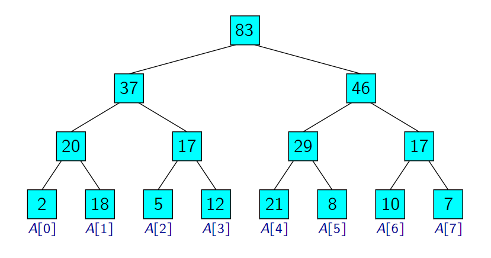

Časová složitost $\mathcal{O}(\log n)$ při použití $\mathcal{O}(n)$ procesorů.

Pokud bychom měli $p \ll n$ procesorů, můžeme použít algoritmus, který pole $A$ rozdělí na $p$ částí, kdy každá má $n/p$ prvků. Časová složitost $\mathcal{O}(n/p + \log p)$ při použití $p$ procesorů.

</details>

> **Věta (Brent)**
>
> Řekněme, že máme paralelní algoritmus, který vykoná celkem $m$ operací, a kde doba jeho provádění při *neomezeném* počtu procesorů by byla $t$ kroků.  
>
> Pokud bude k dispozici pouze $p$ procesorů, je možné implementovat tento algoritmus tak, aby pro počet kroků $t'$ platilo:  
> $$ t' \leq t + \frac{m - t}{p} $$

> Paralelní algoritmus je považován za **optimální**, pokud *celkový* počet provedených operací je (asymptoticky) stejný jako časová složitost nejlepšího známého sekvenčního algoritmu, který řeší daný problém.  

<details><summary> Součet posloupnosti čísel </summary>

- Dříve popsaný algoritmus pro počítání součtu posloupnosti čísel provede celkem $\mathcal{O}(n)$ operací.  
- Je zjevné, že jakýkoli sekvenční algoritmus musí provést $\Omega(n)$ operací.  
- Tento paralelní algoritmus je tedy v tomto smyslu **optimální**.  

</details>

Na stroji PRAM typu `CRCW` `COMMON` je možné s $\mathcal{O}(n^2)$ procesory najít
minimum v čase $\mathcal{O}(1)$. Tento algoritmus není optimální, protože sekvenční algoritmus pro hledání minima má složitost $\mathcal{O}(n)$.
