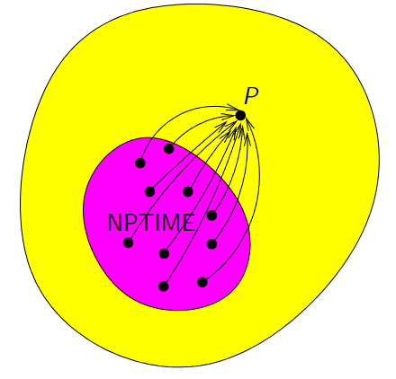
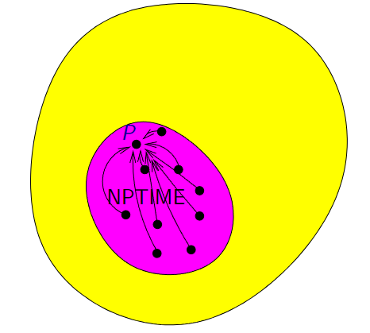
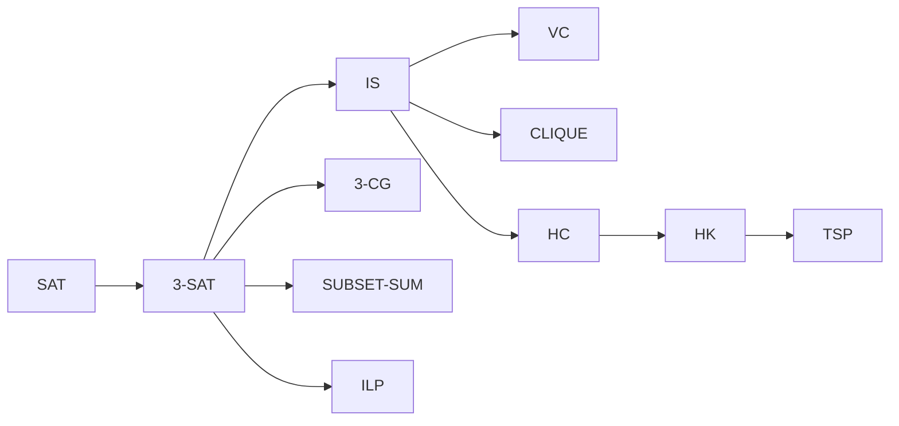
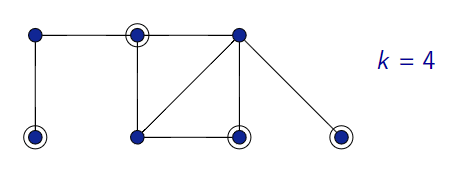
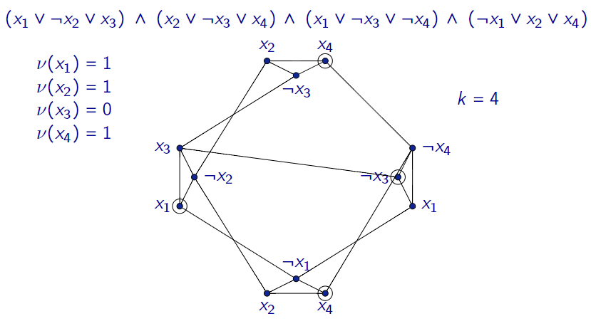
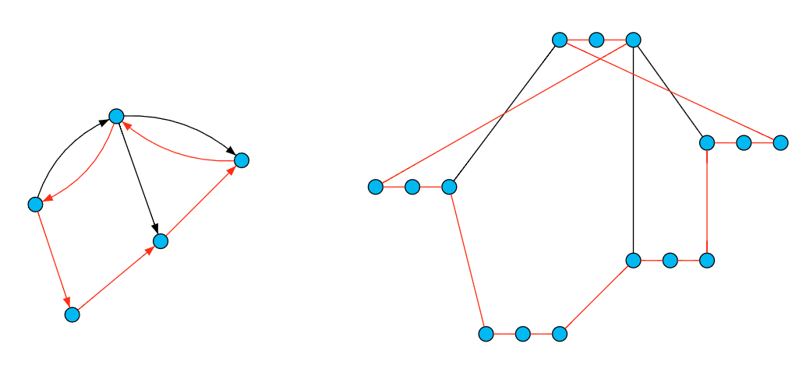
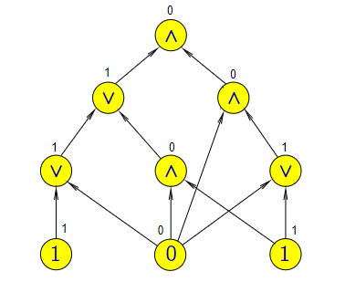
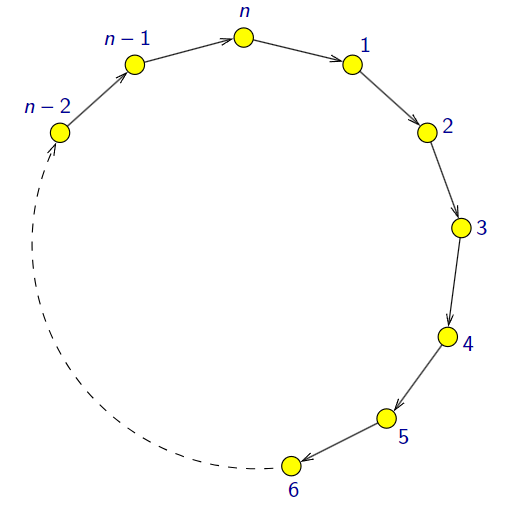
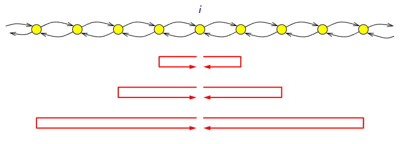
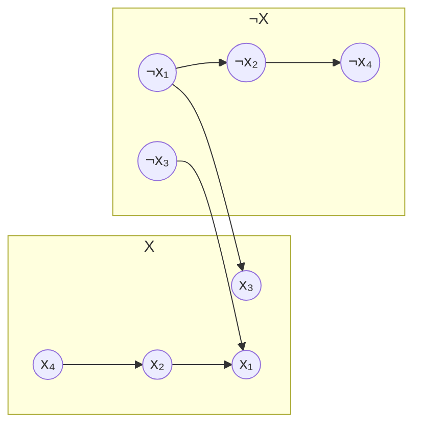

# Teoretická informatika (TI)

- [1. Výpočetní modely](#1-výpočetní-modely)
  - [1.1. Automaty](#11-automaty)
    - [1.1.1. Deterministický konečný automat](#111-deterministický-konečný-automat)
    - [1.1.2. Nedeterministický konečný automat](#112-nedeterministický-konečný-automat)
    - [1.1.3. Zobecněný nedeterministický konečný automat](#113-zobecněný-nedeterministický-konečný-automat)
    - [1.1.4. Aplikace](#114-aplikace)
  - [1.2. Bezkontextové jazyky](#12-bezkontextové-jazyky)
  - [1.3. Zásobníkový automat](#13-zásobníkový-automat)
  - [1.4. Chomského hierarchie](#14-chomského-hierarchie)
  - [1.5. Turingův stroj](#15-turingův-stroj)
    - [1.5.1. Church-Turingova teze](#151-church-turingova-teze)
    - [1.5.2. Binární Turingův stroj](#152-binární-turingův-stroj)
    - [1.5.3. Turingovsky úplné jazyky](#153-turingovsky-úplné-jazyky)
    - [1.5.4. Simulace mezi variantami Turingových strojů](#154-simulace-mezi-variantami-turingových-strojů)
  - [1.6. Stroj RAM](#16-stroj-ram)
  - [1.7. Graf řídícího toku](#17-graf-řídícího-toku)
  - [1.8. Minského stroj](#18-minského-stroj)
  - [1.9. Konfigurace jako data](#19-konfigurace-jako-data)
- [2. Rozhodovací problémy](#2-rozhodovací-problémy)
  - [2.1. Nerozhodnutelné problémy](#21-nerozhodnutelné-problémy)
    - [2.1.1. Halting problem](#211-halting-problem)
    - [2.1.2. Kachličkování roviny](#212-kachličkování-roviny)
  - [2.2. Částečně rozhodnutelné problémy](#22-částečně-rozhodnutelné-problémy)
  - [2.3. Doplňkové problémy](#23-doplňkové-problémy)
  - [2.4. Postova věta](#24-postova-věta)
  - [2.5. Riceova věta](#25-riceova-věta)
- [3. Převody mezi problémy](#3-převody-mezi-problémy)
- [4. Složitost algoritmů](#4-složitost-algoritmů)
  - [4.1. Turingův stroj](#41-turingův-stroj)
  - [4.2. RAM stroj](#42-ram-stroj)
  - [4.3. Časová a prostorová složitost](#43-časová-a-prostorová-složitost)
  - [4.4. Asymptotická notace](#44-asymptotická-notace)
  - [4.5. Vzorce](#45-vzorce)
  - [4.6. Analýza rekurzivních algoritmů](#46-analýza-rekurzivních-algoritmů)
  - [4.7. Práce s velkými čísly](#47-práce-s-velkými-čísly)
- [5. Třídy složitosti](#5-třídy-složitosti)
  - [5.1. Vztahy mezi třídami složitosti](#51-vztahy-mezi-třídami-složitosti)
  - [5.2. Horní a dolní odhady složitosti problémů](#52-horní-a-dolní-odhady-složitosti-problémů)
- [6. Nedeterminismus](#6-nedeterminismus)
  - [6.1. Nedeterministické třídy složitosti](#61-nedeterministické-třídy-složitosti)
- [7. NP úplnost](#7-np-úplnost)
  - [7.1. Příklady NP-úplných problémů](#71-příklady-np-úplných-problémů)
  - [7.2. Převod 3-SAT na IS](#72-převod-3-sat-na-is)
  - [7.3. SAT problém](#73-sat-problém)
  - [7.4. Převod HC na HK](#74-převod-hc-na-hk)
  - [7.5. Převod 3-SAT na ILP](#75-převod-3-sat-na-ilp)
- [8. Úplné problémy](#8-úplné-problémy)
  - [8.1. Třídy doplňkových problémů](#81-třídy-doplňkových-problémů)
  - [8.2. P-úplné problémy](#82-p-úplné-problémy)
  - [8.3. Třídy L a NL](#83-třídy-l-a-nl)
  - [8.4. NL-úplné problémy](#84-nl-úplné-problémy)
- [9. Hry dvou hráčů](#9-hry-dvou-hráčů)
  - [9.1. Zobecněná varianta hry Hex](#91-zobecněná-varianta-hry-hex)
- [10. Paralelní algoritmy](#10-paralelní-algoritmy)
  - [10.1. Parallel Random Access Machine (PRAM)](#101-parallel-random-access-machine-pram)
- [11. Distribuované algoritmy](#11-distribuované-algoritmy)
  - [11.1. Leader Election](#111-leader-election)
    - [11.1.1. Algoritmus LCR (Le Lann, Chang, Roberts)](#1111-algoritmus-lcr-le-lann-chang-roberts)
    - [11.1.2. Algoritmus HS (Hirschberg, Sinclair)](#1112-algoritmus-hs-hirschberg-sinclair)
    - [11.1.3. Algoritmus TimeSlice](#1113-algoritmus-timeslice)
    - [11.1.4. Algoritmus VariableSpeeds](#1114-algoritmus-variablespeeds)
    - [11.1.5. Algoritmus FloodMax](#1115-algoritmus-floodmax)
- [12. Výpočetně náročné problémy](#12-výpočetně-náročné-problémy)
  - [12.1. Problém batohu](#121-problém-batohu)
  - [12.2. Problém HORN-SAT](#122-problém-horn-sat)
  - [12.3. Problém 2-SAT](#123-problém-2-sat)
  - [12.4. Prvočíselnost](#124-prvočíselnost)
  - [12.5. Faktorizace](#125-faktorizace)
  - [12.6. Třídy randomizovaných algoritmů](#126-třídy-randomizovaných-algoritmů)
- [13. Aproximační algoritmy](#13-aproximační-algoritmy)
  - [13.1. Minimální vrcholové pokrytí grafu (vertex cover)](#131-minimální-vrcholové-pokrytí-grafu-vertex-cover)
  - [13.2. Problém obchodního cestujícího (TSP)](#132-problém-obchodního-cestujícího-tsp)

**Teoretická informatika** je vědní obor na pomezí mezi matematikou a informatikou. Zkoumá

- obecné otázky týkající se algoritmů,
- formalismy pro popis algoritmů,
- syntaxi a sémantiku formálních jazyků a další.

**Algoritmus** — mechanický postup, jak něco spočítat. Algoritmy slouží k řešení různých problémů. Konkrétní vstup nějakého problému se nazývá **instance** problému.

V zadání problému musí být určeno:

- co je množinou možných vstupů,
- co je množinou možných výstupů,
- jaký je vztah mezi vstupy a výstupy.

<div class="warning">

Algoritmický problém je trojice $(\text{IN}$, $\text{OUT}$ a $R)$, kde

- $\text{IN}$ je množina možných vstupů,
- $\text{OUT}$ je množina možných výstupů
- a $R$ $\subseteq$ $\text{IN}$ $\times$ $\text{OUT}$ je relace přiřazující každému vstupu možné odpovídající výstupy.
    $$(\forall x \in \text{IN})(\exists y\in\text{OUT}):R(x,y)$$

</div>

Problémům, kde množina výstupů je `{Ano/Ne}` se říká **rozhodovací problémy**.

**Optimalizační problém** je hledání nejlepšího řešení v množině různých řešení podle daného kritéria.

Problém je **řešitelný** právě tehdy, když existuje algoritmus, který pro libovolný přípustný vstup vrátí správný výstup v konečném čase.

Algoritmus **řeší** daný problém, pokud:

1. Se pro *každý vstup* po *konečném* počtu kroků *zastaví*.
2. Pro *každý vstup* vydá *správný výstup*.

**Korektnost algoritmu** — ověření toho, že daný algoritmus skutečně řeší daný problém.

**Výpočetní složitost algoritmu**:

- **Časová složitost** — jak závisí doba výpočtu na velikosti vstupu.
- **Paměťová (prostorová) složitost** — jak závisí množství použité paměti na velikosti vstupu.

> **(Formální) jazyk** $L$ v abecedě $\Sigma$ je libovolná podmnožina množiny $\Sigma^*$, tj. $L\subseteq\Sigma^*$, kde
>
> - abeceda $\Sigma$ je *neprázdná* *konečná* množina symbolů,
> - slovo je *konečná* sekvence symbolů abecedy $\Sigma$,
> - jazyk je množina slov,
> - množina všech slov abecedy se označuje $\Sigma^*$.
>
> $L^+=L\cdot L^* = \bigcup\limits_{k\geq1}L^k$

U algoritmických problémů často předpokládáme, že vstupy i výstupy jsou kódovány slovy z nějaké abecedy. Např. pro popis grafu můžeme kódovat seznam vrcholů a hran:

$$(1,2,3,4,5),((1,2),(2,4),(4,3),(3,1),(2,5),(4,5))$$

## 1. Výpočetní modely

**Konfigurace** je popis stavu stroje v nějakém okamžiku výpočtu.

Výpočet stroje $M$, provádějícího algoritmus `Alg`, kde zpracovává vstup $w$, je **posloupnost konfigurací**.

- Začíná se v *počáteční konfiguraci*.
- Každým krokem stroj přechází z jedné konfigurace do další.
- Výpočet končí v *koncové konfiguraci*.

### 1.1. Automaty

#### 1.1.1. Deterministický konečný automat

>Deterministický konečný automat (DKA/DFA) je pětice $(Q, \Sigma, \delta, q_0, F)$, kde
>
>- $Q$ je *neprázdná konečná* množina stavů,
>- $\Sigma$ je abeceda (*neprázdná konečná* množina symbolů),
>- $\delta : Q \times \Sigma \rightarrow Q$ je přechodová funkce, tzn. dvojici (stav, symbol) přiřadí stav,
>- $q_0 \in Q$ je počáteční stav,
>- $F \subseteq Q$ je množina přijímajících stavů.
>
>DFA má pouze konečnou paměť. Např. není schopný vyřešit **parity problem** (kontrola uzavřených závorek).

#### 1.1.2. Nedeterministický konečný automat

Nedeterministický konečný automat (NKA/NFA) se od DKA liší *množinou počátečních stavů* $I\subset Q$ a přechodovou funkcí

$$\delta : Q \times \Sigma \rightarrow \mathcal{P}(Q),$$

kde $\mathcal{P}$ je potenční množina.

#### 1.1.3. Zobecněný nedeterministický konečný automat

Zobecněný nedeterministický konečný automat (ZNKA) se od NKA liší jen přechodovou funkcí

$$\delta : Q \times (\Sigma\cup\{\varepsilon\}) \rightarrow \mathcal{P}(Q).$$

#### 1.1.4. Aplikace

1. Převod konečného automatu na regulární výraz

    

2. Zřetězení jazyků

    

3. Iterace jazyků

    

4. Sjednocení jazyků

    

### 1.2. Bezkontextové jazyky

> Bezkontextová gramatika (CFG) je definována jako uspořádaná čtveřice $G = (\Pi, \Sigma, S, P)$, kde:
>
> - $\Pi$ je konečná množina *neterminálních symbolů* (neterminálů),
> - $\Sigma$ je konečná množina *terminálních symbolů* (terminálů), přičemž $\Pi \cap \Sigma = \emptyset$,
> - $S \in \Pi$ je *počáteční* (startovací) *neterminál*,
> - $P$ je konečná množina *pravidel* typu $A \rightarrow β$, kde:
>   - $A$ je neterminál, tedy $A \in \Pi$,
>   - $β$ je řetězec složený z terminálů a neterminálů, tedy $β \in (\Pi \cup \Sigma)^*$.

Pokud je jazyk regulární, tak je bezkontextový.

### 1.3. Zásobníkový automat

> Zásobníkový automat (ZA/SA) $M$ je definován jako šestice $M = (Q, \Sigma, \Gamma, \delta, q_0, Z_0)$, kde:
>
> - $Q$ je konečná neprázdná množina *stavů*,
> - $\Sigma$ je konečná neprázdná množina *vstupních symbolů* (vstupní abeceda),
> - $\Gamma$ je konečná neprázdná množina *zásobníkových symbolů* (zásobníková abeceda),
> - $q_0 \in Q$ je *počáteční stav*,
> - $Z_0 \in \Gamma$ je *počáteční zásobníkový symbol* a
> - $\delta$ je zobrazení množiny $Q \times (\Sigma \cup \{\epsilon\}) \times \Gamma$ do množiny všech konečných podmnožin množiny $Q \times \Gamma^*$.


Alternativní zkrácený zápis:


($Z$ jako začátek, $I$ jako čítač symbolů $a$ na zásobníku. Slovo příjmá prázdným zásobníkem.)

<div class="warning">

**Ekvivalence bezkontextových gramatik a zásobníkových automatů.**

Ke každé bezkontextové gramatice $G$ lze sestrojit ekvivalentní (nedeterministický) zásobníkový automat. Navíc ke každému ZA lze sestrojit ekvivalentní bezkontextovou gramatiku.

</div>

### 1.4. Chomského hierarchie


- **Typ 0 - rekurzivně spočetné** jazyky:
  - obecné generativní gramatiky
  - Turingovy stroje (deterministické, nedeterministické)

- **Typ 1 - kontextové** jazyky:
  - kontextové gramatiky
  - nedeterministické lineárně omezené automaty

- **Typ 2 - bezkontextové** jazyky:
  - bezkontextové gramatiky
  - nedeterministické zásobníkové automaty

- **Typ 3 - regulární** jazyky:
  - regulární gramatiky
  - konečné automaty (deterministické, nedeterministické)
  - regulární výrazy

### 1.5. Turingův stroj

> Formálně je **Turingův stroj** definován jako šestice $\mathcal{M} = (Q, \Sigma, \Gamma, \delta, q_0, F)$ kde:
>
> - $Q$ je *konečná neprázdná* množina **stavů**.
> - $\Gamma$ je *konečná neprázdná* množina **páskových symbolů** (pásková abeceda).
> - $\Sigma \subseteq \Gamma$ je *konečná neprázdná* množina **vstupních symbolů** (vstupní abeceda).
> - $\delta : (Q \setminus F) \times \Gamma \to Q \times \Gamma \times \{-1, 0, +1\}$ je **přechodová funkce**.
> - $q_0 \in Q$ je **počáteční stav**.
> - $F \subseteq Q$ je množina **konečných stavů**.
>
> Předpokládáme, že v $\Gamma\setminus\Sigma$ je vždy speciální prvek $\square$ označující prázdný znak.

Oproti zásobníkovému automatu umožňuje navíc:

- pohyb "hlavy" oběma směry,
- možnost zápisu na "pásku" na aktuální pozici "hlavy",
- "páska" je *nekonečná*.

Příklad *přechodové funkce*: $\boxed{\delta(q_1, b)=(q_2,x,+1)}$. Jsem ve stavu $q_1$ a na pásce je znak $b$. Přejdu do stavu $q_2$, přepíšu znak na pásce na $x$ a posunu se na pásce o jedno pole doprava.

**Konfigurací Turingova stroje** je trojice $(q, w, i)$, kde:

- $q$ je stav řídící jednotky,
- $w$ je obsah pásky (resp. pásek) a
- $i$ je pozice hlavy (resp. hlav) na pásce.

Jazyk $L\subseteq\Sigma^*$ je TM **přijímán** $\iff$ $\forall w\in L$ existuje posloupnost konfigurací, která končí v koncovém stavu $q_{acc}$. (Výpočet nad slovy mimo $L$ může být nekonečný nebo může skončit ve stavu $q_{rej}$).

Jazyk $L\subseteq\Sigma^*$ je TM **rozpoznán** $\iff$ $\forall w\in L \Rightarrow q_{acc} \,\,\wedge\,\, \forall w\in \{\Sigma^* \setminus L\} \Rightarrow q_{rej}$.

#### 1.5.1. Church-Turingova teze

> Každý algoritmus lze realizovat Turingovým strojem.

<div class="warning">

Převod problému:

1. Program ve vyšším programovacím jazyce
2. Graf řídícího toku
3. Stroj RAM
4. Vícepáskový Turingův stroj
5. Jednopáskový Turingův stroj

</div>

#### 1.5.2. Binární Turingův stroj

- Binární Turingův stroj pracuje s omezenou páskovou abecedou $\Gamma = \{0, 1, \square\}$.
- Reprezentuje všechny Turingovy stroje, protože každý Turingův stroj s libovolnou abecedou lze lze simulovat binárním Turingůvým strojem.
- Symboly libovolné abecedy můžeme zakódovat řetězci $0$ a $1$ s *pevnou* délkou.

#### 1.5.3. Turingovsky úplné jazyky

Jazykům (resp. strojům), které jsou dostatečně obecné na to, aby se do nich (resp. do jejich instrukcí) daly přeložit programy napsané v libovolném jiném programovacím jazyce, se říká **Turingovsky úplné**.

#### 1.5.4. Simulace mezi variantami Turingových strojů


(zdvojnásobíme počet stavů - označené $\uparrow$ nebo $\downarrow$)


(kódování s pevnou délkou)


(rozšíření páskové abecedy $\Gamma$ o speciální symboly označující pozice hlav, v koncovém stavu speciální symboly nahradíme původními)


### 1.6. Stroj RAM

**Stroj RAM (Random Access Machine)** je idealizovaný model počítače. Skládá se z těchto částí:

- **Programová jednotka** – obsahuje **program** stroje RAM a **ukazatel** na právě prováděnou instrukci.
- **Pracovní paměť** – tvořená buňkami očíslovanými $0, 1, 2, \dots$
  - Značíme $R_0, R_1, R_2, \dots$  
  - Obsah buněk je možné číst i do nich zapisovat.
  - Pracovní paměť je nekonečná.
- **Vstupní páska** – z ní je možné pouze číst.
- **Výstupní páska** – na ni je možné pouze zapisovat.


**Konfigurace stroje RAM** je dána:

- obsahem všech registrů (paměti; včetně *instruction pointer* (IP)),
- obsahem vstupní a výstupní pásky a
- pozicemi čtecí a zapisovací hlavy.

<details><summary> Řešený příklad </summary>

```ram
    R3 := 4
    R1 := READ()  // vstup 8
    R2 := R3
    R0 := 1
L1: [R2] := R0
    R2 := R2 + 1
    if (R1 <= 0) goto L2
    R1 := R1 - 1
    R0 := R0 + R0
    R0 := R0 + 1
    goto L1
L2: if (R2 = R3) goto L3
    R2 := R2 - 1
    R0 := [R2]
    WRITE(R0)
    goto L2
L3: halt
```

<details><summary> Řešení </summary>


Tento RAM stroj vytvoří sekvenci $2^{n+1}-1, 2^{n}-1,\dots,2^{1}-1$.

</details>

</details>

### 1.7. Graf řídícího toku

Konfigurace grafu řídícího toku je dána:

- řídícím stavem (vrchol v grafu řídícího toku) a
- obsahem paměti (hodnoty jednotlivých proměnných).

### 1.8. Minského stroj

Minského stroj je stroj, který má **konečnou řídící jednotku** a **konečný počet čítačů**. Každý z čítačů může obsahovat jako svou hodnotu **libovolně velké přirozené číslo**. S těmito čítači může stroj provádět pouze následující operace:

- zvýšit hodnotu čítače o 1, tj. `x += 1`,
- pokud je hodnota čítače větší než 0, snížit tuto hodnotu o 1, tj. `x -= 1`,
- testovat, zda je hodnota čítače rovna 0, a na základě toho provést větvení programu, tj. `if x = 0 then goto L`

Navíc má Minského stroj operaci nepodmíněného skoku `goto L` a operaci zastavení `halt`.

**Konfigurace Minského stroje** je dána:

- stavem řídící jednotky a
- hodnotami všech čítačů.

<details><summary> Simulace Minského stroje s 5 čítači pomocí Minského stroje se 2 čítači </summary>

1. **Prvočíselné kódování**, kde hodnoty 5 čítačů (označme je jako $x_1,x_2,\dots,x_5$) zakódujeme do jednoho čísla $N$ pomocí vzorce:
   $$N = 2^{x_1} \cdot 3^{x_2} \cdot 5^{x_3} \cdot 7^{x_4} \cdot 11^{x_5}$$

2. Pro zvýšení hodnoty $i$-tého čítače musíme vynásobit $N$ příslušným prvočíslem $p_i$:
   - Pro čítač 1: $N := N \cdot 2$
   - Pro čítač 2: $N := N \cdot 3$
   - Pro čítač 3: $N := N \cdot 5$
   - Pro čítač 4: $N := N \cdot 7$
   - Pro čítač 5: $N := N \cdot 11$

3. Pro snížení hodnoty $i$-tého čítače musíme vydělit $N$ příslušným prvočíslem $p_i$:
   - Pro čítač 1: $N := N / 2$
   - Pro čítač 2: $N := N / 3$
   - Pro čítač 3: $N := N / 5$
   - Pro čítač 4: $N := N / 7$
   - Pro čítač 5: $N := N / 11$

4. Pro test i-tého čítače na nulu musíme:
   1. Opakovaně dělit $N$ příslušným prvočíslem.
   2. Pokud již není dělitelné, zbytek po dělení nám řekne, zda je čítač nulový.

5. Použití dvou čítačů:
   - První čítač $A$ používáme pro uchování aktuální hodnoty $N$.
   - Druhý čítač $B$ používáme jako pomocný pro realizaci násobení a dělení.

6. Násobení číslem $k$:
   - Opakuj k-krát: $A := A + B$

7. Dělení číslem $k$:
   - Pomocí $B$ počítáme, kolikrát se k vejde do $A$.
   - Zbytek zůstane v $A$.

8. Test dělitelnosti:
   - Postupně odečítáme $k$, dokud není $A < k$.
   - Pokud $A = 0$, číslo bylo dělitelné.

Obdobně lze simulovat *libovolný konečný počet čítačů* pomocí dvou čítačů.

</details>

Platí, že činnost Turingova stroje lze simulovat Minským strojem se dvěma čítači.

### 1.9. Konfigurace jako data

Konfigurace stroje můžeme chápat jako data, a tedy jako slovo v nějaké abecedě.

> **Univerzální Turingův stroj** $U$ je stroj, který pro vstup $\text{Kod}(M)$ a slovo $w\in\Sigma^*$ (kde $\Sigma^*$ je vstupní abeceda $M$) simuluje běh Turingova stroje $M$ na vstupu $w$.

Analogicky funguje hardware počítače, je schopný vykonávat libovolný algoritmus.

## 2. Rozhodovací problémy

### 2.1. Nerozhodnutelné problémy

#### 2.1.1. Halting problem

- **Vstup:** Zdrojový kód programu $P$ v jazyce $L$, vstupní data $x$.
- **Otázka:** Zastaví se program $P$ po nějakém konečném počtu kroků, pokud dostane jako vstup data $x$?

Lze dokázat, že halting problem je *nerozhodnutelný*, ale je *částečně rozhodnutelný*.

<details><summary> Důkaz, že Halting problem je nerozhodnutelný </summary>

Pozn. značením $\text{Kod}(M)$ rozumíme kód Turingova stroje $M$ v abecedě $\{0,1\}^*$. (Seznam instrukcí a stavy můžeme zakódovat do jednoho řetězce.)

Předpokládejme, že existuje Turingův stroj $A$, který řeší Halting problem. Dále definujme nový Turingův stroj $\overline{A}$, který příjímá vstup $x=\{0,1\}^*$ a simuluje běh $A$ na vstupu $x$. Pokud se $A$ zastaví, tak $\overline{A}$ se zacyklí a naopak.

Co se stane, když na vstup $\overline{A}$ dáme $\text{Kod}(\overline{A})$?

1. $A$ skončí ve stavu `Ano` a $\overline{A}$ se zacyklí.
2. $A$ skončí ve stavu `Ne` a $\overline{A}$ odpoví `Ano`.

To je spor, že $A$ řeší HP (tzn. že by $A$ mělo vždy pravdu).

</details>

#### 2.1.2. Kachličkování roviny

Vstupem je množina typů kachliček, jako třeba:


Otázka je, zda je možné použitím daných typů kachliček pokrýt celou nekonečnou rovinu tak, aby všechny kachličky spolu sousedily stejnými barvami.

[Implementace pomocí backtrackingu](https://github.com/matejfric/plane-tiling).

### 2.2. Částečně rozhodnutelné problémy

*Rozhodovací* problém $P$ je **částečně rozhodnutelný**, jestliže existuje algoritmus $A$, který:

- Pokud dostane jako vstup instanci problému $P$, pro kterou je správná odpověď `Ano`, tak se na tomto vstupu po konečném počtu kroků zastaví a dá odpověď `Ano`.
- Pokud dostane jako vstup instanci problému $P$, pro kterou je správná odpověď `Ne`, tak se na tomto vstupu *buď zastaví* a dá odpověď `Ne` *nebo* se na tomto vstupu *nikdy nezastaví*.

### 2.3. Doplňkové problémy

> Doplňkový problém k danému *rozhodovacímu* problému $P$ je problém, kde vstupy jsou stejné jako u problému $P$ a otázka je negací otázky z problému $P$.

Pokud je problém $P$ nerozhodnutelný, tak je nerozhodnutelný i jeho doplňkový problém $\overline{P}$.

<details><summary> Doplňkový problém k Halting problému: </summary>

- **Vstup:** Zdrojový kód programu $P$ v jazyce $L$, vstupní data $x$.
- **Otázka:** Poběží program $P$ do nekonečna, pokud dostane jako vstup data $x$? (Tj. nezastaví se na nich?)

</details>

<details><summary> Doplňkový problém k problému SAT: </summary>

- **Vstup:** Booleovská formule $\varphi$.
- **Otázka:** Je formule $\varphi$ nesplnitelná? (Tj. je kontradikcí?)

</details>

### 2.4. Postova věta

> *Rozhodovací* problém $P$ je rozhodnutelný $\iff$ $P$ i $\overline{P}$ jsou *částečně rozhodnutelné*.

Z Postovy věty plyne, že pokud je problém $P$ nerozhodnutelný, tak doplňkový problém $\overline{P}$ **není** částečně rozhodnutelný.

### 2.5. Riceova věta

> Každá netriviální I/O vlastnost rozhodovacího programu je nerozhodnutelná.

Vlastnost je netriviální, pokud existuje alespoň jeden program, který ji má a alespoň jeden program, který ji nemá. Tzn. vlastnost je triviální, pokud ji mají všechny programy nebo ji nemá žádný program.

Vlastnost $V$ je vstupně/výstupní (I/O), právě tehdy, když každé dva programy se stejnou I/O tabulkou buď mají oba vlastnost $V$, nebo ji oba nemají.

Možnosti vyplnění "tabulky" pro vlastnost $V$:

| Otázka                  |              |   |   |
|-------------------------|--------------|---|---|
| Je $V$ triviální?       | $\times$     | $\times$ | $\checkmark$ |
| Je $V$ I/O?             | $\checkmark$ | $\times$ | $\checkmark$ |
| Je $V$ nerozhodnutelná? | $\checkmark$ | $\times$ | $\times$ |

(Třetí řádek plyne z Riceovy věty.)

Dle Riceovy věty je prakticky jakákoliv netriviální otázka týkající se ověřování software (např. testování korektnosti) algoritmicky nerozhodnutelná.

## 3. Převody mezi problémy

> Pokud máme o nějakém *rozhodovacím* problému dokázáno, že je *nerozhodnutelný*, můžeme ukázat nerozhodnutelnost dalších problémů pomocí *redukcí (převodů) mezi problémy*.

Problém $P_1$ je převeditelný na problém $P_2$, jestliže existuje algoritmus $\text{Alg}$ takový, že:

- Jako vstup může dostat libovolnou instanci problému $P_1$.
- K instanci problému $P_1$, kterou dostane jako vstup (označme ji $w$), vyprodukuje jako svůj výstup instanci problému $P_2$ (označme ji $\text{Alg}(w)$).
- Platí, že pro vstup $w$ je v problému $P_1$ odpověď `Ano` právě tehdy, když pro vstup $\text{Alg}(w)$ je v problému $P_2$ odpověď `Ano`.


## 4. Složitost algoritmů

Různé algoritmické problémy jsou různě těžké. Obtížnější problémy vyžadují *více času a paměti* k řešení.

- **Složitost algoritmu** je funkce, která popisuje, jak se časová (resp. prostorová) složitost mění s velikostí vstupu.
- **Složitost problému** je složitost "nejefektivnějšího" algoritmu, který problém řeší.

Uvažujme stroj $\mathcal{M}$. Můžeme definivat funkce **doba výpočtu** nad daným vstupem a **množství paměti** použité při výpočtu nad daným vstupem:

$$
\begin{align*}
  \mathrm{time}_{\mathcal{M}}: \mathrm{input} \rightarrow \mathbb{N} \cup \{\infty\} \\
  \mathrm{space}_{\mathcal{M}}: \mathrm{input} \rightarrow \mathbb{N} \cup \{\infty\}
\end{align*}
$$

### 4.1. Turingův stroj

Buď TM $M=(Q,\Sigma,\Gamma,\delta,q_0,F)$:

$$
\mathrm{time}_{\mathcal{M}}: \Sigma^* \rightarrow \mathbb{N} \cup \{\infty\}
$$

Pro $w\in\Sigma^*$ je $\mathrm{time}_{\mathcal{M}}(w)$ počet kroků, které $\mathcal{M}$ vykoná při výpočtu nad vstupem $w$.

$$
\mathrm{space}_{\mathcal{M}}: \Sigma^* \rightarrow \mathbb{N} \cup \{\infty\},
$$

Pro $w\in\Sigma^*$ je $\mathrm{space}_{\mathcal{M}}(w)$ počet políček pásky, které $\mathcal{M}$ během výpočtu nad vstupem $w$ navštíví.

### 4.2. RAM stroj

Pro RAM stroj můžeme dobu výpočtu definovat dvěma způsoby:

- **Jednotková míra** - počet provedených instrukcí.
- **Logaritmická míra** - součet doby trvání jednotlivých instrukcí, doba trvání instrukce závisí na počtu bitů hodnot, se kterými pracuje (např. násobení dvou $n$-bitových čísel má logaritmickou míru $n^2$).

Pro množství paměti:

- **Jednotková míra** - počet použitých paměťových buněk.
- **Logaritmická míra** - maximální počet použitých paměťových buněk, které bylo potřeba v nějaké konfiguraci.

### 4.3. Časová a prostorová složitost

Buď $\mathrm{size(x)}$ **velikost vstupu** $x$. Pak **časovou složitost v nejhorším případě** definujeme jako:

$$
T(n) = \max\{\mathrm{time}_{\mathcal{M}}(x) \mid x\in\mathrm{input} \wedge \mathrm{size}(x) = n\}
$$

tj., funkci, která pro daný algoritmus a danou velikost vstupu přiřazuje každému přirozenému číslu $n$ maximální počet instrukcí, které algoritmus provede, pokud dostane vstup velikosti $n$.

Analogicky definujeme **prostorovou složitost v nejhorším případě**:

$$
S(n) = \max\{\mathrm{space}_{\mathcal{M}}(x) \mid x\in\mathrm{input} \wedge \mathrm{size}(x) = n\}
$$

**Časovou složitost v průměrném případě** definujeme jako aritmetický průměr $T(n)$.

### 4.4. Asymptotická notace

Buď $g : \mathbb{N} \to \mathbb{N}$. Pak pro $f : \mathbb{N} \to \mathbb{N}$ platí:

1. $\boxed{f \in \mathcal{O}(g)}\iff(\exists c > 0)(\exists n_0 \geq 0)(\forall n \geq n_0) :$

    $$
    \boxed{f(n) \leq c \cdot g(n)}
    $$

2. $\boxed{f \in \Omega(g)}\iff(\exists c > 0)(\exists n_0 \geq 0)(\forall n \geq n_0) :$

    $$
    \boxed{f(n) \geq c \cdot g(n)}
    $$

3. $\boxed{f \in \Theta(g)}\iff$

    $$
    \boxed{f \in \mathcal{O}(g) \wedge f \in \Omega(g)}\iff \boxed{\lim_{n \to +\infty} \frac{g(n)}{f(n)} = c > 0}
    $$

4. $\boxed{f \in \omicron(g)}\iff(\exists c > 0)(\exists n_0 \geq 0)(\forall n \geq n_0) :$

    $$
    \boxed{f(n) < c \cdot g(n)}\iff\boxed{\lim_{n \to +\infty} \frac{f(n)}{g(n)} = 0}
    $$

5. $\boxed{f \in \omega(g)}\iff(\exists c > 0)(\exists n_0 \geq 0)(\forall n \geq n_0) :$

    $$
    \boxed{f(n) > c \cdot g(n)}\iff\boxed{\lim_{n \to +\infty} \frac{f(n)}{g(n)} = +\infty}
    $$

> Poznámka: Existují dvojice funkcí $f,g\colon\mathbb{N}\rightarrow\mathbb{N}$, s.t.
>
>$$f\in\mathcal{O}(g) \quad\text{a}\quad g\notin\mathcal{O}(f),$$
>
>např.:
>
> $$
f(n)=n \quad\text{a}\quad
g(n) =
\begin{cases}
n^2 & \text{if } n \bmod 2 = 0, \\
\lceil \log_2 n \rceil & \text{otherwise.}
\end{cases}
$$

Platí, že pokud $f\in\mathcal{O}(g)$, tak i $f + g\in\mathcal{O}(g)$.

Často se proto při analýze celkové časové složitosti $T(n)$ omezíme jen na analýzu nejčastěji prováděné instrukce.

> O funkci $f$ řekneme, že je:
>
> - **logaritmická**, pokud $f(n) \in \Theta(\log n)$
> - **lineární**, pokud $f(n) \in \Theta(n)$
> - **kvadratická**, pokud $f(n) \in \Theta(n^2)$
> - **kubická**, pokud $f(n) \in \Theta(n^3)$
> - **polynomiální**, pokud $f(n) \in \mathcal{O}(n^k)$ pro nějaké $k > 0$
> - **exponenciální**, pokud $f(n) \in \mathcal{O}(c^{n^k})$ pro nějaké $c > 1$ a $k > 0$

Pro konkrétní problém můžeme mít dva algoritmy takové, že jeden má menší prostorovou složitost a druhý zase menší časovou složitost.

Pokud je časová složistost v $\mathcal{O}(f(n))$, pak je i prostorová složitost v $\mathcal{O}(f(n))$.

>Funkce $f$ je **polynomiální**, jestliže je shora omezena nějakým polynomem, tj. jestliže existuje nějaká konstanta $k$ taková, že $f \in \mathcal{O}(n^k)$.
>
>Polynomiální jsou například funkce, které patří do následujících tříd:
>$$\mathcal{O}(n), \quad \mathcal{O}(n \log n), \quad \mathcal{O}(n^2), \quad \mathcal{O}(n^5), \quad \mathcal{O}(\sqrt{n}), \quad \mathcal{O}(n^{100})$$
>
>**Polynomiální algoritmus** je algoritmus, jehož časová složitost je polynomiální — tj. shora omezená nějakým polynomem (tedy v $\mathcal{O}(n^k)$, kde $k$ je nějaká konstanta).

### 4.5. Vzorce

Logaritmus:

$$
\boxed{
\log_a b = x \iff a^x = b
}
$$
$$
\boxed{
a^{\log_b n} = n^{\log_b a}
}
$$

Součet aritmetické posloupnosti:
$$
\boxed{
\sum_{i=0}^{n-1} a_i = \frac{1}{2} n (a_0 + a_{n-1})
}
$$

Součet geometrické posloupnosti (kde $q \neq 1$):

$$
\boxed{
\sum_{i=0}^{n} a_i = a_0 \frac{q^{n+1} - 1}{q - 1}
}
$$

### 4.6. Analýza rekurzivních algoritmů

**Rekurzivní algoritmus** je algoritmus, který převede řešení původního problému na řešení několika podobných problémů pro menší instance.

> **Master Theorem**
>
> Předpokládejme, že $a \geq 1$ a $b > 1$ jsou konstanty, že $f:\mathbb{N}\rightarrow\mathbb{N}$, a že funkce $T(n)$ je definována rekurentním předpisem
>
> $$T(n) = a \cdot T\left(\frac{n}{b}\right) + f(n)$$
>
> (kde $n/b$ může být buď $\lfloor n/b \rfloor$ nebo $\lceil n/b \rceil$). Pak platí:
>
> 1. Pokud $f(n) \in \mathcal{O}(n^{\log_b a - \varepsilon})$ pro nějakou konstantu $\varepsilon > 0$, pak
>    $$ T(n) = \Theta(n^{\log_b a}).$$
>
> 2. Pokud $f(n) \in \Theta(n^{\log_b a})$, pak
>    $$T(n) = \Theta(n^{\log_b a} \log n).$$
>
> 3. Pokud $f(n) \in \Omega(n^{\log_b a + \varepsilon})$ pro nějakou konstantu $\varepsilon > 0$ a pokud $a \cdot f\left (\frac{n}{b}\right) \leq c \cdot f(n)$ pro nějakou konstantu $c < 1$ a všechna dostatečně velká $n$, pak
>    $$T(n) = \Theta(f(n)).$$

Master theorem je možné použít pro analýzu složitosti takových rekurzivních algoritmů, kde:

1. Řešení jednoho podproblému velikosti $n$, kde $n > 1$, se převede na řešení $a$ podproblémů, z nichž každý má velikost $\frac{n}{b}$.
2. Doba, která se stráví řešením jednoho podproblému velikosti $n$, *bez* doby v rekurzivních voláních, je určena funkcí $f(n)$.

<details><summary> Příklad: Algoritmus Merge-Sort </summary>

Pro algoritmus Merge-Sort máme:

- $a = 2$ ...počet podproblémů
- $b = 2$ ...velikost podproblému $n/2$
- $f(n) \in \Theta(n)$ ...spojení dvou seřazených sekvencí v čase $\Theta(n)$
- $g(n)=n^{\log_b a}=n$
- $f(n)\text{ "=" }g(n)$, tzn.

Platí, že $f(n) \in \Theta(n^{\log_b a}) = \Theta(n)$, takže podle Master theorem máme:

$$
T(n) \in \Theta(n^{\log_b a} \log n) = \Theta(n \log n).
$$

</details>

### 4.7. Práce s velkými čísly

$$
u = \sum_{i=0}^{n-1} U[i] \cdot q^i
$$

Na takto uložené číslo se můžeme dívat tak, že jde o zápis čísla $u$ v číselné soustavě o základu $q$, a prvky pole $U$ představují jednotlivé "číslice" tohoto zápisu.

Sčítání/odčítání lze provést "školním" způsobem $\mathcal{O}(n)$. Násobení "školním" způsobem $\mathcal{O}(n^2)$. Nicméně existuje rekurzivní algoritmus - **Karacubovo násobení** - který má složitost $\mathcal{O}(n^{\log_2 3}) \sim \mathcal{O}(n^{1.59})$.

Podobně existuje **Strassenův algoritmus** pro násobení matic s časovou složitostí $\mathcal{O}(n^{\log_2 7}) \sim \mathcal{O}(n^{2.81})$.

## 5. Třídy složitosti

<div class="warning">

Třídy složitosti jsou podmnožiny množiny všech (algoritmických) *problémů*.

Daná konkrétní třída složitosti je vždy charakterizována nějakou vlastností,
kterou mají problémy do ní patřící.

</div>

>Pro libovolnou funkci $f : \mathbb{N} \to \mathbb{N}$ definujeme třídu $\text{D}_{time}\big(f(n)\big)$, resp. $\text{D}_{space}\big(f(n)\big)$, jako třídu obsahující právě ty *rozhodovací* problémy, pro něž existuje algoritmus s časovou, resp. prostorovou, složitostí $\mathcal{O}(f(n))$.
>
> Dále definuje třídy složitosti pro *rozhodovací* problémy, pro které existuje algoritmus s polynomiální složitostí:
> $$\begin{align*}\text{P}_{time} &= \bigcup\limits_{k\geq0}\text{D}_{time}(n^k)\\ \text{P}_{space} &=\bigcup\limits_{k\geq0}\text{D}_{space}(n^k)\end{align*}$$

**Poznámka**: Za *rozumné* sekvenční výpočetní modely jsou považovány ty, které se umí vzájemně simulovat s Turingovými stroji tak, že doba výpočtu vzroste při takové simulaci nanejvýš *polynomiálně*.

- Za *rozumné* považujeme varianty Turingových strojů, RAM stroje při použití logaritmické míry (závisí na počtu bitů hodnot, se kterými RAM stroj pracuje) a další.
- Naopak např. Minského stroje nejsou považovány za *rozumné* (simulace Turingova stroje s exponenciální složitostí).

> Řekneme, že třída složitosti je **robustní**, právě tehdy, když pro všechny *rozumné* sekvenční výpočetní modely obsahuje stejné problémy.

Tzn. definice tříd $\text{P}_{time}$ a $\text{P}_{space}$ nezávisí na použitém *rozumném* výpočetním modelu.

Analogicky definujeme třídy:

- $\text{EXP}_{time}$ a $\text{EXP}_{space}$ pro problémy s exponenciální složitostí $2^{\mathcal{O}(n^k)}\Leftrightarrow \mathcal{O}(c^{n^k})$,
- $\text{LOG}_{time}$ a $\text{LOG}_{space}$ pro problémy s logaritmickou složitostí $\mathcal{O}(\log n)$,
- $\text{2-EXP}_{time}$ a $\text{2-EXP}_{space}$ pro problémy s exponenciální složitostí $2^{2^{\mathcal{O}(n^k)}}$,
- $\text{ELEMENTARY}$ pro problémy se složitostí $2^{2^{2^{^{.^{.^{.^{2^{\mathcal{O}(n^k)}}}}}}}}$

### 5.1. Vztahy mezi třídami složitosti

Pokud Turingův stroj provede $m$ kroků, tak použije maximálně $m$ políček na pásce. Tzn. pokud existuje pro nějaký problém algoritmus s časovou složitostí $\mathcal{O}(f(n))$, tak má tento algoritmus prostorovou složitost (nejvýše) $\mathcal{O}(f(n))$.

> Pro libovolnou funkci $f: \mathbb{N} \to \mathbb{N}$ platí $\text{D}_{time}\big(f(n)\big) \subseteq \text{D}_{space}\big(f(n)\big)$.

Z toho plyne, že $\text{P}_{time} \subseteq \text{P}_{space}$ atd.

Konfigurace libovolného stroje můžeme reprezentovat pomocí slova $w$ v nějaké abecedě $\Sigma$. Pro abecedu s počtem slov odpovídajícím počtu konfigurací stroje $|\Sigma|=c$ platí, že počet slov délky $n$ je $c^n$, tj. $2^{\Theta(n)}$. Během výpočtu korektního algoritmu se žádná konfigurace neopakuje, jinak by algoritmus běžel donekonečna. Tzn. pro algoritmus s prostorovou složitostí $\mathcal{O}(f(n))$ existuje $2^{\mathcal{O}(f(n))}$ konfigurací.

> Pro libovolnou funkci $f: \mathbb{N} \to \mathbb{N}$ platí, že pokud je nějaký problém $P$ řešený algoritmem s prostorovou složitostí $O(f(n))$, pak časová složitost tohoto algoritmu je $2^{\mathcal{O}(f(n))}$.
>
> Pokud je tedy problém $P$ ve třídě $\text{D}_{space}(f(n))$, pak je i ve třídě $\text{D}_{time}(2^{c \cdot f(n)})$ pro nějaké $c > 0$.

$$
\text{LOGSPACE} \subseteq \text{PTIME} \subseteq \text{PSPACE} \subseteq \text{EXPTIME} \subseteq \text{EXPSPACE} \subseteq \\
2\text{-EXPTIME} \subseteq 2\text{-EXPSPACE} \subseteq \cdots \subseteq \text{ELEMENTARY}
$$

### 5.2. Horní a dolní odhady složitosti problémů

**Horním odhadem složitosti** problému rozumíme to, že složitost problému není vyšší než nějaká uvedená. Např.:

- Problém *dosažitelnosti v grafu* je v $\text{PTIME}$.
- Problém *ekvivalence dvou regulárních výrazů* je v $\text{EXPSPACE}$.

Pokud chceme zjistit nějaký horní odhad složitosti problému, stačí ukázat, že existuje algoritmus s danou složitostí.

**Dolním odhadem složitosti** problému rozumíme to, že složitost problému je alespoň taková jako nějaká uvedená. Obecně je zjišťování (netriviálních) dolních odhadů složitosti problémů mnohem obtížnější než zjišťování horních odhadů. Pro odvození dolního odhadu musíme totiž ukázat, že **každý** algoritmus řešící daný problém má danou složitost.

## 6. Nedeterminismus

Řekneme, že algoritmus je **nedeterministický**, pokud v každém kroku může vybrat z několika možností, kterou instrukcí pokračovat.

> Nedeterministický algoritmus dává pro daný vstup $x$ odpověď "Ano", právě tehdy, když existuje alespoň jeden jeho výpočet, který vede k odpovědi "Ano".


<div class="warning">

Složitost nedeterministického algoritmu v nejhorším případě odpovídá délce nejdelší větve výpočetního stromu.

</div>

Například u jednopáskového Turingova stroje se bude deterministická a nedeterministická varianta lišit pouze v definici přechodové funkce $\delta$:

- **Deterministická:** $\delta: (Q - F) \times \Gamma \to Q \times \Gamma \times \{-1, 0, +1\}$,
- **Nedeterministická:** $\delta: (Q - F) \times \Gamma \to 2^{(Q \times \Gamma \times \{-1, 0, +1\})}$

**Nedeterministický RAM stroj** má oproti deterministickému RAMu navíc instrukci
$\boxed{\texttt{nd\_goto } s_1, s_2}$, která umožňuje RAM stroji vybrat si jedno z možných pokračování (návěstí).

### 6.1. Nedeterministické třídy složitosti

> Pro funkci $f: \mathbb{N} \to \mathbb{N}$ rozumíme třídou časové složitosti $\text{N}_{time}(f)$ množinu těch rozhodovacích problémů, které jsou řešeny nedeterministickými RAMy s časovou složitostí v $\mathcal{O}(f(n))$.
>
> Pro funkci $f: \mathbb{N} \to \mathbb{N}$ rozumíme třídou prostorové složitosti $\text{N}_{space}(f)$ množinu těch rozhodovacích problémů, které jsou řešeny nedeterministickými RAMy s prostorovou složitostí v $\mathcal{O}(f(n))$.
>
> $$\text{NP}_{time} = \bigcup\limits_{k\geq0}\text{N}_{time}(n^k)$$

| Symbol       | Třída složitosti     |
|--------------|----------------------|
| $\text{LS}$      | $\text{LOG}_{\text{space}}$   |
| $\text{NLS}$     | $\text{NLOG}_{space}$            |
| $\text{PT}$      | $\text{P}_{time}$               |
| $\text{NPT}$     | $\text{NP}_{time}$              |
| $\text{EXPT}$    | $\text{EXP}_{time}$             |
| $\text{NEXPT}$   | $\text{NEXP}_{time}$            |

Zřejmě platí, že na deterministické algoritmy se můžeme dívat jako na speciální případ nedeterministických.

$$
\begin{align*}
  \text{LS} &\subseteq \text{NLS}\\
  \text{PT} &\subseteq \text{NPT}\\
  \text{PS} &\subseteq \text{NPS}\\
  \text{EXPT} &\subseteq \text{NEXPT}\\
  \text{EXPS} &\subseteq \text{NEXPS}\\
  &\,\,\,\vdots
\end{align*}
$$

Navíc ani nedeterministický algoritmus nemůže použít řádově více buněk paměti něž kolik udělá kroků, tzn.

$$
\begin{align*}
  \text{NPT} &\subseteq \text{NPS}\\
  \text{NEXPT} &\subseteq \text{NEXPS}\\
  &\,\,\,\vdots
\end{align*}
$$

> Nedeterministický algoritmus s časovou složitostí $\mathcal{O}\big(f(n)\big)$ je možné simulovat deterministickým algoritmem s prostorovou složitostí $\mathcal{O}\big(f(n)\big)$.

Myšlenka důkazu: Deterministický algoritmus bude procházet *strom výpočtů nedeterministického algoritmu do hloubky pomocí zásobníku*.

Z toho plyne, že

$$
\begin{align*}
  \text{NPT} &\subseteq \text{PS}\\
  \text{NEXPT} &\subseteq \text{EXPS}\\
  &\,\,\,\vdots
\end{align*}
$$

Počet kroků nedeterministického algoritmu v rámci jedné větve výpočtu může být až $2^{\mathcal{O}(f(n))}$. Simulace všech větví deterministickým algoritmem by měla složitost $2^{2^{\mathcal{O}(f(n))}}$. Nicméně lze postupovat chytřeji, konkrétně vytvořit graf o $2^{\mathcal{O}(f(n))}$ vrcholech (pro všechny konfigurace) a orientovaných hranách (přechody mezi konfiguracemi). Poté lze vytvořit deterministický algoritmus, který bude procházet tento graf a hledat cestu z počáteční do koncové konfigurace, kdy výsledek je "Ano". Tento algoritmus bude mít složitost $2^{\mathcal{O}(f(n))}$. Tzn.:

> Činnost **ne**deterministického algoritmu, jehož *prostorová* složitost je $\mathcal{O}(f(n))$, je možné simulovat deterministickým algoritmem, jehož *časová* složitost je $2^{\mathcal{O}(f(n))}$.

Z toho plyne, že

$$
\begin{align*}
  \text{NLS} &\subseteq \text{PT}\\
  \text{NPS} &\subseteq \text{EXPT}\\
  \text{NEXPS} &\subseteq \text{2-EXPT}\\
  &\,\,\,\vdots
\end{align*}
$$

> Věta (Savitch). Činnost **ne**deterministického algoritmu s *prostorovou* složitostí $\mathcal{O}\big(f(n)\big)$ je možné simulovat deterministickým algoritmem s *prostorovou* složitostí $\mathcal{O}\big(f(n)^2\big)$.

Hierarchie tříd složitosti:

$$
\text{LS} \subseteq \text{NLS} \subseteq \text{PT} \subseteq \text{NPT} \subseteq \text{PS} = \text{NPS} \subseteq \text{EXPT} \subseteq \text{NEXPT} \subseteq \text{EXPS} = \text{NEXPS}
$$

## 7. NP úplnost

> Problém $P$ je **NP-těžký**, jestliže každý problém z $\text{NPTIME}$ je polynomiálně převeditelný na $P$.  
>
> 
>
> Problém $P$ je **NP-úplný**, jestliže je NP-těžký a navíc sám patří do třídy $\text{NPTIME}$.
>
> 

**NP-úplné problémy**:

- Patří do třídy **NPTIME**, tj. jsou řešitelné v polynomiálním čase nedeterministickým algoritmem.  
- Jsou tedy řešitelné v **exponenciálním čase** (viz vztahy mezi třídami složitosti).  
- Není pro ně znám žádný algoritmus s polynomiální časovou složitostí (ale není dokázáno, že pro daný problém neexistuje polynomiální algoritmus).
- Všechny tyto problémy jsou **navzájem polynomiálně převeditelné**.  
- Pokud bychom pro nějaký NP-těžký problém $P$ nalezli polynomiální algoritmus, platilo by $\text{PTIME} = \text{NPTIME}$.

> Problém $P_1$ je *polynomiálně převeditelný* na problém $P_2$ právě tehdy, když existuje algoritmus $\text{Alg}$ s *polynomiální časovou složitostí*, který převádí problém $P_1$ na problém $P_2$.
>
> Pokud pro problém $P_2$ existuje polynomiální algoritmus (označme $\text{Alg}_{P_2}$), tak i pro problém $P_1$ existuje polynomiální algoritmus, konkrétně $\text{Alg}_{P_2}\big(\text{Alg}(x)\big)$ (kde $\text{Alg}$ je polynomiální převod $P_1$ na $P_2$).
>
> Důsledek. Pokud neexistuje polynomiální algoritmus pro problém $P_1$, tak neexistuje ani polynomiální algoritmus pro problém $P_2$.

Pro polynomiální převody platí **tranzitivita**, tj. pokud je problém $P_1$ polynomiálně převeditelný na problém $P_2$ a problém $P_2$ na problém $P_3$, pak je problém $P_1$ polynomiálně převeditelný na problém $P_3$.

> **Cookova věta.** Problém **SAT** je NP-úplný.

### 7.1. Příklady NP-úplných problémů



> **3-SAT**  
> - **Vstup:** Formule $\varphi$ v konjunktivní normální formě, kde každá klauzule obsahuje právě 3 literály.  
> - **Otázka:** Je $\varphi$ splnitelná?

- **Literál** je *formule* tvaru $x$ nebo $\neg x$, kde $x$ je *atomický výrok*.  
- **Klauzule** je *disjunkce literálů*. Např.:  
    $$\neg x_5 \lor x_8 \lor \neg x_{15} \lor \neg x_{23}$$  
  
- Formule je v **konjunktivní normální formě (KNF)**, jestliže je *konjunkcí klauzulí*. Např.:  
    $$(x_1 \lor \neg x_2) \land (\neg x_5 \lor x_8 \lor \neg x_{15} \lor \neg x_{23}) \land x_6$$

> **Problém nezávislé množiny (IS)**  
> - **Vstup**: Neorientovaný graf $G$, číslo $k$.  
> - **Otázka**: Existuje v grafu $G$ nezávislá množina velikosti $k$?  



Nezávislá množina v grafu je podmnožina vrcholů grafu taková, že žádné dva vrcholy z této podmnožiny nejsou spojeny hranou.

> **GC - Graph Coloring**  
> - **Vstup:** Neorientovaný graf $G$, přirozené číslo $k$.  
> - **Otázka:** Lze vrcholy grafu $G$ obarvit $k$ barvami tak, aby žádné dva vrcholy spojené hranou neměly stejnou barvu?

> **VC – Vertex Cover** (Vrcholové pokrytí)
> - **Vstup:** Neorientovaný graf $G$ a přirozené číslo $k$.  
> - **Otázka:** Existuje v grafu $G$ množina vrcholů velikosti $k$ taková, že každá hrana má alespoň jeden svůj vrchol v této množině?

> **CLIQUE** (Problém kliky)
> - **Vstup:** Neorientovaný graf $G$ a přirozené číslo $k$.  
> - **Otázka:** Existuje v grafu $G$ množina vrcholů velikosti $k$ taková, že každé dva vrcholy této množiny jsou spojeny hranou?

> **HC – Hamiltonovský cyklus**  
> - **Vstup:** Orientovaný graf $G$.  
> - **Otázka:** Existuje v grafu $G$ Hamiltonovský cyklus (orientovaný cyklus procházející každým vrcholem právě jednou)?

> **HK – Hamiltonovská kružnice**  
> - **Vstup:** Neorientovaný graf $G$.  
> - **Otázka:** Existuje v grafu $G$ Hamiltonovská kružnice (neorientovaný cyklus procházející každým vrcholem právě jednou)?

> **TSP – Problém obchodního cestujícího**  
> - **Vstup:** Neorientovaný graf $G$ s hranami ohodnocenými přirozenými čísly a číslo $k$.  
> - **Otázka:** Existuje v grafu $G$ uzavřená cesta procházející všemi vrcholy taková, že součet délek hran na této cestě (včetně opakovaných) je maximálně $k$?

> **SUBSET-SUM**  
> - **Vstup:** Sekvence přirozených čísel $a_1, a_2, \dots, a_n$ a přirozené číslo $s$.  
> - **Otázka:** Existuje množina $I \subseteq \{1, 2, \dots, n\}$ taková, že $\sum_{i \in I} a_i = s$?

> **Knapsack problem** (Problém batohu, speciální případ SUBSET-SUM)  
> - **Vstup:** Sekvence dvojic přirozených čísel $(a_1, b_1), (a_2, b_2), \dots, (a_n, b_n)$ a dvě přirozená čísla $s$ a $t$.  
> - **Otázka:** Existuje množina $I \subseteq \{1, 2, \dots, n\}$ taková, že $\sum_{i \in I} a_i \leq s$ a $\sum_{i \in I} b_i \geq t$?

Řekneme, že $a_1, a_2, \dots, a_n, s_1$ je instance problému SUBSET-SUM. Je zřejmé, že pro instanci problému batohu, kde máme sekvenci $(a_1, a_1), (a_2, a_2), \dots, (a_n, a_n), s = s_1$ a $t = s_1$, je odpověď stejná jako pro původní instanci SUBSET-SUM.

SUBSET-SUM je v `NPTIME`: nedeterministický algoritmus zvolí podmnožinu prvků a následně deterministicky spočítá součet prvků této podmnožiny a ověří podmínku.

> **ILP - Integer Linear Programming** (celočíslené lineární programování)  
> - **Vstup:** Celočíselná matice $A$ a celočíselný vektor $b$.  
> - **Otázka:** Existuje celočíselný vektor $x$, takový že $Ax \leq b$?

### 7.2. Převod 3-SAT na IS

- **Vstup:** Libovolná instance problému **3-SAT**, tj. formule $\varphi$ v KNF, kde každá klauzule obsahuje právě 3 literály.  
- **Výstup:** Instance problému **IS**, tj. neorientovaný graf $G$ a číslo $k$.  
- Pro libovolný vstup $\varphi$ musí platit, že v $G$ bude existovat nezávislá množina velikosti $k$ právě tehdy, když formule $\varphi$ bude splnitelná.  

1. Pro každý literál přidáme do grafu $G$ vrchol.
2. Literály ze stejné klauzule spojíme hranou.
3. Dvojice $(x_i, \neg x_i)$ spojíme hranou.
4. Číslo $k$ je rovno počtu klauzulí.
5. Pokud je $\varphi$ splnitelná, pak v každé klauzuli existuje alespoň jeden pravdivý literál. Z každé klauzule vybereme jeden pravdivý literál a tím vytvoříme nezávislou množinu velikosti $k$.



Popsaný algoritmus má polynomiální časovou složitost, tzn. problém **3-SAT** je polynomiálně převoditelný na problém **IS**.

### 7.3. SAT problém

> **SAT** (Boolean SATisfiability problem, problém splnitelnosti booleovské formule)
> - **Vstup:** Booleovská formule $\varphi$. (Např. $\varphi = x_1 \wedge (\neg x_2 \vee x_3)$)
> - **Otázka:** Je booleovská formule splnitelná? (Lze nastavit $x_1,x_2,x_3$ tak, aby $\varphi$ byla pravdivá?)

Je SAT v `NPTIME`? Nedeterministický algoritmus řešící SAT v polynomiálním čase:

1. Nedeterministicky zvolí ohodnocení $\nu$, které přiřazuje booleovskou hodnotu každé proměnné vyskytující se ve formuli $\varphi$.
2. Vyhodnotí $\varphi$ při ohodnocení $\nu$, tj. spočítá hodnotu $[\varphi]_{\nu}$.
3. Pokud $[\varphi]_{\nu} = 1$, vrátí algoritmus odpověď `Ano`, jinak vrátí odpověď `Ne`.

Důkaz, že SAT je NP-těžký je mnohem složitější.

Lze dokázat, že SAT je NP-úplný, dále lze SAT převést na 3-SAT (netriviální). 3-SAT lze převést na 3-CG (netriviální).

### 7.4. Převod HC na HK

1. Každému vrcholu $x$ orientovaného grafu přiřadíme tři vrcholy $x_1, x_2, x_3$.
2. Spojíme je hranami $(x_1, x_2)$ a $(x_2, x_3)$.
3. Každá orientovaná hrana $(x, y)$ bude reprezentována hranou $(x_3, y_1)$.



### 7.5. Převod 3-SAT na ILP

- **Vstup:** Libovolná instance problému **3-SAT**, tj. formule $\varphi$ v KNF, kde každá klauzule obsahuje právě 3 literály.
    $$(x_1 \vee \neg x_2 \vee x_3) \wedge (x_2 \vee \neg x_3 \vee x_4) \wedge (x_1 \vee \neg x_3 \vee \neg x_4) \wedge (\neg x_1 \vee \neg x_2 \vee x_4)$$
- **Výstup:** Instance problému **ILP**.
    $$ (\forall i \in \{1,2,3,4\})\colon\,\, x_i' \geq 0 \quad\wedge\quad x_i' \leq 1 $$
    $$
    \begin{align*}
      x_1' + (1 - x_2') + x_3' &\geq 1\\
      x_2' + (1 - x_3') + x_4' &\geq 1\\
      x_1' + (1 - x_3') + (1 - x_4') &\geq 1\\
      (1 - x_1') + (1 - x_2') + x_4' &\geq 1\\
    \end{align*}
    $$
  - Pomocí aritmetických úprav lze převést na tvar $\mathsf{A}\mathbf{x}'\leq \mathbf{b}$.

## 8. Úplné problémy

> Řekneme, že problém $A$ je $\mathcal{C}$**-těžký** právě tehdy, když každý problém $A'$ ze třídy $\mathcal{C}$ je polynomiálně převeditelný na $A$.  
>
> Řekneme, že problém $A$ je $\mathcal{C}$**-úplný** právě tehdy, když je $\mathcal{C}$-těžký a zároveň patří do třídy $\mathcal{C}$.

> Oblázková hra (Pebble game)
>
> - **Vstup:** Acyklický orientovaný graf $G$, cílový vrchol $t$ a $k$ kamenů.
> - **Otázka:** Existuje posloupnost tahů taková, že na konci bude položen kámen na vrcholu $t$?

Pravidla pro umístění kamenů:

1. Kameny lze umisťovat na vrcholy grafu. Na začátku je graf prázdný.
2. Pokud je vrchol $v$ prázdný a na všechny jeho předchůdce byl umístěn kámen, můžeme udělat jednu ze dvou akcí:
   1. Umístit kámen na vrchol $v$.
   2. Přesunout kámen z předchůdce vrcholu $v$ na vrchol $v$.
3. Libovolný kámen můžeme odstranit z vrcholu.

Na oblázkovou hru se můžeme dívat jako na přechodový systém, kde:

- **Stavy** odpovídají všem možnostem, jak může být rozmístěno 0 až $k$ kamenů na $n$ vrcholech grafu $G$ (např. binární sekvence).  
- **Přechody** jsou dány pravidly určujícími, jak je možné pokládat, posouvat nebo odebírat kameny.  
- **Počáteční stav** odpovídá situaci, kdy na grafu $G$ nejsou položeny žádné kameny.  
- **Koncové stavy** jsou ta rozmístění kamenů, kdy leží kámen na vrcholu $t$.

> Oblázková hra je v PSPACE.

> **Ekvivalence NKA**  
> - **Vstup:** Nedeterministické konečné automaty $A_1$ a $A_2$.  
> - **Otázka:** Je $\mathcal{L}(A_1) = \mathcal{L}(A_2)$?  

Postup s exponenciální prostorovou složitostí:

1. K daným NKA $A_1$ a $A_2$ sestrojíme ekvivalentní DKA $A'_1$ a $A'_2$.  
2. Pro tyto DKA budeme hledat rozlišující slovo, které jeden z nich přijme a druhý ne.

Nicméně lze si pamatovat pouze aktuální stavy DKA a nedeterministicky hádat jednotlivé symboly. Ze Savitchovy věty plyne, že problém je v `PSPACE`.

> **Univerzalita NKA**  
> - **Vstup:** Nedeterministický konečný automat $A$
> - **Otázka:** Je $\mathcal{L}(A) = \Sigma^*$?  

Problém univerzality NKA je speciální případ ekvivalence NKA, kde jeden z automatů je deterministický automat, který přijímá všechny řetězce.

> Problémy *univerzality* a *ekvivalence* NKA jsou **PSPACE-úplné**. Stejně tak ekvivalence a univerzalita regulárních výrazů.

(K regulárnímu výrazu lze v polynomiálním čase (a prostoru) sestrojit ekvivalentní NKA.)

> **Problém kvantifikovaných booleovských formulí (QBF / QSAT - Quantified Satisfiability)**  
>
> - **Vstup:** Kvantifikovaná booleovská formule $\varphi$.  
> - **Otázka:** Je formule $\varphi$ pravdivá?  

**QBF** je příklad PSPACE úplného problému. Redukcí z QBF lze úkázat PSPACE úplnost mnoha dalších problémů, např. *oblázkové hry*.

### 8.1. Třídy doplňkových problémů

**co-NP** je třída tvořená právě těmi problémy, které jsou doplňkovými problémy problémů ze třídy **NP**. Podobně lze definovat další třídy.

Příklad: **UNSAT** - problém nesplnitelnosti booleovské formule (Je daná formule tautologií?).

### 8.2. P-úplné problémy

> **Circuit Value Problem (CVP)**  
> - **Vstup:** Popis booleovského obvodu $G$ a pravdivostní ohodnocení $\nu$, reprezentující hodnoty přiřazené jeho vstupům.  
> - **Otázka:** Je při daném přiřazení hodnot vstupům $\nu$ na výstupu obvodu $G$ hodnota $1$?  
>
> 

> **Monotone Circuit Value Problem (MCVP)**  
> - **Vstup:** Popis monotónního booleovského obvodu $G$ (tj. obvodu, který neobsahuje hradla typu `Not`) a kde do každého hradla typu `And` a `Or` vstupují právě dva vodiče, a pravdivostní ohodnocení $\nu$.  
> - **Otázka:** Je při pravdivostním ohodnocení $\nu$ na výstupu obvodu $G$ hodnota $1$?  

> **Kombinatorická hra**  
> - **Vstup:** Kombinatorická hra dvou hráčů, jejíž graf je explicitně dán, tj. jsou explicitně vyjmenovány jednotlivé pozice a možné tahy.  
> - **Otázka:** Má Hráč $I$ v dané hře vyhrávající strategii?  

> **Generování slova bezkontextovou gramatikou**  
> - **Vstup:** Bezkontextová gramatika $G$ a slovo $w \in \Sigma^*$.  
> - **Otázka:** Patří slovo $w$ do jazyka generovaného gramatikou $G$ (tj. platí $w \in L(G)$)?  

> **Prázdnost jazyka generovaného bezkontextovou gramatikou**  
> - **Vstup:** Bezkontextová gramatika $G$.  
> - **Otázka:** Platí $L(G) = \emptyset$?  

> **Nekonečnost jazyka generovaného bezkontextovou gramatikou**  
> - **Vstup:** Bezkontextová gramatika $G$.  
> - **Otázka:** Je $L(G)$ nekonečný?  

> **Generování prvku binární operací**  
> - **Vstup:** Konečná množina $X$, binární operace $\circ$ na množině $X$ (zadaná tabulkou specifikující hodnotu $x \circ y$ pro každou dvojici $x, y \in X$), podmnožina $S \subseteq X$ a prvek $t \in X$.  
> - **Otázka:** Je možné prvek $t$ vygenerovat z prvků množiny $S$?  

> **Maximální tok v síti**  
> - **Vstup:** Síť $G$ se stanovenými kapacitami hran, se zdrojem $s$ a stokem $t$, a číslo $k$.  
> - **Otázka:** Má $k$-tý bit čísla reprezentujícího maximální tok v síti $G$ ze zdroje $s$ do stoku $t$ hodnotu $1$?  

> **Prohledávání do hloubky (depth-first search)**  
> - **Vstup:** Orientovaný graf $G = (V, E)$, kde je u každého vrcholu stanoveno explicitní pořadí hran, které z něj vedou, počáteční vrchol $s \in V$ a dvojice vrcholů $u, v \in V$.  
> - **Otázka:** Bude při procházení grafu $G$ do hloubky, které začne ve vrcholu $s$, a které bude procházet hrany vedoucí z každého vrcholu v uvedeném pořadí, vrchol $u$ navštíven dříve než vrchol $v$?  

### 8.3. Třídy L a NL

- `L` - rozhodovací problémy, pro které existuje deterministickými algoritmy s logaritmickou prostorovou složitostí.
- `NL` - rozhodovací problémy, pro které existuje **ne**deterministickými algoritmy s logaritmickou prostorovou složitostí.
- `L` $\subseteq$ `NL`.

Omezení pro `L` a `NL`:

- Velikost vstupu a výstupu se nezapočítává do prostorové složitosti.
- Vstupní páska je `read-only`.
- Výstupní páska je `write-only`.
- Např. není možné pamatovat si pro každý vrchol grafu, zda byl navštíven - $\mathcal{O}(n)$.

### 8.4. NL-úplné problémy

> **Dosažitelnost v grafu (Graph Reachability)**
> - **Vstup:** Orientovaný graf $G = (V, E)$ se dvěma vyznačenými vrcholy $s$ a $t$.
> - **Otázka:** Existuje v grafu $G$ cesta z vrcholu $s$ do vrcholu $t$?

Pro problém dosažitelnosti v grafu není znám (`?`) deterministický algoritmus s logaritmickou prostorovou složitostí, ale existuje *nedeterministický* algoritmus s prostorovou složitostí $\mathcal{O}(\log n)$ řešící tento problém:

1. Pamatuje si vždy jen aktuální vrchol v a hodnotu čítače `c`.
2. Inicializuje `v := s` a `c := m - 1`, kde `m` je počet vrcholů grafu `G`.
3. Nedeterministicky hádá cestu a s každým krokem snižuje čítač o `1`.

> **2-UNSAT**  
> - **Vstup:** Booleovská formule $\varphi$ v konjunktivní normální formě, kde každá klauzule obsahuje právě 2 literály.  
> - **Otázka:** Je formule $\varphi$ nesplnitelná (tj. je to kontradikce)?  

> **Přijímání slova NKA**  
> - **Vstup:** Nedeterministický konečný automat $A$ a slovo $w$.  
> - **Otázka:** Přijímá automat $A$ slovo $w$ (tj. platí $w \in L(A)$)?  

> **Dosažitelné neterminály v bezkontextové gramatice**  
> - **Vstup:** Bezkontextová gramatika $G = (\Pi, \Sigma, S, P)$ a neterminál $B \in \Pi$.  
> - **Otázka:** Existují nějaká $\alpha, \beta \in (\Pi \cup \Sigma)^*$ taková, že $S \Rightarrow^* \alpha B \beta$?  

> **Prázdnost jazyka přijímaného DKA**  
> - **Vstup:** Deterministický konečný automat $A$.  
> - **Otázka:** Je $L(A) = \emptyset$?  

> **Univerzalita DKA**  
> - **Vstup:** Deterministický konečný automat $A$.  
> - **Otázka:** Je $L(A) = \Sigma^*$?  

> **Ekvivalence DKA**  
> - **Vstup:** Deterministické konečné automaty $A_1$ a $A_2$.  
> - **Otázka:** Je $L(A_1) = L(A_2)$?  

> **Generování prvku asociativní operací**  
> - **Vstup:** Konečná množina $X$, asociativní binární operace $\circ$ na množině $X$ (zadaná tabulkou specifikující hodnotu $x \circ y$ pro každou dvojici $x, y \in X$), podmnožina $S \subseteq X$ a prvek $t \in X$.  
> - **Otázka:** Je možné prvek $t$ vygenerovat z prvků množiny $S$?  

<div class="warning">

- Platí `NL = co-NL`.
- *Není známo*, jestli `NP = co-NP`!

</div>

## 9. Hry dvou hráčů

> **Strategie** hráče je předpis, který určuje, jaký konkrétní tah má hráč v každé pozici zvolit.
>
> **Vyhrávající strategie** je taková strategie, která hráči zaručí, že vždy vyhraje.  
>
> **Kombinatorická hra** je čtveřice $G = ( \text{Pos}, \text{Moves}, \text{Label}, \alpha_0 )$, kde:
> - $\text{Pos}$ je množina pozic,  
> - $\text{Moves}\subseteq\text{Pos}\times\text{Pos}$ je množina tahů,  
> - $\text{Label}\colon \text{Pos} \rightarrow \{I, II\}$ (zobrazení, které přiřazuje pozice hráčům - hráč $I$ nebo hráč $II$),  
> - $\alpha_0 \in \text{Pos}$ je počáteční pozice.
>
> **Partie** je konečná nebo nekonečná posloupnost pozic:
> $$\alpha_0, \alpha_1, \alpha_2, \dots$$  
>
> **Vítěz** *konečné* partie s koncovou pozicí $\alpha_n$ je hráč $\text{Label}(\alpha_n)$.

> **Generalized Geography (GG)**
> - **Vstup:** Orientovaný graf $G$ a počáteční vrchol $v_0$.
> - **Pravidla:** Hráči střídavě přesunují po vrcholech $G$ jeden hrací kámen. Označují se vrcholy, na které byl kámen položen. Začíná se ve vrcholu $v_0$. Hráč na tahu přemístí kámen z vrcholu $v$ do vrcholu $v'$ takového, že na něm doposud nebyl položen kámen a existuje hrana $(v,v')$. Hráč, který nemůže táhnout, prohrává.
> - **Otázka:** Má hráč, který táhne jako první, vyhrávající strategii ve hře hrané na grafu $G$, kde se začíná ve vrcholu $v_0$?

- Na uložení jedné pozice stačí $\mathcal{O}(n)$ bitů, kde $n$ je počet vrcholů grafu.
- Každá partie končí po nejvýše $n$ tazích.
- Problém GG je `PSPACE`-úplný.

### 9.1. Zobecněná varianta hry Hex  

Hrají dva hráči ($I$ a $II$) na *neorientovaném* grafu, ve kterém jsou dva speciální vrcholy $s$ a $t$.

Pravidla hry:

- Hráči střídavě pokládají své kameny na vrcholy grafu:
  - Hráč $I$ má kameny jedné barvy — například zelené.
  - Hráč $II$ má kameny druhé barvy — například červené.
- Oba hráči mají neomezenou zásobu kamenů své barvy.
- Na začátku hry je graf prázdný — neleží na něm žádné kameny.
- Jako první táhne Hráč $I$.
- Tah hráče spočívá v tom, že vybere libovolný vrchol, na kterém dosud neleží žádný kámen, a položí kámen své barvy na tento vrchol.
- Na speciální vrcholy $s$ a $t$ se kameny nesmí pokládat.

Cíle hráčů:

1. Hráč $I$: Vytvořit ze svých kamenů cestu z vrcholu $s$ do vrcholu $t$.
2. Hráč $II$: Zabránit Hráči $I$ ve vytvoření této cesty.

Má hráč výherní strategii ve hře Hex? Problém je `PSPACE`-úplný (systematický průchod stromem všech různých partií $\mathcal{O}(n^2)$).

## 10. Paralelní algoritmy

Způsob vzájemné komunikace:

- sdílená paměť
- posílání zpráv

Vzájemná synchronizace:

- synchronní - instrukce jsou vykonávány na všech procesorech najednou ve stejný okamžik (v synchronních krocích)
- asynchronní - instrukce jsou vykonávány nezávisle na sobě, pořadí není předvidatelné

### 10.1. Parallel Random Access Machine (PRAM)

- **Synchronní** model.
- Procesory sdílí společnou **globální paměť**.
- K dispozici je neomezený (konečný) počet procesorů.
- Slouží pro prvotní návrh paralelních algoritmů nezávisle na konkrétním hardware.


Oproti RAM stroji má PRAM navíc operace `load` a `store` pro globální paměť:

$$ R_i:=[R_j]_{glob} \quad\,\text{a}\,\quad [R_i]_{glob}:=R_j $$

Navíc PRAM nemá instrukce pro vstup a výstup:  

- Předpokládá se, že vstupní data jsou na začátku uložena na nějakém stanoveném místě v globální paměti.  
- Podobně se předpokládá, že výstup bude na konci výpočtu zapsán na nějakém stanoveném místě v globální paměti.  

Procesory jsou indexovány — každý má přiděleno `ID` $(0, 1, 2, ...)$, pro jednoduchost můžeme uvažovat ID procesoru uložené v lokální paměti v registru $R_0$.

Varianty PRAM:

- **EREW** — Exclusive-Read Exclusive-Write
- **CREW** — Concurrent-Read Exclusive-Write
- **CRCW** — Concurrent-Read Concurrent-Write
  - **Common** — pokud do jedné buňky zároveň zapisuje více procesorů, tak musí *všechny zapisovat stejnou hodnotu*
  - **Arbitrary** — pokud do jedné buňky zároveň zapisuje více procesorů, tak je *nedeterministicky vybrána* a zapsána jedna hodnota (ostatní se zahodí)
  - **Priority** — pokud do jedné buňky zároveň zapisuje více procesorů, tak je zapsána hodnota procesoru s *nejnižším ID*

Za **efektivní paralelní algoritmy** jsou považovány ty, kde:  

- **Časová složitost** $t(n)$ je **polylogaritmická**, tj. $O(\log^k n)$, kde $k\in\mathbb{N}$.
- **Počet procesorů** $p(n)$ je **polynomiální**.  

*Problémy*, pro které existuje takový efektivní paralelní algoritmus, jsou považovány za **dobře paralelizovatelné**.  

> Třídu **NC** (*Nick’s class*) tvoří právě ty *rozhodovací* *problémy*, pro které existuje paralelní algoritmus s *polylogaritmickou časovou složitostí* při použití *polynomiálního počtu procesorů*.  

<details><summary> Součet posloupnosti čísel </summary>


Časová složitost $\mathcal{O}(\log n)$ při použití $\mathcal{O}(n)$ procesorů.

Pokud bychom měli $p \ll n$ procesorů, můžeme použít algoritmus, který pole $A$ rozdělí na $p$ částí, kdy každá má $n/p$ prvků. Časová složitost $\mathcal{O}(n/p + \log p)$ při použití $p$ procesorů.

</details>

> **Věta (Brent)**
>
> Řekněme, že máme paralelní algoritmus, který vykoná celkem $m$ operací, a kde doba jeho provádění při *neomezeném* počtu procesorů by byla $t$ kroků.  
>
> Pokud bude k dispozici pouze $p$ procesorů, je možné implementovat tento algoritmus tak, aby pro počet kroků $t'$ platilo:  
> $$ t' \leq t + \frac{m - t}{p} $$

> Paralelní algoritmus je považován za **optimální**, pokud *celkový* počet provedených operací je (asymptoticky) stejný jako časová složitost nejlepšího známého sekvenčního algoritmu, který řeší daný problém.  

<details><summary> Součet posloupnosti čísel </summary>

- Dříve popsaný algoritmus pro počítání součtu posloupnosti čísel provede celkem $\mathcal{O}(n)$ operací.  
- Je zjevné, že jakýkoli sekvenční algoritmus musí provést $\Omega(n)$ operací.  
- Tento paralelní algoritmus je tedy v tomto smyslu **optimální**.  

</details>

Na stroji PRAM typu `CRCW` `COMMON` je možné s $\mathcal{O}(n^2)$ procesory najít
minimum v čase $\mathcal{O}(1)$. Tento algoritmus není optimální, protože sekvenční algoritmus pro hledání minima má složitost $\mathcal{O}(n)$.

## 11. Distribuované algoritmy

- Distribuované systémy - stroje nemají přístup ke *sdílené globální paměti*.
- Distribuované systémy se skládají z mnoha paralelně běžících procesů, které jsou vzájemně propojeny pomocí **sítě** a komunikují **posíláním zpráv** přes síťová spojení.
- Předpokládáme, že graf **komunikační sítě** je silně souvislý ($\exists$ cesta z každého do každého).
- Vrcholy jsou identifikované ID (v realitě spíše MAC adresou)

Přes hrany komunikační sítě lze posílat prvky z množiny zpráv $\mathcal{M}$ a speciální hodnotu `null` (`null` $\notin\mathcal{M}$). V jednu chvíli jedna hrana přenáší právě jednu hodnotu z $\mathcal{M}$ nebo `null`. Hodnota `null` znamená, že přes hranu není posílána žádná zpráva.

**Časová složitost** – doba výpočtu se většinou počítá jako *počet provedených kol posílání zpráv*.

**Komunikační složitost** – většinou se počítá jako *celkový počet zpráv* poslaných během výpočtu.

### 11.1. Leader Election

Volba koordinátora v síti na základě nejvyššího unikátního ID, tj. **UID**. Uvažujme nejjednodušší variantu jednosměrného kruhu:



Každý proces má lokálně pojmenované hrany, které do něj a z něj vedou. Nezná však čísla vrcholů, ze kterých tyto hrany přicházejí, ani kam vedou.

#### 11.1.1. Algoritmus LCR (Le Lann, Chang, Roberts)

Každý proces pošle své UID podél kruhu. Když proces přijme zprávu s nějakým UID, porovná toto UID se svým vlastním UID:

- Pokud je toto UID *větší* než jeho vlastní, *přepošle* ho dál.
- Pokud je toto UID *menší* než jeho vlastní, *nepřepošle* ho dál.
- Pokud je toto UID *stejné* jako jeho vlastní, *prohlásí se daný proces za zvoleného leadera*.

Pseudokód:

```
send := null
if přišla zpráva obsahující UID v then
    case
        v > u: send := v
        v = u: status := leader
        v < u: nedělej nic
```

- Po $n$ kolech nastaví proces $i_{\text{max}}$ hodnotu své proměnné `status` na `leader`. Jedině zprávám s UID procesu $i_{\text{max}}$, tedy procesu s největším UID, se podaří „obkroužit“ celý kruh.  
- Žádný jiný proces nebude mít nastavenu hodnotu proměnné `status` na `leader`, protože jejich UID byly během procesu porovnávání nižší a jejich zprávy se nedokázaly šířit dále.
- Časová složistost $\Theta(n)$
- Komunikační složistost $\Theta(n^2)$

#### 11.1.2. Algoritmus HS (Hirschberg, Sinclair)

- **Obousměrný** kruh.



Všechny procesy pracují v jednotlivých fázích $\ell = 0, 1, 2, 3, \dots$ V každé fázi probíhá následující:  

1. **Odeslání tokenů:**  
   Proces $i$ vyšle do obou směrů kruhu dva „tokeny“ obsahující jeho UID $u_i$.  
   Tyto tokeny mají cestovat do vzdálenosti $2^\ell$ a poté se vrátit zpět k procesu $i$.  

2. **Chování při návratu:**  
   - Pokud se **oba tokeny úspěšně vrátí**, proces $i$ pokračuje další fází $\ell + 1$.  
   - Pokud se některý token **nevrátí**, proces $i$ vypadává.  

3. **Porovnání UID při průchodu:**  
   - Každý proces $j$, který leží na cestě tokenu, porovná své UID $u_j$ s UID $u_i$ v tokenu:  
     - $u_i < u_j$: Proces $j$ „zahodí“ token a dále ho nepropaguje.  
     - $u_i > u_j$: Proces $j$ token přepošle dál.  
     - $u_i = u_j$: Token stihl „obkroužit“ celý kruh ještě před návratem.  
       V tomto případě se proces $j$ prohlásí za leadera.  

4. **Výsledek:**  
   Jediný proces, jehož UID se podaří „obkroužit“ celý kruh (tj. vrátí se k původnímu procesu), je vybrán jako leader.

- Časová složistost $\Theta(n)$
- Komunikační složistost $\mathcal{O}(n\log n)$

#### 11.1.3. Algoritmus TimeSlice

- **Obousměrný** kruh a je **znám počet vrcholů**.
- Časová složistost $\mathcal{O}(n\cdot \mathrm{UID}_{min})$
- Komunikační složistost $\mathcal{O}(n)$

#### 11.1.4. Algoritmus VariableSpeeds

- **Obousměrný** kruh a **ne**ní znám počet vrcholů.
- Časová složistost $\mathcal{O}(n\cdot 2^{\mathrm{UID}_{min}})$
- Komunikační složistost $\mathcal{O}(n)$

#### 11.1.5. Algoritmus FloodMax

- **Obecný graf** $G=(V,E)$.
- Předkládáme, že $G$ je **silně souvislý**, a že každý proces zná **průměr** grafu $diam$ (tj., hodnota, s.t., nejkratší cesta mezi dvěma vrcholy je nejvýše $diam$).

1. Každý proces udržuje informaci o největším UID, které zatím viděl.  
2. V každém kole toto největší UID posílá všem svým sousedům.
3. Po **diam** kolech se proces, jehož UID je stejné jako maximální UID, které zatím viděl, prohlásí za leadera.

- Časová složistost $\mathcal{O}(diam)$
- Komunikační složistost $\mathcal{O}(diam\cdot|E|)$

## 12. Výpočetně náročné problémy

Můžeme slevit z požadavku na korektnost:

- **Randomizované algoritmy** - používají generátor náhodných čísel (s nenulovou pravděpodobností vrátí chybný výsledek). Pro libolně malé $\varepsilon>0$ musíme zaručit, že algoritmus vrátí správný výsledek s pravděpodobností $1-\varepsilon$ nebo vyšší.
- **Aproximační algoritmy** - pro řešení optimalizačních problémů (často nastavujeme nějakou toleranci chyby $\varepsilon$).

### 12.1. Problém batohu

- **Vstup:** Čísla $a_1, a_2, \dots, a_m$ a číslo $s$.  
- **Otázka:** Existuje podmnožina množiny čísel $a_1, a_2, \dots, a_m$ taková, že součet čísel v této podmnožině je $s$?
- NP-úplný problém.

### 12.2. Problém HORN-SAT  

- **Vstup:** Booleovská formule $\phi$ v KNF obsahující pouze Hornovy klauzule.  
- **Otázka:** Je $\phi$ splnitelná?  
- Problém HORN-SAT lze (na rozdíl od obecného problému SAT) řešit v polynomiálním čase.  
- Hornova klauzule je klauzule, ve které se nachází nejvýše jeden pozitivní literál.  
  - Klauzule $(\neg x_1 \lor \neg x_2 \lor \neg x_3 \lor \neg x_4 \lor x_5)$ je Hornova klauzule.  
  - Tato klauzule je ekvivalentní formuli $(x_1 \land x_2 \land x_3 \land x_4) \implies x_5$.

### 12.3. Problém 2-SAT

- **Vstup:** Booleovská formule $\phi$ v KNF, kde každá klauzule obsahuje nejvýše 2 literály.  
- **Otázka:** Je $\phi$ splnitelná?
- Příklad: $(x_1 \lor \neg x_2) \land (\neg x_1 \lor x_2) \land (\neg x_2 \lor x_3) \land (x_3 \lor x_4) \land (x_2 \lor \neg x_4)$

Problém 2-SAT lze řešit v polynomiálním čase, například pomocí konstrukce **implikačního grafu** a hledání **silně souvislých komponent**. Pokud v rámci *jedné* silně souvislé komponenty existuje literál $x$ a jeho negace $\neg x$, pak formule není splnitelná.

Jak sestrojit implikační graf?

Aby klauzule $(A \lor B)$ byla pravdivá, musí *zároveň* platit:

1. Pokud $A = 0$, pak $B = 1$. Tj. $\neg A \implies B$.
2. Pokud $B = 0$, pak $A = 1$. Tj. $\neg B \implies A$.

Z toho plyne *(negací a dvojí negací)*:

$$\begin{align*}
  (A \lor B) &\iff (\neg A \implies B) \land (\neg B \implies A)\\
  (\neg A \lor B) &\iff (A \implies B) \land (\neg B \implies \neg A)\\
  (A \lor \neg B) &\iff (\neg A \implies \neg B) \land (B \implies A)\\
  (\neg A \lor \neg B) &\iff (A \implies \neg B) \land (B \implies \neg A)
\end{align*}$$

<details><summary> Řešený příklad </summary>

$$(x_1 \lor \neg x_2)\land(x_1 \lor x_3)\land(x_2 \lor \neg x_4)$$



</details>

### 12.4. Prvočíselnost

- **Vstup:** Přirozené číslo $p$.
- **Otázka:** Je $p$ prvočíslo?

Pro "malá" $p$ stačí zkoušet čísla od 2 do $\sqrt{p}$ (nebo Eratosthenovo síto; asi do $10^{12} \approx 2^{40}$).

Existuje **deterministický polynomiální algoritmus** se složitostí $\mathcal{O}(n^6)$ a **randomizované algoritmy** s $\mathcal{O}(n^3)$ *(Miller-Rabin a Solovay-Strassen)*, kde $n$ je počet bitů $p$.

> **Malá Fermatova věta.** Pokud $n$ je prvočíslo, pak pro každé $a$ z množiny $\{1, 2, \dots, n - 1\}$ platí:
> $$ a^{n-1} \equiv 1 \pmod{n} $$

Malou Fermatovu větu lze použít k testování prvočíselnosti (tzv. Fermatův test):  

- Pro dané $n$ zvolíme nějaké $a \in \{2, 3, \dots, n - 1\}$.  
- Pokud $a^{n-1} \not\equiv 1 \pmod{n}$, pak $n$ **určitě není** prvočíslo.  
- Pokud $a^{n-1} \equiv 1 \pmod{n}$, pak $n$ je **možná!!!** prvočíslo.  

### 12.5. Faktorizace

- **Vstup:** Přirozené číslo $p$.
- **Otázka:** Rozklad čísla $p$ na prvočísla.

**RSA šifrování** - umíme rychle najít a vynásobit dvě velká prvočísla, ale není znám rychlý algoritmus na faktorizaci.

### 12.6. Třídy randomizovaných algoritmů

> Třída **RP** *(randomized polynomial time)* je tvořena právě těmi *rozhodovacími* problémy, pro které existuje randomizovaný algoritmus s polynomiální časovou složitostí typu:
> - Pro vstupy, kde je správná odpověď `Ano`, musí stroj $M$ dávat odpověď `Ano` s pravděpodobností alespoň $\frac{1}{2}$.  
> - Pro vstupy, kde je správná odpověď `Ne`, musí stroj $M$ *vždy* dávat odpověď `Ne`.  
>
> Třída **co-RP** obsahuje doplňkové problémy k RP.

> Třída **BPP** *(bounded-error probabilistic polynomial time)* je tvořena právě těmi rozhodovacími problémy, pro které existuje randomizovaný algoritmus s polynomiální časovou složitostí typu:
> - Pro vstupy, kde je správná odpověď `Ano`, musí stroj $M$ dávat odpověď `Ano` s pravděpodobností alespoň $\frac{2}{3}$.  
> - Pro vstupy, kde je správná odpověď `Ne`, musí stroj $M$ dávat odpověď `Ne` s pravděpodobností alespoň $\frac{2}{3}$.  

> Třída **ZPP** (zero-error probabilistic polynomial time) je tvořena právě těmi rozhodovacími problémy, pro které existuje randomizovaný algoritmus s polynomiální časovou složitostí typu:
> - Stroj vrací `Ano`, `Ne` nebo `Nevím`.
> - Pokud stroj $M$ vrátí odpovědí `Ano` nebo `Ne`, je tato odpověď *vždy správně*.  
> - Pravděpodobnost toho, že vrátí odpověď `Nevím`, může být nejvýše $\frac{1}{2}$.  
>
> Pokud dostaneme odpověď `Nevím`, můžeme algoritmus spustit znovu a znovu, dokud nedostaneme odpověď `Ano` nebo `Ne`. Doba výpočtu pak bude nedeterministická.

## 13. Aproximační algoritmy

Buď $c(x)$ cenová funkce. Buď $x^*$ optimální řešení (minimum) a buď $x$ řešení, které vrátí aproximační algoritmus. Definujeme **aproximační poměr** jako funkci $\rho(n)$, kde $n$ je velikost instance problému jako: $\rho(n) = \frac{c(x)}{c(x^*)}$ (pro maximalizaci $\frac{c(x^*)}{c(x)}$).

Řekneme, že aproximační algoritmus je **$\rho(n)$-aproximační**, pokud dosahuje aproximačního poměru $\rho(n)$.

### 13.1. Minimální vrcholové pokrytí grafu (vertex cover)

(optimalizační problém; policajti ve vrcholech musí vidět na všechny hrany)

- **Vstup:** Neorientovaný graf $G = (V, E)$.  
- **Výstup:** Minimální množina $C \subseteq V$ tvořící vrcholové pokrytí grafu $G$.


Existuje polynomiální $2$-aproximační algoritmus pro tento problém (tzn. najde množinu vrcholů, která je nejvýše dvakrát větší než optimální řešení).

```
C = {}
while E ≠ ∅ do
    vyber hranu {u, v} ∈ E
    C = C ∪ {u, v}
    odstraň všechny hrany incidentní s u nebo v
return C
```

### 13.2. Problém obchodního cestujícího (TSP)

- **Vstup:** Množina $n$ měst a vzdálenosti mezi nimi.  
- **Výstup:** Nejkratší okružní cesta procházející všemi městy (začíná a končí ve stejném městě).

Pro variantu problému s kladným ohodnocením hran (tj. vzdálenostmi) a navštívením každého vrcholu právě jednou existuje $1.5$-aproximační algoritmus.

Jednodušší $2$-aproximační algoritmus:

1. Najde minimální kostru grafu (polynomiální Kruskalův nebo Primův algoritmus).
2. Vytvoří uzavřený tah podél této kostry.
3. Z vytvořeného tahu odstraní opakující se vrcholy.
4. Výsledný cyklus vrátí jako výsledek.
