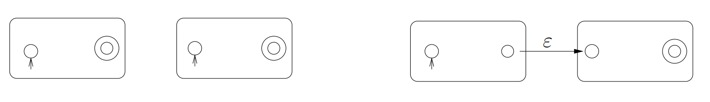

# Teoretická informatika (TI)

- [1. Automaty](#1-automaty)
  - [1.1. Deterministický konečný automat](#11-deterministický-konečný-automat)
  - [1.2. Nedeterministický konečný automat](#12-nedeterministický-konečný-automat)
  - [1.3. Zobecněný nedeterministický konečný automat](#13-zobecněný-nedeterministický-konečný-automat)
  - [1.4. Aplikace](#14-aplikace)
- [2. Bezkontextové jazyky](#2-bezkontextové-jazyky)
  - [2.1. Zásobníkový automat](#21-zásobníkový-automat)
- [3. Chomského hierarchie](#3-chomského-hierarchie)
- [4. Turingův stroj](#4-turingův-stroj)
  - [4.1. Church-Turingova teze](#41-church-turingova-teze)
  - [4.2. Turingovsky úplné jazyky](#42-turingovsky-úplné-jazyky)
- [5. Stroj RAM](#5-stroj-ram)
- [6. Miscellaneous](#6-miscellaneous)
  - [6.1. SAT problém](#61-sat-problém)
- [7. Konfigurace strojů](#7-konfigurace-strojů)
  - [7.1. Jednopáskový Turingův stroj](#71-jednopáskový-turingův-stroj)
  - [7.2. Vícepáskový Turingův stroj](#72-vícepáskový-turingův-stroj)
  - [7.3. Stroj RAM](#73-stroj-ram)
  - [7.4. Graf řídícího toku](#74-graf-řídícího-toku)
  - [7.5. Minského stroj](#75-minského-stroj)
- [8. Rozhodovací problémy](#8-rozhodovací-problémy)
  - [8.1. Nerozhodnutelné problémy](#81-nerozhodnutelné-problémy)
    - [8.1.1. Halting problem](#811-halting-problem)
    - [8.1.2. Kachličkování roviny](#812-kachličkování-roviny)
  - [8.2. Částečně rozhodnutelné problémy](#82-částečně-rozhodnutelné-problémy)
  - [8.3. Doplňkové problémy](#83-doplňkové-problémy)
- [9. Převody mezi problémy](#9-převody-mezi-problémy)
- [10. Složitost algoritmů](#10-složitost-algoritmů)
  - [10.1. Turingův stroj](#101-turingův-stroj)
  - [10.2. RAM stroj](#102-ram-stroj)
  - [10.3. Časová a prostorová složitost](#103-časová-a-prostorová-složitost)
  - [10.4. Asymptotická notace](#104-asymptotická-notace)
  - [10.5. Vzorce](#105-vzorce)
  - [10.6. Analýza rekurzivních algoritmů](#106-analýza-rekurzivních-algoritmů)
  - [10.7. Práce s velkými čísly](#107-práce-s-velkými-čísly)

**Algoritmus** — mechanický postup, jak něco spočítat. Algoritmy slouží k řešení různých problémů. Konkrétní vstup nějakého problému se nazývá **instance** problému.

V zadání problému musí být určeno:

- co je množinou možných vstupů,
- co je množinou možných výstupů,
- jaký je vztah mezi vstupy a výstupy.

<div class="warning">

Algoritmický problém je trojice (`IN`, `OUT` a `R`), kde `IN` je množina možných vstupů, `OUT` je množina možných výstupů a `R` je relace mezi vstupy a výstupy.

</div>

Problémům, kde množina výstupů je `{Ano/Ne}` se říká **rozhodovací problémy**.

**Optimalizační problém** je hledání nejlepšího řešení v množině různých řešení podle daného kritéria.

Problém je **řešitelný** právě tehdy, když existuje algoritmus, který pro libovolný přípustný vstup vrátí správný výstup v konečném čase.

Algoritmus **řeší** daný problém, pokud:

1. Se pro každý vstup po konečném počtu kroků zastaví.
2. Pro každý vstup vydá správný výstup.

**Korektnost algoritmu** — ověření toho, že daný algoritmus skutečně řeší daný problém.

**Výpočetní složitost algoritmu**:

- **Časová složitost** — jak závisí doba výpočtu na velikosti vstupu.
- **Paměťová (prostorová) složitost** — jak závisí množství použité paměti na velikosti vstupu.

> **(Formální) jazyk** $L$ v abecedě $\Sigma$ je libovolná podmnožina množiny > $\Sigma^*$, tj. $L\subseteq\Sigma^*$, kde
>
> - abeceda $\Sigma$ je neprázdná konečná množina symbolů,
> - slovo je konečná sekvence symbolů abecedy $\Sigma$,
> - jazyk je množina slov,
> - množina všech slov abecedy se označuje $\Sigma^*$.
>
> $L^+=L\cdot L^* = \bigcup\limits_{k\geq1}L^k$

## 1. Automaty

### 1.1. Deterministický konečný automat

>Deterministický konečný automat (DKA) je pětice $(Q, \Sigma, \delta, q_0, F)$, kde
>
>- $Q$ je neprázdná konečná množina stavů,
>- $\Sigma$ je abeceda (neprázdná konečná množina symbolů),
>- $\delta : Q \times \Sigma \rightarrow Q$ je přechodová funkce, tzn. dvojici (stav, symbol) přiřadí stav,
>- $q_0 \in Q$ je počáteční stav,
>- $F \subseteq Q$ je množina přijímajících stavů.
>
>DFA má pouze konečnou paměť. Např. není schopný vyřešit **parity problem** (kontrola uzavřených závorek).

### 1.2. Nedeterministický konečný automat

Nedeterministický konečný automat (NKA) se od DKA liší množinou počátečních stavů $I\subset Q$ a přechodovou funkcí $\delta : Q \times \Sigma \rightarrow \mathcal{P}(Q)$, kde $\mathcal{P}$ je potenční množina.

### 1.3. Zobecněný nedeterministický konečný automat

Zobecněný nedeterministický konečný automat (ZNKA) se od NKA liší jen přechodovou funkcí $\delta : Q \times (\Sigma\cup\{\varepsilon\}) \rightarrow \mathcal{P}(Q)$.

### 1.4. Aplikace

1. Převod konečného automatu na regulární výraz

    

2. Zřetězení jazyků

    

3. Iterace jazyků

    

4. Sjednocení jazyků

    

## 2. Bezkontextové jazyky

> Bezkontextová gramatika je definována jako uspořádaná čtveřice $G = (\Pi, \Sigma, S, P)$, kde:
>
> - $\Pi$ je konečná množina *neterminálních symbolů* (neterminálů),
> - $\Sigma$ je konečná množina *terminálních symbolů* (terminálů), přičemž $\Pi \cap \Sigma = \emptyset$,
> - $S \in \Pi$ je *počáteční* (startovací) *neterminál*,
> - $P$ je konečná množina *pravidel* typu $A \rightarrow β$, kde:
>   - $A$ je neterminál, tedy $A \in \Pi$,
>   - $β$ je řetězec složený z terminálů a neterminálů, tedy $β \in (\Pi \cup \Sigma)^*$.

Pokud je jazyk regulární, tak je bezkontextový.

### 2.1. Zásobníkový automat

> Zásobníkový automat (ZA) $M$ je definován jako šestice $M = (Q, \Sigma, \Gamma, \delta, q_0, Z_0)$, kde:
>
> - $Q$ je konečná neprázdná množina *stavů*,
> - $\Sigma$ je konečná neprázdná množina *vstupních symbolů* (vstupní abeceda),
> - $\Gamma$ je konečná neprázdná množina *zásobníkových symbolů* (zásobníková abeceda),
> - $q_0 \in Q$ je *počáteční stav*,
> - $Z_0 \in \Gamma$ je *počáteční zásobníkový symbol* a
> - $\delta$ je zobrazení množiny $Q \times (\Sigma \cup \{\epsilon\}) \times \Gamma$ do množiny všech konečných podmnožin množiny $Q \times \Gamma^*$.


Alternativní zkrácený zápis:


<div class="warning">

**Ekvivalence bezkontextových gramatik a zásobníkových automatů.**

Ke každé bezkontextové gramtice $G$ lze sestrojit ekvivalentní (nedeterministický) zásobníkový automat. Navíc ke každému ZA lze sestrojit ekvivalentní bezkontextovou gramatiku.

</div>

## 3. Chomského hierarchie


- **Typ 0 - rekurzivně spočetné** jazyky:
  - obecné generativní gramatiky
  - Turingovy stroje (deterministické, nedeterministické)

- **Typ 1 - kontextové** jazyky:
  - kontextové gramatiky
  - nedeterministické lineárně omezené automaty

- **Typ 2 - bezkontextové** jazyky:
  - bezkontextové gramatiky
  - nedeterministické zásobníkové automaty

- **Typ 3 - regulární** jazyky:
  - regulární gramatiky
  - konečné automaty (deterministické, nedeterministické)
  - regulární výrazy

## 4. Turingův stroj

> Formálně je **Turingův stroj** definován jako šestice $\mathcal{M} = (Q, \Sigma, \Gamma, \delta, q_0, F)$ kde:
>
> - $Q$ je konečná neprázdná množina **stavů**.
> - $\Gamma$ je konečná neprázdná množina **páskových symbolů** (pásková abeceda).
> - $\Sigma \subseteq \Gamma$ je konečná neprázdná množina **vstupních symbolů** (vstupní abeceda).
> - $\delta : (Q \setminus F) \times \Gamma \to Q \times \Gamma \times \{-1, 0, +1\}$ je **přechodová funkce**.
> - $q_0 \in Q$ je **počáteční stav**.
> - $F \subseteq Q$ je množina **konečných stavů**.
>
> Předpokládáme, že v $\Gamma\setminus\Sigma$ je vždy speciální prvek $\square$ označující prázdný znak.

Oproti zásobníkovému automatu umožňuje navíc:

- pohyb "hlavy" oběma směry,
- možnost zápisu na "pásku" na aktuální pozici "hlavy",
- "páska" je nekonečná.

Příklad *přechodové funkce*: $\boxed{\delta(q_1, b)=(q_2,x,+1)}$. Jsem ve stavu $g_1$ a na pásce je znak $b$. Přejdu do stavu $q_2$, přepíšu znak na pásce na $x$ a posunu se na pásce o jedno pole doprava.

### 4.1. Church-Turingova teze

> Každý algoritmus lze realizovat Turingovým strojem.

<div class="warning">

Převod problému:

1. Program ve vyšším programovacím jazyce
2. Graf řídícího toku
3. Stroj RAM
4. Vícepáskový Turingův stroj
5. Jednopáskový Turingův stroj

</div>

### 4.2. Turingovsky úplné jazyky

Jazykům (resp. strojům), které jsou dostatečně obecné na to, aby se do nich (resp. do jejich instrukcí) daly přeložit programy napsané v libovolném jiném programovacím jazyce, se říká **Turingovsky úplné**.

## 5. Stroj RAM

**Stroj RAM (Random Access Machine)** je idealizovaný model počítače. Skládá se z těchto částí:

- **Programová jednotka** – obsahuje **program** stroje RAM a **ukazatel** na právě prováděnou instrukci.
- **Pracovní paměť** – tvořená buňkami očíslovanými $0, 1, 2, \dots$
  - Značíme $R_0, R_1, R_2, \dots$  
  - Obsah buněk je možné číst i do nich zapisovat.
- **Vstupní páska** – z ní je možné pouze číst.
- **Výstupní páska** – na ni je možné pouze zapisovat.


## 6. Miscellaneous

### 6.1. SAT problém

Je booleovská formule splnitelná?

$\varphi = x_1 \wedge (\neg x_2 \vee x_3)$

Lze nastavit $x_1,x_2,x_3$ tak, aby $\varphi$ byla pravdivá?

## 7. Konfigurace strojů

### 7.1. Jednopáskový Turingův stroj

- stav řídící jednotky
- obsah pásky
- pozice hlavy

### 7.2. Vícepáskový Turingův stroj

- stav řídící jednotky
- obsahy všech pásek
- pozice všech hlav

### 7.3. Stroj RAM

- adresa prováděné instrukce
- obsah pracovní paměti
- obsah vstupní a výstupní pásky

### 7.4. Graf řídícího toku

- řídící stav (vrchol v grafu řídícího toku)
- obsah paměti (hodnoty jednotlivých proměnných)

### 7.5. Minského stroj

- stav řídící jednotky
- hodnoty všech čítačů

## 8. Rozhodovací problémy

### 8.1. Nerozhodnutelné problémy

#### 8.1.1. Halting problem

- **Vstup:** Zdrojový kód programu P v jazyce L, vstupní data x.
- **Otázka:** Zastaví se program P po nějakém konečném počtu kroků, pokud dostane jako vstup data x?

Lze dokázat, že halting problem je nerozhodnutelný, ale je částečně rozhodnutelný.

<details><summary> Důkaz, že Halting problem je nerozhodnutelný </summary>

Předpokládejme, že existuje Turingův stroj $A$, který řeší Halting problem. Dále definujme nový Turingův stroj $B$, který příjímá vstup $x$ a simuluje běh $A$ na vstupu $x$. Pokud se $A$ zastaví, tak $B$ se zastaví a naopak. Tedy $B$ řeší Halting problem, což je spor.

Co se stane, pokud $B$ dostane na vstup $\langle B \rangle$

Tzn. pro každý algoritmus $A$ a vstup $x$ vždy správně rozhodne, zda $A$ se zastaví pro vstup $x$.

TODO

</details>

#### 8.1.2. Kachličkování roviny

Vstupem je množina typů kachliček, jako třeba:


Otázka je, zda je možné použitím daných typů kachliček pokrýt celou nekonečnou rovinu tak, aby všechny kachličky spolu sousedily stejnými barvami.

### 8.2. Částečně rozhodnutelné problémy

Rozhodovací problém $P$ je částečně rozhodnutelný, jestliže existuje algoritmus $A$, který:

- Pokud dostane jako vstup instanci problému $P$, pro kterou je správná odpověď **Ano**, tak se na tomto vstupu po konečném počtu kroků zastaví a dá odpověď **Ano**.
- Pokud dostane jako vstup instanci problému $P$, pro kterou je správná odpověď **Ne**, tak se na tomto vstupu *buď zastaví* a dá odpověď **Ne** *nebo* se na tomto vstupu *nikdy nezastaví*.

### 8.3. Doplňkové problémy

> Doplňkový problém k danému rozhodovacímu problému P je problém, kde vstupy jsou stejné jako u problému P a otázka je negací otázky z problému P.

<details><summary> Doplňkový problém k Halting problému: </summary>

- **Vstup:** Zdrojový kód programu P v jazyce L, vstupní data x.
- **Otázka:** Pokud program P dostane jako vstup data x, poběží do nekonečna (tj. nezastaví se na nich)?

</details>

<details><summary> Doplňkový problém k problému SAT: </summary>

```language
- **Vstup:** Booleovská formule ϕ.
- **Otázka:** Je formule ϕ nesplnitelná (tj. je kontradikcí)?
```

</details>

> **Postova věta**
>
> Pro každý rozhodovací problém P platí, že jestliže problém P i jeho doplňkový problém jsou částečně rozhodnutelné, pak je problém P rozhodnutelný.

## 9. Převody mezi problémy

> Pokud máme o nějakém (rozhodovacím) problému dokázáno, že je nerozhodnutelný, můžeme ukázat nerozhodnutelnost dalších problémů pomocí *redukcí (převodů) mezi problémy*.

Problém $P_1$ je převeditelný na problém $P_2$, jestliže existuje algoritmus $\text{Alg}$ takový, že:

- Jako vstup může dostat libovolnou instanci problému $P_1$.
- K instanci problému $P_1$, kterou dostane jako vstup (označme ji $w$), vyprodukuje jako svůj výstup instanci problému $P_2$ (označme ji $\text{Alg}(w)$).
- Platí, že pro vstup $w$ je v problému $P_1$ odpověď **Ano** právě tehdy, když pro vstup $\text{Alg}(w)$ je v problému $P_2$ odpověď **Ano**.


## 10. Složitost algoritmů

Uvažujme stroj $\mathcal{M}$. Můžeme definivat funkce **doba výpočtu** na daným vstupem a **množství paměti** použité při výpočtu nad daným vstupem:

$$
\begin{align*}
  \mathrm{time}_{\mathcal{M}}: \mathrm{input} \rightarrow \mathbb{N} \cup \{\infty\} \\
  \mathrm{space}_{\mathcal{M}}: \mathrm{input} \rightarrow \mathbb{N} \cup \{\infty\}
\end{align*}
$$

### 10.1. Turingův stroj

Buď TM $M=(Q,\Sigma,\Gamma,\delta,q_0,F)$:

$$
\mathrm{time}_{\mathcal{M}}: \Sigma^* \rightarrow \mathbb{N} \cup \{\infty\}
$$

Pro $w\in\Sigma^*$ je $\mathrm{time}_{\mathcal{M}}(w)$ počet kroků, které $\mathcal{M}$ vykoná při výpočtu nad vstupem $w$.

$$
\mathrm{space}_{\mathcal{M}}: \Sigma^* \rightarrow \mathbb{N} \cup \{\infty\},
$$

Pro $w\in\Sigma^*$ je $\mathrm{space}_{\mathcal{M}}(w)$ počet políček pásky, které $\mathcal{M}$ během výpočtu nad vstupem $w$ navštíví.

### 10.2. RAM stroj

Pro RAM stroj můžeme dobu výpočtu definovat dvěma způsoby:

- Jednotková míra - počet provedených instrukcí.
- Logaritmická míra - součet doby trvání jednotlivých instrukcí, doba trvání instrukce závisí na počtu bitů hodnot, se kterými pracuje (např. násobení dvou $n$-bitových čísel má logaritmickou míru $n^2$).

Pro množství paměti:

- Jednotková míra - počet použitých paměťových buněk.
- Logaritmická míra - maximální počet použitých paměťových buněk, které bylo potřeba v nějaké konfiguraci.

### 10.3. Časová a prostorová složitost

Buď $\mathrm{size(x)}$ **velikost vstupu** $x$. Pak **časovou složitost v nejhorším případě** definujeme jako:

$$
T(n) = \max\{\mathrm{time}_{\mathcal{M}}(x) \mid x\in\mathrm{input} \wedge \mathrm{size}(x) = n\}
$$

tj., funkci, která pro daný algoritmus a danou velikost vstupu přiřazuje každému přirozenému číslu $n$ maximální počet instrukcí, které algoritmus provede, pokud dostane vstup velikosti $n$.

Analogicky definujeme **prostorovou složitost v nejhorším případě**:

$$
S(n) = \max\{\mathrm{space}_{\mathcal{M}}(x) \mid x\in\mathrm{input} \wedge \mathrm{size}(x) = n\}
$$

**Časovou složitost v průměrném případě** definujeme jako aritmetický průměr $T(n)$.

### 10.4. Asymptotická notace

Buď $g : \mathbb{N} \to \mathbb{N}$. Pak pro $f : \mathbb{N} \to \mathbb{N}$ platí:

1. $\boxed{f \in \mathcal{O}(g)}\iff(\exists c > 0)(\exists n_0 \geq 0)(\forall n \geq n_0) :$

    $$
    \boxed{f(n) \leq c \cdot g(n)}
    $$

2. $\boxed{f \in \Omega(g)}\iff(\exists c > 0)(\exists n_0 \geq 0)(\forall n \geq n_0) :$

    $$
    \boxed{f(n) \geq c \cdot g(n)}
    $$

3. $\boxed{f \in \Theta(g)}\iff$

    $$
    \boxed{f \in \mathcal{O}(g) \wedge f \in \Omega(g)}
    $$

4. $\boxed{f \in \omicron(g)}\iff(\exists c > 0)(\exists n_0 \geq 0)(\forall n \geq n_0) :$

    $$
    \boxed{f(n) < c \cdot g(n)}
    $$
    $$
    \Updownarrow
    $$
    $$
    \boxed{\lim_{n \to +\infty} \frac{f(n)}{g(n)} = 0}
    $$

5. $\boxed{f \in \omega(g)}\iff(\exists c > 0)(\exists n_0 \geq 0)(\forall n \geq n_0) :$

    $$
    \boxed{f(n) > c \cdot g(n)}
    $$
    $$
    \Updownarrow
    $$
    $$
    \boxed{\lim_{n \to +\infty} \frac{f(n)}{g(n)} = +\infty}
    $$

> Poznámka: Existují dvojice funkcí $f,g\colon\mathbb{N}\rightarrow\mathbb{N}$, s.t.
>
>$$f\in\mathcal{O}(g) \quad\text{a}\quad g\notin\mathcal{O}(f),$$
>
>např.:
>
> $$
f(n)=n \quad\text{a}\quad
g(n) =
\begin{cases}
n^2 & \text{if } n \bmod 2 = 0, \\
\lceil \log_2 n \rceil & \text{otherwise.}
\end{cases}
$$

Platí, že pokud $f\in\mathcal{O}(g)$, tak i $f + g\in\mathcal{O}(g)$.

Často se proto při analýze celkové časové složitosti $T(n)$ omezíme jen na analýzu nejčastěji prováděné instrukce.

> O funkci $f$ řekneme, že je:
>
> - **logaritmická**, pokud $f(n) \in \Theta(\log n)$
> - **lineární**, pokud $f(n) \in \Theta(n)$
> - **kvadratická**, pokud $f(n) \in \Theta(n^2)$
> - **kubická**, pokud $f(n) \in \Theta(n^3)$
> - **polynomiální**, pokud $f(n) \in O(n^k)$ pro nějaké $k > 0$
> - **exponenciální**, pokud $f(n) \in O(c^{n^k})$ pro nějaké $c > 1$ a $k > 0$

Pro konkrétní problém můžeme mít dva algoritmy takové, že jeden má menší prostorovou složitost a druhý zase menší časovou složitost.

Pokud je časová složistost v $\mathcal{O}(f(n))$, pak je i prostorová složitost v $\mathcal{O}(f(n))$.

>Funkce $f$ je **polynomiální**, jestliže je shora omezena nějakým polynomem, tj. jestliže existuje nějaká konstanta $k$ taková, že $f \in O(n^k)$.
>
>Polynomiální jsou například funkce, které patří do následujících tříd:
>$$O(n), \quad O(n \log n), \quad O(n^2), \quad O(n^5), \quad O(\sqrt{n}), \quad O(n^{100})$$
>
>**Polynomiální algoritmus** je algoritmus, jehož časová složitost je polynomiální — tj. shora omezená nějakým polynomem (tedy v $O(n^k)$, kde $k$ je nějaká konstanta).

### 10.5. Vzorce

Logaritmus:

$$
\log_a b = x \iff a^x = b
$$

Součet aritmetické posloupnosti:
$$
\sum_{i=0}^{n-1} a_i = \frac{1}{2} n (a_0 + a_{n-1})
$$

Součet geometrické posloupnosti (kde $q \neq 1$):

$$
\sum_{i=0}^{n} a_i = a_0 \frac{q^{n+1} - 1}{q - 1}
$$

### 10.6. Analýza rekurzivních algoritmů

**Rekurzivní algoritmus** je algoritmus, který převede řešení původního problému na řešení několika podobných problémů pro menší instance.

> Master Theorem
>
> Předpokládejme, že $a \geq 1$ a $b > 1$ jsou konstanty, že $f:\mathbb{N}\rightarrow\mathbb{N}$, a že funkce $T(n)$ je definována rekurentním předpisem
>
> $$T(n) = a \cdot T\left(\frac{n}{b}\right) + f(n)$$
>
> (kde $n/b$ může být buď $\lfloor n/b \rfloor$ nebo $\lceil n/b \rceil$). Pak platí:
>
> 1. Pokud $f(n) \in O(n^{\log_b a - \varepsilon})$ pro nějakou konstantu $\varepsilon > 0$, pak
>    $$ T(n) = \Theta(n^{\log_b a}).$$
>
> 2. Pokud $f(n) \in \Theta(n^{\log_b a})$, pak
>    $$T(n) = \Theta(n^{\log_b a} \log n).$$
>
> 3. Pokud $f(n) \in \Omega(n^{\log_b a + \varepsilon})$ pro nějakou konstantu $\varepsilon > 0$ a pokud $a \cdot f\left (\frac{n}{b}\right) \leq c \cdot f(n)$ pro nějakou konstantu $c < 1$ a všechna dostatečně velká $n$, pak
>    $$T(n) = \Theta(f(n)).$$

Master theorem je možné použít pro analýzu složitosti takových rekurzivních algoritmů, kde:

1. Řešení jednoho podproblému velikosti $n$, kde $n > 1$, se převede na řešení $a$ podproblémů, z nichž každý má velikost $\frac{n}{b}$.
2. Doba, která se stráví řešením jednoho podproblému velikosti $n$, bez doby v rekurzivních voláních, je určena funkcí $f(n)$.

<details><summary> Příklad: Algoritmus Merge-Sort </summary>

Pro algoritmus Merge-Sort máme:

- $a = 2$ ...počet podproblémů
- $b = 2$ ...velikost podproblému $n/2$
- $f(n) \in \Theta(n)$ ...spojení dvou seřazených sekvencí v čase $\Theta(n)$

Platí, že $f(n) \in \Theta(n^{\log_b a}) = \Theta(n)$, takže podle Master theorem máme:

$$
T(n) \in \Theta(n^{\log_b a} \log n) = \Theta(n \log n).
$$

</details>

### 10.7. Práce s velkými čísly

$$
u = \sum_{i=0}^{n-1} U[i] \cdot q^i
$$

Na takto uložené číslo se můžeme dívat tak, že jde o zápis čísla $u$ v číselné soustavě o základu $q$, a prvky pole $U$ představují jednotlivé "čílice" tohoto zápisu.

Sčítání/odčítání lze provést "školním" způsobem $\mathcal{O}(n)$. Násobení "školním" způsobem $\mathcal{O}(n^2)$. Nicméně existuje rekurzivní algoritmus - **Karacubovo násobení** - který má složitost $\mathcal{O}(n^{\log_2 3}) \sim \mathcal{O}(n^{1.59})$.

Podobně existuje **Strassenův algoritmus** pro násobení matic s časovou složitostí $\mathcal{O}(n^{\log_2 7}) \sim \mathcal{O}(n^{2.81})$.
