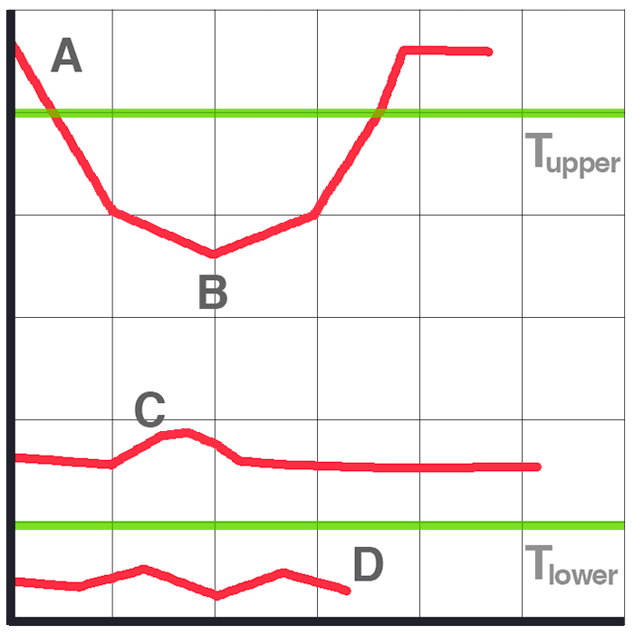
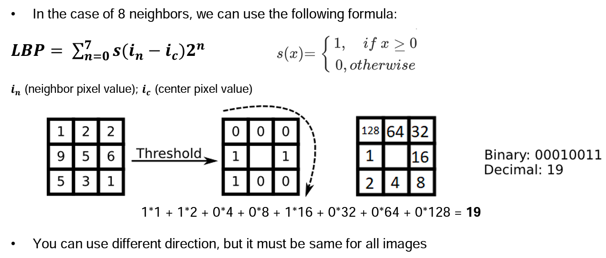
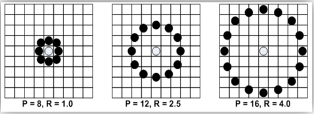
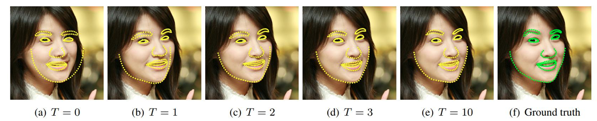
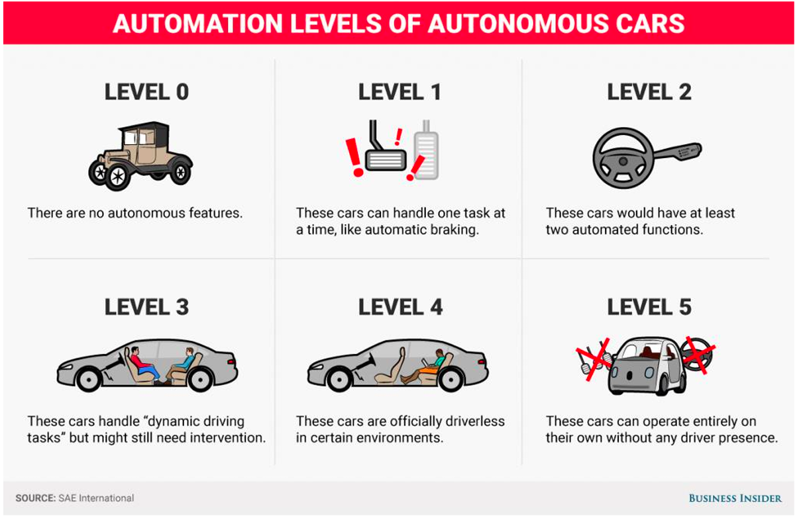

# Introduction to Image Analysis

## VENV

How to create virtual environment?

- `python3 -m venv .venv`
- `. .zao/bin/activate`

## Úlohy při zpracování obrazu

- vylepšení / filtrace
- detekce hran
- detekce objektů
  - nalezení ROI (souřadnice a měřítko objektu)
- rozpoznání objektů
  - identifikace do kategorií
  - rozpoznávání obličejů
- sledování objektů *(object tracking)*
  - odhad trajektorie
- segmentace
  - rozdělení obrazu na více oblastí
- detekce lidské pózy *(human pose detection)*

## Template matching

- jednoduchá metoda pro lokalizaci objektů
- potřebuju *template* a *zdrojový obraz* (source)
- porovnává se template a část zdrojového obraz

Jak porovnat *template* a *source*?

- suma absolutních rozdílů
  - $SAD=\sum\limits_{x,y}\lvert (I_1)_{x,y} - (I_2)_{x,y}\rvert$
- suma čtvercových rozdílů
  - $SSD=\sum\limits_{x,y}\left[ (I_1)_{x,y} - (I_2)_{x,y}\right]^2$
- vzájemná korelace (cross correlation)
  - $CC=\sum\limits_{x,y}\left[ (I_1)_{x,y} \cdot (I_2)_{x,y}\right]$
- odpovídající normované varianty a další

## Morfologické operace

- často používané na binárním obraze
- potřebujeme zdrojový obrázek a **kernel**
- kernel se postupně *přikládá* na zdrojový obrázek a překrývající se pixely se vyhodnocují
- kernel může být třeba `np.ones((5,5),np.uint8)`, nebo taky elipsa, kříž atd.
- lze zobecnit na grayscale popř. barevné obrazy
  
### Dilatace (Dilation)

- pixel bude mít hodnotu **1** právě tehdy, když **alespoň jeden** pixel "pod" kernelem má hodnotu **1**, jinak je erodován (přepsán na nulu)
- zesvětluje barevný obraz

### Eroze (Errosion)

- pixel bude mít hodnotu **1** právě tehdy, když **všechny** jeden pixel "pod" kernelem má hodnotu **1**
- ztmavuje barevný obraz

### Otevření (Opening)

- eroze následování dilatací
- odstranění šumu

### Uzavření (Closing)

- dilatace následování erozí

### Morfologický gradient

- rozdíl mezi dilatací a erozí (SAD)

## Prahování (Thresholding)

- binární prahování
  - $(I_{dst})_{x,y} = \left\{\begin{array}{ll}
        \texttt{maxVal} &\texttt{if}\,\,(I_{src})_{x,y}\,\,>\,\,\texttt{threshold}\\
        0 &\texttt{otherwise}
    \end{array}\right.$

- invertované binární prahování
  - $(I_{dst})_{x,y} = \left\{\begin{array}{ll}
        0 &\texttt{if}\,\,(I_{src})_{x,y}\,\,>\,\,\texttt{threshold}\\
        \texttt{maxVal} &\texttt{otherwise}
    \end{array}\right.$

## Detekce hran

- hrany mohou být popsány změnami intenzit pixelů
- oblasti s velkými změnami v intenzitách pixelů značí hranu
- můžeme zkoumat změny v intenzitách sousedních pixelů
- pro detekci "něčeho" lze počítat počet *nenulových prvků* ve výsledném obraze detekce hran

### Sobel

- *horizontální změny*, např. s kernelem $3\times3$ ($\ast$ značí konvoluci):
  - $G_x=\begin{bmatrix}
    -1 & 0 & 1\\
    -2 & 0 & 2\\
    -1 & 0 & 1\\
\end{bmatrix}\ast I$

- *horizontální změny*, např. s kernelem $3\times3$ ($\ast$ značí konvoluci):
  - $G_y=\begin{bmatrix}
    -1 & -2 & 1\\
    0 & 0 & 0\\
    1 & 2 & 1\\
\end{bmatrix}\ast I$

- v každém bodě obrazu vypočtu aproximaci gradientu
  - $G =\sqrt{G_x^2-G_y^2}$  
  - nebo jednodušeji $G =|G_x|+|G_y|$  

Jak funguje konvoluce?

1. Střed kernelu je umístěn na určitý pixel vstupního obrazu.
2. Každý prvek jádra je vynásoben s odpovídajícím pixelem ve vstupním obraze.
3. Sečteme výsledek násobení.
4. Tento výsledek můžeme uložit do nového obrazu (mapy hran).

### Canny

1. Redukce šumu
2. Sobelovy filtry
3. Ztenčování hran - všechny hrany mají tloušťku jednoho pixelu
4. Prahování (thresholding)
  
#### Prahování

- dva prahy $T_{upper}$ a $T_{lower}$

- hrana $A$ je "jistá" hrana, protože $A > T_{upper}$
- hrana $B$ je taky hrana, přestože $B < T_{upper}$, protože je spojená s hranou $A$
- $C$ není hrana, protože $C < T_{upper}$ a zároveň $C$ není spojena se "silnou" hranou
- hrana $D$ je automaticky zahozena, protože $D < T_{lower}$

## Typy kernelů

- Sobel $3\times3$
  - $K_x=\begin{bmatrix}
    -1 & 0 & 1\\
    -2 & 0 & 2\\
    -1 & 0 & 1\\
\end{bmatrix}$
  - $K_y = K_x^T$
- Identita $3\times3$
  - $Id=\begin{bmatrix}
    0 & 0 & 0\\
    0 & 1 & 0\\
    0 & 0 & 0\\\end{bmatrix}$
- Normalizovaný box blur $3\times3$
  - $K=\frac{1}{9}\begin{bmatrix}
    1 & 1 & 1\\
    1 & 1 & 1\\
    1 & 1 & 1\\\end{bmatrix}$
- Gaussian blur (aproximace) $3\times3$
  - $K=\frac{1}{16}\begin{bmatrix}
    1 & 2 & 1\\
    2 & 4 & 2\\
    1 & 2 & 1\\\end{bmatrix}$
- Doostření (sharpen) $3\times3$
  - $K=\begin{bmatrix}
    0 & -1 & 0\\
    -1 & 5 & -1\\
    0 & -1 & 0\\\end{bmatrix}$

## Detekce objektů / obličejů

- **Haar** (sliding window)
- **HOG** (sliding window)
- **LBP** (sliding window)
- **SIFT, SURF** (zájmové body)
- **CNNs** (hluboké učení)

Jak funguje *sliding window*?

1. Vstupní obraz je snímán *obdélníkovým oknem* v několika měřítcích.
2. Výsledkem procesu skenování je velké množství různých dílčích oken.
3. Z každého dílčího okna je extrahován *vektor příznaků*.
4. Tento vektor se použije jako vstup pro klasifikátor. Tento klasifikátor musí být předem natrénovaný.
5. Cílem je vytvořit *bounding box* okolo hledaného objektu.

### Haar features (příznaky)

- Viola & Jones 2001
- hlavní myšlenka - obličeje mají podobné vlastnosti
  - oblast očí je tmavší něž líce, podobně čelo je obvykle světlejší než oči
  - ústa mají taky jiný jas
  - "nosní most" je světlejší než oči
- vezme se suma jasů v jednotlivých obdélnících a udělá se jejich rozdíl
- je nutná trénovací množina
- pro oči lze použít thresholding na bílou barvu

Jak funguje a co to je kaskádový klasifikátor?

- většina obrazu obvykle hledaný objekt neobsahuje, proto chceme tyto oblast co nejdříve zahodit
- kaskádový klasifikátor má několik fází, pokud je pravděpodobnost hledaného objektu v okně velká, tak se pokračuje do další fáze, jinak se okno zahodí (nebo něco takového)

## Rozpoznávání obličejů

1. Detekce obličeje
2. Extrakce ROI
3. Extrakce příznaků
4. Fáze rozpoznávání (klasifikace)

### Local Binary Patterns (LBP)

- Ojala et al.
- [Tutorial](https://docs.opencv.org/2.4/modules/contrib/doc/facerec/facerec_tutorial.html#local-binary-patterns-histograms)
- Hlavní myšlenkou LBP je, že lokální struktury obrazu (mikrovzory, jako jsou čáry, hrany, skvrny a ploché oblasti) lze efektivně zakódovat porovnáním každého pixelu s pixely sousedními.

- z LBP obrazu následně může sestavit histogram atd.

### Detekce obrazový zájmový bodů (Facial landmark detection - keypoint detection)

- obrazové zájmové body mohou být použity k lepšímu výřezu obličeje a zlepšit tak rozpoznávání
- Facial landmarks can be used to align facial imagesto improve face recognition.
- můžeme odhadovat pózu hlavy - kam se člověk dívá
- nahrazení obličeje
- detekce zavřených očí

S jakými problémy musíme počítat?

- póza - obličej zepředu, z profilu, shora, zespodu atd.
- brýle, vlasy
- výrazy obličeje, mimika
- osvětlení, stíny, jas

#### Kaskádová regrese (Cascaded Regression)

- tato metoda začíná z průměrného tvaru obličeje a iterativně posouvá zájmové body podle obrazových příznaků

#### Knihovny pro detekci zájmový bodů obličeje

- **OpenCV**
- **DLIB**
- **MediaPipe** (Google)

## Autonomí vozidla (AV -Autonomous Vehicle)

Autonomní vozidlo je vozidlo, které je schopné vnímat své okolí a bezpečně se pohybovat s malým nebo žádným lidským zásahem.

- pozemní vozidla
- drony
- NOMARS - No Manning Required Ship

### Senzory

- Lidar ("light detection and ranging"; např. firma Velodyne)
- Radar
- Kamery
- Mapy, GPS

Jak funguje LIDAR?

- Lidar používá laserové paprsky bezpečné pro oči, které "vidí" svět ve 3D (vytvářejí mračna 3D bodů) a poskytují počítačům prostorový obraz.
- Typický lidar emituje pulzy světla (vlnění) do svého okolí a toto vlnění se odráží od okolních objektů. Lidar tyto odražené vlny zaznamenává a počítá rozdíl v čase od vypuštění do zachycení.
- Tento proces se opakuje třeba milionkrát za sekundu.

Jaké má LIDAR výhody a nevýhody oproti kamerám?

- Nemůže detekovat barvy a interpretovat text, značky, semafory atd.
- Funguje velmi dobře i ve tmě.
- Přesnost.
- Vyšší cena a větší velikost (třeba nějaká "boule" na střeše)
- Poskytuje 3D obraz okolí.

Jaké výhody a nevýhody mají kamery?

- Rozpoznání barev, čtení dopravních značek.
- Moderní AI metody dokážou také vytvořit 3D obraz okolí (z dostatečného množství kamer).
- Vyžadují mnohem více výpočetního výkonu.
- Kamerové systémy jsou téměř neviditelné.
- Problémy za špatného světla.

### Úrovně autonomních vozidel

- Level 0 - žádná automatizace
  - Veškeré řízení provádí řidič,ale vozidlo může pomáhat s detekcí mrtvého úhlu, varováním před čelní srážkou a varováním před opuštěním jízdního pruhu.

- Level 1 - asistenční systémy
  - Vozidlo může být vybaveno některými aktivními asistenčními funkcemi, ale řidič je stále zodpovědný za řízení. Mezi takové asistenční funkce, které jsou v dnešních vozidlech k dispozici, patří adaptivní tempomat, automatické nouzové brzdění a udržování v jízdním pruhu.

- Level 2 - částečná automatizace
  - Řidič musí být stále ve střehu a neustále sledovat okolí, ale funkce jízdních asistentů, které ovládají zrychlování, brzdění a řízení, mohou pracovat společně, takže řidič nemusí v určitých situacích nic zadávat. Mezi takové automatizované funkce, které jsou dnes k dispozici, patří například samočinné parkování a asistent pro jízdu v dopravní zácpě (jízda v režimu "stop and go traffic").

- Level 3 - podmíněná automatizace
  - Vozidlo může za určitých okolností samo vykonávat některé úkony řízení, ale řidič musí být vždy připraven převzít kontrolu nad řízením v rámci stanovené doby. Ve všech ostatních případech vykonává řízení člověk.

- Level 4 - vysoká automatizace
  - Jedná se o samořiditelné vozidlo. Stále však má sedadlo řidiče a běžné ovládací prvky. Přestože vozidlo může řídit a "vidět" samo, okolnosti, jako je geografická oblast, podmínky na silnici nebo místní zákony, mohou vyžadovat, aby osoba na místě řidiče převzala řízení.
  - Pár taxíků v Americe.

- Level 5 - úplná automatizace
  - Vozidlo je schopno plnit všechny jízdní funkce za všech podmínek prostředí a může být provozováno s lidmi na palubě.Lidé na palubě jsou cestující a nemusí se nikdy podílet na řízení. Volant je v tomto vozidle volitelný.

